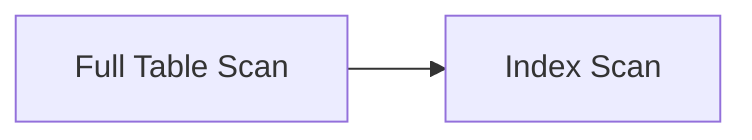
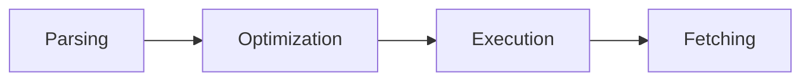
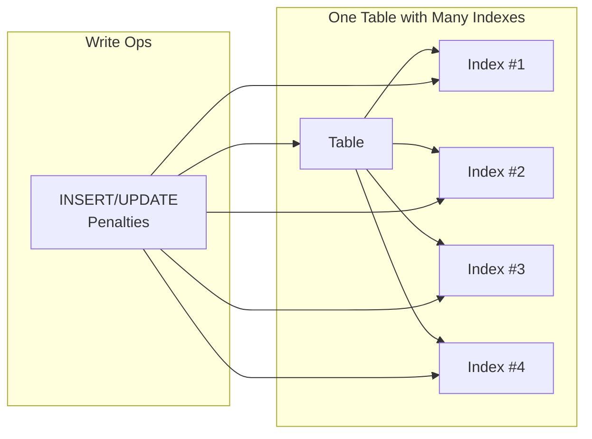
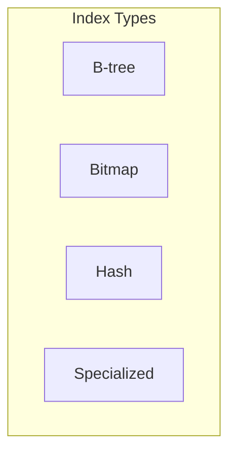

# Day 7 Quiz Questions

## Question 1: Database Performance Terminology  
🔍 Beginner-Level (Multiple Choice)

Mina often compares the database to a busy kitchen. In this analogy:  
- **Response time** is how quickly one order is prepared,  
- **Throughput** is how many orders can be served per hour, and  
- **Resource usage** is how overworked the kitchen staff gets.

Which of the following statements best represents how these three concepts interrelate?

A. Higher resource usage always ensures lower throughput.  
B. Improving response time never impacts throughput.  
C. Reducing resource usage and improving throughput often go hand in hand.  
D. Once throughput is high, response time cannot be improved further.

---

## Question 2: Missing Index Consequence  
🔍 Beginner-Level (Multiple Choice)

Mina once encountered a query running for 7 hours due to an unindexed filter column. Which of the following best describes why this query was so slow?

A. The optimizer automatically ignored the index.  
B. The table had only one row, causing overhead.  
C. A full table scan was performed on millions of rows.  
D. The hardware was insufficient to run queries.

---

## Question 3: Optimizer Assumptions  
🔍 Beginner-Level (True/False)

Mina warns that the query optimizer is not all-knowing. It can be misled by outdated statistics, leading to suboptimal plans.

A. True  
B. False

---

## Question 4: Index-Only Scan Concept  
🔍 Beginner-Level (Fill-in-the-Blank)

Complete the following statement:

An **index-only scan** allows a query to avoid reading the actual table because ________.

A. The table is too large to scan directly  
B. All the required columns are present in the index  
C. The optimizer always prefers an index in every query  
D. It requires zero maintenance overhead compared to a full scan  

---

## Question 5: Full Table Scan vs. Index Scan  
🔍 Beginner-Level (Multiple Choice with Diagram)

Examine the following simple Mermaid diagram comparing table scans to index scans:

Mina compares a full table scan to searching an entire phone directory, while an index scan is akin to jumping directly to the relevant section. If a large table has a highly selective condition in the WHERE clause, which approach is typically best?

A. Full table scan  
B. Index scan  
C. Ignore both scans and use hash joins only  
D. No difference in performance

---

## Question 6: Composite Index Leading Column  
🧩 Intermediate-Level (Multiple Choice)

You have a composite index on `(region, product_type)`. Your queries usually filter on `product_type` first, ignoring `region`. According to Mina’s principles, what is the likely impact?

A. The composite index will still be fully used.  
B. The index won’t help much because `region` is the leading column.  
C. The optimizer automatically reorders the columns in the index.  
D. The index will be more selective than a B-tree on a single column.

---

## Question 7: Indexing Anti-Patterns  
🧩 Intermediate-Level (Matching)

Match each anti-pattern in Column A with the reason it’s problematic in Column B.

**Column A:**
1. Index on low-cardinality column  
2. Too many indexes on one table  
3. Composite index in incorrect order  
4. No index on a heavily used filter column

**Column B:**
A. Full scans occur on large tables, causing massive I/O  
B. Increased maintenance and slower writes for minimal read benefit  
C. The leading column isn’t utilized, reducing index usefulness  
D. Wastes space and provides little performance gain for queries

---

## Question 8: Plan Estimates  
🧩 Intermediate-Level (True/False)

Mina notes that if the optimizer’s estimated rows are significantly different from actual rows, the plan may become suboptimal.

A. True  
B. False

---

## Question 9: Indexing for Low vs. High Cardinality  
🧩 Intermediate-Level (Multiple Choice)

Which statement best reflects Mina’s stance on indexing columns of varying cardinalities?

A. Low cardinality columns are always ideal for indexing.  
B. High cardinality columns benefit more from indexing in read-heavy workloads.  
C. Bitmap indexes should replace all B-tree indexes.  
D. Cardinality does not influence index utility.

---

## Question 10: Selectivity Principle  
🧩 Intermediate-Level (Fill-in-the-Blank)

Complete the following statement about selectivity:

“Mina emphasizes that a column’s ________ is crucial to determine if an index will significantly reduce the number of rows accessed.”

A. Data type  
B. Table size  
C. Selectivity  
D. Join condition  

---

## Question 11: Reading an Execution Plan  
💡 Advanced-Level (Multiple Choice with Diagram)

Observe this abbreviated Mermaid sequence showing a query’s journey:

Mina highlights that stale statistics can mislead the optimizer during the “Optimization” step. Which outcome might you see if the optimizer severely underestimates the row count?

A. It always chooses an index-only scan.  
B. It picks a less efficient plan (e.g., full scan) or poor join method.  
C. It automatically refreshes statistics.  
D. It halts the query until statistics are corrected.

---

## Question 12: Index Sprawl  
💡 Advanced-Level (Multiple Choice with Diagram)

Refer to the following Mermaid diagram illustrating “index sprawl”:

Mina warns about too many indexes on a single table. Why does this scenario often hurt overall performance?

A. It only affects small queries, not larger ones.  
B. Each new index reduces CPU usage.  
C. Every write must also update each index, adding overhead.  
D. Multiple indexes automatically merge into one larger index.

---

## Question 13: Index Type Matching  
💡 Advanced-Level (Matching with Diagram)

Match each index type with its primary characteristic. Use the Mermaid diagram below as a hint:

**Column A (Index Type):**
1. B-tree  
2. Bitmap  
3. Hash  
4. Specialized (e.g., full-text)  

**Column B (Characteristic):**
A. Excellent for exact match lookups, especially in certain in-memory contexts  
B. Efficient for filtering on low-cardinality columns (but can be costly on writes)  
C. Great for broad use cases; handles range queries well  
D. Tailored for specific workloads like geospatial or textual data

---

## Question 14: Plan Mismatch Scenario  
💡 Advanced-Level (Multiple Choice)

If Mina notices a plan where estimated rows are 10 but actual rows are 10,000, how should she typically respond?

A. Assume the optimizer will adapt mid-query with no action needed.  
B. Update or refresh statistics so the optimizer has accurate data.  
C. Remove all indexes to force a simpler plan.  
D. Convert the table to a different engine immediately.

---

## Question 15: Execution Steps for a Slow Query  
💡 Advanced-Level (Ordering)

Arrange the following steps in the correct sequence based on Mina’s approach to diagnosing and fixing a slow query:

A. Verify the new execution plan  
B. Identify if a missing or poor index is the culprit  
C. Refresh statistics or create an appropriate index  
D. Gather plan estimates and actual row data  

---

**End of Quiz**  

**Instructions to the learner**: You have 15 questions spanning multiple choice, true/false, fill-in-the-blank, matching, and an ordering question. Refer to Mina’s training material on indexing strategies, query execution plans, and performance fundamentals for the underlying concepts. No answer explanations are provided here—those will be given in a separate answer key.  