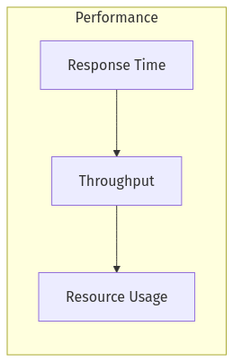
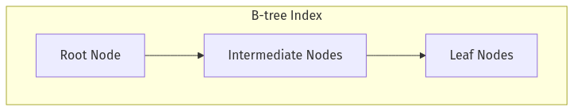
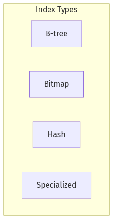
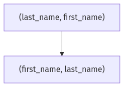
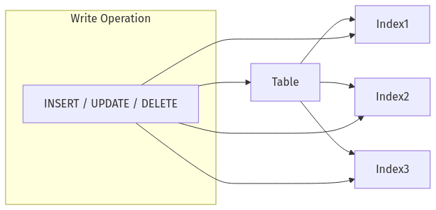
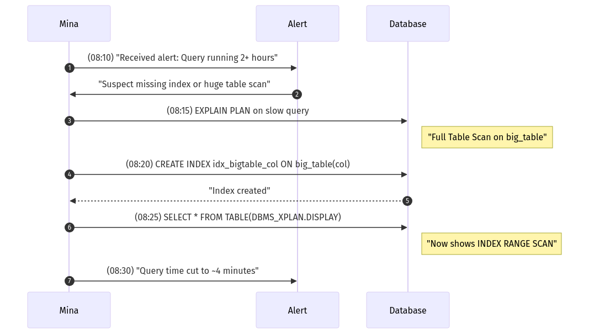
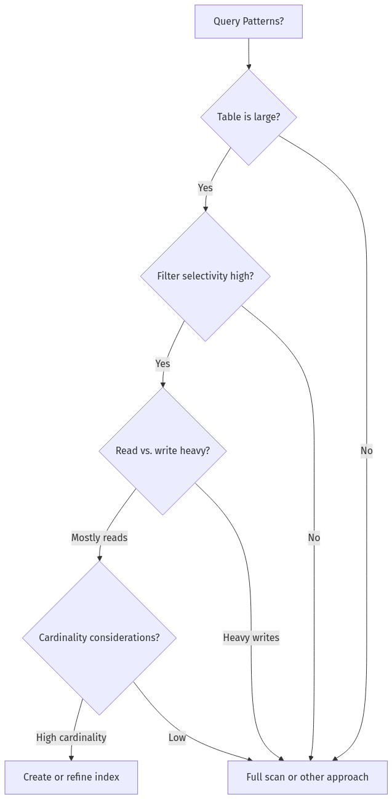
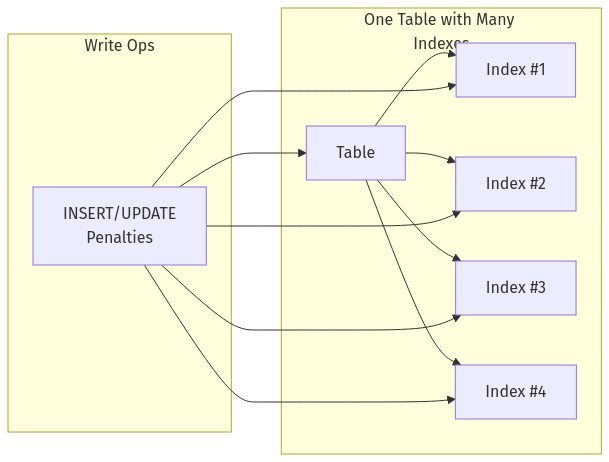

Below is a **newly generated Day 7 training document** that merges the relevant Day 7 material from **day-7_8_training_material.md** citeturn14file1 with the instructions in **day_07_prompt_tf_v1.md** citeturn14file0. It features **Mina** in Lagos at 08:00 WAT—our blunt, no-nonsense performance tuning engineer—focusing exclusively on **indexing strategies, execution plans, and query performance fundamentals**. The structure and content follow the original Day 7 module’s concepts but are narrated entirely in Mina’s voice, with additional examples and personal war stories.

---

# **The Follow-the-Sun Chronicles: Day 7 – Mina & the Revenge of the Query Plan**

> **Character Profile**  
> - **Name:** Mina  
> - **Location:** Lagos, Nigeria (08:00 WAT)  
> - **Role:** Performance tuning engineer & index strategist  
> - **Personality:** Blunt, no-nonsense, laser-focused on execution plans. Judges bad indexes from across the room, speaks with authority earned from rescuing queries from slow-motion disasters.

---

## **1. Incident Vignette: The 7-Hour Unindexed Query**

Picture this: I walk into the office at 08:00 WAT, only to find a reporting query had been **running for 7 hours**, scanning 9 million rows unindexed. Everyone was panicking—“Could it be a hardware issue?” “Do we need more CPU?” I took one look at the plan: **no index** on the main filter column. A simple B-tree index later, that same query finished in under 2 minutes. 

This fiasco proves what I’ve seen a thousand times: **lack of proper indexing** is the biggest culprit in query performance nightmares. Let me show you how to do it right.

---

## **2. Day 7 Overview (Mina’s Performance Manifesto)**

### 🔍 **Beginner Objectives**
1. **Grasp** fundamental performance terms (response time, throughput, resource usage).  
2. **Explain** how indexes drastically reduce I/O.  
3. **Read** a simple execution plan to identify full scans vs. index scans.  
4. **Spot** typical performance pitfalls (missing indexes, suboptimal indexing).

### 🧩 **Intermediate Objectives**
1. **Compare** index types (B-tree, bitmap, composite) and choose wisely.  
2. **Interpret** EXPLAIN plans in Oracle/Postgres/SQL Server.  
3. **Design** multi-column indexes effectively.  
4. **Resolve** common indexing issues (unused or overlapping indexes).

### 💡 **Advanced/SRE Objectives**
1. **Manage** indexes at scale (partial, automated, partitioned).  
2. **Optimize** complex queries by analyzing advanced plan details.  
3. **Monitor** index usage vs. overhead, balancing read vs. write.  
4. **Develop** an iterative tuning approach using real metrics.

> **Mina’s Motto**: “I’ve fixed queries 300x slower than necessary. Trust me, an index can make or break your entire system.”

---

## **3. Observe, Test, Evaluate, and Take Action: Performance Edition**

Just like previous days, we apply the SRE cycle:

1. **Observe**: Identify slow queries, measure row scans.  
2. **Test**: Try adding an index or rewriting a query.  
3. **Evaluate**: Check new plan, gather CPU/IO usage.  
4. **Take Action**: Deploy changes and watch your meltdown vanish.

---

## **4. The 10 Core Concepts (Indexing & Query Performance)**

I’ll walk you through each with my personal experience, common mistakes, and how I learned the hard way. Let’s dive in.

---

### **4.1 Database Performance Fundamentals**

**Analogy**  
Think of your database like a busy kitchen. **Response time** is how quickly one order is served, **throughput** is how many orders per hour, and **resource usage** is how exhausted your chefs get.





**Mina’s Experience**  
I once fixed a system that doubled CPU just from a single missing index—**response time** soared, **throughput** sank. Everyone blamed hardware; I found the real culprit in 5 minutes.

**Common Mistake**  
People ignore the synergy between response time and throughput. Fixing large scans improves both.

**Hard Lesson**  
Better to measure and fix the root cause than to keep scaling up hardware aimlessly.

---

### **4.2 Query Execution Lifecycle: Parse → Optimize → Execute → Fetch**

**Analogy**  
A traveler planning a road trip: you map the route (parse), decide the best path (optimize), drive it (execute), then arrive (fetch results).


**Mina’s Commentary**  
I’ve seen queries re-parse thousands of times, or pick a stupid plan if the optimizer is misled by old stats. “Optimize” is crucial.

**Common Mistake**  
Assuming the optimizer is omniscient. If your stats are stale or your query is weirdly structured, it might guess poorly.

**Lesson Learned**  
Always keep stats fresh, or you risk a meltdown.

---

### **4.3 Table Access Paths: Full Table Scan, Index Scan, Index-Only Scan**

**Analogy**  
- **Full Scan**: Read an entire phone directory for one name.  
- **Index Scan**: Use the phone book’s index to jump closer.  
- **Index-Only Scan**: You never even look at the actual phone book, just the index (if it has all the needed data).


**Mina’s War Story**  
I once fixed an analytics query scanning 10 million rows. Turned out they only needed 50K. An index soared performance from 40 minutes to under 1 minute.

**Lesson**  
Full scans can be fine on small tables, but they’re disastrous on large ones.

---

### **4.4 What Are Indexes?**  
*(B-Tree vs. Others)*

**Analogy**  
A B-tree index is like an ordered card catalog in a library. You quickly jump to the relevant section.





**Mina’s Observations**  
B-trees handle range queries well, but a poorly chosen index can hamper writes. Also, watch for index bloat if you never maintain them.

**Common Mistake**  
Indexing columns that rarely help filters. That’s overhead with no read benefit.

---

### **4.5 How Indexes Speed Up Queries**  
*(Reducing I/O, Sorting, Constraints)*

**Analogy**  
Imagine you want to find the “S” section in a library—**index** takes you straight there instead of rummaging every shelf.


**Mina’s Lesson**  
A covering index can skip the table altogether—**index-only scan**. Once improved a daily batch job by 2 hours because the table was never touched.

**Performance**  
Indexes are your best friend for read-heavy systems, but every new index is a burden on inserts/updates.

---

### **4.6 Index Types: B-tree, Bitmap, Hash, Specialized**

**Analogy**  
- **B-tree**: Standard alphabetical phone book.  
- **Bitmap**: A punch card with checkboxes for each row ID.  
- **Hash**: A direct address table for exact matches.  
- **Specialized**: Full-text or geospatial indexes.





**Mina’s War Story**  
I once replaced a B-tree with a bitmap index on a low-cardinality “status” column in Oracle, slicing query time from 1 minute to 5 seconds—but we had to be sure writes were minimal. If it were heavy writes, it’d be a disaster.

---

### **4.7 Index Design Principles**  
*(Selectivity, Cardinality, Overhead)*

**Analogy**  
You only buy a specialized tool if you’ll use it often enough. The same with indexes: they must be selective enough.


**Mina’s “Gotcha”**  
Indexing a column with only two distinct values (like “active/inactive”) rarely helps. I once found 7 boolean indexes hammered write performance with no read gain.

---

### **4.8 Multi-Column (Composite) Indexes, Key Order Importance**

**Analogy**  
If you sort your address book by (last_name, first_name), searching by last_name alone is easy. Searching by first_name alone might skip the leading column.





**Mina’s Rant**  
I once saw a dev add `(colB, colA)` though queries always filtered on `colA`. The index was rarely used. Always put the more selective or leading filter first.

---

### **4.9 Reading Execution Plans Like Mina**  
*(Side-by-side comparison, plan differences)*

**Analogy**  
Think of a GPS route: one route might say “10 miles, 10 minutes,” another says “15 miles, 12 minutes.” But if the data is outdated, you could end up stuck in traffic.

#### **Plan Comparison: Underestimated vs. Real**

- **Estimated**: The optimizer thinks 10 rows, but reality is 10K.  
- **Actual**: If that mismatch is huge, you might see a shift from index scan to full table scan mid-execution or a poor join choice.

**PLAN Snippet**:

```
-----------------------------------------------------------------------------------
| Id | Operation          | Name            | Rows (Est) | Rows (Actual) |
-----------------------------------------------------------------------------------
|  0 | SELECT STATEMENT   |                 | 10         | 10000         |
|  1 |  TABLE ACCESS FULL | big_table       | 10         | 10000         |
-----------------------------------------------------------------------------------
```

**Mina’s Explanation**:  
Stale stats misled the optimizer, so it expected 10 rows. Instead, scanning 10K resulted in a full table read. Updating stats or forcing an index might fix it.

**TABLE ACCESS FULL**: Not always evil on small sets, but can be a meltdown on huge sets.  
**INDEX RANGE SCAN**: Typically used for filters returning a subset.  
**INDEX FULL SCAN**: Reads the entire index in sorted order—useful for `ORDER BY`.

**Oracle**: Tools like `V$SQL_PLAN` trace real usage.  
**Postgres**: `pg_stat_statements` plus `EXPLAIN (ANALYZE, BUFFERS)` track plan efficiency.

**Mina’s Strategy**  
1. Check estimated vs. actual.  
2. If mismatch is huge, stats might be stale or you need hints.  
3. If the plan changes frequently, consider pinning or improving the data distribution info.

---

### **4.10 Mina’s Table of Indexing Anti-Patterns**

| **Anti-Pattern**                     | **Why It’s Bad**                                    | **Mina’s Take**                                |
|--------------------------------------|------------------------------------------------------|------------------------------------------------|
| No index on filter columns           | Full scans everywhere                                | “This is DBA malpractice.”                     |
| Index on low-cardinality columns     | Wastes space, hurts inserts, minimal speed-up       | “Don’t index booleans or yes/no columns.”      |
| Composite in wrong order             | Index not used if the query doesn’t filter on leading column | “Like alphabetizing by first name.”     |
| Too many indexes on one table        | Every write slows down, plus storage overhead       | “Death by a thousand cuts.”                    |
| Index without analyzing data distribution | Could be worse than no index, e.g., random plan flips | “Like bringing a knife to a gunfight.”  |
| Using the wrong index type           | Poor performance or overhead for your workload      | “Right tool, wrong job—know your data.”        |

**Mina’s Note**: “I’ve seen all these. Each leads to meltdown or wasted overhead.”

---

## **Index Sprawl: The Slow Death of Writes**





**Visualization**  
The more indexes you have, the more each write operation must update. If you have 15 indexes on a table, each insert might do 15 index writes. That’s index sprawl.

> **Mina’s Commentary**: “I’ve seen DBs where 40% of storage was wasted on indexes that barely got used. Remember: *Every unnecessary index is a performance tax on writes.* If you’re not measuring usage, you’re guessing.”

---

## **5. Mina’s Personal War Stories (Troubleshooting)**

### **War Story 1: Saving an E-commerce Search**

> “A dev said their search was slow. Turned out no index on `product_name`. I added a B-tree index. Search time dropped from 5 seconds to 100 ms. They called me a hero.”

---

### **War Story 2: 17 Indexes Killed Write Throughput**

> “I faced a table with 17 indexes. Their writes bogged down to 4 minutes for a small batch insert. We removed 9 redundant indexes and write times dropped to 30 seconds. Over-indexing is real.”

---

### **War Story 3: Composite Index Mystery**

> “A dev complained: ‘We have an index `(colB, colA)`—why is it never used for `WHERE colA=?`?’ Because the leading column was `colB`. Composite indexes are only as good as their leading column usage.”

---

## **6. Mina’s Training Drills (Day 7 Hands-On Exercises)**

### **🔍 Beginner**

1. **Create & Compare**: Build a B-tree index on a frequently used column, measure performance before/after.  
2. **Reading Execution Plans**: Run `EXPLAIN` on a known slow query, confirm if it uses your index.  
3. **Missing Index Identification**: Spot a slow query that does a full table scan. Decide which column to index.

### **🧩 Intermediate**

1. **Composite Index**: Make a multi-column index `(colX, colY)` and confirm if your query uses it in `EXPLAIN`.  
2. **Compare Full vs. Index**: Force a full table scan vs. an index scan with a hint. Record CPU/time differences.  
3. **Index Usage Stats**: Check your DB’s usage stats (Oracle’s `DBA_INDEX_USAGE`, Postgres’s `pg_stat_user_indexes`, or SQL Server’s DMVs). Identify any index rarely used.

### **💡 Advanced/SRE**

1. **Automated Index Scripts**: Evaluate built-in advisor suggestions. Accept or reject them with reasoning.  
2. **Covering Index**: Create an index that includes all columns needed by a query. Achieve an index-only scan.  
3. **Index Maintenance Overhead**: Insert thousands of rows repeatedly, measuring overhead as you add more indexes. Evaluate the break-even point.

---

## **7. Sequence Diagram: Mina Tracing a Slow Query**





**Mina’s Note**: “Still 4 minutes might be high, but we’re heading in the right direction. Next step: further refinements or rewriting the query.”

---

## **8. Mina’s Index Decision Tree: Do I Need an Index?**





**Explanation**: High cardinality, large table, read-intensive → likely an index helps. If it’s a small table, or columns are low cardinality with heavy writes, you might skip indexing.

---

## **9. Reading Execution Plans Like Mina**

**Side-by-Side Plan Comparison**:

- **Bad Estimate** vs. **Real**  
  - If the optimizer thinks 10 rows but actually sees 10K, it might skip an index or choose a bad join method.

**TABLE ACCESS FULL**: 
- Sometimes not evil if the table is small or you need most rows.

**INDEX RANGE SCAN** vs. **INDEX FULL SCAN**: 
- Range scan uses the index for selective conditions.  
- Full scan still reads the entire index in sorted order.

**Oracle Example**: Check `V$SQL_PLAN` for real-time usage.  
**Postgres Example**: `pg_stat_statements` + `EXPLAIN (ANALYZE, BUFFERS)`.  
**Mina’s Strategy**: Always compare estimated vs. actual rows. If they’re off by a factor of 10 or 100, your plan is likely suboptimal or stats are stale.

---

## **10. Mina’s Table of Indexing Anti-Patterns**

| **Anti-Pattern**                    | **Why It’s Bad**                                              | **Mina’s Take**                                    |
|-------------------------------------|---------------------------------------------------------------|----------------------------------------------------|
| No index on filter columns          | Full scans on big tables, indefinite meltdown                | “This is DBA malpractice.”                         |
| Index on low-cardinality columns    | Minimal speed-up, big overhead on writes                     | “Don’t index booleans or yes/no columns.”          |
| Composite in the wrong order        | Index rarely used if the leading column isn’t filtered first | “Like alphabetizing by first name—useless.”        |
| Too many indexes on one table       | Write overhead plus storage bloat                            | “Death by a thousand cuts.”                        |
| Indexing w/o data distribution check| Possibly worthless or detrimental (plan flips unpredictably) | “Like a random guess. Test it or pay the price.”   |
| Using the wrong index type          | Missed performance or overhead for your workload             | “Pick the right tool. Don’t use a hammer on screws.”|

---

## **Index Sprawl: The Slow Death of Writes**





**Mina’s Commentary**: *“I’ve seen DBs where 40% of storage was wasted by indexes that never got used. Every unneeded index taxes your writes.”*

---

## **Mina’s Query Tuning Commandments**

1. “**Thou shalt not** perform a full table scan on millions of rows if an index can help.”  
2. “**Thou shalt** measure actual row counts vs. estimates in the plan.”  
3. “**Thou shalt not** create an index blindly—test its read/write impact.”  
4. “**Thou shalt** keep your stats fresh. An outdated plan is a worthless plan.”  
5. “**Thou shalt** watch for index bloat—unused indexes hamper writes.”  
6. “**Thou shalt** avoid placing composite columns in the wrong order.”  
7. “**Thou shalt** see the plan as your map—never guess in the dark.”

---

## **Hands-On (Mina’s Training Drills)**

### **🔍 Beginner**

1. **Create & Compare**: Build a B-tree index on a large column, measure query times before/after.  
2. **Plan Reading 101**: `EXPLAIN` a slow query, check if it’s using an index or doing a full scan.  
3. **Identify Missing Index**: Spot a typically used filter column with no index, fix it.

### **🧩 Intermediate**

1. **Composite Index**: Make `(colA, colB)` for queries that filter on both columns. Confirm usage in `EXPLAIN`.  
2. **Index Type**: Evaluate a low-cardinality column. Should it be a bitmap (Oracle) or partial index (Postgres)?  
3. **Index Usage Stats**: Check your DB’s index usage views—drop or rename any that are rarely used.

### **💡 Advanced/SRE**

1. **Automated Indexing**: Evaluate Oracle or SQL Server’s suggestions or Postgres scripts. Keep or discard them with logic.  
2. **Covering Index**: Create an index that includes all columns for a popular SELECT. Achieve an index-only scan.  
3. **Index Overhead Simulation**: Insert thousands of rows into a test table with multiple indexes, measure how each index slows writes.  
4. **Design a Permission Escalation Alert** using logs + Slack (from previous user mgmt scenario) but watch how new indexes appear or vanish in usage stats.

*(Yes, the last is from Day 6 synergy, but this is advanced SRE practice.)*

---

## **11. Conclusion of Day 7 & Handoff to Elijah in Cape Town**

We’ve delved into indexing strategies, query plan fundamentals, and the perils of index sprawl. I hope you see how crucial it is to measure everything: row counts, cardinality, actual vs. estimated in the plan. One missed index can degrade performance for everyone.

**Next up is Day 8**, where **Elijah** in Cape Town will guide you through advanced optimization, monitoring dashboards, and performance incident triage. Remember: **no meltdown is unstoppable** if you measure carefully and tune iteratively.

**—Mina,** signing off. Let’s keep those queries in line and indexes in check.
