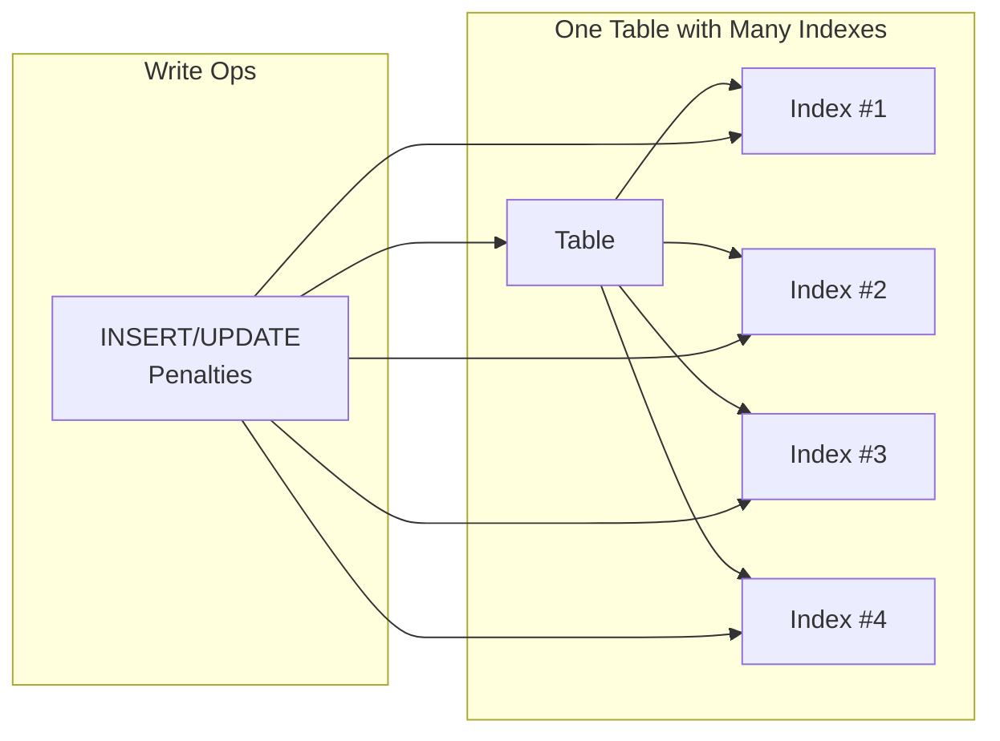
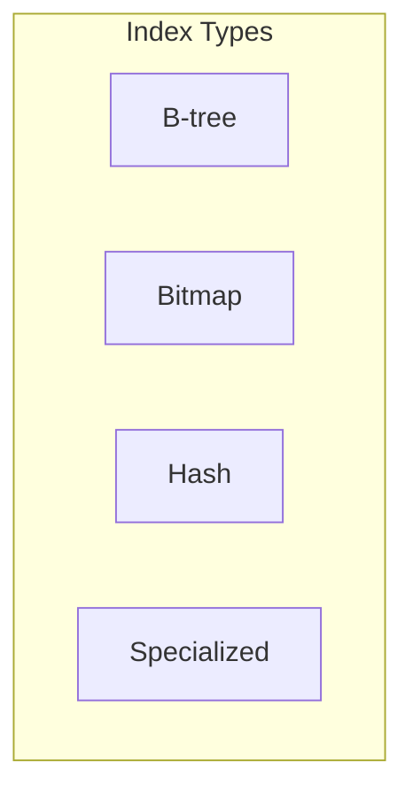

# Day 7 Answer Sheet.

## Answer 1: Database Performance Terminology  
🔍 Beginner-Level | Multiple Choice  

**Question:**  
Mina often compares the database to a busy kitchen. In this analogy:  
- **Response time** is how quickly one order is prepared,  
- **Throughput** is how many orders can be served per hour, and  
- **Resource usage** is how overworked the kitchen staff gets.

Which of the following statements best represents how these three concepts interrelate?

A. Higher resource usage always ensures lower throughput.  
B. Improving response time never impacts throughput.  
C. Reducing resource usage and improving throughput often go hand in hand.  
D. Once throughput is high, response time cannot be improved further.

**Correct Answer:** C  

**Explanation:**  
Reducing resource usage tends to streamline the entire system, often resulting in both better response times and higher throughput. Just as an overworked kitchen staff can slow down order delivery, high resource usage in a database can lower throughput. When you optimize queries or indexing, you reduce the overhead on CPU and I/O, freeing the database to handle more tasks in less time. This synergy is why Mina emphasizes looking at both response time and throughput together. The kitchen analogy helps illustrate that well-managed resources allow the system to scale effectively.

**Why other options are incorrect:**  
- A: Higher resource usage often results from inefficiency and does not guarantee lower response times or higher throughput.  
- B: Improving response time typically can improve throughput if the bottleneck involves slow queries or excessive I/O.  
- D: Even with high throughput, there can still be areas to optimize response time further, such as refining indexes or queries.  

**Database Comparison Note:**  
Across Oracle, PostgreSQL, and SQL Server, balancing resource usage and throughput is universally important; each database offers different tools (like various execution plan utilities) but the principle remains the same.

**Knowledge Connection:**  
Mina’s kitchen analogy in her training highlights how CPU, memory, and I/O demands can bottleneck overall performance if left unchecked.

**SRE Perspective:**  
An SRE looks not only at peak performance but also at system reliability under load. Proper resource management prevents downtime or degraded performance.

**Additional Insight:**  
Monitoring CPU, memory, and disk usage in real time provides early warnings of resource saturation, prompting you to optimize before a meltdown.

---

## Answer 2: Missing Index Consequence  
🔍 Beginner-Level | Multiple Choice  

**Question:**  
Mina once encountered a query running for 7 hours due to an unindexed filter column. Which of the following best describes why this query was so slow?

A. The optimizer automatically ignored the index.  
B. The table had only one row, causing overhead.  
C. A full table scan was performed on millions of rows.  
D. The hardware was insufficient to run queries.

**Correct Answer:** C  

**Explanation:**  
Without an index on a highly selective filter column, the database must scan every row in the table to find matching records. This can lead to massive I/O activity, especially if millions of rows are involved. Mina’s experience shows that adding a targeted index can drastically reduce query time because the engine no longer inspects irrelevant rows. Once the index is created, the optimizer can jump directly to the needed data.

**Why other options are incorrect:**  
- A: The optimizer did not “ignore” an index; the index simply did not exist in the first place.  
- B: Having only one row wouldn’t cause prolonged scanning; in fact, that would be trivial.  
- D: While hardware can be a factor, the primary issue was the lack of an appropriate index.  

**Database Comparison Note:**  
All major databases (Oracle, PostgreSQL, SQL Server) benefit from indexing columns in large tables. The exact syntax of index creation differs, but the performance principle is the same.

**Knowledge Connection:**  
Mina’s war stories emphasize that missing indexes are one of the most common and avoidable sources of performance meltdowns.

**SRE Perspective:**  
From an SRE viewpoint, you want to detect such issues proactively through query monitoring and index usage statistics so you can react before a 7-hour query occurs in production.

**Additional Insight:**  
Regularly auditing your top resource-consuming queries helps identify missing or underused indexes early.

---

## Answer 3: Optimizer Assumptions  
🔍 Beginner-Level | True/False  

**Question:**  
Mina warns that the query optimizer is not all-knowing. It can be misled by outdated statistics, leading to suboptimal plans.

A. True  
B. False  

**Correct Answer:** A (True)  

**Explanation:**  
The query optimizer relies heavily on statistics about data distribution and table size. If these statistics are stale or inaccurate, the optimizer may choose a plan that isn’t efficient—such as using a full table scan instead of an index scan. Mina emphasizes regularly updating or gathering statistics to keep the optimizer well-informed.

**Database Comparison Note:**  
Each database has its own tools for updating and maintaining statistics. For example, Oracle has `DBMS_STATS`, PostgreSQL uses `ANALYZE`, and SQL Server uses auto-updates if enabled.

**Knowledge Connection:**  
Mina teaches that fresh statistics are crucial—like having an up-to-date map before you plan a road trip.

**SRE Perspective:**  
Maintaining accurate statistics reduces the risk of performance incidents, improving reliability and service-level adherence.

**Additional Insight:**  
Automating statistics collection policies (e.g., daily or after a certain volume of data change) helps keep plans optimal.

---

## Answer 4: Index-Only Scan Concept  
🔍 Beginner-Level | Fill-in-the-Blank  

**Question:**  
Complete the following statement:

An **index-only scan** allows a query to avoid reading the actual table because ________.

A. The table is too large to scan directly  
B. All the required columns are present in the index  
C. The optimizer always prefers an index in every query  
D. It requires zero maintenance overhead compared to a full scan  

**Correct Answer:** B – All the required columns are present in the index  

**Explanation:**  
An index-only scan works by retrieving all the needed data directly from the index structure itself, bypassing the table blocks entirely. This significantly reduces I/O if the index covers all the columns used in the query’s SELECT and WHERE clauses. Mina views covering indexes as a potent way to speed up read-heavy workloads.

**Why other options are incorrect:**  
- A: Table size alone doesn’t enable an index-only scan.  
- C: The optimizer does not always prefer an index; it chooses based on cost estimates.  
- D: Index maintenance overhead still exists when you insert or update data.  

**Database Comparison Note:**  
All major databases can perform index-only scans or “covering index” scans, although the terminology and details differ slightly. PostgreSQL calls it “Index Only Scan,” while SQL Server uses “Index Intersection” or a covering index concept.

**Knowledge Connection:**  
Mina’s focus on covering indexes aligns with her approach of minimizing disk reads for performance.

**SRE Perspective:**  
Index-only scans can drastically reduce latency on high-traffic systems, thus aiding in meeting strict service level objectives.

**Additional Insight:**  
Including frequently used non-key columns in an index (when feasible) can eliminate the need to look up data from the table, accelerating read queries.

---

## Answer 5: Full Table Scan vs. Index Scan  
🔍 Beginner-Level | Multiple Choice with Diagram  

**Question:**  
Examine the following simple Mermaid diagram comparing table scans to index scans:

Mina compares a full table scan to searching an entire phone directory, while an index scan is akin to jumping directly to the relevant section. If a large table has a highly selective condition in the WHERE clause, which approach is typically best?

A. Full table scan  
B. Index scan  
C. Ignore both scans and use hash joins only  
D. No difference in performance  

**Correct Answer:** B  

**Explanation:**  
When a query filters on a column with high selectivity, the index scan is typically faster than reading the entire table. This is especially true with a large table where only a small subset of rows matches the condition. Mina’s phone directory analogy underscores that if you already know the specific “section” (key range), you skip scanning unnecessary data.

**Why other options are incorrect:**  
- A: A full table scan reads every row, which is inefficient for highly selective queries.  
- C: Hash joins are a join method, not a direct alternative to table/index scans.  
- D: Performance can differ dramatically; an index scan is often more efficient in this scenario.  

**Database Comparison Note:**  
Oracle, PostgreSQL, and SQL Server each display “INDEX RANGE SCAN” or similar operators in their plans when they find selective filters. The underlying optimization logic is similar.

**Knowledge Connection:**  
This question ties to Mina’s analogy about phone directories and shows how indexes reduce I/O by narrowing the data search.

**SRE Perspective:**  
Using the right access method reduces resource contention and helps maintain consistent performance under load.

**Additional Insight:**  
Occasionally, a full scan can still be preferable if the query returns most of the table, but that’s not the case for highly selective filters.

---

## Answer 6: Composite Index Leading Column  
🧩 Intermediate-Level | Multiple Choice  

**Question:**  
You have a composite index on `(region, product_type)`. Your queries usually filter on `product_type` first, ignoring `region`. According to Mina’s principles, what is the likely impact?

A. The composite index will still be fully used.  
B. The index won’t help much because `region` is the leading column.  
C. The optimizer automatically reorders the columns in the index.  
D. The index will be more selective than a B-tree on a single column.

**Correct Answer:** B  

**Explanation:**  
In a composite index, the database generally uses the leading column first. If queries filter primarily on the second column, the index may not be utilized efficiently. Mina’s teaching highlights the importance of choosing the leading column carefully based on the most common query predicates.

**Why other options are incorrect:**  
- A: It will not be “fully used” if the leading column isn’t in the query’s filter.  
- C: Most optimizers do not reorder the index columns on the fly.  
- D: Being composite doesn’t guarantee more selectivity if the leading column isn’t used.  

**Database Comparison Note:**  
All major RDBMS engines analyze the leading column in composite indexes similarly, although some (like PostgreSQL) can perform index skip scans under certain conditions. However, that is less common than simply re-creating the index in the right order.

**Knowledge Connection:**  
Mina’s “wrong order” rant about composite indexes comes directly from her war stories where developers inadvertently reversed columns.

**SRE Perspective:**  
In large-scale systems, misplaced leading columns in indexes lead to heavier I/O, higher CPU usage, and potential performance bottlenecks.

**Additional Insight:**  
Regularly reviewing query patterns to ensure they match your index definitions is a fundamental part of ongoing performance tuning.

---

## Answer 7: Indexing Anti-Patterns  
🧩 Intermediate-Level | Matching  

**Question:**  
Match each anti-pattern in Column A with the reason it’s problematic in Column B.

**Column A:**  
1. Index on low-cardinality column  
2. Too many indexes on one table  
3. Composite index in incorrect order  
4. No index on a heavily used filter column  

**Column B:**  
A. Full scans occur on large tables, causing massive I/O  
B. Increased maintenance and slower writes for minimal read benefit  
C. The leading column isn’t utilized, reducing index usefulness  
D. Wastes space and provides little performance gain for queries  

**Correct Matches:**  
1 → D  
2 → B  
3 → C  
4 → A  

**Explanation:**  
- (1) Indexing a low-cardinality column often wastes space and doesn’t significantly improve reads.  
- (2) Having many indexes on one table slows writes because every insert, update, or delete must maintain each index.  
- (3) A composite index becomes ineffective if the first column in the index is never used in the query filter.  
- (4) Failing to index a heavily used filter column forces unnecessary full scans, hammering system resources.

**Database Comparison Note:**  
In Oracle, PostgreSQL, and SQL Server, these anti-patterns arise in similar ways; the details of indexing might differ (e.g., partial indexes in PostgreSQL or function-based indexes in Oracle), but the fundamental issues remain universal.

**Knowledge Connection:**  
Mina’s “Index Anti-Patterns” table specifically warns about these pitfalls as common “DBA malpractice” she has encountered.

**SRE Perspective:**  
Preventing anti-patterns is critical in large systems to avoid meltdown situations when traffic spikes.

**Additional Insight:**  
Maintaining a clean, well-structured index strategy saves storage costs and improves overall query speed.

---

## Answer 8: Plan Estimates  
🧩 Intermediate-Level | True/False  

**Question:**  
Mina notes that if the optimizer’s estimated rows are significantly different from actual rows, the plan may become suboptimal.

A. True  
B. False  

**Correct Answer:** A (True)  

**Explanation:**  
The optimizer relies on row estimates to decide between different plan strategies such as index scans, full scans, or join methods. If these estimates differ greatly from actual row counts, the chosen plan can lead to higher CPU or I/O usage. Keeping statistics current ensures estimates are closer to reality, aligning the plan more closely with actual data patterns.

**Database Comparison Note:**  
Oracle, PostgreSQL, and SQL Server each provide ways to compare estimated vs. actual rows (e.g., `EXPLAIN (ANALYZE)` in Postgres, `SET STATISTICS IO ON` in SQL Server, or `DBMS_XPLAN.DISPLAY_CURSOR` in Oracle).

**Knowledge Connection:**  
Mina consistently highlights stale statistics as the root cause of many suboptimal plans.

**SRE Perspective:**  
Reliable performance is maintained when plans reflect real data distributions, minimizing unexpected spikes in resource usage.

**Additional Insight:**  
Consider scheduling automated processes to refresh statistics based on data modification thresholds, not just a fixed time interval.

---

## Answer 9: Indexing for Low vs. High Cardinality  
🧩 Intermediate-Level | Multiple Choice  

**Question:**  
Which statement best reflects Mina’s stance on indexing columns of varying cardinalities?

A. Low cardinality columns are always ideal for indexing.  
B. High cardinality columns benefit more from indexing in read-heavy workloads.  
C. Bitmap indexes should replace all B-tree indexes.  
D. Cardinality does not influence index utility.

**Correct Answer:** B  

**Explanation:**  
High cardinality columns (those with many distinct values) tend to benefit most from traditional B-tree indexing in read-heavy workloads because they can filter out a larger portion of unwanted rows. Low cardinality columns often yield minimal performance improvement but incur the same write overhead. Mina frequently stresses the significance of matching the column’s data distribution to the correct indexing strategy.

**Why other options are incorrect:**  
- A: Low-cardinality columns are usually poor candidates for conventional B-trees, though bitmap indexes might help in specific read-only or read-heavy contexts.  
- C: Bitmap indexes are useful in certain scenarios, but not a universal replacement for B-trees.  
- D: Cardinality is one of the primary factors in index design decisions.  

**Database Comparison Note:**  
Some databases (like Oracle) offer bitmap indexes, which are better suited for low-cardinality columns, but these can be problematic in high-write environments.

**Knowledge Connection:**  
Mina’s “Index Design Principles” revolve around ensuring the right type of index is chosen based on cardinality, selectivity, and workload.

**SRE Perspective:**  
For large-scale, read-heavy systems, focusing on indexing the high-cardinality columns first can yield immediate performance gains and reduce the risk of system overload.

**Additional Insight:**  
In mixed workloads, always weigh the cost of maintaining indexes (especially on frequent writes) against the potential benefits for read queries.

---

## Answer 10: Selectivity Principle  
🧩 Intermediate-Level | Fill-in-the-Blank  

**Question:**  
Complete the following statement about selectivity:

“Mina emphasizes that a column’s ________ is crucial to determine if an index will significantly reduce the number of rows accessed.”

A. Data type  
B. Table size  
C. Selectivity  
D. Join condition  

**Correct Answer:** C – Selectivity  

**Explanation:**  
Selectivity refers to how well a column’s values can narrow down the dataset. Highly selective columns with many distinct values are prime candidates for indexing, significantly reducing the rows the database must scan. Mina encourages checking selectivity because it directly correlates with how effective the index will be at filtering data.

**Why other options are incorrect:**  
- A: Data type alone (e.g., integer vs. varchar) doesn’t guarantee good selectivity.  
- B: Table size matters, but the core factor is how many rows you skip.  
- D: Join condition is important, but this statement specifically focuses on filter selectivity for an index.  

**Database Comparison Note:**  
All relational databases use a similar concept of selectivity in their query planners. The higher the selectivity, the better the index’s filtering power.

**Knowledge Connection:**  
Mina teaches that ignoring selectivity leads to wasted overhead on indexes that do not speed up queries.

**SRE Perspective:**  
High selectivity indexes can drastically reduce response times under heavy loads, thus helping meet performance SLAs.

**Additional Insight:**  
Tools like histograms (Oracle) or extended statistics (PostgreSQL) provide deeper insights into selectivity distribution.

---

## Answer 11: Reading an Execution Plan  
💡 Advanced-Level | Multiple Choice with Diagram  

**Question:**  
Observe this abbreviated Mermaid sequence showing a query’s journey:

Mina highlights that stale statistics can mislead the optimizer during the “Optimization” step. Which outcome might you see if the optimizer severely underestimates the row count?

A. It always chooses an index-only scan.  
B. It picks a less efficient plan (e.g., full scan) or poor join method.  
C. It automatically refreshes statistics.  
D. It halts the query until statistics are corrected.

**Correct Answer:** B  

**Explanation:**  
If the optimizer thinks only a few rows match when, in reality, thousands do, it could choose a plan that is suboptimal (like a nested loop join or unnecessary full scan). Mina’s experiences emphasize how misleading row estimates lead to poor choices that cause prolonged execution time. Proper statistics ensure the optimization phase picks the best path.

**Why other options are incorrect:**  
- A: An index-only scan isn’t guaranteed; it depends on the actual data and coverage.  
- C: The optimizer generally won’t auto-refresh; you must handle it.  
- D: The database won’t halt but will proceed with a possibly inefficient plan.  

**Database Comparison Note:**  
In Oracle, you might see a cardinality mismatch in the execution plan. PostgreSQL’s `EXPLAIN (ANALYZE)` reveals the difference between estimated and actual rows, and SQL Server’s execution plans also compare estimated vs. actual rows.

**Knowledge Connection:**  
This question directly references Mina’s approach of comparing estimated rows (plan) vs. actual rows (runtime).

**SRE Perspective:**  
Large discrepancies in row estimates can cause sudden spikes in CPU usage or I/O, jeopardizing service availability under load.

**Additional Insight:**  
Regularly examining plan output with real runtime counters helps refine indexing strategies and ensures more predictable performance.

---

## Answer 12: Index Sprawl  
💡 Advanced-Level | Multiple Choice with Diagram  

**Question:**  
Refer to the following Mermaid diagram illustrating “index sprawl”:

Mina warns about too many indexes on a single table. Why does this scenario often hurt overall performance?

A. It only affects small queries, not larger ones.  
B. Each new index reduces CPU usage.  
C. Every write must also update each index, adding overhead.  
D. Multiple indexes automatically merge into one larger index.

**Correct Answer:** C  

**Explanation:**  
Every additional index imposes extra work on insert, update, or delete operations. The database must modify each index entry when data changes, significantly increasing write latency. Mina calls this “index sprawl,” stressing that blindly adding indexes to fix read issues can degrade performance for writes.

**Why other options are incorrect:**  
- A: Index sprawl affects all queries that write data, not just small queries.  
- B: Adding more indexes typically raises CPU and I/O overhead for writes.  
- D: Indexes do not merge automatically; each index is maintained separately.  

**Database Comparison Note:**  
All major databases face overhead on writes if too many indexes exist. Some have features like “online index rebuild,” but sprawl is still costly.

**Knowledge Connection:**  
Mina’s repeated caution about “index performance tax” on writes illustrates how indexes can be both a blessing for reads and a burden for writes.

**SRE Perspective:**  
From an SRE standpoint, too many indexes can slow down data ingestion, leading to bottlenecks in critical transactional systems and possible SLA breaches.

**Additional Insight:**  
Periodically review index usage stats to identify rarely used indexes that can be dropped safely.

---

## Answer 13: Index Type Matching  
💡 Advanced-Level | Matching with Diagram  

**Question:**  
Match each index type with its primary characteristic. Use the Mermaid diagram below as a hint:

**Column A (Index Type):**  
1. B-tree  
2. Bitmap  
3. Hash  
4. Specialized (e.g., full-text)  

**Column B (Characteristic):**  
A. Excellent for exact match lookups, especially in certain in-memory contexts  
B. Efficient for filtering on low-cardinality columns (but can be costly on writes)  
C. Great for broad use cases; handles range queries well  
D. Tailored for specific workloads like geospatial or textual data  

**Correct Matches:**  
1 → C  
2 → B  
3 → A  
4 → D  

**Explanation:**  
- B-tree (1) is the standard, versatile index supporting range, equality, and partial matches effectively.  
- Bitmap (2) excels at low-cardinality filtering but can slow down writes due to overhead.  
- Hash (3) is best for single-value lookups where a hash function quickly locates the row, especially in memory-based systems.  
- Specialized (4) like full-text or geospatial indexes address very specific query patterns outside the scope of classic B-tree indexing.

**Database Comparison Note:**  
Oracle, for instance, supports bitmap indexes primarily for data warehousing. PostgreSQL offers hash indexes but they’re less used than B-tree. SQL Server mainly supports B-tree and specialized indexes like full-text but not bitmap indexes in the same way Oracle does.

**Knowledge Connection:**  
Mina’s reference to indexing “tools in a toolbox” shows how each index type suits a particular workload or data distribution.

**SRE Perspective:**  
Choosing the correct index type can help maintain both performance and reliability—using a heavy-write environment with an inappropriate index type can drastically degrade throughput.

**Additional Insight:**  
Always analyze workload patterns (read vs. write, cardinality, concurrency) before selecting an index type.

---

## Answer 14: Plan Mismatch Scenario  
💡 Advanced-Level | Multiple Choice  

**Question:**  
If Mina notices a plan where estimated rows are 10 but actual rows are 10,000, how should she typically respond?

A. Assume the optimizer will adapt mid-query with no action needed.  
B. Update or refresh statistics so the optimizer has accurate data.  
C. Remove all indexes to force a simpler plan.  
D. Convert the table to a different engine immediately.

**Correct Answer:** B  

**Explanation:**  
When there’s a large discrepancy between estimated and actual rows, the primary fix is to update statistics. Mina’s approach involves ensuring the optimizer sees the correct data distribution so it can generate the best plan. Without accurate statistics, the engine might consistently pick suboptimal strategies, leading to excessive resource usage.

**Why other options are incorrect:**  
- A: The optimizer typically does not fully adapt mid-query in most engines; it uses the plan it compiled at startup.  
- C: Removing all indexes rarely helps and would likely make things worse for most queries.  
- D: Switching engines is a major change and does not address the immediate statistics mismatch.  

**Database Comparison Note:**  
Oracle, PostgreSQL, and SQL Server each have tools to update or analyze statistics. This is often the easiest and most effective first step.

**Knowledge Connection:**  
Mina’s training repeatedly points out that the cardinality mismatch is a leading cause of poor performance, and refreshing statistics usually helps.

**SRE Perspective:**  
Keeping statistics current leads to more predictable performance and avoids meltdown scenarios in high-traffic environments.

**Additional Insight:**  
Automate the gathering of statistics during off-peak hours or after large data loads to maintain optimal plan accuracy.

---

## Answer 15: Execution Steps for a Slow Query  
💡 Advanced-Level | Ordering  

**Question:**  
Arrange the following steps in the correct sequence based on Mina’s approach to diagnosing and fixing a slow query:

A. Verify the new execution plan  
B. Identify if a missing or poor index is the culprit  
C. Refresh statistics or create an appropriate index  
D. Gather plan estimates and actual row data  

**Correct Order:** D, B, C, A  

**Explanation:**  
Mina’s process starts by gathering data on estimated vs. actual rows (D) to see if the optimizer’s plan matches reality. Then she identifies if a missing or poor index is driving the slowness (B). Next, the fix involves refreshing statistics or creating/improving the index (C). Finally, verifying the new execution plan (A) confirms whether the change resolved the performance issue.

**Database Comparison Note:**  
This approach is consistent across major databases, though the commands and tooling differ slightly (EXPLAIN, DBMS_XPLAN, SQL Server Management Studio, etc.).

**Knowledge Connection:**  
Mina’s repeated cycle of observe, test, evaluate, and act aligns with each of these steps, showcasing her systematic tuning strategy.

**SRE Perspective:**  
Following a methodical sequence ensures minimal guesswork and expedites resolution of slow queries in large, mission-critical environments.

**Additional Insight:**  
Retaining historical execution plans can help detect regressions if a plan suddenly changes due to new stats or engine updates.

---

*End of Answer Sheet*