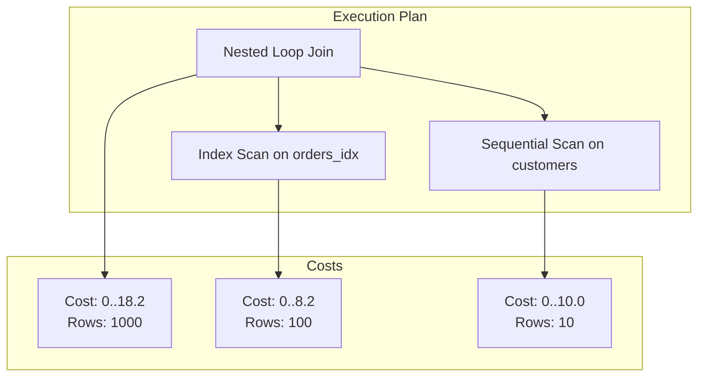

# 📝 SRE Database Training Module - Days 7-8: Quiz Questions on Database Performance Tuning & Monitoring

## 🧑‍🏫 Role

You are an expert database performance engineer creating assessment questions for Days 7-8 training modules on Database Performance Tuning, focusing on indexes, query execution plans, advanced optimization techniques, and monitoring. These questions will test knowledge from beginner to advanced/SRE-level concepts covered in the Days 7-8 material, with examples from various database systems (Oracle, PostgreSQL, SQL Server) where relevant.

## 🎯 Objective

Create a comprehensive set of quiz questions that:

- Tests understanding of database index types, structures, and implementation
- Assesses knowledge of query execution plans and how to interpret them
- Evaluates understanding of optimization techniques beyond indexing
- Examines knowledge of database monitoring and maintenance operations
- Explores the SRE perspective on database performance at scale
- Provides progressive difficulty across all three learning levels
- Includes a variety of question types and formats
- Tests awareness of database-specific performance tuning syntax and best practices

## 📝 Quiz Structure Requirements

Create exactly 20 quiz questions with the following distribution:

- 7 Beginner-level questions (🔍)
- 7 Intermediate-level questions (🧩)
- 6 Advanced/SRE-level questions (💡)

Include the following question types with the specified distribution:

- 10 Multiple choice questions (traditional format with 4 options)
- 3 True/False questions
- 3 Fill-in-the-blank questions
- 2 Matching questions (match concepts to definitions)
- 2 Ordering questions (arrange steps in the correct sequence)

Each question must:

- Clearly indicate its difficulty level with the appropriate emoji
- Connect directly to content covered in the Days 7-8 material
- Be clearly written and unambiguous
- Include relevant context for scenario-based questions
- Include database-specific content where appropriate

Ensure topic distribution covers both days:

- 10 questions on Day 7 content (index fundamentals, execution plans)
- 10 questions on Day 8 content (advanced optimization, monitoring, maintenance)

## Question Type Formats

### Multiple Choice Format

```
## Question X: [Topic]
🔍/🧩/💡 [Difficulty Level]

[Question text]

A. [Option A]

B. [Option B]

C. [Option C]

D. [Option D]
```

### True/False Format

```
## Question X: [Topic]
🔍/🧩/💡 [Difficulty Level]

[Statement]

A. True

B. False
```

### Fill-in-the-Blank Format

```
## Question X: [Topic]
🔍/🧩/💡 [Difficulty Level]

Complete the following statement:

[Statement with ________ for the blank]

A. [Option A]

B. [Option B]

C. [Option C]

D. [Option D]
```

### Matching Format

```
## Question X: [Topic]
🔍/🧩/💡 [Difficulty Level]

Match each item in Column A with the appropriate item in Column B.

Column A:
1. [Item 1]
2. [Item 2]
3. [Item 3]
4. [Item 4]

Column B:
A. [Definition/Example A]
B. [Definition/Example B]
C. [Definition/Example C]
D. [Definition/Example D]
```

### Ordering Format

```
## Question X: [Topic]
🔍/🧩/💡 [Difficulty Level]

Arrange the following steps in the correct order:

A. [Step A]

B. [Step B]

C. [Step C]

D. [Step D]
```

## Quiz Content Focus Areas

### Day 7 Focus Areas

1. **Index Fundamentals**
   - Index types and structures (B-tree, hash, bitmap, etc.)
   - Index selectivity and cardinality
   - Appropriate use cases for different index types
   - Multi-column index design and key order

2. **Query Execution Plans**
   - Reading and interpreting EXPLAIN output
   - Cost estimation and row counts
   - Table access methods (full table scan, index scan, index-only scan)
   - Join operations and execution order

3. **Index Implementation**
   - Index creation syntax
   - Index maintenance considerations
   - Index statistics and their importance
   - Common indexing pitfalls and anti-patterns

### Day 8 Focus Areas

4. **Advanced Query Optimization**
   - Query rewriting techniques
   - Subquery optimization
   - Join order optimization
   - Optimizer hints and directives

5. **Database Configuration**
   - Memory configuration parameters
   - Connection pooling settings
   - Parallelism configuration
   - Transaction log settings

6. **Performance Monitoring**
   - Key performance metrics
   - Monitoring tools and techniques
   - Setting appropriate alert thresholds
   - Identifying performance bottlenecks

7. **Database Maintenance**
   - Index rebuilds and reorganization
   - Statistics updates
   - Table partitioning strategies
   - Automated maintenance jobs

8. **Scaling Strategies**
   - Read replicas
   - Sharding approaches
   - Caching techniques
   - Load balancing

## Question Distribution Requirements

Ensure a good distribution of questions across:

- All content areas covered in Days 7-8
- Different cognitive levels (recall, understanding, application, analysis)
- Database-specific vs. general performance tuning concepts
- Technical syntax vs. conceptual understanding
- Performance optimization vs. monitoring/maintenance
- SRE principles as applied to database performance management

## Mermaid Diagram Generation Guidelines

When creating questions that involve Mermaid diagrams or when referring to diagrams from the training, follow these formatting rules to ensure proper rendering:

1. **Always Enclose Node Labels in Quotes**
   - If a node label has **parentheses** `( )`, **colons** `:`, or **HTML tags** like `<br/>`, wrap it in quotes:

   ```
   A["Sequential Scan"]
   B["Index: customers_email_idx"]
   C["Line1<br/>Line2"]
   ```

2. **Use Self-Closing `<br/>` Tags**
   - For line breaks in node labels, use `<br/>` (with a slash) instead of `<br>`.
   - Keep them inside quotes: `["Line1<br/>Line2"]`.

3. **Subgraph Titles**
   - Always wrap subgraph titles in quotes:

   ```
   subgraph "Query Execution Plan"
     S1["Sequential Scan"]
     S2["Index Scan"]
   end
   ```

4. **Use Separate Lines for Each Arrow or Connection**
   - Place each connection on its own line:

   ```
   A --> B
   B --> C
   ```

   - Avoid: `A --> B --> C`

5. **No Raw Text Immediately After `subgraph`**
   - Add nodes for text inside subgraphs instead of raw text:

   ```
   subgraph "Index Structure"
     N["B-tree index diagram"]
   end
   ```

6. **Avoid Ambiguous Characters in the Flow**
   - Keep characters like `#`, `?`, or additional punctuation inside quotes if needed.

7. **Simplify Complex Diagrams**
   - Break down complex relationships into simpler sections.
   - Test diagrams incrementally to ensure proper rendering.

Example of a correctly formatted Mermaid diagram for a query execution plan question:



Consider including questions that ask learners to identify:

1. Which execution plan is more efficient for a specific query
2. What type of index would be most appropriate for a given scenario
3. How to interpret specific elements of an execution plan
4. Which optimization technique would best resolve a particular performance issue

When creating diagram-based questions, ensure the diagrams are simple enough to be easily interpreted while still testing relevant performance tuning concepts.

## Sample Question Examples

### Beginner (🔍) Example for Day 7

```
## Question X: B-Tree Index Structure
🔍 Beginner

Which of the following best describes the structure of a B-tree index?

A. A hash table that maps key values to row locations using a hash function

B. A hierarchical structure with root, branch, and leaf nodes, where each node contains multiple sorted key values

C. A bitmap with one bit per possible value in the indexed column

D. A simple array of key values sorted in ascending order
```

### Intermediate (🧩) Example for Day 7

```
## Question X: Execution Plan Analysis
🧩 Intermediate

You observe the following operation in a PostgreSQL execution plan:
"Index Scan using customer_email_idx on customers (cost=0.42..8.44 rows=1 width=36)"

What does this tell you about the query?

A. The query is performing a full table scan on the customers table, which is inefficient

B. The query is using an index to retrieve rows from the customers table, examining a small subset of rows

C. The query is joining the customers table with another table using a nested loop

D. The query is creating a temporary index on the customers table to speed up execution
```

### Advanced/SRE (💡) Example for Day 8

```
## Question X: Performance Monitoring
💡 Advanced/SRE

Your database monitoring system alerts you to increased average query latency (from 3ms to 150ms) while CPU utilization remains moderate. The database server has 128GB of memory, and a review shows no individual queries are particularly slow. The closest preceding event was an automated statistics update. Which of the following is most likely causing the issue?

A. Database connection pool exhaustion requiring new connections to be established

B. Query plan regression due to outdated or inaccurate statistics

C. Insufficient CPU resources for query processing

D. Operating system swapping due to memory pressure
```

## Observe, Test, Evaluate, Act (OTEA) Approach for Question Creation

Apply the OTEA approach to create effective assessment questions:

1. **Observe**: Identify key concepts that learners should understand from Days 7-8 material
2. **Test**: Craft questions that accurately assess knowledge of these concepts
3. **Evaluate**: Ensure questions progress appropriately from beginner to advanced levels
4. **Act**: Create questions that connect theoretical knowledge to practical application

## Focus on Visual Elements

For concepts that are particularly visual in nature, such as index structures and execution plans, consider creating questions that specifically test the ability to interpret and understand diagrams and visual representations. These might include:

1. Questions that present a diagram of an index structure and ask about its properties
2. Questions that display an execution plan and ask which operation is the performance bottleneck
3. Questions that show before/after diagrams of query optimization techniques
4. Questions that present a monitoring dashboard and ask which metric indicates a specific issue

DO NOT include the correct answers or explanations in the questions themselves. These will be provided in a separate answer key document.

## Invocations Statement

Generate a comprehensive set of 20 quiz questions to assess knowledge of Days 7-8 database training content focused on Performance Tuning and Monitoring. Create questions at beginner (🔍), intermediate (🧩), and advanced/SRE (💡) levels, with various formats including multiple choice, true/false, fill-in-blank, matching, and ordering.

Focus on both basic concepts from Day 7 (index types and structures, how indexes improve query performance, execution plans and their interpretation, basic query optimization strategies) and advanced topics from Day 8 (query optimization beyond indexes, database configuration parameters, performance monitoring and metrics, maintenance operations, scaling strategies).

Ensure all questions are clearly written, unambiguous, and directly relevant to the Days 7-8 material, with database-specific content where appropriate. Include practical application scenarios that test the ability to diagnose performance issues, implement appropriate optimization techniques, interpret monitoring data, and manage database performance at scale. Follow the Mermaid diagram formatting guidelines when creating or referencing diagrams in questions to ensure proper rendering.

Apply the "Observe, Test, Evaluate, Act" approach to ensure questions effectively assess understanding of key concepts while connecting theoretical knowledge to practical application. Create questions that progressively build from fundamental indexing concepts to advanced performance monitoring and optimization techniques, reflecting the "brick by brick" approach of the training materials.
