# 📊 SRE Database Training Module  

Below is a comprehensive two-day (Days 7-8) training module on Database Performance Tuning, built upon the foundation established in Days 1-6. This module emphasizes practical indexing, query optimization, advanced performance tuning, and monitoring, while weaving in SRE best practices. All references to content are drawn from the attached day-7_8_training_material.md .

## Days 7-8: Comprehensive Performance Tuning

---

## 🧩 Big Picture of Days 7-8

**Focus**: Building on core relational fundamentals from Days 1-6, these two days center on:

1. **Day 7: Performance Tuning Fundamentals – Indexes & Query Execution**  
2. **Day 8: Advanced Performance Tuning & Monitoring**

Throughout both days, we use an **“Observe, Test, Evaluate, and Take Action”** framework:

1. **Observe** potential performance bottlenecks.
2. **Test** hypothesis with metrics or query analysis.
3. **Evaluate** results against baselines/SLOs.
4. **Take Action** by applying tuning changes iteratively.

We’ll use tiered learning (🔍Beginner, 🧩Intermediate, 💡Advanced/SRE), real-world scenarios, and visually rich diagrams to guide learners through the essential concepts and hands-on practice for each performance topic.

---

### Visual Concept Map

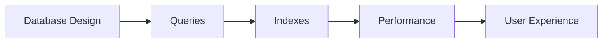

---

# Day 7: Performance Tuning Fundamentals – Indexes & Query Execution

## 📌 Day 7 Introduction

**Welcome to Day 7!**  
Today, we leverage your database administration knowledge (from Day 6) to dive deep into **performance tuning fundamentals**, with an emphasis on **indexes** and **query execution**. Proper indexing can make or break database performance, dramatically impacting user experience and resource usage. We will explore how queries are executed, why indexes are powerful, and how to interpret execution plans to optimize performance.

### Why Performance Tuning Matters

- **User Experience**: Slow queries degrade responsiveness.
- **Resource Efficiency**: Unoptimized queries waste CPU, memory, and I/O.
- **Cost Optimization**: Better performance often means reduced operational costs (fewer servers, less hardware).

#### Real-World Support Scenario
>
> Your production e-commerce site experiences slow page loads whenever customers search through a large products table. Your support team identifies a missing index on a frequently queried column as the main culprit. After adding the index, the query response time drops from 5 seconds to under 100 milliseconds!

### Visual Concept Map


The above map shows how database design and queries feed into indexes, collectively influencing performance and ultimately the user experience.

---

## 🎯 Day 7 Learning Objectives by Tier

**🔍 Beginner**  

1. Understand basic performance tuning concepts (response time, throughput, resource utilization).  
2. Describe how indexes function at a high level.  
3. Read a simple execution plan.  
4. Identify common performance anti-patterns (missing or inefficient indexes).

**🧩 Intermediate**  

1. Differentiate between various index types (B-tree, bitmap, hash).  
2. Interpret EXPLAIN plans in Oracle, PostgreSQL, and SQL Server.  
3. Implement multi-column indexes for real-world scenarios.  
4. Diagnose and fix common indexing issues (unused or overlapping indexes).

**💡 Advanced/SRE**  

1. Manage index design at scale with automated indexing strategies.  
2. Leverage advanced indexing features (partitioned indexes, partial indexes).  
3. Optimize complex queries based on detailed execution plan analysis.  
4. Monitor index usage and overhead, balancing performance vs. maintenance cost.

---

## 📚 Day 7 Core Concepts

Below are the **10 core concepts** we’ll address. Each topic follows this structure:

1. **Beginner Analogy**  
2. **Visual Representation (Mermaid)**  
3. **Technical Explanation**  
4. **Support/SRE Application**  
5. **System Impact**  
6. **Common Misconceptions**  
7. **Database Implementation** (Oracle, PostgreSQL, SQL Server)

---

### 1. Database Performance Fundamentals

**Beginner Analogy**:  
Think of a busy restaurant (database). **Response time** is how long it takes to serve one meal, **throughput** is how many meals you can serve in a given time, and **resource utilization** is the capacity of your staff and kitchen to handle orders.

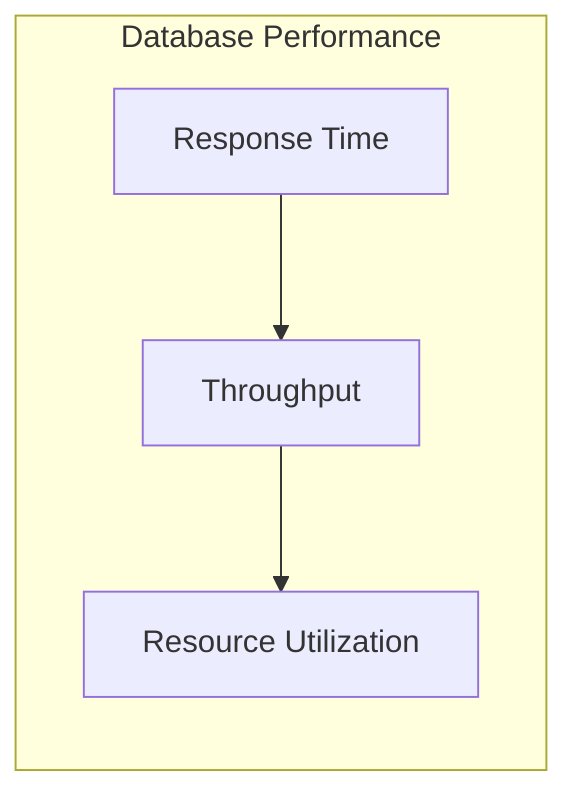

**Technical Explanation**:  

- **Response Time**: The time between query submission and result retrieval.  
- **Throughput**: The number of queries processed per unit of time.  
- **Resource Utilization**: How heavily CPU, memory, network, and storage are used.  

**Support/SRE Application**:  
You will track these metrics to identify and address performance bottlenecks in real-time systems.

**System Impact**:  

- Slow response times reduce throughput.  
- Resource exhaustion can cause downtime.

**Common Misconceptions**:  

- “Increasing hardware is the only solution.” Proper tuning is often more effective than just adding more RAM or CPUs.

**Database Implementation**:  

- **Oracle**: Use AWR (Automatic Workload Repository) to track performance stats.  
- **PostgreSQL**: Use `pg_stat_statements` for query performance metrics.  
- **SQL Server**: Use Dynamic Management Views (DMVs) like `sys.dm_exec_query_stats`.

---

### 2. Query Execution Lifecycle (Parsing, Optimization, Execution, Fetching)

**Beginner Analogy**:  
Think of a trip: you **plan** the route (parse & optimize), **travel** (execute), and then **arrive** at your destination (fetch the data).

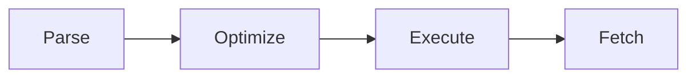

**Technical Explanation**:  

1. **Parsing**: Check query syntax and validity.  
2. **Optimization**: Evaluate possible execution plans, pick the best one.  
3. **Execution**: Execute the chosen plan.  
4. **Fetching**: Retrieve result rows.

**Support/SRE Application**:  
Understanding each phase helps pinpoint where performance lags occur—Is it query parsing overhead, poor plan selection, or slow data retrieval?

**System Impact**:  

- Complex queries can lead to prolonged parse times.  
- Suboptimal plans drastically inflate execution time.

**Common Misconceptions**:  

- “The optimizer always picks the best plan.” In reality, the optimizer is cost-based but can be misled by outdated statistics.

**Database Implementation**:  

- **Oracle**: `EXPLAIN PLAN` or `DBMS_XPLAN` for plan details.  
- **PostgreSQL**: `EXPLAIN` or `EXPLAIN ANALYZE`.  
- **SQL Server**: `SET SHOWPLAN_XML ON` or Query Plans in Management Studio.

---

### 3. Table Access Methods (Full Table Scan, Index Scan, Index-Only Scan)

**Beginner Analogy**:  

- **Full Table Scan** = Reading an entire book to find one reference.  
- **Index Scan** = Checking a book’s index to jump to a relevant page.  
- **Index-Only Scan** = Reading just the book’s index because it contains all needed info.


**Technical Explanation**:  

- **Full Table Scan**: Reads all rows to find matches.  
- **Index Scan**: Utilizes an index to find rows more efficiently.  
- **Index-Only Scan**: Retrieves data entirely from the index, no table lookup needed.

**Support/SRE Application**:  
When queries require only indexed columns, aim for “index-only scans” to reduce I/O and improve speed.

**System Impact**:  

- Full scans can be very slow on large tables.  
- Index-Only scans are extremely fast but require well-designed indexes.

**Common Misconceptions**:  

- “All queries should use indexes.” Sometimes a full scan can be faster, especially for small tables or if most rows match the filter.

**Database Implementation**:  

- **Oracle**: Uses “TABLE ACCESS FULL” or “INDEX RANGE SCAN” in the plan.  
- **PostgreSQL**: Shows “Seq Scan”, “Index Scan”, or “Index Only Scan”.  
- **SQL Server**: Execution plans show “Table Scan” or “Index Seek/Scan”.

---

### 4. What Are Indexes? (Purpose, Structure, B-Tree vs. Other Types)

**Beginner Analogy**:  
An index in a book speeds up finding information. Similarly, a database index is a data structure that allows fast lookups of table rows based on key values.

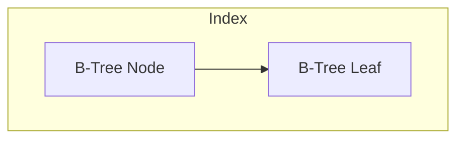

**Technical Explanation**:  

- **B-Tree Index**: Balanced tree allowing logarithmic-time lookups.  
- **Other Types**: Bitmap indexes (for low-cardinality columns), Hash indexes (exact lookups), etc.

**Support/SRE Application**:  
Indexes reduce query response times for high-read workloads. However, indexes must be maintained during writes, which introduces overhead.

**System Impact**:  

- Improves read performance but can slow down inserts, updates, and deletes due to index maintenance.  
- Requires additional storage.

**Common Misconceptions**:  

- “Adding more indexes is always better.” Too many indexes can degrade write performance and increase storage usage.

**Database Implementation**:  

- **Oracle**: Commonly uses B-tree and Bitmap indexes.  
- **PostgreSQL**: Default is B-tree, plus specialized GiST, GIN.  
- **SQL Server**: Offers clustered, non-clustered, columnstore indexes, etc.

---

### 5. How Indexes Speed Up Queries (Reducing I/O, Providing Sorting, Supporting Constraints)

**Beginner Analogy**:  
An index is like a directory or table of contents; you jump straight to the relevant pages instead of flipping through everything.

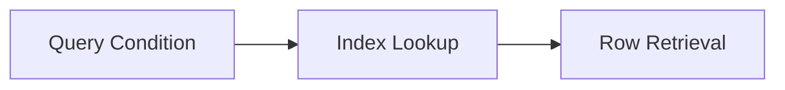

**Technical Explanation**:  

1. **Reducing I/O**: Fewer pages read from disk if the index narrows down the search.  
2. **Providing Sorting**: Some queries can skip an extra sort step if the index is on the sorted column(s).  
3. **Supporting Constraints**: Unique indexes enforce uniqueness constraints.

**Support/SRE Application**:  

- Queries on “WHERE last_name = ?” can be greatly accelerated by an index on `last_name`.  
- Sort-intensive queries can be optimized by indexing columns used in `ORDER BY`.

**System Impact**:  

- Reduced I/O load leads to faster queries and less stress on storage.  
- Over-indexing can hamper write performance.

**Common Misconceptions**:  

- “Indexes automatically optimize all queries.” Index usage depends on the query, data distribution, and the optimizer.

**Database Implementation**:  

- **Oracle**: Indexes can eliminate sorting if the “ORDER BY” matches the index.  
- **PostgreSQL**: Multi-column indexes can accelerate sorting if the query matches index ordering.  
- **SQL Server**: Included columns in non-clustered indexes can speed up certain queries without separate lookups.

---

### 6. Index Types (B-tree, Bitmap, Hash, Specialized Indexes)

**Beginner Analogy**:  
Different types of directories: a **B-tree** is a sorted index, a **bitmap** is a compressed form for yes/no columns, a **hash** is a direct lookup table, and **specialized** indexes cater to unique data (like full-text or geospatial).

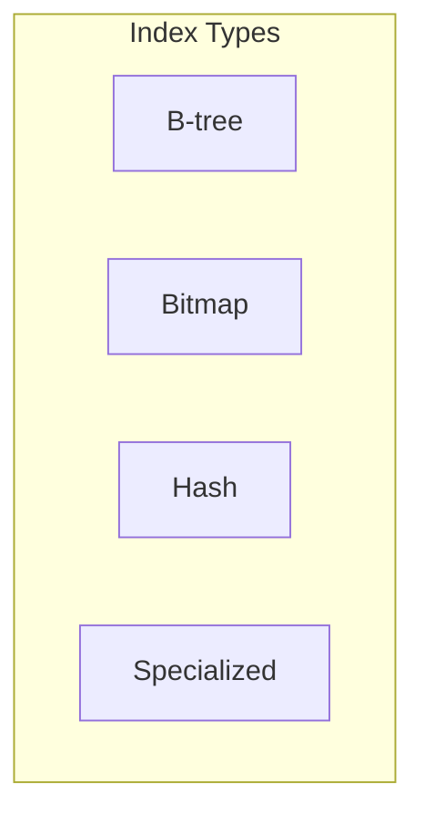

**Technical Explanation**:  

- **B-tree**: Balanced tree structure, widely used.  
- **Bitmap**: Combines row IDs for columns with low cardinality, e.g., “status flags”.  
- **Hash**: Direct key-to-location mapping; fast for exact matches.  
- **Specialized**: Full-text indexes, geospatial (R-Tree, GiST), etc.

**Support/SRE Application**:  
Choose index type based on data patterns (e.g., use B-tree for high-cardinality columns, bitmap for low-cardinality columns).

**System Impact**:  

- Each index type has different storage and performance trade-offs.  
- Mismatched index types lead to suboptimal performance or overhead.

**Common Misconceptions**:  

- “Hash indexes are always faster.” They work best for equality lookups, not range searches.

**Database Implementation**:  

- **Oracle**: Supports B-tree and Bitmap indexes extensively.  
- **PostgreSQL**: Offers B-tree, Hash, GIN, GiST.  
- **SQL Server**: Primarily uses B-tree-based indexes, plus Columnstore for analytics.

---

### 7. Index Design Principles (Selectivity, Cardinality, Overhead Considerations)

**Beginner Analogy**:  
Select an index like choosing a tool in a toolbox. You pick the right wrench size for the job, ensuring it’s used frequently enough and fits well.


**Technical Explanation**:  

- **Selectivity**: Fraction of rows matched by the query. Higher selectivity ⇒ better index performance.  
- **Cardinality**: The uniqueness of data in a column. High-cardinality columns (many distinct values) benefit from indexing.  
- **Overhead**: More indexes ⇒ more maintenance during writes ⇒ greater storage needs.

**Support/SRE Application**:  
Balance read performance gains against write overhead. Use index usage statistics to measure effectiveness.

**System Impact**:  

- Low selectivity columns (like “gender”) often yield minimal performance gains with a B-tree index.  
- Misplaced or excessive indexes slow down inserts/updates/deletes.

**Common Misconceptions**:  

- “Index all columns.” This leads to index bloat and maintenance headaches.

**Database Implementation**:  

- **Oracle**: AWR/ADDM can advise on index usage.  
- **PostgreSQL**: `pg_stat_user_indexes` can reveal if indexes are used.  
- **SQL Server**: Missing index DMVs or Index Usage Stats.

---

### 8. Multi-Column Indexes (Composite Indexes, Key Order Importance)

**Beginner Analogy**:  
Like a phone book sorted by **last name** then **first name**. The order matters for lookups.

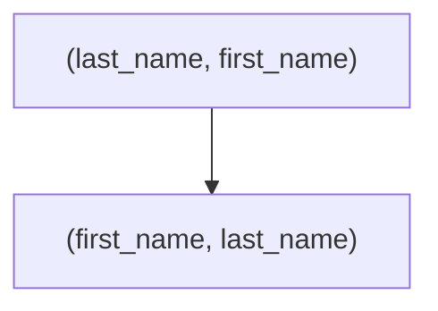

**Technical Explanation**:  

- A composite index on `(col1, col2)` is generally useful if queries filter on `col1` first, then `col2`.  
- The order of columns in the index impacts whether it can be fully utilized.

**Support/SRE Application**:  

- Common queries with `WHERE col1=? AND col2=?` can benefit from a composite index.  
- If queries only filter by `col2`, the index might be partially used or unused.

**System Impact**:  

- Composite indexes can reduce the need for multiple separate indexes but must be carefully ordered.  
- Increases storage overhead compared to single-column indexes.

**Common Misconceptions**:  

- “Multi-column indexes automatically cover all columns in any order.” The optimizer can only utilize them optimally in the leading-column order or certain permutations.

**Database Implementation**:  

- **Oracle**: CREATE INDEX idx_name ON table(col1, col2).  
- **PostgreSQL**: CREATE INDEX ON table(col1, col2).  
- **SQL Server**: CREATE INDEX idx_name ON table (col1, col2).

---

### 9. Understanding EXPLAIN Plans (Reading Execution Plans, Cost Estimation)

**Beginner Analogy**:  
Think of your phone’s GPS route summary showing the path, distance, and expected travel time. EXPLAIN is the “GPS summary” of how your database engine will execute a query.

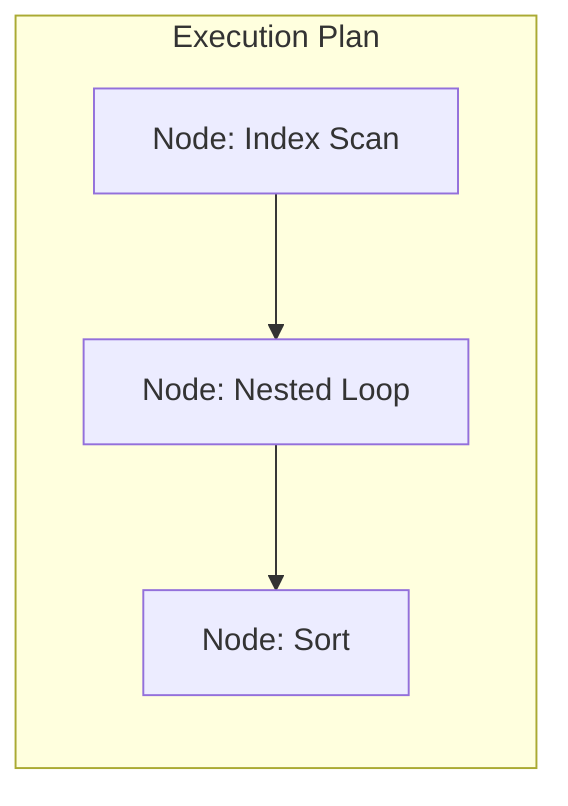

**Technical Explanation**:  

- **EXPLAIN** shows the intended execution plan (index usage, join methods, sort operations, etc.).  
- **Cost Estimation** is a numeric guess of resources needed (time or I/O cost).

**Support/SRE Application**:  

- Identify high-cost operations (like “Seq Scan” or “Sort”).  
- Compare actual vs. estimated rows to spot outdated statistics.

**System Impact**:  

- Execution plans reveal if the optimizer is making poor decisions.  
- Re-tuning or updating statistics can correct inaccurate cost estimates.

**Common Misconceptions**:  

- “Lower cost always means faster execution.” The displayed cost is an abstract measure; real run times can vary.

**Database Implementation**:  

- **Oracle**: `EXPLAIN PLAN FOR ...; SELECT * FROM TABLE(DBMS_XPLAN.DISPLAY);`  
- **PostgreSQL**: `EXPLAIN` or `EXPLAIN ANALYZE`.  
- **SQL Server**: Graphical execution plans in SSMS or `SET SHOWPLAN_XML ON`.

---

### 10. Common Performance Anti-Patterns (Missing Indexes, Unused Indexes, Inefficient Queries)

**Beginner Analogy**:  
A cluttered toolbox with the wrong or unnecessary tools can slow you down. Similarly, missing or redundant indexes harm database performance.

**Examples**:  

1. **Missing Index**: Scanning millions of rows for common queries.  
2. **Unused Index**: Additional overhead on writes, but never used for reads.  
3. **Inefficient Queries**: Complex subqueries or poorly structured joins leading to slow performance.

**System Impact**:  

- Missing indexes cause frequent full table scans.  
- Excessive unused indexes bloat storage and hamper write speed.

**Common Misconceptions**:  

- “The database automatically fixes all indexing problems.” Manual review is essential.

**Database Implementation**:  

- **Oracle**: Tools like SQL Tuning Advisor can suggest missing indexes.  
- **PostgreSQL**: `pg_stat_user_indexes` to track index usage.  
- **SQL Server**: Missing index DMVs can guide index creation.

---

## 🔄 Index Design and Implementation

### Index Selection Methodology

1. **Identify Frequent Queries** and columns used in `WHERE`, `JOIN`, `ORDER BY`.  
2. **Evaluate Selectivity**: High or moderate selectivity columns benefit from B-tree indexes.  
3. **Validate Write Impact** if your system has heavy DML.  

### Mermaid: Visual Decision Tree for Index Choice

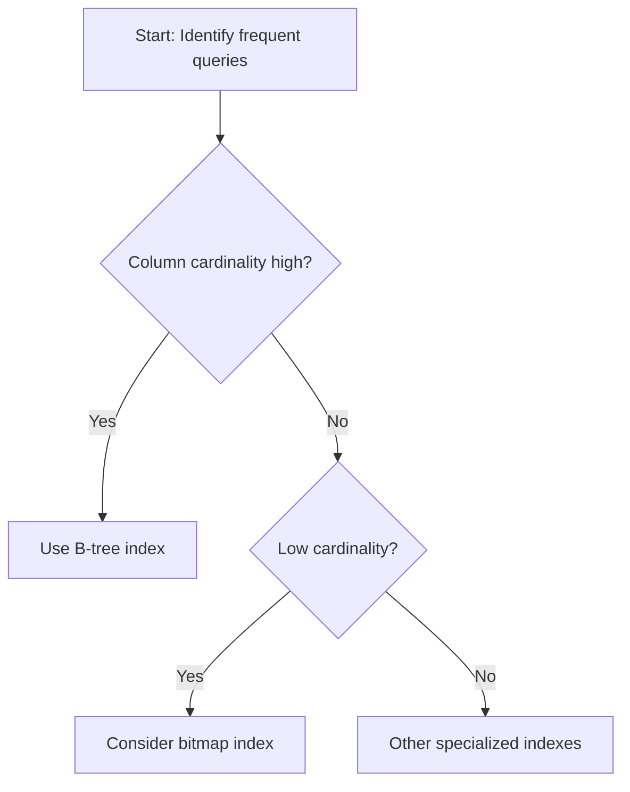

### SQL Examples for Creating Different Index Types

**Oracle**  

```sql
CREATE INDEX idx_customers_email ON customers(email);
CREATE BITMAP INDEX idx_orders_status ON orders(status);
```

**PostgreSQL**  

```sql
CREATE INDEX idx_customers_email ON customers(email);
CREATE INDEX idx_orders_status_bitmap ON orders USING bitmap (status);
```

*(Note: “Bitmap indexes” are not typically used in PostgreSQL the same way as Oracle, so specialized indexes or partial indexes may be more common.)*

**SQL Server**  

```sql
CREATE NONCLUSTERED INDEX idx_customers_email ON customers(email);
-- For columnstore (analytics):
CREATE CLUSTERED COLUMNSTORE INDEX idx_sales_ccsi ON sales;
```

---

## 🔍 Analyzing Query Execution Plans

### Reading and Interpreting EXPLAIN Output

- **Look for**: Access methods (index vs. table scan), join types (Nested Loop, Hash Join), sort operations, etc.
- **Identify**: Potential bottlenecks like “Seq Scan” on large tables if an index is missing.

### Plan Differences Across Database Systems

- **Oracle**: Typically references “TABLE ACCESS FULL”, “INDEX UNIQUE SCAN”, etc.  
- **PostgreSQL**: “Seq Scan”, “Index Scan”, “Bitmap Heap Scan”.  
- **SQL Server**: “Table Scan”, “Index Seek/Scan”, “Nested Loops Join”, etc.

---

## 🔨 Day 7 Hands-On Exercises

Each tier has 3 exercises:

### 🔍 Beginner

1. **Create a Simple Index**:  
   - Create a B-tree index on a frequently used column and compare query performance before and after.  
2. **Read a Basic EXPLAIN Plan**:  
   - Run `EXPLAIN` on a simple SELECT query. Identify if an index is used.  
3. **Identify Missing Index**:  
   - Given a slow query, determine which column(s) might benefit from an index.

### 🧩 Intermediate

1. **Implement a Composite Index**:  
   - Create a multi-column index for queries involving two columns in `WHERE`. Evaluate the new plan.  
2. **Compare Full Table Scan vs. Index Scan**:  
   - Force a full table scan vs. using an index. Measure performance differences.  
3. **Analyze Index Usage Stats**:  
   - Check database-specific views to see how often indexes are used. Decide if any indexes should be dropped or added.

### 💡 Advanced/SRE

1. **Automated Index Management**:  
   - Explore scripts or built-in advisors that suggest index creation/dropping. Evaluate suggestions.  
2. **Complex Execution Plan Analysis**:  
   - Use a multi-join query with multiple indexes. Interpret CPU cost, I/O cost, and actual vs. estimated rows.  
3. **Index Maintenance at Scale**:  
   - Simulate large-volume inserts/updates and measure the overhead of maintaining multiple indexes.

---

## 🚧 Day 7 Troubleshooting Scenarios

### Scenario 1: Sluggish E-Commerce Product Search

- **Symptom**: Users report slow search.  
- **Cause**: Missing index on `product_name`.  
- **Diagnostic**: `EXPLAIN` shows a “Seq Scan.”  
- **Resolution**: Create a B-tree index on `(product_name)`. Confirm via plan re-check.

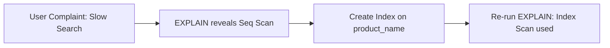

---

### Scenario 2: Write Bottleneck on High-Transaction Table

- **Symptom**: High CPU usage during inserts/updates.  
- **Cause**: Too many indexes on the table.  
- **Diagnostic**: Checking index usage stats shows low usage for some.  
- **Resolution**: Drop unused indexes to reduce overhead.

---

### Scenario 3: Unused Composite Index

- **Symptom**: Composite index `(colA, colB)` not being used.  
- **Cause**: Queries filter on `colB` only; leading column mismatch.  
- **Resolution**: Recreate index with a more appropriate column ordering or create a separate single-column index if needed.

---

## ❓ Day 7 Frequently Asked Questions

### 🔍 Beginner

1. **Why do I need an index if my table is small?**  
   - On small tables, full scans can be fast, but indexing can still help if the table grows over time.  
2. **Is there a limit to how many indexes I can create?**  
   - Technically no, but each index increases storage and write overhead.  
3. **Do indexes automatically get used if they exist?**  
   - The optimizer decides based on cost estimates and statistics.

### 🧩 Intermediate

1. **What is the difference between a clustered and non-clustered index in SQL Server?**  
   - A clustered index orders the actual table data, while a non-clustered index is a separate structure referencing the table.  
2. **How do I decide on the order of columns in a composite index?**  
   - Put the most selective or most frequently filtered column first.  
3. **Why does an EXPLAIN plan still show a seq scan when I have an index?**  
   - The optimizer may decide a full scan is cheaper (e.g., if your query matches a large portion of the table or stats are outdated).

### 💡 Advanced/SRE

1. **How do I automate index maintenance?**  
   - Use built-in tools (SQL Server’s Index Tuning Wizard, PostgreSQL scripts) or custom scripts to regularly suggest or drop indexes.  
2. **What about partial indexes in PostgreSQL?**  
   - These apply only to a subset of rows, reducing space and improving performance for specialized queries.  
3. **How can I measure the actual performance impact of adding an index?**  
   - Compare query run time, CPU usage, I/O metrics, and check plan changes before/after.

---

## 🧠 Day 7 Key Takeaways

- Indexes significantly **boost** query performance but carry **maintenance costs**.  
- **EXPLAIN plans** reveal how queries execute and which indexes (if any) are used.  
- **Composite indexes** must be carefully ordered to match the query’s filter pattern.  
- **Iterative tuning** is essential: measure performance, add or drop indexes, then re-check.  
- Balancing read vs. write workloads is crucial—**over-indexing** hurts DML performance.  

---

# Day 8: Advanced Performance Tuning & Monitoring

## 📌 Day 8 Introduction

**Welcome to Day 8!**  
Having learned indexing fundamentals on Day 7, we now move to **advanced performance tuning & monitoring**. Effective performance tuning goes beyond indexes—it includes query rewrites, optimizer hints, configuration parameters, partitioning, and robust monitoring to **ensure reliability**. As an SRE, you’ll learn how to manage complex performance issues at scale.

### Real-World Support Scenario
>
> A high-traffic database experiences random spikes in query latency. Investigation reveals a combination of suboptimal query plans, outdated statistics, and insufficient memory configuration. A multi-pronged optimization approach (query rewrites, stats refresh, memory tuning) resolves the issue.

### Visual Concept Map

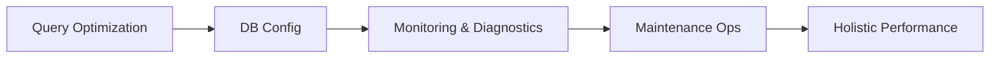

This map shows how advanced optimizations, configuration, monitoring, and maintenance combine for holistic performance.

---

## 🎯 Day 8 Learning Objectives by Tier

**🔍 Beginner**  

1. Recognize basic advanced tuning techniques (e.g., rewriting queries).  
2. Perform basic monitoring using built-in tools.  
3. Understand the importance of configuration parameters (memory, connections).  
4. Identify simple transaction log issues affecting performance.

**🧩 Intermediate**  

1. Use optimizer hints/directives to influence query execution.  
2. Configure and manage basic table partitioning for large datasets.  
3. Diagnose performance issues using slow query logs and wait events.  
4. Plan basic database maintenance tasks (index rebuilds, stats updates).

**💡 Advanced/SRE**  

1. Automate performance monitoring dashboards with real-time alerts.  
2. Analyze advanced wait events and in-depth profiling data.  
3. Plan large-scale partitioning and sharding strategies.  
4. Implement capacity planning and automated maintenance operations.

---

## 📚 Day 8 Core Concepts

### 1. Query Optimization Beyond Indexes (Rewriting Queries, Subquery Optimization, Join Order)

**Beginner Analogy**:  
Refactoring a paragraph for clarity—sometimes rewording (rewriting queries) or reorganizing (changing join order) yields a more efficient expression.

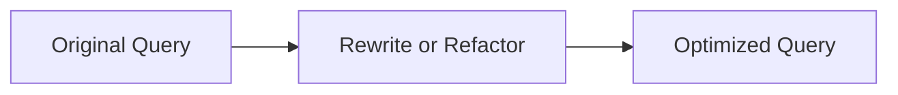

**Technical Explanation**:  

- **Query Rewrites**: Changing subqueries to joins, avoiding SELECT *, adding proper conditions.  
- **Subquery Optimization**: Converting correlated subqueries to joins can drastically improve performance.  
- **Join Order**: The optimizer tries multiple combinations; providing hints or rewriting can help if stats are misleading.

**Support/SRE Application**:  

- Large complex queries often see major gains by simplifying subqueries or adjusting join syntax.

**System Impact**:  

- Efficiency can skyrocket with minimal code changes.  
- Overly complicated queries can hamper the optimizer’s ability to find a good plan.

---

### 2. Optimizer Hints and Directives (Forcing Execution Plans, Influencing Optimizer Decisions)

**Beginner Analogy**:  
Asking for “the scenic route” vs. “fastest route” in a GPS app. You override its default path.

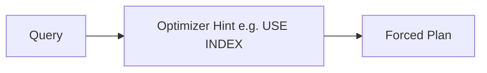

**Technical Explanation**:  

- **Hints**: E.g., `USE INDEX`, `FORCE INDEX`, or `LEADING` (Oracle) to dictate join order.  
- **Directives**: Sometimes the optimizer misses correct stats, so specifying join type or index usage can fix suboptimal plans.

**Support/SRE Application**:  

- Use hints sparingly, as they can become outdated if data changes.  
- Great fallback when the optimizer chooses a clearly inferior plan.

**System Impact**:  

- Potential improvement if used correctly; potential harm if used incorrectly.

---

### 3. Statistics Management (Gathering Statistics, Histograms, How Statistics Affect Plans)

**Beginner Analogy**:  
If you have outdated roadmaps, your GPS gives poor routes. Similarly, the optimizer needs fresh table stats to choose the best plan.

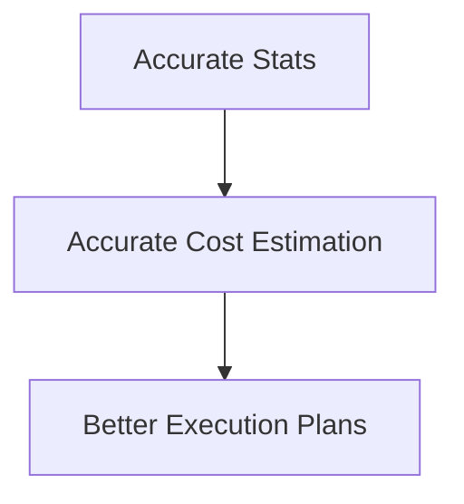

**Technical Explanation**:  

- **Table Stats**: Number of rows, column distribution, histogram data.  
- **Stale Stats**: Lead to poor plan selection (e.g., choosing a slow join method or missing an index).  

**Support/SRE Application**:  

- Regularly update stats, especially on rapidly changing tables or after large data loads.

**System Impact**:  

- Proper stats are crucial for cost-based optimizers.  
- Missing or stale stats are a top cause of suboptimal queries.

---

### 4. Table Partitioning (Horizontal, Vertical, Composite Strategies)

**Beginner Analogy**:  
Splitting a large binder into separate sections by topic. Partitioning organizes data in a way that queries only scan relevant sections.

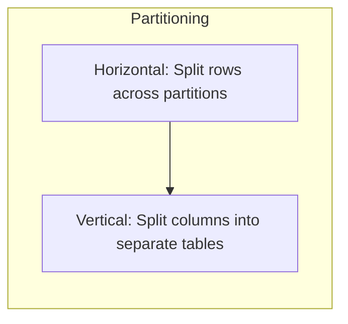

**Technical Explanation**:  

- **Horizontal Partitioning**: Divide large tables by row ranges (e.g., by date).  
- **Vertical Partitioning**: Separate infrequently used columns.  
- **Composite**: Combination of row+column partitioning.

**Support/SRE Application**:  

- Large fact tables can be partitioned by date to speed up queries and maintenance (e.g., archiving old partitions).

**System Impact**:  

- Query performance can improve by scanning fewer partitions.  
- Maintenance operations (index rebuilds, stats updates) can be done per partition.

---

### 5. Database Configuration Parameters (Memory Allocation, Connections, Parallelism)

**Beginner Analogy**:  
Allocating enough “kitchen space” (memory) and “chefs” (connections/threads) to handle orders efficiently.


**Technical Explanation**:  

- **Memory**: e.g., Oracle’s SGA, PostgreSQL’s shared_buffers, SQL Server’s max server memory.  
- **Connections**: Overbooking connections can lead to context switching overhead.  
- **Parallelism**: Multi-threaded query execution can speed large scans but also increase CPU load.

**Support/SRE Application**:  

- Tweak these based on workload analysis and monitoring results.  
- Avoid “maxing out” everything, as misconfiguration leads to instability.

---

### 6. Transaction Log Management (Sizing, Maintenance, Performance Impact)

**Beginner Analogy**:  
Like a notebook logging all changes. If it’s too small, you run out of pages; if it’s not maintained, it becomes messy and slows you down.

**Technical Explanation**:  

- **Transaction Logs** track all changes. If logs fill, transactions stall.  
- **Proper Sizing** is crucial for high-volume writes.  
- **Maintenance** (log backups, archiving, etc.) keeps log space under control.

**Support/SRE Application**:  

- Monitor log usage, especially in peak load times.  
- Avoid repeated auto-growth events.

---

### 7. Monitoring Database Performance (Key Metrics, Tools, Dashboard Design)

**Beginner Analogy**:  
A car’s dashboard: speedometer, fuel gauge, engine temperature. Monitoring metrics help you detect issues early.

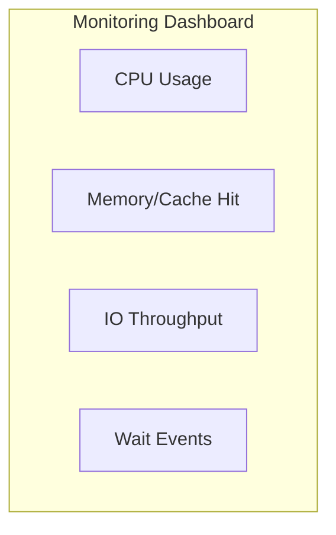

**Technical Explanation**:  

- **Key Metrics**: CPU, memory usage, I/O, wait events, slow queries, lock contention.  
- **Tools**: Oracle Enterprise Manager, PostgreSQL’s pgAdmin or third-party, SQL Server Management Studio / PerfMon.

**Support/SRE Application**:  

- Set up **alerts** for threshold breaches (e.g., CPU > 90%).  
- Visual dashboards to quickly spot anomalies.

---

### 8. Performance Diagnostics Tools (Wait Events, Slow Query Logs, Profiling)

**Beginner Analogy**:  
Analyzing “why am I waiting?” in a queue. Wait event analysis reveals where the system is stuck (I/O wait, locks, CPU, etc.).

**Technical Explanation**:  

- **Wait Events**: Oracle (V$ views), PostgreSQL (pg_stat_activity + wait_event), SQL Server (DMVs) show waiting reasons.  
- **Slow Query Logs**: Capture queries exceeding a threshold.  
- **Profiling**: Tools to break down query execution time by phases or functions.

**Support/SRE Application**:  

- Identify if the bottleneck is in CPU usage, I/O, locks, or network.  
- Focus tuning efforts where the biggest waits occur.

---

### 9. Database Maintenance Operations (Index Rebuilds, Statistics Updates, Vacuuming)

**Beginner Analogy**:  
Car tune-ups and oil changes. Proactive maintenance prevents performance issues from accumulating.

```mermaid
flowchart LR
    A["Rebuild Indexes"]
    B["Update Statistics"]
    C["Vacuum (PostgreSQL)"]
    A --> B
    B --> C
    C --> D
```

**Technical Explanation**:  

- **Index Rebuilds**: Defragment B-tree structures.  
- **Statistics Updates**: Refresh distribution data for the optimizer.  
- **Vacuuming**: PostgreSQL-specific operation to reclaim space.

**Support/SRE Application**:  

- Schedule these during low-traffic windows.  
- Automate if possible to maintain consistent performance.

---

### 10. Scaling Database Performance (Read Replicas, Sharding, Caching Strategies)

**Beginner Analogy**:  
Think of multiple library branches (replicas) to serve different neighborhoods (users). Or splitting the library’s collection by genre (sharding).

```mermaid
flowchart TB
    subgraph "Scaling"
      A["Read Replicas"]
      B["Sharding"]
      C["Caching"]
    end
```

**Technical Explanation**:  

- **Read Replicas**: Offload read traffic.  
- **Sharding**: Split large data sets across multiple nodes.  
- **Caching**: Use in-memory stores (Redis) or database buffer caches.

**Support/SRE Application**:  

- Evaluate load distribution, data partitioning strategies, and caching layers to reduce primary DB stress.

---

## 🛠️ Performance Monitoring and Observability

- **Key Performance Metrics**: CPU usage, memory usage, read/write IOPS, query latency, lock waits.  
- **Visual Dashboards**: Present real-time graphing of metrics.  
- **SQL Examples**:

  ```sql
  -- PostgreSQL example: check slow queries
  SELECT *
  FROM pg_stat_statements
  ORDER BY total_time DESC
  LIMIT 5;
  ```

---

## 🔍 Advanced Query Optimization Techniques

- **Query Rewriting**: Convert correlated subqueries to joins.  
- **Decision Tree**:  

  ```mermaid
  flowchart TB
      A["Complex Query Detected"]
      B["Rewrite Subqueries?"]
      C["Adjust Join Order?"]
      D["Apply Hints?"]
      A --> B
      B --> C
      C --> D
  ```

- **Common Anti-Patterns**: SELECT * in large tables, unnecessary DISTINCT, complicated expressions that hamper index usage.

---

## 🧰 Database Maintenance Best Practices

- **Scheduling**: Perform heavy maintenance off-peak.  
- **Workflow Diagram**:  

  ```mermaid
  flowchart LR
      A["Check Index Fragmentation"]
      B["Rebuild/Reorganize if needed"]
      C["Analyze / Update Stats"]
      D["Vacuum (PostgreSQL)"]
      A --> B
      B --> C
      C --> D
  ```

- **Automation**: Scripts or cron jobs to regularly check and fix fragmentation.  
- **DB-Specific**: Oracle’s “Automatic Maintenance Tasks”, PostgreSQL’s “autovacuum”, SQL Server’s “Maintenance Plans”.

---

## 🔨 Day 8 Hands-On Exercises

### 🔍 Beginner

1. **Check Slow Query Logs**: Identify top slow queries and discuss potential optimization.  
2. **Basic Parameter Tuning**: Increase or decrease a memory parameter to see performance impact on a test system.  
3. **Update Statistics**: Run statistics update commands on a test table with stale data.

### 🧩 Intermediate

1. **Optimizer Hints**: Rewrite a suboptimal query using hints (e.g., FORCE INDEX, LEADING). Compare performance.  
2. **Partitioning Exercise**: Partition a large table by date range and compare query performance before/after.  
3. **Transaction Log Diagnostics**: Simulate rapid writes to see log growth. Configure log size/backup strategy.

### 💡 Advanced/SRE

1. **Monitoring Dashboard Setup**: Configure a real-time performance dashboard (e.g., Grafana with Prometheus or another tool).  
2. **Wait Event Analysis**: Gather wait event data under load testing and identify the top 3 bottlenecks.  
3. **Sharding or Read Replica Simulation**: Deploy a read replica or basic sharding to test performance improvements in a scaled scenario.

---

## 🚧 Day 8 Troubleshooting Scenarios

### Scenario 1: Random Latency Spikes

- **Symptom**: Users see sporadic slow queries.  
- **Cause**: Inconsistent query plans due to outdated stats or memory pressure.  
- **Diagnostic**: Wait event analysis shows heavy CPU usage + plan flips.  
- **Resolution**: Refresh stats, tune memory allocation, pin stable plan or use hints.

### Scenario 2: Overflowing Transaction Logs

- **Symptom**: Frequent system warnings about transaction log space.  
- **Cause**: Large batch inserts without proper log backups or auto-growth settings.  
- **Resolution**: Implement regular log backups. Increase log file size. Possibly batch data loads.

---

## 🔍 Additional Notes

- Ensure all diagrams and images have descriptive alt text for accessibility.
- Use consistent heading levels to maintain a logical structure.
- Avoid mixing unordered and ordered lists unless necessary.

---

## ❓ Day 8 Frequently Asked Questions

### 🔍 Beginner

1. **Do I need to partition all my tables?**  
   - Not necessary. Partition only large or frequently accessed tables that benefit from partial scans.  
2. **Can I just rely on auto-tuning features?**  
   - Automated features help but still require periodic manual review.  
3. **What’s the difference between memory in the OS and database memory settings?**  
   - The database typically manages its own buffer pool or shared memory areas within OS limits.

### 🧩 Intermediate

1. **How do I choose between adding indexes vs. rewriting queries?**  
   - Analyze the query’s plan and usage patterns; sometimes rewriting yields bigger gains than adding an index.  
2. **Do optimizer hints become invalid over time?**  
   - Yes, if data distribution changes, hints can lead to worse performance.  
3. **How often should I rebuild indexes?**  
   - Depends on fragmentation thresholds and usage patterns. Monitor fragmentation stats to decide.

### 💡 Advanced/SRE

1. **How can I track performance over time to spot trends?**  
   - Use a time-series database or performance monitoring tool storing historical metrics. Build dashboards.  
2. **Which metrics matter most for capacity planning?**  
   - CPU usage, I/O throughput, memory consumption, read/write concurrency, and query latency percentiles (p95, p99).  
3. **Can we automate sharding or read replicas?**  
   - Some cloud-managed databases handle replicas automatically. Sharding typically requires custom solutions or advanced tools.

---

## 🔥 Comprehensive SRE-Specific Scenario (Spanning Days 7-8)

> **Incident**: A major performance degradation in an OLTP system used by thousands of concurrent users. CPU spikes, queries timing out, and transaction logs nearing capacity.

1. **Initial Observation (Day 7 Concepts)**  
   - High read queries scanning large tables. Missing indexes on crucial columns cause full table scans.  
   - Quick fix: Create missing indexes, confirm via EXPLAIN that index scans are used.

2. **Deeper Investigation (Transition to Day 8 Concepts)**  
   - Queries remain slow at peak traffic. Wait event analysis shows concurrency issues and memory pressure.  
   - Outdated stats also cause inconsistent plans, leading to random latencies.

3. **Resolution Steps**  
   - **Rewrite** some subqueries into more efficient joins.  
   - **Force** a stable execution plan with hints for critical queries.  
   - **Tune** memory and connection pool parameters.  
   - **Partition** largest tables by date to reduce scanning overhead.  
   - **Set up** monitoring dashboards and alerts for CPU spikes, slow queries, transaction log usage.  
   - **Implement** automated maintenance tasks for index rebuilds and stats updates.

4. **Outcome**  
   - Queries become stable with consistent, fast response times.  
   - Ongoing monitoring ensures early detection of new issues.  
   - System meets SLO targets, preventing further user impact.

---

## 🧠 Day 8 Key Takeaways

- **Advanced optimization** goes beyond indexing: rewriting queries, hinting, partitioning, and config tuning are vital.  
- **Monitoring and observability** are essential for proactive issue detection.  
- **Maintenance tasks** (index rebuild, stats updates, log management) should be systematically scheduled.  
- **Scaling approaches** (read replicas, sharding, caching) help handle large workloads.  
- Holistic SRE best practices—**incident response**, **automation**, and **capacity planning**—ensure ongoing reliability.

---

# 🚨 Career Protection Guide for Performance Tuning

1. **High-Risk Operations**: Large index rebuilds or major config changes can disrupt production.  
2. **Testing Strategies**: Test all performance changes in a staging environment with realistic data or via canary deployments.  
3. **Communication**: Inform stakeholders of potential risks, expected improvements, and fallback plans.  
4. **Documentation**: Keep a detailed log of changes (indexes added, config tweaks, queries rewritten).  
5. **Change Management**: Use version control for schema changes and a formal process for production rollouts.

---

# 🔮 Preview of Day 9: Reliability – Backups

On **Day 9**, we’ll pivot to **database backups**—why they’re essential, types of backups (full, incremental, differential), and best practices for ensuring data integrity. Performance tuning and backups complement each other, as a well-tuned database can handle backup operations more efficiently while ensuring data safety.

---

## Before/After Performance Comparison Visualizations

Whether using indexing or advanced techniques, always **measure and visualize**:

- **Query Execution Time**  
- **Resource Utilization** (CPU, I/O)  
- **Execution Plan Changes**  
- **User Throughput** (transactions/sec)

---

## Performance Tuning Decision Trees

Day 7 and Day 8 introduced multiple **decision trees** via Mermaid diagrams for selecting index types, rewriting queries, or diagnosing performance. Use these trees as checklists during real incidents to systematically rule out or confirm performance suspects.

---

## Database-Specific Implementation Comparison

| Feature/Tool                      | Oracle                            | PostgreSQL                          | SQL Server                      |
|-----------------------------------|-----------------------------------|-------------------------------------|---------------------------------|
| Index Types                       | B-tree, Bitmap, Function-based    | B-tree, Hash, GiST, GIN, BRIN       | Clustered, Non-Clustered, Columnstore |
| Execution Plan Tools              | `EXPLAIN PLAN`, `DBMS_XPLAN`      | `EXPLAIN`, `EXPLAIN ANALYZE`        | Graphical Plans, Showplan XML   |
| Stats Gathering                   | `DBMS_STATS`                      | `ANALYZE`, auto vacuum              | Auto Update Stats, manual update|
| Monitoring                        | AWR, Enterprise Manager           | pg_stat_activity, pgAdmin           | PerfMon, DMVs, SQL Profiler     |
| Maintenance                       | Rebuild Index Online, Stats Gather| VACUUM, Reindex, Analyze            | Rebuild/Reorganize, Maintenance Plans |

---

## Performance Monitoring Dashboard Design

- **Essential Metrics**: CPU load, memory usage, disk I/O, network usage, query throughput, lock waits.  
- **Dashboard Layout**: Group metrics by resource layer (CPU, memory, I/O), plus query performance (latency, top queries).  
- **Alerts**: Threshold-based triggers on critical metrics (e.g., queries above 95th percentile latency).

---

## Real-world SRE Performance Management

1. **Service Level Objectives (SLOs)**: e.g., 95% of queries < 200ms.  
2. **Incident Response Playbooks**: Scripts or runbooks for diagnosing slow queries or resource exhaustion.  
3. **Capacity Planning**: Project future growth from performance data.  
4. **Automated Remediation**: Tools that can kill runaway queries or scale out replicas.  
5. **Performance Testing**: Tools like Apache JMeter, sysbench to validate tuning changes before production.

---

### End of Days 7-8 Module

This concludes our two-day module on **Database Performance Tuning**. You have learned:

1. **How to design and manage indexes** for optimal query performance (Day 7).  
2. **Advanced performance tuning and monitoring** techniques (Day 8).  
3. **SRE best practices** for scalable, reliable database operations.  

On **Day 9**, we will focus on **Reliability through Backups**: the **why** and **how** of backups, plus strategies for ensuring minimal data loss and maximum uptime.

**Great work, and see you on Day 9!**
