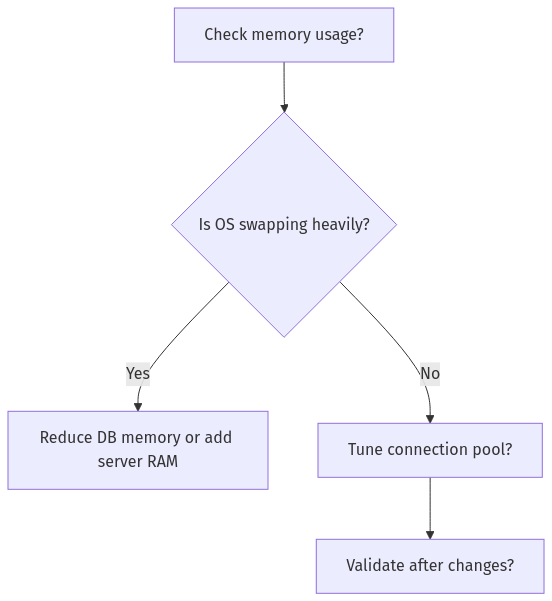
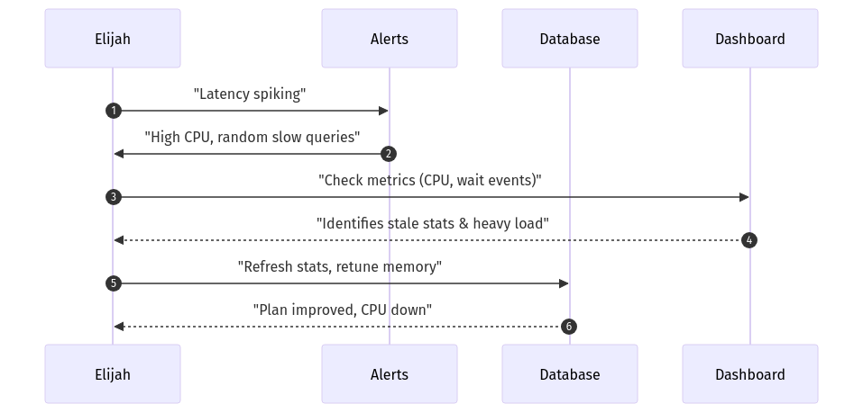

## Answer 1: Query Rewrites  
🔍 Beginner-Level | Multiple Choice  

**Question:**  
Elijah compares query optimization to “rewriting a detective report.” Which of the following best captures why rewriting a correlated subquery to a join can improve performance?

A. It disguises the query so the optimizer cannot detect it  
B. It reduces repeated scanning of the same rows  
C. It forces a full table scan on all tables involved  
D. It eliminates the need to gather statistics  

**Correct Answer:** B  

**Explanation:**  
When a subquery is correlated, the database often executes it repeatedly for each row in the outer query, causing significant overhead. By rewriting it as a join, you consolidate the logic into a single pass, letting the optimizer use more efficient join methods (e.g., nested loops or hash joins) with fewer repeated scans. This is similar to streamlining a “detective report” by removing redundant details.  

**Why other options are incorrect:**  
- A: The optimizer still detects and evaluates all queries; rewriting does not disguise the statement.  
- C: A join does not necessarily force a full table scan; it can still use indexes effectively.  
- D: You still need updated statistics for the optimizer, even after rewriting.  

**Database Comparison Note:**  
Most databases (Oracle, PostgreSQL, SQL Server) benefit from rewriting correlated subqueries into joins because it allows the optimizer to handle the workload as a single query rather than multiple repeated lookups.

**Knowledge Connection:**  
Elijah emphasizes rewriting queries as a key optimization technique—akin to editing a detective report so the main facts are presented once instead of repeatedly.

**SRE Perspective:**  
Reducing repeated scans lowers CPU usage, which stabilizes performance under high concurrency or heavy load.

**Additional Insight:**  
Always examine execution plans before and after rewrites to confirm that performance improves.

---

## Answer 2: Statistics Analogy  
🔍 Beginner-Level | Multiple Choice  

**Question:**  
Elijah refers to stale database statistics as being like “last year’s crime data.” What is the main issue if your database relies on outdated statistics for query planning?

A. It always chooses index scans even on very small tables  
B. It may drastically misjudge the number of rows to process  
C. It disables the use of transaction logs  
D. It locks all tables until stats are manually updated  

**Correct Answer:** B  

**Explanation:**  
When statistics are out of date, the optimizer’s estimates become inaccurate. For instance, if the table size or data distribution has changed drastically, the optimizer may select join methods and access paths based on old assumptions, leading to poor query performance. Elijah likens this to basing your investigation on outdated crime data—you draw the wrong conclusions.  

**Why other options are incorrect:**  
- A: The optimizer does not universally default to index scans on small tables.  
- C: Transaction logs are unrelated to statistics.  
- D: The database does not automatically lock tables until you update stats; queries continue to run but may be slower.  

**Database Comparison Note:**  
Whether using Oracle, PostgreSQL, or SQL Server, accurate statistics are critical for cost-based optimization. Each system has its own commands or procedures (e.g., `DBMS_STATS`, `ANALYZE`, auto-update stats) to keep them fresh.

**Knowledge Connection:**  
Elijah demonstrates that ignoring statistic updates can cause the optimizer to choose suboptimal plans, leading to random slowdowns or spikes.

**SRE Perspective:**  
Outdated stats can cause unpredictable performance under load, risking SLA breaches. Automated or regular refresh cycles help maintain consistent response times.

**Additional Insight:**  
Check metadata (like `last_analyzed` or equivalent) to see when stats were last updated, especially after big data loads.

---

## Answer 3: Log File Sync Waits  
🔍 Beginner-Level | True/False  

**Question:**  
Elijah describes transaction logs as a database “journal,” and warns that “log file sync” waits can spike when logs are undersized or too many commits occur rapidly.

A. True  
B. False  

**Correct Answer:** A (True)  

**Explanation:**  
“Log file sync” waits often indicate that transactions must wait for their data to be physically written to the transaction log before proceeding. If the log is too small, frequently growing, or if there is an excessive number of commits happening in quick succession, these waits become pronounced. Elijah’s “journal” analogy explains how an undersized or overstressed log mechanism slows the entire system.  

**Database Comparison Note:**  
In Oracle, the wait event is literally called “log file sync.” In PostgreSQL, you might see similar overhead in WAL (Write-Ahead Log) handling. SQL Server logs can also exhibit similar behavior, though the wait names differ.

**Knowledge Connection:**  
This directly connects to Elijah’s emphasis on transaction log management and how logs must be sized correctly or have backups scheduled to avoid frequent slowdowns.

**SRE Perspective:**  
Significant log waits can cause query latency spikes, so capacity planning for logs is just as vital as for memory or CPU.

**Additional Insight:**  
Reducing the number of commits by batching operations or increasing log size can mitigate these waits.

---

## Answer 4: Connection Management  
🔍 Beginner-Level | Multiple Choice  

**Question:**  
Elijah likens having too many active connections to running a bus station beyond capacity. If your database consistently shows CPU near 100% with a very large number of active connections, which approach does Elijah recommend?

A. Let the OS handle the excess connections automatically  
B. Reduce maximum connections or set up connection pooling  
C. Completely remove all memory limits  
D. Force a parallel execution plan on all queries  

**Correct Answer:** B  

**Explanation:**  
Limiting the maximum number of connections (or using connection pooling) ensures that the database engine is not overwhelmed with context switching and thread management. Elijah’s analogy is that too many “passengers” (connections) can swamp the station, causing throughput to drop. By capping connections or using a pool, you reduce overhead and let queries proceed in a more controlled manner.  

**Why other options are incorrect:**  
- A: The OS does not automatically fix overload; it simply tries to schedule all threads, leading to CPU saturation.  
- C: Removing memory limits can lead to OS swapping if the database overcommits memory.  
- D: Forcing parallelism indiscriminately can further spike CPU usage and does not solve connection overload.  

**Database Comparison Note:**  
Both PostgreSQL and Oracle can degrade performance if connection counts grow too large. SQL Server can also face thread pool exhaustion. Connection pooling solutions (e.g., PgBouncer, Oracle Connection Manager) help in all systems.

**Knowledge Connection:**  
Elijah’s recommended approach is to keep concurrency within the database’s capacity, aligning well with SRE best practices.

**SRE Perspective:**  
An SRE often sets conservative connection limits or invests in an application-side connection pool to avoid meltdown during traffic surges.

**Additional Insight:**  
Monitor the ratio of active sessions to CPU cores. If active queries far exceed available cores, context switching overhead balloons quickly.

---

## Answer 5: Configuration Parameters  
🔍 Beginner-Level | Fill-in-the-Blank  

**Question:**  
Complete the following statement:

Elijah’s rule for safe parameter changes is to ________.

A. Modify three to four parameters simultaneously to save time  
B. Change one parameter at a time and measure results  
C. Always revert to default values after testing  
D. Ask the optimizer for recommended changes  

**Correct Answer:** B – Change one parameter at a time and measure results  

**Explanation:**  
By changing only one parameter at a time, you can isolate its effect on performance. If you modify several parameters simultaneously, you lose clarity on which change helped or harmed the system. Elijah’s emphasis is on systematic, evidence-based modifications, aligning well with SRE methodology.

**Why other options are incorrect:**  
- A: Changing multiple parameters at once introduces confusion.  
- C: You only revert if the change had a negative effect or is proven unnecessary.  
- D: The optimizer does not automatically recommend system-level parameter adjustments.  

**Database Comparison Note:**  
In Oracle, PostgreSQL, or SQL Server, each system has numerous memory, concurrency, or logging parameters. Each environment requires careful measurement after each change.

**Knowledge Connection:**  
Elijah’s approach ties into his detective analogy—gather evidence, test, and confirm what each parameter does.

**SRE Perspective:**  
This methodical approach reduces risk of meltdown in production by ensuring that changes are thoroughly tested and understood.

**Additional Insight:**  
Create a baseline performance metric (e.g., average query time, CPU usage) before any parameter tweak, then compare to see if results improved or worsened.

---

## Answer 6: Histograms and Data Skew  
🔍 Beginner-Level | Multiple Choice  

**Question:**  
Elijah emphasizes building histograms to help the optimizer deal with skewed data. Which scenario best describes when histograms are most beneficial?

A. A table where every row has the same value for a key column  
B. A small table of under 100 rows that rarely changes  
C. A large table where certain column values appear much more frequently than others  
D. A table that has zero distinct values across all columns  

**Correct Answer:** C  

**Explanation:**  
Histograms help the optimizer understand uneven distribution (“skew”) in column values. If a few values appear significantly more often, the optimizer can plan accordingly (e.g., using certain indexes or join methods). Elijah frames it like analyzing “crime data” where certain neighborhoods have more reports; histograms guide the “detective” to focus on hot spots.  

**Why other options are incorrect:**  
- A & D: If all or none of the rows have the same value, histograms do not add meaningful distinction.  
- B: Very small tables typically do not require complex histograms, as overhead outweighs benefits.  

**Database Comparison Note:**  
Oracle offers “height-based” or “frequency” histograms, while PostgreSQL uses extended statistics. SQL Server uses histograms in its statistics objects. In each system, histograms enable better cost estimates for skewed data.

**Knowledge Connection:**  
Elijah’s talk about “data skew” ties directly to how histograms can fine-tune queries.

**SRE Perspective:**  
Accurate histograms reduce the chance of plan flips under load, improving reliability.

**Additional Insight:**  
When columns exhibit heavy skew, consider indexing them or adopting partial indexes in some systems.

---

## Answer 7: Maintenance Scheduling  
🔍 Beginner-Level | True/False  

**Question:**  
According to Elijah, scheduling routine maintenance tasks (like stats refreshes or log backups) in peak usage windows is best practice to immediately catch problems.

A. True  
B. False  

**Correct Answer:** B (False)  

**Explanation:**  
Performing resource-intensive tasks (e.g., refreshing stats, rebuilding indexes, or log backups) during peak usage can degrade performance when the system is already at high load. Elijah advocates scheduling them in off-peak windows or during planned maintenance to minimize interference.  

**Database Comparison Note:**  
This principle holds for Oracle, PostgreSQL, and SQL Server—each has maintenance operations that can spike I/O or CPU usage.

**Knowledge Connection:**  
Elijah consistently warns to avoid compounding an already busy system with heavy housekeeping tasks.

**SRE Perspective:**  
Peak-time maintenance can create avoidable incidents or meltdown scenarios, so scheduling or throttling maintenance is a standard reliability practice.

**Additional Insight:**  
Use automated job scheduling that detects normal or reduced activity periods and runs resource-heavy tasks then.

---

## Answer 8: Subquery Optimization  
🧩 Intermediate-Level | Multiple Choice  

**Question:**  
Elijah shows an example query:

```sql
SELECT *
FROM orders
WHERE customer_id IN (SELECT customer_id FROM blacklist);
```

He rewrote it to a join for performance. What is the primary benefit of using a join here instead of the `IN` subquery?

A. It eliminates the need for indexes  
B. The rewritten query can be optimized into a single pass with better join methods  
C. It forces correlated subqueries for each row  
D. It hides the query from the optimizer’s plan cache  

**Correct Answer:** B  

**Explanation:**  
Using a join instead of an `IN` subquery often allows the optimizer to merge or hash join the two tables in one pass rather than running the subquery multiple times. This reduces overhead, especially on large tables, and aligns with Elijah’s approach of flattening subqueries to simpler joins.  

**Why other options are incorrect:**  
- A: Indexes can still help the join. Eliminating them is not beneficial.  
- C: A join avoids repeated subquery lookups, not forces them.  
- D: The optimizer still sees and caches the plan; rewriting doesn’t hide it.  

**Database Comparison Note:**  
In Oracle, you might see a plan difference between a semi-join approach vs. a nested loop subquery. PostgreSQL and SQL Server similarly can transform joins differently than `IN` subqueries.

**Knowledge Connection:**  
Elijah’s “rewrite subqueries” recommendation is based on real incident triage experiences where subqueries hammered performance.

**SRE Perspective:**  
Reducing repeated scans helps the database handle more concurrent queries, preventing CPU saturation under load.

**Additional Insight:**  
After rewriting, always compare `EXPLAIN PLAN` or `EXPLAIN (ANALYZE)` results to confirm better performance.

---

## Answer 9: Monitoring “Witnesses”  
🧩 Intermediate-Level | Multiple Choice  

**Question:**  
Elijah calls metrics and wait events the “witnesses” in the crime scene of performance issues. Which of the following best describes how wait event analysis helps diagnose performance bottlenecks?

A. Wait events always indicate hardware failure  
B. They show precisely where queries spend most time (I/O, locks, CPU, etc.)  
C. They force the optimizer to rewrite queries automatically  
D. They hide concurrency problems by masking lock times  

**Correct Answer:** B  

**Explanation:**  
Wait event analysis reveals which resource or operation is causing query delays. If queries are waiting on I/O, locking, or CPU scheduling, the “wait event” categorizes the exact type of wait. Elijah’s analogy treats these metrics like “witnesses” describing what’s really going on under the hood.  

**Why other options are incorrect:**  
- A: Not all waits are hardware failures; many are normal or config-related.  
- C: Wait events do not force query rewrites automatically; they inform you how to fix issues manually.  
- D: They actually highlight concurrency problems, not hide them.  

**Database Comparison Note:**  
Oracle uses V$SESSION_WAIT for real-time analysis, PostgreSQL has `pg_stat_activity` and wait_event fields, SQL Server has wait stats in DMVs. They each give insight into where queries are blocked.

**Knowledge Connection:**  
Elijah focuses on wait event classification to quickly identify if the problem is I/O-based, lock-based, or config-based.

**SRE Perspective:**  
Armed with precise wait data, an SRE can diagnose bottlenecks quickly, improving mean time to resolution.

**Additional Insight:**  
Setting up dashboards that break down wait events by type is extremely helpful during meltdown triage.

---

## Answer 10: Transaction Logs  
🧩 Intermediate-Level | Fill-in-the-Blank  

**Question:**  
Complete the following statement about transaction log management:

“For high-volume write scenarios, Elijah recommends ________ to reduce frequent log file growth events.”

A. decreasing the log buffer size  
B. enabling parallel query at all times  
C. adequately sizing logs and scheduling log backups  
D. disabling commit operations  

**Correct Answer:** C – adequately sizing logs and scheduling log backups  

**Explanation:**  
In a high-volume write environment, logs must have enough space to accommodate bursts without constantly allocating new log segments. Elijah suggests scheduling backups (or log truncation, depending on the DB) so logs can recycle space. This prevents repeated auto-growth events, which stall transactions and cause waits.  

**Why other options are incorrect:**  
- A: Decreasing log buffer size can worsen performance by forcing more frequent flushes.  
- B: Parallel queries focus on read or CPU distribution, not log management.  
- D: Disabling commits is not practical or advisable.  

**Database Comparison Note:**  
Oracle requires log archiving for redo logs, while PostgreSQL manages WAL segments, and SQL Server uses transaction log backups. All share the concept of sizing logs to handle peak volume.

**Knowledge Connection:**  
Elijah’s “journal” analogy for transaction logs is a reminder that the DB cannot proceed if the “journal” is full.

**SRE Perspective:**  
Well-sized logs and routine backups reduce risk of meltdown during heavy write loads.

**Additional Insight:**  
Monitor how often log files auto-grow or rotate; excessive growth is a red flag for capacity adjustments.

---

## Answer 11: Parameter Tuning Decision Tree  
🧩 Intermediate-Level | Multiple Choice with Diagram  

**Question:**  
Examine Elijah’s simplified parameter tuning decision tree:





According to Elijah’s approach, what is the next step if you discover that your OS is swapping heavily due to insufficient memory?

A. Increase the total number of parallel processes  
B. Defer any memory adjustments until peak hours  
C. Reduce database memory usage or add more RAM  
D. Manually disable the transaction log buffer  

**Correct Answer:** C  

**Explanation:**  
If the operating system is swapping heavily, the immediate fix is to reduce the database’s memory footprint or upgrade the server’s RAM so that data can remain in memory without forcing the OS to swap. Elijah’s tree indicates a straightforward path: if “Yes” to swapping, then you address the memory shortfall.  

**Why other options are incorrect:**  
- A: Increasing parallel processes can increase memory demands further.  
- B: Waiting for peak hours is counterproductive; it worsens the meltdown scenario.  
- D: The transaction log buffer is distinct from overall memory usage.  

**Database Comparison Note:**  
Each DB (Oracle’s SGA, PostgreSQL’s shared_buffers, or SQL Server’s Max Server Memory) can be tuned to avoid OS swapping.  

**Knowledge Connection:**  
This ties to Elijah’s “bus station” analogy—too many “passengers” (connections) or too little memory leads to OS overload.

**SRE Perspective:**  
Running out of physical memory kills reliability. Keeping memory usage under control helps ensure stable performance.

**Additional Insight:**  
Always set aside some overhead for the OS to operate; never allocate near 100% of server memory to the DB.

---

## Answer 12: Wait Event Matching  
🧩 Intermediate-Level | Matching  

**Question:**  
Match each wait event category in Column A with its best description in Column B.

Column A:  
1. I/O Wait  
2. Lock Wait  
3. CPU Wait  
4. Configuration Wait  

Column B:  
A. Queries are stalled due to row or table locking  
B. Reads or writes to disk are causing delays  
C. The system is contending for CPU scheduling or spinlocks  
D. The database is waiting on an undersized log or memory setting  

**Correct Matches:**  
1 → B  
2 → A  
3 → C  
4 → D  

**Explanation:**  
- I/O Wait (1) deals with disk reads/writes (B).  
- Lock Wait (2) is row/table lock contention (A).  
- CPU Wait (3) points to CPU scheduling or spinlock issues (C).  
- Configuration Wait (4) occurs when logs/memory are undersized, or a parameter is preventing optimal throughput (D).

**Database Comparison Note:**  
In Oracle, you see wait event names like “db file sequential read” (I/O), “enq: TX - row lock” (Lock), “CPU spin” (CPU), or “log file sync” (Configuration). PostgreSQL and SQL Server have analogous categories but different naming conventions.

**Knowledge Connection:**  
Elijah’s technique of labeling each wait event helps pinpoint if the problem is hardware, concurrency, or config-based.

**SRE Perspective:**  
Identifying wait types quickly guides the SRE to root cause—if it’s an I/O wait, look at storage; if it’s config, check memory/log sizing.

**Additional Insight:**  
Monitoring dashboards that categorize waits by these four categories make triage faster and more systematic.

---

## Answer 13: Scaling Approaches  
🧩 Intermediate-Level | Multiple Choice  

**Question:**  
Elijah advocates scaling techniques like read replicas, sharding, and partitioning. Which scenario would most likely benefit from a read replica approach?

A. A table with minimal reads but huge writes  
B. An application performing many complex read queries that overwhelm the primary database  
C. A high-throughput write workload that saturates disk I/O  
D. A database with no growth in traffic or data volume  

**Correct Answer:** B  

**Explanation:**  
Read replicas are ideal when the main database experiences heavy read loads that saturate resources. By sending read-only queries to replicas, you offload the primary while still allowing real-time or near-real-time data access. Elijah used read replicas in an analytics scenario to reduce production load.  

**Why other options are incorrect:**  
- A: Minimal read but huge writes is better addressed via partitioning or sharding, not read replicas.  
- C: Write-intensive loads saturating disk might need partitioning, better hardware, or improved concurrency.  
- D: If there’s no growth or major load, you likely don’t need additional replicas.  

**Database Comparison Note:**  
All major databases (Oracle Data Guard, Postgres streaming replication, SQL Server Availability Groups) have their solutions for read replicas.  

**Knowledge Connection:**  
Elijah’s real-world story of dropping latency by adding read replicas highlights how you can handle large read demands effectively.

**SRE Perspective:**  
Read replicas improve reliability by distributing load and providing fallback for read-only tasks if the primary goes down.

**Additional Insight:**  
Be mindful of replication lag—some queries need fresh data, so decide if your system can tolerate slightly stale reads.

---

## Answer 14: Plan Flips  
🧩 Intermediate-Level | True/False  

**Question:**  
Elijah notes that “plan flips” often happen when the optimizer encounters dramatic changes in data distribution or stale statistics, and these flips can cause random performance spikes.

A. True  
B. False  

**Correct Answer:** A (True)  

**Explanation:**  
A plan flip is when the optimizer abruptly switches between different access or join strategies, often due to changes in row estimates or data distribution. If stats are stale or data patterns shift, the optimizer might pick a drastically different plan, resulting in sudden latency. Elijah warns these can look “random,” but the root cause is usually a mismatch between real data and what the optimizer believes.  

**Database Comparison Note:**  
Plan flips occur in Oracle, PostgreSQL, and SQL Server, albeit with different plan caching and re-optimization triggers.

**Knowledge Connection:**  
This concept ties to Elijah’s “crime scene” approach: updated stats help the optimizer remain consistent.

**SRE Perspective:**  
Random spikes in high-load production can be disastrous; preventing plan flips by maintaining fresh stats or using plan stabilization can help.

**Additional Insight:**  
Consider using plan baselines or pinned plans if your system frequently experiences problematic plan flips.

---

## Answer 15: Crime Scene Tools  
💡 Advanced/SRE-Level | Matching  

**Question:**  
Elijah mentions “essential SQL queries” for performance investigation. Match each scenario in Column A with the tool or method in Column B that would best help.

Column A:  
1. High CPU usage and many concurrent queries  
2. Suspicion of stale statistics in Oracle  
3. Analyzing exact row-level blocking details  
4. Investigating which queries cause disk stress  

Column B:  
A. Checking `pg_stat_activity` or Oracle’s V$SESSION for locks and sessions  
B. Running `EXPLAIN (ANALYZE, BUFFERS)` or Oracle’s plan table to see I/O usage  
C. Using Oracle `DBMS_STATS.GATHER_TABLE_STATS` or similar to refresh stats  
D. Listing active sessions with high CPU from system or DB views  

**Correct Matches:**  
1 → D  
2 → C  
3 → A  
4 → B  

**Explanation:**  
1 (High CPU usage) → D: Listing top CPU consumers in DB/system views identifies which sessions or queries hog CPU.  
2 (Stale stats suspicion in Oracle) → C: Running `DBMS_STATS.GATHER_TABLE_STATS` ensures fresh stats.  
3 (Row-level blocking) → A: `pg_stat_activity` or V$SESSION with lock info reveals who’s blocking or locked.  
4 (Queries causing disk stress) → B: `EXPLAIN (ANALYZE, BUFFERS)` or plan tables show read/write volumes.  

**Database Comparison Note:**  
Though naming differs, all DBs have ways to see top CPU queries, refresh stats, and examine locking or I/O usage.

**Knowledge Connection:**  
Elijah calls these “crime scene tools” because each provides evidence about specific performance issues.

**SRE Perspective:**  
Using the right tool for each scenario reduces the time spent guessing root causes and accelerates incident resolution.

**Additional Insight:**  
Combining these tools with historical monitoring helps confirm if the problem is new or part of a recurring pattern.

---

## Answer 16: Memory Configuration  
💡 Advanced/SRE-Level | Fill-in-the-Blank  

**Question:**  
Complete the following statement regarding memory tuning:

“Elijah warns that setting ________ too high can lead to OS swapping, while setting it too low forces frequent disk reads.”

A. the parallel execution parameter  
B. the maximum log file size  
C. the database memory allocation  
D. the read replica delay threshold  

**Correct Answer:** C – the database memory allocation  

**Explanation:**  
Allocating too much memory to the database can exceed physical resources, causing OS swapping, which drastically hurts performance. If you set it too low, queries cannot keep enough data in memory, leading to more disk I/O. Elijah stresses balancing this threshold precisely to avoid meltdown.  

**Why other options are incorrect:**  
- A: Parallel execution is separate from total memory usage.  
- B: Log size pertains to transaction logging, not main memory allocation.  
- D: Read replica delay is a replication concept, not memory usage.  

**Database Comparison Note:**  
In Oracle, you’d adjust the SGA or PGA; in PostgreSQL, `shared_buffers` and `work_mem`; in SQL Server, `max server memory`. Each must match hardware capacity.

**Knowledge Connection:**  
This directly references Elijah’s memory configuration tree, ensuring we avoid OS-level swapping or excessive I/O.

**SRE Perspective:**  
Striking the right memory balance is crucial for reliability and preventing out-of-memory scenarios under load.

**Additional Insight:**  
Regularly monitor memory usage at the OS and DB levels; use metrics to confirm memory settings are in an optimal range.

---

## Answer 17: Query Rewrite or Hints  
💡 Advanced/SRE-Level | Multiple Choice  

**Question:**  
When facing an especially persistent suboptimal plan in Oracle, Elijah sometimes suggests using hints. Which best describes Elijah’s rationale?

A. Hints permanently lock the plan with no further maintenance needed  
B. Hints force the optimizer to follow a specific approach when auto-tuning fails  
C. Hints disable the gathering of statistics  
D. Hints allow writing queries without a FROM clause  

**Correct Answer:** B  

**Explanation:**  
Hints in Oracle (or similar features in other databases) let you guide or override the optimizer’s decisions. If the optimizer repeatedly picks a poor plan, a hint can direct it to the intended join or scan method. Elijah treats them as a last-resort measure when stats or rewriting fail.  

**Why other options are incorrect:**  
- A: Hints do not necessarily remain permanent if code changes or stats shift; you must still monitor them.  
- C: Hints do not disable stat gathering.  
- D: A valid query still needs a FROM clause or some data source.  

**Database Comparison Note:**  
PostgreSQL has fewer “hint” features (though there are extensions), and SQL Server has query hints with slightly different syntax. Oracle is particularly known for extensive hinting capabilities.

**Knowledge Connection:**  
Elijah’s approach is to rely first on good stats and rewrites, using hints only if the optimizer remains stubborn.

**SRE Perspective:**  
Hints can fix an immediate meltdown but might require ongoing maintenance to ensure they remain effective.

**Additional Insight:**  
Always revisit hinted queries after major data changes or DB version upgrades—plans might shift again.

---

## Answer 18: Monitoring Sequence  
💡 Advanced/SRE-Level | Multiple Choice with Diagram  

**Question:**  
Observe Elijah’s monitoring sequence diagram:





What is the primary goal of referencing both the Alerts system and the Dashboard metrics before acting?

A. To find a way to disable transaction logs permanently  
B. To skip directly to rewriting the entire schema  
C. To gather evidence (metrics, wait events) and confirm the root cause before applying fixes  
D. To create confusion about which query is at fault  

**Correct Answer:** C  

**Explanation:**  
Elijah checks the alerts for broad signals of trouble (CPU spikes, slow queries), then confirms with dashboard metrics (wait events, resource usage) to pinpoint the real culprit. This aligns with the “crime scene” methodology—gather evidence before jumping to a fix.  

**Why other options are incorrect:**  
- A: Disabling transaction logs is never the recommended approach.  
- B: Rewriting the entire schema is an extreme measure, not the immediate next step.  
- D: The objective is clarity, not confusion.  

**Database Comparison Note:**  
Whether using a third-party monitoring tool or built-in system, the principle remains that you gather corroborating metrics from multiple sources.

**Knowledge Connection:**  
Elijah repeatedly warns against blind fixes—he always checks multiple data points to confirm the root cause.

**SRE Perspective:**  
Correlating alerts with real-time dashboards is a standard SRE best practice for swift and accurate incident resolution.

**Additional Insight:**  
Implement automated alert thresholds on CPU, memory, and wait events, so you can quickly see if they all align or point to different issues.

---

## Answer 19: Scaling & Sharding Steps  
💡 Advanced/SRE-Level | Ordering  

**Question:**  
Elijah frequently addresses major scaling issues by following certain steps. Arrange the following actions in the correct sequence:

A. Monitor growth trends and system load over time  
B. Decide on partitioning or sharding based on data size and access patterns  
C. Implement the new partitions or shards in a staging environment  
D. Evaluate query performance changes after deployment  

**Correct Order:** A, B, C, D  

**Explanation:**  
First, Elijah gathers metrics and trends (A) to see if the system truly needs additional scaling. Then he chooses a method (B)—partitioning or sharding—based on the data size and query load. Next, he implements it in staging (C) to ensure everything works without breaking production. Finally, he measures the new performance in production (D) to confirm improvements.  

**Database Comparison Note:**  
Partitioning is supported in Oracle, PostgreSQL, and SQL Server differently, while sharding might rely on external frameworks or built-in features depending on the DB vendor.

**Knowledge Connection:**  
This method aligns with Elijah’s approach of “detective work”—he monitors first, then carefully plans and tests, concluding with thorough evaluation.

**SRE Perspective:**  
Scaling strategies must be tested to maintain reliability; rushing into a new partition or shard design can cause outages or performance regressions if not validated.

**Additional Insight:**  
Document the entire process. If a future meltdown arises, you’ll have a reference to past decisions and their outcomes.

---

## Answer 20: Diagnosing a Sudden Meltdown  
💡 Advanced/SRE-Level | Ordering  

**Question:**  
Elijah’s meltdown triage often involves specific steps. Put these in the correct order:

A. Pinpoint the top resource-consuming queries or wait events  
B. Verify memory, CPU, and transaction log usage  
C. Apply targeted fixes (query rewrites, parameter adjustments)  
D. Observe metric improvements and update alerts if needed  

**Correct Order:** A, B, C, D  

**Explanation:**  
Elijah typically starts by identifying which queries or waits are hogging resources (A). Once he knows which area is at fault, he checks the underlying resource stats (B). Based on these findings, he applies the appropriate fixes (C). Finally, he observes improvements and updates monitoring or alerts accordingly (D).  

**Database Comparison Note:**  
This approach is universal across Oracle, PostgreSQL, SQL Server, or any SQL-based system—though each has unique tools for step (A) and (B).

**Knowledge Connection:**  
Elijah’s real meltdown stories show how systematically collecting evidence and verifying system resources prevents guesswork.

**SRE Perspective:**  
A repeatable incident response workflow shortens the mean time to recovery (MTTR) and ensures reliable service, even under duress.

**Additional Insight:**  
After triage, document lessons learned (like updated threshold alerts) to avoid repeating the same meltdown scenario.

---

*End of Day 8 Answer Sheet*