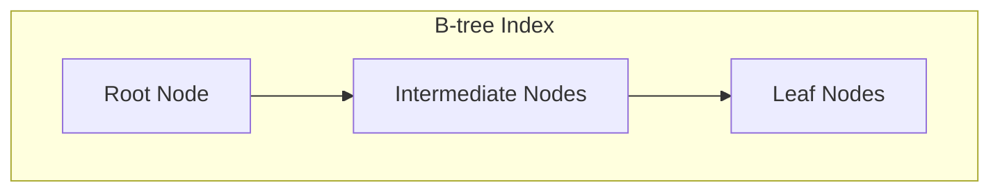
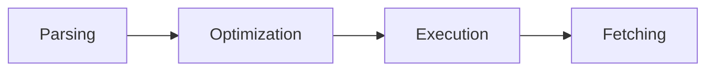
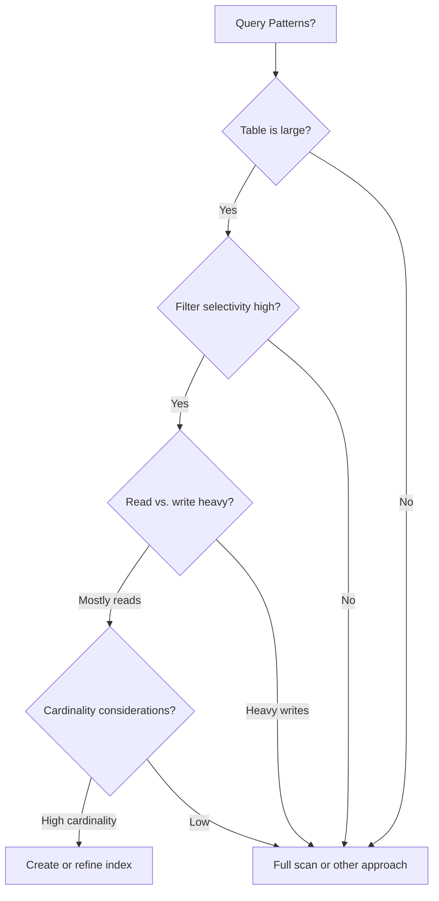
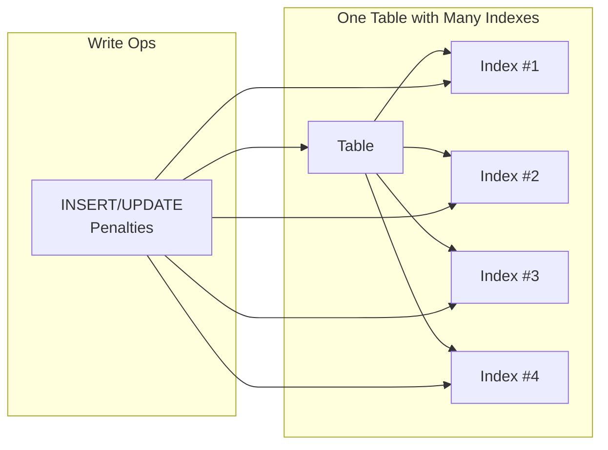
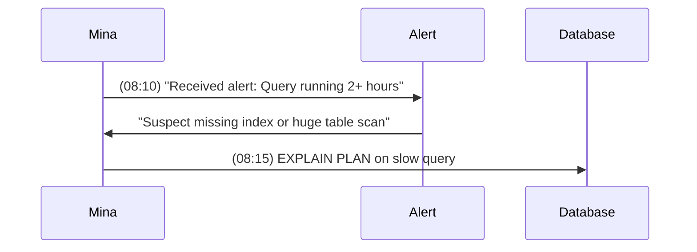

I'll create a prompt to generate Day 7 quiz questions based on Mina's training material on indexing strategies, execution plans, and query performance fundamentals. Here's the prompt:

# 📝 SRE Database Training Module - Day 7: Quiz Questions

## 🧑‍🏫 Role
You are an expert database instructor creating assessment questions for Day 7 of "The Follow-the-Sun Chronicles" training featuring Mina, the performance tuning engineer & index strategist based in Lagos, Nigeria. These questions will test knowledge from beginner to SRE-level concepts covered specifically in the Day 7 material, with the primary database focus being database indexing, query performance, and execution plans across Oracle, PostgreSQL, and SQL Server.

## 📝 Quiz Structure Requirements

Create 15 quiz questions with the following distribution:
- 5 (🔍) Beginner-Level Questions
- 5 (🧩) Intermediate-Level Questions 
- 5 (💡) Advanced/SRE-Level Questions

Include the following question types with the specified distribution:
- 8 Multiple choice questions (traditional format with 4 options)
- 2 True/False questions
- 2 Fill-in-the-blank questions
- 2 Matching questions (match concepts to definitions)
- 1 Ordering question (arrange steps in the correct sequence)

Each question must:
- Clearly indicate its difficulty level with the appropriate emoji
- Connect directly to content covered in the Day 7 material by Mina
- Reference Mina's analogies, principles, rules, or commentaries where appropriate
- Include relevant context for scenario-based questions
- Include database-specific content as presented in the training

At least 4 questions should incorporate Mermaid diagrams similar to those used in the Day 7 training for visual assessment.

## Quiz Content Focus Areas (Based on Day 7 Material)

1. **Database Performance Fundamentals**
   - Mina's kitchen analogy for response time, throughput, and resource usage
   - Her experience with resource usage skyrocketing due to missing indexes
   - The synergy between response time and throughput

2. **Query Execution Lifecycle**
   - Mina's road trip analogy for parse, optimize, execute, fetch
   - The importance of optimizer decisions and statistics
   - Common mistakes in assuming the optimizer is all-knowing

3. **Table Access Paths**
   - Mina's phone directory analogy for full scans vs. index scans
   - War story about the analytics query improvement
   - When full scans are appropriate versus disastrous

4. **Index Types and Structure**
   - B-tree, bitmap, hash, and specialized indexes
   - Mina's analogies for each type
   - War story about B-tree vs. bitmap index performance

5. **Index Design Principles**
   - Selectivity, cardinality, and overhead considerations
   - Multi-column (composite) indexing and key order importance
   - Mina's warnings about low-cardinality columns

6. **Execution Plan Reading**
   - Mina's techniques for comparing estimated vs. actual rows
   - Identifying plan operations (TABLE ACCESS FULL, INDEX RANGE SCAN, etc.)
   - Database-specific tools for plan analysis

7. **Index Anti-Patterns**
   - Mina's table of index anti-patterns
   - The "index sprawl" concept and its impact on write operations
   - Her famous "index performance tax" warning

8. **Troubleshooting and Optimization Techniques**
   - Mina's war stories about e-commerce search, 17 indexes, composite index mystery
   - Her sequence diagram for tracing a slow query
   - The index decision tree for choosing the right approach

9. **Mina's Commandments**
   - The seven commandments for query tuning
   - The observe-test-evaluate-take action cycle for performance
   - Real-world application of her principles

## Question Type Formats

### Multiple Choice Format
```
## Question X: [Topic]
🔍/🧩/💡 [Difficulty Level]

[Question text]

A. [Option A]
B. [Option B]
C. [Option C]
D. [Option D]
```

### True/False Format
```
## Question X: [Topic]
🔍/🧩/💡 [Difficulty Level]

[Statement]

A. True
B. False
```

### Fill-in-the-Blank Format
```
## Question X: [Topic]
🔍/🧩/💡 [Difficulty Level]

Complete the following statement:

[Statement with ________ for the blank]

A. [Option A]
B. [Option B]
C. [Option C]
D. [Option D]
```

### Matching Format
```
## Question X: [Topic]
🔍/🧩/💡 [Difficulty Level]

Match each item in Column A with the appropriate item in Column B.

Column A:
1. [Item 1]
2. [Item 2]
3. [Item 3]
4. [Item 4]

Column B:
A. [Definition/Example A]
B. [Definition/Example B]
C. [Definition/Example C]
D. [Definition/Example D]
```

### Ordering Format
```
## Question X: [Topic]
🔍/🧩/💡 [Difficulty Level]

Arrange the following steps in the correct order:

A. [Step A]
B. [Step B]
C. [Step C]
D. [Step D]
```

### Diagram-Based Question Format
```
## Question X: [Topic]
🔍/🧩/💡 [Difficulty Level]

Examine the following database diagram:

```mermaid
[Appropriate diagram code]
```

[Question text based on the diagram]

A. [Option A]
B. [Option B]
C. [Option C]
D. [Option D]
```

## Mermaid Diagram Guidelines for Questions

When creating diagram-based questions, use appropriate Mermaid syntax based on the type of visualization needed:

1. **B-tree Index Structure Diagrams**:


2. **Query Execution Lifecycle**:


3. **Index Decision Tree**:


4. **Index Sprawl Impact**:


5. **Sequence Diagram for Troubleshooting**:


## Special Considerations for Day 7

- Focus on Mina's blunt, no-nonsense performance tuning perspective
- Include questions related to Mina's "Query Tuning Commandments"
- Reference her war stories about e-commerce search, 17 indexes, and composite index mysteries
- Incorporate Mina's unique analogies (kitchen, road trip, phone directory)
- Include database-specific syntax and tools for Oracle, PostgreSQL, and SQL Server
- Address real-world SRE scenarios related to query performance and indexing
- Include questions about the impact of poor indexing on system resources and performance

DO NOT include the correct answers or explanations in the questions themselves. These will be provided in a separate answer key document.