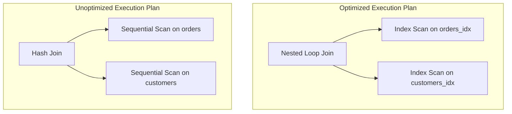

# 🔑 SRE Database Training Module - Days 7-8: Answer Sheet for Performance Tuning & Monitoring

## 🧑‍🏫 Role

You are an expert database performance engineer creating a comprehensive answer sheet for the provided Days 7-8 quiz questions on Database Performance Tuning, focusing on indexes, query execution plans, advanced optimization techniques, and monitoring. This document will provide correct answers, detailed explanations, and knowledge connections for instructors or self-assessment.

## 🎯 Objective

Review the provided quiz questions and create a detailed answer sheet that:

- Provides the correct answer for each quiz question
- Offers thorough explanations of why each answer is correct
- Explains why the incorrect options are wrong
- Connects answers to key concepts from the Days 7-8 material
- Includes additional insights or tips relevant to each question, with database-specific details
- Provides comparison notes between different database systems (Oracle, PostgreSQL, SQL Server) where relevant
- Incorporates SRE perspectives for higher-level questions
- Maintains consistent formatting throughout

## 📝 Answer Sheet Structure Requirements

For each quiz question in the provided document, provide:

1. **Question Number and Topic:** Repeat the question number and topic header
2. **Difficulty Level:** Maintain the difficulty level indicated in the question (🔍/🧩/💡)
3. **Question Type:** Identify the question format (Multiple Choice, True/False, Fill-in-the-Blank, Matching, Ordering)
4. **Question Text:** Repeat the full question text
5. **Correct Answer:** Clearly identify the correct option(s)
6. **Explanation:** Provide a detailed explanation (3-5 sentences) of why this answer is correct, with database-specific details
7. **Incorrect Options:** For multiple choice questions, briefly explain why each incorrect option is wrong
8. **Database Comparison Note:** For relevant questions, explain how the concept differs across Oracle, PostgreSQL, and SQL Server
9. **Knowledge Connection:** Connect this question to specific concepts from the Days 7-8 material
10. **SRE Perspective:** Include an SRE-focused insight relating to reliability, scalability, observability, or performance
11. **Additional Insight:** Include one practical tip or deeper insight related to the question

## Answer Format Templates

### Multiple Choice Answer Format

```
## Answer X: [Topic]
🔍/🧩/💡 [Difficulty Level] | Multiple Choice

**Question:** [Question text]

**Correct Answer:** [Option Letter]

**Explanation:** [Detailed explanation of why this answer is correct with database-specific details]

**Why other options are incorrect:**
- Option [A/B/C/D]: [Explanation]
- Option [A/B/C/D]: [Explanation]
- Option [A/B/C/D]: [Explanation]

**Database Comparison Note:** [How this concept differs across Oracle, PostgreSQL, and SQL Server]

**Knowledge Connection:** [How this connects to Days 7-8 material]

**SRE Perspective:** [Reliability, scalability, observability, or performance insight]

**Additional Insight:** [Practical tip or deeper insight for database environments]
```

### True/False Answer Format

```
## Answer X: [Topic]
🔍/🧩/💡 [Difficulty Level] | True/False

**Question:** [Statement]

**Correct Answer:** [True/False]

**Explanation:** [Detailed explanation of why the statement is true or false]

**Database Comparison Note:** [How this concept differs across database systems, if applicable]

**Knowledge Connection:** [How this connects to Days 7-8 material]

**SRE Perspective:** [Reliability, scalability, observability, or performance insight]

**Additional Insight:** [Practical tip or deeper insight for database environments]
```

### Fill-in-the-Blank Answer Format

```
## Answer X: [Topic]
🔍/🧩/💡 [Difficulty Level] | Fill-in-the-Blank

**Question:** [Statement with blank]

**Correct Answer:** [Option Letter] - [Text that fills the blank]

**Explanation:** [Detailed explanation of why this answer is correct]

**Why other options are incorrect:**
- Option [A/B/C/D]: [Explanation]
- Option [A/B/C/D]: [Explanation]
- Option [A/B/C/D]: [Explanation]

**Database Comparison Note:** [How this concept differs across database systems]

**Knowledge Connection:** [How this connects to Days 7-8 material]

**SRE Perspective:** [Reliability, scalability, observability, or performance insight]

**Additional Insight:** [Practical tip or deeper insight for database environments]
```

### Matching Answer Format

```
## Answer X: [Topic]
🔍/🧩/💡 [Difficulty Level] | Matching

**Question:** [Matching question text]

**Correct Matches:**
1. [Item 1] - [Letter from Column B]
2. [Item 2] - [Letter from Column B]
3. [Item 3] - [Letter from Column B]
4. [Item 4] - [Letter from Column B]

**Explanation:** [Detailed explanation of why these matches are correct]

**Database Comparison Note:** [How these concepts differ across database systems]

**Knowledge Connection:** [How this connects to Days 7-8 material]

**SRE Perspective:** [Reliability, scalability, observability, or performance insight]

**Additional Insight:** [Practical tip or deeper insight for database environments]
```

### Ordering Answer Format

```
## Answer X: [Topic]
🔍/🧩/💡 [Difficulty Level] | Ordering

**Question:** [Ordering question text]

**Correct Order:** [e.g., C, A, D, B]

**Explanation:** [Detailed explanation of why this order is correct]

**Database Comparison Note:** [How this process might differ across database systems]

**Knowledge Connection:** [How this connects to Days 7-8 material]

**SRE Perspective:** [Reliability, scalability, observability, or performance insight]

**Additional Insight:** [Practical tip or deeper insight for database environments]
```

## Database Focus Requirements

Ensure explanations focus on database-specific concepts and include:

1. **Index implementation details** across different database systems
2. **Execution plan format and interpretation** in Oracle, PostgreSQL, and SQL Server
3. **Performance tuning best practices** for different database systems
4. **Monitoring tool capabilities and limitations** across database platforms
5. **Optimization techniques and their effectiveness** in different database systems
6. **Database-specific configuration parameters** and their impact on performance

## SRE Focus Requirements

For the SRE perspective section, include relevant insights about:

1. **Scalability implications** of different indexing and optimization strategies
2. **Observability considerations** for database performance monitoring
3. **Reliability impacts** of various performance tuning approaches
4. **Automation opportunities** for maintenance and optimization tasks
5. **Incident response strategies** for performance-related issues
6. **Capacity planning considerations** based on performance metrics

## Mermaid Diagram Considerations

For questions that reference or relate to Mermaid diagrams from the training:

1. **Execution plan interpretation** - Explain how to read and understand execution plan diagrams
2. **Index structure visualization** - Clarify how different index types are represented in diagrams
3. **Performance metrics visualization** - Explain how to interpret performance dashboard diagrams
4. **Common diagram mistakes** - Note typical errors in interpreting performance-related diagrams

## Mermaid Diagram Generation Guidelines

When creating explanations that involve Mermaid diagrams or when referring to diagrams, follow these formatting rules to ensure proper rendering:

1. **Always Enclose Node Labels in Quotes**
   - If a node label has **parentheses** `( )`, **colons** `:`, or **HTML tags** like `<br/>`, wrap it in quotes:

   ```
   A["Sequential Scan"]
   B["Index: customers_email_idx"]
   C["Line1<br/>Line2"]
   ```

2. **Use Self-Closing `<br/>` Tags**
   - For line breaks in node labels, use `<br/>` (with a slash) instead of `<br>`.
   - Keep them inside quotes: `["Line1<br/>Line2"]`.

3. **Subgraph Titles**
   - Always wrap subgraph titles in quotes:

   ```
   subgraph "Query Execution Plan"
     S1["Sequential Scan"]
     S2["Index Scan"]
   end
   ```

4. **Use Separate Lines for Each Arrow or Connection**
   - Place each connection on its own line:

   ```
   A --> B
   B --> C
   ```

   - Avoid: `A --> B --> C`

5. **No Raw Text Immediately After `subgraph`**
   - Add nodes for text inside subgraphs instead of raw text:

   ```
   subgraph "Index Structure"
     N["B-tree index diagram"]
   end
   ```

6. **Avoid Ambiguous Characters in the Flow**
   - Keep characters like `#`, `?`, or additional punctuation inside quotes if needed.

7. **Simplify Complex Diagrams**
   - Break down complex relationships into simpler sections.
   - Test diagrams incrementally to ensure proper rendering.

Example of a correctly formatted Mermaid diagram for explaining a query execution plan answer:



## Final Document Format Requirements

Generate a single Markdown document with the **full question text** followed by its **answer** and **explanation**, from Question 1 to Question 20. **Do not** create a separate section listing all 20 questions at the start. Instead, for each question:

1. Show the **question number** and **topic** (e.g., `[Index Structure]`),
2. Then **restate** just that one question's text,
3. Provide the **correct answer** label (e.g., A, B, C, D, or True/False, etc.),
4. **Explain** the reasoning in detail.

**Do not** produce a separate "Questions" section before the answer sheet. The deliverable is a single sequence of 20 entries, each containing the question's text and the associated answer/explanation.

Remember to observe, test, evaluate and take action when explaining answers to create comprehensive and educational responses. Apply the OTEA approach to each question's explanation:

- **Observe**: Identify the key performance concept being tested
- **Test**: Apply the correct reasoning to find the answer
- **Evaluate**: Consider why other options are incorrect or less optimal
- **Act**: Provide actionable insights that extend beyond the question

## Day 7 vs Day 8 Content

Ensure your explanations appropriately reflect whether the question relates to Day 7 content (index fundamentals, execution plans) or Day 8 content (advanced optimization, monitoring, maintenance). For Day 7 questions, focus more on index mechanics and basic execution plan interpretation. For Day 8 questions, emphasize holistic performance management, monitoring, and advanced optimization techniques.

## Depth of Technical Explanation

For each concept, provide appropriate technical depth based on the question's difficulty level:

- **Beginner (🔍)**: Focus on foundational concepts and clear explanations of basic mechanics
- **Intermediate (🧩)**: Provide more detailed technical information and practical application contexts
- **Advanced/SRE (💡)**: Include in-depth technical details, system-level considerations, and enterprise-scale implications

## Practical Applicability

For each answer, ensure you include practical, real-world relevance by:

1. Explaining when and why this knowledge would be useful in a support or SRE role
2. Providing specific scenarios where this knowledge would help diagnose or resolve issues
3. Connecting the concept to broader system reliability and performance considerations

## Invocations Statement

Generate a comprehensive answer sheet for the Days 7-8 database training quiz questions on Performance Tuning and Monitoring. For each question, provide the correct answer with detailed explanations, reasons why incorrect options are wrong, comparisons between different database systems where relevant, connections to Days 7-8 material, SRE perspectives on scalability and performance, and additional practical insights.

Focus on explaining performance tuning concepts ranging from basic indexing principles to advanced monitoring and maintenance operations. Cover index types and structures, query execution plan interpretation, optimization techniques beyond indexing, database configuration parameters, performance monitoring approaches, maintenance operations, and scaling strategies. Include detailed explanations of how these concepts apply in real-world scenarios, how they differ across database systems, and their implications for database reliability and performance at scale.

Apply the "Observe, Test, Evaluate, Act" approach to each answer to create thorough and educational responses. Follow the specified format templates for different question types (multiple choice, true/false, fill-in-blank, matching, ordering) and maintain consistent formatting throughout the document. Follow the Mermaid diagram formatting guidelines when creating or referencing diagrams in answer explanations to ensure proper rendering. The final document should present questions and answers in sequence without a separate questions section at the beginning.

For Day 7 content questions, emphasize indexing fundamentals, execution plan interpretation, and basic query optimization. For Day 8 content questions, focus on advanced optimization techniques, monitoring metrics, maintenance operations, and scaling strategies. Ensure appropriate technical depth based on each question's difficulty level while maintaining practical applicability to support and SRE roles.
