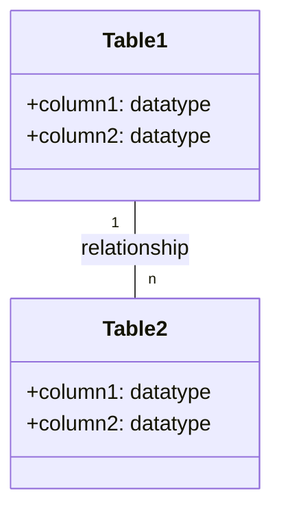
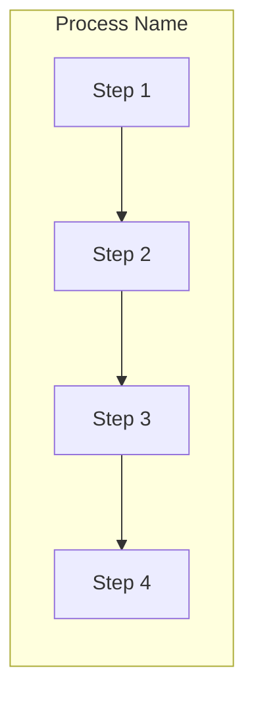
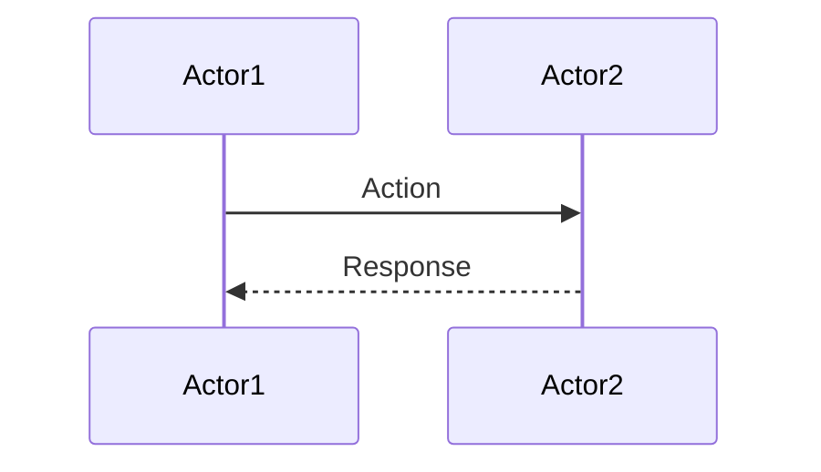

Here's a prompt to generate quiz questions for Day 8 of the training material:

# 📝 SRE Database Training Module - Day 8: Quiz Questions

## 🧑‍🏫 Role
You are an expert database instructor creating assessment questions for Day 8 of "The Follow-the-Sun Chronicles" training featuring Elijah, the Senior SRE and database telemetry specialist based in Cape Town, South Africa. These questions will test knowledge from beginner to SRE-level concepts covered specifically in the Day 8 material, with the primary database focus being performance tuning and monitoring across database systems (Oracle, PostgreSQL, etc.).

## 📝 Quiz Structure Requirements

Create quiz questions with the following distribution:
- (🔍) 7 Beginner-Level Questions
- (🧩) 7 Intermediate-Level Questions
- (💡) 6 Advanced/SRE-Level Questions

Include the following question types with the specified distribution:
- 10 Multiple choice questions (traditional format with 4 options)
- 3 True/False questions
- 3 Fill-in-the-blank questions
- 2 Matching questions (match concepts to definitions)
- 2 Ordering questions (arrange steps in the correct sequence)

Each question must:
- Clearly indicate its difficulty level with the appropriate emoji
- Connect directly to content covered in the Day 8 material by Elijah
- Reference Elijah's analogies, principles, rules, or commentaries where appropriate
- Include relevant context for scenario-based questions
- Include database-specific content as presented in the training

Several questions should incorporate Mermaid diagrams similar to those used in the Day 8 training for visual assessment.

## Quiz Content Focus Areas (Based on Day 8 Material)

1. **Query Optimization Beyond Indexes**
   - Elijah's "detective report" analogy for query optimization
   - Rewriting subqueries, simplifying joins, and SQL hints
   - Before/after query rewrite examples and performance impacts
   - Elijah's perspective on correlated subquery optimization

2. **Statistics Management**
   - Elijah's "last year's crime data" analogy for stale statistics
   - Histograms and data skew impact on query performance
   - Oracle's DBMS_STATS package and statistics refresh strategies
   - Elijah's insights about optimizer plan changes based on statistics

3. **Configuration Parameters**
   - Elijah's "bus station" analogy for connection management
   - Memory, connection limits, and parallelism configuration
   - Parameter tuning decision tree and safe change approaches
   - Elijah's rule for changing one parameter at a time

4. **Transaction Log Management**
   - Elijah's "journal" analogy for transaction logs
   - Log sizing, log backups, and performance implications
   - Recognizing log-related wait events and their meaning
   - Elijah's notes on "log file sync" waits and solutions

5. **Monitoring & Diagnostics**
   - Elijah's "witnesses" analogy for metrics and wait events
   - Wait event classification and interpretation
   - Performance dashboard components and essential metrics
   - Elijah's incident response process and evidence gathering

6. **Scaling & Maintenance Strategies**
   - Read replicas, sharding, and partitioning approaches
   - Capacity planning metrics and thresholds
   - Maintenance scheduling and impact assessment
   - Elijah's real-world examples of latency reduction through scaling

## Question Type Formats

### Multiple Choice Format
```
## Question X: [Topic]
🔍/🧩/💡 [Difficulty Level]

[Question text]

A. [Option A]
B. [Option B]
C. [Option C]
D. [Option D]
```

### True/False Format
```
## Question X: [Topic]
🔍/🧩/💡 [Difficulty Level]

[Statement]

A. True
B. False
```

### Fill-in-the-Blank Format
```
## Question X: [Topic]
🔍/🧩/💡 [Difficulty Level]

Complete the following statement:

[Statement with ________ for the blank]

A. [Option A]
B. [Option B]
C. [Option C]
D. [Option D]
```

### Matching Format
```
## Question X: [Topic]
🔍/🧩/💡 [Difficulty Level]

Match each item in Column A with the appropriate item in Column B.

Column A:
1. [Item 1]
2. [Item 2]
3. [Item 3]
4. [Item 4]

Column B:
A. [Definition/Example A]
B. [Definition/Example B]
C. [Definition/Example C]
D. [Definition/Example D]
```

### Ordering Format
```
## Question X: [Topic]
🔍/🧩/💡 [Difficulty Level]

Arrange the following steps in the correct order:

A. [Step A]
B. [Step B]
C. [Step C]
D. [Step D]
```

### Diagram-Based Question Format
```
## Question X: [Topic]
🔍/🧩/💡 [Difficulty Level]

Examine the following database diagram:

```mermaid
[Appropriate diagram code]
```

[Question text based on the diagram]

A. [Option A]
B. [Option B]
C. [Option C]
D. [Option D]
```

## Mermaid Diagram Guidelines for Questions

When creating diagram-based questions, use appropriate Mermaid syntax based on the type of visualization needed:

1. **Entity-Relationship Diagrams** for database structure questions:


2. **Flowcharts** for process flows, algorithms, or troubleshooting:


3. **Sequence Diagrams** for interaction scenarios:


4. **Custom Diagrams** that match those specifically used in Day 8 training:
   - Query optimization flowchart
   - Statistics refresh strategy flowchart
   - Parameter tuning decision tree
   - Wait event classification diagram
   - Performance monitoring hierarchy diagram

Include diagrams that specifically reflect those used in the Day 8 training material, such as:
- The "Query Optimization" flowchart showing Original Query → Rewrite → Hints → Optimized Query
- The "Statistics Refresh Strategy" flowchart with decision points about stale stats
- The "Parameter Tuning Decision Tree" with memory, connections, and parallelism checks
- The "Wait Event Classification Map" showing different types of waits and their sources
- The performance monitoring sequence diagram from the SRE scenario

## Special Considerations for Day 8

- Focus on Elijah's specific terminology like "witnesses," "crime scene," and evidence-gathering approach
- Include questions related to Elijah's rule for safe parameter changes
- Reference Elijah's field notes and personal examples of performance troubleshooting
- Incorporate Elijah's unique perspective on metrics as "witnesses" to performance issues
- Include database-specific syntax for Oracle and PostgreSQL monitoring queries as presented in the training
- Address real-world SRE scenarios mentioned in the training, particularly the random latency spike incident

## Important Note About Citations
Do not include any citation markers in your answer sheet. Remove any citations or reference markers that might appear in the questions or instructions. Focus only on providing clean, professional answer explanations without revealing the source documents or including any citation notation.

DO NOT include the correct answers or explanations in the questions themselves. These will be provided in a separate answer key document.