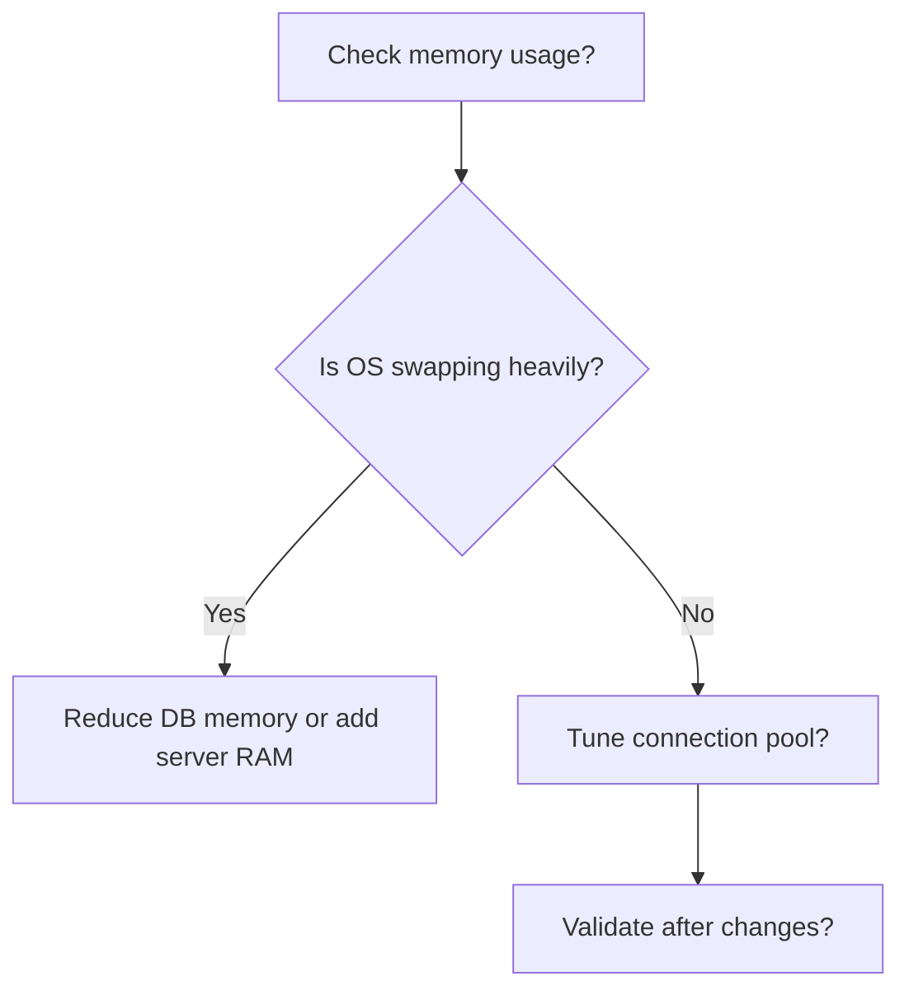
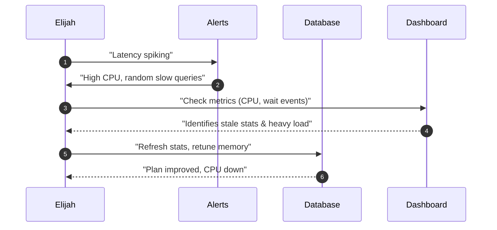

# Day 8 Quiz

## Question 1: Query Rewrites  
🔍 Beginner-Level (Multiple Choice)

Elijah compares query optimization to “rewriting a detective report.” Which of the following best captures why rewriting a correlated subquery to a join can improve performance?

A. It disguises the query so the optimizer cannot detect it  
B. It reduces repeated scanning of the same rows  
C. It forces a full table scan on all tables involved  
D. It eliminates the need to gather statistics  

---

## Question 2: Statistics Analogy  
🔍 Beginner-Level (Multiple Choice)

Elijah refers to stale database statistics as being like “last year’s crime data.” What is the main issue if your database relies on outdated statistics for query planning?

A. It always chooses index scans even on very small tables  
B. It may drastically misjudge the number of rows to process  
C. It disables the use of transaction logs  
D. It locks all tables until stats are manually updated  

---

## Question 3: Log File Sync Waits  
🔍 Beginner-Level (True/False)

Elijah describes transaction logs as a database “journal,” and warns that “log file sync” waits can spike when logs are undersized or too many commits occur rapidly.

A. True  
B. False  

---

## Question 4: Connection Management  
🔍 Beginner-Level (Multiple Choice)

Elijah likens having too many active connections to running a bus station beyond capacity. If your database consistently shows CPU near 100% with a very large number of active connections, which approach does Elijah recommend?

A. Let the OS handle the excess connections automatically  
B. Reduce maximum connections or set up connection pooling  
C. Completely remove all memory limits  
D. Force a parallel execution plan on all queries  

---

## Question 5: Configuration Parameters  
🔍 Beginner-Level (Fill-in-the-Blank)

Complete the following statement:

Elijah’s rule for safe parameter changes is to ________.

A. Modify three to four parameters simultaneously to save time  
B. Change one parameter at a time and measure results  
C. Always revert to default values after testing  
D. Ask the optimizer for recommended changes  

---

## Question 6: Histograms and Data Skew  
🔍 Beginner-Level (Multiple Choice)

Elijah emphasizes building histograms to help the optimizer deal with skewed data. Which scenario best describes when histograms are most beneficial?

A. A table where every row has the same value for a key column  
B. A small table of under 100 rows that rarely changes  
C. A large table where certain column values appear much more frequently than others  
D. A table that has zero distinct values across all columns  

---

## Question 7: Maintenance Scheduling  
🔍 Beginner-Level (True/False)

According to Elijah, scheduling routine maintenance tasks (like stats refreshes or log backups) in peak usage windows is best practice to immediately catch problems.

A. True  
B. False  

---

## Question 8: Subquery Optimization  
🧩 Intermediate-Level (Multiple Choice)

Elijah shows an example query:

```sql
SELECT *
FROM orders
WHERE customer_id IN (SELECT customer_id FROM blacklist);
```

He rewrote it to a join for performance. What is the primary benefit of using a join here instead of the `IN` subquery?

A. It eliminates the need for indexes  
B. The rewritten query can be optimized into a single pass with better join methods  
C. It forces correlated subqueries for each row  
D. It hides the query from the optimizer’s plan cache  

---

## Question 9: Monitoring “Witnesses”  
🧩 Intermediate-Level (Multiple Choice)

Elijah calls metrics and wait events the “witnesses” in the crime scene of performance issues. Which of the following best describes how wait event analysis helps diagnose performance bottlenecks?

A. Wait events always indicate hardware failure  
B. They show precisely where queries spend most time (I/O, locks, CPU, etc.)  
C. They force the optimizer to rewrite queries automatically  
D. They hide concurrency problems by masking lock times  

---

## Question 10: Transaction Logs  
🧩 Intermediate-Level (Fill-in-the-Blank)

Complete the following statement about transaction log management:

“For high-volume write scenarios, Elijah recommends ________ to reduce frequent log file growth events.”

A. decreasing the log buffer size  
B. enabling parallel query at all times  
C. adequately sizing logs and scheduling log backups  
D. disabling commit operations  

---

## Question 11: Parameter Tuning Decision Tree  
🧩 Intermediate-Level (Multiple Choice with Diagram)

Examine Elijah’s simplified parameter tuning decision tree:



According to Elijah’s approach, what is the next step if you discover that your OS is swapping heavily due to insufficient memory?

A. Increase the total number of parallel processes  
B. Defer any memory adjustments until peak hours  
C. Reduce database memory usage or add more RAM  
D. Manually disable the transaction log buffer  

---

## Question 12: Wait Event Matching  
🧩 Intermediate-Level (Matching)

Match each wait event category in Column A with its best description in Column B.

Column A:  
1. I/O Wait  
2. Lock Wait  
3. CPU Wait  
4. Configuration Wait  

Column B:  
A. Queries are stalled due to row or table locking  
B. Reads or writes to disk are causing delays  
C. The system is contending for CPU scheduling or spinlocks  
D. The database is waiting on an undersized log or memory setting  

---

## Question 13: Scaling Approaches  
🧩 Intermediate-Level (Multiple Choice)

Elijah advocates scaling techniques like read replicas, sharding, and partitioning. Which scenario would most likely benefit from a read replica approach?

A. A table with minimal reads but huge writes  
B. An application performing many complex read queries that overwhelm the primary database  
C. A high-throughput write workload that saturates disk I/O  
D. A database with no growth in traffic or data volume  

---

## Question 14: Plan Flips  
🧩 Intermediate-Level (True/False)

Elijah notes that “plan flips” often happen when the optimizer encounters dramatic changes in data distribution or stale statistics, and these flips can cause random performance spikes.

A. True  
B. False  

---

## Question 15: Crime Scene Tools  
💡 Advanced/SRE-Level (Matching)

Elijah mentions “essential SQL queries” for performance investigation. Match each scenario in Column A with the tool or method in Column B that would best help.

Column A:  
1. High CPU usage and many concurrent queries  
2. Suspicion of stale statistics in Oracle  
3. Analyzing exact row-level blocking details  
4. Investigating which queries cause disk stress  

Column B:  
A. Checking `pg_stat_activity` or Oracle’s V$SESSION for locks and sessions  
B. Running `EXPLAIN (ANALYZE, BUFFERS)` or Oracle’s plan table to see I/O usage  
C. Using Oracle `DBMS_STATS.GATHER_TABLE_STATS` or similar to refresh stats  
D. Listing active sessions with high CPU from system or DB views  

---

## Question 16: Memory Configuration  
💡 Advanced/SRE-Level (Fill-in-the-Blank)

Complete the following statement regarding memory tuning:

“Elijah warns that setting ________ too high can lead to OS swapping, while setting it too low forces frequent disk reads.”

A. the parallel execution parameter  
B. the maximum log file size  
C. the database memory allocation  
D. the read replica delay threshold  

---

## Question 17: Query Rewrite or Hints  
💡 Advanced/SRE-Level (Multiple Choice)

When facing an especially persistent suboptimal plan in Oracle, Elijah sometimes suggests using hints. Which best describes Elijah’s rationale?

A. Hints permanently lock the plan with no further maintenance needed  
B. Hints force the optimizer to follow a specific approach when auto-tuning fails  
C. Hints disable the gathering of statistics  
D. Hints allow writing queries without a FROM clause  

---

## Question 18: Monitoring Sequence  
💡 Advanced/SRE-Level (Multiple Choice with Diagram)

Observe Elijah’s monitoring sequence diagram:



What is the primary goal of referencing both the Alerts system and the Dashboard metrics before acting?

A. To find a way to disable transaction logs permanently  
B. To skip directly to rewriting the entire schema  
C. To gather evidence (metrics, wait events) and confirm the root cause before applying fixes  
D. To create confusion about which query is at fault  

---

## Question 19: Scaling & Sharding Steps  
💡 Advanced/SRE-Level (Ordering)

Elijah frequently addresses major scaling issues by following certain steps. Arrange the following actions in the correct sequence:

A. Monitor growth trends and system load over time  
B. Decide on partitioning or sharding based on data size and access patterns  
C. Implement the new partitions or shards in a staging environment  
D. Evaluate query performance changes after deployment  

---

## Question 20: Diagnosing a Sudden Meltdown  
💡 Advanced/SRE-Level (Ordering)

Elijah’s meltdown triage often involves specific steps. Put these in the correct order:

A. Pinpoint the top resource-consuming queries or wait events  
B. Verify memory, CPU, and transaction log usage  
C. Apply targeted fixes (query rewrites, parameter adjustments)  
D. Observe metric improvements and update alerts if needed  

---

**End of Day 8 Quiz**  

**Instructions to the Learner**: You have 20 questions that span multiple choice, true/false, fill-in-the-blank, matching, and ordering formats. They test your understanding of advanced performance tuning, statistics management, transaction log strategies, and real-world SRE approaches discussed by Elijah. Refer to the Day 8 training material for deeper insights and examples. No answers or explanations are provided here; those will be in a separate answer key.