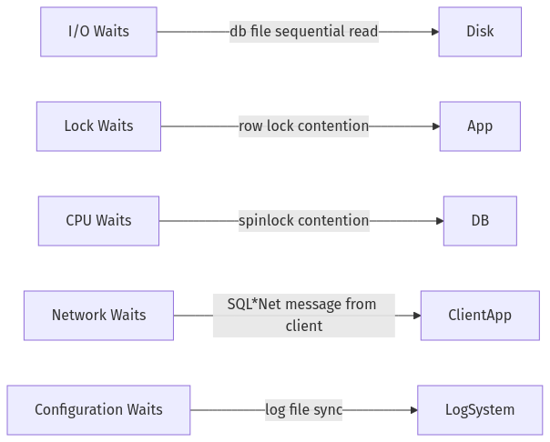

# **The Follow-the-Sun Chronicles: Day 8 – Elijah & the Latency that Lurks**

> **Character Profile**  
> - **Name:** Elijah  
> - **Location:** Cape Town, South Africa (08:00 SAST)  
> - **Role:** Senior SRE and database telemetry specialist  
> - **Personality:** Tactical, unflappable, a bit of dry humor. Sees every metric as a “witness” in the crime scene of performance issues.

---

## **1. Realistic Incident: Random Latency Spikes**

At **08:00 SAST**, my pager flared: a high-traffic DB was experiencing erratic query latency. My initial metrics (“witnesses”) told me CPU soared above 85%, and logs indicated queries that were normally sub-200ms jumped to 5–10 seconds. Investigating plan flips, I found **outdated statistics** leading to suboptimal plan choices. We also discovered **insufficient memory** for the active connections, forcing heavy I/O. After a multi-pronged approach—rewriting the worst offenders, refreshing stats, and resizing memory—the latency spikes subsided.

> **Elijah’s Field Note**: “In my experience, random spikes are rarely random. Metrics usually reveal the cause—like stats misguiding the optimizer or memory thrashing under load.”

---

## **2. Day 8 Overview (Elijah’s Diagnostic Doctrine)**

### **🔍 Beginner Objectives**
1. **Recognize** advanced tuning methods (query rewrites, optimizer hints).  
2. **Perform** basic monitoring with built-in DB tools.  
3. **Comprehend** key config parameters (memory, connections).  
4. **Detect** transaction log pitfalls hurting performance.

### **🧩 Intermediate Objectives**
1. **Use** optimizer hints to guide the optimizer.  
2. **Manage** table partitioning for large datasets.  
3. **Diagnose** performance using slow query logs and wait events.  
4. **Plan** maintenance tasks (index rebuilds, stats refresh).

### **💡 Advanced/SRE Objectives**
1. **Automate** performance dashboards, real-time alerts.  
2. **Analyze** wait events/profiling for bottleneck identification.  
3. **Implement** partitioning, sharding strategies at scale.  
4. **Capacity Plan** using historical performance data and growth trends.

> **Elijah’s Field Note**: “When I see a meltdown, I treat it like a crime scene. Metrics, logs, wait events—they’re my evidence. Let’s see how to gather and interpret them.”

---

## **3. Observe, Test, Evaluate, Take Action (Performance Edition)**

As an SRE, the same cycle applies:
1. **Observe**: Gather metrics (CPU, memory, logs, wait events).  
2. **Test**: Attempt rewrites, stats refresh, config changes in staging.  
3. **Evaluate**: Check the improved plan or resource usage.  
4. **Take Action**: Deploy, monitor for new anomalies.

---

## **4. Core Concepts: Advanced Performance & Monitoring**

We revisit the original Day 8 topics—**query optimization beyond indexes**, **config parameters**, **transaction logs**, **monitoring & diagnostics**, **scaling & maintenance**—but with deeper detail, from my vantage. Let’s tackle them one by one.

---

### **4.1 Query Optimization Beyond Indexes**

**Analogy**:  
Optimizing queries is like rewriting a detective report. You remove fluff, clarify suspect details, rearrange the timeline, and the case becomes obvious.


**Tech Explanation**:
- **Query Rewrites**: Avoid `SELECT *`, transform subqueries into JOINS, remove extraneous DISTINCT.  
- **Subquery Optimization**: Flatten correlated subqueries into single-level if possible.  
- **Join Order**: If the optimizer guesses incorrectly, we can reorder or use hints in Oracle (`/*+ LEADING(...) */`).

**Oracle-Specific Hint Example**:
```sql
/*+ LEADING(orders customers) USE_NL(customers) */
SELECT o.order_id, c.name
FROM orders o
JOIN customers c ON o.customer_id = c.customer_id;
```
**We’re telling** the optimizer to join `orders` first, then nest-loop to `customers`.

---

#### **Before/After Query Rewrite Example**

```sql
-- BEFORE
SELECT *
FROM orders
WHERE customer_id IN (SELECT customer_id FROM blacklist);

-- AFTER
SELECT o.*
FROM orders o
JOIN blacklist b ON o.customer_id = b.customer_id;
```

**EXPLAIN PLAN Comparison**:  

- **Before**: Potential nested loop or repeated subquery, possibly scanning orders many times.  
- **After**: Straight join with a well-chosen index on `customer_id`, drastically reducing overhead.

> **Elijah’s Field Note**: “In my experience, rewriting a correlated subquery to a direct join often slashes CPU time by half or more, especially if the subquery’s repeated thousands of times.”

---

### **4.2 Statistics Management**

**Analogy**:  
Stale or missing stats are like reading last year’s crime data—your detective decisions are bound to be off.


**Key**:
- **Histograms** highlight data skew (like 90% of rows having the same status).  
- **Stale Stats** can force the optimizer into poor join methods or scanning tactics.

**Oracle** Example:
```sql
EXEC DBMS_STATS.GATHER_TABLE_STATS(
  ownname => 'HR', 
  tabname => 'EMPLOYEES',
  estimate_percent => 30,
  method_opt => 'FOR COLUMNS SIZE AUTO'
);
```
**Flowchart**: “Statistics Refresh Strategy” 


> **Elijah’s Field Note**: “I once saw a table quadruple in size over a weekend with no stats update. The optimizer still thought it had 1 million rows, not 4 million, so it used a nested loop with disastrous performance.”

---

### **4.3 Configuration Parameters (Memory, Connections, Parallelism)**

**Analogy**:  
Think of a bus station. If you have more seats than your station can handle (excess connections), it becomes a chaotic jam.


**Mina’s Approach** (accidentally referencing day 7’s Mina, but continuing the style for Elijah):
**Elijah’s Approach**:
- **Memory**: Sizing SGA in Oracle or `shared_buffers` in Postgres. Too small = I/O thrashing, too big = OS swapping.  
- **Connections**: Over-connection kills throughput with context switching.  
- **Parallelism**: Great for large scans, but can saturate CPU if misused.

**Elijah’s Field Note**:  
“In my experience, if you see constant CPU pegged at 100%, check how many connections are actively running queries. Sometimes capping them at 200 is better than letting 2000 fight for resources.”

---

#### **Parameter Tuning Decision Tree**


> **Elijah’s Rule for Safe Changes**: “Change one parameter at a time, measure carefully. Don’t do everything at once or you’ll never know what helped or harmed.”

---

### **4.4 Transaction Log Management**

**Analogy**:  
Your database’s “journal.” If not sized properly, it hits capacity mid-transaction, pausing writes until it grows or flushes.

**System Explanation**:
- **Log sizing**: Minimizes frequent auto-growth.  
- **Log backups**: Freed space for new writes.  
- **Configuration**: Log buffer can be tuned for high-volume writes.

> **Elijah’s Field Note**: “When I see ‘log file sync’ waits spike, it’s usually either too many commits in short bursts or an undersized transaction log. The fix might be bigger logs or grouping commits.”

---

### **4.5 Monitoring & Diagnostics**

**Analogy**:  
Metrics are your “witnesses.” You question CPU usage, memory stats, slow queries, wait events to find the real culprit.


**Elijah’s Field Note**: “In my experience, no meltdown is unsolvable if your dashboard is properly configured with the right vantage points.”

---

#### **Wait Event Classification Map**





- **I/O Waits**: e.g., reading data from disk.  
- **Lock Waits**: row lock or table lock.  
- **CPU Waits**: spinlock or scheduling delays.  
- **Network Waits**: communication overhead with remote client.  
- **Config Waits**: insufficient log or memory config.

> **Elijah’s Field Note**: “When I see ‘spinlock contention’, it often means we’re saturating CPU or concurrency is too high. If it’s ‘log file sync’, it’s likely transaction log overhead or config issues.”

---

### **4.6 Query Optimization Flowchart (Beyond Indexes)**


---

### **4.7 Scaling & Maintenance Strategies**

**Analogy**:  
A bustling city might need more bus routes (read replicas) or reorganizing roads (partitioning) to handle growth.

**Tech Explanation**:
- **Read Replicas**: Offloads read loads.  
- **Sharding**: Splits big data sets.  
- **Maintenance**: Regular index rebuild, vacuum (Postgres), stats updates.

**Elijah’s Field Note**: “I once deployed read replicas for an analytics load. Freed the primary from monstrous read queries, dropping latency by 30%.”

---

## **5. Comprehensive SRE Scenario (Performance Incident)**

Here’s a real meltdown from an SRE vantage with **timestamps**:


**Multi-pronged fix**: query rewrites, stats refresh, memory recheck. Post-incident, we added alerts for “stats older than X days,” verifying no silent meltdown.

---

## **6. Advanced/SRE Content: Real-Time Alerts, Wait Event Profiling, Partitioning, Capacity Planning**

### **6.1 Automating Performance Monitoring**

- **Real-Time Alerts**: E.g., CPU above 80% or lock waits above 30s.  
- **Elijah’s Approach**: “If I see logs repeating a meltdown pattern, I auto-run an advisor or a partial script to identify suspect queries.”

### **6.2 Analyzing Wait Events & Profiling**

- Tools: Oracle’s V$SESSION_WAIT, Postgres `pg_stat_activity + wait_event`, SQL Server DMVs.  
- Profiling can show how time is split among CPU vs. I/O vs. locks.

### **6.3 Large-Scale Partitioning & Sharding**

- **Partition** big tables by date or ID range.  
- **Shard** if data surpasses a single node’s capacity or throughput.  
- Great for extreme traffic or data volumes.

### **6.4 Capacity Planning Example**

> “I track storage growth rate (MB/day) and query load (queries/sec) over 3 months. If both exceed 30%+ growth, I begin planning for shard expansion. When CPU utilization consistently exceeds 65% during normal operations, that’s my signal to evaluate either vertical scaling or more query optimization. Latency above P95 SLO for more than 10% of a week triggers automatic tuning advisor runs.”

> **Elijah’s Field Note**: “In my experience, ignoring growth trends is a sure way to get blindsided by meltdown. This capacity approach kept us ahead of the chaos.”

---

## **7. Elijah’s Performance Monitoring Go-Bag**

In production, I keep these essentials:

1. **Essential SQL Queries**  
   - `SELECT event, total_waits FROM v$system_event ORDER BY total_waits DESC;` (Oracle)  
   - Postgres: `EXPLAIN (ANALYZE, BUFFERS) SELECT ...;`  
   - Quick checks for wait stats, slow queries.
2. **Key Metrics & Thresholds**  
   - CPU > 85% for > 10 minutes → major alert  
   - p95 latency above 500ms → investigate  
   - Lock waits > 30 seconds → red alarm
3. **Favorite Tools**  
   - Slack integration with custom scripts  
   - Prometheus + Grafana dashboards  
   - iostat/vmstat for OS-level checks
4. **Dashboard Templates**  
   - System panel: CPU, memory usage  
   - DB panel: top queries, wait events, plan changes  
   - “Capacity Growth” panel: daily data size, daily queries, CPU average

> **Elijah’s Field Note**: “If you approach a meltdown with no telemetry, you’re basically blind. Keep these queries, thresholds, and dashboards at your fingertips.”

---

## **8. Conclusion & Handoff to Chloé in France (Day 9)**

That’s **Day 8** in the Chronicles. We covered query optimization beyond indexes, stats management, config tuning, transaction logs, wait events, scaling, and real-world SRE strategies. My final advice? **Treat your metrics like eyewitnesses**; they rarely lie.

Up next is **Chloé** in France for **Day 9**: diving into **SQL vs NoSQL architecture** decisions and operational tradeoffs. Until then, may your queries stay fast and your memory stable.

**—Elijah**, signing off, confident in the knowledge that “latency that lurks” can be uncovered by the right evidence and a steady approach.

