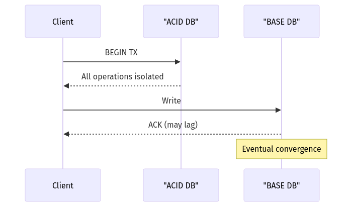
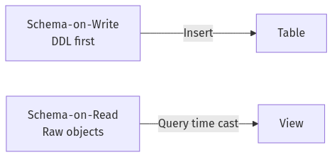
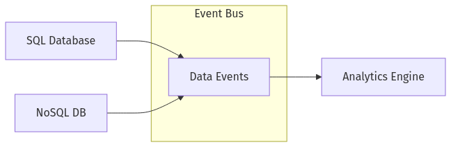
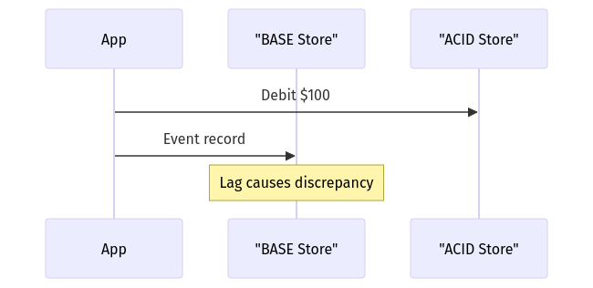
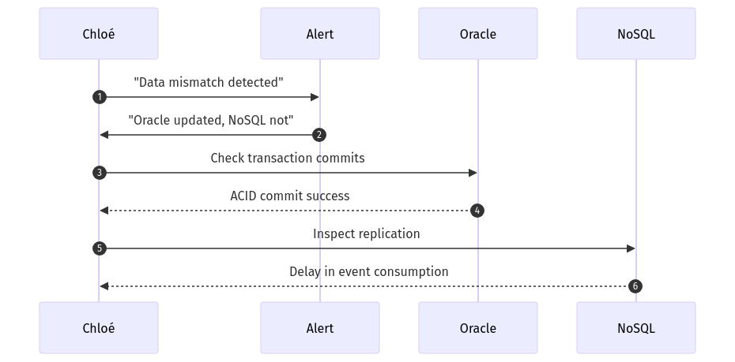
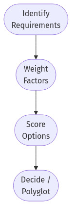
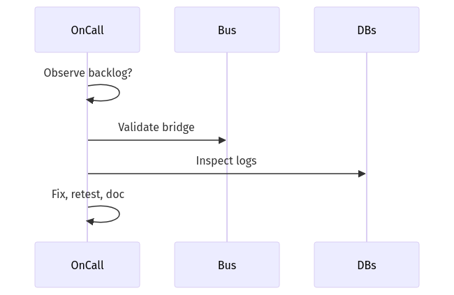

# **Day 9 Answer Sheet** 

## Answer 1: Database Paradigms Overview  
🔍 Beginner‑Level | Multiple Choice  

**Question:**  
Chloé compares SQL databases to a meticulously organized library and NoSQL databases to an eclectic bookstore. Which statement best summarizes this analogy?  

A. SQL provides strict rules and structure, while NoSQL offers more flexibility but potential disorder.  
B. SQL is always faster than NoSQL because of its rigid approach.  
C. NoSQL systems are chaotic and inherently unscalable.  
D. SQL databases are obsolete due to the rise of NoSQL.  

**Correct Answer:** **A**

**Explanation:**  
SQL systems enforce fixed schemas, ACID transactions, and referential integrity—like a well‑catalogued library—whereas NoSQL platforms allow schema flexibility similar to an eclectic bookstore, trading rigor for agility and scale.

**Why other options are incorrect:**  
- **B:** Performance is workload‑dependent; rigid schemas do not guarantee speed.  
- **C:** Modern NoSQL engines scale horizontally and are not inherently chaotic.  
- **D:** SQL remains central to countless mission‑critical workloads.  

**Database Comparison Note:** PostgreSQL or Oracle deliver strong schema control, while MongoDB and DynamoDB emphasise flexible, developer‑defined structures.  

**Knowledge Connection:** Mirrors Chloé’s “library vs. bookstore” slide explaining schema rigidity versus flexibility.  

**SRE Perspective:** Flexibility without governance can cause drift; monitor schema evolution in NoSQL to prevent hidden incidents.  

**Additional Insight:** Maintain JSON Schema or Protobuf contracts for NoSQL documents to restore some library‑style order.  

**Visual Explanation:** *(not required for this question)*  

---

## Answer 2: SQL vs. NoSQL Decision  
🔍 Beginner‑Level | Multiple Choice  

**Question:**  
According to Chloé, which factor is the most important when deciding whether to choose SQL or NoSQL?  

A. Whether you like typed versus dynamic languages  
B. Your preference for code syntax  
C. Your data shape, consistency needs, scale requirements, and team skills  
D. The brand name or marketing popularity of the database  

**Correct Answer:** **C**

**Explanation:**  
Sound selection hinges on matching data model, consistency guarantees, anticipated scale, and the operating team’s expertise to the database’s strengths.  

**Why other options are incorrect:**  
- **A & B:** Stylistic language or syntax preferences do not drive operational fit.  
- **D:** Marketing buzz does not ensure technical suitability.  

**Database Comparison Note:** Wide‑column stores (Cassandra) excel at time‑series writes, whereas graph stores (Neo4j) serve relationship traversals—each aligned with distinct data shapes.  

**Knowledge Connection:** Aligns with Chloé’s weighted‑decision matrix demo.  

**SRE Perspective:** Selecting based on capabilities avoids later firefighting when SLOs clash with tech limits.  

**Additional Insight:** Re‑evaluate the choice annually; requirements and product roadmaps evolve.  

**Visual Explanation:** *(not required)*  

---

## Answer 3: ACID vs. BASE  
🔍 Beginner‑Level | True/False  

**Question:**  
Chloé mentions that ACID properties emphasize strong consistency and atomic transactions, whereas BASE properties focus on eventual consistency and high availability.  

**Correct Answer:** **True**

**Explanation:**  
ACID (Atomicity, Consistency, Isolation, Durability) enforces immediate consistency and rollback on failure; BASE (Basically Available, Soft‑state, Eventually consistent) prioritises availability and partition tolerance, allowing replicas to converge over time.  

**Database Comparison Note:** InnoDB tables in MySQL follow ACID, while Cassandra uses tunable BASE semantics.  

**Knowledge Connection:** Matches Chloé’s side‑by‑side ACID vs. BASE comparison.  

**SRE Perspective:** Tie consistency level to error budgets—eventual consistency may break strict RPO/RTO promises.  

**Additional Insight:** Many NoSQL systems (e.g., Cosmos DB) now offer per‑query consistency selection, blending paradigms.  

**Visual Explanation:**  

  

---

## Answer 4: Schema‑on‑Write vs. Schema‑on‑Read  
🔍 Beginner‑Level | Fill‑in‑the‑Blank  

**Question:**  
Under the ________ approach, changes to the data structure require a formal migration before being written, ensuring immediate consistency in the stored format.  

A. schema‑on‑read  
B. schema‑on‑write  
C. no‑schema approach  
D. ephemeral schema  

**Correct Answer:** **B – schema‑on‑write**

**Explanation:**  
Schema‑on‑write enforces structure at insert time; altering tables demands explicit migrations, guaranteeing all stored rows fit the new design immediately.  

**Why other options are incorrect:**  
- **A:** Schema‑on‑read applies structure at query time.  
- **C & D:** Not formal paradigms referenced by Chloé.  

**Database Comparison Note:** RDBMSs (PostgreSQL, MariaDB) exemplify schema‑write; S3‑backed data lakes often adopt schema‑read via tools like Athena.  

**Knowledge Connection:** Chloé’s analogy: “blueprints before bricks” (write) vs. “organise boxes after moving” (read).  

**SRE Perspective:** Controlled DDL migrations reduce unexpected runtime failures.  

**Additional Insight:** Automate DDL via Flyway or Liquibase in CI/CD to maintain audit trails.  

**Visual Explanation:**  

  

---

## Answer 5: Basic NoSQL Category  
🔍 Beginner‑Level | Multiple Choice  

**Question:**  
Chloé lists four main categories of NoSQL databases: key‑value, document, column‑family, and graph. Which of the following is typically described as storing JSON‑like structures that can nest data?  

A. Key‑value store  
B. Document store  
C. Column‑family store  
D. Graph store  

**Correct Answer:** **B**

**Explanation:**  
Document databases store hierarchical JSON/BSON allowing nested objects and arrays, ideal for flexible content such as invoices with line items.  

**Why other options are incorrect:**  
- **A:** Key‑value stores map single keys to opaque blobs.  
- **C:** Column‑family stores organise rows and sparse columns.  
- **D:** Graph stores focus on nodes and edges, not nested JSON.  

**Database Comparison Note:** Couchbase, MongoDB, and RavenDB all treat documents as first‑class entities.  

**Knowledge Connection:** Shown in Chloé’s live insert of nested purchase‑order JSON.  

**SRE Perspective:** Monitor document size variance to detect runaway nesting that impacts performance.  

**Additional Insight:** Index only frequently queried paths; over‑indexing every nested field slows writes.  

**Visual Explanation:** *(not required)*  

---

## Answer 6: “Bad Polyglot Story” Context  
🔍 Beginner‑Level | True/False  

**Question:**  
Chloé recounted a cautionary tale of a system using multiple databases (SQL Server, Redis, MongoDB) manually synced with cron jobs, resulting in significant data mismatches.  

**Correct Answer:** **True**

**Explanation:**  
Cron‑based scripts lacked transactional guarantees and observability; divergent writes created silent data drift across the three stores.  

**Database Comparison Note:** Modern CDC pipelines or event sourcing mitigate such drift by streaming changes.  

**Knowledge Connection:** Her “midnight‑cron horror” warned against brittle manual syncs.  

**SRE Perspective:** Treat cross‑store replication as a product feature, not a background job.  

**Additional Insight:** Implement idempotent event replay and checksums for cross‑store validation.  

**Visual Explanation:** *(not required)*  

---

## Answer 7: Data Model Analogy  
🔍 Beginner‑Level | Fill‑in‑the‑Blank  

**Question:**  
Chloé likens a key‑value store to a ________ for quick lookups, while a relational database is more like a structured filing cabinet.  

A. recipe box  
B. dictionary  
C. random pile  
D. kiosk  

**Correct Answer:** **B – dictionary**

**Explanation:**  
A dictionary maps a word (key) directly to its definition (value) with O(1) lookup, mirroring key‑value access patterns.  

**Why other options are incorrect:**  
- **A, C, D:** Do not convey the precise one‑to‑one mapping metaphor.  

**Database Comparison Note:** Redis and DynamoDB exemplify dictionary‑style read latency.  

**Knowledge Connection:** Repeats Chloé’s “dictionary vs. cabinet” slide.  

**SRE Perspective:** Key‑value caches require eviction policies; unbounded growth is a common incident trigger.  

**Additional Insight:** Use consistent‑hashing rings to distribute keys evenly across nodes.  

**Visual Explanation:** *(not required)*  

---

## Answer 8: ACID vs. BASE Trade‑offs  
🧩 Intermediate‑Level | Multiple Choice  

**Question:**  
Chloé gives examples of real‑world failures when choosing the wrong model. Which scenario would typically be best suited for a fully ACID‑compliant database?  

A. Social network post feeds that can handle occasional delay  
B. A high‑traffic e‑commerce site for ephemeral event logs  
C. Banking transactions requiring precise account balance integrity  
D. A global gaming leaderboard that tolerates slight updates lag  

**Correct Answer:** **C**

**Explanation:**  
Financial transfers demand atomic multi‑row updates and rollback on any failure; ACID ensures balances remain correct to the cent at all times.  

**Why other options are incorrect:**  
- **A, B, D:** These workloads often tolerate brief inconsistency or lag, suiting BASE models.  

**Database Comparison Note:** Spanner and CockroachDB offer distributed ACID; MongoDB offers stronger write concerns but defaults to eventual.  

**Knowledge Connection:** Chloé’s story of micro‑currency rounding errors in BASE systems.  

**SRE Perspective:** Banking SLOs often require RPO=0; choose synchronous replication even at latency cost.  

**Additional Insight:** Layer idempotent payment processors to avoid duplicate transfers in retries.  

**Visual Explanation:** *(not required)*  

---

## Answer 9: Schema Evolutions  
🧩 Intermediate‑Level | Multiple Choice  

**Question:**  
Which statement best captures the difference between schema‑on‑write and schema‑on‑read?  

A. Schema‑on‑write applies to NoSQL systems only, while schema‑on‑read applies to SQL  
B. Under schema‑on‑read, data can be stored in varying formats and interpreted during query time  
C. Schema‑on‑write requires no migrations  
D. Schema‑on‑read ensures the data’s format never changes  

**Correct Answer:** **B**

**Explanation:**  
Schema‑on‑read defers structure until query execution, allowing raw data in divergent shapes that queries interpret as needed.  

**Why other options are incorrect:**  
- **A:** Both paradigms exist in SQL (e.g., Postgres JSONB) and NoSQL.  
- **C:** Schema‑on‑write *does* require migrations.  
- **D:** Raw data can be re‑cast different ways; it is not immutable format‑wise.  

**Database Comparison Note:** Delta Lake uses schema‑enforcement options toggled between write and read styles.  

**Knowledge Connection:** Chloé’s ETL (write) vs. ELT (read) comparison.  

**SRE Perspective:** Schema‑on‑read can hide inconsistent records until query time; add data‑quality checks at ingestion.  

**Additional Insight:** Glue catalogs and Iceberg tables add optional schema‑evolution features to “read” systems.  

**Visual Explanation:** *(not required)*  

---

## Answer 10: Graph Database Scenario  
🧩 Intermediate‑Level | Multiple Choice  

**Question:**  
Chloé notes that a graph database like Neo4j might be the best fit under which condition?  

A. Storing massive time‑series data for CPU metrics  
B. Managing relationships and paths between entities, such as social network connections  
C. Handling simple key‑value pairs for caching user sessions  
D. Keeping wide‑column data with minimal joins  

**Correct Answer:** **B**

**Explanation:**  
Graphs excel at traversing multi‑hop relationships and path queries with index‑free adjacency, enabling efficient friend‑of‑friend lookups and recommendation engines.  

**Why other options are incorrect:**  
- **A:** Time‑series better served by TSDBs like Prometheus.  
- **C:** Session caching suits key‑value stores.  
- **D:** Wide‑column stores (Bigtable) handle sparse column layouts more efficiently.  

**Database Comparison Note:** JanusGraph (Cassandra backend) and Amazon Neptune provide similar graph traversal capabilities to Neo4j.  

**Knowledge Connection:** Demonstrated by Chloé’s Neo4j query `MATCH (u)-[:FRIEND*1..3]->(v)`.  

**SRE Perspective:** Monitor heap and page cache; graph traversals can saturate memory quickly.  

**Additional Insight:** Hybrid pattern—store heavy attributes in a column store, relationships in a graph, linking via entity IDs.  

**Visual Explanation:** *(not required)*  

---

## Answer 11: Migrations and Consistency  
🧩 Intermediate‑Level | Matching  

**Question:**  
Match each concept in Column A with its description in Column B.  

**Column A** | **Column B**  
---|---  
1. ACID | A. Strict transaction rules ensuring all‑or‑nothing updates  
2. BASE | C. Basically Available, Soft‑state, Eventually consistent  
3. Schema‑on‑Write | D. Data model changes require structured updates before insertion  
4. Schema‑on‑Read | B. Flexible approach where data format is applied during query time  

**Correct Matches:**  
1 – A  
2 – C  
3 – D  
4 – B  

**Explanation:**  
Each concept aligns with its textbook definition: ACID’s atomic transactions; BASE’s eventual consistency; schema‑on‑write’s upfront migrations; schema‑on‑read’s late binding at query.  

**Database Comparison Note:** A single application can span models—e.g., Postgres (ACID, schema‑write) plus Elasticsearch (BASE, schema‑read).  

**Knowledge Connection:** Matches Chloé’s four‑quadrant chart.  

**SRE Perspective:** Document boundaries where data crosses between ACID and BASE to prevent silent corruption.  

**Additional Insight:** Automated smoke tests comparing counts across ACID and BASE stores can catch replication drift.  

**Visual Explanation:** *(not required)*  

---

## Answer 12: NoSQL Query Pitfalls  
🧩 Intermediate‑Level | Multiple Choice  

**Question:**  
Chloé warns that using NoSQL improperly, like scanning entire data sets or performing large `$lookup` operations, can cause performance issues. Which practice is typically most efficient in a NoSQL context?  

A. Running cross‑collection joins to replicate relational queries  
B. Denormalizing data for direct lookups based on the main access patterns  
C. Constantly scanning every document for random filters  
D. Using no indexes at all to keep the schema flexible  

**Correct Answer:** **B**

**Explanation:**  
Designing documents around primary query paths (denormalisation) enables O(1) lookups without cross‑collection joins or expensive scans.  

**Why other options are incorrect:**  
- **A:** Joins negate NoSQL’s design intent.  
- **C:** Full scans are costly at scale.  
- **D:** Lack of indexes cripples query performance.  

**Database Comparison Note:** DynamoDB “single‑table” design and MongoDB’s embedding guidelines embody denormalisation principles.  

**Knowledge Connection:** Chloé’s cautionary `$lookup` profiling demo.  

**SRE Perspective:** Watch hot‑partition metrics; poorly chosen partition keys break horizontal scaling.  

**Additional Insight:** Maintain a separate immutable event log if denormalisation bloats document size.  

**Visual Explanation:** *(not required)*  

---

## Answer 13: Weighted Decision Framework  
🧩 Intermediate‑Level | True/False  

**Question:**  
Chloé recommends a weighted scoring table approach, where each factor (transactions, schema evolution, team expertise) is assigned a weight, and each database option is scored. This helps remove dogma from database selection.  

**Correct Answer:** **True**

**Explanation:**  
Weighting forces teams to quantify priorities, compare apples‑to‑apples, and justify trade‑offs rather than default to favourite technologies.  

**Database Comparison Note:** Works for deciding between cloud‑managed Postgres, Self‑hosted Cassandra, or multi‑model ArangoDB.  

**Knowledge Connection:** Her GitHub repo includes a scoring spreadsheet template.  

**SRE Perspective:** Include operational toil and incident history as weighting factors.  

**Additional Insight:** Re‑score when business requirements shift (e.g., sudden data‑sovereignty mandates).  

**Visual Explanation:** *(not required)*  

---

## Answer 14: Polyglot Persistence Diagram  
🧩 Intermediate‑Level | Diagram‑Based Multiple Choice  

**Question:**  

  

Which statement best describes Chloé’s recommended approach?  

A. Multiple databases are manually synchronized by daily cron scripts  
B. Data changes are published to a central event bus, which other systems consume  
C. The analytics engine rewrites data in both SQL and NoSQL simultaneously  
D. Only the SQL database can send events; NoSQL data is never updated  

**Correct Answer:** **B**

**Explanation:**  
Both SQL and NoSQL sources capture change events and publish them to a shared bus, enabling downstream consumers (analytics) to ingest data without brittle cron‑based syncs.  

**Why other options are incorrect:**  
- **A:** Diagram illustrates real‑time streaming, not cron jobs.  
- **C:** The analytics engine is a consumer, not a dual writer.  
- **D:** NoSQL DB also emits events (arrow to bus).  

**Database Comparison Note:** Debezium for relational CDC plus Kafka Connect for NoSQL unify event streams under one topic namespace.  

**Knowledge Connection:** Emphasises Chloé’s “event‑driven polyglot” pattern over manual ETL.  

**SRE Perspective:** Key reliability metric is end‑to‑end event‑bus lag; alert when consumers fall behind.  

**Additional Insight:** Use a schema registry to version payloads, keeping producers and consumers loosely coupled.  

**Enhanced Visual Explanation:** *(original diagram preserved; no extra needed)*  

---

## Answer 15: Team Skill Factor  
🧩 Intermediate‑Level | Fill‑in‑the‑Blank  

**Question:**  
Chloé emphasizes that a team’s ________ in managing either SQL or NoSQL environments significantly affects the success of a database decision.  

A. physical location  
B. budget  
C. skill level  
D. preference for syntax  

**Correct Answer:** **C – skill level**

**Explanation:**  
An experienced team mitigates operational pitfalls; conversely, unfamiliarity with replication or backup tooling leads to outages regardless of technology choice.  

**Why other options are incorrect:**  
- **A, B, D:** Important but secondary to operator competency.  

**Database Comparison Note:** A Postgres‑savvy team may flounder with Cassandra’s repair cycles without training.  

**Knowledge Connection:** “People over logos” mantra in Chloé’s talk.  

**SRE Perspective:** Skill gaps show up as on‑call fatigue and incident MTTR spikes.  

**Additional Insight:** Conduct quarterly game‑days simulating restore drills to gauge true expertise.  

**Visual Explanation:** *(not required)*  

---

## Answer 16: Consistency and Reliability  
💡 Advanced/SRE‑Level | Multiple Choice  

**Question:**  
Chloé describes a meltdown scenario where NoSQL’s eventual consistency caused data mismatches for a near‑real‑time banking use case. From an SRE perspective, which action is most appropriate?  

A. Keep using eventual consistency for all mission‑critical apps  
B. Migrate the entire system to a single server to avoid distribution  
C. Switch to an ACID‑compliant database or enable stronger consistency settings  
D. Implement daily logs to manually reconcile the mismatches  

**Correct Answer:** **C**

**Explanation:**  
Mission‑critical banking requires immediate consistency; moving to an ACID store or enabling strict quorum/majority writes eliminates replication‑lag mismatches.  

**Why other options are incorrect:**  
- **A:** Retains the mismatch risk.  
- **B:** Single server sacrifices high availability.  
- **D:** Log reconciliation is reactive and error‑prone.  

**Database Comparison Note:** MongoDB “majority” write concern or Spanner’s TrueTime provide stronger guarantees within distributed systems.  

**Knowledge Connection:** Chloé’s post‑mortem root‑cause: eventual consistency vs. zero‑tolerance data drift.  

**SRE Perspective:** Tighten SLIs to include cross‑store consistency checks.  

**Additional Insight:** Hybrid option—continue using NoSQL but layer a saga/compensating transaction queue for critical updates.  

**Visual Explanation:**  

  

---

## Answer 17: Multi‑Database Monitoring  
💡 Advanced/SRE‑Level | Multiple Choice  

**Question:**  
When operating both Oracle and MongoDB in production, which best practices does Chloé suggest for SRE monitoring?  

A. Rely on guesswork and blame developers if performance slows  
B. Use separate, unconnected monitoring tools with no correlation of events  
C. Centralize logs and metrics into one dashboard, track replication lag in NoSQL and query performance in SQL  
D. Disable all logs to reduce overhead  

**Correct Answer:** **C**

**Explanation:**  
Unified observability correlates Oracle query plans with MongoDB replication lag, enabling faster root‑cause analysis across the polyglot stack.  

**Why other options are incorrect:**  
- **A, B, D:** Limit visibility or hinder collaboration, leading to longer outages.  

**Database Comparison Note:** Grafana Loki or Elastic can ingest Oracle AWR exports and MongoDB FTDC metrics side‑by‑side.  

**Knowledge Connection:** Chloé’s “single pane of glass” recommendation.  

**SRE Perspective:** Build composite SLIs that span multiple stores to reflect user‑visible latency.  

**Additional Insight:** Alert on 95th percentile lag rather than averages to capture tail risk.  

**Visual Explanation:** *(not required)*  

---

## Answer 18: Polyglot Consistency Incident  
💡 Advanced/SRE‑Level | Diagram‑Based Multiple Choice  

**Question:**  

  

Which conclusion best fits Chloé’s analysis?  

A. ACID commits only appear successful; they actually never occurred  
B. The NoSQL system has a pipeline delay; Chloé must adjust event ingestion or replication settings  
C. Oracle’s logs are invalid, so NoSQL data is correct  
D. The system must forcibly roll back all Oracle transactions  

**Correct Answer:** **B**

**Explanation:**  
The sequence confirms Oracle committed successfully, while NoSQL replication lagged in consuming events; remedy is to tune consumer throughput or backlog handling.  

**Why other options are incorrect:**  
- **A:** Oracle explicitly reports commit success.  
- **C:** Evidence points to NoSQL lag, not Oracle corruption.  
- **D:** Rolling back correct transactions would introduce further inconsistency.  

**Database Comparison Note:** Similar lag can occur with Debezium connectors or Elasticsearch refresh intervals.  

**Knowledge Connection:** Reinforces Chloé’s incident review on consumer backlog saturation.  

**SRE Perspective:** Alert on consumer offset lag and add autoscaling policies for workers.  

**Additional Insight:** Implement dead‑letter queues to capture failed events and prevent silent drops.  

**Enhanced Visual Explanation:** *(original diagram preserved; no extra needed)*  

---

## Answer 19: Steps to Decide on SQL vs. NoSQL  
💡 Advanced/SRE‑Level | Ordering  

**Question:**  
Arrange these actions in the correct sequence:  

A. Create a weighted scoring table of key factors  
B. Identify business requirements for data shape and scale  
C. Compare how well SQL and NoSQL fulfill these needs  
D. Select the highest‑scoring approach or consider polyglot  

**Correct Order:** **B, A, C, D**

**Explanation:**  
Begin by gathering requirements (B). Formalise evaluation criteria (A). Score each option against those criteria (C). Finally, choose the top approach or a hybrid (D).  

**Database Comparison Note:** Same sequence applies when choosing between managed cloud offerings versus self‑hosted clusters.  

**Knowledge Connection:** Reflects Chloé’s four‑step decision flowchart.  

**SRE Perspective:** Early requirement capture exposes hidden non‑functional needs (latency, compliance) before technology lock‑in.  

**Additional Insight:** Archive the decision log for audit and future re‑evaluation.  

**Visual Explanation:**  

  

---

## Answer 20: Troubleshooting Cross‑Database Incidents  
💡 Advanced/SRE‑Level | Ordering  

**Question:**  
Arrange these steps in order:  

A. Check each database’s logs for recent writes or replication events  
B. Observe if the issue is a known backlog or a deeper mismatch  
C. Validate the event bus or bridging mechanism  
D. Apply fixes, then retest and document the resolution  

**Correct Order:** **B, C, A, D**

**Explanation:**  
Start by determining if the symptom is simple backlog (B). Next, inspect the event bus/bridge for connectivity (C). Then analyse each DB’s logs to pinpoint root cause (A). Finally, remediate, retest, and document (D).  

**Database Comparison Note:** Kafka offsets and connector status often reveal backlog before diving into DB logs.  

**Knowledge Connection:** Mirrors Chloé’s “triage funnel” — broad observation before deep dives.  

**SRE Perspective:** This ordering minimises MTTR by eliminating premature low‑level debugging.  

**Additional Insight:** Automate a playbook that executes these steps and captures artifacts for post‑mortem review.  

**Visual Explanation:**  

  

---

**End of Day 9 Answer Sheet**