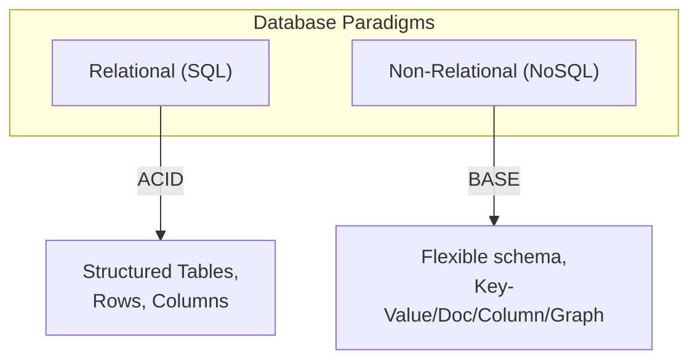
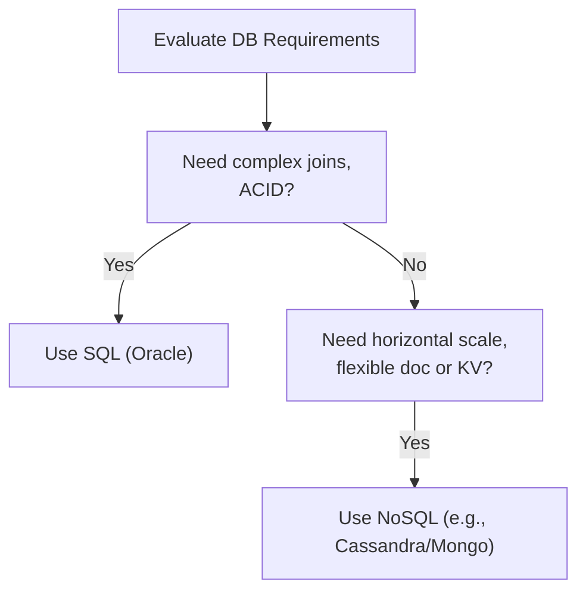
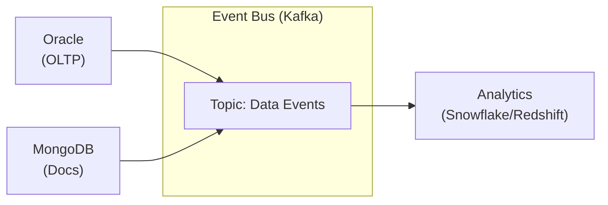

Here's a prompt to generate Day 9 quiz questions based on the training material:

# 📝 SRE Database Training Module - Day 9: Quiz Questions

## 🧑‍🏫 Role
You are an expert database instructor creating assessment questions for Day 9 of "The Follow-the-Sun Chronicles" training featuring Chloé, the Polyglot database architect based in Lyon, France. These questions will test knowledge from beginner to SRE-level concepts covered specifically in the Day 9 material, with the primary database focus being SQL vs. NoSQL architecture decisions and trade-offs.

## 📝 Quiz Structure Requirements

Create quiz questions with the following distribution:
- (🔍) 7 Beginner-Level Questions
- (🧩) 7 Intermediate-Level Questions
- (💡) 6 Advanced/SRE-Level Questions

Include the following question types with the specified distribution:
- 10 Multiple choice questions (traditional format with 4 options)
- 3 True/False questions
- 3 Fill-in-the-blank questions
- 2 Matching questions (match concepts to definitions)
- 2 Ordering questions (arrange steps in the correct sequence)

Each question must:
- Clearly indicate its difficulty level with the appropriate emoji
- Connect directly to content covered in the Day 9 material by Chloé
- Reference Chloé's analogies, principles, rules, or commentaries where appropriate
- Include relevant context for scenario-based questions
- Include database-specific content as presented in the training

Several questions should incorporate Mermaid diagrams similar to those used in the Day 9 training for visual assessment.

## Quiz Content Focus Areas (Based on Day 9 Material)

1. **Database Paradigms Overview**
   - Chloé's "library vs. eclectic bookstore" analogy
   - Historical context of SQL and NoSQL development
   - Chloé's rules of engagement for decision-making
   - Understanding when each paradigm is appropriate

2. **Data Models Comparison**
   - The five main database models (Relational, Key-Value, Document, Column-Family, Graph)
   - Concrete schema examples across different database types
   - Enhanced analogies (filing cabinet, dictionary, folder, etc.)
   - Chloé's perspective on contextual validity of each approach

3. **ACID vs. BASE Properties**
   - Understanding transaction models in different database types
   - Real-world failure scenarios in both paradigms
   - Appropriate use cases for each consistency model
   - Chloé's examples of applications suited to each model

4. **Schema Approaches**
   - Schema-on-Write vs. Schema-on-Read trade-offs
   - Migration complexities and data quality considerations
   - Chloé's preference for stable systems vs. rapidly evolving data shapes
   - Managing schema evolution in different database paradigms

5. **Query Capabilities Comparison**
   - Syntax and capability differences across database types
   - Performance pitfalls in NoSQL queries
   - Bad NoSQL query patterns and their implications
   - Chloé's warnings about treating NoSQL like relational databases

6. **Polyglot Architecture**
   - The "Bad Polyglot Story" cautionary tale
   - Decision frameworks and weighted scoring
   - Event-driven integration approaches
   - Chloé's best practices for multi-database synchronization

## Question Type Formats

### Multiple Choice Format
```
## Question X: [Topic]
🔍/🧩/💡 [Difficulty Level]

[Question text]

A. [Option A]
B. [Option B]
C. [Option C]
D. [Option D]
```

### True/False Format
```
## Question X: [Topic]
🔍/🧩/💡 [Difficulty Level]

[Statement]

A. True
B. False
```

### Fill-in-the-Blank Format
```
## Question X: [Topic]
🔍/🧩/💡 [Difficulty Level]

Complete the following statement:

[Statement with ________ for the blank]

A. [Option A]
B. [Option B]
C. [Option C]
D. [Option D]
```

### Matching Format
```
## Question X: [Topic]
🔍/🧩/💡 [Difficulty Level]

Match each item in Column A with the appropriate item in Column B.

Column A:
1. [Item 1]
2. [Item 2]
3. [Item 3]
4. [Item 4]

Column B:
A. [Definition/Example A]
B. [Definition/Example B]
C. [Definition/Example C]
D. [Definition/Example D]
```

### Ordering Format
```
## Question X: [Topic]
🔍/🧩/💡 [Difficulty Level]

Arrange the following steps in the correct order:

A. [Step A]
B. [Step B]
C. [Step C]
D. [Step D]
```

### Diagram-Based Question Format
```
## Question X: [Topic]
🔍/🧩/💡 [Difficulty Level]

Examine the following database diagram:

```mermaid
[Appropriate diagram code]
```

[Question text based on the diagram]

A. [Option A]
B. [Option B]
C. [Option C]
D. [Option D]
```

## Mermaid Diagram Guidelines for Questions

When creating diagram-based questions, use appropriate Mermaid syntax based on the type of visualization needed:

1. **Flowcharts** for database paradigm comparison:


2. **Sequence Diagrams** for transaction models:
```mermaid
sequenceDiagram
  participant ACID as ACID Transaction
  participant SQLDB as Oracle
  participant NoSQL as BASE System
  
  ACID->>SQLDB: BEGIN; Update account A; Update account B
  SQLDB-->>ACID: Either both updated or both rolled back
  ACID->>SQLDB: COMMIT;
```

3. **Process Flow Diagrams** for decision frameworks:


4. **Event Flow Diagrams** for polyglot integration:


Include diagrams that specifically reflect those used in the Day 9 training material, such as:
- Database paradigm comparison flowchart
- ACID vs. BASE sequence diagram
- Schema approach flowchart
- Decision framework flowchart
- Event-driven polyglot architecture diagram

## Special Considerations for Day 9

- Focus on Chloé's specific terminology and phrases like "the bad polyglot story"
- Include questions related to Chloé's rules of engagement and decision framework
- Reference Chloé's analogies (library vs. bookstore, filing cabinet vs. dictionary)
- Incorporate Chloé's unique perspective on evidence-based architecture decisions
- Include database-specific syntax examples from Oracle, MongoDB, Cassandra as presented in the training
- Address real-world polyglot scenarios and cautionary tales mentioned by Chloé

DO NOT include the correct answers or explanations in the questions themselves. These will be provided in a separate answer key document.