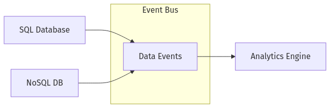
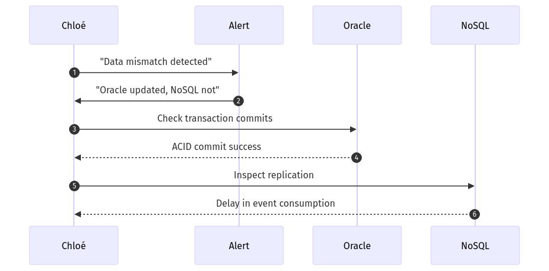

# Day 9 Quiz

## Question 1: Database Paradigms Overview  
🔍 Beginner-Level (Multiple Choice)

Chloé compares SQL databases to a meticulously organized library and NoSQL databases to an eclectic bookstore. Which statement best summarizes this analogy?

A. SQL provides strict rules and structure, while NoSQL offers more flexibility but potential disorder.  
B. SQL is always faster than NoSQL because of its rigid approach.  
C. NoSQL systems are chaotic and inherently unscalable.  
D. SQL databases are obsolete due to the rise of NoSQL.

---

## Question 2: SQL vs. NoSQL Decision  
🔍 Beginner-Level (Multiple Choice)

According to Chloé, which factor is the most important when deciding whether to choose SQL or NoSQL?

A. Whether you like typed versus dynamic languages  
B. Your preference for code syntax  
C. Your data shape, consistency needs, scale requirements, and team skills  
D. The brand name or marketing popularity of the database

---

## Question 3: ACID vs. BASE  
🔍 Beginner-Level (True/False)

Chloé mentions that ACID properties emphasize strong consistency and atomic transactions, whereas BASE properties focus on eventual consistency and high availability.

A. True  
B. False  

---

## Question 4: Schema-on-Write vs. Schema-on-Read  
🔍 Beginner-Level (Fill-in-the-Blank)

Complete the following statement:

Under the ________ approach, changes to the data structure require a formal migration before being written, ensuring immediate consistency in the stored format.

A. schema-on-read  
B. schema-on-write  
C. no-schema approach  
D. ephemeral schema  

---

## Question 5: Basic NoSQL Category  
🔍 Beginner-Level (Multiple Choice)

Chloé lists four main categories of NoSQL databases: key-value, document, column-family, and graph. Which of the following is typically described as storing JSON-like structures that can nest data?

A. Key-value store  
B. Document store  
C. Column-family store  
D. Graph store  

---

## Question 6: “Bad Polyglot Story” Context  
🔍 Beginner-Level (True/False)

Chloé recounted a cautionary tale of a system using multiple databases (SQL Server, Redis, MongoDB) manually synced with cron jobs, resulting in significant data mismatches.

A. True  
B. False  

---

## Question 7: Data Model Analogy  
🔍 Beginner-Level (Fill-in-the-Blank)

Chloé likens a key-value store to a ________ for quick lookups, while a relational database is more like a structured filing cabinet.

A. recipe box  
B. dictionary  
C. random pile  
D. kiosk  

---

## Question 8: ACID vs. BASE Trade-offs  
🧩 Intermediate-Level (Multiple Choice)

Chloé gives examples of real-world failures when choosing the wrong model. Which scenario would typically be best suited for a fully ACID-compliant database?

A. Social network post feeds that can handle occasional delay  
B. A high-traffic e-commerce site for ephemeral event logs  
C. Banking transactions requiring precise account balance integrity  
D. A global gaming leaderboard that tolerates slight updates lag  

---

## Question 9: Schema Evolutions  
🧩 Intermediate-Level (Multiple Choice)

Chloé highlights the distinction between schema-on-write and schema-on-read. Which statement best captures the difference?

A. Schema-on-write applies to NoSQL systems only, while schema-on-read applies to SQL  
B. Under schema-on-read, data can be stored in varying formats and interpreted during query time  
C. Schema-on-write requires no migrations  
D. Schema-on-read ensures the data’s format never changes  

---

## Question 10: Graph Database Scenario  
🧩 Intermediate-Level (Multiple Choice)

Chloé notes that a graph database like Neo4j might be the best fit under which condition?

A. Storing massive time-series data for CPU metrics  
B. Managing relationships and paths between entities, such as social network connections  
C. Handling simple key-value pairs for caching user sessions  
D. Keeping wide-column data with minimal joins  

---

## Question 11: Migrations and Consistency  
🧩 Intermediate-Level (Matching)

Match each concept in Column A with its description in Column B.

Column A:  
1. ACID  
2. BASE  
3. Schema-on-Write  
4. Schema-on-Read  

Column B:  
A. Strict transaction rules ensuring all-or-nothing updates  
B. Flexible approach where data format is applied during query time  
C. Basically Available, Soft-state, Eventually consistent  
D. Data model changes require structured updates before insertion  

---

## Question 12: NoSQL Query Pitfalls  
🧩 Intermediate-Level (Multiple Choice)

Chloé warns that using NoSQL improperly, like scanning entire data sets or performing large `$lookup` operations, can cause performance issues. Which practice is typically most efficient in a NoSQL context?

A. Running cross-collection joins to replicate relational queries  
B. Denormalizing data for direct lookups based on the main access patterns  
C. Constantly scanning every document for random filters  
D. Using no indexes at all to keep the schema flexible  

---

## Question 13: Weighted Decision Framework  
🧩 Intermediate-Level (True/False)

Chloé recommends a weighted scoring table approach, where each factor (transactions, schema evolution, team expertise) is assigned a weight, and each database option is scored. This helps remove dogma from database selection.

A. True  
B. False  

---

## Question 14: Polyglot Persistence Diagram  
🧩 Intermediate-Level (Diagram-Based Multiple Choice)

Examine the following Mermaid diagram showing a polyglot architecture:

Which statement best describes Chloé’s recommended approach?

A. Multiple databases are manually synchronized by daily cron scripts  
B. Data changes are published to a central event bus, which other systems consume  
C. The analytics engine rewrites data in both SQL and NoSQL simultaneously  
D. Only the SQL database can send events; NoSQL data is never updated  

---

## Question 15: Team Skill Factor  
🧩 Intermediate-Level (Fill-in-the-Blank)

Complete the following statement:

Chloé emphasizes that a team’s ________ in managing either SQL or NoSQL environments significantly affects the success of a database decision.

A. physical location  
B. budget  
C. skill level  
D. preference for syntax  

---

## Question 16: Consistency and Reliability  
💡 Advanced/SRE-Level (Multiple Choice)

Chloé describes a meltdown scenario where NoSQL’s eventual consistency caused data mismatches for a near-real-time banking use case. From an SRE perspective, which action is most appropriate?

A. Keep using eventual consistency for all mission-critical apps  
B. Migrate the entire system to a single server to avoid distribution  
C. Switch to an ACID-compliant database or enable stronger consistency settings  
D. Implement daily logs to manually reconcile the mismatches  

---

## Question 17: Multi-Database Monitoring  
💡 Advanced/SRE-Level (Multiple Choice)

When operating both Oracle and MongoDB in production, which best practices does Chloé suggest for SRE monitoring?

A. Rely on guesswork and blame developers if performance slows  
B. Use separate, unconnected monitoring tools with no correlation of events  
C. Centralize logs and metrics into one dashboard, track replication lag in NoSQL and query performance in SQL  
D. Disable all logs to reduce overhead  

---

## Question 18: Polyglot Consistency Incident  
💡 Advanced/SRE-Level (Diagram-Based Multiple Choice)

Review Chloé’s sequence diagram of a cross-database mismatch:

Which conclusion best fits Chloé’s analysis?

A. ACID commits only appear successful; they actually never occurred  
B. The NoSQL system has a pipeline delay; Chloé must adjust event ingestion or replication settings  
C. Oracle’s logs are invalid, so NoSQL data is correct  
D. The system must forcibly roll back all Oracle transactions  

---

## Question 19: Steps to Decide on SQL vs. NoSQL  
💡 Advanced/SRE-Level (Ordering)

Chloé advocates a structured decision process. Arrange these actions in the correct sequence:

A. Create a weighted scoring table of key factors  
B. Identify business requirements for data shape and scale  
C. Compare how well SQL and NoSQL fulfill these needs  
D. Select the highest-scoring approach or consider polyglot  

---

## Question 20: Troubleshooting Cross-Database Incidents  
💡 Advanced/SRE-Level (Ordering)

Chloé’s meltdown triage for a multi-database environment typically involves these steps. Put them in order:

A. Check each database’s logs for recent writes or replication events  
B. Observe if the issue is a known backlog or a deeper mismatch  
C. Validate the event bus or bridging mechanism  
D. Apply fixes, then retest and document the resolution  

---

**End of Day 9 Quiz**

**Instructions to the Learner**: You have 20 questions covering SQL vs. NoSQL fundamentals, ACID vs. BASE, schema design, polyglot persistence, and SRE considerations. No answers or explanations are provided here; a separate answer key will be provided. Use Chloé’s Day 9 materials to guide your study and reference the analogies, best practices, and cautionary tales she shared.