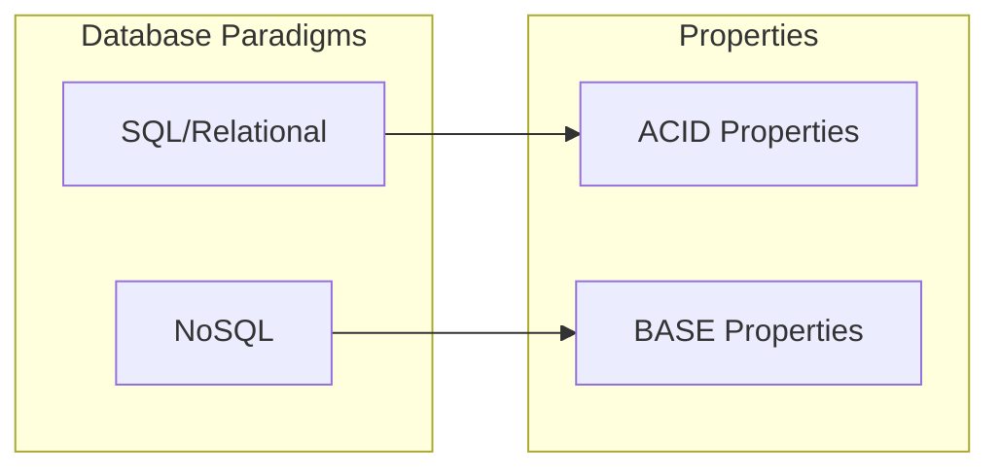

# 🔑 SRE Database Training Module - Day 9: Answer Sheet for SQL vs NoSQL Database Comparison

## 🧑‍🏫 Role

You are an expert database architect creating a comprehensive answer sheet for the provided Day 9 quiz questions on SQL vs NoSQL Database Comparison. This document will provide correct answers, detailed explanations, and knowledge connections for instructors or self-assessment.

## 🎯 Objective

Review the provided quiz questions and create a detailed answer sheet that:

- Provides the correct answer for each quiz question
- Offers thorough explanations of why each answer is correct
- Explains why the incorrect options are wrong
- Connects answers to key concepts from the Day 9 material
- Includes additional insights or tips relevant to each question, with database-specific details
- Provides comparison notes between different database types (Oracle, Cassandra, DynamoDB, MongoDB, etc.) where relevant
- Incorporates SRE perspectives for higher-level questions
- Maintains consistent formatting throughout

## 📝 Answer Sheet Structure Requirements

For each quiz question in the provided document, provide:

1. **Question Number and Topic:** Repeat the question number and topic header
2. **Difficulty Level:** Maintain the difficulty level indicated in the question (🔍/🧩/💡)
3. **Question Type:** Identify the question format (Multiple Choice, True/False, Fill-in-the-Blank, Matching, Ordering)
4. **Question Text:** Repeat the full question text
5. **Correct Answer:** Clearly identify the correct option(s)
6. **Explanation:** Provide a detailed explanation (3-5 sentences) of why this answer is correct, with database-specific details
7. **Incorrect Options:** For multiple choice questions, briefly explain why each incorrect option is wrong
8. **Database Comparison Note:** For relevant questions, explain how the concept differs across various database types (SQL vs NoSQL types)
9. **Knowledge Connection:** Connect this question to specific concepts from the Day 9 material
10. **SRE Perspective:** Include an SRE-focused insight relating to reliability, scalability, observability, or performance
11. **Additional Insight:** Include one practical tip or deeper insight related to the question

## Answer Format Templates

### Multiple Choice Answer Format

```
## Answer X: [Topic]
🔍/🧩/💡 [Difficulty Level] | Multiple Choice

**Question:** [Question text]

**Correct Answer:** [Option Letter]

**Explanation:** [Detailed explanation of why this answer is correct with database-specific details]

**Why other options are incorrect:**
- Option [A/B/C/D]: [Explanation]
- Option [A/B/C/D]: [Explanation]
- Option [A/B/C/D]: [Explanation]

**Database Comparison Note:** [How this concept differs across database types]

**Knowledge Connection:** [How this connects to Day 9 material]

**SRE Perspective:** [Reliability, scalability, observability, or performance insight]

**Additional Insight:** [Practical tip or deeper insight for database environments]
```

### True/False Answer Format

```
## Answer X: [Topic]
🔍/🧩/💡 [Difficulty Level] | True/False

**Question:** [Statement]

**Correct Answer:** [True/False]

**Explanation:** [Detailed explanation of why the statement is true or false]

**Database Comparison Note:** [How this concept differs across database types, if applicable]

**Knowledge Connection:** [How this connects to Day 9 material]

**SRE Perspective:** [Reliability, scalability, observability, or performance insight]

**Additional Insight:** [Practical tip or deeper insight for database environments]
```

### Fill-in-the-Blank Answer Format

```
## Answer X: [Topic]
🔍/🧩/💡 [Difficulty Level] | Fill-in-the-Blank

**Question:** [Statement with blank]

**Correct Answer:** [Option Letter] - [Text that fills the blank]

**Explanation:** [Detailed explanation of why this answer is correct]

**Why other options are incorrect:**
- Option [A/B/C/D]: [Explanation]
- Option [A/B/C/D]: [Explanation]
- Option [A/B/C/D]: [Explanation]

**Database Comparison Note:** [How this concept differs across database types]

**Knowledge Connection:** [How this connects to Day 9 material]

**SRE Perspective:** [Reliability, scalability, observability, or performance insight]

**Additional Insight:** [Practical tip or deeper insight for database environments]
```

### Matching Answer Format

```
## Answer X: [Topic]
🔍/🧩/💡 [Difficulty Level] | Matching

**Question:** [Matching question text]

**Correct Matches:**
1. [Item 1] - [Letter from Column B]
2. [Item 2] - [Letter from Column B]
3. [Item 3] - [Letter from Column B]
4. [Item 4] - [Letter from Column B]

**Explanation:** [Detailed explanation of why these matches are correct]

**Database Comparison Note:** [How these concepts differ across database types]

**Knowledge Connection:** [How this connects to Day 9 material]

**SRE Perspective:** [Reliability, scalability, observability, or performance insight]

**Additional Insight:** [Practical tip or deeper insight for database environments]
```

### Ordering Answer Format

```
## Answer X: [Topic]
🔍/🧩/💡 [Difficulty Level] | Ordering

**Question:** [Ordering question text]

**Correct Order:** [e.g., C, A, D, B]

**Explanation:** [Detailed explanation of why this order is correct]

**Database Comparison Note:** [How this process might differ across database systems]

**Knowledge Connection:** [How this connects to Day 9 material]

**SRE Perspective:** [Reliability, scalability, observability, or performance insight]

**Additional Insight:** [Practical tip or deeper insight for database environments]
```

## Database Focus Requirements

Ensure explanations focus on database-specific concepts and include:

1. **Data model differences** across SQL and NoSQL database types
2. **Consistency model implementation** in various database systems
3. **Schema approach variations** between SQL and different NoSQL types
4. **Query capabilities and limitations** across database paradigms
5. **Operational characteristics** of different database types
6. **Use case appropriateness** for different database paradigms

## SRE Focus Requirements

For the SRE perspective section, include relevant insights about:

1. **Reliability considerations** across different database paradigms
2. **Scalability approaches** for SQL vs different NoSQL types
3. **Availability vs consistency trade-offs** and their operational impact
4. **Observability challenges** in different database environments
5. **Incident response strategies** for different database types
6. **Capacity planning considerations** for various database paradigms

## Mermaid Diagram Considerations

For questions that reference or relate to Mermaid diagrams from the training:

1. **Data model visualization interpretation** - Explain how to read and understand data model diagrams
2. **Consistency model visualization** - Clarify how different consistency approaches are represented in diagrams
3. **Database selection decision tree interpretation** - Explain how to use visual decision frameworks effectively
4. **Common diagram mistakes** - Note typical errors in interpreting database paradigm-related diagrams

## Mermaid Diagram Generation Guidelines

When creating explanations that involve Mermaid diagrams or when referring to diagrams, follow these formatting rules to ensure proper rendering:

1. **Always Enclose Node Labels in Quotes**
   - If a node label has **parentheses** `( )`, **colons** `:`, or **HTML tags** like `<br/>`, wrap it in quotes:

   ```
   A["Relational Model"]
   B["Document Model: MongoDB"]
   C["Line1<br/>Line2"]
   ```

2. **Use Self-Closing `<br/>` Tags**
   - For line breaks in node labels, use `<br/>` (with a slash) instead of `<br>`.
   - Keep them inside quotes: `["Line1<br/>Line2"]`.

3. **Subgraph Titles**
   - Always wrap subgraph titles in quotes:

   ```
   subgraph "SQL Databases"
     S1["Oracle"]
     S2["PostgreSQL"]
   end
   ```

4. **Use Separate Lines for Each Arrow or Connection**
   - Place each connection on its own line:

   ```
   A --> B
   B --> C
   ```

   - Avoid: `A --> B --> C`

5. **No Raw Text Immediately After `subgraph`**
   - Add nodes for text inside subgraphs instead of raw text:

   ```
   subgraph "NoSQL Types"
     N["Different NoSQL database types"]
   end
   ```

6. **Avoid Ambiguous Characters in the Flow**
   - Keep characters like `#`, `?`, or additional punctuation inside quotes if needed.

7. **Simplify Complex Diagrams**
   - Break down complex relationships into simpler sections.
   - Test diagrams incrementally to ensure proper rendering.

Example of a correctly formatted Mermaid diagram for explaining database paradigm differences:



## Final Document Format Requirements

Generate a single Markdown document with the **full question text** followed by its **answer** and **explanation**, from Question 1 to Question 20. **Do not** create a separate section listing all 20 questions at the start. Instead, for each question:

1. Show the **question number** and **topic** (e.g., `[Paradigm Differences]`),
2. Then **restate** just that one question's text,
3. Provide the **correct answer** label (e.g., A, B, C, D, or True/False, etc.),
4. **Explain** the reasoning in detail.

**Do not** produce a separate "Questions" section before the answer sheet. The deliverable is a single sequence of 20 entries, each containing the question's text and the associated answer/explanation.

Remember to observe, test, evaluate and take action when explaining answers to create comprehensive and educational responses. Apply the OTEA approach to each question's explanation:

- **Observe**: Identify the key database concept being tested
- **Test**: Apply the correct reasoning to find the answer
- **Evaluate**: Consider why other options are incorrect or less optimal
- **Act**: Provide actionable insights that extend beyond the question

## Depth of Technical Explanation

For each concept, provide appropriate technical depth based on the question's difficulty level:

- **Beginner (🔍)**: Focus on foundational concepts and clear explanations of basic database paradigm differences
- **Intermediate (🧩)**: Provide more detailed technical information and practical application contexts for different database types
- **Advanced/SRE (💡)**: Include in-depth technical details, system-level considerations, and enterprise-scale implications of database paradigm choices

## Practical Applicability

For each answer, ensure you include practical, real-world relevance by:

1. Explaining when and why this knowledge would be useful in a support or SRE role
2. Providing specific scenarios where this knowledge would help select appropriate database types or diagnose issues
3. Connecting the concept to broader system reliability and scalability considerations

## Invocations Statement

Generate a comprehensive answer sheet for the Day 9 database training quiz questions on SQL vs NoSQL Database Comparison. For each question, provide the correct answer with detailed explanations, reasons why incorrect options are wrong, comparisons between different database types where relevant, connections to Day 9 material, SRE perspectives on reliability and scalability, and additional practical insights.

Focus on explaining database paradigm concepts ranging from basic SQL vs NoSQL differences to advanced consistency models and operational considerations. Cover data models (relational, key-value, document, column-family, graph), consistency approaches (ACID vs BASE), schema strategies (schema-on-write vs schema-on-read), query capabilities, and SRE reliability considerations. Include detailed explanations of how these concepts apply in real-world scenarios, how they differ across database types, and their implications for system reliability and scalability.

Apply the "Observe, Test, Evaluate, Act" approach to each answer to create thorough and educational responses. Follow the specified format templates for different question types (multiple choice, true/false, fill-in-blank, matching, ordering) and maintain consistent formatting throughout the document. Follow the Mermaid diagram formatting guidelines when creating or referencing diagrams in answer explanations to ensure proper rendering. The final document should present questions and answers in sequence without a separate questions section at the beginning.

For beginner-level questions, emphasize fundamental database paradigm differences and basic concepts. For intermediate-level questions, focus on practical applications and use case selection. For advanced/SRE-level questions, address complex reliability considerations, consistency models, and operational trade-offs. Ensure appropriate technical depth based on each question's difficulty level while maintaining practical applicability to support and SRE roles.