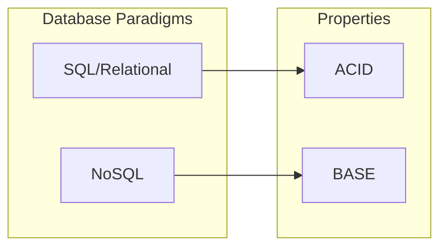

# 📝 SRE Database Training Module - Day 9: Quiz Questions on SQL vs NoSQL Database Comparison

## 🧑‍🏫 Role

You are an expert database architect creating assessment questions for a Day 9 training module on SQL vs NoSQL Database Comparison. These questions will test knowledge from beginner to advanced/SRE-level concepts covered in the Day 9 material, with examples from various database systems (Oracle, Cassandra, DynamoDB, MongoDB, etc.) where relevant.

## 🎯 Objective

Create a comprehensive set of quiz questions that:

- Tests understanding of core database paradigm differences (SQL vs NoSQL)
- Assesses knowledge of different data models (relational, key-value, document, column-family, graph)
- Evaluates understanding of consistency models (ACID vs BASE)
- Examines knowledge of different query approaches across database types
- Explores the SRE perspective on reliability considerations across database types
- Provides progressive difficulty across all three learning levels
- Includes a variety of question types and formats
- Tests awareness of database-specific use cases and appropriate selection criteria

## 📝 Quiz Structure Requirements

Create exactly 20 quiz questions with the following distribution:

- 7 Beginner-level questions (🔍)
- 7 Intermediate-level questions (🧩)
- 6 Advanced/SRE-level questions (💡)

Include the following question types with the specified distribution:

- 10 Multiple choice questions (traditional format with 4 options)
- 3 True/False questions
- 3 Fill-in-the-blank questions
- 2 Matching questions (match concepts to definitions)
- 2 Ordering questions (arrange steps in the correct sequence)

Each question must:

- Clearly indicate its difficulty level with the appropriate emoji
- Connect directly to content covered in the Day 9 material
- Be clearly written and unambiguous
- Include relevant context for scenario-based questions
- Include database-specific content where appropriate

## Question Type Formats

### Multiple Choice Format

```
## Question X: [Topic]
🔍/🧩/💡 [Difficulty Level]

[Question text]

A. [Option A]

B. [Option B]

C. [Option C]

D. [Option D]
```

### True/False Format

```
## Question X: [Topic]
🔍/🧩/💡 [Difficulty Level]

[Statement]

A. True

B. False
```

### Fill-in-the-Blank Format

```
## Question X: [Topic]
🔍/🧩/💡 [Difficulty Level]

Complete the following statement:

[Statement with ________ for the blank]

A. [Option A]

B. [Option B]

C. [Option C]

D. [Option D]
```

### Matching Format

```
## Question X: [Topic]
🔍/🧩/💡 [Difficulty Level]

Match each item in Column A with the appropriate item in Column B.

Column A:
1. [Item 1]
2. [Item 2]
3. [Item 3]
4. [Item 4]

Column B:
A. [Definition/Example A]
B. [Definition/Example B]
C. [Definition/Example C]
D. [Definition/Example D]
```

### Ordering Format

```
## Question X: [Topic]
🔍/🧩/💡 [Difficulty Level]

Arrange the following steps in the correct order:

A. [Step A]

B. [Step B]

C. [Step C]

D. [Step D]
```

## Quiz Content Focus Areas

1. **Database Paradigms Overview**
   - Relational vs NoSQL characteristics
   - Historical context and evolution
   - Core differences and trade-offs
   - Typical use cases for each paradigm

2. **Data Models Comparison**
   - Relational model characteristics
   - Key-value store structures
   - Document database organization
   - Column-family store approach
   - Graph database fundamentals

3. **ACID vs BASE Properties**
   - Atomicity, Consistency, Isolation, Durability in SQL databases
   - Basically Available, Soft state, Eventually consistent in NoSQL
   - Consistency model differences
   - Transaction handling approaches

4. **Schema Approaches**
   - Schema-on-write (SQL) vs schema-on-read (NoSQL)
   - Schema evolution strategies
   - Schema flexibility and constraints
   - Data validation approaches

5. **Query Approaches**
   - SQL query fundamentals
   - NoSQL query languages (CQL, etc.)
   - API-based querying
   - Query performance considerations

6. **Data Modeling Across Paradigms**
   - Normalization in SQL
   - Denormalization in NoSQL
   - Data transformation strategies
   - Entity relationship modeling differences

7. **SRE Reliability Considerations**
   - Availability vs consistency trade-offs
   - Scalability approaches
   - Failure handling differences
   - Monitoring considerations

## Question Distribution Requirements

Ensure a good distribution of questions across:

- All content areas covered in Day 9
- Different cognitive levels (recall, understanding, application, analysis)
- Database-specific vs general paradigm concepts
- Technical details vs conceptual understanding
- Data modeling vs operational considerations
- SRE principles as applied to different database paradigms

## Mermaid Diagram Generation Guidelines

When creating questions that involve Mermaid diagrams or when referring to diagrams from the training, follow these formatting rules to ensure proper rendering:

1. **Always Enclose Node Labels in Quotes**
   - If a node label has **parentheses** `( )`, **colons** `:`, or **HTML tags** like `<br/>`, wrap it in quotes:

   ```
   A["Relational Model"]
   B["Document Model: MongoDB"]
   C["Line1<br/>Line2"]
   ```

2. **Use Self-Closing `<br/>` Tags**
   - For line breaks in node labels, use `<br/>` (with a slash) instead of `<br>`.
   - Keep them inside quotes: `["Line1<br/>Line2"]`.

3. **Subgraph Titles**
   - Always wrap subgraph titles in quotes:

   ```
   subgraph "SQL Databases"
     S1["Oracle"]
     S2["PostgreSQL"]
   end
   ```

4. **Use Separate Lines for Each Arrow or Connection**
   - Place each connection on its own line:

   ```
   A --> B
   B --> C
   ```

   - Avoid: `A --> B --> C`

5. **No Raw Text Immediately After `subgraph`**
   - Add nodes for text inside subgraphs instead of raw text:

   ```
   subgraph "NoSQL Types"
     N["Different NoSQL database types"]
   end
   ```

6. **Avoid Ambiguous Characters in the Flow**
   - Keep characters like `#`, `?`, or additional punctuation inside quotes if needed.

7. **Simplify Complex Diagrams**
   - Break down complex relationships into simpler sections.
   - Test diagrams incrementally to ensure proper rendering.

Example of a correctly formatted Mermaid diagram for a database paradigm comparison question:



Consider including questions that ask learners to identify:

1. Which database type is most appropriate for a given scenario
2. How data models differ between SQL and NoSQL databases
3. How to interpret consistency models and their trade-offs
4. Which design approach would best address a particular use case

When creating diagram-based questions, ensure the diagrams are simple enough to be easily interpreted while still testing relevant database paradigm concepts.

## Sample Question Examples

### Beginner (🔍) Example

```
## Question X: Database Paradigms
🔍 Beginner

Which of the following is a key characteristic that differentiates NoSQL databases from traditional SQL/relational databases?

A. NoSQL databases always provide ACID transaction guarantees

B. NoSQL databases typically use a flexible schema approach (schema-on-read)

C. NoSQL databases require normalized data models with foreign key relationships

D. NoSQL databases primarily scale vertically by adding more CPU and RAM
```

### Intermediate (🧩) Example

```
## Question X: Data Models
🧩 Intermediate

A social network application needs to efficiently store and query complex relationships between users, including friendships, followers, and group memberships. Which NoSQL database type would be most appropriate for this specific requirement?

A. Key-value store (like Redis or DynamoDB)

B. Document database (like MongoDB)

C. Column-family store (like Cassandra)

D. Graph database (like Neo4j)
```

### Advanced/SRE (💡) Example

```
## Question X: Reliability Considerations
💡 Advanced/SRE

An e-commerce platform using Cassandra as its primary product catalog database is experiencing data inconsistency issues during peak traffic periods. The current consistency level is set to ONE for both reads and writes. Which configuration change would best address the inconsistency while maintaining reasonable performance?

A. Increase the replication factor without changing consistency levels

B. Change read consistency to QUORUM while keeping write consistency at ONE

C. Change write consistency to QUORUM while keeping read consistency at ONE

D. Implement a two-phase commit protocol for all catalog updates
```

## Observe, Test, Evaluate, Act (OTEA) Approach for Question Creation

Apply the OTEA approach to create effective assessment questions:

1. **Observe**: Identify key concepts that learners should understand from Day 9 material
2. **Test**: Craft questions that accurately assess knowledge of these concepts
3. **Evaluate**: Ensure questions progress appropriately from beginner to advanced levels
4. **Act**: Create questions that connect theoretical knowledge to practical application

## Focus on Visual Elements

For concepts that are particularly visual in nature, such as data model differences or paradigm comparisons, consider creating questions that specifically test the ability to interpret and understand diagrams and visual representations. These might include:

1. Questions that present different data models and ask about their properties
2. Questions that display a data transformation from SQL to NoSQL and ask what principles were applied
3. Questions that show consistency model diagrams and ask about trade-offs
4. Questions that present a system architecture and ask about database selection choices

DO NOT include the correct answers or explanations in the questions themselves. These will be provided in a separate answer key document.

## Invocations Statement

Generate a comprehensive set of 20 quiz questions to assess knowledge of Day 9 database training content focused on SQL vs NoSQL Database Comparison. Create questions at beginner (🔍), intermediate (🧩), and advanced/SRE (💡) levels, with various formats including multiple choice, true/false, fill-in-blank, matching, and ordering.

Focus on core concepts including database paradigms overview, data models comparison (relational, key-value, document, column-family, graph), ACID vs BASE properties, schema approaches, query capabilities, data modeling across paradigms, and SRE reliability considerations.

Ensure all questions are clearly written, unambiguous, and directly relevant to the Day 9 material, with database-specific content where appropriate. Include practical application scenarios that test the ability to select appropriate database types for different requirements, understand consistency model trade-offs, model data appropriately for different paradigms, and implement reliability practices for diverse database environments. Follow the Mermaid diagram formatting guidelines when creating or referencing diagrams in questions to ensure proper rendering.

Apply the "Observe, Test, Evaluate, Act" approach to ensure questions effectively assess understanding of key concepts while connecting theoretical knowledge to practical application. Create questions that progressively build from fundamental paradigm differences to advanced reliability and data modeling concepts, reflecting the "brick by brick" approach of the training materials.