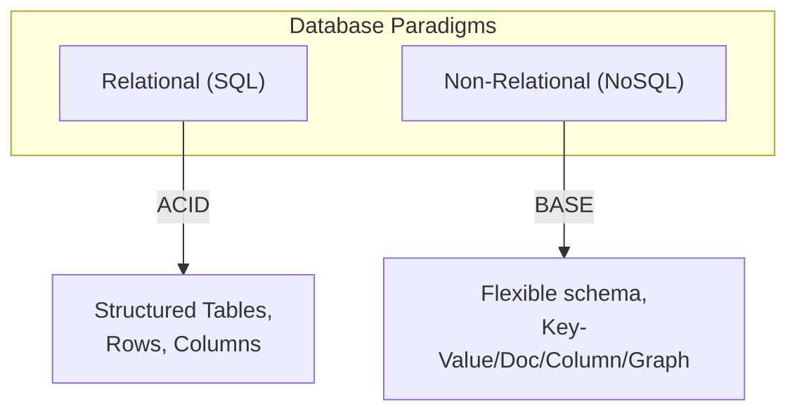
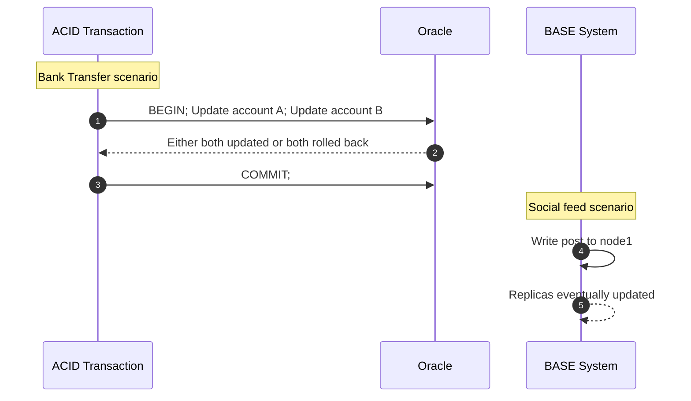
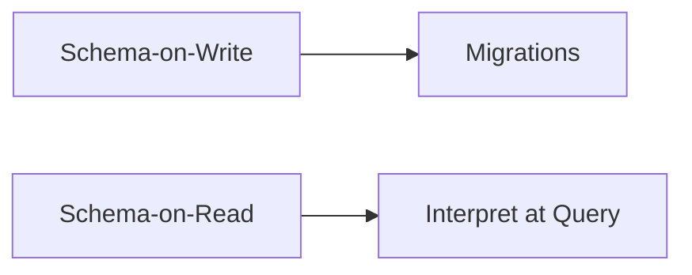
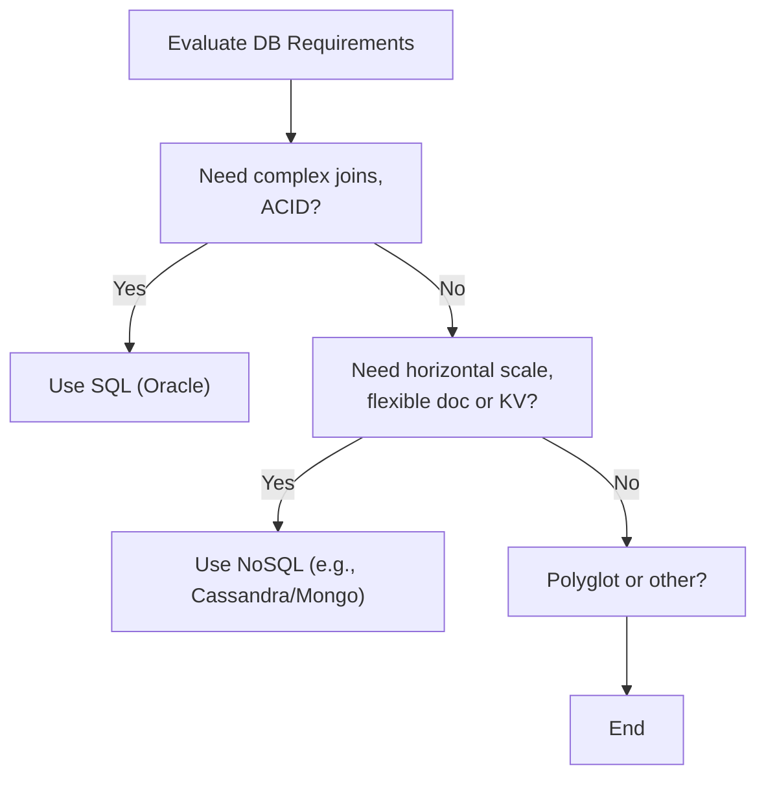
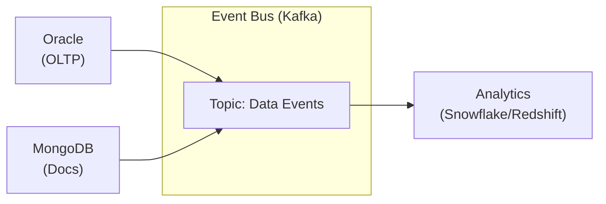

# **The Follow-the-Sun Chronicles: Day 9 – Chloé & The Great Schema Debate**

> **Character Profile**  
> - **Name:** Chloé  
> - **Location:** Lyon, France (09:00 CET)  
> - **Role:** Polyglot database architect, equally fluent in SQL and NoSQL  
> - **Personality:** Insightful, persuasive, opinionated about schema design. Treats NoSQL like an open relationship—viable if you set rules and boundaries.

---

## **1. Narrative Setup: The Database Architecture Showdown**

At **09:00 CET**, I (Chloé) rushed into a multi-DB review. One team insisted, **“Let’s move everything to MongoDB for ultimate freedom!”** Another refused to leave **Oracle**: “We can’t lose ACID compliance!” Tensions rose. I took a breath—time to mediate, pointing out the roles of each paradigm. Let me show you how to weigh these choices carefully.

> **Chloé’s Commentary**: “I’ve seen too many dogmatic standoffs. Usually, a calm, evidence-based approach solves it.”

### **The “Bad Polyglot Story”: A Must-Know Cautionary Tale**

I once encountered a system that tried to keep **SQL Server, Redis, and MongoDB** in sync via manual ETL scripts and cron jobs. Over half the data was **6 minutes old**, the other half *never* arrived. Chaos ensued, with meltdown-level incidents every few weeks. They spent more time patching sync code than building features. Eventually, the approach crumbled under data drift and partial updates—an operational fiasco we should never replicate.

> **Chloé’s Commentary**: “This is a cautionary tale: if you’re going polyglot, do it with a robust event pipeline (like Kafka) or consistent bridging, not random scripts. Otherwise, meltdown is inevitable.”

---

## **2. Day 9 Overview (Chloé’s Roadmap)**

### **🔍 Beginner Objectives**
1. **Understand** fundamental differences between SQL and NoSQL.  
2. **Explain** ACID vs. BASE.  
3. **Identify** NoSQL categories (key-value, document, column-family, graph).  
4. **Recognize** schema-on-write vs. schema-on-read.

### **🧩 Intermediate Objectives**
1. **Compare** data modeling in SQL vs. NoSQL.  
2. **Illustrate** consistency (strong, eventual, tunable).  
3. **Use** basic Python queries across multiple DB environments.  
4. **Spot** when each model excels or fails.

### **💡 Advanced/SRE Objectives**
1. **Evaluate** operational trade-offs (SQL vs. NoSQL) in real-world setups.  
2. **Consider** reliability in distributed NoSQL clusters.  
3. **Troubleshoot** multi-database consistency issues.  
4. **Design** an SRE monitoring strategy for diverse data systems.

> **Chloé’s Commentary**: “After this day, you’ll see where each DB type thrives—and how to avoid repeating that ‘bad polyglot story.’ Let’s go.”

---

## **3. Database Paradigms Overview: The Library vs. Eclectic Bookstore**

**Analogy**:
- **SQL**: A meticulously organized library, strict indexing, rigid rules.  
- **NoSQL**: An eclectic bookstore—sections can vary, more flexible, but potential chaos if not curated.



**Historical Context**:
- **Relational**: 1970s, E.F. Codd’s ACID-based approach.  
- **NoSQL**: 2000s, rising from web-scale needs, horizontal expansions.

> **Chloé’s Commentary**: “NoSQL didn’t kill SQL—both flourish. Let me show you how to decide.”

### **Chloé’s Rules of Engagement** for deciding:
1. Data shape & access patterns  
2. Consistency demands (ACID vs. eventual)  
3. Scale approach (vertical vs. horizontal)  
4. Team skill (can they handle distributed NoSQL or large RDBMS?)

---

## **4. Data Models Comparison**

We have five main categories:

| Model             | Example DB               | Structure                                                                       |
|-------------------|--------------------------|---------------------------------------------------------------------------------|
| **Relational**    | Oracle, PostgreSQL, SQL Server | Tables, rows, columns, strict schema, ACID                                    |
| **Key-Value**     | DynamoDB, Redis         | (key → value) pairs, super fast lookups, flexible value shape                 |
| **Document**      | MongoDB, Couchbase      | JSON-like docs, schema-on-read, can nest data                                 |
| **Column-Family** | Cassandra, HBase        | Wide-column approach, partition-based for horizontal scale                    |
| **Graph**         | Neo4j                   | Nodes & edges for relationship queries                                        |

**Enhanced “Filing Cabinet vs. Dictionary vs. Folder”**:
- **Relational**: Filing cabinets with labeled drawers.  
- **Key-Value**: A dictionary for quick lookups.  
- **Document**: A folder of flexible articles.  
- **Column-Family**: A matrix with dynamic columns.  
- **Graph**: A network of edges & nodes for relationships.

### **Concrete Schema Examples** (User domain)

**Relational (Oracle)**:
```sql
CREATE TABLE users (
  user_id NUMBER PRIMARY KEY,
  username VARCHAR2(50),
  email VARCHAR2(100),
  created_at DATE
);

INSERT INTO users (user_id, username, email, created_at)
VALUES (1001, 'alice', 'alice&commat;example.com', SYSDATE);
```

**Key-Value (DynamoDB)**:
```python
import boto3

dynamodb = boto3.resource('dynamodb')
table = dynamodb.Table('Users')

table.put_item(Item={
  'UserId': 1001,
  'Username': 'alice',
  'Email': 'alice&commat;example.com',
  'CreatedAt': '2023-10-01T12:00:00'
})
```

**Document (MongoDB)**:
```python
import pymongo

client = pymongo.MongoClient("mongodb://localhost:27017/")
db = client["mydb"]
users_coll = db["users"]

users_coll.insert_one({
  "user_id": 1001,
  "username": "alice",
  "email": "alice&commat;example.com",
  "created_at": "2023-10-01T12:00:00",
  "preferences": {
    "hobbies": ["Reading", "Travel"]
  }
})
```

> **Chloé’s Commentary**: “Look how each approach stores the same concept. Oracle ensures schema consistency, DynamoDB uses key-value lookups, MongoDB is doc-based. Each is valid in the right context.”

---

## **5. ACID vs BASE Properties**

**ACID**: Atomicity, Consistency, Isolation, Durability (Oracle).  
**BASE**: Basically Available, Soft-state, Eventually Consistent (Cassandra, DynamoDB).



**Real-World Fails**:
1. ACID meltdown: If code misuses partial commits, Oracle can revert or lock rows.  
2. BASE meltdown: A “bank-like” system on Cassandra with eventual consistency—led to serious mismatch in account balances.

**Who truly needs ACID?** Finance, banking, inventory.  
**Who thrives on BASE?** Social media feeds, ephemeral analytics.

---

## **6. Schema Approaches: Write vs. Read**

- **Schema-on-Write**: Strict schemas, ensures data quality, but changes require migrations.  
- **Schema-on-Read**: Store any shape, interpret at query time, risk partial or inconsistent fields.



> **Chloé’s Commentary**: “I love schema-on-write for stable systems, but if you pivot data shapes frequently, schema-on-read may be better—just track potential chaos.”

---

## **7. Query Capabilities Comparison**

**SQL** (Oracle):
```sql
SELECT order_id, total
FROM orders
WHERE customer_id = 123
ORDER BY created_at DESC;
```

**CQL** (Cassandra):
```sql
USE my_keyspace;
SELECT order_id, total
FROM orders_by_customer
WHERE customer_id = 123
ORDER BY created_at DESC;
```
*(Requires clustering columns for ordering.)*

**MongoDB**:
```javascript
db.orders.find(
  { customer_id: 123 },
  { order_id: 1, total: 1 }
).sort({ created_at: -1 });
```

### **Bad NoSQL Query Example**  
- **MongoDB** `$lookup` across multiple large collections, 10K+ embedded documents:

```javascript
db.orders.aggregate([
  {
    $lookup: {
      from: "order_items",
      localField: "order_id",
      foreignField: "order_id",
      as: "items"
    }
  },
  {
    $match: { "customer_id": 123 }
  }
]);
```
This can cause huge merges, degrade performance significantly if not indexed or if data is extremely large. A better approach might be storing order items inside the same doc or limiting `$lookup` usage.

- **DynamoDB** `Scan` ignoring partition keys:
```python
response = table.scan()  # no filter, scanning entire table
```
This scans all items in the table, which is extremely costly for large data sets. A better approach is to **query** by partition key or use a global secondary index for narrower retrieval.

> **Chloé’s Commentary**: “I’ve seen queries like these kill NoSQL performance. Don’t treat your doc store or key-value DB as if it’s a relational engine with unlimited cross-table joins. Embrace denormalization or specialized indexes.”

---

## **8. Comprehensive Decision Framework with Weighted Scoring**

**When** do we choose **SQL**, **NoSQL**, or both? Here’s a flowchart and scoring table:



#### **Normalized Scoring Table** Example

| Category          | Weight (1-10) | SQL Score (1-10) | Weighted SQL | NoSQL Score (1-10) | Weighted NoSQL |
|-------------------|--------------|------------------|--------------|--------------------|----------------|
| Transactions      | 10           | 10               | 100          | 3                 | 30             |
| Schema Evolution  | 6            | 4                | 24           | 9                 | 54             |
| Team Expertise    | 7            | 9                | 63           | 5                 | 35             |
| Query Complexity  | 8            | 9                | 72           | 4                 | 32             |
| Scalability       | 9            | 5                | 45           | 9                 | 81             |
| **Total**         | **40**       | **–**            | **304**      | **–**             | **232**        |
| **% of Max**      | **–**        | **–**            | **76%**      | **–**             | **58%**        |

**How** it’s done:
1. Each category gets a weight (1–10).  
2. Rate how well SQL or NoSQL meets that factor (1–10).  
3. Multiply.  
4. Sum to get Weighted SQL vs. Weighted NoSQL.  
5. Convert to % of maximum possible for clarity.

**Applying**: 
- If Weighted SQL = 304 vs Weighted NoSQL = 232, SQL is higher in this scenario. 
- If you run a similar table for a doc-based, highly scalable scenario, NoSQL might win.

> **Chloé’s Commentary**: “No dogma. This table ensures a rational approach. If a hybrid approach also ranks well, we consider polyglot.”

---

## **9. How to Integrate Polyglot Architectures**

“In production, I advocate a shared **event-driven pipeline**—often **Kafka**—to decouple sync between OLTP (Oracle) and doc stores (Mongo). Downstream systems should handle eventual consistency or provide idempotency.”



### **Synchronization Patterns**  
- **CDC** from Oracle so that each row change becomes an event.  
- **Idempotent** writes in MongoDB, so replays or duplicates won’t break data.  
- **Polyglot** means partial or eventual sync is often acceptable if designed well.

> **Chloé’s Best Practices**:
1. Keep an event pipeline robust (Kafka).  
2. Each DB sees relevant events.  
3. Monitoring & logs unify the cross-DB flow to detect mismatches quickly.

---

## **10. Troubleshooting Cross-Database Consistency (Sequence Diagram)**

**sequenceDiagram**
autonumber
participant Chloé
participant Alert
participant OracleDB as Oracle
participant NoSQLDB as NoSQL

Chloé->>Alert: "Data mismatch: user sees stale info"
Alert->>Chloé: "Oracle says item is updated, NoSQL isn't"
Chloé->>OracleDB: Check transaction logs
OracleDB-->>Chloé: ACID commit at 09:05
Chloé->>NoSQLDB: Inspect event bus ingestion or direct writes
NoSQLDB-->>Chloé: 5-minute lag from backlog
Chloé->>Alert: "We found the pipeline delay. Let's speed up consumption, ensure idempotency."
Chloé->>Chloé: Document fix in runbook, plan a future review

### **Chloé’s Debug Approaches**:
- **For Oracle**: AWR/ASG reports, transaction commits.  
- **For Cassandra**: Check replication settings, nodetool.  
- **For MongoDB**: Check `$oplog` or replication lag.

**Chloé’s Incident Checklist** (hybrid DB):
1. Validate each DB’s data logs.  
2. Confirm event bus or bridging approach.  
3. Check concurrency or backlog.  
4. Patch or scale, then test again.

---

## **Design Checklist (Chloé’s Professional Framework)**

For each new data storage request, I ask **10** questions, each scored, to finalize design:

1. **Data shape** (1–10): Tabular or doc/graph?  
2. **Transaction complexity** (1–10): ACID or partial?  
3. **Consistency** (1–10): Must it always be accurate or can we go eventual?  
4. **Schema evolution** (1–10): Rapid changes or stable?  
5. **Query patterns** (1–10): Many joins or simple key lookups?  
6. **Scale** (1–10): Doubling data monthly? Geo distribution?  
7. **Team skill** (1–10): Oracle gurus or flexible with NoSQL?  
8. **Operational overhead** (1–10): Backup, cluster expansions, maintenance windows?  
9. **Integration** (1–10): Will a pipeline (Kafka) manage partial updates?  
10. **Budget** (1–10): Licensing, cloud usage?

> **Why it matters**:
- Each factor clarifies the trade-offs. Weighted totals help pick a path or confirm a polyglot approach. 
- Avoid the trap of forcing Oracle or Mongo for everything.

**Philosophy**:
- Start with the business needs, weigh the pluses/minuses, and accept that no single DB is perfect. 
- If you do go polyglot, do it with robust event integration—**never** with shaky scripts that cause meltdown fiascos (the “bad polyglot story”).

---

## **Conclusion & Handoff to Rafael in Brazil (Day 10)**

That’s **Day 9** from my vantage in Lyon, bridging **SQL** vs. **NoSQL** fundamentals, modeling approaches, ACID vs. BASE, schema design, and the synergy of polyglot architectures. Tomorrow, **Rafael** in Brazil will show us **Day 10**: “Operationalizing polyglot”—best practices for real production readiness and multi-database synergy. 

**—Chloé**, signing off, reminding you that **architecture is about evidence, not dogma**—and that a robust design avoids the “bad polyglot story” forever.

