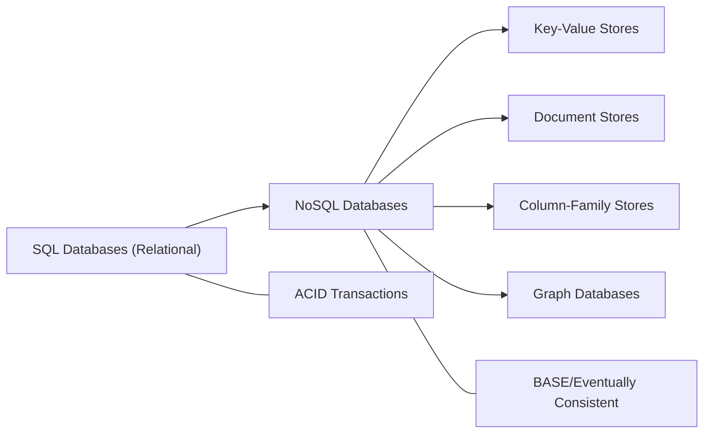
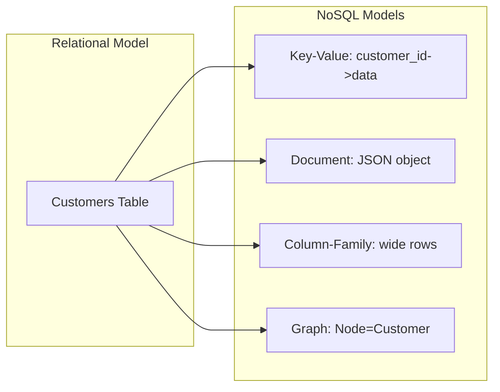
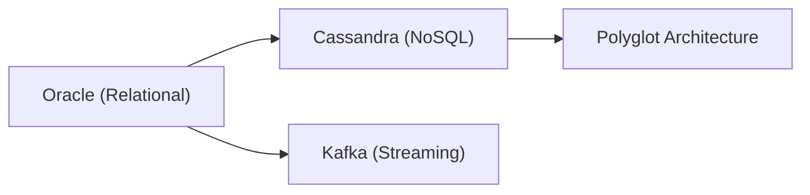
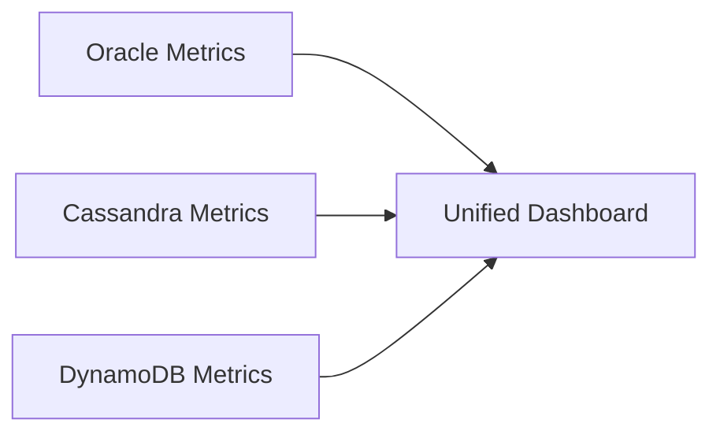
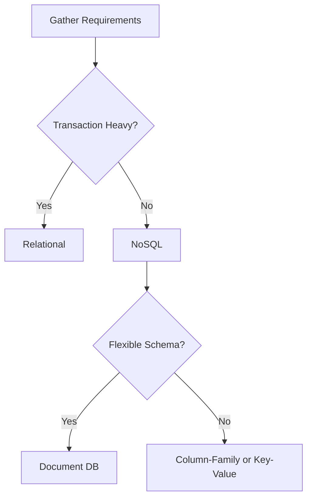
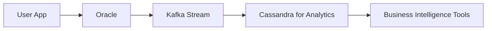

# 📊 SRE Database Training Module — Days 9 & 10  

Welcome to the final two days of our 10-day database training series! In Days 9 and 10, we will compare and contrast SQL vs. NoSQL databases, building on your relational database knowledge from Days 1–8. We will apply an SRE perspective to operational support, reliability, and troubleshooting for diverse database environments. This “brick by brick” approach ensures each concept fits into your existing knowledge base, preparing you to handle real-world, multi-database systems confidently.

---

## Day 9: SQL vs NoSQL Fundamentals

### 📌 1. Introduction to Database Paradigms

**Enthusiastic Welcome**  
Welcome to Day 9! Yesterday, you wrapped up performance tuning for relational databases. Today, let’s expand that foundation into a broader world—comparing relational (SQL) databases to the many flavors of NoSQL.  

**Why This Matters**  
As applications grow, businesses often adopt multiple database types—some data might be in a relational Oracle database, other data might live in a NoSQL system like Cassandra or DynamoDB. Support engineers and SREs need to understand the strengths, limitations, and operational characteristics of both paradigms.

**Real-World Support Scenario**  
Consider an e-commerce platform storing orders in Oracle (for financial consistency) and product catalog data in a NoSQL document store. When an end-to-end query spans both systems, debugging any performance or consistency issues requires broad database knowledge.

**Visual Concept Map**  
Below is a high-level Mermaid diagram illustrating where SQL and NoSQL fit in the database ecosystem:



**Historical Context**  
Relational databases date back to the 1970s, dominating due to their robust SQL standards and strong consistency. With massive web-scale applications came NoSQL, which emphasized horizontal scaling and flexible schemas.

---

### 🎯 2. Day 9 Learning Objectives by Tier

| Tier              | 4 Learning Objectives                                                                                                                                                                                                                              |
|-------------------|----------------------------------------------------------------------------------------------------------------------------------------------------------------------------------------------------------------------------------------------------|
| 🔍 **Beginner**   | 1. Understand fundamental differences between SQL and NoSQL.<br/>2. Recognize major NoSQL categories (key-value, document, column-family, graph).<br/>3. Comprehend the basics of ACID vs. BASE properties.<br/>4. Identify typical use cases for each database type. |
| 🧩 **Intermediate** | 1. Compare relational vs. NoSQL data models in detail.<br/>2. Explain schema-on-write vs. schema-on-read approaches.<br/>3. Perform basic queries across different NoSQL types.<br/>4. Understand consistency levels and how they affect availability.                               |
| 💡 **Advanced/SRE** | 1. Evaluate the operational impact of SQL vs. NoSQL in production.<br/>2. Incorporate reliability engineering principles into multi-database environments.<br/>3. Anticipate common pitfalls during migrations or integrations.<br/>4. Develop robust incident response strategies for cross-database issues. |

---

### 📚 3. Day 9 Core Concepts

We will explore:

1. **Database Paradigms Overview**  
2. **Data Models Comparison** (relational, key-value, document, column-family, graph)  
3. **ACID vs. BASE Properties**  
4. **Relational Database Recap** (Oracle focus)  
5. **Key-Value Stores** (DynamoDB, Redis)  
6. **Document Databases** (MongoDB, Couchbase)  
7. **Column-Family Stores** (Cassandra, HBase)  
8. **Graph Databases** (Neo4j)  
9. **Schema Approaches** (schema-on-write vs. schema-on-read)  
10. **Query Capabilities Comparison** (SQL, CQL, proprietary NoSQL)  

For each concept, you’ll see:  
- **Beginner Analogy**  
- **Visual Representation (Mermaid diagrams)**  
- **Technical Explanation**  
- **Support/SRE Application**  
- **System Impact**  
- **Common Misconceptions**  
- **Implementation Comparison**  

---

### 💻 4. Day 9 Concept Breakdown

#### 4.1 Database Paradigms Overview

- **Beginner Analogy**  
  Relational: a neat spreadsheet with rows/columns.  
  NoSQL: a set of variously shaped containers—some are like dictionaries (key-value), others like documents.  

- **Mermaid Diagram**  
  ```mermaid
  flowchart TB
    subgraph "Database Paradigms"
      A["Relational (SQL)"] --> B["NoSQL"]
      B --> C["Key-Value"]
      B --> D["Document"]
      B --> E["Column-Family"]
      B --> F["Graph"]
    end
  ```

- **Technical Explanation**  
  **Relational** databases enforce schemas at write time (schema-on-write) and typically prioritize ACID properties. **NoSQL** solutions focus on scalability, often using BASE (eventual consistency).  

- **Support/SRE Application**  
  Different paradigms require different troubleshooting approaches (e.g., indexing in SQL vs. partition key design in NoSQL).  

- **System Impact**  
  Relational systems can be CPU/memory heavy; NoSQL can handle horizontally scalable, massive workloads with simpler queries.  

- **Common Misconception**  
  “NoSQL can replace all relational systems.” Each has its place depending on data type, consistency needs, and query patterns.  

- **Implementation Comparison**  
  - **Oracle** (relational) vs. **MongoDB** (document) vs. **Cassandra** (column-family).  

#### 4.2 Data Models Comparison

- **Beginner Analogy**  
  - **Relational**: A fully labeled library with strict shelving.  
  - **Key-Value**: A dictionary: key to value.  
  - **Document**: A pile of different documents, each with its own structure.  
  - **Column-Family**: A giant spreadsheet with flexible columns per row.  
  - **Graph**: A map of connected cities (nodes) and roads (edges).  

- **Mermaid Diagram**  
  ```mermaid
  flowchart LR
    A["Relational Table"] --> B["Key-Value"]
    A --> C["Document JSON"]
    A --> D["Column-Family<br/>Wide Rows"]
    A --> E["Graph<br/>Nodes+Edges"]
  ```

- **Technical Explanation**  
  Each model suits different needs. Graph DBs handle relationships well, while key-value stores excel at simple lookups.  

- **Support/SRE Application**  
  Understanding the data model aids in diagnosing performance issues and planning expansions.  

- **System Impact**  
  If your system is heavy on relationships (e.g., social networks), a graph DB might excel. If you need flexible data formats, a document store is ideal.  

- **Common Misconception**  
  “All NoSQL are the same.” They vary significantly (key-value vs. graph is a big difference).  

- **Implementation Comparison**  
  | Model Type        | Example DB  | Ideal Use Case                          |
  |-------------------|-------------|-----------------------------------------|
  | Relational        | Oracle      | Transactions, complex joins            |
  | Key-Value         | DynamoDB    | Caching, session data, simple lookups   |
  | Document          | MongoDB     | Flexible schemas, nested data          |
  | Column-Family     | Cassandra   | Time-series, high write throughput      |
  | Graph             | Neo4j       | Relationship-heavy data, recommendations|

#### 4.3 ACID vs. BASE Properties

- **Beginner Analogy**  
  - **ACID**: Like a perfectly maintained ledger that never has an inconsistent entry.  
  - **BASE**: Like a set of news feeds that eventually show the latest info, but not always immediately.  

- **Mermaid Diagram**  
  ```mermaid
  flowchart TB
    A["ACID"] --> B["Atomicity<br/>Consistency<br/>Isolation<br/>Durability"]
    C["BASE"] --> D["Basically Available<br/>Soft State<br/>Eventual Consistency"]
  ```

- **Technical Explanation**  
  ACID enforces strict transactional consistency. BASE systems often forgo immediate consistency for availability and partition tolerance.  

- **Support/SRE Application**  
  Choose ACID when data correctness is paramount (e.g., financials). BASE can be used in distributed systems that demand high availability (e.g., social feeds).  

- **System Impact**  
  ACID can mean higher overhead but ensures strong consistency. BASE prioritizes availability, allowing stale reads.  

- **Common Misconception**  
  “BASE = no consistency.” In reality, it is eventual consistency, which can be tuned.  

- **Implementation Comparison**  
  - **Oracle**: ACID  
  - **DynamoDB**: BASE with optional strong reads  

#### 4.4 Relational Database Recap (Oracle)

- **Beginner Analogy**  
  Oracle is like a well-managed office building with multiple floors (schemas), a strong security guard (DBA), and well-defined entry points (tables).  

- **Mermaid Diagram**  
  ```mermaid
  flowchart LR
      A["Tables"] --> B["Columns"]
      A --> C["Rows"]
      B --> D["Constraints"]
  ```

- **Technical Explanation**  
  Oracle organizes data into tables, adheres to ACID, and often runs on specialized hardware or in the cloud.  

- **Support/SRE Application**  
  Monitoring performance with Oracle Enterprise Manager, ensuring backups with RMAN, and tuning queries.  

- **System Impact**  
  High consistency, well-defined schemas, typically vertical scaling (but Oracle RAC supports clustering).  

- **Common Misconception**  
  “Oracle doesn’t scale horizontally.” RAC can provide scale-out capabilities.  

#### 4.5 Key-Value Stores (DynamoDB, Redis)

- **Beginner Analogy**  
  A phone directory: Each name (key) has one phone number (value).  

- **Mermaid Diagram**  
  ```mermaid
  flowchart TB
    subgraph "Key-Value Store"
      K["Key"] --> V["Value"]
    end
  ```

- **Technical Explanation**  
  This model is simple: read and write via a key. Some key-value stores (like DynamoDB) add features like secondary indexes.  

- **Support/SRE Application**  
  - **Redis**: In-memory cache for session management.  
  - **DynamoDB**: Highly scalable, serverless usage-based pricing.  

- **System Impact**  
  Very fast lookups, minimal overhead. Horizontal scaling is typically straightforward.  

- **Common Misconception**  
  “Key-value stores have no indexing.” Some offer limited indexes.  

#### 4.6 Document Databases (MongoDB, Couchbase)

- **Beginner Analogy**  
  Like a set of filing cabinets with documents that can each have different formats.  

- **Mermaid Diagram**  
  ```mermaid
  flowchart LR
    A["Collection"] --> B["Document"]
    B --> C["JSON/BSON Fields"]
  ```

- **Technical Explanation**  
  Stores data as structured documents (often JSON or BSON). Schemas are flexible, typically schema-on-read.  

- **Support/SRE Application**  
  Easy to add new fields without schema migrations; watch for large, unbounded documents that can affect performance.  

- **System Impact**  
  Sharding is common for horizontal scale, queries can be complex if data is nested.  

- **Common Misconception**  
  “Document DBs have no schema.” They do—just enforced differently, often at read time.  

#### 4.7 Column-Family Stores (Cassandra, HBase)

- **Beginner Analogy**  
  Like a massive spreadsheet with potentially thousands of columns, each row can have its own set of columns.  

- **Mermaid Diagram**  
  ```mermaid
  flowchart TB
    A["Table"] --> B["Row Key"]
    B --> C["Columns"]
    C --> D["Wide Rows"]
  ```

- **Technical Explanation**  
  Data is grouped by column families, designed for high write throughput, multi-region replication.  

- **Support/SRE Application**  
  Monitoring cluster health with `nodetool` (Cassandra), tuning consistency levels, ensuring data is properly partitioned.  

- **System Impact**  
  Very efficient for time-series or event data; poor design of partition keys can lead to hotspots.  

- **Common Misconception**  
  “Column-family means infinite columns.” In practice, there are practical limits on row size.  

#### 4.8 Graph Databases (Neo4j)

- **Beginner Analogy**  
  Like a social network of friends, each node is a person, each relationship is a connection.  

- **Mermaid Diagram**  
  ```mermaid
  flowchart LR
    A["Node"] --> B["Relationship"]
    B --> C["Node"]
  ```

- **Technical Explanation**  
  Data is stored as nodes and edges, ideal for queries involving paths or relationships.  

- **Support/SRE Application**  
  Ideal for fraud detection, recommendation engines (where relationships matter).  

- **System Impact**  
  Graph traversals can be much faster than equivalent joins in a relational DB.  

- **Common Misconception**  
  “Graph databases are only for social networks.” They’re also valuable for logistics, permission trees, etc.

#### 4.9 Schema Approaches (schema-on-write vs. schema-on-read)

- **Beginner Analogy**  
  - **Schema-on-write**: Fill out a government form with all required fields before submission.  
  - **Schema-on-read**: Throw your receipts in a box and sort them when you need them.  

- **Mermaid Diagram**  
  ```mermaid
  flowchart TB
    A["Schema-on-Write<br/>(Relational)"]
    B["Schema-on-Read<br/>(NoSQL)"]
    A --> C["Strict Upfront<br/>Definition"]
    B --> D["Flexible Structure<br/>at Query Time"]
  ```

- **Technical Explanation**  
  In relational systems, data must match a pre-defined structure. In many NoSQL systems, you can insert data with minimal schema constraints, defining structure when you read/interpret the data.  

- **Support/SRE Application**  
  Changing schemas in a relational DB can require downtime; NoSQL can be more flexible.  

- **System Impact**  
  Potential for inconsistent data in NoSQL if not carefully managed.  

- **Common Misconception**  
  “NoSQL doesn’t have schemas.” Many organizations maintain ‘logical’ schemas anyway for data consistency.  

#### 4.10 Query Capabilities Comparison (SQL, CQL, etc.)

- **Beginner Analogy**  
  - **SQL**: A universal language with defined syntax for complex joins and aggregations.  
  - **NoSQL Queries**: Often specialized (CQL in Cassandra, JSON-based queries in MongoDB).  

- **Mermaid Diagram**  
  ```mermaid
  flowchart LR
    A["SQL Queries"] --> B["Complex Joins<br/>Aggregations"]
    C["NoSQL Queries"] --> D["Simpler or Model-specific<br/>Limited Joins"]
  ```

- **Technical Explanation**  
  SQL is standardized but not always easy to scale horizontally. NoSQL queries vary widely, some are partial subsets of SQL (like Cassandra’s CQL).  

- **Support/SRE Application**  
  Tools differ for each system. Understanding the query language helps in troubleshooting slow queries or timeouts.  

- **System Impact**  
  Complex joins can be expensive; NoSQL often denormalizes data instead of joining.  

- **Common Misconception**  
  “NoSQL queries are always easier.” They can become complicated for advanced analytics.  

---

### 🔄 5. Data Modeling Across Paradigms

**Transforming a Relational Model to NoSQL**  
- For a “Customers” table in Oracle, you could have:  
  - **Key-Value**: `customer_id -> JSON blob`  
  - **Document**: a collection “customers” with JSON objects  
  - **Column-Family**: row key = `customer_id`, columns for attributes  
  - **Graph**: a node labeled “Customer,” edges to related nodes (Orders, Addresses)

**Mermaid Diagram**  


**Trade-offs**  
- Denormalization often needed for NoSQL to optimize reads.  
- Relational may require joining multiple tables, but that’s natively supported with SQL.

---

### 🔍 6. Query Approaches Comparison

**SQL vs. NoSQL**  
- **SQL**:  
  ```sql
  SELECT * FROM customers WHERE customer_id = 123;
  ```  
- **Cassandra (CQL)**:  
  ```sql
  SELECT * FROM customers WHERE customer_id = 123;
  ```  
  (Looks similar but lacks joins.)  
- **MongoDB (JSON Query)**:  
  ```python
  db.customers.find({"customer_id": 123})
  ```  
- **DynamoDB (Key Lookup)**:  
  ```python
  response = table.get_item(Key={"customer_id": 123})
  ```

**Python Code Examples** (Python 3.11+)

```python
# Oracle example using oracledb
import oracledb

dsn_str = "localhost:1521/ORCLPDB"
with oracledb.connect(user="username", password="password", dsn=dsn_str) as connection:
    with connection.cursor() as cursor:
        cursor.execute("SELECT * FROM customers WHERE customer_id = :id", {"id": 123})
        for row in cursor:
            print(row)

# MongoDB example
from pymongo import MongoClient

client = MongoClient("mongodb://localhost:27017/")
db = client["mydb"]
customers = db["customers"]
customer = customers.find_one({"customer_id": 123})
print(customer)
```

---

### 🔨 7. Day 9 Hands-On Exercises

| Tier              | Exercises                                                                                                                                                                                                                                      |
|-------------------|-----------------------------------------------------------------------------------------------------------------------------------------------------------------------------------------------------------------------------------------------|
| 🔍 **Beginner**   | 1. Identify use cases for each database paradigm (SQL, key-value, document, column-family, graph).<br/>2. Connect to a relational DB (Oracle) and retrieve a row.<br/>3. Demonstrate a basic key-value query in Redis or DynamoDB.                                                               |
| 🧩 **Intermediate** | 1. Convert a relational Orders table into a document representation in MongoDB.<br/>2. Write a Python script for read/write operations in both Oracle and Cassandra.<br/>3. Compare ACID and BASE for a given scenario—decide which is more appropriate and why.                          |
| 💡 **Advanced/SRE** | 1. Design a multi-database architecture for an online gaming platform (user data in Oracle, analytics in Cassandra).<br/>2. Evaluate reliability risks for each database type.<br/>3. Implement a POC to ingest JSON data into Oracle (JSON features) and a NoSQL store.                      |

---

### 🚧 8. Day 9 Troubleshooting Scenarios

1. **Scenario: Data Inconsistency Between Oracle and MongoDB**  
   - **Symptoms**: Users see outdated profile information in the NoSQL-based microservice.  
   - **Causes**: Delayed synchronization or ignoring last-update timestamps.  
   - **Diagnostic Approach**: Check message queues, replication processes, logs.  
   - **Resolution**: Implement a change data capture pipeline with timestamps or triggers.

   ```mermaid
   flowchart LR
       A["Oracle DB"] --> B["Sync Process"]
       B --> C["MongoDB"]
       C --> D["Outdated Profile?"]
   ```

2. **Scenario: High Latency on Cassandra Queries**  
   - **Symptoms**: Timeouts or slow reads.  
   - **Causes**: Hot partition keys, uneven data distribution, insufficient nodes.  
   - **Diagnostic Approach**: Use `nodetool status`, check logs for read timeouts, examine partition key selection.  
   - **Resolution**: Redesign partition keys, add nodes, or adjust consistency level.

3. **Scenario: Schema Change in Relational DB**  
   - **Symptoms**: Application throws errors after altering a table.  
   - **Causes**: Missing columns in code references, or data type mismatch.  
   - **Diagnostic Approach**: Check column definitions, application logs, run test queries.  
   - **Resolution**: Update the application or fix the schema change process; ensure zero-downtime migration approach.

---

### ❓ 9. Day 9 Frequently Asked Questions

| Tier              | FAQ                                                                                                                                                                                                                                         |
|-------------------|----------------------------------------------------------------------------------------------------------------------------------------------------------------------------------------------------------------------------------------------|
| 🔍 **Beginner**   | **Q1:** Are NoSQL databases always faster?<br/>**A:** Not always. They’re optimized for certain workloads; relational can outperform them in others.<br/><br/>**Q2:** Can I use SQL-like queries in NoSQL?<br/>**A:** Some NoSQL solutions have SQL-like languages (e.g., Cassandra’s CQL).<br/><br/>**Q3:** Do I need multiple database types for my application?<br/>**A:** It depends on complexity, scale, and budget.                                        |
| 🧩 **Intermediate** | **Q1:** How do I handle relationships in a document database?<br/>**A:** Either embed or reference documents, depending on data access patterns.<br/><br/>**Q2:** What’s the difference between BASE and ACID from an SRE perspective?<br/>**A:** BASE offers high availability with eventual consistency; ACID ensures immediate consistency at the cost of performance.<br/><br/>**Q3:** Can I do joins in Cassandra?<br/>**A:** Native joins are not supported; you often denormalize.              |
| 💡 **Advanced/SRE** | **Q1:** How do I set up multi-region NoSQL replication?<br/>**A:** This is built into some systems (Cassandra, DynamoDB Global Tables). Use consistent replication strategies, monitor latencies. <br/><br/>**Q2:** What if my relational DB must scale horizontally?<br/>**A:** Consider Oracle RAC or partitioning/sharding solutions. <br/><br/>**Q3:** How do I unify monitoring across SQL and NoSQL systems?<br/>**A:** Use a centralized observability platform (e.g., Prometheus + Grafana or Splunk). |

---

### 🧠 10. Day 9 Key Takeaways

1. **SQL vs. NoSQL**: Understand core differences in schemas, consistency, and scalability.  
2. **Data Models**: Key-value, document, column-family, and graph models each serve unique workloads.  
3. **ACID vs. BASE**: Trade-offs between strong consistency and high availability.  
4. **Practical Usage**: Know where Oracle shines (transactions), where Cassandra excels (high-write scalability), etc.  
5. **Hands-On Knowledge**: Troubleshooting multi-database scenarios often requires bridging knowledge across paradigms.

---

## Day 10: Practical Comparisons and Use Cases

### 📌 1. Introduction to Day 10

**Enthusiastic Welcome**  
Welcome to Day 10! You’ve mastered the fundamentals of database paradigms. Now, we’ll dive into real-world comparisons and SRE considerations, such as performance, scaling, HA configurations, and more.

**Why This Matters**  
Operational issues often arise when an organization runs multiple database types. Knowing how Oracle differs from Cassandra or DynamoDB helps you plan capacity, monitor effectively, and mitigate incidents quickly.

**Real-World Support Scenario**  
A global online retailer uses Oracle for financial transactions, Cassandra for product inventory, and Kafka for streaming events. An SRE must handle cross-database lag, high availability, and multi-region failovers.

**Visual Concept Map**  


**Evaluation Framework**  
We’ll use real metrics (throughput, latency, consistency levels) to compare database technologies.

---

### 🎯 2. Day 10 Learning Objectives by Tier

| Tier              | 4 Learning Objectives                                                                                                                                                                                                               |
|-------------------|--------------------------------------------------------------------------------------------------------------------------------------------------------------------------------------------------------------------------------------|
| 🔍 **Beginner**   | 1. Compare Oracle to a typical NoSQL solution in simple terms.<br/>2. Understand basic scaling strategies (vertical vs. horizontal).<br/>3. Learn key metrics (latency, throughput, consistency).<br/>4. Configure a simple HA scenario in a single-region environment. |
| 🧩 **Intermediate** | 1. Implement monitoring for Oracle and Cassandra.<br/>2. Evaluate cost vs. performance vs. reliability.<br/>3. Understand replication strategies (master-slave, peer-to-peer).<br/>4. Outline a basic plan for database migration from Oracle to NoSQL.            |
| 💡 **Advanced/SRE** | 1. Design and troubleshoot polyglot architectures (Oracle + Cassandra + Kafka).<br/>2. Implement advanced scaling approaches (sharding, partitioning).<br/>3. Monitor cross-database performance metrics and query patterns.<br/>4. Create an SRE incident response plan for multi-database outages. |

---

### 📚 3. Day 10 Core Concepts

1. **Detailed Database Comparison: Oracle vs. Cassandra**  
2. **Detailed Database Comparison: Oracle vs. DynamoDB**  
3. **Kafka and Streaming Platforms**  
4. **Performance Characteristics**  
5. **Scaling Approaches**  
6. **High Availability Configurations**  
7. **Backup and Recovery Strategies**  
8. **Monitoring and Observability**  
9. **Database Selection Criteria Framework**  
10. **Polyglot Persistence and Hybrid Architectures**  

---

### 💻 4. Day 10 Concept Breakdown

#### 4.1 Detailed Database Comparison: Oracle vs. Cassandra

- **Beginner Analogy**  
  Oracle = a highly organized, centralized library. Cassandra = a network of smaller libraries with replicated books.

- **Mermaid Diagram**  
  ```mermaid
  flowchart LR
      O["Oracle"] --> C["Cassandra"]
      O --> A["ACID Transactions"]
      C --> B["BASE / Tunable Consistency"]
  ```

- **Technical Explanation**  
  Oracle excels at complex SQL queries, strong ACID transactions. Cassandra offers peer-to-peer architecture, linear scalability, and wide-column data modeling.

- **Support/SRE Application**  
  - Oracle: Manage resources, optimize queries, maintain indexes.  
  - Cassandra: Monitor ring state with `nodetool`, ensure proper replication factor, handle token ranges.

- **System Impact**  
  - Oracle can require more expensive hardware or rely on RAC for scale.  
  - Cassandra scales horizontally across commodity servers.

- **Common Misconception**  
  “Cassandra can replace Oracle in all cases.” Some workloads need Oracle’s advanced SQL or transaction features.

#### 4.2 Detailed Database Comparison: Oracle vs. DynamoDB

- **Beginner Analogy**  
  Oracle = You buy and manage your own warehouse. DynamoDB = You rent space in an automated warehouse that charges you by usage.

- **Mermaid Diagram**  
  ```mermaid
  flowchart TB
      A["Oracle"] --> B["DynamoDB"]
  ```

- **Technical Explanation**  
  DynamoDB is fully managed, pay-per-request, with optional global tables. Oracle is self-managed or cloud-hosted, often requiring specialized tuning or hardware.

- **Support/SRE Application**  
  - Oracle: Admin tasks (patching, backup, resource allocation).  
  - DynamoDB: Manage read/write capacity units, monitor CloudWatch metrics.

- **System Impact**  
  - Oracle: Potentially higher fixed costs, but deep feature set.  
  - DynamoDB: No server management, but limited query patterns (partition/sort key).

- **Common Misconception**  
  “Managed means no maintenance.” You still must design table structures, indexes, and read/write capacity carefully.

#### 4.3 Kafka and Streaming Platforms

- **Beginner Analogy**  
  A conveyor belt system that sends messages (events) to different “stations” (consumer groups).

- **Mermaid Diagram**  
  ```mermaid
  flowchart LR
      P["Producers"] --> K["Kafka Topic"]
      K --> C1["Consumer Group 1"]
      K --> C2["Consumer Group 2"]
  ```

- **Technical Explanation**  
  Kafka is used for real-time event streaming, not as a primary database. However, it can integrate with both SQL and NoSQL for event sourcing.

- **Support/SRE Application**  
  Monitor brokers, handle partition assignment, ensure consumer lag is minimal.  

- **System Impact**  
  Adds complexity but decouples services.

- **Common Misconception**  
  “Kafka can replace a database.” It’s complementary, focused on streaming, not persistent querying in the traditional sense.

#### 4.4 Performance Characteristics

- **Beginner Analogy**  
  Some databases are “sprinters” (quick transactions), others are “marathoners” (handle continuous heavy loads with horizontal scale).

- **System Impact**  
  - Latency vs. throughput trade-offs.  
  - Relational might have more overhead for complex queries, NoSQL might handle more requests with simpler queries.

- **Common Misconception**  
  “High throughput is always best.” Low latency can be critical for user experience.

#### 4.5 Scaling Approaches (Vertical vs. Horizontal)

- **Beginner Analogy**  
  - **Vertical**: Build a taller building.  
  - **Horizontal**: Construct more buildings of moderate height.

- **Mermaid Diagram**  
  ```mermaid
  flowchart LR
      V["Vertical Scaling"] --> S["Add CPU/RAM"]
      H["Horizontal Scaling"] --> N["Add More Nodes"]
  ```

- **Technical Explanation**  
  Relational DBs historically scale vertically (bigger servers). NoSQL typically scales horizontally with sharding/partitioning.

- **Support/SRE Application**  
  Plan expansions, monitor CPU usage or cluster node capacity.

- **System Impact**  
  Horizontal scaling often suits distributed workloads.

- **Common Misconception**  
  “Vertical is cheaper.” At large scales, horizontal can be more cost-effective.

#### 4.6 High Availability Configurations

- **Beginner Analogy**  
  Having backup drivers for a bus route. When one driver is sick, another steps in.

- **Mermaid Diagram**  
  ```mermaid
  flowchart LR
      A["Primary Database"] --> B["Standby/Replicas"]
      B --> A
  ```

- **Technical Explanation**  
  - Oracle: Data Guard, RAC for HA.  
  - Cassandra: Peer-to-peer replication with configurable consistency.  
  - DynamoDB: Multi-region tables with eventual consistency.

- **Support/SRE Application**  
  Configure failover, test failover scenarios.

- **System Impact**  
  Minimizes downtime but adds replication overhead.

- **Common Misconception**  
  “HA = Zero downtime.” Failover can still introduce short disruptions.

#### 4.7 Backup and Recovery Strategies

- **Beginner Analogy**  
  Making copies of important documents and storing them in different safes.

- **Technical Explanation**  
  - Oracle: RMAN, incremental backups, flashback features.  
  - Cassandra: Snapshots + incremental backups.  
  - DynamoDB: Point-in-time recovery.

- **Support/SRE Application**  
  Automate backups, ensure they’re tested, keep them offsite.

- **System Impact**  
  Backup frequency vs. performance overhead.  

- **Common Misconception**  
  “Cloud services handle backups automatically.” They may provide tools, but you must configure and verify them.

#### 4.8 Monitoring and Observability

- **Beginner Analogy**  
  Using multiple sensors on a factory floor for real-time status.

- **Mermaid Diagram**  
  ```mermaid
  flowchart LR
      M["Metrics Collection"] --> D["Dashboards"]
      D --> A["Alerts"]
  ```

- **Technical Explanation**  
  Collect system, DB metrics (CPU, memory, query performance). Tools like Prometheus, Grafana, Oracle Enterprise Manager, CloudWatch.

- **Support/SRE Application**  
  Set alert thresholds, watch for anomalies, create incident response playbooks.

- **System Impact**  
  Over-monitoring can cause overhead, but insufficient monitoring leads to blind spots.

- **Common Misconception**  
  “Monitoring is set-and-forget.” It requires ongoing tuning.

#### 4.9 Database Selection Criteria Framework

- **Beginner Analogy**  
  Like choosing a vehicle: a van for more passengers, a motorcycle for speed, etc.

- **Mermaid Decision Tree**  
  ```mermaid
  flowchart TB
      A["Start"] --> B{"Data Complexity?"}
      B -->|High| C["Relational SQL"]
      B -->|Low| D["Key-Value / Document"]
      D --> E{"Scale Requirements?"}
      E -->|Massive| F["Column-Family / DynamoDB"]
      E -->|Modest| G["Simple RDB or Key-Value"]
  ```

- **System Impact**  
  Evaluate data relationships, scaling needs, transaction strictness.

#### 4.10 Polyglot Persistence and Hybrid Architectures

- **Beginner Analogy**  
  Using different tools in a workshop—each specialized for a particular task.

- **Mermaid Diagram**  
  ```mermaid
  flowchart LR
      Subgraph1["Application Layer"] --> OracleDB["Oracle"]
      Subgraph1 --> CassDB["Cassandra"]
      Subgraph1 --> Kafka["Kafka"]
  ```

- **Technical Explanation**  
  Running multiple databases for different workloads (transactions, analytics, caching) can optimize performance.

- **Support/SRE Application**  
  Know how data flows between systems, unify monitoring.  

- **System Impact**  
  Higher complexity, but can yield better performance for specialized workloads.

- **Common Misconception**  
  “More databases = always better.” Complexity can lead to higher ops overhead.

---

### 🛠️ 5. Operational Management Comparison

**Monitoring Approaches**  
- Oracle: Oracle Enterprise Manager, AWR reports.  
- Cassandra: `nodetool`, Prometheus exporters.  
- DynamoDB: AWS CloudWatch metrics.

**Mermaid Dashboard Example**  


**Python Script Example** (monitoring integration snippet)

```python
import requests

def collect_oracle_metrics():
    # Placeholder for actual Oracle monitoring approach
    return {"oracle_sessions": 42, "oracle_cpu_percent": 65}

def collect_cassandra_metrics():
    # Simulate calls to a Prometheus endpoint or nodetool parse
    return {"cassandra_nodes_up": 5, "cassandra_latency_ms": 10}

def main():
    oracle_data = collect_oracle_metrics()
    cass_data = collect_cassandra_metrics()
    
    # Combine and send to centralized system
    combined_metrics = {**oracle_data, **cass_data}
    requests.post("http://monitoring-service.local/metrics", json=combined_metrics)

if __name__ == "__main__":
    main()
```

---

### 🔍 6. Database Selection and Migration

**Methodology**  
1. Identify requirements (throughput, latency, consistency).  
2. Evaluate existing data models.  
3. Choose database type that best fits.  

**Mermaid Decision Tree**  


**Migration Approaches**  
- **Big Bang:** All data at once.  
- **Trickle Migration:** Parallel systems, gradually shift traffic.  

**Pitfalls**  
- Data format mismatches, downtime planning, partial migrations causing inconsistency.

---

### 🧰 7. Multi-Database Architecture Patterns

**Common Hybrid Patterns**  
- **CQRS (Command Query Responsibility Segregation)**  
- **Event Sourcing with Kafka**  
- **Dedicated Analytics DB** (e.g., Spark + Cassandra)

**Mermaid Workflow**  


---

### 🔨 8. Day 10 Hands-On Exercises

| Tier              | Exercises                                                                                                                                                                                                                                                             |
|-------------------|----------------------------------------------------------------------------------------------------------------------------------------------------------------------------------------------------------------------------------------------------------------------|
| 🔍 **Beginner**   | 1. Set up a basic Oracle to Cassandra data export/import using CSV.<br/>2. Configure a DynamoDB table and perform CRUD operations via Python.<br/>3. Build a simple monitoring dashboard for Oracle CPU usage.                                                          |
| 🧩 **Intermediate** | 1. Deploy a Cassandra cluster, run read/write tests, and observe metrics in real time.<br/>2. Compare Oracle vs. DynamoDB query performance for a sample dataset.<br/>3. Implement a basic HA scenario (Oracle Data Guard or Cassandra multi-node replication) and failover. |
| 💡 **Advanced/SRE** | 1. Architect a system using Oracle for transactions, Cassandra for product catalogs, and Kafka for streaming events. Show how to handle multi-region replication.<br/>2. Implement an auto-scaling policy for DynamoDB based on CloudWatch metrics.<br/>3. Design a robust DR plan across multiple database types. |

---

### 🚧 9. Day 10 Troubleshooting Scenarios

1. **Scenario: Cross-Database Latency**  
   - **Symptoms**: Slow user-facing endpoints that fetch data from both Oracle and Cassandra.  
   - **Causes**: Network lag, unoptimized queries, or inconsistent indexing strategies.  
   - **Diagnostic Approach**: Trace calls, measure latency in each DB.  
   - **Resolution**: Tune Oracle queries (add indexes), ensure Cassandra partition keys are efficient.

   ```mermaid
   flowchart LR
       User["User Request"] --> App["Application"]
       App --> Oracle["Oracle Queries"]
       App --> Cass["Cassandra Queries"]
       Cass --> App
       Oracle --> App
       App --> User
   ```

2. **Scenario: Partial DynamoDB Outage**  
   - **Symptoms**: High error rates in one AWS region.  
   - **Causes**: Region-specific issues or misconfigured capacity units.  
   - **Diagnostic Approach**: Check AWS Health Dashboard, CloudWatch metrics.  
   - **Resolution**: Add capacity, redirect writes to another region, or auto-scale.

3. **Scenario: Oracle Backup Failure**  
   - **Symptoms**: Scheduled backups fail, logs show insufficient disk space.  
   - **Causes**: RMAN default location is full, or archive logs not purged.  
   - **Diagnostic Approach**: Examine RMAN logs, check disk usage, check scheduling.  
   - **Resolution**: Clean up old backups, expand storage, revise backup retention.

---

### ❓ 10. Day 10 Frequently Asked Questions

| Tier              | FAQ                                                                                                                                                                                                                                                      |
|-------------------|----------------------------------------------------------------------------------------------------------------------------------------------------------------------------------------------------------------------------------------------------------|
| 🔍 **Beginner**   | **Q1:** What’s the difference between vertical and horizontal scaling?<br/>**A:** Vertical = adding resources to one server, horizontal = adding more servers. <br/><br/>**Q2:** Do I need to manually replicate data in DynamoDB?<br/>**A:** DynamoDB global tables automate cross-region replication if configured.<br/><br/>**Q3:** How do I measure database performance quickly?<br/>**A:** Use simple load testing tools (e.g., JMeter, Locust) and measure throughput/latency. |
| 🧩 **Intermediate** | **Q1:** How does Cassandra handle multi-datacenter replication?<br/>**A:** Configured with replication strategies for each DC; ensures data is replicated accordingly.<br/><br/>**Q2:** Can Oracle run in containers or on Kubernetes?<br/>**A:** Yes, Oracle provides container images and Helm charts, but ensure licensing and performance overhead are addressed.<br/><br/>**Q3:** Are backups free in DynamoDB?<br/>**A:** They’re not free; AWS charges for storage and PITR.                |
| 💡 **Advanced/SRE** | **Q1:** How do I unify logs for Oracle, Cassandra, and Kafka?<br/>**A:** Use a centralized logging solution (Splunk, ELK, Datadog) with appropriate plugins. <br/><br/>**Q2:** How to maintain consistent backups across multiple database types?<br/>**A:** Coordinate snapshots, ensure consistent timestamps or transaction points for each DB. <br/><br/>**Q3:** How do we reduce the blast radius of an outage in a polyglot environment?<br/>**A:** Deploy microservices with bounded contexts and graceful degradation. |

---

### 🔥 11. Comprehensive SRE-Specific Scenario (Spanning Days 9 & 10)

**Scenario Overview**  
An e-commerce app uses:
- **Oracle**: Financial transactions  
- **Cassandra**: Product catalog and user sessions  
- **Kafka**: Ingest real-time events (user clicks, page views)  
- **Redis**: Caching session data

**Incident**  
- Users see stale product prices and sporadic checkout failures.  
- Monitoring shows Cassandra read timeouts and Oracle CPU spikes.

**Diagnostic Approach**  
1. Use distributed tracing to identify latency in the microservices calling both Oracle and Cassandra.  
2. Check Oracle AWR reports to see if certain queries are overloading CPU.  
3. Run `nodetool status` on Cassandra to see if any node is down or if the cluster is imbalanced.

**Resolution Steps**  
1. Add an index or rewrite an inefficient Oracle query.  
2. Resolve Cassandra partition hotspots by adjusting partition keys or adding nodes.  
3. Confirm that the Kafka consumer streaming price updates is functioning properly (no lag).

**Key SRE Principles**  
- **Observability**: Having dashboards that show both Oracle query times and Cassandra latencies.  
- **Resilience**: Ensuring multi-node Cassandra ring and Oracle HA.  
- **Automation**: Using scripts to automate failover and scaling.  
- **Postmortems**: Documenting root cause, implementing permanent fixes (e.g., new partitioning strategy).

---

### 🧠 12. Day 10 Key Takeaways

1. **Oracle vs. Cassandra/DynamoDB**: Different strengths in consistency, scaling, cost models.  
2. **Operational Management**: Monitoring, HA, backup, and capacity planning differ significantly across SQL and NoSQL.  
3. **Polyglot Persistence**: Combining multiple paradigms can improve performance and flexibility—but raises complexity.  
4. **SRE Perspective**: Focus on reliability, incident response, and transparent monitoring in cross-database ecosystems.

---

### 🎓 13. Training Series Conclusion

**Recap**  
Throughout Days 1–8, you learned about relational fundamentals, SQL operations, performance tuning, and advanced Oracle features. Days 9–10 explored NoSQL, polyglot architectures, and SRE best practices for multi-database environments.

**Key Learnings**  
- Relational vs. NoSQL: Each has its strengths.  
- Consider data model, consistency needs, and operational overhead.  
- Multi-database deployments require thorough monitoring and failover strategies.

**Future Learning Directions**  
- Investigate serverless databases, real-time analytics with Spark, or specialized time-series DBs.  
- Consider advanced topics like distributed ACID transactions or AI-driven query optimization.

**Final Practical Advice**  
- Always align database choice with workload requirements.  
- Document architectures thoroughly.  
- Continue to refine your SRE playbooks—database technology evolves rapidly.

---

### 🚨 14. Career Protection Guide for Multi-Database Environments

1. **High-Risk Operations**: Multi-region replication changes, schema migrations, cross-database transactions.  
2. **Testing Strategies**: Use staging environments mirroring production, chaos engineering to simulate node failures.  
3. **Communication**: Maintain clear runbooks, incident command channels, postmortems for cross-team learning.  
4. **Documentation**: Keep architecture diagrams and configuration details updated in a central repository.  
5. **Change Management**: Deploy changes gradually, consider canary or feature flag approaches for database migrations.

---

## Final Note

By completing Days 9 and 10, you now have a comprehensive view of both relational and NoSQL worlds. You’ve built a valuable skill set to support and optimize modern, multi-database application stacks. Embrace continuous learning and stay proactive in exploring new database technologies and SRE best practices. Congratulations on completing the SRE Database Training Module!