# 📊 SRE Database Training Module  
**Days 9-10: SQL vs NoSQL Database Comparison**

Welcome to the two-day module focused on comparing relational (SQL) and NoSQL databases, with special emphasis on Oracle (for relational) and Cassandra/DynamoDB (for NoSQL). We’ll integrate real-world operational insights from an SRE perspective and provide visual aids, Python code examples, troubleshooting exercises, and more. This builds on Days 1–8 of our training series, which covered relational fundamentals, SQL operations, database design, administration, and performance tuning.

---

## **Day 9: SQL vs NoSQL Fundamentals**

### 📌 **Introduction to Database Paradigms (Day 9)**

1. **Welcome and Context**  
   - You’ve spent Days 1–8 mastering relational fundamentals, from database design to performance tuning. Today, we broaden our scope to explore the **bigger database ecosystem**—specifically how **NoSQL** solutions compare to **traditional relational** databases.  
   - Modern applications frequently rely on multiple database types, making it vital for support and SRE professionals to understand **when** and **why** certain databases are chosen.

2. **Real-World Scenario**  
   - Imagine a **customer-facing e-commerce platform** that uses Oracle for transactional consistency (orders, payments) and also leverages a NoSQL system like Cassandra for product catalogs and user activity feeds. On Day 9, we’ll examine **why** these choices make sense and **how** to support them in practice.

3. **Visual Concept Map**  
   

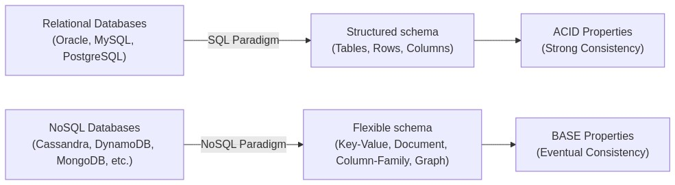


   - This map connects the **SQL** vs **NoSQL** paradigms, along with fundamental differences such as ACID vs BASE.

4. **Why Different Database Types Matter**  
   - **Support Teams** often encounter applications using more than one database, so we’ll explore how to troubleshoot issues spanning **SQL** and **NoSQL**.  

5. **Historical Context**  
   - **Relational** databases were established in the 1970s (E.F. Codd’s relational model).  
   - **NoSQL** gained popularity with the rise of **web-scale applications** needing high throughput, flexible schemas, and distributed architectures.

---

### 🎯 **Day 9 Learning Objectives by Tier**

| Tier            | Objectives                                                                                                                     |
|-----------------|--------------------------------------------------------------------------------------------------------------------------------|
| 🔍 **Beginner** | 1. Understand the core difference between relational and NoSQL paradigms. <br/> 2. Explain the concepts of ACID vs BASE. <br/> 3. Identify common NoSQL categories (key-value, document, column-family, graph). <br/> 4. Recognize basic schema differences (schema-on-write vs schema-on-read). |
| 🧩 **Intermediate** | 1. Compare data modeling approaches across relational and NoSQL. <br/> 2. Illustrate specific use cases for various NoSQL types. <br/> 3. Discuss how consistency models differ (strong, eventual, tunable). <br/> 4. Perform basic Python queries in different database environments.        |
| 💡 **Advanced/SRE** | 1. Evaluate operational trade-offs between SQL and NoSQL in real-world architectures. <br/> 2. Identify reliability considerations for distributed NoSQL databases. <br/> 3. Troubleshoot multi-database issues with a focus on consistency problems. <br/> 4. Design an SRE monitoring approach for diverse database environments. |

---

### 📚 **Day 9 Core Concepts**

Below are the **10 key concepts** for Day 9. Each concept includes a beginner-friendly analogy, a visual, and more advanced insights for SREs.

---

#### 1. **Database Paradigms Overview**

- **Beginner Analogy**: Think of **SQL databases** like a carefully organized library with a strict cataloging system. **NoSQL** is more like an eclectic bookstore with different sections (some sorted by title, some by genre, some by author) but with more relaxed rules.
  
- **Visual Representation**  
  

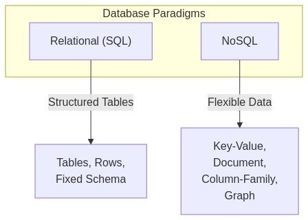


- **Technical Explanation**  
  - **SQL** (Relational): Defined schema, relational model, joins, strong consistency via ACID.  
  - **NoSQL**: Often schemaless or flexible schema, designed for **horizontal scaling**, can prioritize availability over strict consistency (BASE properties).

- **Support/SRE Application**  
  - Real-world: You may have to support queries that go from a structured Oracle table to a key-value store. Understanding these fundamentals helps you **diagnose performance issues and data inconsistency** problems.

- **System Impact**  
  - **SQL**: Typically scales **vertically** (larger machines) or with advanced partitioning/sharding.  
  - **NoSQL**: Designed to scale **horizontally** across many commodity nodes.

- **Common Misconception**  
  - “NoSQL can’t handle transactions.” In reality, many NoSQL databases offer **configurable consistency**, or partial ACID transactions (e.g., MongoDB’s multi-document transactions).

- **Implementation Comparison**  
  | Aspect            | SQL (Oracle)                             | NoSQL (Cassandra, DynamoDB)                                  |
  |-------------------|-------------------------------------------|--------------------------------------------------------------|
  | Schema            | Strict, Predefined                        | Flexible/Schema-on-read                                     |
  | Consistency       | Strong (ACID)                             | Eventual, Tunable (BASE)                                    |
  | Scaling           | Mainly Vertical + Partitioning            | Horizontal by default                                       |
  | Query Language    | SQL                                       | CQL (Cassandra), Proprietary APIs (DynamoDB), etc.          |
  | Ideal Use Case    | Complex transactions, analytics           | High throughput, massive scale, flexible data structures    |

---

#### 2. **Data Models Comparison**  
- **Relational**: Tables with rows and columns.  
- **Key-Value**: Simple, (key → value) lookups.  
- **Document**: JSON/BSON documents with flexible schema.  
- **Column-Family**: Wide-column structures, each row can have varying columns.  
- **Graph**: Focuses on relationships as first-class entities.


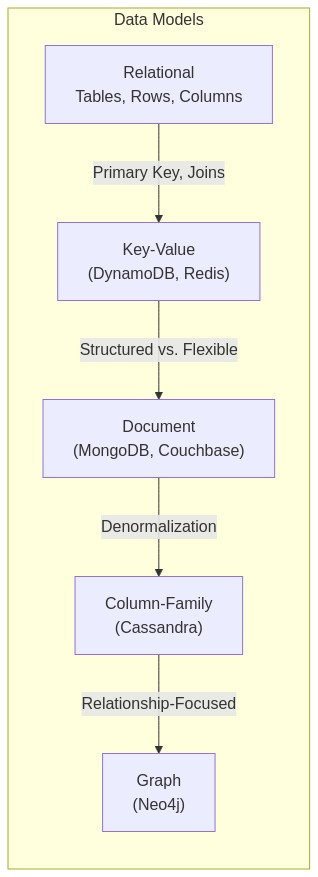


- **Beginner Analogy**:  
  - **Relational**: Filing cabinets with labeled folders.  
  - **Key-Value**: A dictionary or phone book with quick lookups.  
  - **Document**: A folder of self-contained articles (each article can have unique structure).  
  - **Column-Family**: A matrix, but each row can have different columns.  
  - **Graph**: A network of interconnected dots.

---

#### 3. **ACID vs BASE Properties**

- **ACID** (Atomicity, Consistency, Isolation, Durability): Ensures strict transaction guarantees.   
- **BASE** (Basically Available, Soft-state, Eventually consistent): Prioritizes availability and partition tolerance over strict consistency.

**Implications**:
- **ACID**: Bank transfers in Oracle.  
- **BASE**: Social media feed updates in Cassandra or DynamoDB.

---

#### 4. **Relational Database Recap** (Focus on Oracle)

- **Normalization**: Minimizing data redundancy.  
- **Relationships**: Primary key/foreign key constraints.  
- **Schema-on-write**: You must define the schema before inserting data.  
- **Oracle specifics**: PL/SQL, advanced partitioning, strong transaction consistency.

---

#### 5. **Key-Value Stores** (Example: DynamoDB, Redis)

- **Structure**: Data stored as a simple pair (key, value).  
- **Strengths**: Very fast lookups, easy to scale horizontally.  
- **Limitations**: Less suited for complex queries requiring joins.  

---

#### 6. **Document Databases** (Example: MongoDB, Couchbase)

- **Flexible JSON/BSON** structure.  
- **Strengths**: Rapid development, easy to store complex nested data.  
- **Limitations**: Data duplication (denormalization) often needed.  

---

#### 7. **Column-Family Stores** (Example: Cassandra, HBase)

- **Wide-column approach**: Each row can have thousands of columns grouped into “families.”  
- **Strengths**: Excellent write scalability, fault tolerance, distributed by design.  
- **Limitations**: Can be complex to design for certain query patterns.  

---

#### 8. **Graph Databases** (Example: Neo4j)

- **Focus**: Relationships are first-class citizens (edges).  
- **Strengths**: Superb for **social networks, recommendation systems**.  
- **Limitations**: Niche use cases, specialized query languages (Cypher).  

---

#### 9. **Schema Approaches** (Schema-on-Write vs. Schema-on-Read)

| Approach                  | Description                                              | Examples          |
|---------------------------|----------------------------------------------------------|-------------------|
| **Schema-on-Write**       | Data must conform to a predefined schema before storage | Oracle, MySQL     |
| **Schema-on-Read**        | Data stored flexibly, structure imposed during queries  | MongoDB, DynamoDB |

- **Evolution Strategies**:  
  - Use versioned schema for NoSQL to manage incremental changes.  
  - For relational, changes require **ALTER TABLE** or migrations.

---

#### 10. **Query Capabilities Comparison**

| Database Type | Query Language/Interface                      |
|---------------|-----------------------------------------------|
| Oracle (SQL)  | SQL, PL/SQL for stored procedures             |
| Cassandra     | CQL (similar to SQL, but with keyspace focus) |
| DynamoDB      | Proprietary API + PartiQL (a SQL-like syntax) |
| MongoDB       | Mongo Shell Queries or MongoDB Query API      |
| Neo4j         | Cypher Query Language                         |

- **Performance**:  
  - SQL joins can become expensive as datasets grow, but are very powerful.  
  - NoSQL queries often rely on denormalized data for speed.

---

### 🔄 **Data Modeling Across Paradigms**

- **Transforming a Relational Model into NoSQL**:  
  1. Identify the **entity-relationship** in Oracle.  
  2. Determine which access patterns are critical for performance.  
  3. **Denormalize** data for NoSQL solutions to reduce join-like operations.  


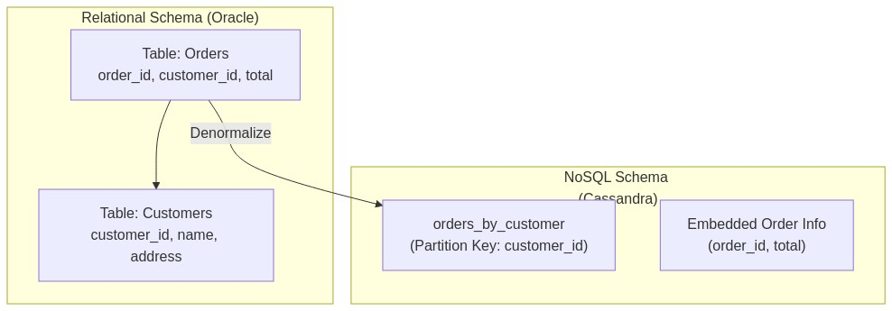


- **Trade-Offs**  
  - Denormalization speeds up reads but can complicate updates.  
  - Strict relationships become more **manual** in NoSQL.

---

### 🔍 **Query Approaches Comparison**

- **SQL Example** (Oracle):
  ```python
  import oracledb

  # Connect to Oracle
  with oracledb.connect(
      user="admin", 
      password="secret", 
      dsn="localhost:1521/ORCLPDB"
  ) as conn:
      with conn.cursor() as cursor:
          cursor.execute("SELECT * FROM orders WHERE order_id = :id", {"id": 1001})
          for row in cursor:
              print(row)
  ```

- **CQL Example** (Cassandra):
  ```python
  from cassandra.cluster import Cluster

  cluster = Cluster(['127.0.0.1'])
  session = cluster.connect("my_keyspace")

  rows = session.execute("SELECT * FROM orders_by_customer WHERE customer_id = %s", [123])
  for row in rows:
      print(row)
  ```

- **Performance Considerations**: 
  - SQL join-based queries vs. NoSQL’s denormalized approach.  
  - Indexing strategies differ significantly (secondary indexes in Cassandra vs. B-tree indexes in Oracle).

---

### 🔨 **Day 9 Hands-On Exercises**

Provide exercises at all three tiers:

1. **🔍 Beginner**  
   1. Identify which type of database is best for a **user profile** that can have varying fields (e.g., hobbies, preferences).  
   2. Write a **simple SELECT** statement in Oracle.  
   3. Write a **simple GET** operation in DynamoDB or Cassandra.

2. **🧩 Intermediate**  
   1. Convert a small relational schema (Customers, Orders) into a **document model** for MongoDB.  
   2. Demonstrate **denormalizing** a table for Cassandra.  
   3. Compare queries in Oracle and MongoDB for the same dataset.

3. **💡 Advanced/SRE**  
   1. Evaluate **read/write throughput** requirements for a retail application to decide whether to use Oracle or Cassandra.  
   2. Construct a small Python script that inserts sample data into Oracle and then **copies** that data to MongoDB.  
   3. Tune consistency levels in Cassandra (LOCAL_QUORUM, EACH_QUORUM) and observe the trade-offs.

---

### 🚧 **Day 9 Troubleshooting Scenarios**

1. **Scenario 1**: A microservice tries to perform a “join-like” query in DynamoDB but times out.  
   - **Symptoms**: Slow response, eventually leading to request timeouts.  
   - **Diagnostic**: Check the access pattern. Realize you’re effectively trying to do a join across two tables in a key-value store.  
   - **Resolution**: Redesign the data model to store the needed data in a single item or use a secondary index.  

2. **Scenario 2**: Oracle concurrency error when too many transactions update the same row.  
   - **Symptoms**: Deadlocks or “snapshot too old” errors.  
   - **Diagnostic**: Check **ACID transaction** loads and row-level locking.  
   - **Resolution**: Reduce contention, consider queue-based updates or segment data to reduce lock collisions.  

3. **Scenario 3**: Inconsistent reads across Cassandra clusters.  
   - **Symptoms**: Some reads return updated data, while others return stale data.  
   - **Diagnostic**: Eventual consistency requires time to propagate writes across nodes.  
   - **Resolution**: Adjust **consistency level** (e.g., QUORUM) or handle stale reads in the application logic.

*(Visual troubleshooting workflow diagram)*  


---

### ❓ **Day 9 Frequently Asked Questions**

**🔍 Beginner**  
1. *Why is NoSQL sometimes faster than SQL?*  
   - Because NoSQL often uses **denormalized data** and simpler query paths, reducing the need for multi-table joins.  

2. *Can NoSQL handle transactions at all?*  
   - Many do, though typically they handle them differently (e.g., MongoDB multi-document transactions, Cassandra lightweight transactions).  

3. *What does “schema-on-read” mean?*  
   - Data can be stored **without a strict schema** and the structure is determined when **querying**.

**🧩 Intermediate**  
1. *Can we run complex analytics on NoSQL?*  
   - It’s possible but can be more challenging. Often, you move data into analytics platforms or use specialized engines.  
2. *How do we handle foreign key constraints in NoSQL?*  
   - Usually, we handle them **in application code**, since NoSQL solutions often don’t enforce referential integrity.  
3. *When do we choose a key-value store over a document store?*  
   - Key-value is perfect for **simple lookups** without the need for complex queries. Document stores offer more flexible querying.

**💡 Advanced/SRE**  
1. *How do we ensure high availability in a distributed NoSQL database?*  
   - Configure **replication** across multiple nodes or data centers, set the appropriate **consistency level**, and monitor node health.  
2. *Is it ever necessary to “shard” Oracle?*  
   - Oracle supports **partitioning** and **sharding** solutions. Large-scale setups may distribute data across multiple Oracle instances.  
3. *How do we unify logging and monitoring for multi-database environments?*  
   - Centralize logs using a platform like **ELK (Elasticsearch, Logstash, Kibana)** or **Prometheus/Grafana** and ensure each database’s metrics are collected consistently.

---

### 🧠 **Day 9 Key Takeaways**
1. **Relational vs. NoSQL**: Different paradigms, each with unique strengths.  
2. **ACID vs. BASE**: Understand the trade-offs between strict consistency and high availability.  
3. **Data Modeling**: Requires different approaches; NoSQL often relies on denormalization.  
4. **Query Language**: SQL is universal for RDBMS; NoSQL queries can vary widely.  
5. **SRE Perspective**: Evaluate operational complexity, consistency needs, and scaling requirements.  

---

## **Day 10: Practical Comparisons and Use Cases**

### 📌 **Introduction to Day 10**

1. **Welcome Back**  
   - Yesterday, you explored fundamental differences between SQL and NoSQL. Today, we dive into **practical comparisons**, real-world **operational considerations**, and **SRE-level** best practices.

2. **Why Real-World Application is Critical**  
   - Many enterprise systems use a **polyglot persistence** approach—selecting **the right database for the right job**. Understanding the operational nuances (monitoring, scaling, backup, etc.) is crucial for support roles and SRE.

3. **Scenario**  
   - Consider a **multi-database** environment:  
     - Oracle to handle financial transactions.  
     - Cassandra for social engagement data.  
     - Kafka for streaming logs and real-time analytics.  

4. **Visual Concept Map**  
   

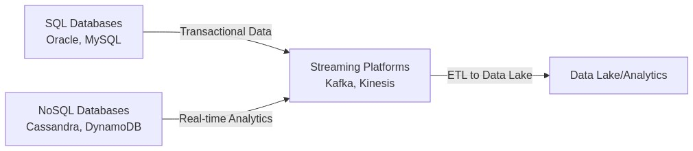


---

### 🎯 **Day 10 Learning Objectives by Tier**

| Tier            | Objectives                                                                                                                                                                       |
|-----------------|----------------------------------------------------------------------------------------------------------------------------------------------------------------------------------|
| 🔍 **Beginner** | 1. Understand core comparisons (Oracle vs. Cassandra/DynamoDB). <br/> 2. Recognize different scaling strategies (vertical vs. horizontal). <br/> 3. Learn basic monitoring metrics. <br/> 4. Distinguish backup methods across SQL and NoSQL. |
| 🧩 **Intermediate** | 1. Explain how Kafka fits into a broader database architecture. <br/> 2. Design a basic high availability setup for Oracle and Cassandra. <br/> 3. Apply a decision framework for selecting a database. <br/> 4. Implement migration steps from Oracle to NoSQL. |
| 💡 **Advanced/SRE** | 1. Compare performance profiles across Oracle, Cassandra, DynamoDB, Kafka. <br/> 2. Architect polyglot persistence with a detailed data flow. <br/> 3. Automate monitoring and alerting across multiple DB systems. <br/> 4. Manage multi-database incident response at scale. |

---

### 📚 **Day 10 Core Concepts**

#### 1. **Detailed Database Comparison: Oracle vs. Cassandra**

| Aspect                     | Oracle (Relational)                                   | Cassandra (NoSQL)                                              |
|----------------------------|-------------------------------------------------------|-----------------------------------------------------------------|
| Data Model                 | Strictly relational, tables & rows                   | Column-family, wide-column approach                             |
| Consistency Model          | ACID transactions                                    | Tunable eventual consistency                                    |
| Scaling                    | Vertical + optional sharding                          | Horizontal by default                                           |
| Typical Use Case           | Enterprise transactions, complex queries, analytics  | High-availability, write-heavy workloads, global distribution   |
| Operational Complexity     | Strong vendor ecosystem, specialized administration  | Requires knowledge of distributed systems & consistency tuning  |

---

#### 2. **Detailed Database Comparison: Oracle vs. DynamoDB**

| Aspect             | Oracle RDBMS                     | DynamoDB (Key-Value)                            |
|--------------------|----------------------------------|-------------------------------------------------|
| Scaling            | Vertical + partitioning/sharding | Fully managed horizontal scaling                |
| Consistency        | ACID, strong reads               | Eventual or strong reads (configurable)         |
| Cost Model         | License + infrastructure costs    | Pay-per-use (read/write capacity units)         |
| Performance        | Excellent for complex queries    | Optimized for high-speed key-based lookups      |
| Ideal Use Case     | Financial apps, OLTP, analytics  | Web-scale apps needing flexible throughput      |

---

#### 3. **Kafka and Streaming Platforms**

- **Why Kafka?**: Event-driven architectures, real-time data ingestion.  
- **Event Sourcing**: Instead of updating a DB in real time, events are stored in Kafka for asynchronous processing.  
- **Comparison**: Kafka isn’t a database but complements databases by decoupling producers and consumers.

---

#### 4. **Performance Characteristics**

- **Read/Write Optimization**:  
  - **Oracle**: Balanced read/write but typically slower writes than Cassandra for extremely large workloads.  
  - **Cassandra**: Highly optimized for writes, also good for large-scale read distribution.  

- **Latency vs. Throughput**:  
  - Oracle focuses on guaranteeing consistency, sometimes adding latency.  
  - Cassandra thrives on throughput across a distributed cluster.

---

#### 5. **Scaling Approaches**

- **Vertical Scaling**: Add CPU, RAM to a single machine.  
- **Horizontal Scaling**: Add more machines; distribute data.  
- **Sharding**: Splitting data across multiple nodes or shards (can be done in both SQL and NoSQL).  


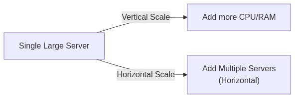


---

#### 6. **High Availability Configurations**

- **Oracle**: Data Guard, RAC (Real Application Clusters), backups for failover.  
- **Cassandra**: Replication Factor, multi-datacenter replication, no single point of failure.

---

#### 7. **Backup and Recovery Strategies**

- **Oracle**: RMAN (Recovery Manager), data pump exports, incremental backups.  
- **Cassandra**: Snapshot-based, incremental backups, commit log archiving.  
- **Multi-Database**: Important to **synchronize backup schedules** so data is consistent across systems.

---

#### 8. **Monitoring and Observability**

- **Metrics to Track**:  
  - Oracle: **Tablespace usage, AWR reports, session waits**  
  - Cassandra: **Compactions, read/write latency, node gossip status**  

- **Alerting**:  
  - Use tools like **Prometheus** + **Grafana** or enterprise solutions (e.g., Oracle Enterprise Manager).  


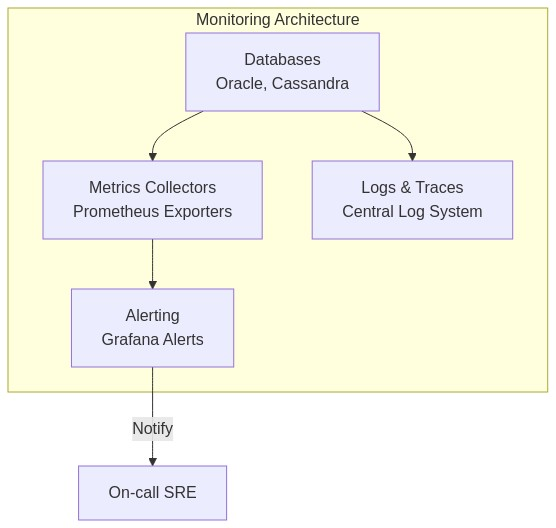


---

#### 9. **Database Selection Criteria Framework**

- **Workload Requirements**: OLTP vs. OLAP, read-heavy vs. write-heavy, strict consistency vs. eventual.  
- **Data Model Fit**: Relational vs. key-value vs. document, etc.  
- **Scalability and Availability Needs**  
- **Operational Complexity**: Team expertise, tooling, licensing.  
- **Cost and ROI**  


---

#### 10. **Polyglot Persistence and Hybrid Architectures**

- **Definition**: Using multiple database types for different subsystems of the same application.  
- **Implementation**:  
  - Oracle for transactions  
  - Cassandra for real-time analytics  
  - MongoDB for storing user profiles  
- **Pitfalls**: Data duplication, synchronization overhead, more complex operational overhead.


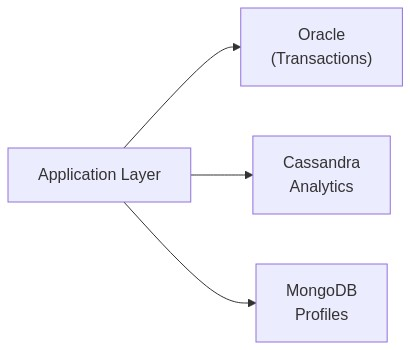


---

### 🛠️ **Operational Management Comparison**

| Category             | Oracle                                                 | Cassandra                                                    |
|----------------------|--------------------------------------------------------|--------------------------------------------------------------|
| Monitoring Tools     | Oracle Enterprise Manager, third-party APMs           | Cassandra Metrics (JMX), Prometheus exporters                |
| Backup Approaches    | RMAN, Data Pump                                       | Snapshots, sstable backups, incremental commit logs          |
| High Availability    | Data Guard, RAC                                       | Replication Factor, multi-DC replication, auto failover       |
| Performance Tuning   | Query plans, indexes, partitioning                    | Tunable consistency, compaction strategies, read/write paths |
| Alerting/Logging     | Built-in alert system, integrated with OEM            | Cassandra logs, custom watchers, Prometheus/Grafana          |

---

### 🔍 **Database Selection and Migration**

1. **Selection Methodology**:  
   - Start with **requirements**: transactions, performance, cost, team skills.  
   - Evaluate on a scale from 1–10.  
   - Summarize with a **decision matrix**.

2. **Migration Approaches**:  
   - **Offline Bulk**: Extract data from Oracle → transform → load into NoSQL.  
   - **Live Migration**: Use change data capture (CDC) or streaming (e.g., Kafka) to replicate in real time.

3. **Common Pitfalls**:  
   - Underestimating data modeling effort in NoSQL.  
   - Not planning for fallback if NoSQL queries become too complex.

---

### 🧰 **Multi-Database Architecture Patterns**

- **Microservices** each choose the best data store for their domain.  
- **Data Lake** approach for analytics; operational data remains in Oracle/Cassandra.  
- **Event-Driven** with Kafka bridging different DB systems.


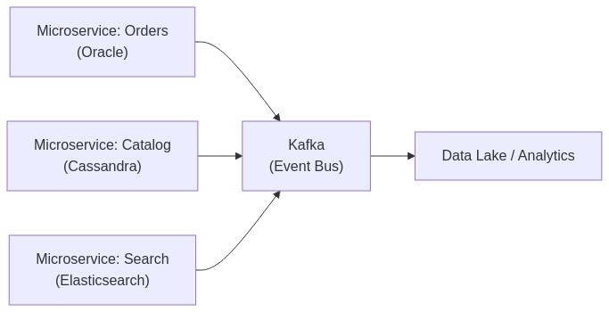


---

### 🔨 **Day 10 Hands-On Exercises**

1. **🔍 Beginner**  
   1. Configure **monitoring** for a small Oracle instance (e.g., using built-in performance views).  
   2. Compare **backup** processes (Oracle RMAN vs. Cassandra snapshots).  
   3. Practice a basic **scaling exercise** in a local Cassandra cluster (add a node and watch data redistribute).

2. **🧩 Intermediate**  
   1. **Design** a high availability setup: Oracle Data Guard or Cassandra multi-node replication.  
   2. Implement a **migration** from a small Oracle table to DynamoDB using Python.  
   3. Set up **basic Kafka** integration to capture changes from a Cassandra table.

3. **💡 Advanced/SRE**  
   1. **Benchmark** read vs. write performance in Oracle vs. Cassandra using a performance testing tool (e.g., JMeter or custom Python scripts).  
   2. Automate a **multi-database incident response** plan (script that detects node failure in Cassandra and triggers Oracle failover if needed).  
   3. Create an **end-to-end monitoring dashboard** in Grafana showing metrics from Oracle, Cassandra, and Kafka.

---

### 🚧 **Day 10 Troubleshooting Scenarios**

1. **Scenario 1**: A data ingestion pipeline (Kafka → Cassandra) fails intermittently due to **high write throughput**.  
   - **Symptoms**: Dropped messages, high latency.  
   - **Diagnostic**: Check Cassandra’s logs for write timeouts, monitor compactions.  
   - **Resolution**: Increase cluster size, tune write consistency level, optimize compaction.

2. **Scenario 2**: An Oracle standby database (Data Guard) is not in sync.  
   - **Symptoms**: Lag behind primary, potential data loss if primary fails.  
   - **Diagnostic**: Investigate network latency or redo transport errors.  
   - **Resolution**: Reconfigure Data Guard for synchronous mode (if feasible) or tune network settings.

3. **Scenario 3**: A multi-database transaction fails partway—Oracle commits, but Cassandra does not.  
   - **Symptoms**: Inconsistent data across systems.  
   - **Diagnostic**: The distributed transaction had no standard 2PC (two-phase commit) bridging Oracle and Cassandra.  
   - **Resolution**: Implement **saga pattern** or other distributed transaction compensations.

*(Visual troubleshooting workflow)*  


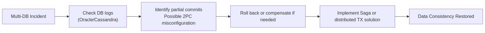


---

### ❓ **Day 10 Frequently Asked Questions**

**🔍 Beginner**  
1. *Do I need to learn a new query language for NoSQL?*  
   - Often yes. DynamoDB has a proprietary API or PartiQL, Cassandra uses CQL, etc.  
2. *How do I monitor a Cassandra cluster with basic tools?*  
   - Use built-in `nodetool` commands, plus external exporters like Prometheus.  
3. *Is Oracle still relevant in a NoSQL world?*  
   - Absolutely. Oracle remains crucial for **mission-critical** transactional systems.

**🧩 Intermediate**  
1. *Can Kafka store data indefinitely like a database?*  
   - Kafka can **persist data** for a configurable retention, but it’s not intended as a primary store.  
2. *How do I handle Oracle licensing when scaling?*  
   - Oracle typically charges per CPU or per named user. Plan carefully for cost vs. performance.  
3. *What’s the recommended node size for a Cassandra cluster?*  
   - Smaller, commodity nodes are typical; start with a 3–5 node cluster and scale out as needed.

**💡 Advanced/SRE**  
1. *How do we handle global distribution for Oracle?*  
   - Use Data Guard or GoldenGate for replication across regions. Latency can be a limiting factor.  
2. *How do I unify a backup strategy for multiple databases?*  
   - Orchestrate with automation tools (e.g., Ansible), ensuring each DB’s backup occurs in a coordinated window.  
3. *Should we use 2PC across Oracle and Cassandra?*  
   - Traditional 2PC doesn’t scale well in distributed NoSQL. You’d consider **saga patterns** or eventual consistency designs.

---

### 🔥 **Comprehensive SRE-Specific Scenario (Days 9-10)**

**Situation**: A global e-commerce platform uses:
- **Oracle** for order management (transactions).  
- **Cassandra** for product catalogs and user sessions.  
- **Kafka** for streaming user click events to a real-time analytics pipeline.

**Incident**: During a large promotional event, the system experiences:  
- Delayed order confirmations (Oracle side).  
- Partially updated product catalog (Cassandra side).  
- Gaps in the analytics dashboards (Kafka backlog).

#### Monitoring Metrics
- **Oracle**: High active sessions, potential row lock contention, increased wait times.  
- **Cassandra**: Write timeouts, node gossip issues.  
- **Kafka**: Growing backlog, consumer lag.

#### Troubleshooting Steps
1. **Oracle**: Check AWR report or queries causing locks. Possibly split large transactions or increase CPU resources.  
2. **Cassandra**: Add nodes to handle extra write throughput; verify replication settings.  
3. **Kafka**: Scale consumer groups or use partition rebalancing.

#### Resolution
- System rebalanced through horizontal scale of Cassandra, concurrency tuning in Oracle, and Kafka consumer scaling.  
- Full service restored with minimal user impact.

**SRE Takeaway**: Prepare for multi-database surges with a robust capacity plan and real-time alerts across all systems.

---

### 🧠 **Day 10 Key Takeaways**
1. **Real-World Database Comparisons**: Oracle excels at transactions and consistency; Cassandra and DynamoDB excel at massive scale and flexible schemas.  
2. **Operational Management**: Backup, recovery, and monitoring differ widely among SQL vs. NoSQL.  
3. **Selecting the Right Tool**: Use a structured approach (decision trees, frameworks).  
4. **Polyglot Persistence**: Combining multiple DB types can be powerful but demands robust SRE practices.  
5. **Multi-Database Troubleshooting**: Understanding each system’s architecture is essential for swift resolution.

---

### 🎓 **Training Series Conclusion**

Congratulations on completing the **10-day database training** journey! You’ve progressed from:
- **Days 1–8**: Relational fundamentals, SQL operations, joins, performance tuning.  
- **Days 9–10**: Comparison with NoSQL paradigms, SRE perspectives on multi-database environments.

**Future Directions**:
- Deepen your knowledge of **distributed systems**.  
- Explore advanced Oracle features (RAC, GoldenGate).  
- Investigate streaming architectures (Kafka, Kinesis).  
- Master multi-database orchestration with automation tools.

---

### 🚨 **Career Protection Guide for Multi-Database Environments**

1. **High-Risk Operations**:  
   - Cross-database schema changes, large data migrations, changes to consistency levels.  
2. **Testing Strategies**:  
   - Always test in a **staging environment** with production-like loads.  
3. **Communication**:  
   - Keep stakeholders informed about potential downtime or data format changes.  
4. **Documentation**:  
   - Document each database’s configuration, backup plan, and known pitfalls.  
5. **Change Management**:  
   - Approvals for major database changes, version upgrades, or cluster expansions.

---

## **Enhanced Visualizations, Decision Trees, Comparison Tables, and Python Code**

Below are additional highlights requested to solidify your understanding:

1. **SQL vs NoSQL Comparison Visualization**  
   

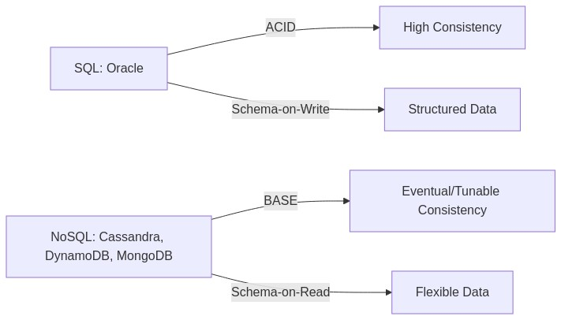


2. **Database Selection Decision Tree**  
   

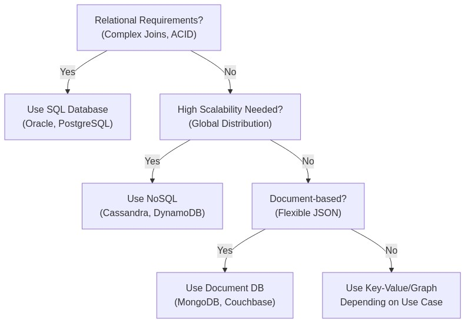


3. **Detailed Database-Specific Comparison Tables**  
   *(Included throughout Day 9 & Day 10 sections.)*

4. **Python Code Examples**  
   - **Oracle** (connecting and querying), **Cassandra** (CQL queries), **DynamoDB** (boto3), **MongoDB** (pymongo), each shown in the Day 9/10 content.

5. **Real-World Use Case Illustrations**  
   - **E-commerce** with Oracle (orders) + Cassandra (catalog).  
   - **IoT pipeline** with Kafka ingest, Cassandra for time-series data, and Oracle for secure transactions.

---

## **Final Invocations Statement**

You have now completed the **Day 9–10** module on **SQL vs NoSQL Database Comparison**. By understanding both relational and NoSQL paradigms, mastering the fundamentals of ACID vs BASE, exploring distributed consistency models, and practicing multi-database operational tasks, you are better equipped to support modern, **polyglot** application environments as both a **support engineer** and an **SRE**.

**Observe** how each system behaves in different scenarios, **test** assumptions and deployment changes in safe environments, **evaluate** performance and reliability trade-offs, and **evolve** your architecture and operational strategies to keep pace with changing business demands.

---

**References:**  
- Training Materials, Days 1–8 (Relational DB, Oronal directives from: citeturn0file0  

**End of Days 9–10 Module**