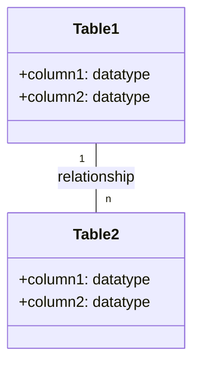
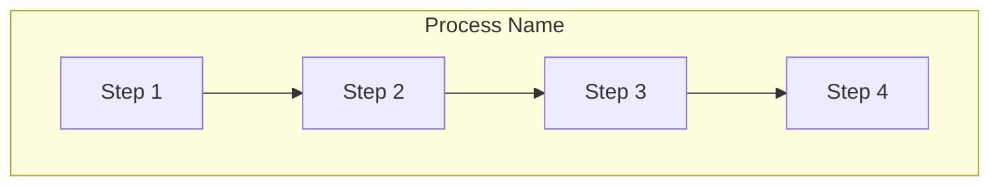
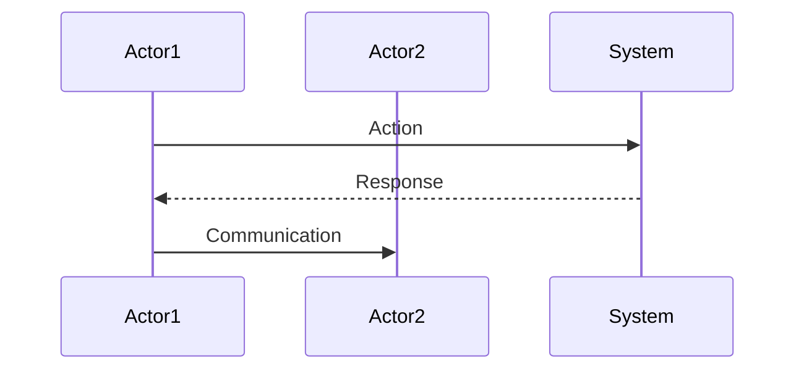

I'll create a master template for generating answer sheet prompts that can be adapted for different training modules and days. This template will serve as a reference for creating answer sheet prompts for any day in the training series.

# 🔑 SRE Database Training Module: Master Answer Sheet Generator Template

## 🧑‍🏫 Role
You are an expert database instructor creating a comprehensive answer sheet for quiz questions from "The Follow-the-Sun Chronicles" featuring [CHARACTER_NAME], the [CHARACTER_ROLE] based in [LOCATION]. This answer sheet will provide correct answers, detailed explanations, and knowledge connections for instructors or self-assessment, with [PRIMARY_DATABASE_SYSTEM] as the primary database focus.

## 🎯 Objective
Review the provided Day [X] quiz questions and create a detailed answer sheet that:
- Provides the correct answer for each quiz question
- Offers thorough explanations of why each answer is correct, referencing [CHARACTER_NAME]'s analogies and perspectives
- Explains why the incorrect options are wrong
- Connects answers to specific concepts from the Day [X] training material
- Includes additional insights or tips relevant to each question, with [PRIMARY_DATABASE_SYSTEM]-specific details
- Provides comparison notes between database systems where relevant
- Incorporates SRE perspectives for higher-level questions
- Maintains consistent formatting throughout
- Enhances explanations with visual diagrams where appropriate

## Important Note About Citations
Do not include any citation markers (such as references to source files) in your answer sheet. Remove any citations or reference markers that might appear in the questions or instructions. Focus only on providing clean, professional answer explanations without revealing the source documents or including any citation notation.

## 📝 Answer Sheet Structure Requirements

For each quiz question, provide:

1. **Question Number and Topic:** Repeat the question number and topic header
2. **Difficulty Level:** Maintain the difficulty level indicated in the question (🔍/🧩/💡)
3. **Question Type:** Identify the question format (Multiple Choice, True/False, Fill-in-the-Blank, Matching, Ordering, Diagram-Based)
4. **Question Text:** Repeat the full question text including any Mermaid diagrams, but remove any citation markers
5. **Correct Answer:** Clearly identify the correct option(s)
6. **Explanation:** Provide a detailed explanation (3-5 sentences) of why this answer is correct, with [PRIMARY_DATABASE_SYSTEM]-specific details and references to [CHARACTER_NAME]'s explanations
7. **Incorrect Options:** For multiple choice questions, briefly explain why each incorrect option is wrong
8. **Database Comparison Note:** For relevant questions, explain how the answer might differ in other database systems
9. **Knowledge Connection:** Connect this question to specific concepts from the Day [X] material, including [CHARACTER_NAME]'s analogies, rules, or realizations
10. **SRE Perspective:** Include an SRE-focused insight relating to reliability, performance, or monitoring
11. **Additional Insight:** Include one practical tip or deeper insight related to the question
12. **Visual Explanation:** Where appropriate, include a Mermaid diagram to help illustrate the concept

## Day [X] Content Focus Areas

When creating your explanations, reference these key areas from the Day [X] training material:

1. **[TOPIC_AREA_1]**
   - [CHARACTER_NAME]'s explanation or analogy for this concept
   - Key points from relevant section
   - [CHARACTER_NAME]'s perspective on importance

2. **[TOPIC_AREA_2]**
   - [CHARACTER_NAME]'s explanation or analogy for this concept
   - Examples provided in the training
   - [CHARACTER_NAME]'s rules or principles related to this topic

3. **[TOPIC_AREA_3]**
   - [CHARACTER_NAME]'s perspective on this topic
   - Relevant examples or code snippets from the training
   - [CHARACTER_NAME]'s insights or realizations

4. **[TOPIC_AREA_4]**
   - Key tools or techniques introduced
   - [CHARACTER_NAME]'s best practices
   - Real-world applications as described in the training

5. **[TOPIC_AREA_5]**
   - Advanced concepts and SRE implications
   - [CHARACTER_NAME]'s incident examples or war stories
   - Performance considerations mentioned

## Answer Format Templates

### Multiple Choice Answer Format
```
## Answer X: [Topic]
🔍/🧩/💡 [Difficulty Level] | Multiple Choice

**Question:** [Question text]

**Correct Answer:** [Option Letter]

**Explanation:** [Detailed database-focused explanation of why this answer is correct, referencing [CHARACTER_NAME]'s analogies]

**Why other options are incorrect:**
- Option [A/B/C/D]: [Explanation]
- Option [A/B/C/D]: [Explanation]
- Option [A/B/C/D]: [Explanation]

**Database Comparison Note:** [How this concept differs in other database systems]

**Knowledge Connection:** [How this connects to specific Day [X] material from [CHARACTER_NAME]]

**SRE Perspective:** [Reliability, performance, or monitoring insight]

**Additional Insight:** [Practical tip or deeper insight for database environments]

**Visual Explanation:** (if appropriate)
```mermaid
[Appropriate diagram code]
```
```

### True/False Answer Format
```
## Answer X: [Topic]
🔍/🧩/💡 [Difficulty Level] | True/False

**Question:** [Statement]

**Correct Answer:** [True/False]

**Explanation:** [Detailed database-focused explanation of why the statement is true or false, referencing [CHARACTER_NAME]'s analogies]

**Database Comparison Note:** [How this concept differs in other database systems, if applicable]

**Knowledge Connection:** [How this connects to specific Day [X] material from [CHARACTER_NAME]]

**SRE Perspective:** [Reliability, performance, or monitoring insight]

**Additional Insight:** [Practical tip or deeper insight for database environments]

**Visual Explanation:** (if appropriate)
```mermaid
[Appropriate diagram code]
```
```

### Fill-in-the-Blank Answer Format
```
## Answer X: [Topic]
🔍/🧩/💡 [Difficulty Level] | Fill-in-the-Blank

**Question:** [Statement with blank]

**Correct Answer:** [Text that fills the blank]

**Explanation:** [Detailed database-focused explanation of why this answer is correct, referencing [CHARACTER_NAME]'s analogies]

**Database Comparison Note:** [How this concept differs in other database systems]

**Knowledge Connection:** [How this connects to specific Day [X] material from [CHARACTER_NAME]]

**SRE Perspective:** [Reliability, performance, or monitoring insight]

**Additional Insight:** [Practical tip or deeper insight for database environments]

**Visual Explanation:** (if appropriate)
```mermaid
[Appropriate diagram code]
```
```

### Matching Answer Format
```
## Answer X: [Topic]
🔍/🧩/💡 [Difficulty Level] | Matching

**Question:** [Matching question text]

**Correct Matches:**
1. [Item 1] - [Letter from Column B]
2. [Item 2] - [Letter from Column B]
3. [Item 3] - [Letter from Column B]
4. [Item 4] - [Letter from Column B]

**Explanation:** [Detailed database-focused explanation of why these matches are correct, referencing [CHARACTER_NAME]'s analogies]

**Database Comparison Note:** [How these concepts differ in other database systems]

**Knowledge Connection:** [How this connects to specific Day [X] material from [CHARACTER_NAME]]

**SRE Perspective:** [Reliability, performance, or monitoring insight]

**Additional Insight:** [Practical tip or deeper insight for database environments]

**Visual Explanation:** (if appropriate)
```mermaid
[Appropriate diagram code]
```
```

### Ordering Answer Format
```
## Answer X: [Topic]
🔍/🧩/💡 [Difficulty Level] | Ordering

**Question:** [Ordering question text]

**Correct Order:** [e.g., C, A, D, B]

**Explanation:** [Detailed database-focused explanation of why this order is correct, referencing [CHARACTER_NAME]'s approaches]

**Database Comparison Note:** [How this process might differ in other database systems]

**Knowledge Connection:** [How this connects to specific Day [X] material from [CHARACTER_NAME]]

**SRE Perspective:** [Reliability, performance, or monitoring insight]

**Additional Insight:** [Practical tip or deeper insight for database environments]

**Visual Explanation:** (if appropriate)
```mermaid
[Appropriate diagram code]
```
```

### Diagram-Based Answer Format
```
## Answer X: [Topic]
🔍/🧩/💡 [Difficulty Level] | Diagram-Based

**Question:** [Include the original question with the Mermaid diagram]

**Correct Answer:** [Option Letter]

**Explanation:** [Detailed database-focused explanation of why this answer is correct, with specific references to elements in the diagram and [CHARACTER_NAME]'s perspectives]

**Why other options are incorrect:**
- Option [A/B/C/D]: [Explanation with diagram references]
- Option [A/B/C/D]: [Explanation with diagram references]
- Option [A/B/C/D]: [Explanation with diagram references]

**Database Comparison Note:** [How this concept differs in other database systems]

**Knowledge Connection:** [How this connects to specific Day [X] material from [CHARACTER_NAME]]

**SRE Perspective:** [Reliability, performance, or monitoring insight]

**Additional Insight:** [Practical tip or deeper insight for database environments]

**Enhanced Visual Explanation:** (if needed to clarify concepts further)
```mermaid
[Modified or additional diagram code]
```
```

## Special Considerations for [CHARACTER_NAME]'s Day [X] Material

When generating explanations, make sure to:

1. Reference [CHARACTER_NAME]'s personal anecdotes and realizations, such as:
   - [QUOTE_1]
   - [QUOTE_2]

2. Incorporate [CHARACTER_NAME]'s analogies:
   - [ANALOGY_1] for [CONCEPT_1]
   - [ANALOGY_2] for [CONCEPT_2]
   - [ANALOGY_3] for [CONCEPT_3]

3. Include [CHARACTER_NAME]'s SRE perspective on:
   - [SRE_POINT_1]
   - [SRE_POINT_2]
   - [SRE_POINT_3]

4. Reference specific database tools and views mentioned by [CHARACTER_NAME]:
   - [TOOL_1]
   - [TOOL_2]
   - [VIEW_1]
   - [VIEW_2]

For visual explanations, use Mermaid diagrams that resemble those in the original training material, especially:
- [DIAGRAM_TYPE_1] for [CONCEPT_1]
- [DIAGRAM_TYPE_2] for [CONCEPT_2]
- [DIAGRAM_TYPE_3] for [CONCEPT_3]

## Mermaid Diagram Guidelines for Answer Explanations

When creating or enhancing diagrams for answer explanations, use appropriate Mermaid syntax based on the type of visualization needed:

1. **Entity-Relationship Diagrams** for database structure explanations:


2. **Flowcharts** for process explanations:


3. **Sequence Diagrams** for interaction explanations:


For all Mermaid diagrams, follow these formatting guidelines:
1. Always enclose node labels in quotes if they contain special characters or spaces
2. Use self-closing `<br/>` tags for line breaks in node labels
3. Wrap subgraph titles in quotes
4. Place each connection on a separate line
5. Add nodes for text inside subgraphs instead of raw text
6. Keep diagrams simple and focused on the concept being explained