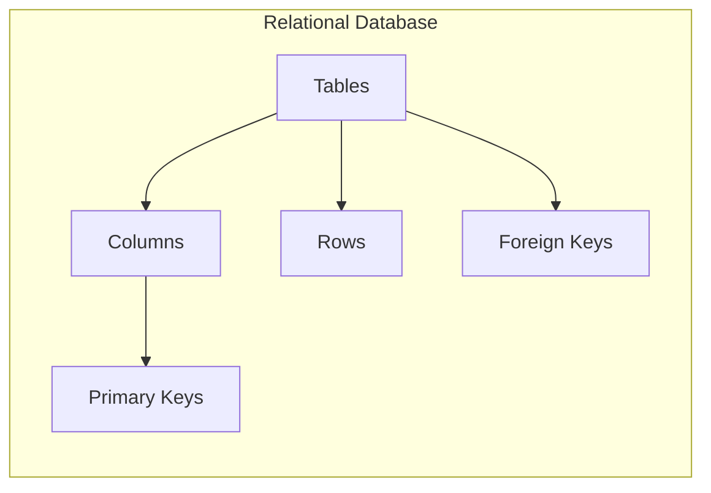
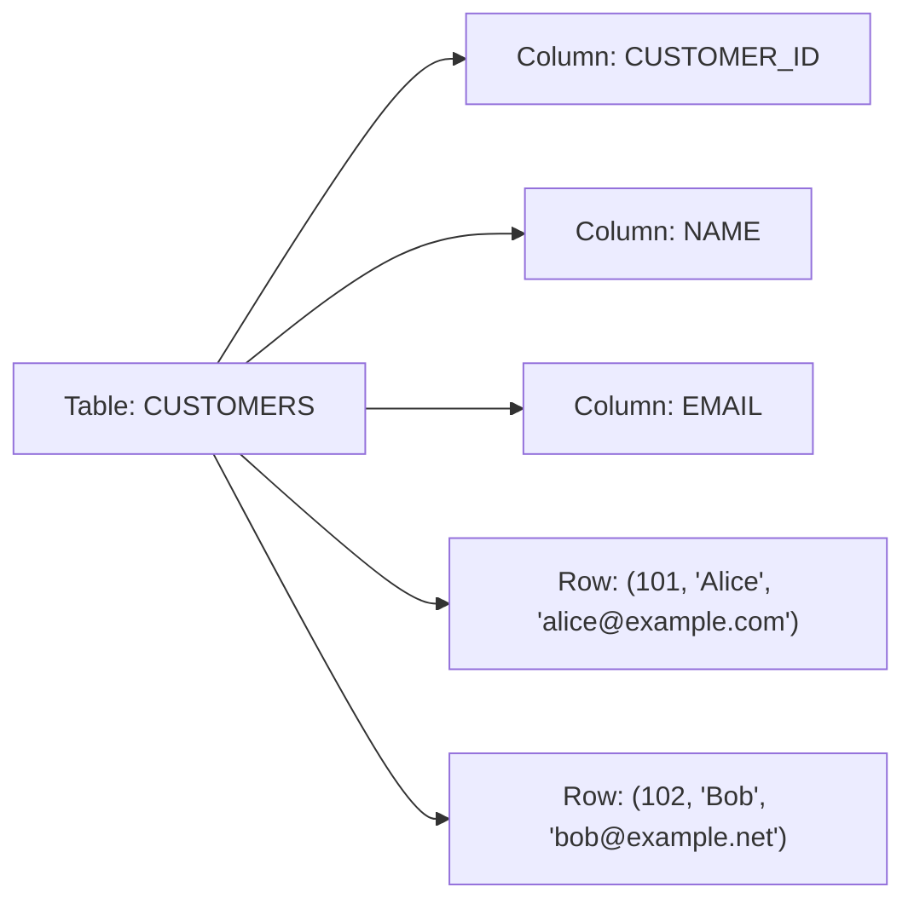
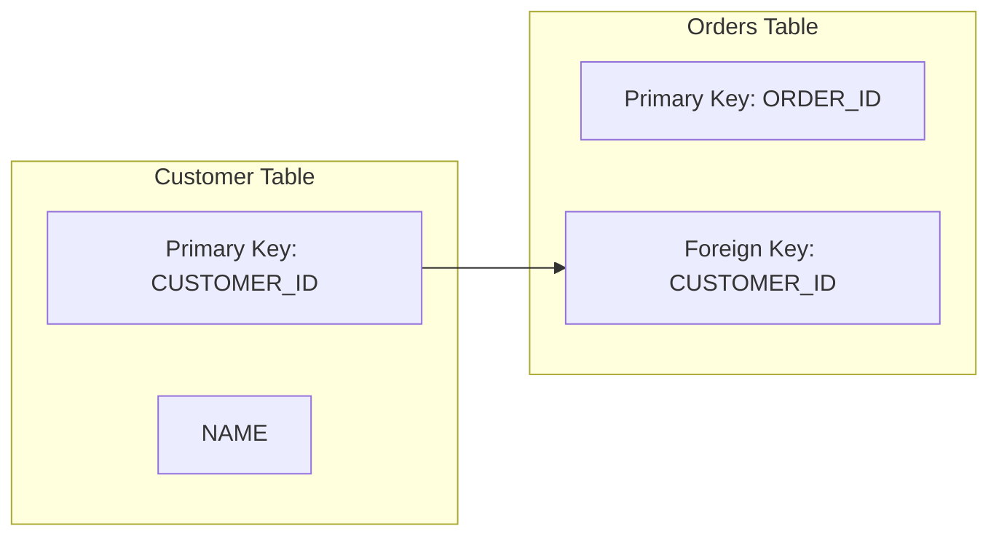
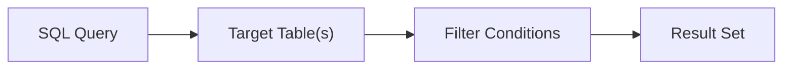
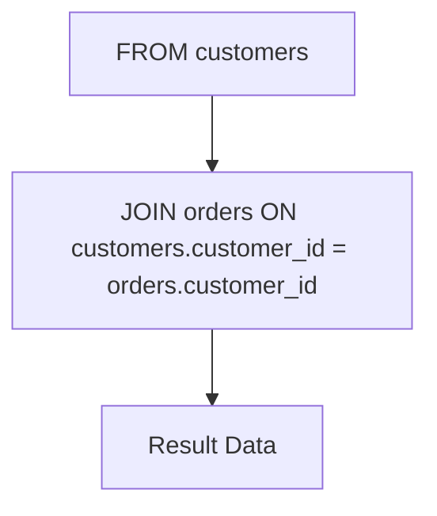
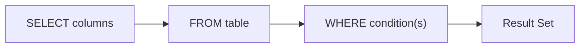
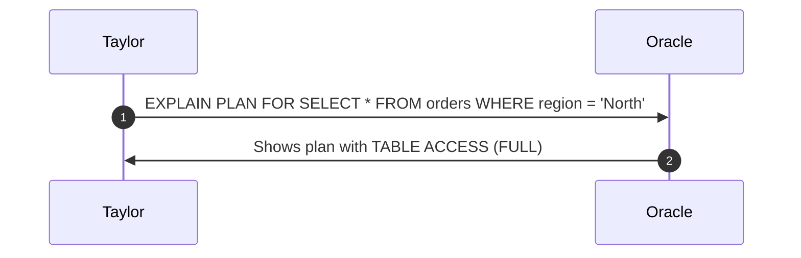
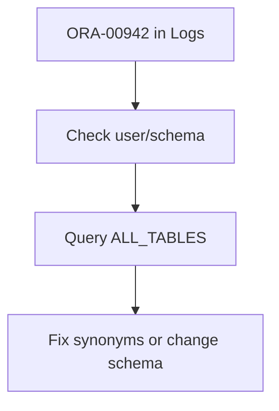
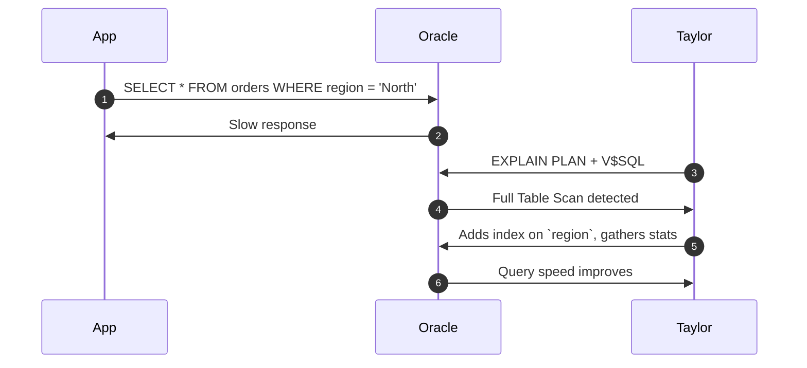

# 🌍 **Day 1 – Taylor vs. The Relational Beast**  
**Location:** USA (East Coast) | **Time:** 09:00 EST  
**Character:** Taylor – Rookie SRE just trying to query in peace

---

## 📌 Relational Databases 101: Why Taylor Now Dreams in Tables

Taylor logs in for her first shift. Ten minutes later, she’s already deep in error logs because someone ran a query on a missing table. Classic.  
Her mentor mutters:  
> “You can’t troubleshoot what you don’t understand. Learn the shape of the data first.”

And thus begins her crash course in relational databases.

---

### 📊 Visual Concept Map



---

## 🎯 Taylor’s Day 1 Learning Objectives

### 🔍 Beginner
- Identify tables, columns, and rows (a.k.a. the holy trinity of structured data).
- Explain what keys actually do without sounding like a riddle.
- Run basic `SELECT` queries in Oracle without crashing production.
- Connect to Oracle using tools that don’t suck.

### 🧩 Intermediate
- Compare Oracle, Postgres, and SQL Server syntax like a cross-dialect diplomat.
- Implement primary and foreign key constraints correctly (and fix them when someone else doesn’t).
- Use Oracle’s data dictionary to see what's *really* in the database.
- Troubleshoot errors without guessing.

### 💡 SRE-Level
- Monitor query performance using V$ views like `V$SQL` and `V$SESSION`.
- Understand execution plans and recognize when your database is crying.
- Simulate recovery scenarios (and recover from them).
- Think like an architect: plan for scale, reliability, and “oh no” moments.

---

## 🏗️ 4.1 Relational Database Structure

### Concept Overview  
A relational database stores data in **tables**, with **columns** defining data types and **rows** holding actual data. Taylor calls it “Excel with consequences.”

### Analogy  
Think of a spreadsheet:
- Each **tab** = a **table**
- Each **column header** = a **column**
- Each **row** = a record of data

### Visual: CUSTOMERS Table



### SQL Examples
```sql
CREATE TABLE customers (
  customer_id NUMBER,
  name VARCHAR2(50),
  email VARCHAR2(100)
);
```

---

## 🔑 4.2 Primary Keys and Foreign Keys

### Real-World Analogy  
- **Primary Key**: Like a passport number. Unique. Non-null. Your identity.  
- **Foreign Key**: Like referencing someone else's passport on a visa form.

### Visual: Customer → Orders Relationship



### SQL Examples
```sql
CREATE TABLE customers (
  customer_id NUMBER PRIMARY KEY,
  name VARCHAR2(50)
);

CREATE TABLE orders (
  order_id NUMBER PRIMARY KEY,
  customer_id NUMBER REFERENCES customers(customer_id)
);
```

---

## 📦 4.3 SELECT, FROM, WHERE – The Querying Trifecta

### Visual: Query Execution Flow



### Query
```sql
SELECT name FROM customers WHERE customer_id = 5;
```

Taylor’s Lesson: **Never trust a query with `*` in production.**

---

## 🔎 4.4 FROM and Joins



### Multi-table Query
```sql
SELECT c.name, o.order_date
FROM customers c
JOIN orders o ON c.customer_id = o.customer_id;
```

Taylor’s Note: If your joins don’t work, your life won’t either.

---

## 🎯 4.5 WHERE Clause Filtering



### Example
```sql
SELECT * FROM customers WHERE name LIKE 'T%';
```

Taylor’s realization: **Without WHERE, there is only chaos.**

---

## 🔧 5. Oracle-Specific Tools (Taylor's Toolbox)

| Tool             | Description |
|------------------|-------------|
| **SQL\*Plus**    | CLI interface — powerful, ugly |
| **SQL Developer**| GUI for mortals |
| **Oracle EM**    | Web-based GUI for pros who like dashboards |

### Querying the Dictionary
```sql
SELECT table_name FROM all_tables WHERE owner = 'HR';
```

Taylor runs this and sees *everything*. She cries a little.

---

## 📈 6. Oracle Performance Monitoring

### Execution Plan Diagram



### Command
```sql
SELECT * FROM table(DBMS_XPLAN.DISPLAY);
```

Taylor’s thought: **“Why is the database scanning everything?”**  
Answer: Because nobody added an index.

---

## 🧪 7. Hands-On Labs (Taylor’s Checkpoints)

1. **Create Table & Insert Rows**
2. **Test Primary Key Violations**
3. **Add Foreign Keys and Break Them**
4. **Query With WHERE vs Without WHERE**
5. **Run EXPLAIN PLAN on a Bad Query**

---

## 🚨 8. Troubleshooting Scenarios

### Scenario: Table Not Found



Taylor searches `ALL_TABLES`, finds her table under `HR.CUSTOMERS`, realizes she was querying as `TAYLOR`.

---

## 🔁 9. Sequence of an Incident



---

## 🧠 10. Taylor’s Day 1 Takeaways

- **Tables are the structure. Keys are the law.**
- **Indexes aren’t optional.**
- **Monitoring is your flashlight.**
- **Oracle’s data dictionary is where the secrets live.**
- **Don’t trust SELECT * — ever.**

