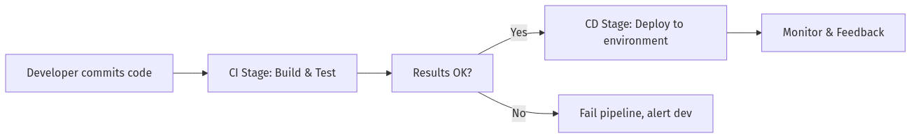
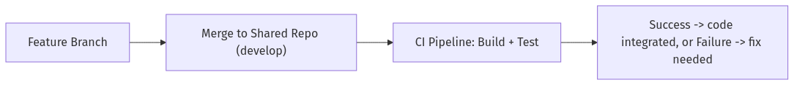
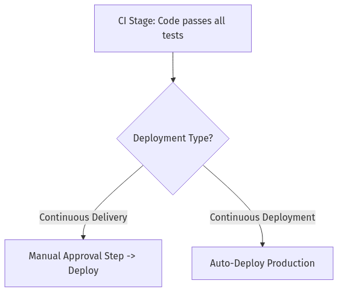
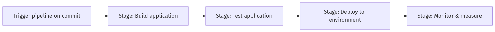
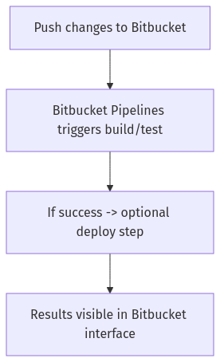
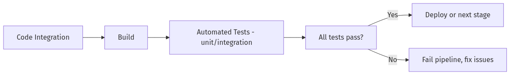
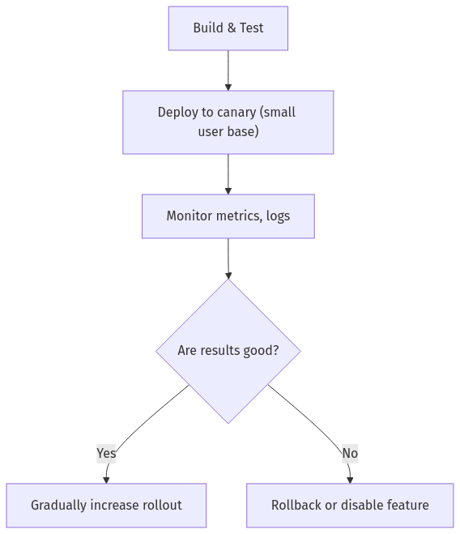
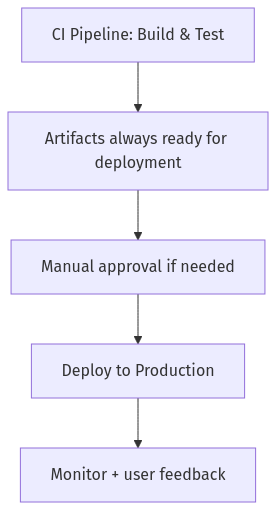
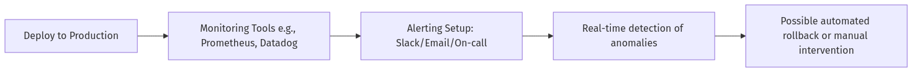

# **CI/CD Concepts & Overview: Comprehensive Learning Resource**  
### (Days 9-10)

This document transforms the question-and-answer format into a **complete educational guide** on:

- **Why CI/CD is essential** for modern software development  
- **Key stages and tools** in the CI/CD pipeline  
- **How to design and implement** effective CI/CD workflows  
- **Common pitfalls, best practices**, and real-world examples  

## **Table of Contents**

- [**CI/CD Concepts \& Overview: Comprehensive Learning Resource**](#cicd-concepts--overview-comprehensive-learning-resource)
    - [(Days 9-10)](#days-9-10)
  - [**Table of Contents**](#table-of-contents)
  - [**Core Concepts of CI/CD**](#core-concepts-of-cicd)
  - [**Tool Comparison for CI/CD**](#tool-comparison-for-cicd)
  - [**Behind the Scenes: How CI/CD Tools Execute Pipelines**](#behind-the-scenes-how-cicd-tools-execute-pipelines)
  - [**Cheatsheet: CI/CD Commands \& Best Practices**](#cheatsheet-cicd-commands--best-practices)
  - [**The Quiz Questions \& Answers**](#the-quiz-questions--answers)
    - [**Question 1**](#question-1)
    - [**Question 2**](#question-2)
    - [**Question 3**](#question-3)
    - [**Question 4**](#question-4)
    - [**Question 5**](#question-5)
    - [**Question 6**](#question-6)
    - [**Question 7**](#question-7)
    - [**Question 8**](#question-8)
    - [**Question 9**](#question-9)
    - [**Question 10**](#question-10)
  - [**Common Pitfalls \& Troubleshooting**](#common-pitfalls--troubleshooting)
  - [**Key Takeaways**](#key-takeaways)

---

## **Core Concepts of CI/CD**

1. **Why CI/CD?**  
   - **Reliability**: Automated pipelines detect errors earlier, reducing production incidents.  
   - **Speed**: Rapid feedback loops ensure teams address integration issues quickly.  
   - **Consistency**: Standardized processes handle build, test, and deploy steps identically each time.

2. **Pipeline Stages**  
   - **Build**: Compiles or packages the application.  
   - **Test**: Runs automated suites (unit, integration, end-to-end).  
   - **Deploy**: Pushes the built artifact to staging or production.  
   - **Monitor**: Tracks system health, logs, and alerts after deployment.

3. **Key Differences**:  
   - **Continuous Integration (CI)**: Merging code frequently with automated builds/tests.  
   - **Continuous Delivery (CD)**: Ensuring the code is always **ready** to deploy (manual approval is often used).  
   - **Continuous Deployment**: Automatically deploys code to production once all checks pass, no manual gating.

4. **Mental Model**:  
   - Each commit triggers a pipeline.  
   - If tests pass, the code is safe to deploy or is deployed automatically.  
   - Monitoring ensures real-time insight post-deployment.

---

## **Tool Comparison for CI/CD**

| **Tool**               | **Hosting**     | **Key Features**                              | **Pros**                                                 | **Cons**                                                   |
|------------------------|-----------------|------------------------------------------------|----------------------------------------------------------|-----------------------------------------------------------|
| **Jenkins**            | Self-hosted     | Plugin-based, highly customizable             | Mature ecosystem, large community                        | Requires setup & maintenance, can be heavy for small teams|
| **Bitbucket Pipelines**| Cloud (Bitbucket)| YAML-based config, tight integration with Bitbucket repos | Easy to set up, good synergy with Atlassian stack        | Limited concurrency on free tiers, dependent on Bitbucket |
| **GitHub Actions**     | Cloud (GitHub)  | Workflow-based config, integrated with GitHub | Great marketplace of actions, easy to adopt for GitHub users | Some complexity in advanced pipeline logic                |
| **GitLab CI**          | Self-hosted or Cloud | Pipeline config in .gitlab-ci.yml, container-based | Strong DevOps platform, fully integrated with GitLab    | Some features locked behind certain license tiers         |

---

## **Behind the Scenes: How CI/CD Tools Execute Pipelines**

- **Trigger Mechanisms**: Usually on code push, PR merges, or scheduled times.  
- **Build Agents / Runners**: Spin up in containers or VMs to run the build/test steps.  
- **Artifacts**: Generated build outputs stored temporarily or in an artifact repository.  
- **Deployment**: Scripts or integrated steps push code or containers to environments (e.g., AWS, Kubernetes).  
- **Logging & Metrics**: Tools capture logs, store pipeline history, and surface metrics for analysis.  

---

## **Cheatsheet: CI/CD Commands & Best Practices**

1. **Configuration Syntax**  
   - **Bitbucket Pipelines**: `bitbucket-pipelines.yml`  
     ```yaml
     image: node:14
     pipelines:
       default:
         - step:
             name: Build
             script:
               - npm install
               - npm run build
         - step:
             name: Test
             script:
               - npm test
     ```
   - **Jenkinsfile**:  
     ```groovy
     pipeline {
       agent any
       stages {
         stage('Build') {
           steps {
             sh 'mvn clean install'
           }
         }
         stage('Test') {
           steps {
             sh 'mvn test'
           }
         }
       }
     }
     ```
2. **Preventive Measures**  
   - **Break** big tests into smaller stages for clearer feedback.  
   - **Cache** dependencies or Docker layers to speed up builds.  
   - **Fail Fast**: Stop pipeline on critical errors.  
   - **Security Scans**: Integrate scanning steps to detect vulnerabilities.  

3. **Troubleshooting Failed Pipelines**  
   - Check logs for error messages.  
   - Re-run pipeline locally if possible.  
   - Isolate failing steps with debug logs.  
   - Use separate test/staging environment for deeper debugging.

4. **Tools to Enhance CI/CD**  
   - **SonarQube**: Code quality scanning.  
   - **Selenium/Cypress**: Automated browser testing.  
   - **Terraform/Ansible**: Infrastructure as code for deployment consistency.

---

## **The Quiz Questions & Answers**  

Below are the 10 quiz questions (Days 9-10) with an enhanced structure for deeper learning into CI/CD.

---

### **Question 1**  
**Question:** What does CI/CD stand for?  
- A) Continuous Improvement / Continuous Delivery  
- B) Continuous Integration / Continuous Deployment (or Delivery)  
- C) Constant Inspection / Constant Development  
- D) Continual Iteration / Code Deployment  

**Answer Overview:**  
“CI/CD” commonly refers to **Continuous Integration** paired with **Continuous Delivery** or **Continuous Deployment**. This methodology emphasizes frequent code merges (CI) and automated release processes (CD).

**Why Other Options Are Incorrect:**  
- **A:** “Continuous Improvement” is a generic term, not the standard meaning of CI.  
- **C/D:** Don’t accurately reflect established DevOps nomenclature.  

**Detailed Explanation:**  
Continuous Integration means regularly merging code changes into a shared repository, ensuring quick detection of integration conflicts. Continuous Delivery or Deployment extends this idea to streamline release processes with minimal manual steps.

**CI/CD Pipeline Walkthrough (Step-by-Step)**  
1. **Commit**: Developer pushes code to the repository.  
2. **Build & Test**: Automated pipeline compiles and tests the changes.  
3. **Deploy/Deliver**: Changes are automatically (or semi-automatically) promoted to staging/production.  
4. **Monitor**: The deployed service is watched for performance, errors, or user feedback.

**Tool Reference**  
- Jenkins, Bitbucket Pipelines, GitHub Actions, GitLab CI all revolve around the CI/CD concept.

**Code Examples**  
*Simple snippet for a typical pipeline definition can be found in the cheatsheet above.*  

**Real-World Scenario**  
A company with daily commits merges small features and bug fixes continuously. An automated pipeline runs tests and either deploys changes or flags them for a release manager to approve, ensuring stable, frequent updates.

**Before/After Example**  
- **Before CI/CD**: Infrequent merges, large release cycles, more integration headaches.  
- **After CI/CD**: Streamlined merges, consistent pipeline checks, frequent releases with fewer surprises.

**Best Practices**  
- Commit and integrate **often** to catch conflicts early.  
- Automate as many checks (build, test, security scans) as possible.  
- Keep pipeline definitions in version control.  
- Provide meaningful pipeline logs for debugging.  
- Use consistent naming for pipeline stages.  
- Store artifacts or packages for reproducible deployments.

**Common Pitfalls**  

| **Pitfall**                            | **Issue**                                 | **Better Approach**                                                         |
|----------------------------------------|-------------------------------------------|-----------------------------------------------------------------------------|
| Infrequent merges                      | Large, painful merges with big conflicts | Integrate at least daily, leveraging automated pipelines                    |
| Manual, error-prone deployments        | Hard to replicate environment or mistakes | Automated provisioning & deployment steps for consistency                   |

**DevOps Perspective**  
CI/CD is the backbone of modern DevOps. It ensures code is always in a **production-ready** state, bridging the gap between development and operations.

**Visual Representation (Mermaid Diagram)**  





**Key Takeaways**  
- CI/CD stands for **Continuous Integration** / **Continuous Delivery/Deployment**.  
- It focuses on automated merges, testing, and releasing.  
- The ultimate goal is **faster, more reliable** software delivery.

---

### **Question 2**  
**Question:** What is the primary goal of Continuous Integration (CI)?  
- A) Immediate deployment to production  
- B) Automatic conflict resolution  
- C) Frequent merging of code into a shared repository to detect integration issues early  
- D) Avoiding code reviews  

**Answer Overview:**  
The essence of CI is **frequent code merges** in a central repository, allowing the pipeline to quickly catch conflicts or issues, ensuring they don’t linger.

**Why Other Options Are Incorrect:**  
- **A:** CI doesn’t necessarily deploy to production.  
- **B:** Conflicts are identified, but **manual** resolution is still required.  
- **D:** Code reviews often complement CI, not replace it.  

**Detailed Explanation:**  
By committing often, developers integrate small changes, making it simpler to pinpoint errors. The pipeline runs automatically, verifying that the code merges cleanly and that core tests pass. This fosters a stable foundation for subsequent stages like deployment.

**CI/CD Pipeline Walkthrough**  
1. **Code Merge** triggers the build/test pipeline.  
2. **Build** ensures code is valid.  
3. **Tests** confirm functionality.  
4. **Notification** alerts devs if something breaks.

**Tool Reference**  
- Tools like Jenkins, Travis CI, GitHub Actions, or Bitbucket Pipelines run CI tasks.

**Code Examples**  
```yaml
# Example snippet for a CI pipeline that merges frequently:
stages:
  - build
  - test
steps:
  build:
    script: ./gradlew assemble
  test:
    script: ./gradlew test
```

**Real-World Scenario**  
A team using GitFlow merges feature branches into `develop` daily. Automated CI runs, ensuring each day the `develop` branch is tested and stable.

**Before/After Example**  
- **Before**: Infrequent merges result in big, painful integration at the end of a sprint.  
- **After**: Daily merges catch conflicts early, drastically reducing integration headaches.

**Best Practices**  
- Merge **small, incremental** changes.  
- Keep pipeline feedback **fast** (under 10 minutes if possible).  
- Use **branch protections** to enforce passing CI checks.  
- Update documentation or readme files if relevant changes occur.  
- Make sure test coverage is sufficient to catch regressions.  
- Encourage devs to fix CI failures immediately.

**Common Pitfalls**  

| **Pitfall**            | **Issue**                                                      | **Better Approach**                                        |
|------------------------|----------------------------------------------------------------|------------------------------------------------------------|
| “Works on my machine”  | Without a shared CI, code might fail in a standard environment | Ensure code runs on consistent build agents or containers |
| Waiting too long to merge | Massive merges introduce complicated conflicts              | Integrate often, typically at least once daily             |

**DevOps Perspective**  
CI is the “heartbeat” of DevOps, ensuring all dev branches remain in sync with minimal friction.

**Visual Representation (Mermaid Diagram)**  





**Key Takeaways**  
- CI aims at **frequent merges** with automated testing to spot issues early.  
- Short feedback loops accelerate debugging and keep teams aligned.  

---

### **Question 3**  
**Question:** What distinguishes Continuous Deployment from Continuous Delivery?  
- A) Continuous Deployment requires manual approval; Continuous Delivery deploys automatically.  
- B) Continuous Delivery requires manual approval; Continuous Deployment deploys automatically.  
- C) Continuous Deployment always skips testing.  
- D) Continuous Delivery does not integrate code frequently.  

**Answer Overview:**  
With **Continuous Delivery**, code is always ready for deployment but often **requires manual approval**. **Continuous Deployment** goes further by **automatically pushing** changes into production once they pass all checks.

**Why Other Options Are Incorrect:**  
- **A:** Inverts the definitions of these terms.  
- **C:** Testing remains crucial in any CI/CD approach.  
- **D:** Continuous Delivery still merges code frequently; it just holds a final manual go/no-go step.  

**Detailed Explanation:**  
- **Continuous Delivery**: The pipeline ensures each commit is fully tested and “deploy-ready.” However, a human typically authorizes the actual release.  
- **Continuous Deployment**: If tests pass, the code is automatically released to production without additional manual gates, enabling near real-time updates.

**CI/CD Pipeline Walkthrough**  
1. **Continuous Delivery**:  
   - After passing tests, the pipeline halts, awaiting a deploy approval.  
2. **Continuous Deployment**:  
   - After passing tests, the pipeline proceeds to deploy automatically.

**Tool Reference**  
- **AWS CodePipeline** or **Bitbucket Pipelines** can be configured for either approach.  
- “Manual approval” steps vs. “auto deploy” steps in your pipeline config.

**Code Examples**  
```yaml
# Bitbucket pipeline snippet for continuous deployment
pipelines:
  branches:
    master:
      - step:
          name: Build & Test
          script:
            - npm install
            - npm test
      - step:
          name: Deploy to Production
          script:
            - ./deploy.sh
```
Add a manual gate if you want continuous delivery instead of deployment.

**Real-World Scenario**  
A B2C web app might use continuous deployment to release small incremental features frequently, while a mission-critical banking system might prefer continuous delivery with manual sign-offs due to compliance needs.

**Before/After Example**  
- **Before**: Large batch releases every month.  
- **After**: Freed devs to release new features daily with minimal friction (either fully automatic or with a sign-off).

**Best Practices**  
- Determine if your business domain requires manual checks (e.g., compliance).  
- Ensure a robust test suite to avoid shipping broken changes to production.  
- Maintain environment parity (staging closely mirrors production).  
- Observe “feature flags” or “blue-green deployments” for safe rollouts.  
- Always monitor after deployment for anomalies.  
- Provide a straightforward rollback process in case of issues.

**Common Pitfalls**  

| **Pitfall**          | **Issue**                                                      | **Better Approach**                                          |
|----------------------|----------------------------------------------------------------|--------------------------------------------------------------|
| Over-automation      | Pushing incomplete or risky changes straight to production      | Use stable gating or feature flags to mitigate risk          |
| Neglecting compliance| Some industries require approvals or audits                     | Keep necessary manual steps where needed                     |

**DevOps Perspective**  
Choosing between continuous delivery vs. deployment depends on risk tolerance, domain constraints, and maturity of automated testing.

**Visual Representation (Mermaid Diagram)**  





**Key Takeaways**  
- **Continuous Delivery**: Always ready to deploy but typically **manually triggered**.  
- **Continuous Deployment**: **Fully automated** release if tests pass.  
- Both rely on robust, frequent testing to ensure safe releases.  

---

### **Question 4**  
**Question:** In a CI/CD pipeline, which step usually occurs first?  
- A) Deployment to production  
- B) Running automated tests  
- C) Building the application  
- D) Monitoring production systems  

**Answer Overview:**  
Before anything else, you need a successful **build**. Only once code compiles/packages properly can you run tests and eventually deploy.

**Why Other Options Are Incorrect:**  
- **B:** Testing typically follows a successful build.  
- **A:** Deployment is one of the last stages.  
- **D:** Monitoring occurs post-deployment.  

**Detailed Explanation:**  
A typical pipeline sequence is:  
1) **Build**: Ensures code compiles or container images are created.  
2) **Test**: Verifies the build’s functionality.  
3) **Deploy**: Moves the tested artifact to staging or production.  
4) **Monitor**: Observes performance/health to catch issues.

**CI/CD Pipeline Walkthrough**  
1. **Build** triggered by code push.  
2. If build success → proceed to tests.  
3. If tests pass → proceed to deployment.  
4. Then monitoring picks up post-deployment checks.

**Tool Reference**  
- Jenkins, GitLab CI, or Bitbucket Pipelines typically define a build stage before test or deploy stages.

**Code Examples**  
```yaml
stages:
  - build
  - test
  - deploy
...
```
**Real-World Scenario**  
A Node.js project uses `npm install && npm run build` to compile TypeScript or bundle front-end assets. Then test scripts run, ensuring code correctness, followed by deploy steps.

**Before/After Example**  
- **Before**: Dev teams might skip a formal build step, leading to sporadic compilation issues at deployment.  
- **After**: Consistent build stage ensures all dependencies and code structures are validated early.

**Best Practices**  
- Keep build scripts deterministic.  
- Cache common dependencies for faster builds.  
- Fail early if the build breaks to avoid wasted resources on subsequent stages.  
- Tag build artifacts for traceability (include version info).  
- Secure your build environment to avoid supply chain attacks.  
- Log build output comprehensively for debugging.

**Common Pitfalls**  

| **Pitfall**                      | **Issue**                                                      | **Better Approach**                                                   |
|----------------------------------|----------------------------------------------------------------|-----------------------------------------------------------------------|
| Merged code that doesn’t compile | Pipeline fails mid-test or mid-deploy, wasting time            | Always do a build step first, fail fast if code can’t compile         |
| Large unoptimized builds         | Slow pipeline feedback loops                                   | Optimize your build process (caching, smaller builds, microservices)  |

**DevOps Perspective**  
Standardizing the build step fosters consistency across environments—an essential principle of DevOps.

**Visual Representation (Mermaid Diagram)**  





**Key Takeaways**  
- Always **build first** to produce a valid artifact.  
- This ensures subsequent steps (test, deploy) operate on known, consistent code.  

---

### **Question 5**  
**Question:** Which Bitbucket feature facilitates CI/CD workflows?  
- A) Bitbucket Pages  
- B) Bitbucket Pipelines  
- C) Bitbucket Snippets  
- D) Bitbucket Pull Requests  

**Answer Overview:**  
**Bitbucket Pipelines** is Atlassian’s built-in solution for automating builds, tests, and deployments directly within Bitbucket.

**Why Other Options Are Incorrect:**  
- **A:** Bitbucket Pages hosts static websites, not a full CI/CD solution.  
- **C:** Snippets are code gists or partial references, not pipelines.  
- **D:** Pull requests facilitate code reviews, not automated pipeline runs (though PR triggers can use Pipelines).  

**Detailed Explanation:**  
Bitbucket Pipelines rely on a `bitbucket-pipelines.yml` file in your repo. On each push, it can run tasks in a Docker container, building your project, testing, and optionally deploying the results. This tight integration means you don’t need an external CI server.

**CI/CD Pipeline Walkthrough**  
1. **Configure** `bitbucket-pipelines.yml`.  
2. **Push code** or open PR.  
3. **Pipeline** automatically runs steps (build/test/deploy).  
4. **Results** are shown within Bitbucket interface.

**Tool Reference**  
- **Bitbucket Pipelines**: Cloud-based, with limited free minutes.  
- **Integration**: Connect with AWS, Azure, or other providers for deployment.

**Code Examples**  
```yaml
image: node:14
pipelines:
  default:
    - step:
        name: Build
        script:
          - npm install
          - npm run build
    - step:
        name: Test
        script:
          - npm test
    - step:
        name: Deploy
        script:
          - ./deploy.sh
```

**Real-World Scenario**  
A developer modifies the `bitbucket-pipelines.yml` to add a new “Security Scan” step. Every commit triggers an updated pipeline that compiles code, runs tests, scans for vulnerabilities, and if all pass, deploys to staging.

**Before/After Example**  
- **Before**: Manual steps for building/testing each branch.  
- **After**: Automated pipeline on every push, with quick pass/fail feedback in Bitbucket.

**Best Practices**  
- Keep pipeline definitions **simple, modular**.  
- Use separate steps for clarity (build, test, deploy).  
- Integrate environment variables securely (avoid storing secrets in plain text).  
- Limit concurrency or resource usage to manage costs.  
- Use caching to speed up repeated tasks.  
- Combine with pull request checks to block merges if pipeline fails.

**Common Pitfalls**  

| **Pitfall**                        | **Issue**                                                               | **Better Approach**                                                       |
|------------------------------------|-------------------------------------------------------------------------|---------------------------------------------------------------------------|
| Overly complex pipeline in one step| Hard to debug or track partial failures                                  | Split pipeline into multiple steps with clear naming                      |
| Storing secrets in plain YAML      | Risk of exposing credentials or private keys                             | Use Bitbucket’s secure repository variables or a secrets manager          |

**DevOps Perspective**  
Hosted pipeline solutions like Bitbucket Pipelines reduce overhead and let teams focus on code, not CI infrastructure.

**Visual Representation (Mermaid Diagram)**  





**Key Takeaways**  
- **Bitbucket Pipelines** is a native CI/CD feature in Bitbucket.  
- Automates build, test, and deploy steps without separate servers.  

---

### **Question 6**  
**Question:** Why are automated tests critical in a CI/CD pipeline?  
- A) They guarantee zero defects.  
- B) They eliminate the need for manual testing entirely.  
- C) They provide fast feedback on code changes, catching issues early.  
- D) They automatically deploy code to production.  

**Answer Overview:**  
Automated tests are essential for **fast feedback**, identifying regressions or breaking changes soon after code integration.

**Why Other Options Are Incorrect:**  
- **A:** Automated tests can’t guarantee zero defects, they reduce risk.  
- **B:** Manual or exploratory testing often remains valuable.  
- **D:** Deployment is separate from the act of testing.  

**Detailed Explanation:**  
Testing ensures the newly integrated code doesn’t break existing features. Quick and reliable test suites help maintain a stable codebase, letting devs merge changes more confidently. The pipeline halts if tests fail, preventing flawed code from advancing to deployment.

**CI/CD Pipeline Walkthrough**  
1. **Build** your code.  
2. **Run Automated Tests**: E.g., unit, integration, e2e.  
3. **Pass** → proceed to deploy, **Fail** → pipeline stops, devs fix issues.

**Tool Reference**  
- **Testing frameworks**: JUnit, pytest, Mocha, Jest, etc. integrated into the pipeline.  
- **Reports** displayed in Jenkins/Bitbucket pipeline logs for pass/fail and coverage.

**Code Examples**  
```bash
# Example step in a pipeline script
npm install
npm test -- --coverage
```
**Real-World Scenario**  
A large ecommerce site adds new product filtering logic. The CI pipeline runs test suites verifying search, cart, checkout flows. If any test fails, devs fix it before deployment.

**Before/After Example**  
- **Before**: Relying only on manual testing can delay feedback, missing subtle bugs.  
- **After**: Automated tests run on every commit, drastically reducing post-release defects.

**Best Practices**  
- Maintain a **high coverage** of crucial functionality.  
- Include **security or performance** tests if relevant.  
- Keep tests **fast** to not bottleneck your pipeline.  
- Organize tests by type (unit, integration, e2e).  
- Provide a **clear reporting** mechanism for test results.  
- Update tests alongside code changes.

**Common Pitfalls**  

| **Pitfall**                       | **Issue**                                                              | **Better Approach**                                                   |
|-----------------------------------|------------------------------------------------------------------------|-----------------------------------------------------------------------|
| Having a large suite of flaky tests | Builds fail randomly, undermining trust in CI                           | Fix test flakiness or quarantine those tests, keep pipeline stable    |
| Skipping tests for speed          | Risk shipping unverified changes, leading to production regressions     | Optimize or parallelize tests but keep coverage robust                |

**DevOps Perspective**  
Automated tests embody shift-left testing. Defects found earlier cost less to fix and keep production stable.

**Visual Representation (Mermaid Diagram)**  





**Key Takeaways**  
- Automated tests **accelerate** feedback loops.  
- They **don’t** eliminate all manual testing but do reduce the chance of major regressions.  

---

### **Question 7**  
**Question:** What is a typical best practice for deploying applications using CI/CD?  
- A) Directly deploying every code change to production without testing.  
- B) Using feature flags or phased rollouts to manage risk.  
- C) Skipping monitoring after deployment.  
- D) Manually merging every commit.  

**Answer Overview:**  
**Feature flags** or **phased rollouts** let teams release changes to a small subset of users before a full production launch, reducing risk and quickly reverting if needed.

**Why Other Options Are Incorrect:**  
- **A:** Deploying untested code is dangerous.  
- **C:** Monitoring is crucial post-deployment.  
- **D:** Doesn’t relate directly to a best practice for deploying; merges are separate from deployment strategy.  

**Detailed Explanation:**  
Modern deployment strategies (blue-green, canary releases, feature flags) help mitigate the risk of rolling out new features. This allows partial exposure in production to gather metrics or user feedback. If something goes wrong, it’s easier to revert or disable the feature.

**CI/CD Pipeline Walkthrough**  
1. **Build & Test**.  
2. **Deploy** to a canary or staging environment.  
3. **Monitor** results with real user traffic (subset).  
4. **Expand** rollout if all looks good. If issues arise, revert quickly.

**Tool Reference**  
- Tools like LaunchDarkly or AWS AppConfig manage feature flags.  
- Kubernetes supports rolling updates or canary deployments out-of-the-box.

**Code Examples**  
```yaml
# Example partial rollout script
- step:
    name: Deploy Canary
    script:
      - ./deploy_canary.sh
# Then wait/verify before full deploy
```
**Real-World Scenario**  
A streaming service introduces a new recommendation algorithm behind a feature flag. They turn it on for 5% of users. If metrics are good, they incrementally increase the percentage.

**Before/After Example**  
- **Before**: All-or-nothing deploys cause big potential outages.  
- **After**: Controlled rollouts catch issues in small user segments.

**Best Practices**  
- Automate your deployment pipeline **and** your rollback.  
- Log or track feature usage to gauge success.  
- Combine with robust **monitoring** to detect anomalies.  
- Keep your pipeline flexible: you can skip or run partial deploy steps.  
- Use ephemeral environment or canary environment for final checks.  
- Work in small increments to reduce deployment risk.

**Common Pitfalls**  

| **Pitfall**              | **Issue**                                                   | **Better Approach**                                                  |
|--------------------------|-------------------------------------------------------------|----------------------------------------------------------------------|
| Releasing to 100% at once| Harder to identify which change caused issues              | Use canary or phased rollouts to isolate problems                    |
| Neglecting rollback plan | Recovery from a bad deploy is slow or manual               | Automate rollback or rely on feature flag toggles                    |

**DevOps Perspective**  
Deployment best practices reduce production incidents and downtime, crucial for continuous delivery pipelines.

**Visual Representation (Mermaid Diagram)**  





**Key Takeaways**  
- Gradual or controlled deployment strategies (feature flags, canary) **lower risk**.  
- Monitoring and rollback capabilities are essential to handle unexpected issues.  

---

### **Question 8**  
**Question:** Which tool is commonly used alongside Bitbucket for Continuous Integration?  
- A) Jenkins  
- B) Jira  
- C) Trello  
- D) Confluence  

**Answer Overview:**  
**Jenkins** is a popular, widely used CI server that can integrate with Bitbucket webhooks to trigger builds upon code pushes or merges.

**Why Other Options Are Incorrect:**  
- **B:** Jira is an issue tracker, not a CI tool.  
- **C:** Trello is a task management board.  
- **D:** Confluence is a documentation/wiki platform.  

**Detailed Explanation:**  
Many Bitbucket-based teams rely on Jenkins for advanced or self-hosted CI. Jenkins can be configured to poll or receive triggers from Bitbucket, then run a pipeline (e.g., Jenkinsfile). Meanwhile, Bitbucket Pipelines is a cloud-based alternative for simpler setups.

**CI/CD Pipeline Walkthrough**  
1. **Bitbucket** triggers Jenkins pipeline via webhook.  
2. **Jenkins** checks out code, runs build/test steps.  
3. **Results** posted back to Bitbucket (pass/fail).  
4. **Deployment** stage can run from Jenkins if configured.

**Tool Reference**  
- Jenkins uses a plugin for Bitbucket integration, or a generic webhook approach.  

**Code Examples** (Jenkinsfile)  
```groovy
pipeline {
    agent any
    stages {
        stage('Build') {
            steps {
                sh 'mvn clean package'
            }
        }
        stage('Test') {
            steps {
                sh 'mvn test'
            }
        }
    }
}
```

**Real-World Scenario**  
A company already uses Jenkins for enterprise builds. They push code to Bitbucket, which notifies Jenkins. Jenkins runs extensive tests and updates the PR status in Bitbucket.

**Before/After Example**  
- **Before**: Manual local builds or manual triggers.  
- **After**: Automated Jenkins pipeline triggered on each commit, integrated with Bitbucket.

**Best Practices**  
- Keep Jenkins updated; maintain your plugin versions.  
- Store Jenkins pipelines as code (Jenkinsfile) in the repo.  
- Use **declarative pipeline** for readability.  
- Secure Jenkins with role-based access.  
- Parallelize big test suites to keep times short.  
- Use ephemeral Jenkins agents (e.g., Docker containers) for clean builds.

**Common Pitfalls**  

| **Pitfall**                  | **Issue**                                                | **Better Approach**                                               |
|------------------------------|----------------------------------------------------------|-------------------------------------------------------------------|
| Long-living Jenkins nodes    | Potential for stale environments or dependency collisions| Use ephemeral agents or containers to ensure consistent builds    |
| Overreliance on manual Jenkins jobs | Inconsistent or untracked pipelines, error-prone  | Use pipeline-as-code in Jenkinsfiles for consistent automation    |

**DevOps Perspective**  
Jenkins remains a go-to CI solution for many large orgs, offering flexibility and extensibility in DevOps pipelines.

**Visual Representation (Mermaid Diagram)**  


**Key Takeaways**  
- Jenkins is a **commonly used** CI server integrated with Bitbucket.  
- It’s highly customizable, though it requires setup and maintenance.  

---

### **Question 9**  
**Question:** What benefit does Continuous Delivery primarily offer businesses?  
- A) Slower deployment processes  
- B) Increased manual control at every step  
- C) Faster, more reliable releases with reduced risk  
- D) Avoidance of code integration  

**Answer Overview:**  
**Continuous Delivery** ensures that every change is deployable, enabling **faster and more reliable** release cycles with less risk due to smaller changes being tested thoroughly.

**Why Other Options Are Incorrect:**  
- **A:** It actually speeds up releases.  
- **B:** CD typically automates and streamlines, though final release might be a manual action.  
- **D:** CD implies frequent integration, not avoidance.  

**Detailed Explanation:**  
Continuous Delivery fosters a consistent approach: each code merge triggers a pipeline that ensures the software is production-ready. While manual approval might be used, the overall release timeframe shortens because the system is always in a shippable state.

**CI/CD Pipeline Walkthrough**  
1. **Develop & Integrate** code frequently.  
2. **Automated Testing** ensures readiness.  
3. **Manual Approvals** (if needed) happen swiftly because issues are minimal.  
4. **Deploy** small increments, reducing risk.

**Tool Reference**  
- Tools like Spinnaker or Octopus Deploy can orchestrate advanced delivery flows.  
- Jenkins or Bitbucket Pipelines can handle simpler continuous delivery setups.

**Code Examples**  
No direct snippet, but any pipeline with a final “approval gate” step or environment promotion step fits Continuous Delivery.

**Real-World Scenario**  
A mid-sized SaaS product team merges code daily into a “release candidate” branch, which automatically passes QA tests. The release manager just clicks “approve” to deploy to production. This happens weekly or even daily.

**Before/After Example**  
- **Before**: Monthly “big bang” releases with significant downtime or risk.  
- **After**: Frequent, smaller releases with minimal disruptions.

**Best Practices**  
- Ensure **test coverage** is robust so each built artifact is truly “production-ready.”  
- Keep a **staging environment** close to production for final checks.  
- Automate environment provisioning to reduce deployment friction.  
- Maintain **consistent** pipeline definitions across environments.  
- Use **versioning** for artifacts, easy rollback.  
- Document any manual steps needed in approvals or compliance checks.

**Common Pitfalls**  

| **Pitfall**                                | **Issue**                                              | **Better Approach**                                                           |
|--------------------------------------------|--------------------------------------------------------|-------------------------------------------------------------------------------|
| Not addressing failing tests quickly       | Blocks pipeline, stalling the entire release cycle     | Fix issues or revert problematic commits swiftly                              |
| Overcomplicating environment promotion     | Delays or confusion about which code is in staging/prod| Keep it simple: each pipeline stage is clearly labeled, log artifact versions |

**DevOps Perspective**  
Continuous Delivery underpins agile release cycles, letting businesses respond faster to market changes and user feedback.

**Visual Representation (Mermaid Diagram)**  





**Key Takeaways**  
- **Continuous Delivery** keeps code always “deployment-ready.”  
- It leads to **faster, more reliable** releases by shipping **small, tested** increments.  

---

### **Question 10**  
**Question:** What is a common monitoring practice after deployment in CI/CD?  
- A) Ignoring the system post-deployment  
- B) Immediate rollback regardless of results  
- C) Continuous monitoring and alerting to identify issues quickly  
- D) Manual code review only  

**Answer Overview:**  
Post-deployment, **continuous monitoring and alerting** is key for swiftly detecting anomalies, performance degradations, or errors.

**Why Other Options Are Incorrect:**  
- **A:** Neglecting system health is risky.  
- **B:** Rollback is used **if** issues are detected, not always.  
- **D:** Manual code reviews are typically before or during integration, not a post-deploy monitoring practice.  

**Detailed Explanation:**  
Monitoring might include real-time logs, metrics, and user analytics. It provides immediate feedback if a new release triggers errors or user experience issues. Alerting notifies devs automatically, enabling prompt remediation.

**CI/CD Pipeline Walkthrough**  
1. **Post-Deployment**: System metrics, logs, and error reporting are gathered.  
2. **Alerts** set thresholds for CPU usage, error rates, etc.  
3. **If an anomaly** is detected, the pipeline or devs can initiate rollback or hotfix.

**Tool Reference**  
- **Monitoring**: Datadog, New Relic, Prometheus + Grafana, ELK stack, etc.  
- **Alerts**: Slack or email notifications triggered by anomalies.

**Code Examples**  
```yaml
# A snippet from a pipeline that triggers a monitoring job or post-deploy check
- step:
    name: Post-deploy checks
    script:
      - ./check_health.sh
      - ./monitoring_integration.sh
```
**Real-World Scenario**  
An online retailer deploys a new checkout flow. They watch user conversion metrics and error logs. If cart completions plummet, an alert triggers immediate investigation or a rollback.

**Before/After Example**  
- **Before**: No structured monitoring; issues only discovered via user complaints.  
- **After**: Automatic alerts highlight errors in real-time, allowing quick response.

**Best Practices**  
- Monitor **key metrics** (latency, error rates, resource usage) post-deploy.  
- Integrate logs with a centralized system for quick searching.  
- Implement synthetic tests or health checks hitting crucial endpoints.  
- Use **observability** frameworks (tracing, logging, metrics) for deeper insight.  
- Validate canary rollout performance before scaling 100%.  
- Ensure on-call rotation and alert severity levels are well defined.

**Common Pitfalls**  

| **Pitfall**                        | **Issue**                                               | **Better Approach**                                         |
|------------------------------------|---------------------------------------------------------|-------------------------------------------------------------|
| Reactive approach only             | Devs rely solely on user complaints                     | Proactive monitoring & alerting for real-time issue detection |
| Overly noisy alerts                | Devs ignore or mute alerts due to high false positives  | Tune alert thresholds, route them properly, create meaningful alerts |

**DevOps Perspective**  
Monitoring and quick incident response close the loop in a CI/CD pipeline, ensuring continuous improvement and robust service reliability.

**Visual Representation (Mermaid Diagram)**:  





**Key Takeaways**  
- Effective CI/CD includes **continuous monitoring** post-deployment.  
- Alerts and quick responses minimize downtime and protect user experience.  

---

## **Common Pitfalls & Troubleshooting**

| **Pitfall**                                       | **Possible Issue**                                                                           | **Better Approach**                                                                                  |
|---------------------------------------------------|-----------------------------------------------------------------------------------------------|------------------------------------------------------------------------------------------------------|
| Large, Infrequent Merges                          | Creates big conflicts, complicated releases                                                  | Frequent, small merges with a stable pipeline                                                        |
| Lack of Automated Testing                         | Higher chance of shipping bugs, no quick feedback                                            | Maintain robust test suites integrated into the pipeline                                             |
| No Structured Deployment Strategy                 | Risky all-at-once releases, harder rollbacks                                                 | Adopt canary, blue-green, or feature-flag-based rollouts                                             |
| Inadequate Monitoring                             | Issues go unnoticed until customers complain                                                 | Use metrics, logging, alerting systems to detect anomalies                                           |
| Confusion Between CI/CD Terminology               | Implementing partial solutions or missing final deployment steps                              | Clearly define difference between CI (testing/integration) & CD (deploy readiness or auto-deploy)     |
| Over- or Under-automation                         | Over-automation can cause chaos with zero checks, under-automation reintroduces manual errors| Strike a balance: stable automated steps with necessary manual approvals or gates where needed       |

---

## **Key Takeaways**

1. **CI/CD** drastically improves software quality and delivery speed through automation.  
2. **Frequent Merges & Testing** catch issues early, fostering stable, incremental releases.  
3. **Continuous Delivery** vs. **Continuous Deployment**: decide if you need manual approval gates or fully automatic pushes.  
4. **Monitoring & Alerting** are critical post-deployment to maintain system health.  
5. **Tools** like Jenkins, Bitbucket Pipelines, GitLab CI, and GitHub Actions provide flexible ways to implement CI/CD.  

---

**This comprehensive resource was derived from**:
- **Prompt**   
- **Quiz Answers**   
- **Quiz Questions**   

By following these guidelines, leveraging CI/CD tools effectively, and maintaining strong collaboration, teams can **optimize their software delivery processes**, leading to more frequent, reliable releases and better overall code quality.