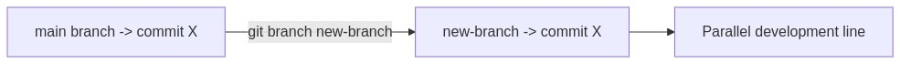
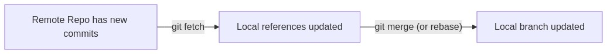
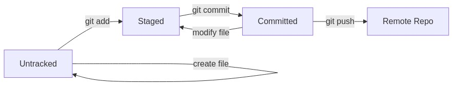

# Mental Model of Git Day 1 and 2 Answer Sheet

Before addressing each quiz question, let’s establish a mental model of how Git works:

1. **Working Directory**  
   - The folder on your computer where files are created, edited, or removed.  
   - Files here can be tracked or untracked by Git.

2. **Staging Area (Index)**  
   - Where you gather or “stage” specific changes you intend to commit.  
   - Only staged changes are included when you create a commit.

3. **Local Repository**  
   - Lives in the hidden `.git` folder.  
   - Stores the entire history of commits, enabling you to revert, branch, or merge.

4. **Remote Repository**  
   - A copy of the project on a server (e.g., GitHub, GitLab).  
   - You push local changes to it or pull others’ changes down.

Understanding how commands move files between these areas is crucial to mastering Git.

---

## 1) Question: “What is the command to create a new Git repository locally?”  
**(A) git new**  
**(B) git init**  
**(C) git start**  
**(D) git create**

### Answer Overview  
The correct answer is **(B) `git init`**. This command initializes a brand-new local Git repository by creating a hidden `.git` folder in the current directory. It sets up the necessary structure for Git to start tracking version history.

### Why Other Options Are Incorrect
- **(A) git new**: Not a valid Git command.  
- **(C) git start**: Also not a Git command.  
- **(D) git create**: This doesn’t exist; you must use `git init` to start a new repo.

### Detailed Explanation  
`git init` is the foundational step for turning any folder into a Git repository. By creating the `.git` directory, Git organizes subfolders and configuration files needed to record changes, track branches, and store commits. After running `git init`, you can then add and commit files.

### Command Anatomy
```
git init [directory]
```
- **directory** (optional): If specified, initializes Git in that directory. Otherwise, it initializes in the current folder.

### Real-World Example
```bash
mkdir my-new-project
cd my-new-project
git init
```
- You’ve just created a folder called `my-new-project`.
- Running `git init` sets up `.git/` inside `my-new-project`.

### Terminal Output
- **Before**: No `.git` folder in your directory.  
- **Run**: `git init`  
- **After**:
  ```
  Initialized empty Git repository in /path/to/my-new-project/.git/
  ```
  A new hidden `.git` folder appears.

### Git Internals
- Creates a `.git` folder containing:
  - `objects/` to hold commit data (blobs, trees, commits).  
  - `refs/` to store branch references.  
  - `HEAD` file pointing to the current branch reference.

### Best Practices
- Initialize only at the project’s root directory to avoid nested Git repos.  
- Create a `.gitignore` early to exclude files you don’t want to track.  
- Immediately check the repo status with `git status`.  
- Use meaningful first commit messages (e.g., “Initial commit”).  
- Keep the `.git` folder intact; deleting or moving it breaks version control.  
- Combine initialization with a well-structured project layout.

### Common Pitfalls

| **Pitfall**                | **Issue**                                                                  | **Better Approach**                                                 |
|----------------------------|----------------------------------------------------------------------------|---------------------------------------------------------------------|
| Initializing in subfolders | Creates multiple `.git` directories, leading to confusion                  | Initialize Git only in the top-level folder of your project         |
| Overlooking `.gitignore`   | Could accidentally track large or sensitive files                          | Add a `.gitignore` before committing files                          |
| Not confirming status      | Might not realize you’re in a non-Git folder                               | Run `git status` or `ls -a` to ensure `.git` is present             |

### DevOps Perspective
Although commonly you clone existing repos in professional settings, `git init` remains crucial for quickly spinning up internal tools or proofs-of-concept. Ensuring your `.git` is set up properly is vital for consistent CI/CD.

### Visual Representation


### Key Takeaways
- `git init` is your first step in turning a folder into a version-controlled project.  
- It sets up the hidden `.git` folder, where Git data is stored.  
- Ensures you can track, commit, and collaborate on your project’s files.

---

## 2) Question: “What does git clone do?”  
**(A) Creates a new repository locally from a remote repository**  
**(B) Sends your local changes to remote repository**  
**(C) Shows the history of commits**  
**(D) Creates a new commit**

### Answer Overview
The correct answer is **(A) `git clone` creates a new repository locally from a remote repository**. It copies all commits, branches, and files from the remote source to your machine, setting up a `.git` folder with a connection to the remote (often named `origin`).

### Why Other Options Are Incorrect
- **(B) Sends local changes to remote**: That’s `git push`.  
- **(C) Shows commit history**: That’s `git log`.  
- **(D) Creates a new commit**: That’s `git commit`.

### Detailed Explanation
`git clone` fetches the entire project from a remote URL (e.g., GitHub) to your local machine. You get all the branches, tags, and version history, so you can immediately start working with the code offline. By default, Git configures the cloned repository’s remote to be called `origin`.

### Command Anatomy
```
git clone [remote-url] [optional-directory-name]
```
- **remote-url**: HTTPS or SSH link to the remote repository.
- **optional-directory-name**: Defines the folder name where you want the clone placed.

### Real-World Example
```bash
git clone https://github.com/user/my-awesome-repo.git
```
- Creates a local folder named `my-awesome-repo` containing a `.git` directory tracking `origin`.

### Terminal Output
- **Before**: You have no local copy of the remote repository.  
- **Run**: `git clone https://github.com/user/my-awesome-repo.git`  
- **After**:
  ```
  Cloning into 'my-awesome-repo'...
  remote: Counting objects: ...
  remote: Compressing objects: ...
  Receiving objects: ...
  Resolving deltas: ...
  Checking connectivity... done.
  ```

### Git Internals
- Git downloads all objects from the remote (commits, trees, blobs).  
- A `.git/config` file is created containing a reference to the remote named `origin`.  
- The local repository’s `HEAD` is set to the remote’s default branch (often `main`).

### Best Practices
- Use SSH or token-based authentication for secure cloning.  
- Clone only necessary repositories; large repos might be time-consuming.  
- Immediately create or switch to a working branch if you need an isolated line of development.  
- Keep your local repo updated by pulling regularly.  
- Ensure you have permission to clone private repos.  
- Consider shallow clones (`--depth=1`) for large repos if full history isn’t needed.

### Common Pitfalls

| **Pitfall**                     | **Issue**                                             | **Better Approach**                                         |
|---------------------------------|-------------------------------------------------------|-------------------------------------------------------------|
| Cloning into an existing folder | Might mix files, causing conflicts                    | Use an empty folder or specify a new folder name            |
| Using HTTP instead of SSH       | Might prompt for credentials repeatedly, less secure  | Set up SSH keys for authentication                          |
| Cloning huge repos unnecessarily | Wastes disk space, slow downloads                     | Use `--depth` option or clone only if truly needed          |

### DevOps Perspective
Cloning repositories is vital for onboarding new developers into projects quickly, and for CI servers that run clean builds. Continuous integration pipelines often start with a fresh clone to ensure no leftover artifacts.

### Visual Representation


### Key Takeaways
- `git clone` duplicates an entire remote repository, including history.  
- Sets up a default remote named `origin`.  
- Instantly ready for branching, committing, and pushing to the same remote.

---

## 3) Question: “What is a commit in Git?”  
**(A) A remote server**  
**(B) A saved snapshot of your project’s files**  
**(C) A branch of your repository**  
**(D) The current state of your repository**

### Answer Overview
The correct answer is **(B) A saved snapshot of your project’s files**. A commit captures the state of staged changes, including which files changed and the lines modified. It forms a node in Git’s history graph.

### Why Other Options Are Incorrect
- **(A) Remote server**: That refers to hosting platforms or repos, not commits.  
- **(C) A branch**: A branch is a pointer to a series of commits, not a single snapshot.  
- **(D) The current state**: The current working tree might differ from the last commit; a commit is a recorded point in history.

### Detailed Explanation
When you run `git commit`, Git packages the staged changes into a new commit object. Commits are immutable, each referencing its parent commit(s). This chain forms the project’s timeline. Each commit has metadata (author, date, message) and references to the files (blobs) that changed.

### Command Anatomy: `git commit`
```
git commit -m "Commit message"
```
- **-m**: Provide a message inline.  
Other variations:
- `git commit --amend`: Modify the most recent commit.  
- `git commit -a -m "..."`: Automatically stage all tracked modified files before committing.

### Real-World Example
```bash
git add login.js
git commit -m "Add user login functionality"
```
This commit logs all changes in `login.js` into the history with the message “Add user login functionality.”

### Terminal Output
- **Before**: Staged changes exist.  
- **Run**: `git commit -m "Add user login functionality"`  
- **After**:
  ```
  [main 1a2b3c4] Add user login functionality
   1 file changed, 20 insertions(+)
  ```

### Git Internals
- Git creates a new commit object in `.git/objects`.  
- The commit references a tree object containing the current snapshot of your project.  
- The `HEAD` pointer for your branch moves to this new commit.

### Best Practices
- Commit frequently with meaningful messages explaining *why* changes were made.  
- Keep commits small and focused for easy review and rollback.  
- Use `git diff --staged` or `git status` to check what you’re committing.  
- Avoid committing generated files; rely on `.gitignore`.  
- Test changes before committing if possible.  
- Use `--amend` sparingly to fix minor mistakes in the last commit.

### Common Pitfalls

| **Pitfall**              | **Issue**                                                  | **Better Approach**                                                   |
|--------------------------|------------------------------------------------------------|-----------------------------------------------------------------------|
| Vague commit messages    | Hard to understand the rationale behind changes            | Write descriptive messages that focus on *why* changes were made      |
| Committing large binaries| Bloats the repo, causing performance issues                | Use Git LFS (Large File Storage) or exclude large files from the repo |
| Committing untested code | Potentially breaks main branch in a shared environment     | Test or lint code before committing, especially in production branches|

### DevOps Perspective
Every commit can trigger CI pipelines (build, test, deploy). Good commit hygiene fosters clarity and traceability in professional workflows, easing rollbacks and audits.

### Visual Representation


### Key Takeaways
- A commit is a permanent snapshot of staged changes.  
- It’s identified by a unique hash.  
- Meaningful commit messages improve collaboration and debugging.

---

## 4) Question: “How do you stage files for a commit?”  
**(A) git commit**  
**(B) git stage**  
**(C) git add**  
**(D) git push**

### Answer Overview
The correct answer is **(C) `git add`**. This command moves changes from the working directory into the staging area, preparing them to be included in the next commit.

### Why Other Options Are Incorrect
- **(A) git commit**: Actually creates the commit from staged changes.  
- **(B) git stage**: Not a valid command; `git add` is the standard.  
- **(D) git push**: Sends commits to a remote, not relevant to staging local changes.

### Detailed Explanation
`git add` updates the staging index. You can selectively stage individual files or entire directories. Only changes in the staging area become part of the subsequent commit, which ensures you can commit exactly what you want.

### Command Anatomy
```
git add [file or pattern]
```
Common usage variations:
1. `git add myfile.txt`  
2. `git add .` (adds all modified/untracked files, except those ignored)  
3. `git add -p` (interactive mode to review changes hunk by hunk)

### Real-World Example
```bash
# Suppose you modified index.html and script.js
git add index.html
git add script.js
```
Now both files are staged. The next `git commit` will include those changes.

### Terminal Output
- **Before**:  
  ```
  Changes not staged for commit:
    modified:   index.html
    modified:   script.js
  ```
- **Run**:  
  ```
  git add index.html script.js
  ```
- **After**:
  ```
  Changes to be committed:
    modified:   index.html
    modified:   script.js
  ```

### Git Internals
- Updates the `.git/index` file (staging area) to record the content checksums of the newly staged files.  
- No new commits or references are created here—just an update to the index.

### Best Practices
- Stage only relevant changes to keep commits focused.  
- Use `git add -p` to review diffs interactively.  
- Always verify what’s staged via `git status` or `git diff --staged`.  
- Pair `.gitignore` with your staging strategy to avoid tracking unnecessary files.  
- Keep commits atomic (one feature/fix per commit).  
- Avoid blindly using `git add .` in large projects with many unintentional changes.

### Common Pitfalls

| **Pitfall**             | **Issue**                                                    | **Better Approach**                                      |
|-------------------------|--------------------------------------------------------------|----------------------------------------------------------|
| Using `git add .` blindly | Might stage unwanted files (secrets, logs)                | Stage individual files or use `git add -p`              |
| Forgetting to stage changes | `git commit` with no changes results in “nothing to commit” | Always confirm via `git status` before committing       |
| Overstaging partial changes | Commits may contain incomplete or irrelevant modifications | Stage only the specific changes needed for one commit   |

### DevOps Perspective
Selective staging allows precise commits that pass CI checks. In professional settings, grouping logically related changes helps isolate and debug issues.

### Visual Representation


### Key Takeaways
- `git add` moves changes from working directory to staging.  
- Without `git add`, changes won’t appear in the next commit.  
- Review staged files carefully to maintain clean commit history.

---

## 5) Question: “What command lets you see the status of your working directory?”  
**(A) git status**  
**(B) git check**  
**(C) git verify**  
**(D) git log**

### Answer Overview
The correct answer is **(A) `git status`**. It shows you which files are untracked, which are modified but unstaged, and which are staged, helping you keep tabs on your repository’s current condition.

### Why Other Options Are Incorrect
- **(B) git check**: Not a standard Git command.  
- **(C) git verify**: Also not a valid Git command.  
- **(D) git log**: Displays commit history, not the current working directory status.

### Detailed Explanation
`git status` is purely informational; it doesn’t change anything. It reports the state of the working tree and the staging area relative to the last commit (HEAD). It’s a best practice to use `git status` frequently to avoid committing unintended files or missing changes.

### Command Anatomy
```
git status [options]
```
- Common option: `--short` for a concise, script-friendly output.

### Real-World Example
```bash
git status
```
You’ll typically see:
- Untracked files.  
- Modified files not staged.  
- Files staged for commit.  
- Branch info (e.g., “On branch main”).

### Terminal Output
- **Run**: `git status`
  ```
  On branch main
  Your branch is up to date with 'origin/main'.

  Changes to be committed:
    (use "git restore --staged <file>..." to unstage)
    modified:   index.html

  Untracked files:
    script.js
  ```

### Git Internals
- Git compares the content in the working directory, staging area (`.git/index`), and the HEAD commit to determine file statuses.  
- No modifications to `.git` occur; it’s a read-only operation.

### Best Practices
- Use `git status` before committing to ensure you’re staging the correct files.  
- Combine with `git diff` for deeper insight into changes.  
- Run it often to catch accidental modifications early.  
- `git status --short` can be used in scripting or to see a compact summary.  
- Monitor which branch you’re on to avoid commits in the wrong place.  
- Use it after merges, rebases, or stashes to confirm everything is correct.

### Common Pitfalls

| **Pitfall**             | **Issue**                                    | **Better Approach**                          |
|-------------------------|----------------------------------------------|----------------------------------------------|
| Ignoring status output  | Might end up committing unintended changes   | Always read the status summary before commit |
| Not noticing branch name| Accidentally commits on the wrong branch     | Double-check the “On branch XYZ” line        |
| Overlooking untracked files | Files never tracked and eventually lost  | Add or ignore them explicitly                |

### DevOps Perspective
Frequent use of `git status` reduces errors in team-based workflows. When CI pipelines rely on carefully curated commits, verifying your changes ensures stable integration.

### Visual Representation


### Key Takeaways
- `git status` is your go-to command for repository diagnostics.  
- It doesn’t alter the repo; it reveals the differences between working/staging/HEAD.  
- Helps confirm your next commit will include only intended changes.

---

## 6) Question: “Which command pushes committed changes to a remote repository?”  
**(A) git pull**  
**(B) git push**  
**(C) git commit**  
**(D) git send**

### Answer Overview
The correct answer is **(B) `git push`**. This command transfers your local commits from the current branch to the corresponding remote branch, enabling collaboration and backup.

### Why Other Options Are Incorrect
- **(A) git pull**: Brings changes from remote to local.  
- **(C) git commit**: Makes a local snapshot; doesn’t affect the remote.  
- **(D) git send**: Not a valid Git command.

### Detailed Explanation
`git push` checks whether your local branch is up to date with its remote counterpart. If everything is in sync, it uploads new commits. If the remote has diverged, Git will usually ask you to pull or rebase first.

### Command Anatomy
```
git push [remote-name] [local-branch]:[remote-branch]
```
Common usage variations:
1. `git push` (when local branch is already tracking a remote)  
2. `git push origin main`  
3. `git push --force` (force push, overwrites remote history — use with caution)

### Real-World Example
```bash
git push origin feature/login
```
Pushes local commits on `feature/login` to `origin`, creating or updating the `feature/login` branch there.

### Terminal Output
- **Before**: Local commits not present on remote.  
- **Run**:  
  ```
  git push origin feature/login
  ```
- **After**:
  ```
  Enumerating objects: 12, done.
  Counting objects: 100% (12/12), done.
  Delta compression using up to 4 threads
  Compressing objects: 100% (8/8), done.
  Writing objects: 100% (12/12), 1.45 KiB | 1.45 MiB/s, done.
  Total 12 (delta 2), reused 0 (delta 0)
  To github.com:user/my-awesome-repo.git
   a1b2c3d..d4e5f6g  feature/login -> feature/login
  ```

### Git Internals
- Git checks `.git/refs/heads/feature/login` (local) versus `.git/refs/remotes/origin/feature/login` (remote).  
- New commit objects are pushed to the remote’s object database.  
- Remote references are updated accordingly.

### Best Practices
- Always pull or fetch before pushing to prevent conflicts.  
- Use `git push --force` only in exceptional cases (never on shared branches).  
- Keep branch names consistent (e.g., `feature/*`, `bugfix/*`).  
- Integrate a CI pipeline to run tests on push.  
- Use descriptive commit messages for clarity on remote.  
- Protect critical branches (e.g., `main`) to avoid accidental force pushes.

### Common Pitfalls

| **Pitfall**         | **Issue**                                                                     | **Better Approach**                                     |
|---------------------|-------------------------------------------------------------------------------|---------------------------------------------------------|
| Not pulling first   | “Rejected - non-fast-forward” errors when remote has new commits              | `git pull --rebase` or `git fetch` + merge before push |
| Force pushing to shared branch | Overwrites others’ commits, causing confusion and data loss         | Avoid force pushes or use them only in personal branches|
| Using incorrect remote/branch | Might push to the wrong remote or create unexpected branches         | Verify remote name and branch carefully                |

### DevOps Perspective
Push events often trigger automated CI/CD workflows. Secure and consistent pushing ensures the team merges stable, tested code into main branches.

### Visual Representation


### Key Takeaways
- `git push` shares your local commits with the remote repository.  
- Ensure you pull changes first to avoid conflicts.  
- In a team setting, well-managed pushes keep everyone’s code aligned.

---

## 7) Question: “How can you display the commit history?”  
**(A) git history**  
**(B) git commits**  
**(C) git log**  
**(D) git track**

### Answer Overview
The correct answer is **(C) `git log`**. This command lists all commits in your current branch (or a specified branch), typically with each commit’s hash, author, date, and message.

### Why Other Options Are Incorrect
- **(A) git history**: Not a standard Git command.  
- **(B) git commits**: Also not valid.  
- **(D) git track**: Doesn’t exist for viewing commit logs.

### Detailed Explanation
By default, `git log` displays commits in reverse chronological order (most recent first). You can enhance the output with flags like `--oneline`, `--graph`, or `--stat` to see differences in code. Scanning the logs helps trace changes and reasons behind them.

### Command Anatomy
```
git log [options] [branch or commit-range]
```
Common variations:
1. `git log --oneline` (short, single-line output)  
2. `git log --stat` (shows which files changed)  
3. `git log --graph --oneline --decorate` (visualize branching)

### Real-World Example
```bash
git log --oneline --graph
```
Displays a compact, ASCII-based branching diagram of recent commits.

### Terminal Output
- **Run**:  
  ```
  git log
  ```
- **After**:
  ```
  commit d4e5f6g (HEAD -> main)
  Author: Jane Doe <jane@example.com>
  Date:   Thu Apr 3 09:12:50 2025 -0400

      Add login functionality

  commit a1b2c3d
  Author: John Smith <john@example.com>
  Date:   Wed Apr 2 14:20:11 2025 -0400

      Initial commit
  ```

### Git Internals
- Git traverses the commit graph from the current HEAD backwards (parent commits), reading each commit object’s metadata.  
- The `.git/objects` folder holds these commit objects.

### Best Practices
- Use `git log --oneline` for quick scanning.  
- Filter logs by author or date (`--author`, `--since`, `--until`).  
- Combine with `-p` to see patch diffs.  
- Provide meaningful commit messages for more helpful logs.  
- Alias common log formats in `.gitconfig` for convenience.  
- Review logs frequently to understand the project’s evolution.

### Common Pitfalls

| **Pitfall**                | **Issue**                                      | **Better Approach**                    |
|----------------------------|------------------------------------------------|----------------------------------------|
| Overly verbose logs        | Hard to parse large repositories               | Use filters or concise flags           |
| Non-descriptive messages   | The log doesn’t show *why* changes were made   | Write clear commit messages            |
| Relying on logs alone      | May not see code diffs or file changes clearly | Use `git log --stat` or `git diff`     |

### DevOps Perspective
Logs help track modifications over time. Automated tools parse logs to generate release notes, track features, or find regressions, forming the backbone of continuous integration transparency.

### Visual Representation


### Key Takeaways
- `git log` is a powerful command for inspecting the project’s change history.  
- Flexible flags adapt the output for different needs (oneline, stat, graph).  
- Good commit messages significantly improve the log’s usefulness.

---

## 8) Question: “What is the command to create a branch?”  
**(A) git branch new-branch**  
**(B) git create branch new-branch**  
**(C) git new branch**  
**(D) git make branch**

### Answer Overview
The correct answer is **(A) `git branch new-branch`**. It defines a new branch pointer to the current HEAD commit, enabling parallel or feature-specific development.

### Why Other Options Are Incorrect
- **(B) git create branch**: Invalid command.  
- **(C) git new branch**: Not a valid command.  
- **(D) git make branch**: Also not a recognized Git command.

### Detailed Explanation
Branches allow you to diverge from the main code line to develop or test new features without disrupting stable code. Once the feature is complete, you can merge it back into the main line. Creating a branch doesn’t automatically switch you to it; for that, use `git checkout new-branch` or `git switch new-branch`.

### Command Anatomy
```
git branch [branch-name]
```
Common variations:
1. `git branch feature/login`  
2. `git checkout -b feature/login` (create + switch)  
3. `git branch -d feature/login` (delete a local branch)

### Real-World Example
```bash
git branch feature/api-endpoint
git checkout feature/api-endpoint
```
- Creates and switches to the new branch for API endpoint development.

### Terminal Output
- **Before**:  
  ```
  * main
  ```
- **Run**: `git branch feature/api-endpoint`  
- **After**:
  ```
    main
  * feature/api-endpoint
  ```
  (Once you check out the new branch.)

### Git Internals
- Adds a reference in `.git/refs/heads/feature/api-endpoint` pointing to the same commit as your current branch.  
- No new commits are created; just a new pointer.

### Best Practices
- Use meaningful branch names (e.g., `feature/login`, `bugfix/payment-error`).  
- Keep branches short-lived; merge or delete them once done to avoid clutter.  
- Regularly merge or rebase to keep branches up to date.  
- Adopt a consistent naming convention across teams.  
- Combine creation with checkout (`git checkout -b branch-name`) to start working immediately.  
- Use branches for any major feature or fix to keep `main` clean.

### Common Pitfalls

| **Pitfall**                 | **Issue**                                                           | **Better Approach**                                            |
|-----------------------------|---------------------------------------------------------------------|----------------------------------------------------------------|
| Not checking out the branch | Keep committing on `main`, ignoring the new branch entirely         | Use `git checkout -b branch-name` or `git checkout branch-name` |
| Vague branch names          | Hard to identify the purpose of the branch in logs or merges        | Use clear, descriptive names (e.g., `feature/user-auth`)       |
| Long-living branches        | May cause complicated merges or drifting codebase                   | Merge or rebase frequently and delete unneeded branches        |

### DevOps Perspective
Branch-based workflows are a DevOps staple. Pull requests or merges from feature branches let teams isolate changes, maintain code reviews, and ensure stable continuous delivery.

### Visual Representation





### Key Takeaways
- Branching is crucial for parallel development in Git.  
- `git branch new-branch` only creates the branch; switching requires checkout.  
- Clear and consistent naming fosters teamwork and code clarity.

---

## 9) Question: “When you perform git pull, what operations does Git execute?”  
**(A) git fetch and git push**  
**(B) git merge and git clone**  
**(C) git fetch and git merge**  
**(D) git fetch and git commit**

### Answer Overview
The correct answer is **(C) `git pull` = `git fetch` + `git merge`** (unless configured to rebase). It retrieves new commits from the remote and merges them into your local branch.

### Why Other Options Are Incorrect
- **(A) fetch + push**: `push` uploads to remote, not part of `pull`.  
- **(B) merge + clone**: `clone` is used only once to copy a repo, not in daily updates.  
- **(D) fetch + commit**: The commit process is local for staged changes, not how `pull` works.

### Detailed Explanation
`git pull` updates your branch with the latest changes from the remote repo. If changes conflict with your local work, you’ll need to resolve merge conflicts manually. Configuring Git to pull using rebase (`git config pull.rebase true`) is popular in many teams.

### Command Anatomy
```
git pull [remote-name] [remote-branch]
```
Common variations:
1. `git pull` (defaults to tracking branch)  
2. `git pull origin main`  
3. `git pull --rebase` (rebases instead of merging)

### Real-World Example
```bash
git pull origin main
```
- Fetches changes from `origin/main`, then merges them into your local `main`.

### Terminal Output
- **Before**: Your branch is behind the remote.  
- **Run**: `git pull origin main`  
- **After**:
  ```
  remote: Enumerating objects: ...
  remote: Counting objects: ...
  remote: Compressing objects: ...
  Receiving objects: ...
  Resolving deltas: ...
  From github.com:user/my-awesome-repo
   * branch            main       -> FETCH_HEAD
  Updating a1b2c3d..d4e5f6g
  Fast-forward
   index.html |  2 +-
   1 file changed, 1 insertion(+), 1 deletion(-)
  ```

### Git Internals
- `git fetch` copies remote commits into `.git/objects`.  
- Then `git merge` merges the fetched commits into your local HEAD.  
- If configured for rebase, it replays your local commits on top of the fetched ones.

### Best Practices
- Pull frequently if working on shared branches.  
- Resolve conflicts promptly to avoid stalling the team.  
- Consider `git fetch` + `git merge --ff-only` for more controlled merges.  
- Use rebase for a cleaner linear history (team preference).  
- Always check `git status` after pulling.  
- Test merged changes immediately.

### Common Pitfalls

| **Pitfall**                  | **Issue**                                                           | **Better Approach**                                           |
|------------------------------|---------------------------------------------------------------------|---------------------------------------------------------------|
| Pulling with local changes   | Potential conflicts or partial merges                               | Commit or stash local changes first                           |
| Merge conflicts left unresolved | Leaves the repo in a half-merged state requiring manual resolution | Carefully fix conflicts, then commit                          |
| Using rebase incorrectly     | Can rewrite public history, confusing collaborators                 | Only rebase local commits or coordinate carefully with team   |

### DevOps Perspective
Pulling regularly keeps your local environment synced with remote updates. This is crucial to avoid integration drift, and it helps ensure continuous integration pipelines reflect current shared code.

### Visual Representation





### Key Takeaways
- `git pull` fetches changes and merges them into your local branch.  
- Always handle merge conflicts carefully.  
- Frequent pulls help avoid large, difficult merges later.

---

## 10) Question: “What is the default branch name traditionally used in Git?”  
**(A) default**  
**(B) primary**  
**(C) master or main**  
**(D) root**

### Answer Overview
The correct answer is **(C) `master` or `main`**. Historically, Git’s default branch was `master`, but many hosting platforms and users now adopt `main` as a more modern default.

### Why Other Options Are Incorrect
- **(A) default**: Not typically the default branch name.  
- **(B) primary**: Some custom setups use it, but not the standard.  
- **(D) root**: Also not standard for Git’s main branch.

### Detailed Explanation
By default, older Git versions used `master` as the initial branch name. Many organizations and tools have shifted to `main` as the default branch in new repositories. Both serve the same function: they’re simply the primary branch in your repo.

### Command Anatomy (to rename a branch)
```
git branch -m master main
```
- Renames `master` to `main`. Alternatively:
```
git symbolic-ref HEAD refs/heads/main
```
- Directly sets `HEAD` to `main`.

### Real-World Example
When you create a new repo on GitHub nowadays, it typically initializes `main` instead of `master`. If you have an older repo with `master`, you might rename it to `main` to align with modern conventions.

### Terminal Output
- **Before**:  
  ```
  * master
  ```
- **Run**: `git branch -m master main`
- **After**:  
  ```
  * main
  ```

### Git Internals
- The default branch reference is stored in `.git/refs/heads/master` or `.git/refs/heads/main`.  
- Renaming the branch updates these references and the `HEAD` pointer.

### Best Practices
- Align your branch naming (e.g., `main`) with organizational policy.  
- Update any scripts, CI configs, or documentation referencing `master` if you rename it.  
- Communicate with your team to avoid confusion during the switch.  
- Remember the branch name is not functionally special—just a convention.  
- Keep the default branch stable and production-ready if possible.  
- Protect it (e.g., on GitHub) so that merges require reviews.

### Common Pitfalls

| **Pitfall**                      | **Issue**                                                               | **Better Approach**                                            |
|----------------------------------|-------------------------------------------------------------------------|----------------------------------------------------------------|
| Refusing to update references    | Leaves scripts broken or commits going to the old branch                | Update all references in build pipelines, config files, etc.   |
| Having multiple “main” branches  | Creates confusion about which branch is truly the default               | Maintain a single principal branch for stable development       |
| Mismatched branch naming across repos | Difficult for teams to adopt consistent workflows                   | Standardize naming across the organization                      |

### DevOps Perspective
The default branch is where production or baseline code typically resides and is often protected with review requirements in continuous integration setups.

### Visual Representation


### Key Takeaways
- Git traditionally used `master`; modern repos often use `main`.  
- The default branch is just a convention, but it generally holds your stable code.  
- If renaming, update references and notify collaborators.

---

# Additional Enhancements

In alignment with the instructions (), here are extra sections to enrich your Git knowledge:

---

## File State Transitions in Git

**Lifecycle**:  
Untracked → Tracked (Modified) → Staged → Committed → *Optionally* Pushed

1. **Untracked**: A file Git doesn’t know about yet.  
2. **Tracked & Modified**: The file is known to Git but has unsaved changes since the last commit.  
3. **Staged**: `git add` moves your modifications into the index (staging area).  
4. **Committed**: `git commit` creates a snapshot in your local repo.  
5. **Pushed**: `git push` shares your commits to the remote repository.

**State Transition Diagram**:





---

## Git Three-Tree Architecture

Each command interacts with:
1. **Working Directory**  
2. **Staging Area (Index)**  
3. **Local Repository (HEAD)**


- **git add**: WD → Index  
- **git commit**: Index → Local Repo  
- **git push**: Local Repo → Remote Repo  
- **git pull**: Remote Repo → Local Repo (fetch + merge)

---

## Command Comparisons

**git pull vs. git fetch**  
- `git pull`: fetch + merge in one command, potentially leading to conflicts if not reviewed first.  
- `git fetch`: retrieves new commits but doesn’t merge them automatically, giving you control to inspect or merge manually.

**git branch vs. git checkout -b**  
- `git branch <name>`: Creates a new branch but doesn’t switch to it.  
- `git checkout -b <name>`: Creates and immediately switches to the new branch.

**git add vs. git commit**  
- `git add`: Moves changes to staging.  
- `git commit`: Records a new snapshot from staged changes in the local repo.

---

## Troubleshooting Common Errors

1. **git init**  
   - *Error:* “fatal: Not a git repository”  
     **Cause:** Running Git commands outside a Git repo.  
     **Fix:** Run `git init` first or navigate to an existing repo.

2. **git clone**  
   - *Error:* “Repository not found”  
     **Cause:** Incorrect URL or insufficient permissions.  
     **Fix:** Check URL spelling and authentication credentials.

3. **git add**  
   - *Error:* “The following paths are ignored by one of your .gitignore files”  
     **Cause:** You’re adding files explicitly ignored.  
     **Fix:** Update or remove entries from `.gitignore` if you need to track those files.

4. **git commit**  
   - *Error:* “nothing to commit, working tree clean”  
     **Cause:** You haven’t staged changes or there are no changes.  
     **Fix:** Make changes and `git add` them first.

5. **git status**  
   - *Error:* “On branch main, nothing to commit”  
     **Cause:** No modifications or untracked files.  
     **Fix:** Make some edits or add new files.

6. **git push**  
   - *Error:* “rejected - non-fast-forward”  
     **Cause:** The remote has new commits not in your local branch.  
     **Fix:** `git pull --rebase` or `git fetch` + `git merge` before pushing.

7. **git log**  
   - *Error:* “unknown option”  
     **Cause:** Using an unsupported flag.  
     **Fix:** Double-check available flags or consult `git log --help`.

8. **git branch**  
   - *Error:* “A branch named 'feature/api' already exists”  
     **Cause:** You already created that branch.  
     **Fix:** Use a different name or delete the existing branch if no longer needed.

9. **git pull**  
   - *Error:* “Merge conflict in <filename>”  
     **Cause:** The same lines changed locally and remotely.  
     **Fix:** Resolve the conflict manually, then commit the merge.

10. **(Default Branch Issues)**  
   - *Error:* Scripts referencing “master” while your default is “main.”  
     **Cause:** Old references to the branch name.  
     **Fix:** Update your scripts and CI configs to point to `main`.

---

## Cheatsheets

### Basic Git Commands

| Command     | Purpose                                              |
|-------------|------------------------------------------------------|
| git init    | Initialize a new Git repository                      |
| git clone   | Clone a remote repository locally                    |
| git add     | Stage changes for the next commit                    |
| git commit  | Create a new snapshot from staged changes            |
| git status  | Check the state of working directory and staging area|
| git push    | Send local commits to a remote repository            |
| git pull    | Update local branch with remote changes (fetch+merge)|
| git log     | Show commit history                                  |
| git branch  | Create, list, or delete branches                     |
| git checkout/git switch | Switch branches or restore files         |

### Common Git Workflows for a Single Developer

1. **Basic Single-Branch Flow**  
   - `git init` → Edit files → `git add` → `git commit` → `git push`
2. **Feature Branch Flow**  
   - `git checkout -b feature/my-feature` → Commit changes → Merge into `main` or open a pull request  
3. **Hotfix Flow**  
   - Branch off `main` quickly, fix bug, commit, merge or push back

### Recovering from Mistakes

- **git revert <commit>**: Creates a new commit that undoes changes from a specific commit.  
- **git reset --soft HEAD~1**: Undo the last commit but keep changes staged.  
- **git stash**: Shelve your uncommitted changes temporarily.  
- **git restore** or **git checkout -- <file>**: Discard local changes in a file.

---

## What’s Really Happening in the .git Directory

### Changes to the .git Folder by Command

- **git init**: Creates the entire `.git` structure with subfolders like `objects`, `refs`, `hooks`, and config files.  
- **git clone**: Populates `.git/objects` with the remote’s commit data.  
- **git add**: Updates the `.git/index` to record staged changes.  
- **git commit**: Creates new commit objects in `.git/objects` and updates branch refs in `.git/refs/heads/`.  
- **git push**: May update some remote-tracking refs inside `.git/refs/remotes/`.  
- **git pull**: Writes newly fetched commits into `.git/objects` then merges or rebases them.  
- **git branch**: Creates or deletes references in `.git/refs/heads/`.

### Git’s Object Model

- **Blobs**: Store file contents.  
- **Trees**: Organize blobs into hierarchical directory structures.  
- **Commits**: Reference one or more parent commits and point to a tree snapshot (plus metadata).  
- **Refs**: Pointers to specific commits (branches, tags, HEAD).

This model provides Git’s flexibility and robust historical tracking.  

