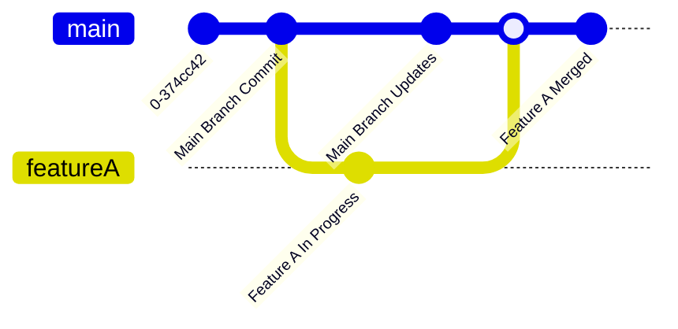
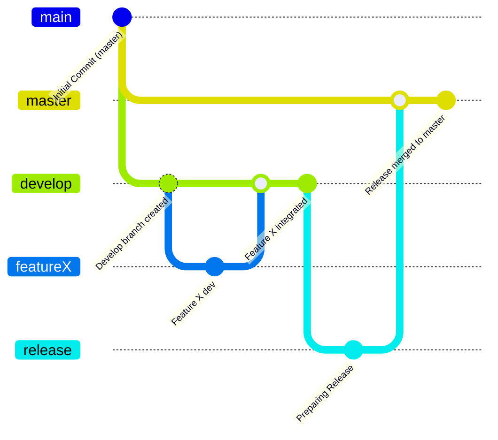
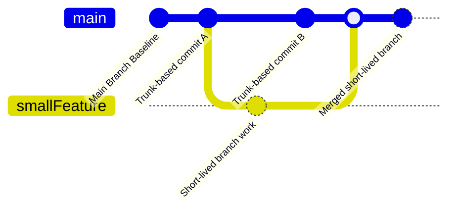
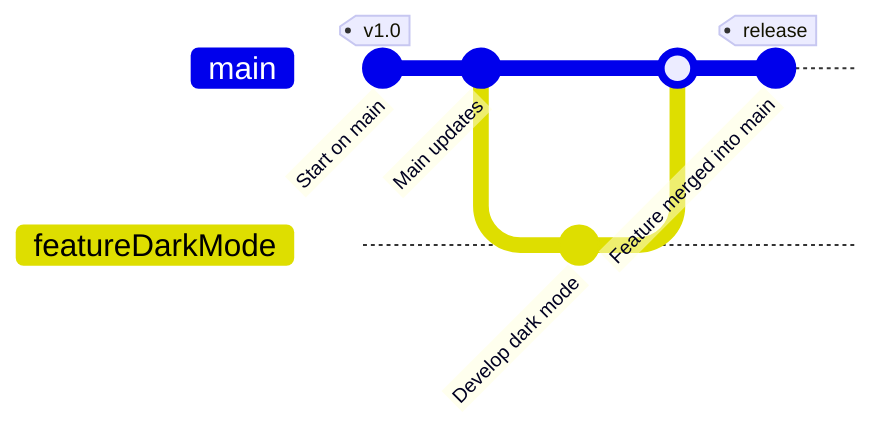
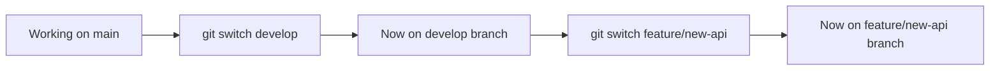
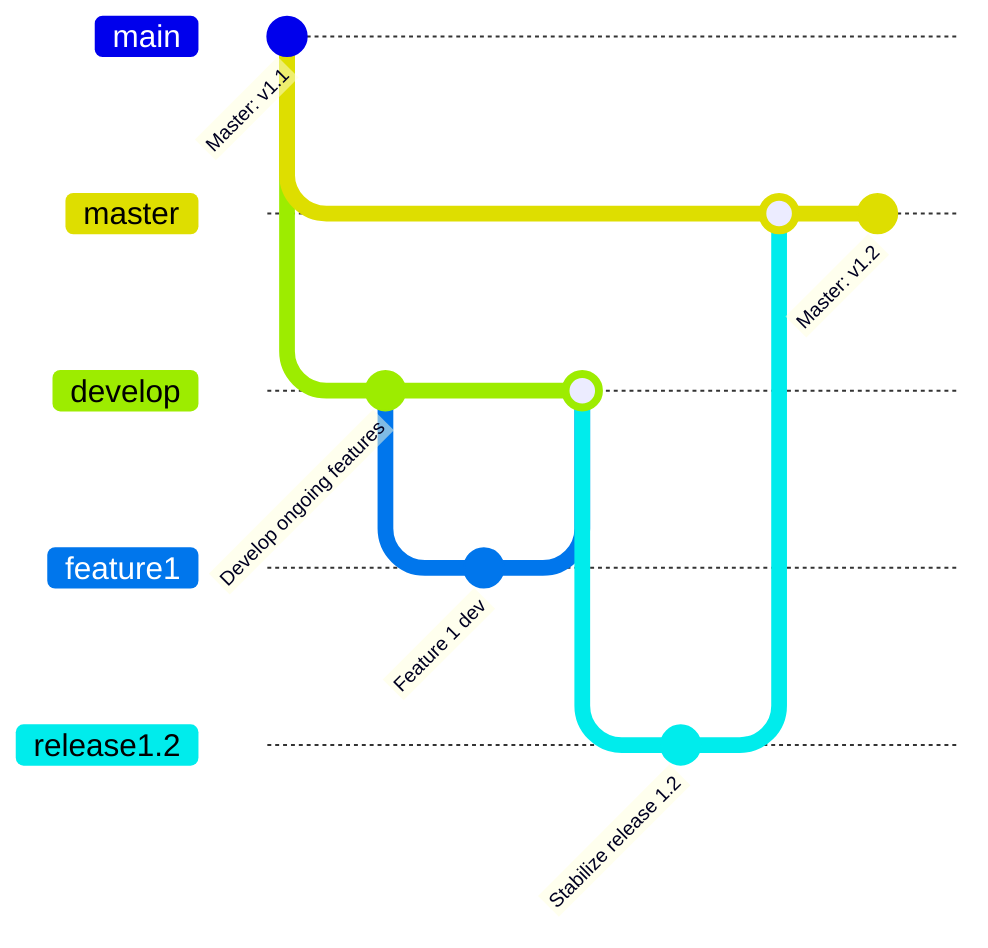
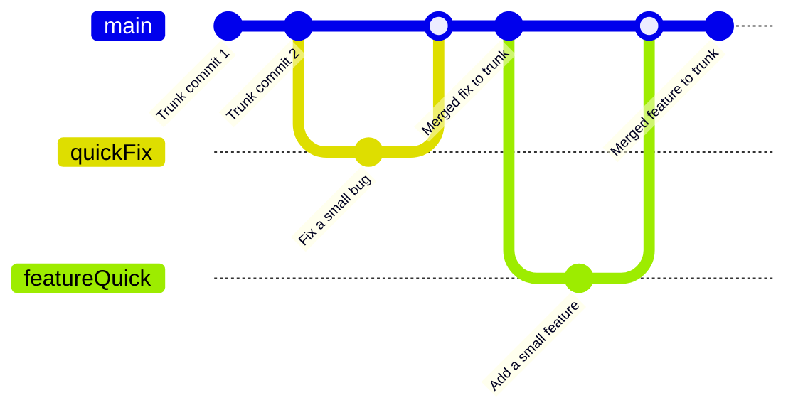
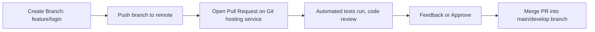
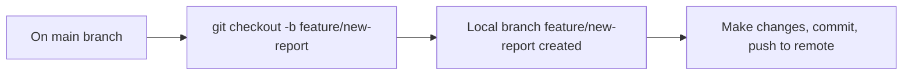
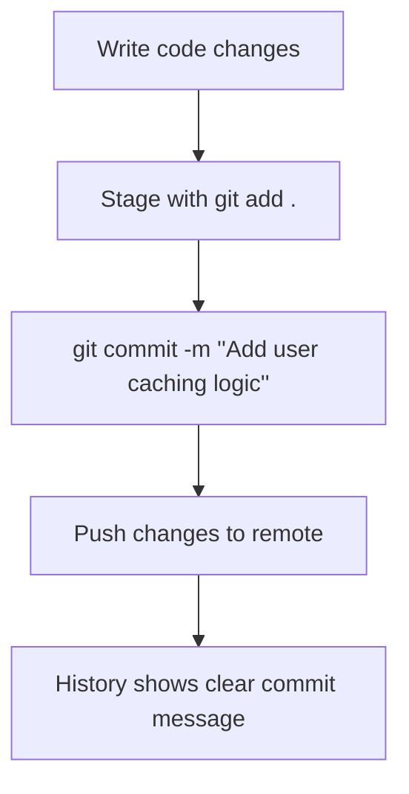

# **Git Branching Strategies & Workflows: Comprehensive Learning Resource**  
### (Days 3-4)

This document transforms the basic question-answer format into a **complete educational resource** covering:

- **Foundational quiz questions** about Git branching and workflows.  
- **Detailed answers** with rationale for correct choices and explanations of incorrect options.  
- **Comprehensive expansions** including branching strategy comparisons, Git commands, real-world examples, best practices, common pitfalls, DevOps perspectives, mermaid diagrams, and key takeaways.

## **Table of Contents**

- [**Git Branching Strategies \& Workflows: Comprehensive Learning Resource**](#git-branching-strategies--workflows-comprehensive-learning-resource)
    - [(Days 3-4)](#days-3-4)
  - [**Table of Contents**](#table-of-contents)
  - [**Overview of Branching Strategies**](#overview-of-branching-strategies)
  - [**Strategy Comparison Table**](#strategy-comparison-table)
  - [**Detailed Git Commands Cheatsheet**](#detailed-git-commands-cheatsheet)
  - [**Branching Decision Tree**](#branching-decision-tree)
  - [**The Quiz Questions \& Answers**](#the-quiz-questions--answers)
    - [**Question 1**](#question-1)
    - [**Question 2**](#question-2)
    - [**Question 3**](#question-3)
    - [**Question 4**](#question-4)
    - [**Question 5**](#question-5)
    - [**Question 6**](#question-6)
    - [**Question 7**](#question-7)
    - [**Question 8**](#question-8)
    - [**Question 9**](#question-9)
    - [**Question 10**](#question-10)
  - [**Additional Team Collaboration Guidelines**](#additional-team-collaboration-guidelines)
  - [**Common Pitfalls \& Troubleshooting in Branching**](#common-pitfalls--troubleshooting-in-branching)
  - [**Key Takeaways**](#key-takeaways)

---

## **Overview of Branching Strategies**

Git offers multiple ways to manage development work through branches. Different strategies suit different team sizes, release frequencies, and integration requirements.

1. **GitFlow**  
   - Uses dedicated branches for `develop`, `master/main`, `feature`, `release`, and `hotfix`.  
   - Ideal for structured release cycles.  
   - Clearly separates ongoing development in `develop` from stable production code in `master/main`.

2. **Trunk-Based Development**  
   - Emphasizes a single main branch (the “trunk”).  
   - Developers create short-lived feature branches, merge them back rapidly.  
   - Aligns well with continuous integration and continuous delivery (CI/CD).

3. **Feature Branch Workflow**  
   - Each new feature or fix is developed in its own branch.  
   - Suitable for teams that want straightforward isolation of features.  
   - Merges typically happen into a primary `develop` or `main` branch.

4. **GitHub Flow**  
   - A simplified approach using only `main` (or `master`) and short-lived feature branches.  
   - Pull requests from feature branches are merged back into `main` after review.  
   - Streamlined for small teams and continuous deployment.

---

## **Strategy Comparison Table**

| **Strategy**            | **Key Branches**                         | **Pros**                                                     | **Cons**                                                   | **Best For**                                                                                                   |
|-------------------------|-------------------------------------------|--------------------------------------------------------------|------------------------------------------------------------|-----------------------------------------------------------------------------------------------------------------|
| **GitFlow**            | `master/main`, `develop`, `feature`, `hotfix`, `release` | Structured release cycles, clear separation of concerns      | Can be too heavyweight for small teams, slower merges      | Medium to large projects, well-defined release schedules                                                        |
| **Trunk-Based**         | One main (trunk) branch + short-lived branches | Rapid integration, simple structure, CI/CD friendly           | Requires discipline to keep merges quick and clean         | High-velocity teams that deploy often                                                                           |
| **Feature Branch**      | One main or develop + branches per feature | Clear isolation of features, simple mental model              | Can create integration bottlenecks if branches live too long | Teams wanting moderate structure without a full GitFlow                                                          |
| **GitHub Flow**         | `main` + short-lived feature branches     | Very simple, minimal overhead                                | Minimal formal structure, can become chaotic if not managed | Small, agile teams or open-source projects that favor quick merges                                              |

---

## **Detailed Git Commands Cheatsheet**

Below is a concise reference of commonly used Git commands for **branch management**, **merging**, and **switching**:

| **Operation**            | **Command**                                  | **Description**                                      |
|--------------------------|----------------------------------------------|------------------------------------------------------|
| Create a new branch      | `git branch <branch-name>`                   | Creates a new branch without switching to it.        |
| Create & switch          | `git checkout -b <branch-name>`              | Creates and checks out a new branch immediately.     |
| Switch to existing branch| `git switch <branch-name>` or `git checkout <branch-name>` | Moves your working directory to an existing branch. |
| Merge a branch           | `git merge <branch-name>`                    | Merges the specified branch into your current branch.|
| Delete a branch          | `git branch -d <branch-name>`                | Safely deletes a branch (if merged).                 |
| Force branch deletion    | `git branch -D <branch-name>`                | Deletes a branch regardless of merge status.         |
| View branches            | `git branch` or `git branch --list`          | Displays local branch list.                          |
| Push branch to remote    | `git push -u origin <branch-name>`           | Pushes new branch to remote, setting up tracking.    |
| Pull changes             | `git pull`                                   | Fetches and merges remote branch into local.         |

---

## **Branching Decision Tree**

Use this **decision tree** to determine which branching strategy might fit your scenario:

```
                           +------------------------------+
                           |   Do you have frequent       |
                           |   production deployments?    |
                           +---------------+--------------+
                                           |
                        Yes ---------------------------------> Trunk-Based or GitHub Flow
                                           |
                        No  ---------------------------------> GitFlow or Feature Branch Workflow
```

- **Frequent Deployments & CI/CD** → Consider **Trunk-Based** or **GitHub Flow**.  
- **Less Frequent, Structured Releases** → **GitFlow** or a more traditional **Feature Branch** approach.

---

## **The Quiz Questions & Answers**  

Below are the 10 quiz questions (Days 3-4) with an enhanced structure for deeper learning:

---

### **Question 1**  
**Question:** What is the main advantage of using branching strategies in Git?  
- A) Eliminates the need for code testing.  
- B) Allows multiple developers to work simultaneously without conflicts.  
- C) Automatically merges all code changes.  
- D) Reduces the number of commits.  

**Answer Overview:**  
The main advantage of Git branching is enabling parallel development without developers stepping on each other’s toes. This isolation avoids conflicts and confusion in shared codebases.

**Why Other Options Are Incorrect:**  
- **A:** Branching does not eliminate testing responsibilities.  
- **C:** Automatic merges still require manual or CI-based intervention.  
- **D:** Branching does not inherently reduce commits; it structures them.  

**Detailed Explanation:**  
Git branches create safe "workspaces" for developers to implement features or fixes. Each branch can be merged back into the main codebase after proper testing and review, preventing conflicts and promoting clean, organized histories.

**Branching Strategy Comparison:**  
- **GitFlow:** Parallel feature branches into `develop`, controlling integration.  
- **Trunk-Based:** All changes funnel quickly back into one trunk branch.  
- **Feature Branch:** Each feature has its own branch to avoid stepping on others.  
- **GitHub Flow:** Short-lived feature branches to keep development fluid.  

**Command Reference:**  
- `git checkout -b feature/new-ui` – Create and switch to a new branch for a new UI feature.  
- `git switch main` – Move back to the main branch once your feature is done.

**Real-World Scenario:**  
A team of 5 developers each works on separate features. With branches, they develop in parallel, merging only when ready, ensuring they don’t break each other’s work in the main branch.

**Implementation Example:**  
1. Developer A runs `git checkout -b feature/auth`.  
2. Developer B runs `git checkout -b feature/dashboard`.  
3. They each push to remote with `git push -u origin feature/...`.  
4. After testing, they open pull requests to merge into `develop` or `main`.

**Best Practices:**  
- Keep branches short-lived and focused.  
- Regularly merge or rebase from the main branch to avoid drift.  
- Use pull requests for reviews and discussions.  
- Automate testing to detect conflicts early.  
- Document branch naming conventions (e.g., `feature/`, `bugfix/`).  
- Encourage frequent commits to keep changes small.

**Common Pitfalls**  

| **Pitfall**              | **Issue**                                                        | **Better Approach**                                                    |
|--------------------------|------------------------------------------------------------------|------------------------------------------------------------------------|
| Long-lived feature branch| Becomes stale, merges are painful                                | Merge/rebase often or keep feature branches short                      |
| Lack of testing          | Defects introduced due to untested merges                        | Always test/CI before merging                                          |
| Poor naming convention   | Confusion over branch purpose                                    | Adopt a consistent naming scheme (e.g., `feature/XYZ`)                 |

**DevOps Perspective:**  
Branching strategies align with CI/CD pipelines by isolating changes and allowing quick integration and testing. It reduces bottlenecks in continuous integration processes.

**Visual Representation (Mermaid Diagram):**  


**Key Takeaways:**  
- Branches enable parallel, conflict-free development.  
- Testing remains essential; branches don’t automate merges or bug detection.  
- Frequent merges or rebases reduce integration headaches.  

---

### **Question 2**  
**Question:** In GitFlow, what is the purpose of the `develop` branch?  
- A) To deploy code directly to production.  
- B) To develop and integrate new features.  
- C) For hotfixes only.  
- D) To test production-ready code.  

**Answer Overview:**  
`develop` is the central branch where new features are integrated before they are prepared for release. It acts as the primary work-in-progress branch in GitFlow.

**Why Other Options Are Incorrect:**  
- **A:** Production deployments flow from `master/main`, not directly from `develop`.  
- **C:** Hotfixes typically branch off from `master/main`.  
- **D:** Production-ready code is usually tested on `release` branches (then merged to `master`).  

**Detailed Explanation:**  
GitFlow segregates ongoing work in `develop`, which is always in a state of readiness for the next release. Once features are merged into `develop` and tested, a `release` branch can be created. Upon release completion, the release merges back into both `master/main` (for deployment) and `develop` (to keep history aligned).

**Branching Strategy Comparison:**  
- **GitFlow:** The `develop` branch is a staging area for all integrated features.  
- **Trunk-Based:** No distinct `develop` branch; continuous merges directly into main.  
- **Feature Branch:** Typically merges into `develop` or main, but no separate `develop` concept is mandated.  
- **GitHub Flow:** Just a `main` branch with short-lived feature branches.

**Command Reference:**  
- `git checkout develop` – Move to the develop branch to integrate new features.  
- `git checkout -b feature/new-api develop` – Start a feature branch from `develop`.

**Real-World Scenario:**  
A company using GitFlow for a monthly release cycle merges all developer features into `develop`. Integration tests run nightly, ensuring features are stable before creating a `release` branch.

**Implementation Example:**  
1. `git checkout develop` – Switch to `develop`.  
2. `git pull` – Ensure up-to-date with the remote.  
3. `git checkout -b feature/payment-refactor` – Start a new feature branch.  
4. After feature completion, `git merge feature/payment-refactor` into `develop`.

**Best Practices:**  
- Treat `develop` as an integration hub, not a dumping ground.  
- Keep `develop` stable by testing merges before pushing.  
- Use release branches to finalize versions before merging into `master`.  
- Tag releases in `master` or `main`.  
- Document your GitFlow process in your team’s wiki.  
- Use version numbers in branch or tag names for clarity.

**Common Pitfalls**  

| **Pitfall**                | **Issue**                                          | **Better Approach**                                                                                   |
|----------------------------|----------------------------------------------------|-------------------------------------------------------------------------------------------------------|
| Neglecting branch hygiene  | Large, untested merges to `develop`                | Ensure smaller, frequent merges from feature branches + automated tests                               |
| Confusion about hotfixes   | Applying hotfixes in `develop` instead of `master` | Create `hotfix` branches from `master`, merge into `master` & `develop` after verification            |
| Delayed merges             | Overgrown feature branches that break `develop`    | Merge or rebase with `develop` frequently to avoid major integration conflicts                        |

**DevOps Perspective:**  
`develop` integrates well with CI tools, letting teams test newly merged features in a near-release environment. This fosters continuous integration without risking the production branch.

**Visual Representation (Mermaid Diagram):**  


**Key Takeaways:**  
- `develop` is the backbone of feature integration in GitFlow.  
- Release branches solidify production candidates.  
- Keep `develop` stable with frequent merges and tests.  

---

### **Question 3**  
**Question:** Which workflow is best suited for continuous integration and frequent deployments?  
- A) GitFlow Workflow  
- B) Trunk-Based Development  
- C) Feature Branch Workflow  
- D) Release Branch Workflow  

**Answer Overview:**  
Trunk-Based Development fits best with frequent deploys because it emphasizes rapid integration into a single trunk (main branch), supporting a streamlined CI/CD pipeline.

**Why Other Options Are Incorrect:**  
- **A:** GitFlow is more structured and not ideal for constant merges/deploys.  
- **C:** Feature Branch can work often, but without discipline can slow frequent releases.  
- **D:** Release Branch Workflow implies discrete release phases, not ongoing deployment.  

**Detailed Explanation:**  
Trunk-Based Development fosters a culture of continuous integration. Developers commit small, incremental changes directly to `main` (or via very short-lived branches). Frequent merges ensure the codebase is always in a deployable state.

**Branching Strategy Comparison:**  
- **GitFlow:** Best for teams with defined release cycles, not continuous daily deploys.  
- **Trunk-Based:** Minimal overhead, continuous merges keep production always near release.  
- **Feature Branch:** Good isolation, but can accumulate changes and cause integration delays if branches live too long.  
- **GitHub Flow:** Also suitable for frequent deploys, though typically simpler than trunk-based.

**Command Reference:**  
- `git checkout main` – Work on main or short-lived branch from main.  
- `git commit -m "Small incremental update"` – Keep commits small and frequent.  
- `git push origin main` – Deploy quickly after automated tests pass.

**Real-World Scenario:**  
A startup with daily deployments uses trunk-based: each developer commits or merges to `main` multiple times a day, triggering automated tests and deployments upon every push.

**Implementation Example:**  
1. Create a small feature branch: `git checkout -b fix/logo-alignment main`.  
2. Make quick changes; run local tests.  
3. Merge back into `main` the same day using a pull request.  
4. CI/CD pipeline automatically tests and deploys the updated main branch.

**Best Practices:**  
- Avoid large, long-lived feature branches.  
- Maintain a stable main branch at all times.  
- Automate tests to catch conflicts or regressions early.  
- Encourage frequent commits for smaller, reviewable changes.  
- Communicate changes in daily stand-ups or Slack channels.  
- Deploy from `main` (or trunk) after successful CI checks.

**Common Pitfalls**  

| **Pitfall**           | **Issue**                                     | **Better Approach**                                                |
|-----------------------|-----------------------------------------------|--------------------------------------------------------------------|
| Monolithic commits    | Large commits hamper quick merges and reviews | Keep commits small for easy reverts and reviews                    |
| Skipping code review  | Unreviewed direct merges risk production bugs | Use quick PR reviews or pair programming before merging            |
| Broken trunk          | Committing untested changes breaks main       | Automate test suites & require tests pass before merging           |

**DevOps Perspective:**  
Trunk-Based aligns closely with continuous delivery. Code is always in a releasable state, facilitating quick feedback, easy rollbacks, and high agility.

**Visual Representation (Mermaid Diagram):**  


**Key Takeaways:**  
- Trunk-Based thrives on frequent, small merges.  
- Ideal for continuous integration and rapid deployment.  
- Requires disciplined collaboration to keep the trunk stable.  

---

### **Question 4**  
**Question:** What is the recommended lifecycle of a feature branch?  
- A) Maintained indefinitely.  
- B) Deleted after merging into the main branch.  
- C) Kept active permanently for future enhancements.  
- D) Immediately pushed to production.  

**Answer Overview:**  
Feature branches are typically short-lived and should be deleted once merged to the main branch. This avoids clutter and confusion in the repo.

**Why Other Options Are Incorrect:**  
- **A:** Indefinitely maintaining feature branches invites confusion and merge conflicts.  
- **C:** Future enhancements can be new branches rather than keeping old ones open.  
- **D:** You should test and merge before shipping to production.  

**Detailed Explanation:**  
Keeping feature branches ephemeral is a best practice in many workflows. They exist only long enough to implement and test a feature. Once integrated into the target branch (e.g., `develop` or `main`), the feature branch becomes unnecessary and can be safely deleted.

**Branching Strategy Comparison:**  
- **GitFlow:** Feature branches merge into `develop`, then are removed.  
- **Trunk-Based:** Short-lived branches, typically removed within hours or days.  
- **Feature Branch Workflow:** Encourages a separate branch for each feature, removed upon merge.  
- **GitHub Flow:** Create a feature branch for each feature/fix, merge via pull request, then delete.

**Command Reference:**  
- `git checkout feature/my-cool-feature` – Work on the feature.  
- `git checkout main` and `git merge feature/my-cool-feature` – Merge changes.  
- `git branch -d feature/my-cool-feature` – Delete branch if merged.

**Real-World Scenario:**  
A developer implements a “dark mode” feature. After merging and confirming it in staging, the feature branch is no longer needed. Deleting it helps keep the repo tidy.

**Implementation Example:**  
1. `git checkout -b feature/dark-mode` – Start the branch.  
2. Develop & test.  
3. `git commit -m "Add dark mode CSS and toggle"` – Commit changes.  
4. Open pull request, merge into `main`.  
5. `git branch -d feature/dark-mode` – Delete after successful merge.

**Best Practices:**  
- Always delete stale branches to keep repository clean.  
- Merge or rebase from main to minimize merge conflicts.  
- Use descriptive names (e.g., `feature/issue-42-dark-mode`).  
- Tag significant releases before merging.  
- Document each feature’s scope in the pull request.  
- Ensure thorough testing before merging.

**Common Pitfalls**  

| **Pitfall**             | **Issue**                                                               | **Better Approach**                                               |
|-------------------------|-------------------------------------------------------------------------|-------------------------------------------------------------------|
| Stale branches          | Hard to track which branches are active or merged                       | Regularly review and delete merged branches                       |
| Merging incomplete code | Integrates half-finished work into main                                 | Mark incomplete features as draft PRs or use feature toggles       |
| Conflicting changes     | Long-lived branches drift from main                                     | Rebase or merge main frequently or keep branch duration short     |

**DevOps Perspective:**  
Short-lived branches mean fewer long-running divergences, streamlining CI/CD pipelines and reducing integration complexity.

**Visual Representation (Mermaid Diagram):**  


**Key Takeaways:**  
- Keep feature branches short-lived to avoid merge nightmares.  
- Deleting merged branches maintains a clean repository.  
- Frequent merges align with agile and DevOps best practices.  

---

### **Question 5**  
**Question:** Which command is used to switch to an existing branch?  
- A) `git branch <branch-name>`  
- B) `git checkout -b <branch-name>`  
- C) `git switch <branch-name>`  
- D) `git merge <branch-name>`  

**Answer Overview:**  
`git switch <branch-name>` (or `git checkout <branch-name>`) moves you to an existing branch without creating a new one.

**Why Other Options Are Incorrect:**  
- **A:** Creates or lists branches but doesn’t switch to them.  
- **B:** Creates and switches to a *new* branch.  
- **D:** Merges another branch into your current one, not switching.  

**Detailed Explanation:**  
Git introduced `git switch` as a more intuitive alternative to `git checkout` for switching branches. `checkout` historically combined multiple functionalities. If you want to switch to a branch that already exists, `git switch` or `git checkout <branch-name>` is correct.

**Branching Strategy Comparison:**  
- Regardless of GitFlow, Trunk-Based, or Feature Branch strategies, you often switch branches frequently.  
- **GitFlow:** Switch between `develop`, `feature`, `release`, etc.  
- **Trunk-Based:** Switch or create short-lived branches from main frequently.  
- **GitHub Flow:** Regularly switch to a new feature branch or back to `main`.

**Command Reference:**  
- `git switch <branch-name>` – Move to an existing branch.  
- `git checkout <branch-name>` – The older, multipurpose way.

**Real-World Scenario:**  
A developer has multiple active branches for different small tasks. They frequently switch between them using `git switch branchA` or `git switch branchB`.

**Implementation Example:**  
1. `git branch` – See a list of branches.  
2. `git switch develop` – Move to the `develop` branch.  
3. After finishing your work, `git switch main` – Return to `main`.

**Best Practices:**  
- Keep your working copy clean before switching (commit or stash changes).  
- Use clear branch names to know which to switch to.  
- If your Git version doesn’t support `git switch`, use `git checkout <branch>`.  
- Verify the correct branch with `git status`.  
- Update branch from remote if needed before switching.  
- Use commands like `git stash` if you must switch with uncommitted changes.

**Common Pitfalls**  

| **Pitfall**        | **Issue**                                                 | **Better Approach**                                      |
|--------------------|-----------------------------------------------------------|----------------------------------------------------------|
| Unstaged changes   | Switching branches can lead to conflicts or overwritten files | Commit or stash before switching branches                |
| Confusing branch names | Hard to remember which branch does what               | Adopt consistent naming conventions (e.g., feature/XYZ ) |

**DevOps Perspective:**  
Efficient branching and context switching speed up development cycles. Proper switching ensures you’re always working in the correct environment for CI/CD pipelines.

**Visual Representation (Mermaid Diagram):**  


**Key Takeaways:**  
- `git switch <branch-name>` is the modern command for switching branches.  
- Always commit or stash to avoid losing work.  
- Proper switching is critical for seamless multi-branch workflows.  

---

### **Question 6**  
**Question:** In GitFlow, which branch is used specifically for production-ready releases?  
- A) `master` (or `main`)  
- B) `develop`  
- C) `feature`  
- D) `hotfix`  

**Answer Overview:**  
In GitFlow, `master` (or `main`) is for stable, production-ready code. New releases are tagged and pushed to `master/main`.

**Why Other Options Are Incorrect:**  
- **B:** `develop` is for integration of ongoing changes.  
- **C:** `feature` branches are for individual feature development.  
- **D:** `hotfix` is for urgent bug fixes off `master/main`.  

**Detailed Explanation:**  
Under GitFlow, once a release branch is finalized, it merges into `master/main` to denote the official production version. Tags (e.g., `v1.2.0`) are applied to these merges for clarity.

**Branching Strategy Comparison:**  
- **GitFlow:** Strict separation of production code (`master`) from ongoing development (`develop`).  
- **Trunk-Based:** No special production branch. The trunk is always production-ready.  
- **Feature Branch:** Does not inherently define production release branches.  
- **GitHub Flow:** Typically merges into `main` for production.

**Command Reference:**  
- `git checkout master` – Access the production-ready branch.  
- `git merge release/x.y` – Finalize a release from a release branch.  
- `git tag v1.2.0` – Tag the final production version.

**Real-World Scenario:**  
After finishing a release branch, the team merges it into `master`, tags it with the release version, and deploys to production. The same release branch is also merged back into `develop` to keep all updates aligned.

**Implementation Example:**  
1. `git checkout release/1.2.0` – The release branch.  
2. Finalize, test, then `git checkout master`.  
3. `git merge release/1.2.0` – Merge into production.  
4. `git tag v1.2.0 && git push --tags` – Tag and push the release.

**Best Practices:**  
- Only production-ready code goes into `master/main`.  
- Keep release branches short-lived; integrate them quickly.  
- Tag every production release for traceability.  
- Document release notes or changes in your repository or wiki.  
- Merge back into `develop` to ensure no changes are lost.  
- Automate release builds/tests on `master/main` merges.

**Common Pitfalls**  

| **Pitfall**                    | **Issue**                                     | **Better Approach**                                             |
|--------------------------------|-----------------------------------------------|-----------------------------------------------------------------|
| Mixing unstable code in master | Production code gets contaminated with incomplete features | Keep incomplete work in `develop` or feature branches           |
| Skipping release tags          | Hard to track which commit correlates to which version    | Tag every release (e.g., `v1.2.0`)                              |
| Forgetting to merge back to develop | Drift between branches if new changes remain only in master | Merge release branch into both `master` and `develop`           |

**DevOps Perspective:**  
Having a dedicated production branch (`master/main`) helps maintain a predictable CI/CD pipeline for final releases. Monitoring tools and deployment scripts often rely on merges or tags on `master/main` as triggers.

**Visual Representation (Mermaid Diagram):**  


**Key Takeaways:**  
- `master/main` is the stable, production-ready branch in GitFlow.  
- Tag your releases for clear versioning.  
- Keep your release process consistent and documented.  

---

### **Question 7**  
**Question:** What characteristic best describes trunk-based development?  
- A) Long-lived feature branches.  
- B) Frequent direct commits to a single main branch.  
- C) Multiple release branches.  
- D) Isolated integration of code.  

**Answer Overview:**  
Trunk-Based Development emphasizes continuous, frequent commits to a single main branch (the “trunk”), reducing the complexity of parallel, long-lived branches.

**Why Other Options Are Incorrect:**  
- **A:** Trunk-based discourages long-running branches.  
- **C:** Usually no separate release branches, or they’re short-lived.  
- **D:** Integration is frequent and collaborative, not isolated.  

**Detailed Explanation:**  
The hallmark of Trunk-Based Development is that developers merge early and often into the trunk. Short-lived feature branches may be created, but they’re merged quickly—often multiple times per day—keeping the trunk perpetually releasable.

**Branching Strategy Comparison:**  
- **GitFlow:** Encourages multiple long-lived branches (`develop`, `release`, etc.).  
- **Trunk-Based:** Minimizes branch overhead; the trunk is always current and stable.  
- **Feature Branch:** More flexible, but can accumulate changes if branches live too long.  
- **GitHub Flow:** Somewhat similar to trunk-based but usually merges via pull requests to `main`.

**Command Reference:**  
- `git checkout main` – Work directly on main or short-lived branch.  
- `git commit -m "Tiny commit to fix bug"` – Keep commits small.  
- `git merge fix/bug-123` – Merge short-lived fix branch quickly.

**Real-World Scenario:**  
A SaaS company pushes updates to production multiple times daily. Each developer merges small changes into `main` as soon as they pass local tests, triggering a CI/CD pipeline that can deploy instantly.

**Implementation Example:**  
1. `git checkout -b fix/login-delay main`  
2. Make small fix, test it.  
3. `git checkout main && git merge fix/login-delay` – Merge in the same day.  
4. Automated tests pass → Deploy.

**Best Practices:**  
- Merge small, incremental changes to maintain a stable trunk.  
- Use feature flags to hide incomplete features.  
- Rely on robust automated testing to prevent regressions.  
- Communicate frequently to avoid collisions.  
- Perform code reviews rapidly to prevent blockers.  
- Encourage a culture of continuous improvement and integration.

**Common Pitfalls**  

| **Pitfall**                 | **Issue**                                    | **Better Approach**                                               |
|-----------------------------|----------------------------------------------|-------------------------------------------------------------------|
| Lack of automation          | Breaks trunk if tests aren’t automated       | Implement comprehensive CI testing for each commit                |
| Large, unreviewed commits   | Harder to isolate bugs or revert changes     | Keep commits small and regularly reviewed                         |
| Inconsistent commit patterns| Some devs create long feature branches       | Align on trunk-based discipline and short-lived branch usage      |

**DevOps Perspective:**  
Trunk-Based Development is a cornerstone of modern DevOps practices, enabling continuous delivery and faster feedback loops.

**Visual Representation (Mermaid Diagram):**  


**Key Takeaways:**  
- Trunk-Based focuses on a continuously releasable main branch.  
- Short-lived branches and small, frequent merges are crucial.  
- Automated testing is essential to maintain trunk stability.  

---

### **Question 8**  
**Question:** What’s a primary purpose of creating pull requests?  
- A) Immediate deployment of changes.  
- B) Avoiding code review processes.  
- C) Facilitating code review and discussion.  
- D) Automatic conflict resolution.  

**Answer Overview:**  
Pull requests (PRs) enable a structured way to review code, discuss changes, and ensure quality before merging into the main codebase.

**Why Other Options Are Incorrect:**  
- **A:** PRs don’t directly deploy code; deployment often occurs post-merge.  
- **B:** PRs encourage code review, not avoid it.  
- **D:** Conflicts can be flagged but not automatically resolved by PRs.  

**Detailed Explanation:**  
A pull request shows changes in a feature branch and invites teammates to comment, suggest improvements, and approve or reject the merge. It’s a key mechanism for maintaining quality and knowledge sharing in collaborative development.

**Branching Strategy Comparison:**  
- **GitFlow:** PRs help incorporate features/hotfixes into `develop` or `release` branches.  
- **Trunk-Based:** Quick PR reviews are possible but merges happen rapidly.  
- **Feature Branch & GitHub Flow:** Pull requests are fundamental for merging features.

**Command Reference:**  
- **GitHub/GitLab**: Create PRs via the web UI or CLI tools.  
- `git fetch && git merge` – Merge locally after PR is approved.  
- `gh pr create` – GitHub CLI for creating a pull request (optional tool).

**Real-World Scenario:**  
Developer A implements a new login system. Developer B reviews the PR, requests minor changes, and ensures no conflicts. After approval, the PR merges, and the new login system is integrated.

**Implementation Example:**  
1. Developer A pushes `feature/login-refactor` to GitHub.  
2. Opens a pull request from `feature/login-refactor` to `develop`.  
3. Team members review, comment, request changes.  
4. Once approved, the PR merges automatically or manually by the repository maintainer.

**Best Practices:**  
- Keep PRs small for easier reviews.  
- Provide clear descriptions and rationale for changes.  
- Assign reviewers with domain knowledge.  
- Use CI checks to validate each PR before merging.  
- Keep a consistent PR template to standardize information.  
- Encourage constructive feedback and knowledge sharing.

**Common Pitfalls**  

| **Pitfall**                | **Issue**                               | **Better Approach**                                           |
|----------------------------|-----------------------------------------|---------------------------------------------------------------|
| Massive PRs                | Overwhelming to review in one go        | Break large changes into smaller, more focused PRs            |
| No automated checks        | Manual reviews miss regressions         | Integrate CI tests and lint checks triggered by the PR        |
| Ignoring requested changes | PR merges without addressing feedback   | Ensure requested changes are resolved or discussed before merge |

**DevOps Perspective:**  
Pull requests act as a gate in the CI/CD pipeline, ensuring code quality and readiness before merging into trunk or main branches.

**Visual Representation (Mermaid Diagram):**  


**Key Takeaways:**  
- PRs facilitate peer review and knowledge sharing.  
- They do not replace testing but enhance collaboration.  
- Keep PRs small, descriptive, and regularly updated.  

---

### **Question 9**  
**Question:** In Git, how do you create and switch immediately to a new branch?  
- A) `git branch <branch-name>`  
- B) `git checkout <branch-name>`  
- C) `git checkout -b <branch-name>`  
- D) `git switch --create <branch-name>`  

**Answer Overview:**  
`git checkout -b <branch-name>` both creates a new branch and checks it out in a single command (newer Git versions also support `git switch -c <branch-name>`).

**Why Other Options Are Incorrect:**  
- **A:** Creates but doesn’t switch.  
- **B:** Switches only if `<branch-name>` already exists.  
- **D:** `--create` is a valid concept but the syntax is typically `-c <branch-name>` rather than `--create`.  

**Detailed Explanation:**  
This question highlights a commonly used shortcut for branch creation. Rather than running two commands (`git branch x` then `git checkout x`), one can do both at once. Modern Git also offers `git switch -c <branch-name>` with the same effect.

**Branching Strategy Comparison:**  
- Applies to all workflows: frequently needed to start feature or fix branches.  
- In GitFlow, you might create `git checkout -b feature/my-feature develop`.  
- In Trunk-Based, you do `git checkout -b fix/short-lived main`.  
- In GitHub Flow, typical usage is also `git checkout -b feature/whatever`.

**Command Reference:**  
- `git checkout -b <branch-name>` – Classic method.  
- `git switch -c <branch-name>` – Newer approach for Git versions supporting `switch`.

**Real-World Scenario:**  
A developer sees a minor bug while working on `main`. They create a new branch with `git checkout -b fix/minor-bug` so that the fix remains isolated.

**Implementation Example:**  
1. `git checkout main` – Ensure you start from the right base branch.  
2. `git checkout -b feature/add-analytics` – Create + switch.  
3. `git push -u origin feature/add-analytics` – Publish to remote once ready.

**Best Practices:**  
- Base your new branch on the branch that contains the relevant changes (e.g., `develop` in GitFlow).  
- Pull latest changes before creating a new branch to avoid conflicts.  
- Choose descriptive branch names for clarity.  
- Keep your working directory clean to avoid mixing unrelated changes.  
- Tag or note your branch purpose for reference.  
- Merge or rebase frequently to stay in sync.

**Common Pitfalls**  

| **Pitfall**               | **Issue**                                     | **Better Approach**                                          |
|---------------------------|-----------------------------------------------|--------------------------------------------------------------|
| Wrong base branch         | Creating a feature branch off old code leads to conflicts | Ensure you are up to date with `main` or `develop` beforehand |
| Forgotten remote tracking | Creating local branch but never pushing remote | Use `git push -u origin branch` to set upstream tracking     |

**DevOps Perspective:**  
Branch creation is the first step to implementing a new feature or fix in a CI/CD environment. Clear, quick branch creation fosters consistent workflows.

**Visual Representation (Mermaid Diagram):**  


**Key Takeaways:**  
- `git checkout -b <branch-name>` is a time saver for creating + switching.  
- Remember to choose the correct base branch.  
- Keep your local environment updated before creating new branches.  

---

### **Question 10**  
**Question:** Why is writing descriptive commit messages considered a best practice?  
- A) It speeds up automatic merges.  
- B) It removes the need for branching.  
- C) It provides context and clarity for changes.  
- D) It automatically resolves conflicts.  

**Answer Overview:**  
Clear commit messages inform teammates (and your future self) about the purpose and scope of each change, aiding maintainability and collaboration.

**Why Other Options Are Incorrect:**  
- **A:** The speed of merges depends on code readiness, not commit message length.  
- **B:** Branching strategies remain necessary for parallel development.  
- **D:** Conflicts require manual or tool-assisted resolution, not commit messages.  

**Detailed Explanation:**  
A well-written commit message explains the “why” behind changes, not just the “what.” This is essential for teams to understand how the code evolved over time. It’s especially useful during code reviews, debugging, or historical audits.

**Branching Strategy Comparison:**  
- All strategies benefit from descriptive commit messages.  
- **GitFlow:** More commits merge into `develop` and eventually `master`, so clarity is key.  
- **Trunk-Based:** Frequent commits make thorough messages even more vital.  
- **GitHub Flow:** Commit messages provide review context in PRs.

**Command Reference:**  
- `git commit -m "Fix null pointer in login component by checking user object presence"` – Example descriptive message.  
- `git commit` (without `-m`) – Launches an editor for a more detailed summary and body.

**Real-World Scenario:**  
When investigating a bug introduced months ago, a developer checks commit logs. Detailed messages help pinpoint which change might have caused the regression.

**Implementation Example:**  
1. Stage changes: `git add .`  
2. `git commit` – Provide a commit message body describing the fix or feature.  
3. Optionally use references to issues or tickets: “Fixes #123: Implemented user profile caching.”

**Best Practices:**  
- Write messages in an imperative tone (“Fix issue” instead of “Fixed issue”).  
- Include a short summary (50 chars or less), then a blank line, then details.  
- Reference relevant issue or ticket numbers.  
- Explain the reason for changes, not just the changes themselves.  
- Align with your team’s commit message conventions.  
- Rebase or squash merges to maintain a clean history if needed.

**Common Pitfalls**  

| **Pitfall**                      | **Issue**                                                 | **Better Approach**                                            |
|----------------------------------|-----------------------------------------------------------|----------------------------------------------------------------|
| Vague commit messages            | Hard to decipher the purpose of changes                  | Include what changed and **why**                               |
| Overly long single-line messages | Might not parse well in tools or summary logs            | Keep summary short, add details in body if needed              |
| Not referencing issues           | Lacks context for bug trackers or feature requests       | Use “Refs #XYZ” or “Fixes #XYZ” to link commits to issues       |

**DevOps Perspective:**  
In continuous delivery pipelines, commit messages help trace changes through build, test, and deployment stages. Clear context accelerates debugging and auditing.

**Visual Representation (Mermaid Diagram):**  


**Key Takeaways:**  
- Descriptive commit messages communicate intent and history.  
- They don’t speed merges or solve conflicts automatically.  
- A consistent commit message style fosters better collaboration.  

---

## **Additional Team Collaboration Guidelines**

- **Use Chat Tools & Stand-Ups**: Ensure developers coordinate who’s working on what branch to avoid duplication.  
- **Define Clear Roles**: E.g., who merges PRs, who reviews, etc.  
- **Document Everything**: Keep a central knowledge base of branch naming, release schedules, and responsibilities.  
- **Leverage Automation**: Automate tests, linting, and basic security checks on every push/PR.  

---

## **Common Pitfalls & Troubleshooting in Branching**

| **Pitfall**                 | **Troubleshooting**                             | **Solution**                                              |
|-----------------------------|------------------------------------------------|-----------------------------------------------------------|
| Merge Conflicts             | “Merge conflict” error when integrating code   | Manually resolve conflict in files, commit resolution     |
| Divergent Histories         | Local branch behind remote, cause push fails   | `git pull --rebase` or merge remote changes, then push    |
| Lost Commits                | Accidental reset or forced push overwrites changes | Regularly pull before pushing, avoid force-push unless sure |

- If you accidentally commit to the wrong branch, use `git stash` or `git cherry-pick` to move commits.  
- For large merges, do them often in smaller chunks instead of piling up code over weeks.

---

## **Key Takeaways**

1. **Branching Empowers Parallel Development**: Each developer can work without blocking others.  
2. **Choose the Right Strategy**: Use GitFlow for structured releases, Trunk-Based for frequent deploys, etc.  
3. **Short-Lived Feature Branches**: Merge early and often to avoid sprawling conflicts.  
4. **Pull Requests for Collaboration**: Enhance code quality through review and discussion.  
5. **Clear Commit Messages**: Provide context to help track, review, and debug changes in the future.  
6. **Automation & CI/CD**: Branching strategies work best with robust testing and deployment pipelines.

---

**This comprehensive resource was derived from**:
- **Quiz Questions**   
- **Quiz Answers**   
- **Transformation Prompt**   

By following these best practices, leveraging the right strategy, and maintaining strong collaboration, teams can master Git branching workflows and ensure a smooth path to continuous integration and delivery.