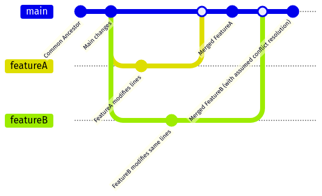
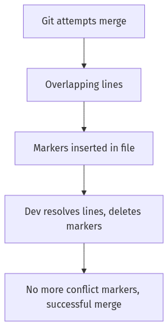
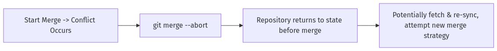
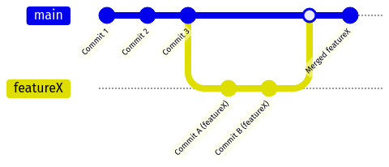
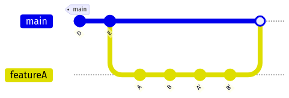
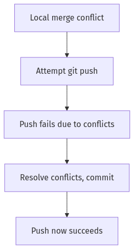

Below is a **comprehensive, transformed Git Conflict Resolution Quiz Answer Sheet** for Days 5-6. It integrates the original **quiz questions**  and **quiz answers**  with the **enhancement instructions** . This new resource is designed to provide an in-depth learning experience about **Git Conflict Resolution**, complete with real-world examples, best practices, visual diagrams, and more.

---

# **Git Conflict Resolution: Comprehensive Learning Resource**  
### (Days 5-6)

This document transforms the basic question-and-answer format into a **complete educational resource** covering:

- **Foundational quiz questions** about Git conflict resolution  
- **Detailed answers** with rationale for correct choices and incorrect options  
- **Comprehensive expansions** including conflict resolution processes, command references, real-world scenarios, best practices, visual aids, and more

## **Table of Contents**

- [**Git Conflict Resolution: Comprehensive Learning Resource**](#git-conflict-resolution-comprehensive-learning-resource)
    - [(Days 5-6)](#days-5-6)
  - [**Table of Contents**](#table-of-contents)
  - [**Core Concepts of Git Conflict Resolution**](#core-concepts-of-git-conflict-resolution)
  - [**Tool Comparison for Conflict Resolution**](#tool-comparison-for-conflict-resolution)
  - [**Behind the Scenes: How Git Manages Conflicts**](#behind-the-scenes-how-git-manages-conflicts)
  - [**Cheatsheet: Conflict Resolution Commands \& Workflows**](#cheatsheet-conflict-resolution-commands--workflows)
  - [**The Quiz Questions \& Answers**](#the-quiz-questions--answers)
    - [**Question 1**](#question-1)
    - [**Question 2**](#question-2)
    - [**Question 3**](#question-3)
    - [**Question 4**](#question-4)
    - [**Question 5**](#question-5)
    - [**Question 6**](#question-6)
    - [**Question 7**](#question-7)
    - [**Question 8**](#question-8)
    - [**Question 9**](#question-9)
    - [**Question 10**](#question-10)
  - [**Common Pitfalls \& Troubleshooting**](#common-pitfalls--troubleshooting)
  - [**Key Takeaways**](#key-takeaways)

---

## **Core Concepts of Git Conflict Resolution**

1. **Overlapping Changes**: Merge conflicts usually occur when two branches modify the same lines of code or files in ways that Git cannot automatically combine.
2. **Types of Conflicts**:
   - **Content Conflict**: Two commits change the same lines in a file differently.
   - **Rename Conflict**: A file is renamed in one branch but modified in another.
   - **Delete-Modify Conflict**: A file is deleted in one branch but modified in another.
3. **Conflict Markers**:  
   - `<<<<<<< HEAD`  
   - `=======`  
   - `>>>>>>> branch-name`
   These markers appear inside files to indicate the conflicting lines from each branch.
4. **Branch Divergence and Reconciliation**: Over time, branches drift apart with different commits. Merging (or rebasing) attempts to reconcile these differences, sometimes leading to conflicts that must be resolved manually.

---

## **Tool Comparison for Conflict Resolution**

| **Method**                   | **Approach**                    | **Pros**                                     | **Cons**                                             | **Use Case**                               |
|-----------------------------|---------------------------------|----------------------------------------------|-------------------------------------------------------|--------------------------------------------|
| **Command-Line**            | Manual editing of conflict markers in a text editor | Fine-grained control, no external dependencies | Can be slower for large conflicts; requires knowledge of file structure | Small teams or advanced users              |
| **Visual Mergetool**        | Tools like `git mergetool`, Meld, KDiff3           | Easier to see and merge code blocks visually  | Setup & usage can vary; can be tricky over SSH       | Medium to large teams needing clarity      |
| **Git GUI (e.g. gitk)**     | Graphical representation of commits                | Quickly see where conflicts are happening      | May not fully resolve conflicts—still need manual steps | Visual learners or complex repos           |
| **Rebase Conflict Handling**| `git rebase` and manual resolves | Produces linear history; fewer merge commits | Rebasing rewrites history, can confuse others if misused | Teams that want a clean, linear commit log |

---

## **Behind the Scenes: How Git Manages Conflicts**

- **Three-Way Merge Algorithm**:  
  Git compares the **common ancestor** of the branches (the base commit), along with each branch’s changes, to determine if auto-merge is possible.  
- **.git Directory**:  
  Git temporarily stores conflict snapshots (index state) while you manually resolve conflicts.  
- **Conflict Markers**:  
  Git places these markers in your working files so you can see precisely where it was unsure how to combine code.

---

## **Cheatsheet: Conflict Resolution Commands & Workflows**

1. **Basic Conflict Resolution Workflow**:
   ```
   1. git pull (or git merge branchName)     # attempt to merge
   2. Resolve conflicts in files manually
   3. git add <conflicted-file>              # mark as resolved
   4. git commit                             # finalize the merge
   ```
2. **Aborting a Merge**:
   - `git merge --abort`
3. **Using a Mergetool**:
   - `git mergetool` – Launch a configured merge resolution tool.
4. **Rebase Conflicts**:
   - `git rebase branchName`
   - Resolve conflicts
   - `git rebase --continue` or `git rebase --abort`
5. **Other Helpful Commands**:
   - `git diff --name-only --diff-filter=U` – Lists files with unresolved conflicts.
   - `git status` – Shows conflicted files under “Unmerged paths.”

---

## **The Quiz Questions & Answers**

Below are the 10 quiz questions (Days 5-6) with an enhanced structure for deeper learning into Git conflict resolution.

---

### **Question 1**  
**Question:** What causes a merge conflict in Git?  
- A) Multiple commits from the same author.  
- B) Two branches containing changes to the same lines of code.  
- C) Creating too many branches.  
- D) Pulling changes from a remote repository.  

**Answer Overview:**  
The fundamental cause of merge conflicts is **overlapping or conflicting changes** in the same lines of code across different branches.

**Why Other Options Are Incorrect:**  
- **A:** Having multiple commits from the same author does not by itself cause conflicts.  
- **C:** The number of branches alone doesn’t cause conflicts; it’s *where* changes happen.  
- **D:** Pulling changes might surface conflicts, but the *cause* is overlapping edits, not the pull itself.  

**Detailed Explanation:**  
Git merges changes by comparing the base commit with the heads of each branch. If both branches have modified the same lines in conflicting ways, Git cannot decide which version is correct. This triggers a **merge conflict**. You must manually inspect and resolve these differences.

**Conflict Resolution Process (Step-by-Step):**  
1. **Attempt Merge**: `git merge featureX` or `git pull` (which does a merge).  
2. **Identify Conflicts**: `git status` shows which files have conflicts.  
3. **Manual Edit**: Open the conflicted files, locate the `<<<<<<<`, `=======`, `>>>>>>>` markers.  
4. **Decide Correct Lines**: Retain the needed changes from each branch, remove extraneous markers.  
5. **Mark Resolved**: `git add [filename]`.  
6. **Commit**: `git commit` to finalize the resolved merge.

**Command Reference:**  
- `git status` – Lists conflicted files.  
- `git merge --abort` – Cancels the merge if it’s unmanageable.

**File Visualization:**  
```text
<<<<<<< HEAD
console.log("Feature A code");
=======
console.log("Feature B code");
>>>>>>> feature_b
```

**Real-World Scenario:**  
Two developers simultaneously modify the same lines in a config file—one changes a database URL, another changes a logging setting. When merging, Git sees these conflicting lines and flags them.

**Before/After Example:**

**Before Conflict**  
- Developer A’s line: `DB_URL="dev-server"`  
- Developer B’s line: `DB_URL="staging-server"`

**During Conflict**  
```text
<<<<<<< HEAD
DB_URL="dev-server"
=======
DB_URL="staging-server"
>>>>>>> feature/env-change
```

**After Resolution**  
```text
DB_URL="staging-server"  # Decided to use the staging-server line
```

**Best Practices:**  
- Communicate changes early if you suspect overlapping modifications.  
- Keep commits small and focused.  
- Pull or merge from main frequently to reduce divergence.  
- Use feature flags if you must integrate partial changes.  
- Document your rationale for how conflicts were resolved.  
- Test after every merge or conflict resolution step.

**Common Pitfalls**  

| **Pitfall**           | **Issue**                                       | **Better Approach**                                                 |
|-----------------------|-------------------------------------------------|---------------------------------------------------------------------|
| Large, infrequent merges   | Mass merges create bigger conflict clusters   | Merge or rebase more frequently to isolate conflicts                |
| Blindly accepting changes  | Risk overwriting critical code unexpectedly   | Always review diffs carefully to ensure no needed lines are removed |

**DevOps Perspective:**  
Minimizing conflicts and resolving them swiftly is crucial to keeping CI/CD pipelines flowing. Undetected conflicts can break builds and slow deployments, impacting production releases.

**Visual Representation (Mermaid Diagram):**  





**Key Takeaways:**  
- Merge conflicts arise from overlapping edits in the same file regions.  
- They require manual inspection and resolution.  
- Frequent integration reduces the chance of large, difficult conflicts.  

---

### **Question 2**  
**Question:** Which command is used to view conflicted files after a merge conflict?  
- A) `git status`  
- B) `git log`  
- C) `git merge`  
- D) `git show`  

**Answer Overview:**  
After a merge conflict, `git status` clearly displays which files are in conflict, grouping them under “Unmerged paths.”

**Why Other Options Are Incorrect:**  
- **B:** `git log` shows commit history, not conflict info.  
- **C:** `git merge` initiates merges, doesn’t list conflicts.  
- **D:** `git show` displays detailed info about commits, not a direct conflict list.  

**Detailed Explanation:**  
When a conflict arises, Git halts the merge operation until all conflicts are resolved. `git status` is the go-to command to see the status of your working directory, including a distinct “Unmerged paths” section listing each file that requires attention.

**Conflict Resolution Process:**  
1. Attempt a merge/rebase.  
2. `git status` to see which files need manual resolution.  
3. Edit, remove conflict markers, finalize changes.  
4. `git add <resolved-files>` and `git commit`.

**Command Reference:**  
- `git status` – The primary command to check if any files remain conflicted.  
- `git diff` – Can show the lines that are conflicting in detail.

**File Visualization (Conflict Markers):**  
```text
<<<<<<< HEAD
alert("Fixing a bug");
=======
alert("Implementing a new feature");
>>>>>>> featureBranch
```

**Real-World Scenario:**  
A developer merges a colleague’s branch into theirs. They run `git status` to identify that `main.js` and `config.yml` both have conflicts. This ensures no file is overlooked.

**Before/After Example:**  
- **Before Conflict**: Both developers changed `main.js`.  
- **During Conflict**: `git status` shows `main.js` is in conflict.  
- **After Resolution**: Once the conflict is fixed, `git status` no longer shows unmerged paths.

**Best Practices:**  
- Run `git status` often during merges.  
- Keep an eye on the “unmerged paths” section.  
- If multiple files show conflicts, address them in a logical order (e.g., simplest to most complex).  
- Verify no leftover conflict markers remain.  
- Use `git diff` or `git mergetool` for deeper insight.  
- Keep merges small to reduce confusion.

**Common Pitfalls**  

| **Pitfall**                   | **Issue**                                                               | **Better Approach**                                     |
|-------------------------------|-------------------------------------------------------------------------|---------------------------------------------------------|
| Forgetting to run `git status` after conflict | Merging or committing with unresolved conflicts                     | Always confirm resolution with `git status` before committing |
| Overlooking hidden conflicts in large repos   | Possibly leaving markers in some files                              | Use `git diff --name-only --diff-filter=U` to list all conflicts |

**DevOps Perspective:**  
Quickly identifying and resolving conflicts is vital to maintain continuous integration flows. Automated pipelines often rely on a clean repository state; leftover conflict markers can break builds.

**Visual Representation (Mermaid Diagram):**  


**Key Takeaways:**  
- `git status` is the single most important command for spotting conflicts.  
- It ensures you don’t accidentally miss files that need resolution.  
- Always confirm an empty conflict list before finalizing a merge.  

---

### **Question 3**  
**Question:** After resolving a conflict manually, what must you do next?  
- A) Run `git reset`  
- B) Run `git commit`  
- C) Delete the conflicted file  
- D) Immediately run `git push`  

**Answer Overview:**  
Once you edit and resolve conflicts in your files, you need to **stage** them (using `git add`) and then **commit** to finalize the resolution.

**Why Other Options Are Incorrect:**  
- **A:** `git reset` undoes changes, which would discard your conflict resolutions.  
- **C:** Deleting the entire conflicted file is rarely correct—only do so if that’s the actual intended resolution.  
- **D:** Pushing before committing means your local changes aren’t recorded.  

**Detailed Explanation:**  
When Git halts a merge due to conflicts, it expects you to fix the offending lines. After you fix them, you must commit the updated file to record the resolution. A simple workflow is:  
```
git add <file>
git commit
```
(Or simply `git commit -am "Resolve conflicts"` if you prefer adding all changes.)

**Conflict Resolution Process:**  
1. **Identify** conflict in `myFile.js`.  
2. **Manually edit** the file to remove conflict markers and keep correct code.  
3. **Stage** with `git add myFile.js`.  
4. **Commit** to confirm resolution.  

**Command Reference:**  
- `git add <file>` – Marks file as resolved.  
- `git commit -m "Resolved conflict in myFile.js"` – Records your resolution.

**File Visualization:**  
```text
<<<<<<< HEAD
console.log("Bug fix #42");
=======
console.log("New feature code");
>>>>>>> new-feature
```
*After editing to keep both lines or just one, remove these markers.*

**Real-World Scenario:**  
Two senior devs both changed the company’s “welcome message.” The conflict is manually resolved by combining the best of both changes. Once the lines are correct, a `git commit` ensures the resolution is saved in history.

**Before/After Example:**  
- **Before**: Conflict markers remain in the file.  
- **After**: Clean file with chosen lines. A commit logs that the conflict resolution is done.

**Best Practices:**  
- Stage and commit changes soon after resolving each conflict.  
- Clearly describe the resolution in the commit message for future reference.  
- Don’t forget to test the code after each conflict resolution.  
- If you realize you made a mistake, you can revert or fix in a subsequent commit.  
- Keep calm if you see more conflicts in other files—resolve them methodically.  
- Communicate with your team if uncertain about which lines should survive.

**Common Pitfalls**  

| **Pitfall**           | **Issue**                                                   | **Better Approach**                                              |
|-----------------------|-------------------------------------------------------------|------------------------------------------------------------------|
| Forgetting to commit  | Local fix is never recorded in Git’s history               | Always `git commit` after staging resolved files                 |
| Overwriting progress  | Running `git reset` or `merge --abort` after manual fix    | Ensure you are certain before undoing merges; commit or stash first |

**DevOps Perspective:**  
Resolving conflicts and committing promptly keeps your CI/CD pipeline from stalling. Automated builds require a consistent, conflict-free commit record.

**Visual Representation (Mermaid Diagram):**  


**Key Takeaways:**  
- Conflict resolution only counts once you commit the changes.  
- Committing finalizes your resolution so the merge can proceed.  
- Always confirm correctness by testing after conflict resolution.  

---

### **Question 4**  
**Question:** What markers indicate merge conflicts within a file?  
- A) `<<<`, `===`, `>>>`  
- B) `[conflict-start]` and `[conflict-end]`  
- C) `{conflict}` and `{end}`  
- D) `(start)` and `(end)`  

**Answer Overview:**  
Git uses clear ASCII markers:  
```
<<<<<<< HEAD
=======
>>>>>>>
```
to delineate the **HEAD** side and the **incoming** branch side of conflicting lines.

**Why Other Options Are Incorrect:**  
- **B, C, D:** These are not recognized Git markers.  

**Detailed Explanation:**  
When Git merges two branches and finds overlapping lines, it splits them in your file with these markers. For example:  
```text
<<<<<<< HEAD
Local changes
=======
Incoming changes
>>>>>>> other-branch
```
You must review both sides, choose which lines to keep, remove extraneous markers, and save.

**Conflict Resolution Process:**  
1. Open the file with conflict markers.  
2. Decide if you keep HEAD’s lines, the other branch’s lines, or both.  
3. Delete the markers (`<<<<<<<`, `=======`, `>>>>>>>`).  
4. Save, `git add`, and `git commit` or `git rebase --continue`.

**Command Reference:**  
- `git merge featureBranch` – May produce these markers if conflicts exist.  
- `git mergetool` – Some tools highlight these markers visually.

**File Visualization:**  
```text
<<<<<<< HEAD
console.log("HEAD version");
=======
console.log("Incoming branch version");
>>>>>>> feature-xyz
```

**Real-World Scenario:**  
Imagine developer A modifies a function while developer B rewrites the same function. Merging triggers conflict markers showing each version.

**Before/After Example:**  
- **Before**: The file has conflict markers.  
- **After**: Confidently resolved to keep the best lines from each version, with no markers left.

**Best Practices:**  
- Search for `<<<<<<<` in your code after merges to ensure you don’t leave markers behind.  
- Use a dedicated merge tool if you’re uncomfortable editing these markers by hand.  
- Always test the final code to confirm no partial lines remain.  
- Communicate with your colleague(s) if uncertain about which lines to keep.  
- Keep your main branch stable and conflict-free for downstream users.  
- Use commits to document your chosen approach to resolution.

**Common Pitfalls**  

| **Pitfall**                 | **Issue**                                                                 | **Better Approach**                                         |
|-----------------------------|---------------------------------------------------------------------------|-------------------------------------------------------------|
| Leaving conflict markers    | Code is unbuildable or causes runtime errors because markers remain       | Thoroughly remove or fix everything between `<<<<` and `>>>>` |
| Merging partial lines incorrectly | Unexpected functional regression if partial code is lost or incorrectly duplicated | Carefully read and unify logic from both HEAD and branch sides |

**DevOps Perspective:**  
Well-handled conflict markers reduce friction in a CI pipeline. If markers remain, the build typically fails, blocking deployment until resolved.

**Visual Representation (Mermaid Diagram):**  





**Key Takeaways:**  
- `<<<<<<<`, `=======`, `>>>>>>>` are the universal Git conflict markers.  
- They physically split conflicting code, requiring manual choice of final content.  
- Use them as a guide to craft the correct merged solution.  

---

### **Question 5**  
**Question:** What does the command `git merge --abort` accomplish?  
- A) Deletes the current branch.  
- B) Cancels the merge and returns the repository to its previous state.  
- C) Automatically resolves conflicts.  
- D) Forces a merge despite conflicts.  

**Answer Overview:**  
`git merge --abort` **undoes** the current merge process, restoring your working directory to its pre-merge state if you decide not to proceed.

**Why Other Options Are Incorrect:**  
- **A:** Doesn’t delete any branch.  
- **C:** Doesn’t attempt to resolve conflicts, it aborts.  
- **D:** Doesn’t force anything; it discards the merge.  

**Detailed Explanation:**  
When you start a merge and run into heavy or unexpected conflicts, you can decide that continuing isn’t worth it. Running `git merge --abort` effectively resets your HEAD to where it was before the merge began. This is useful if you want to re-strategize, update your branch from remote, or fix conflicts in a different way.

**Conflict Resolution Process (Alternate Path):**  
1. `git merge featureX` triggers unexpected conflicts.  
2. Realize you need more info or want to revert.  
3. Run `git merge --abort`.  
4. Return to your unmerged HEAD state.

**Command Reference:**  
- `git merge --abort` – Cancels an in-progress merge.  
- `git rebase --abort` – The rebase counterpart, if you prefer rebasing.

**File Visualization:**  
*No direct file changes appear after an abort, because Git discards them.*

**Real-World Scenario:**  
A developer attempts merging a large refactor but sees hundreds of conflicts. They realize pulling the latest main might reduce conflicts, so they abort the merge. Then they do a `git pull` from main again, making the next merge attempt easier.

**Before/After Example:**  
- **Before**: The working directory is partially merged, multiple conflict markers in files.  
- **After**: `--abort` resets everything to the state before merge. No conflict markers remain.

**Best Practices:**  
- Consider aborting if you suspect your local branch is too outdated or conflicts are too extensive.  
- Announce to your team that you are discarding the current merge attempt.  
- Re-sync from remote or fetch updates, then attempt merging again.  
- Rely on abort only if truly necessary; small conflicts can be resolved.  
- Always confirm that no valuable local changes exist before aborting.  
- Double-check `git stash` or `git commit` to preserve changes if needed.

**Common Pitfalls**  

| **Pitfall**                | **Issue**                                       | **Better Approach**                                              |
|----------------------------|-------------------------------------------------|------------------------------------------------------------------|
| Accidentally losing changes| If you modified files before merging, those changes can be lost if not committed or stashed | Commit or stash your work before initiating merges, or before aborting |
| Overusing `--abort`        | Constantly aborting merges and never resolving conflicts | Instead, do smaller merges and rebase frequently to avoid big conflicts |

**DevOps Perspective:**  
Aborting merges can be a safety valve when a merge threatens to break the main branch or hamper a release. It’s part of robust version-control discipline in DevOps practices.

**Visual Representation (Mermaid Diagram):**  





**Key Takeaways:**  
- `git merge --abort` is your “escape hatch” from a problematic merge.  
- It doesn’t delete branches or solve conflicts; it just rewinds.  
- Use it judiciously when merges become too complex or outdated.  

---

### **Question 6**  
**Question:** What Git tool can help visualize merge conflicts and history?  
- A) Git Merge  
- B) Git Rebase  
- C) Git GUI or visualization tools like `gitk`  
- D) Git Clone  

**Answer Overview:**  
**Git GUI tools** (like `gitk`, Sourcetree, or other visual apps) present a graphical view of your commit history and where conflicts occur.

**Why Other Options Are Incorrect:**  
- **A:** `git merge` merges branches but doesn’t visualize.  
- **B:** `git rebase` rearranges commits, not for purely visualizing merges.  
- **D:** `git clone` duplicates a repository, unrelated to conflict visualization.  

**Detailed Explanation:**  
Tools like `gitk`, `git log --graph`, or third-party GUIs (e.g., VSCode’s Git panel, Sourcetree, Fork, etc.) present a branching diagram. This makes it easier to see which commits are diverging, how merges or rebases took place, and identify potential conflict areas.

**Conflict Resolution Process:**  
1. Use `gitk` or another tool to see commit graphs.  
2. Identify the branching point that leads to conflicts.  
3. Decide a strategy (merge vs. rebase).  
4. If conflicts occur, resolve them while having a visual map of the code history.

**Command Reference:**  
- `gitk --all` – Launches a basic GUI for commit visualization.  
- `git log --graph --oneline --decorate` – Terminal-based graph of commits.

**File Visualization:**  
*These GUIs often highlight conflicting files or merges with special icons or color-coded arrows.*

**Real-World Scenario:**  
A mid-size team uses a Git GUI to quickly see that Developer A branched off an old commit three weeks ago. The visual insight reveals large differences from main, hinting that a big conflict is coming.

**Before/After Example:**  
- **Before**: The team wonders where their conflicts are.  
- **After**: The Git GUI reveals that half the commits in `main` are missing from Developer A’s branch, so it’s clearer how to approach merges.

**Best Practices:**  
- Combine visual tools with standard CLI commands for best results.  
- Keep mental notes of which branches are far behind.  
- Use color-coded arrows or merge lines in the GUI to track where merges happen.  
- Filter or label branches clearly to avoid confusion.  
- Update frequently from remote to keep the graph accurate.  
- Teach your team to interpret commit graphs effectively.

**Common Pitfalls**  

| **Pitfall**             | **Issue**                                                    | **Better Approach**                              |
|-------------------------|--------------------------------------------------------------|--------------------------------------------------|
| Relying solely on GUI   | May misunderstand underlying Git operations                 | Learn core CLI commands and concepts first       |
| Not refreshing local data| Out-of-date local info can give misleading conflict projections | Pull or fetch regularly to keep the graph accurate |

**DevOps Perspective:**  
Visualizing merges and conflicts fosters transparency. It aligns with “shift-left” principles in DevOps where developers catch issues early in the development cycle rather than last-minute.

**Visual Representation (Mermaid Diagram):**  





**Key Takeaways:**  
- Graphical tools (`gitk`, Sourcetree, etc.) simplify conflict identification and resolution planning.  
- They don’t replace the need to actually fix conflicts, but they clarify the bigger picture.  
- Use them to reduce confusion about how branches diverge.  

---

### **Question 7**  
**Question:** Why is rebasing considered useful for conflict management?  
- A) It permanently deletes conflicting commits.  
- B) It simplifies linear project history by applying changes sequentially.  
- C) It automatically resolves all conflicts.  
- D) It prevents conflicts completely.  

**Answer Overview:**  
**Rebasing** replays commits from one branch onto another, producing a *linear* history. This can make conflicts more predictable and easier to fix in a sequential manner.

**Why Other Options Are Incorrect:**  
- **A:** No commits are deleted, just reorganized.  
- **C:** Conflicts can still occur; they must be resolved manually.  
- **D:** Rebase doesn’t stop conflicts from happening if the same lines are changed.  

**Detailed Explanation:**  
In a **merge** approach, your branch and the main branch create a special “merge commit” that merges both histories. In **rebase**, you move your branch’s commits on top of the latest main commits, rewriting commit history so it appears as though you developed everything after the main branch’s changes. This can be cleaner, but you still must fix conflicts that arise.

**Conflict Resolution Process (Rebase Edition):**  
1. `git fetch` and then `git rebase origin/main`.  
2. If a conflict occurs, fix it in the file, `git add`, then `git rebase --continue`.  
3. Repeat for each commit if multiple conflicts appear.  
4. Once done, you have a linear set of commits.

**Command Reference:**  
- `git rebase <branch>` – Start a rebase onto another branch.  
- `git rebase --continue` – Resume rebase after resolving conflicts.  
- `git rebase --abort` – Cancel the rebase if it’s too cumbersome.

**File Visualization:**  
When conflicts occur during a rebase, you’ll see the same markers (`<<<<<<<`, `=======`, `>>>>>>>`), but you fix them for each commit that conflicts.

**Real-World Scenario:**  
A developer works on a feature branch for a few days; main has changed significantly. Before opening a pull request, they `git rebase main`. They resolve some conflicts in smaller, more controlled steps. The final result is a neat, linear commit history without a large merge commit.

**Before/After Example (History Graph):**

**Before**  
```
            featureA
             A---B---C
            /
main: D---E
```

**After Rebase**  
```
main: D---E---A'---B'---C'
```
Feature commits are reapplied on top of main’s commits.

**Best Practices:**  
- Rebase onto main (or develop) frequently to avoid huge divergences.  
- Communicate with your team, because rebase rewrites history.  
- Avoid rebasing public branches that others have already based work on.  
- Always test thoroughly after each conflict resolution step in rebase.  
- Keep your commits small so each conflict is simpler to handle.  
- Use `git pull --rebase` to automatically rebase your local changes onto the remote.

**Common Pitfalls**  

| **Pitfall**                    | **Issue**                                                                       | **Better Approach**                                               |
|--------------------------------|---------------------------------------------------------------------------------|-------------------------------------------------------------------|
| Rebasing pushed branches       | Can break others’ clones who have those commits                                 | Only rebase local or personal branches or coordinate carefully    |
| Not continuing the rebase      | `git rebase` stays paused until conflicts are resolved, leading to confusion    | After each fix, run `git rebase --continue` or `--abort` if needed |

**DevOps Perspective:**  
Teams wanting a **clean, linear** commit history for easier debug and rollback often prefer rebase. However, merges can be more straightforward for shared branches.

**Visual Representation (Mermaid Diagram):**  





**Key Takeaways:**  
- Rebasing doesn’t eliminate conflicts but organizes them in a linear sequence.  
- It’s ideal for a clean history but must be used carefully with team coordination.  
- You must manually resolve rebase conflicts just like merge conflicts.  

---

### **Question 8**  
**Question:** When might you prefer using `git rebase` over `git merge`?  
- A) When preserving linear commit history is important.  
- B) When working directly on production branches.  
- C) When you never want to edit commit history.  
- D) When you always prefer multiple merge commits.  

**Answer Overview:**  
Rebase is preferred if you **want a linear commit history**—without extraneous merge commits—especially for smaller feature branches.

**Why Other Options Are Incorrect:**  
- **B:** Directly rebasing production branches can be risky if many developers rely on them.  
- **C:** Rebase *does* rewrite history.  
- **D:** If you prefer multiple merge commits, that’s the opposite of rebase’s typical usage.  

**Detailed Explanation:**  
**Rebase** is a powerful tool for rewriting local commits before they become part of the shared repository. It helps keep a tidy timeline that reads like a single thread of development. Merges are often simpler for large teams or established main branches. Rebase is typically done on smaller, personal branches.

**Conflict Resolution Process:**  
- If conflicts occur during rebase, you do them commit by commit, which might reduce complexity.  
- You still must fix the conflict, stage it, then `git rebase --continue`.

**Command Reference:**  
- `git rebase main` – Move your local commits on top of main’s HEAD.  
- `git config pull.rebase true` – Default to rebase for `git pull`.

**File Visualization:**  
*No special difference in conflict markers, but you handle them for each relevant commit.*

**Real-World Scenario:**  
A developer has 3 commits that tidy up code. They prefer a linear history, so they rebase these 3 commits on top of the latest main. The final history has no merge commit, just a neat chain of changes.

**Before/After Example (History):**  

**Before** (Merge approach):  
```
   feature
   A---B
  /
D---E---F (main)
```

**After** (Rebase approach):  
```
D---E---F (main)---A'---B'
```

**Best Practices:**  
- Communicate with team members if they’ve pulled your old commits.  
- Rebase is best used on local, not-yet-shared branches.  
- Force-pushing rebased branches is common, but coordinate carefully.  
- Always test thoroughly after rebasing.  
- Use merges instead if your repository workflow forbids history rewriting.  
- Document your rebase approach in team guidelines.

**Common Pitfalls**  

| **Pitfall**                      | **Issue**                                                       | **Better Approach**                                                |
|----------------------------------|-----------------------------------------------------------------|--------------------------------------------------------------------|
| Rebasing shared public branches  | Confusion and broken references for others                      | Rebase only local or private branches or coordinate a “force push” |
| Not checking out the correct base| Accidentally replaying commits onto the wrong branch            | Verify your checkout: `git checkout main` or `develop` first       |

**DevOps Perspective:**  
Organizations that value minimal merges and straightforward rollback procedures appreciate the clarity rebase offers. However, merges can be more audit-friendly for large teams.

**Visual Representation (Mermaid Diagram):**  


**Key Takeaways:**  
- **Use rebase** to maintain a linear commit history.  
- **Only rebase** private (local) branches or coordinate carefully if others share them.  
- You still face conflicts, but handle them in a stepwise, linear fashion.  

---

### **Question 9**  
**Question:** Which practice helps minimize the frequency of merge conflicts?  
- A) Avoiding committing frequently.  
- B) Frequently pulling changes from shared branches.  
- C) Working on a single branch indefinitely.  
- D) Committing massive amounts of code at once.  

**Answer Overview:**  
Pulling and merging (or rebasing) **frequently** helps keep your local branch up-to-date, reducing the chance of major divergences that produce big conflicts.

**Why Other Options Are Incorrect:**  
- **A:** Infrequent commits accumulate large changes, more prone to conflict.  
- **C:** Sticking to one branch for all development can hamper parallel workflows.  
- **D:** Large “batch” commits can overshadow smaller changes and lead to messy merges.  

**Detailed Explanation:**  
**Frequent integration** is a hallmark of agile workflows, preventing monstrous merges. By regularly pulling the latest from main (or the relevant shared branch), your local environment remains in sync with everyone else’s changes. This drastically cuts down on conflicts because your modifications are layered on top of the newest baseline.

**Conflict Resolution Process:**  
1. `git pull` from main or develop daily (or even more often).  
2. Resolve any minor conflicts that appear quickly.  
3. Keep your branch short-lived.  
4. Merge or rebase your feature branch into main as soon as it’s stable.

**Command Reference:**  
- `git pull --rebase` – Keep your commits on top of the latest main.  
- `git fetch` + `git merge` – Another approach for frequent sync.

**File Visualization:**  
Fewer divergences mean fewer conflict markers, as changes are integrated continuously.

**Real-World Scenario:**  
A developer checks out a feature branch for a new user interface. By pulling from `main` each morning, they ensure any new code from teammates is integrated, leading to smaller, manageable conflicts (if any).

**Before/After Example:**  
- **Before**: Developer branches off an old commit and never updates. Merging weeks later leads to massive conflicts.  
- **After**: Developer merges daily from main. Conflicts appear quickly in small batches and are easily resolved.

**Best Practices:**  
- Merge or pull from main at least once a day in active development.  
- Keep commits small and isolated to a single purpose.  
- Communicate with teammates about big changes that might affect them.  
- Use feature branches for distinct tasks.  
- Don’t let feature branches linger too long.  
- Implement automated tests to catch issues quickly during merges.

**Common Pitfalls**  

| **Pitfall**             | **Issue**                                                         | **Better Approach**                                     |
|-------------------------|-------------------------------------------------------------------|---------------------------------------------------------|
| Large “big bang” merges | Combining a month’s worth of changes in one go is a conflict storm| Do incremental merges or rebases more frequently        |
| Fear of conflict        | Some devs delay merging to avoid “messy merges,” ironically creating bigger merges later | Embrace small merges often to keep conflict scope small |

**DevOps Perspective:**  
Continuous integration thrives on frequent merges and quick conflict resolution, maintaining a stable, up-to-date codebase ready for potential release at any time.

**Visual Representation (Mermaid Diagram):**  


**Key Takeaways:**  
- Frequent pulls/merges keep branches aligned, reducing big conflict blowups.  
- Small commits and consistent integration are crucial for healthy Git workflows.  
- Agility in merging fosters faster, conflict-free releases.  

---

### **Question 10**  
**Question:** What happens if you push conflicted files without resolving conflicts?  
- A) Git automatically resolves the conflicts.  
- B) The push is rejected; conflicts must be resolved locally.  
- C) Conflicts are ignored and the code is pushed.  
- D) Git prompts other developers to resolve the conflicts.  

**Answer Overview:**  
Git will **reject** the push if it detects unmerged or conflicted files. You **must** fix conflicts locally before uploading your changes.

**Why Other Options Are Incorrect:**  
- **A:** Git never automatically merges truly conflicting lines without your input.  
- **C:** Git does not ignore conflicts.  
- **D:** Git doesn’t shift the burden to other developers automatically.  

**Detailed Explanation:**  
Pushing a branch with unresolved conflicts is blocked because the repository would be left in an inconsistent state. The standard workflow demands each developer resolves their own conflicts and commits the final version. Only then will the remote repository accept your push.

**Conflict Resolution Process:**  
1. `git merge main` → conflict appears.  
2. Attempt to `git push` → push fails if conflicts remain.  
3. **You** fix the conflict in your local code, `git add`, `git commit`.  
4. Try `git push` again. Now it succeeds.

**Command Reference:**  
- `git push origin featureBranch` – Fails if conflict resolution is incomplete.  
- `git status` – Confirms if any unmerged paths remain.

**File Visualization:**  
If you see conflict markers, you must fix them before pushing.

**Real-World Scenario:**  
A developer tries to push their code without noticing a conflict in `index.html`. Git rejects it. They open and fix the lines, commit, and push again successfully.

**Before/After Example:**  
- **Before**: Attempt to push with unmerged changes triggers an error: *“error: failed to push some refs.”*  
- **After**: Conflicts are resolved, push goes through, remote is updated.

**Best Practices:**  
- Always run `git status` or `git diff` to confirm no outstanding conflicts.  
- Don’t rely on remote to handle your merges.  
- Encourage team members to communicate if they see a push fail.  
- Possibly use local CI checks to ensure conflict-free merges.  
- Keep your main branch conflict-free at all times.  
- If you’re truly stuck, consider `git merge --abort` or `git rebase --abort`.

**Common Pitfalls**  

| **Pitfall**         | **Issue**                                     | **Better Approach**                                              |
|---------------------|-----------------------------------------------|------------------------------------------------------------------|
| Forced push with conflict  | Overwrites remote or breaks shared history  | Properly resolve conflicts, then do a standard push              |
| Ignoring conflict errors   | Believing remote will fix them automatically | Always handle conflicts locally, then commit before pushing      |

**DevOps Perspective:**  
A clean remote repo is vital for continuous integration pipelines. Letting unresolved conflicts pollute the repo breaks everyone’s workflow.

**Visual Representation (Mermaid Diagram):**  





**Key Takeaways:**  
- Git enforces local conflict resolution.  
- You can’t skip or outsource conflict fixes.  
- Always verify no conflicts remain before pushing to remote.  

---

## **Common Pitfalls & Troubleshooting**

Below is a centralized table of pitfalls and recommended solutions:

| **Pitfall**                                       | **Possible Issue**                                                                   | **Better Approach**                                                           |
|---------------------------------------------------|---------------------------------------------------------------------------------------|-------------------------------------------------------------------------------|
| Leaving Conflict Markers in Code                  | Causes build failure or runtime errors                                               | Always remove all markers, test thoroughly before committing                  |
| Long-Lived Feature Branches                       | Accumulate large changes, leading to bigger, more complex conflicts                  | Merge or rebase frequently; keep branches short-lived                         |
| Rebasing Shared Branches                          | Rewrites history that others have already pulled                                     | Only rebase local branches or coordinate force-push with your team            |
| Not Understanding Conflict Markers                | Overwriting correct lines or losing important changes                                | Learn how to read and resolve `<<<<<`, `=====` and `>>>>>` sections           |
| Pushing with Unresolved Conflicts                 | Rejected push or broken remote state (if forced)                                     | Resolve conflicts locally, stage, and commit first                            |
| Overly Large Commits                              | Harder to isolate conflicts, bigger merges                                           | Make incremental commits for each logical change                              |
| Relying on a Single Tool                          | Some conflicts might be better resolved in a text editor, others in a mergetool      | Combine CLI, GUI, and code review for best conflict resolution outcome        |

---

## **Key Takeaways**

1. **Conflicts Are Normal**: They’re a sign that multiple people are working in parallel.  
2. **Manual Intervention**: Git can’t guess your intent—human judgment is essential.  
3. **Frequent Integration**: Pull or merge often to avoid massive, unmanageable conflicts.  
4. **Clear Communication**: Talk with teammates about potentially overlapping changes.  
5. **Tools & Techniques**: Choose merges or rebases carefully; use GUIs or CLI to your advantage.  
6. **DevOps Flow**: Clean conflict resolution keeps CI/CD pipelines stable and efficient.

---
