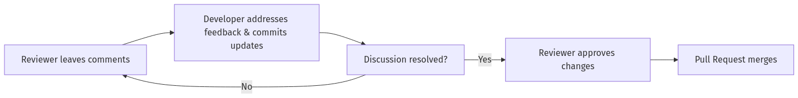
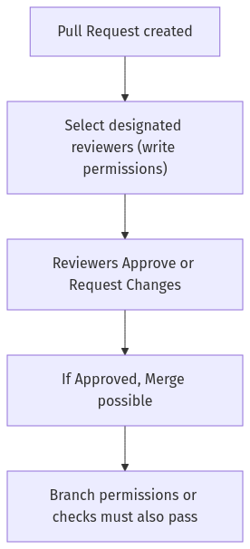
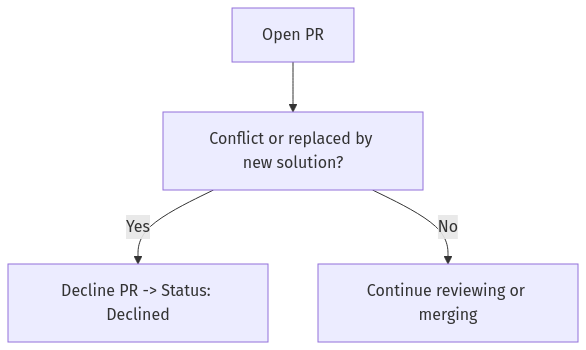
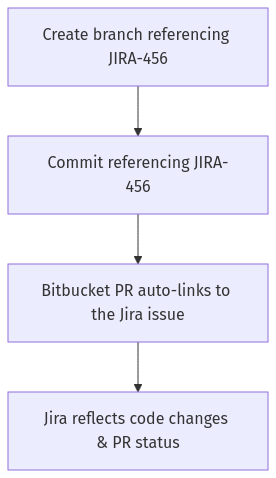
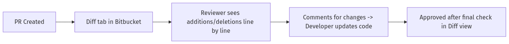
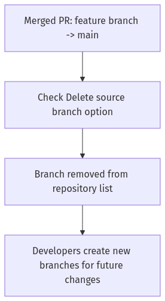
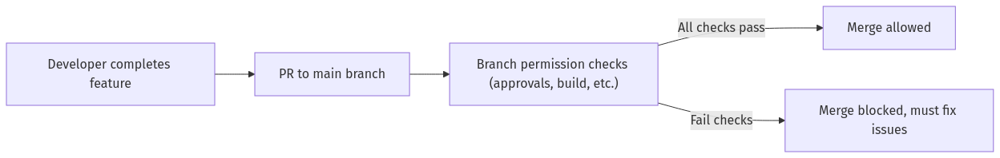

# **Bitbucket Collaboration & Code Reviews: Comprehensive Learning Resource**  
### (Days 7-8)

This document transforms the standard question-and-answer format into a **complete educational guide** on:

- **Why code reviews are essential** for collaboration and code quality  
- **How to use Bitbucket’s pull request features** effectively  
- **Key best practices** for successful reviews and merges  
- **Visual workflows** illustrating the entire PR process, from creation to merging or declining

## **Table of Contents**

- [**Bitbucket Collaboration \& Code Reviews: Comprehensive Learning Resource**](#bitbucket-collaboration--code-reviews-comprehensive-learning-resource)
    - [(Days 7-8)](#days-7-8)
  - [**Table of Contents**](#table-of-contents)
  - [**Core Concepts of Bitbucket Collaboration \& Code Reviews**](#core-concepts-of-bitbucket-collaboration--code-reviews)
  - [**Tool Comparison for Code Reviews in Bitbucket**](#tool-comparison-for-code-reviews-in-bitbucket)
  - [**Behind the Scenes: Bitbucket’s Internal PR Management**](#behind-the-scenes-bitbuckets-internal-pr-management)
  - [**Cheatsheet: Code Review Actions \& Tips**](#cheatsheet-code-review-actions--tips)
  - [**The Quiz Questions \& Answers**](#the-quiz-questions--answers)
    - [**Question 1**](#question-1)
    - [**Question 2**](#question-2)
    - [**Question 3**](#question-3)
    - [**Question 4**](#question-4)
    - [**Question 5**](#question-5)
    - [**Question 6**](#question-6)
    - [**Question 7**](#question-7)
    - [**Question 8**](#question-8)
    - [**Question 9**](#question-9)
    - [**Question 10**](#question-10)
  - [**Common Pitfalls \& Troubleshooting**](#common-pitfalls--troubleshooting)
  - [**Key Takeaways**](#key-takeaways)

---

## **Core Concepts of Bitbucket Collaboration & Code Reviews**

1. **Why Code Reviews Matter**:
   - Catch bugs, logical errors, and style issues early.
   - Facilitate knowledge sharing and standardization within the team.
   - Encourage consistent coding practices and maintain overall project quality.

2. **Standard PR Approach**:
   - A developer creates a feature branch, completes changes, and opens a PR.
   - Reviewers comment on code diffs, ask questions, or request changes.
   - The developer addresses feedback before merging or the PR may be declined if inappropriate.

3. **Pull Request Components**:
   - **Title/Description**: Summarize the changes and link to relevant tasks (e.g., Jira tickets).
   - **Diff View**: Shows added/deleted lines, providing context for changes.
   - **Comments**: Allows inline feedback on specific lines or overall PR discussion.
   - **Approvals/Declines**: Official signals about the PR’s readiness to merge or rejection.

4. **Effective Team Collaboration**:
   - Transparent communication about code changes.
   - Assigned reviewers with relevant expertise.
   - Clear guidelines for acceptance criteria (e.g., tests pass, coding style, security checks).

---

## **Tool Comparison for Code Reviews in Bitbucket**

| **Method**                      | **Approach**                             | **Pros**                                       | **Cons**                                                        | **Use Case**                                   |
|--------------------------------|------------------------------------------|------------------------------------------------|-----------------------------------------------------------------|------------------------------------------------|
| **Bitbucket Native Review**    | Inline comments & approvals within PRs   | Seamless integration with branches, merges, and Jira linking     | Dependent on Bitbucket environment; may require add-ons for advanced features | Typical team dev workflow; synergy with Atlassian stack |
| **External Code Review Tools** | Tools like Crucible, Upsource, etc.      | Specialized features for large or regulated projects             | Requires more complex setup; extra licensing or integrations     | Large enterprises or teams with specialized workflows    |
| **Manual Email or Chat**       | Copying diffs or links into discussion   | Quick for small teams, no new tooling needed                     | Lacks traceability, no structured review or approval gates       | Informal, short-lived or experimental reviews            |
| **Pair Programming**           | Real-time collaborative coding           | Instant feedback and deeper knowledge sharing                    | Not always feasible if teams are distributed or schedules differ | High-trust teams or complex, high-impact features         |

---

## **Behind the Scenes: Bitbucket’s Internal PR Management**

- **Branch Pointers & HEADs**: Bitbucket references the source (feature branch) and destination (e.g., main or develop) inside a PR object.  
- **Metadata Tracking**: Each PR stores comments, reviewer approvals, statuses, and tasks.  
- **Merge Mechanics**: Once approved, Bitbucket merges the source branch into the target, optionally performing checks (e.g., build passing).  
- **Activity Stream**: The system logs all PR interactions—updates, comments, merges, or declines—for audit and historical reference.

---

## **Cheatsheet: Code Review Actions & Tips**

1. **Create Pull Request**:  
   - From your feature branch, click “Create pull request” in Bitbucket.  
   - Provide a descriptive title and summary.  
   - Assign reviewers.  
2. **Review & Comment**:  
   - Open the “Diff” tab to see changes.  
   - Add inline comments on questionable lines.  
   - Approve or request changes.  
3. **Address Feedback**:  
   - Push new commits to the same branch.  
   - Mark comments “resolved” in the PR if the concerns are addressed.  
4. **Merge or Decline**:  
   - Merge if the PR is accepted.  
   - Decline if the changes are unwanted or superseded.  
5. **Clean Up**:  
   - Delete the merged branch to maintain a tidy repository.  

---

## **The Quiz Questions & Answers**  

Below are the 10 quiz questions (Days 7-8) with an enhanced structure for deeper learning into Bitbucket collaboration and code reviews. 

---

### **Question 1**  
**Question:** What is the primary purpose of a pull request in Bitbucket?  
- A) To directly deploy code to production.  
- B) To review code changes collaboratively before merging.  
- C) To resolve merge conflicts automatically.  
- D) To archive code permanently.  

**Answer Overview:**  
Pull requests are fundamentally about **collaborative code review**. They let teammates provide feedback, spot errors, and confirm readiness before merging changes.

**Why Other Options Are Incorrect:**  
- **A:** Deployments require separate pipelines or actions.  
- **C:** Pull requests do not magically solve conflicts; developers must address them.  
- **D:** Code archiving isn’t the main goal of PRs; code is stored in the repository.  

**Detailed Explanation:**  
A pull request (PR) centralizes discussion of changes, fosters team input, and ensures that new code meets quality standards. In Bitbucket, PRs display diffs, enabling inline comments. They also integrate seamlessly with Jira, letting teams link changes to specific tickets.

**Pull Request Workflow (Step-by-Step):**  
1. **Create PR**: Author picks the source feature branch, sets destination (often `main` or `develop`), writes a description.  
2. **Reviewers**: Teammates read the diff, comment on code sections, and propose changes.  
3. **Discussion/Update**: The author addresses feedback with follow-up commits.  
4. **Approve & Merge**: Once the team is satisfied, an authorized reviewer merges the PR.  

**Command/UI Reference**:  
- **Bitbucket UI**: “Create pull request” button from the feature branch → fill out title/description.  
- **Screenshot**: [Bitbucket “Create Pull Request” screen showing fields for title, description, reviewers].  

**Code Examples**:  
```diff
- function oldFunction() {
-   console.log("This code is outdated");
- }

+ function newFeature() {
+   console.log("New feature implemented");
+ }
```
A simple diff snippet a reviewer might see in the PR.

**Real-World Scenario**:  
A developer finishes a login feature on `feature/login`. They create a PR, two colleagues review and comment on edge cases, the developer fixes them. The code is then approved and merged into `main`.

**Before/After Example**:  
- **Before**: Code changes exist only on the developer’s local branch.  
- **After**: Code is reviewed, improved, and integrated into the shared repository after merges.

**Best Practices**:  
- Provide context in your PR description (linked Jira tickets, relevant screenshots).  
- Keep PRs small for easier reviews.  
- Encourage meaningful, actionable feedback.  
- Use assigned reviewers who understand the feature’s domain.  
- Label or categorize PRs (e.g., bugfix, feature).  
- Address all comments before merging.

**Common Pitfalls**  

| **Pitfall**                             | **Issue**                                      | **Better Approach**                                                      |
|-----------------------------------------|------------------------------------------------|--------------------------------------------------------------------------|
| Merging unreviewed changes             | Possible introduction of bugs or poor code     | Always require at least one reviewer’s approval before merging           |
| Huge PRs with hundreds of changed files | Reviewers get overwhelmed, missing details     | Create smaller, incremental PRs to keep the scope manageable             |

**DevOps Perspective**:  
Peer reviews form a key part of continuous integration and continuous delivery (CI/CD). Ensuring thorough reviews in Bitbucket reduces defects downstream and fosters consistent code standards.

**Visual Representation (Mermaid Diagram)**:  


**Key Takeaways**:  
- The primary goal of a PR is to facilitate **collaborative** code review.  
- Merging typically occurs only after approvals and addressing feedback.  
- PR discussions improve code quality, knowledge sharing, and team cohesion.  

---

### **Question 2**  
**Question:** Which action should you typically perform after a peer leaves feedback on your pull request?  
- A) Ignore their suggestions and merge immediately.  
- B) Discuss or address the feedback and update the code if necessary.  
- C) Immediately close the pull request without changes.  
- D) Delete the branch.  

**Answer Overview:**  
**Discussing or addressing peer feedback** is key to high-quality code. This process fosters learning, clarifies misunderstandings, and ensures final code meets shared standards.

**Why Other Options Are Incorrect:**  
- **A:** Ignoring suggestions undermines collaboration and can lead to unreviewed issues.  
- **C:** Abruptly closing the PR disregards valuable input.  
- **D:** Deleting the branch mid-review halts the collaboration process.  

**Detailed Explanation:**  
Code reviews are iterative. When teammates give feedback, the author should weigh it against project requirements, discuss clarifications, and implement changes if needed. This collaborative loop ensures the final code merges smoothly with fewer defects and better alignment to team standards.

**Pull Request Workflow:**  
1. **Feedback Received**: Inline or general comments in the PR.  
2. **Discussion**: The author responds, clarifies decisions, or asks follow-up questions.  
3. **Code Update**: The author pushes new commits addressing the feedback.  
4. **Re-Review**: Changes are re-examined, ensuring completeness and correctness.

**Command/UI Reference**:  
- **Bitbucket “Activity” tab**: Lists all comments, updates, and commit changes in the PR.  
- **Screenshot**: [Bitbucket comment thread showing reviewer remarks, developer replies].

**Code Examples**:  
```diff
- // Hardcoded configuration
- const API_URL = "http://localhost:3000";

+ // Use environment-based configuration
+ const API_URL = process.env.API_URL || "http://localhost:3000";
```
A reviewer might request removing a hardcoded URL.

**Real-World Scenario**:  
A junior dev’s PR is reviewed by a senior dev who notices a missing error check. The junior dev revises the function to handle errors, pushing updated commits. The senior dev re-checks, sees it’s resolved, and approves.

**Before/After Example**:  
- **Before**: Hardcoded or flawed code.  
- **After**: Code improved thanks to reviewer feedback.

**Best Practices**:  
- Respond promptly to feedback so the PR doesn’t stall.  
- Document your resolution approach (commit messages or comment threads).  
- Use a respectful, constructive tone when clarifying or disputing feedback.  
- If feedback is non-blocking, highlight it as a future improvement in the backlog.  
- Keep the conversation on-topic within the PR.  
- Once all feedback is addressed, request re-approval if required by your process.

**Common Pitfalls**  

| **Pitfall**      | **Issue**                                                                    | **Better Approach**                                          |
|------------------|------------------------------------------------------------------------------|--------------------------------------------------------------|
| Defensive attitude | Can create friction in the team and hamper knowledge exchange               | Treat review feedback as an opportunity for improvement      |
| Merging without re-check | The PR merges incomplete or incorrect fixes                            | Request or wait for a final sign-off from reviewers          |

**DevOps Perspective**:  
Continuous collaboration and iterative feedback loops align with agile and DevOps principles, ensuring smaller, frequent changes validated by peers.

**Visual Representation (Mermaid Diagram)**:  





**Key Takeaways**:  
- Peer feedback is central to code quality and team learning.  
- Respectful back-and-forth fosters clarity and better solutions.  
- Always update or justify your code in response to reviewer input.  

---

### **Question 3**  
**Question:** In Bitbucket, who can typically approve a pull request?  
- A) Only the repository administrator.  
- B) Any user with repository read access.  
- C) Users with designated reviewer or write permissions.  
- D) Any external user.  

**Answer Overview:**  
Typically, **reviewers or users with write permissions** can approve a pull request. This ensures that only qualified or authorized team members shape the final code.

**Why Other Options Are Incorrect:**  
- **A:** Not restricted to only administrators; many devs can be designated reviewers.  
- **B:** Read access alone doesn’t usually grant PR approval rights.  
- **D:** External, unauthorized users can’t typically approve merges.  

**Detailed Explanation:**  
Bitbucket’s permission model allows fine-grained control. Project leads or repo admins often configure who can approve merges. This might include all full-time developers, or a designated subset of senior engineers. This ensures accountability and prevents merges by unqualified or unrelated personnel.

**Pull Request Workflow:**  
1. **Assigned Reviewers**: Authors tag relevant people.  
2. **Review**: Designated reviewers check the code.  
3. **Approve**: If it meets standards, they click “Approve.”  
4. **Merge**: If the PR meets other conditions (e.g., no failing checks), it’s merged.

**Command/UI Reference**:  
- **Bitbucket “Reviewers”** field: Freed to pick from user list with reviewer permissions.  
- **Screenshot**: [Bitbucket PR sidebar showing assigned reviewers, “Approve” button].

**Code Examples**:  
No direct code snippet—this is more about authorization than the code itself.

**Real-World Scenario**:  
A mid-level dev can open a PR, but a senior dev or tech lead typically must approve it before merging. This ensures consistent standards across the codebase.

**Before/After Example**:  
- **Before**: Potential merges by anyone with read access.  
- **After**: Strict process ensuring merges only after authorized approval.

**Best Practices**:  
- Keep your list of reviewers relevant to the code changes (e.g., front-end dev for UI changes).  
- Ensure at least one peer or senior dev signs off on critical PRs.  
- Use “Default reviewers” in Bitbucket settings for automatically tagging relevant experts.  
- Combine code ownership rules with branch permissions.  
- If in doubt, ask additional reviewers for specialized areas.  
- Encourage a culture of cross-team reviews for knowledge sharing.

**Common Pitfalls**  

| **Pitfall**                       | **Issue**                                           | **Better Approach**                                            |
|-----------------------------------|-----------------------------------------------------|----------------------------------------------------------------|
| Overly permissive approvals       | Merges from people who lack context or knowledge    | Restrict approvals to devs with adequate expertise or write access |
| Single-person gating for everything | Bottlenecks if only one user can approve merges    | Assign multiple devs or a rotating set of approvers to spread load  |

**DevOps Perspective**:  
Role-based approvals help maintain quality gates in your pipeline. This fosters compliance, prevents unauthorized code merges, and supports an audit trail.

**Visual Representation (Mermaid Diagram)**:  





**Key Takeaways**:  
- Approval is limited to those with **write** or specifically designated “review” permissions.  
- This ensures merges are governed by trusted or knowledgeable team members.  
- Bitbucket’s permission model can be tailored to your org’s needs.  

---

### **Question 4**  
**Question:** Which practice enhances the effectiveness of code reviews?  
- A) Reviewing very large batches of changes at once.  
- B) Providing clear, constructive, and specific feedback.  
- C) Ignoring small issues to save time.  
- D) Skipping documentation in pull requests.  

**Answer Overview:**  
Providing **clear, constructive, and specific** feedback helps developers identify exactly what needs improvement, fosters better solutions, and ensures a productive review process.

**Why Other Options Are Incorrect:**  
- **A:** Massive PRs are harder to review thoroughly, leading to overlooked issues.  
- **C:** Even small issues can accumulate, harming code quality over time.  
- **D:** Documentation clarifies your changes for the rest of the team.  

**Detailed Explanation:**  
The hallmark of a great review is actionable feedback. Instead of vague statements like “This is bad,” reviewers should pinpoint the line and explain why it’s problematic, suggesting possible fixes. This method yields purposeful dialogues that refine code collaboratively.

**Pull Request Workflow:**  
1. **Open PR**: Summarize changes thoroughly in the description.  
2. **Reviewer Comments**: Each line item of feedback states the issue and a proposed improvement.  
3. **Author Response**: The author either adopts suggestions or defends design decisions.  
4. **Resolution**: Final updates or clarifications lead to acceptance and merge.

**Command/UI Reference**:  
- **Bitbucket “Inline Comments”**: Let reviewers highlight a line in the diff and comment directly.  
- **Screenshot**: [Inline comment block with a suggestion to rename a variable or refactor logic].

**Code Examples**:  
```diff
- let userData = fetchUserFromAPI();
- if (!userData) { ... }

+ // Provide fallback if user data is null
+ const userData = fetchUserFromAPI() || {};
+ if (Object.keys(userData).length === 0) { ... }
```
Reviewer might recommend handling a null check differently.

**Real-World Scenario**:  
A senior dev catches an insecure password hashing method in a PR. They specifically point out the line and recommend using a well-tested library. This clarity speeds up the fix.

**Before/After Example**:  
- **Before**: Vague feedback like “Change the function.”  
- **After**: Precise instruction: “Consider using `bcrypt` for hashing on line 45.”

**Best Practices**:  
- Keep feedback **constructive**, focusing on solutions, not just problems.  
- Provide code snippets or references to doc links.  
- Don’t ignore minor issues—collectively, they degrade code over time.  
- Maintain a professional, respectful tone.  
- Acknowledge good parts, not just negatives.  
- Suggest alternative approaches with clear reasoning.

**Common Pitfalls**  

| **Pitfall**          | **Issue**                                                  | **Better Approach**                                                |
|----------------------|------------------------------------------------------------|--------------------------------------------------------------------|
| Non-actionable feedback | Leaves developers confused on how to improve             | Provide specific guidance or references to best practices          |
| Excessive negativity | Discourages or demoralizes the author                      | Balance critique with positive acknowledgment of good decisions    |

**DevOps Perspective**:  
Thorough, constructive reviews reduce the risk of security or performance issues escaping to production. This aligns with the shift-left principle, catching issues early.

**Visual Representation (Mermaid Diagram)**:  


**Key Takeaways**:  
- **Specific, constructive** feedback is the backbone of an effective code review.  
- Don’t fear pointing out “small” issues—quality is a sum of details.  
- Clear rationale fosters shared learning and consistent standards.  

---

### **Question 5**  
**Question:** What does it mean to "decline" a pull request in Bitbucket?  
- A) Merging code immediately.  
- B) Rejecting proposed changes without merging.  
- C) Approving changes without further review.  
- D) Automatically resolving conflicts.  

**Answer Overview:**  
To “decline” means you’re **rejecting** the current set of changes without merging them, signaling that they’re unsuitable or superseded.

**Why Other Options Are Incorrect:**  
- **A:** Decline means **not** merging.  
- **C:** An approval is the opposite of decline.  
- **D:** Decline doesn’t fix or handle conflicts.  

**Detailed Explanation:**  
There are times when a PR is no longer relevant (e.g., a different fix solves the issue, or the approach is deemed incorrect). Rather than merging or leaving it open, you can formally decline the PR, closing it out of the review queue. The branch still exists, but the current PR is effectively abandoned.

**Pull Request Workflow:**  
1. **Open PR**: Proposed changes appear.  
2. **Decision**: If changes are flawed, outdated, or overshadowed by a better approach, a reviewer or the author can decline.  
3. **Outcome**: The PR closes with a “Declined” status. The branch may remain in the repository or be deleted manually.

**Command/UI Reference**:  
- **Bitbucket “Decline” Button**: Visible in the PR detail page.  
- **Screenshot**: [Red “Decline” button near “Merge” button with confirm modal].

**Code Examples**:  
No direct snippet; typically the code is deemed unfit or replaced.

**Real-World Scenario**:  
Two devs simultaneously fix the same bug in different ways. One solution is chosen for better performance. The other PR is declined to avoid confusion.

**Before/After Example**:  
- **Before**: The PR is open but overshadowed by a different fix.  
- **After**: The PR is declined, closing it out to keep the project tidy.

**Best Practices**:  
- Comment on **why** you’re declining, providing clarity for future reference.  
- If necessary, link to the alternative solution or PR.  
- Don’t simply decline for minor fixable issues—request changes instead.  
- Keep your team informed if you plan to decline someone else’s PR.  
- Periodically clean up stale PRs that are no longer needed.  
- If the approach might be relevant in the future, mention it in the decline comment.

**Common Pitfalls**  

| **Pitfall**               | **Issue**                                                   | **Better Approach**                                           |
|---------------------------|-------------------------------------------------------------|---------------------------------------------------------------|
| Declining without explanation | Leaves the author confused or resentful                   | Provide a rationale or link to the alternative solution       |
| Using decline as a “quick fix” | Minimizes collaboration or improvement cycle              | Use “request changes” for solvable issues, only decline if truly unworkable |

**DevOps Perspective**:  
Keeping the repository free of unmergeable or outdated PRs is crucial for lean processes. A clear decline helps maintain a transparent project timeline.

**Visual Representation (Mermaid Diagram)**:  





**Key Takeaways**:  
- **Decline** is the formal way to reject changes.  
- Provide reasoning in your decline comment to maintain clarity and respect.  
- Minimizes clutter by closing out outdated or flawed proposals.  

---

### **Question 6**  
**Question:** What is a common best practice for commit messages when working in Bitbucket?  
- A) Keep them vague and short.  
- B) Write detailed, descriptive messages explaining the changes.  
- C) Skip commit messages if changes are minor.  
- D) Always use the default message provided by Bitbucket.  

**Answer Overview:**  
**Detailed, descriptive** commit messages provide clarity on what changed and why, aiding future maintenance and reviews.

**Why Other Options Are Incorrect:**  
- **A/C:** Vague or missing commit messages hamper traceability.  
- **D:** Generic commit messages often fail to convey essential info.  

**Detailed Explanation:**  
Commits serve as atomic changes in your repository’s history. Well-written messages outline the intention behind the code adjustments. This is invaluable to reviewers scanning the commit log, to new hires learning the codebase, or to yourself debugging months later.

**Pull Request Workflow:**  
1. **Local Commits**: Author commits changes with good messages.  
2. **Push**: The commits appear in the PR’s commit list.  
3. **Review**: Reviewers read messages to understand each commit’s purpose.  
4. **Merge**: The final history is more comprehensible for all.

**Command/UI Reference**:  
- **`git commit -m "JIRA-123: Add user profile validations"`**: Example CLI usage.  
- **Bitbucket**: The PR “Commits” tab displays commit messages in chronological order.

**Code Examples**:  
```bash
# Good example:
git commit -m "BUG-201: Fix null pointer in user registration logic by adding null checks"

# Poor example:
git commit -m "fix stuff"
```
A descriptive message references the specific issue and what was fixed.

**Real-World Scenario**:  
A year from now, a dev investigating an odd user registration bug reads your commit message referencing “BUG-201.” They quickly see the context, saving hours of detective work.

**Before/After Example**:  
- **Before**: Non-descriptive messages like “Update code.”  
- **After**: Detailed commits, e.g., “Refactor to handle edge case in user registration (BUG-201).”

**Best Practices**:  
- Mention any relevant ticket IDs (Jira or otherwise).  
- Include the rationale for the change, not just “what.”  
- Limit the summary line (under ~50 chars), then add detail in the body if needed.  
- Maintain consistent formatting across the team.  
- Summaries help others quickly scan commits in logs.  
- Detailed messages reduce confusion if you revert changes later.

**Common Pitfalls**  

| **Pitfall**                | **Issue**                                                      | **Better Approach**                                  |
|----------------------------|----------------------------------------------------------------|------------------------------------------------------|
| Single-word commit messages| Obscures the reason for changes, complicating code history     | Provide a short descriptive line plus optional details |
| Overly casual or cryptic   | “xD fix?” or random acronyms hamper collaboration             | Ensure your team can decode the commit’s significance |

**DevOps Perspective**:  
Descriptive commit messages help automated systems parse changes. Tools can parse commit logs for changelogs, release notes, or auto-deployment triggers.

**Visual Representation (Mermaid Diagram)**:  


**Key Takeaways**:  
- Commit messages are a critical communication channel.  
- Detailed commits expedite reviews and future bug tracing.  
- Consistency in messaging fosters a robust team codebase.  

---

### **Question 7**  
**Question:** How does Bitbucket integrate with Jira?  
- A) Automatically deploys code to Jira.  
- B) Allows linking commits and pull requests directly to Jira tickets.  
- C) Only supports manual ticket creation.  
- D) Blocks Jira access during code reviews.  

**Answer Overview:**  
Bitbucket’s **Jira integration** means you can link commits and pull requests directly to corresponding Jira tickets, boosting traceability and collaboration across the Atlassian suite.

**Why Other Options Are Incorrect:**  
- **A:** Bitbucket doesn’t deploy code to Jira. Jira is for issue/task tracking.  
- **C/D:** It supports more than manual creation, and it doesn’t block access.  

**Detailed Explanation:**  
When devs reference a ticket ID in their commit messages (e.g., “JIRA-123”), Bitbucket can automatically associate that commit or PR with the matching Jira issue. This helps managers and teammates see the development progress on each task or bug. In Jira, you can see commits or branches tied to the ticket, unifying the entire dev cycle in one place.

**Pull Request Workflow:**  
1. **Create Branch** referencing the Jira ticket ID (e.g., “feature/JIRA-456-new-ui”).  
2. **Commit** code referencing “JIRA-456.”  
3. **Open PR**: The ticket ID is recognized, linking the PR and the issue in Jira.  
4. **Review, Merge**: Jira automatically updates the issue status if configured (e.g., “In Review” → “Done”).

**Command/UI Reference**:  
- **Bitbucket**: “Smart commits” syntax like `JIRA-123 #comment Implemented user profile validations.`  
- **Screenshot**: [Bitbucket “Jira Issues” side panel linking a PR to JIRA-123 with status tracking].

**Code Examples**:  
```bash
# Example commit with smart commit syntax
git commit -m "JIRA-456 #comment Added new UI elements for user profile"
```
This comment can appear in Jira’s log for that ticket.

**Real-World Scenario**:  
A manager checks Jira to see if JIRA-456 is nearing completion. They see the linked Bitbucket PR, can open it, read code changes, and see the review status in one environment.

**Before/After Example**:  
- **Before**: Issues tracked in Jira, code in Bitbucket, but no synergy.  
- **After**: Crisp integration showing which PR addresses which ticket.

**Best Practices**:  
- Always reference a relevant Jira ticket in your branch name or commit messages.  
- Enable the Bitbucket-Jira integration in your Atlassian admin settings.  
- Include tasks or sub-tasks in your Jira workflow to reflect code review stages.  
- Use PR transitions to automatically update Jira statuses (e.g., “Ready for QA”).  
- Keep your Jira board updated to match the actual progress in Bitbucket.  
- Cross-link PRs from Jira to quickly jump to the code changes.

**Common Pitfalls**  

| **Pitfall**                        | **Issue**                                             | **Better Approach**                                       |
|------------------------------------|-------------------------------------------------------|-----------------------------------------------------------|
| Inconsistent ticket references      | PRs/commits not visible in Jira due to naming mismatch | Use a standard pattern (e.g., “JIRA-###” in commit or branch name) |
| Neglecting status updates in Jira  | Tickets remain stale or unlabeled in the backlog       | Automate transitions or do it manually as part of the dev process   |

**DevOps Perspective**:  
Fully integrated workflows across issue tracking, source control, and CI/CD create transparency. Dev teams can measure velocity, track progress, and reduce context switching.

**Visual Representation (Mermaid Diagram)**:  





**Key Takeaways**:  
- Linking to Jira helps track each commit/PR to a specific ticket.  
- Encourages synergy in the Atlassian ecosystem (Bitbucket + Jira).  
- Maintains clarity on development progress for each task.  

---

### **Question 8**  
**Question:** What role does the “Diff” view serve in a pull request?  
- A) Displays only the commit history.  
- B) Shows differences between proposed changes and existing code.  
- C) Deploys changes directly.  
- D) Deletes files from the repository.  

**Answer Overview:**  
The PR “Diff” view highlights **line-by-line changes** between the branch’s proposed code and the base branch, helping reviewers see exactly what’s been added, removed, or modified.

**Why Other Options Are Incorrect:**  
- **A:** The commit history is found in a separate tab; “Diff” specifically focuses on code changes.  
- **C:** PR merges or external pipelines handle deployments.  
- **D:** “Diff” does not delete files; it only shows changes.  

**Detailed Explanation:**  
Reviewers rely on the “Diff” to quickly evaluate the scope and nature of changes. They can comment inline on specific lines, propose better alternatives, or discuss potential bugs. It’s the central piece of the code review experience in Bitbucket.

**Pull Request Workflow:**  
1. **Open PR**: The “Diff” tab is automatically generated.  
2. **Review**: Teammates read through the changes, leaving inline or file-level comments.  
3. **Amendments**: The author commits updates. The Diff updates, highlighting new changes.  
4. **Approval**: Reviewers finalize after they’re satisfied with the code.

**Command/UI Reference**:  
- **Bitbucket**: “Diff” tab in the PR page, with “Unified” or “Side-by-side” view.  
- **Screenshot**: [Bitbucket showing a side-by-side diff of code additions in green and deletions in red].

**Code Examples**:  
```diff
- const user = getUserById(userId)
+ const userProfile = fetchUserProfile(userId)
```
The diff highlights replaced lines in red (old code) and green (new code).

**Real-World Scenario**:  
A QA engineer spots a missing boundary check in the “Diff” and leaves a comment. The dev updates the logic. Everyone sees the new line in the updated diff.

**Before/After Example**:  
- **Before**: Hard to see exactly which lines changed if you rely on raw code.  
- **After**: The PR’s “Diff” clarifies the differences succinctly.

**Best Practices**:  
- Use side-by-side if it helps visualize changes more easily.  
- Collapse large, auto-generated files (e.g., minified code) to stay focused.  
- Explore search or filtering options to find relevant changes.  
- Combine the “Diff” with test coverage reports to see if changes are fully tested.  
- Add file-level comments for architecture-level questions.  
- Use inline comments for code-level suggestions or improvements.

**Common Pitfalls**  

| **Pitfall**                     | **Issue**                                                 | **Better Approach**                                                   |
|---------------------------------|-----------------------------------------------------------|-----------------------------------------------------------------------|
| Overlooking entire file changes | The PR modifies many files and some changes go unnoticed | Expand or carefully review each file, or break the PR into smaller ones |
| Misreading context in partial diffs | Incomplete understanding if large code blocks are omitted | Check “Full file” context or open the relevant file in the repository  |

**DevOps Perspective**:  
The “Diff” is crucial for shift-left testing, as reviewers can identify logic or security flaws before merging. This leads to higher-quality merges feeding the CI/CD pipeline.

**Visual Representation (Mermaid Diagram)**:  





**Key Takeaways**:  
- The “Diff” allows thorough, line-by-line code inspection.  
- Inline comments and side-by-side views enhance clarity.  
- It’s the heart of the PR review process in Bitbucket.  

---

### **Question 9**  
**Question:** After merging a pull request, what is a recommended next step regarding the feature branch?  
- A) Keep it indefinitely for future changes.  
- B) Rename the branch immediately.  
- C) Delete the feature branch to maintain repository cleanliness.  
- D) Push the branch directly to production.  

**Answer Overview:**  
**Deleting** the merged feature branch is often best practice to **keep the repository tidy** and avoid confusion with stale branches.

**Why Other Options Are Incorrect:**  
- **A:** Old branches can clutter the repo. Start a new branch for new work.  
- **B:** Renaming is rarely necessary after merging.  
- **D:** Typically, merging into `main` triggers or finalizes deployment. You don’t directly push the feature branch to production.  

**Detailed Explanation:**  
Once a branch’s changes are merged, it no longer serves a purpose. Retaining it can cause confusion—someone might accidentally commit to it. Deleting it is a simple housekeeping step that keeps your repo’s branch list relevant and short.

**Pull Request Workflow**:  
1. **PR Merged**: The feature branch merges into `main` (or your trunk branch).  
2. **Branch Cleanup**: Bitbucket prompts you to delete the source branch.  
3. **New Features**: If you want further changes, create a fresh branch from the updated `main`.

**Command/UI Reference**:  
- **Bitbucket**: “Delete source branch” checkbox in the merge dialog, or a manual “Delete branch” button after merging.  
- **Screenshot**: [Bitbucket’s post-merge success screen with “Delete branch” option highlighted].

**Code Examples**:  
No direct snippet—this is about branching strategy.

**Real-World Scenario**:  
A dev merges “feature/loginUI” into `develop`. They click “Delete Branch” to prevent accidental commits to an out-of-date feature branch. Next time, if updates are required, they open a brand-new branch from the latest codebase.

**Before/After Example**:  
- **Before**: Many old, merged branches remain, confusing new contributors about active work.  
- **After**: Only active branches remain visible, simplifying project management.

**Best Practices**:  
- Automate branch deletion if your workflow consistently merges fully tested code.  
- Maintain a naming convention (e.g., `feature/*`, `bugfix/*`) to quickly see branch purpose.  
- Use ephemeral branches: short-lived, single-purpose, then remove them.  
- Document branch usage policies in your team’s wiki.  
- If a branch is partially done but not needed, rebase or move commits, then delete.  
- Don’t forget to check that the merge truly integrated all changes before deleting.

**Common Pitfalls**  

| **Pitfall**                     | **Issue**                                                    | **Better Approach**                                             |
|---------------------------------|--------------------------------------------------------------|-----------------------------------------------------------------|
| Retaining large numbers of branches | Polluted repository, unclear which branches are active       | Regularly remove or archive branches that have served their purpose |
| Merging incomplete code and deleting the branch | Lost or partial features can vanish from active dev cycles     | Ensure the branch is genuinely ready for prime time before merging   |

**DevOps Perspective**:  
Branch cleanup is part of continuous improvement. Clean repos reduce confusion in CI pipelines, making it easier to see which branches are actually under development.

**Visual Representation (Mermaid Diagram)**:  





**Key Takeaways**:  
- Deleting merged branches **streamlines** your repository.  
- It prevents accidental commits to stale code.  
- This practice complements short-lived, feature-driven branching strategies.  

---

### **Question 10**  
**Question:** What is one advantage of using branch permissions in Bitbucket?  
- A) Allows anyone to directly push code to production branches.  
- B) Restricts who can merge or push changes, ensuring code quality.  
- C) Prevents pull requests entirely.  
- D) Automatically writes commit messages.  

**Answer Overview:**  
Bitbucket’s **branch permissions** feature ensures that only authorized individuals can merge or push changes to critical branches, enhancing quality control and security.

**Why Other Options Are Incorrect:**  
- **A:** The opposite—branch permissions prevent unauthorized direct pushes.  
- **C:** Permissions do not disable PRs.  
- **D:** They do not author commit messages automatically.  

**Detailed Explanation:**  
Branch permissions let you specify which branches are protected (e.g., `main`, `release/*`). You can require PR reviews, disallow force pushes, or restrict merges to a certain group. This approach is vital for stable code in production, guaranteeing that merges pass certain gates (e.g., code review, build success).

**Pull Request Workflow**:  
1. **Configure Branch Permissions**: In repo settings, set rules for `main`.  
2. **PR Requires Approvals**: Bitbucket blocks merges if approval count or checks are insufficient.  
3. **Authorized Mergers**: If you’re not on the authorized list, you can’t merge, ensuring only verified merges reach production or main.  

**Command/UI Reference**:  
- **Bitbucket**: “Repository Settings” → “Branch Permissions” → Add permissions for specific branches.  
- **Screenshot**: [Branch permissions rule listing requiring 1 or more approvals, restricting merges to certain users].

**Code Examples**:  
No direct snippet—this is about repository-level config. 

**Real-World Scenario**:  
The devops lead sets `master` to only merge with at least 2 approvals and a passing pipeline. Junior dev tries to merge without reviews—Bitbucket rejects the attempt, prompting them to request reviews.

**Before/After Example**:  
- **Before**: Anyone could push directly to `main`, risking unreviewed changes in production.  
- **After**: PR-based merges with mandatory checks, ensuring stable code merges only.

**Best Practices**:  
- Restrict direct pushes to main or release branches.  
- Define minimal approval count, e.g., at least 1 or 2.  
- Combine with automated build checks that must pass.  
- Provide an override for emergencies but log its usage.  
- Keep an up-to-date list of authorized users.  
- Pair with code ownership rules, so domain experts must review certain files.

**Common Pitfalls**  

| **Pitfall**                | **Issue**                                                                | **Better Approach**                                                       |
|----------------------------|--------------------------------------------------------------------------|---------------------------------------------------------------------------|
| Overly loose permissions   | Risk of unreviewed code or accidental force-push to production           | Use properly enforced branch protections and minimal approvals            |
| Excessively strict rules   | Slows down merges or blocks progress if no fallback is allowed           | Fine-tune your workflow, define emergency override if absolutely needed   |

**DevOps Perspective**:  
Branch permissions are an essential guardrail, aligning with DevSecOps best practices. They block unapproved code from breaking production and maintain consistent quality.

**Visual Representation (Mermaid Diagram)**:  





**Key Takeaways**:  
- Branch permissions enforce **quality gates** in your pipeline.  
- They let you define who can merge, how many approvals are required, and other conditions.  
- Combine them with CI checks for robust code governance.  

---

## **Common Pitfalls & Troubleshooting**

| **Pitfall**                                        | **Possible Issue**                                                                   | **Better Approach**                                                                                         |
|----------------------------------------------------|---------------------------------------------------------------------------------------|-------------------------------------------------------------------------------------------------------------|
| Overly Large Pull Requests                          | Reviewers miss critical details, hamper the review process                            | Break big changes into smaller, logical PRs for thorough, manageable reviews                                 |
| Insufficient Reviewer Expertise                     | Reviews lack depth or fail to catch domain-specific issues                            | Assign domain experts or cross-functional pairs to relevant PRs                                             |
| Lack of Documentation/Context in PR Descriptions    | Reviewers struggle to grasp the purpose or logic                                      | Provide a summary, link to relevant tickets, and highlight major architectural decisions in the PR           |
| Cluttered Repository with Stale Branches            | Difficulty identifying active dev lines, can cause confusion                           | Delete merged or abandoned branches, maintain a consistent naming convention                                |
| Merging without CI Checks or Approvals              | Production branch can break or degrade code quality                                   | Enforce branch permissions and automated build checks to gate merges                                        |
| Neglecting Security/Performance Implications        | Potential vulnerabilities or inefficiencies slip through                               | Encourage thorough reviews, use code scanning tools, & keep security/performance as standard review criteria |

---

## **Key Takeaways**

1. **Bitbucket Pull Requests** are the central mechanism for code collaboration and review.  
2. **Constructive Feedback** fosters better solutions and knowledge sharing.  
3. **Branch Permissions & Cleanup** keep your repository secure and maintainable.  
4. **Jira Integration** links your code changes to tasks for improved traceability.  
5. **Effective Reviews** catch bugs early, raise coding standards, and align with DevOps best practices.

---

**This comprehensive resource was derived from**:
- **Prompt**   
- **Quiz Answers**   
- **Quiz Questions**   

By following these guidelines, leveraging Bitbucket’s features, and maintaining strong communication, teams can **optimize their code review processes**, leading to higher code quality, better collaboration, and successful software delivery.