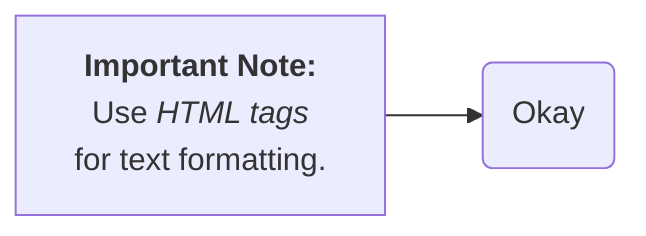

Here are the main characters to watch out for:

1.  **Quotes (`"` and `'`)**:
    * **Problem:** Mermaid often uses double quotes (`"`) to enclose text containing special characters, spaces, or syntax elements. If you need to display a literal double quote *inside* such text, you can't just type it directly. Single quotes (`'`) can sometimes be used as an alternative delimiter, but mixing them or needing literal versions of both can be tricky.
    * **Solution:** Use HTML entity codes within the quoted string:
        * For double quotes (`"`), use `&quot;` or `&#34;`.
        * For single quotes (`'`), use `&apos;` or `&#39;`.
    * **Example:**
        ```mermaid
        graph LR
            A["Node with a &quot;quoted&quot; word"] --> B["Using an &apos;apostrophe&apos;"];
        ```

2.  **Semicolon (`;`)**:
    * **Problem:** This is one of the most frequently cited problematic characters, especially within node text. It can interfere with internal parsing or CSS styling applied by Mermaid.
    * **Solution:** Use the HTML entity code `&#59;`.
    * **Example:**
        ```mermaid
        graph LR
            A["This node has a semicolon&#59; inside"] --> B;
        ```

3.  **Brackets, Parentheses, Braces (`[](){}`)**:
    * **Problem:** These characters are fundamental to Mermaid syntax for defining node shapes (e.g., `id[Text]`, `id(Text)`, `id{Text}`, `id((Text))`). Using them literally *within* node text *without* quotes will break the diagram structure as Mermaid tries to interpret them as shape definitions.
    * **Solution:** Enclose the entire node text in double quotes (`"`). If you need these characters *inside* the quoted text, they generally work fine, but be cautious if your text *starts* or *ends* with patterns resembling node definitions. Quoting is the primary fix.
    * **Example:**
        ```mermaid
        graph LR
            A["Function call: myFunction()"] --> B["List: [item1, item2]"];
            C("Regular node") --> D["This uses {braces} okay"];
        ```

4.  **HTML Reserved Characters (`<`, `>`, `&`)**:
    * **Problem:** Since Mermaid diagrams are often rendered as SVG within HTML, these characters can be misinterpreted as HTML tags or entities if not handled correctly.
    * **Solution:** Use HTML entity codes, especially within quoted text:
        * For less than (`<`), use `&lt;` or `&#60;`.
        * For greater than (`>`), use `&gt;` or `&#62;`.
        * For ampersand (`&`), use `&amp;` or `&#38;`.
    * **Example:**
        ```mermaid
        graph LR
            A["Compare: 5 &lt; 10"] --> B["Use &amp; for 'and'"];
            C["HTML tag example: &lt;div&gt;"] --> D;

        ```

5.  **Hash/Pound Sign (`#`)**:
    * **Problem:** While often less problematic than semicolons, `#` is used in HTML entity codes (like `&#35;`). Depending on context, it might occasionally cause issues.
    * **Solution:** If you encounter problems, use the HTML entity code `&#35;`. Often, it works fine within quotes without escaping.
    * **Example (using entity code for robustness):**
        ```mermaid
        graph LR
            A["Item &#35;1"] --> B["Color code: &#35;FF0000"];
        ```

**General Best Practices:**

* **Quote Your Text:** If your node or edge label contains spaces, punctuation (especially semicolons), or any character used in Mermaid syntax (`-`, `>`, `(`, `)`, `[`, `]`, `{`, `}`), enclose the *entire* text in double quotes (`"`).
* **Use HTML Entities Inside Quotes:** When you need to display literal quotes, semicolons, or HTML reserved characters (`<`, `>`, `&`) *within* text that is already enclosed in quotes, use their corresponding HTML entity codes.

By following these guidelines, particularly quoting text and using HTML entities for specific reserved characters, you can reliably include complex text and most symbols in your Mermaid diagrams.

## Updates 

Mermaid doesn't use traditional C-style escape sequences like `\n` or `\t` directly within the label strings for formatting. Instead, it primarily relies on a subset of **HTML tags** embedded within the text strings to control formatting.

Here's a list of the most commonly supported and reliable HTML tags you can use for text formatting within Mermaid labels:

1.  **`<br>` - Line Break:**
    * Purpose: Inserts a hard line break, forcing subsequent text onto the next line.
    * Example: `"First line<br>Second line"`

2.  **`<b>` or `<strong>` - Bold Text:**
    * Purpose: Renders the enclosed text in bold. `<strong>` is semantically preferred in HTML, but `<b>` often works too.
    * Example: `"This text is <b>bold</b>"` or `"This text is <strong>important</strong>"`

3.  **`<i>` or `<em>` - Italic Text:**
    * Purpose: Renders the enclosed text in italics. `<em>` (emphasis) is semantically preferred, but `<i>` often works.
    * Example: `"This text is <i>italic</i>"` or `"This text has <em>emphasis</em>"`

**Less Universally Guaranteed, but Sometimes Supported:**

* **`<u>` - Underline:** While a standard HTML tag, support or visual rendering might vary slightly across Mermaid renderers or environments.
* **`<sub>` - Subscript:** For rendering text slightly below the baseline.
* **`<sup>` - Superscript:** For rendering text slightly above the baseline.

**Important Considerations:**

* **Quoting:** Remember that if your text contains these HTML tags (or spaces, or other special Mermaid characters), you *must* enclose the entire text label in double quotes (`"`).
* **HTML Entities:** If you need to display the literal characters `<`, `>`, or `&` within your text (and not have them interpreted as HTML tags/entities), use their respective HTML entity codes: `&lt;`, `&gt;`, `&amp;`. This also applies if you needed to show `<br>` literally: `"Show the &lt;br&gt; tag"`.
* **Markdown (Limited):** In some specific Mermaid renderers or integrations (like certain documentation generators), very basic Markdown like `**bold**` or `*italic*` *might* be interpreted. However, relying on the HTML tags listed above is generally more portable and reliable across standard Mermaid usage. HTML tags are the documented standard.
* **CSS Styling:** For more advanced formatting (color, font size, background, etc.), Mermaid uses `classDef` to define CSS classes and then applies them to nodes or edges. This is a powerful *indirect* formatting control mechanism but doesn't involve special characters *within* the label text itself.

**Example Combining Tags:**



In summary, think of basic HTML tags (`<br>`, `<b>`, `<i>`, `<strong>`, `<em>`) as the primary "formatting control characters set" for use *inside* Mermaid text labels.