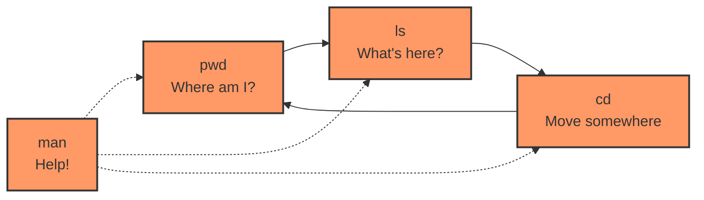

# Prompt for Transforming Day 1 Linux Training Material

I'd like to transform the technical content in the attached linux_day01_v6.md file into a more engaging and inviting format, similar to the narrative style found in the corresponding day1_story.md. I want to enhance this material with visual elements like Mermaid diagrams to improve comprehension and engagement.

## Transformation Goals

Please convert the Linux Day 1 training material (focusing on basic navigation and shell fundamentals) into a more approachable learning experience while:

1. Maintaining all the technical accuracy and depth of the original material
2. Using a warmer, conversational tone that feels like a mentor guiding a new SRE
3. Incorporating realistic scenarios that show how these basic commands (pwd, ls, cd, man) save the day in production environments
4. Adding relatable analogies (similar to how the original uses the "library" metaphor but expanding on this)
5. Preserving the tiered approach (Beginner/Intermediate/SRE-Level) that allows learners to progress at their own pace
6. Keeping all command tables, code examples, and technical details intact

## Narrative Elements to Include

Consider incorporating elements from Taylor's story:
- The feeling of uncertainty when first encountering a Linux terminal
- The satisfaction of solving real problems with basic commands
- The "aha moment" when concepts click (like understanding directory structure)
- How seemingly basic commands become crucial during incidents
- The perspective of both newcomers and experienced SREs

Consider creating a semi-fictional "day in the life" scenario that:
- Follows a new SRE's journey (similar to Taylor's experience)
- Shows realistic problems that can be solved with the commands being taught
- Builds throughout the material to create a cohesive narrative arc
- Includes dialogue between experienced mentors and newcomers
- Incorporates moments of both challenge and success

## Structure to Maintain

Please preserve these key structural elements:
- Command breakdowns with syntax tables
- Tiered examples (Beginner → Intermediate → SRE-Level)
- Hands-on exercises
- Troubleshooting scenarios
- FAQ sections

**Important:** Please remove the "Knowledge Check: Quiz" section entirely from the transformed material. Instead, focus on reinforcing learning through practical scenarios and hands-on exercises that naturally test understanding.

## Visual Elements to Add

Please incorporate Mermaid diagrams to enhance understanding:

1. **Filesystem Navigation Visualization**: Create diagrams that show directory structures and how navigation commands (cd, pwd) move through them
2. **Command Flow Charts**: Visual representations of how commands work and their options
3. **Process Trees**: For more advanced concepts where applicable
4. **Decision Trees**: For troubleshooting scenarios to visualize problem-solving approaches
5. **Conceptual Relationships**: Maps showing how different commands relate to each other

For example, include a simple directory navigation diagram like:

```mermaid
graph TD
    A[/] --> B[/home]
    A --> C[/var]
    A --> D[/etc]
    B --> E[/home/user]
    C --> F[/var/log]
    E --> G[/home/user/documents]
    
    style A fill:#f9f,stroke:#333,stroke-width:2px
    style E fill:#bbf,stroke:#333,stroke-width:2px
    style G fill:#bfb,stroke:#333,stroke-width:2px
```

Or a command relationship diagram:



## Example Transformation

Please rewrite at least one section of the Day 1 material (such as the introduction or a command breakdown) to demonstrate the transformation approach. Show how the technical content can maintain its educational value while becoming more engaging through:

1. Narrative elements and character perspectives
2. Practical, relatable scenarios
3. Conversational tone that addresses the reader directly
4. Visual aids using Mermaid diagrams
5. Metaphors and analogies that explain technical concepts
6. "Pro tips" from experienced SREs

For example, transform this:
```
Command: pwd (Print Working Directory)
pwd shows you your current location in the filesystem. This prevents you from applying changes in the wrong directory—particularly critical in production.
```

Into something like:
```
### Command: pwd (Where Am I?)

"Wait, which directory am I in again?" Taylor muttered, feeling that first-day anxiety creep in. 

Sophia smiled. "That's why 'pwd' is the first command every SRE learns. Think of it as your 'You Are Here' marker on the Linux filesystem map."

`pwd` (Print Working Directory) is your location compass in the Linux world. Before making any changes, especially in production environments, knowing exactly where you are can prevent disasters.

[Mermaid diagram showing a filesystem with "You are here" pointer]

> **SRE INSIGHT:** "I run `pwd` before every critical command in production. This simple habit has saved me from accidentally deleting files in the wrong directory more times than I can count." —Experienced SRE
```
