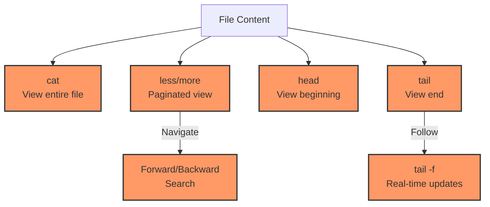
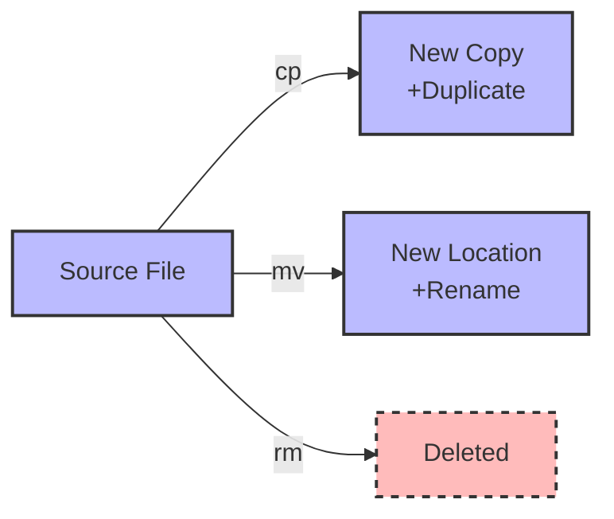
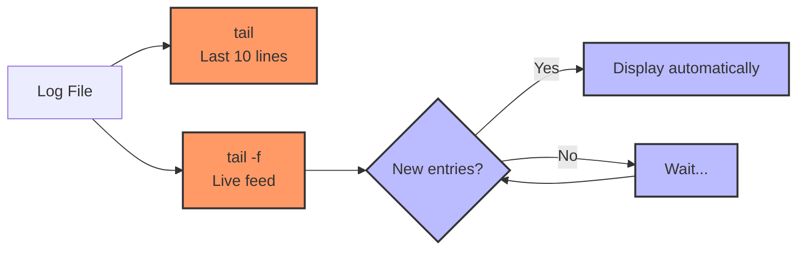

# Prompt for Transforming Day 2 Linux Training Material with Visual Elements

I'd like to transform the technical content in the attached linux_day02_v6.md file into a more engaging and inviting format, similar to the narrative style found in the corresponding day2_story.md. I want to enhance this material with visual elements like Mermaid diagrams to improve comprehension and engagement.

The current linux_day02_v6.md file covers file manipulation for SREs, including commands like `touch`, `mkdir`, `cat`, `less`, `more`, `head`, `tail`, `cp`, `mv`, `rm`, and `rmdir`. It uses a tiered approach for beginners through SRE-level professionals.

The corresponding day2_story.md follows Noah in Sydney, Australia as he investigates the log issues Taylor discovered on Day 1, using file viewing and manipulation commands to understand the problem more deeply.

## Transformation Goals

Please convert the Linux Day 2 training material (focusing on file manipulation) into a more approachable learning experience while:

1. Maintaining all the technical accuracy and depth of the original material
2. Using a warmer, conversational tone that feels like a mentor guiding a new SRE
3. Incorporating realistic scenarios that show how these file commands are used in production troubleshooting
4. Adding relatable analogies that help conceptualize file operations
5. Preserving the tiered approach (Beginner/Intermediate/SRE-Level) that allows learners to progress at their own pace
6. Keeping all command tables, code examples, and technical details intact

## Narrative Elements to Include

Consider incorporating elements from Noah's story:
- The methodical investigation of logs and their patterns
- The satisfaction of understanding file structures and relationships
- The "detective work" involved in examining file contents with tools like `cat`, `less`, and `tail`
- How file manipulation commands help organize information during an incident
- The perspective of an observability-focused SRE

Consider creating a semi-fictional "day in the life" scenario that:
- Follows Noah's investigation of the analytics logs
- Shows how he pieces together the puzzle using various file commands
- Builds throughout the material to create a cohesive narrative arc
- Includes dialogue between team members in different time zones
- Demonstrates how to properly document findings for handoff to the next SRE

## Structure to Maintain

Please preserve these key structural elements:
- Command breakdowns with syntax tables
- Tiered examples (Beginner → Intermediate → SRE-Level)
- Hands-on exercises
- Troubleshooting scenarios
- FAQ sections
- Further Learning Resources

**Important:** Please remove the "Knowledge Check: Quiz" section entirely from the transformed material. Instead, focus on reinforcing learning through practical scenarios and hands-on exercises that naturally test understanding.

## Visual Elements to Add

Please incorporate Mermaid diagrams to enhance understanding:

1. **File Operation Flows**: Visual representation of how data moves during operations like `cp`, `mv`, and redirection
2. **File Viewing Hierarchy**: Diagram showing the relationship between different file viewing tools (`cat`, `less`, `more`, `head`, `tail`)
3. **Directory Structure**: Visualizing directory creation and manipulation
4. **Log Rotation Concept**: Illustrating how logs are managed and rotated
5. **File Command Relationships**: Maps showing which commands are related and commonly used together

For example, include a diagram showing the relationship between file viewing commands:



Or a visualization of file operations:



## Example Transformation

Please rewrite at least one section of the Day 2 material (such as the introduction or a command breakdown) to demonstrate the transformation approach. Show how the technical content can maintain its educational value while becoming more engaging through:

1. Narrative elements and character perspectives
2. Practical, relatable scenarios
3. Conversational tone that addresses the reader directly
4. Visual aids using Mermaid diagrams
5. Metaphors and analogies that explain technical concepts
6. "Pro tips" from experienced SREs

For example, transform this:
```
Command: tail (view file end)
`tail` displays the last few lines of a file. In `-f` or `-F` mode, it shows lines appended to the file in real time, which is critical for incident monitoring.
```

Into something like:
```
### Command: tail (The File's Final Chapter)

Noah leaned closer to his monitor, scanning the last few entries in the massive log file.

"When you're investigating an incident, you rarely need to read the entire log history," he explained to Taylor via their handoff call. "Most of the time, you just need the latest entries. That's where `tail` becomes your best friend."

`tail` lets you view the end of a file—like reading just the last page of a book to see how the story ends. But its real superpower comes with the `-f` (follow) flag, which gives you a live stream of new content as it's written.



> **SRE INSIGHT:** "During an incident, I always have multiple terminal windows open with `tail -f` on different logs. It's like having multiple security cameras monitoring different areas of your infrastructure." —Noah
```