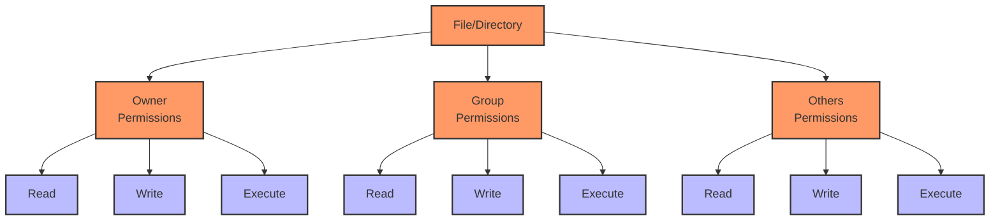
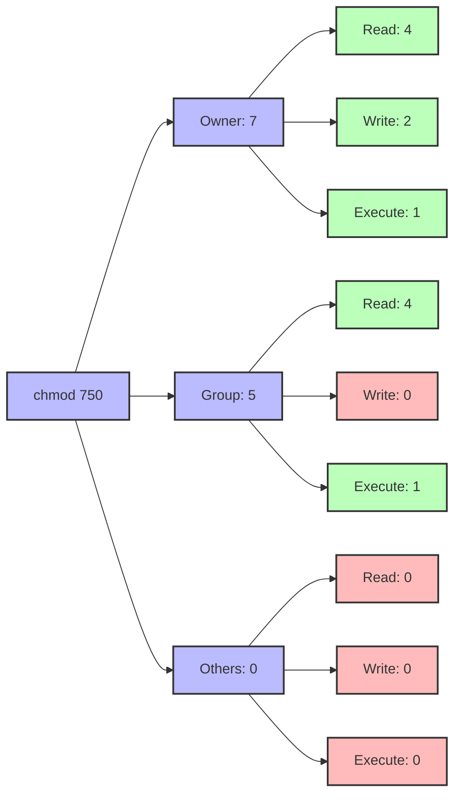
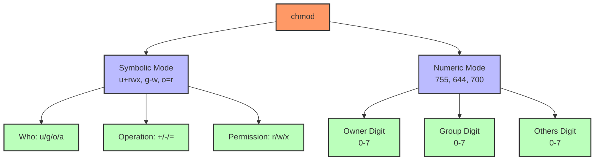

# Prompt for Transforming Day 3 Linux Training Material with Visual Elements

I'd like to transform the technical content in the attached linux_day03_v6.md file into a more engaging and inviting format, similar to the narrative style found in the corresponding day3_story.md. I want to enhance this material with visual elements like Mermaid diagrams to improve comprehension and engagement.

The current linux_day03_v6.md file covers permissions and ownership in Linux for SREs, including commands like `chmod`, `chown`, `chgrp`, and `sudo`. It uses a tiered approach for beginners through SRE-level professionals.

The corresponding day3_story.md follows Aanya in Bengaluru, India as she builds on Noah's findings by implementing proper directory structures and fixing permissions issues to establish a more secure system.

## Transformation Goals

Please convert the Linux Day 3 training material (focusing on permissions and ownership) into a more approachable learning experience while:

1. Maintaining all the technical accuracy and depth of the original material
2. Using a warmer, conversational tone that feels like a mentor guiding a new SRE
3. Incorporating realistic scenarios that show how proper permissions are critical for system security
4. Adding relatable analogies that help conceptualize Linux permissions models
5. Preserving the tiered approach (Beginner/Intermediate/SRE-Level) that allows learners to progress at their own pace
6. Keeping all command tables, code examples, and technical details intact

## Narrative Elements to Include

Consider incorporating elements from Aanya's story:
- The methodical approach to fixing directory permissions
- The satisfaction of creating a proper structure for file access
- The importance of setting appropriate ownership for security
- How permission settings prevent future issues
- The perspective of a detail-oriented, security-conscious SRE

Consider creating a semi-fictional "day in the life" scenario that:
- Follows Aanya's work implementing proper permissions
- Shows how she addresses the issues discovered by Taylor and Noah
- Builds throughout the material to create a cohesive narrative arc
- Includes dialogue between team members about security best practices
- Demonstrates proper documentation for security changes

## Structure to Maintain

Please preserve these key structural elements:
- Command breakdowns with syntax tables
- Tiered examples (Beginner → Intermediate → SRE-Level)
- Hands-on exercises
- Troubleshooting scenarios
- FAQ sections
- Further Learning Resources

**Important:** Please remove the "Knowledge Check: Quiz" section entirely from the transformed material. Instead, focus on reinforcing learning through practical scenarios and hands-on exercises that naturally test understanding.

## Visual Elements to Add

Please incorporate Mermaid diagrams to enhance understanding:

1. **Permission Bit Visualization**: Visual representation of how rwx permissions work for user/group/others
2. **Ownership Relationships**: Diagram showing how users, groups, and files relate to each other
3. **Permission Propagation**: How permissions affect directory hierarchies
4. **Special Permissions**: Visualizing concepts like setuid, setgid, and sticky bit
5. **Sudo Privilege Flow**: How sudo elevates permissions temporarily

For example, include a diagram showing the Linux permissions model:



Or a visualization of numeric permissions:



## Example Transformation

Please rewrite at least one section of the Day 3 material (such as the introduction or a command breakdown) to demonstrate the transformation approach. Show how the technical content can maintain its educational value while becoming more engaging through:

1. Narrative elements and character perspectives
2. Practical, relatable scenarios
3. Conversational tone that addresses the reader directly
4. Visual aids using Mermaid diagrams
5. Metaphors and analogies that explain technical concepts
6. "Pro tips" from experienced SREs

For example, transform this:
```
Command: chmod (Change File Mode Bits)
`chmod` modifies file or directory permissions in either symbolic (`u+rwx`, etc.) or numeric (`755`, `644`) form.
```

Into something like:
```
### Command: chmod (The Permission Gatekeeper)

"These mixed permissions are the root of our problems," Aanya explained during the handoff call with Noah. "Without clear boundaries, services are stepping on each other's toes."

Think of `chmod` as the security manager who decides exactly who gets which keys to which rooms in your system. It controls the read, write, and execute permissions for the owner, group, and others.



When Aanya realized the upload directory had `777` permissions (readable and writable by everyone), she immediately recognized the security risk. Like leaving your house keys under the doormat where anyone could find them, `777` permissions expose your files to everyone.

> **SRE INSIGHT:** "Use the principle of least privilege—grant only the permissions needed and no more. I never set `777` permissions in production, even temporarily. 'Just for now' often becomes 'forever'." —Aanya
```