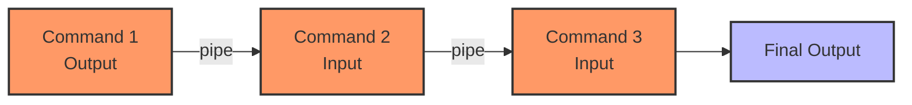
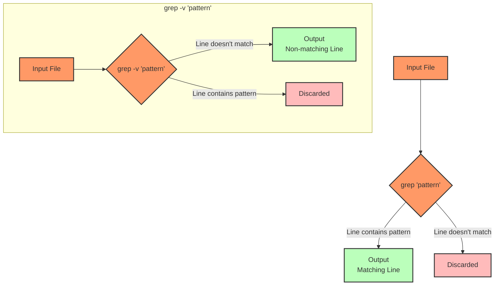
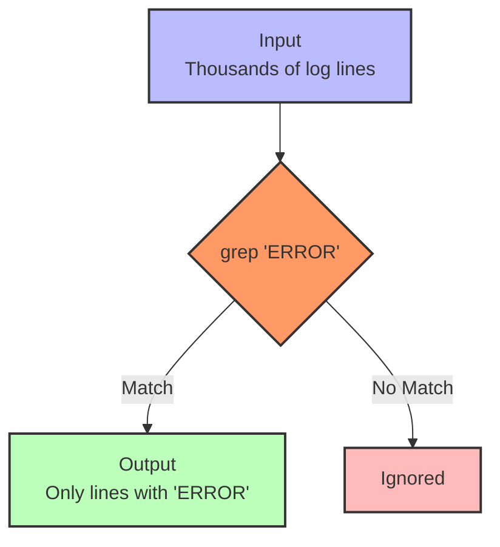

# Prompt for Transforming Day 4 Linux Training Material with Visual Elements

I'd like to transform the technical content in the attached linux_day04_v6.md file into a more engaging and inviting format, similar to the narrative style found in the corresponding day4_story.md. I want to enhance this material with visual elements like Mermaid diagrams to improve comprehension and engagement.

The current linux_day04_v6.md file covers text processing and searching in Linux for SREs, including commands like `grep`, `find`, pipes (`|`), and redirection (`>`, `>>`, `<`). It uses a tiered approach for beginners through SRE-level professionals.

The corresponding day4_story.md follows Luis in Madrid, Spain as he investigates the process ownership and permission issues discovered by Aanya, using text processing and search commands to trace process relationships and troubleshoot issues.

## Transformation Goals

Please convert the Linux Day 4 training material (focusing on text processing and searching) into a more approachable learning experience while:

1. Maintaining all the technical accuracy and depth of the original material
2. Using a warmer, conversational tone that feels like a mentor guiding a new SRE
3. Incorporating realistic scenarios that show how text processing commands solve real-world problems
4. Adding relatable analogies that help conceptualize complex text operations
5. Preserving the tiered approach (Beginner/Intermediate/SRE-Level) that allows learners to progress at their own pace
6. Keeping all command tables, code examples, and technical details intact

## Narrative Elements to Include

Consider incorporating elements from Luis's story:
- The detective-like investigation of process relationships
- The satisfaction of uncovering hidden patterns in logs and configuration files
- The "aha moments" when finding relevant results with search tools
- How text processing commands help identify security vulnerabilities
- The perspective of an engineer focused on process security

Consider creating a semi-fictional "day in the life" scenario that:
- Follows Luis as he investigates process forking and sudo issues
- Shows how he uses text processing tools to find patterns and anomalies
- Builds throughout the material to create a cohesive narrative arc
- Includes dialogue between team members about security findings
- Demonstrates how to effectively document search results for handoff

## Structure to Maintain

Please preserve these key structural elements:
- Command breakdowns with syntax tables
- Tiered examples (Beginner → Intermediate → SRE-Level)
- Hands-on exercises
- Troubleshooting scenarios
- FAQ sections
- Further Learning Resources

**Important:** Please remove the "Knowledge Check: Quiz" section entirely from the transformed material. Instead, focus on reinforcing learning through practical scenarios and hands-on exercises that naturally test understanding.

## Visual Elements to Add

Please incorporate Mermaid diagrams to enhance understanding:

1. **Grep Pattern Matching**: Visual representation of how grep searches through text
2. **Find Command Structure**: Diagram showing the relationship between find flags and actions
3. **Pipeline Flow**: How data flows through piped commands
4. **Redirection Mechanics**: Visualizing the difference between various redirection operators
5. **Command Relationships**: Maps showing how search and text processing commands work together

For example, include a diagram showing how pipes connect commands:



Or a visualization of grep pattern searching:



## Example Transformation

Please rewrite at least one section of the Day 4 material (such as the introduction or a command breakdown) to demonstrate the transformation approach. Show how the technical content can maintain its educational value while becoming more engaging through:

1. Narrative elements and character perspectives
2. Practical, relatable scenarios
3. Conversational tone that addresses the reader directly
4. Visual aids using Mermaid diagrams
5. Metaphors and analogies that explain technical concepts
6. "Pro tips" from experienced SREs

For example, transform this:
```
Command: grep (Global Regular Expression Print)
grep searches text files for patterns. SREs use it daily for finding errors, warnings, or request IDs within logs.
```

Into something like:
```
### Command: grep (The Pattern Detective)

Luis scrolled through the massive log file, then sighed. "Looking through logs line by line is like searching for a needle in a haystack," he muttered.

Then he remembered `grep` - the SRE's trusted detective partner. With a simple command, he could find exactly what he was looking for.

`grep` (Global Regular Expression Print) is your pattern-finding superpower. Think of it as a detective that can quickly scan thousands of lines of text to find exactly what you're looking for.



When Luis needed to find unauthorized sudo usage in the logs, he didn't have to read thousands of lines. Instead, he ran:

```bash
grep -i "sudo\|permission\|denied" /var/log/auth.log
```

And immediately found the suspicious patterns that pointed to security issues.

> **SRE INSIGHT:** "I create a personal 'grep cookbook' of my most useful patterns for different situations. During an incident, having these ready saves precious minutes when every second counts." —Luis
```