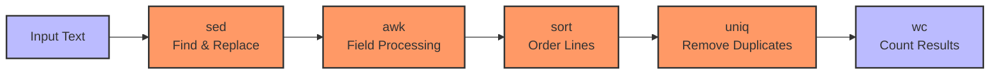
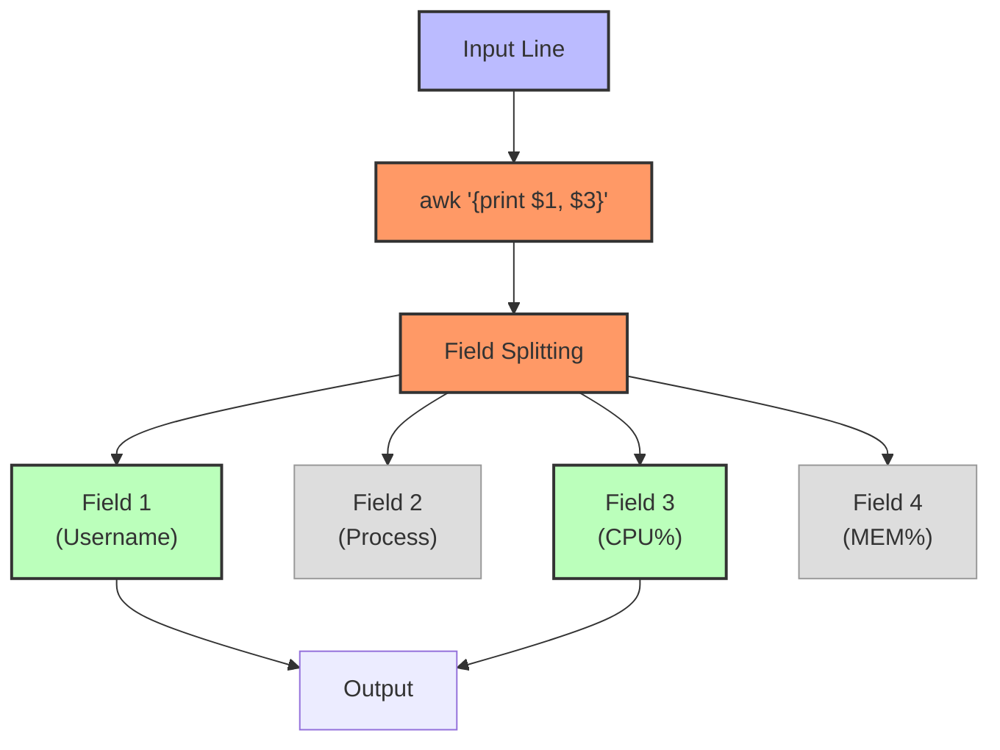

# Prompt for Transforming Day 5 Linux Training Material with Visual Elements

I'd like to transform the technical content in the attached linux_day05_v6.md file into a more engaging and inviting format, similar to the narrative style found in the corresponding day5_story.md. I want to enhance this material with visual elements like Mermaid diagrams to improve comprehension and engagement.

The current linux_day05_v6.md file covers advanced text processing tools in Linux for SREs, including commands like `sed`, `awk`, `sort`, `uniq`, and `wc`. It uses a tiered approach for beginners through SRE-level professionals.

The corresponding day5_story.md follows Jin in Seoul, South Korea as he builds on previous work by creating sophisticated text processing solutions to standardize logs and filter sensitive information.

## Transformation Goals

Please convert the Linux Day 5 training material (focusing on advanced text processing tools) into a more approachable learning experience while:

1. Maintaining all the technical accuracy and depth of the original material
2. Using a warmer, conversational tone that feels like a mentor guiding a new SRE
3. Incorporating realistic scenarios that show how advanced text processing solves complex data problems
4. Adding relatable analogies that help conceptualize these powerful text transformation tools
5. Preserving the tiered approach (Beginner/Intermediate/SRE-Level) that allows learners to progress at their own pace
6. Keeping all command tables, code examples, and technical details intact

## Narrative Elements to Include

Consider incorporating elements from Jin's story:
- The methodical process of standardizing logs from different sources
- The satisfaction of creating order from chaotic data formats
- The importance of sanitizing sensitive information from logs
- How text processing tools can automate routine log analysis
- The perspective of an engineer with text processing expertise

Consider creating a semi-fictional "day in the life" scenario that:
- Follows Jin as he tackles log standardization challenges
- Shows how he uses advanced text processing for data extraction and transformation
- Builds throughout the material to create a cohesive narrative arc
- Includes dialogue between team members about log management best practices
- Demonstrates the creation of automated reporting using text processing tools

## Structure to Maintain

Please preserve these key structural elements:
- Command breakdowns with syntax tables
- Tiered examples (Beginner → Intermediate → SRE-Level)
- Hands-on exercises
- Troubleshooting scenarios
- FAQ sections
- Further Learning Resources

**Important:** Please remove the "Knowledge Check: Quiz" section entirely from the transformed material. Instead, focus on reinforcing learning through practical scenarios and hands-on exercises that naturally test understanding.

## Visual Elements to Add

Please incorporate Mermaid diagrams to enhance understanding:

1. **Text Processing Pipeline**: Visual representation of how data flows through sed, awk and other tools
2. **Pattern Matching**: Diagram showing how text patterns are matched and transformed
3. **Sort and Filter Flow**: Visualizing how `sort` and `uniq` work together to deduplicate data
4. **Field Processing**: How `awk` splits and processes text by fields
5. **Command Relationships**: Maps showing how different text processing commands complement each other

For example, include a diagram showing text processing flow:



Or a visualization of awk field processing:



## Example Transformation

Please rewrite at least one section of the Day 5 material (such as the introduction or a command breakdown) to demonstrate the transformation approach. Show how the technical content can maintain its educational value while becoming more engaging through:

1. Narrative elements and character perspectives
2. Practical, relatable scenarios
3. Conversational tone that addresses the reader directly
4. Visual aids using Mermaid diagrams
5. Metaphors and analogies that explain technical concepts
6. "Pro tips" from experienced SREs

For example, transform this:
```
Command: awk (Pattern Scanning and Processing)
`awk` splits each line into fields, letting you apply patterns or calculations. Ideal for extracting columns, computing statistics, and generating quick reports.
```

Into something like:
```
### Command: awk (The Field Surgeon)

Jin stared at the inconsistent log formats across different services. "This is like trying to read books written in different languages," he thought.

That's when `awk` became his trusted translator.

Think of `awk` as a surgical tool that can dissect any line of text into precise fields, operate on exactly what you need, and reassemble it in a format that makes sense. It's like having a data transformation assembly line inside a single command.

```mermaid
graph TD
    A["Input Line:\nuser1 process1 45.2 8.3 /var/log"] --> B[awk]
    B --> C["Splits into fields:\n$1 $2 $3 $4 $5"]
    C --> D["Applies pattern/action:\n{print $1, $3\"%\"}"]
    D --> E["Output:\nuser1 45.2%"]
    
    classDef data fill:#bbf,stroke:#333,stroke-width:2px
    classDef process fill:#f96,stroke:#333,stroke-width:2px
    
    class A,C,E data
    class B,D process
```

When Jin needed to extract CPU usage metrics from different log formats, he created a unified view with:

```bash
awk '{ print $1, $3 "%" }' service1.log service2.log
```

This instantly extracted usernames and CPU percentages across different logs, creating a consistent format.

> **SRE INSIGHT:** "I keep an 'awk cookbook' with patterns for common log formats. When you need to quickly extract metrics during an incident, having these ready templates saves crucial minutes." —Jin
```