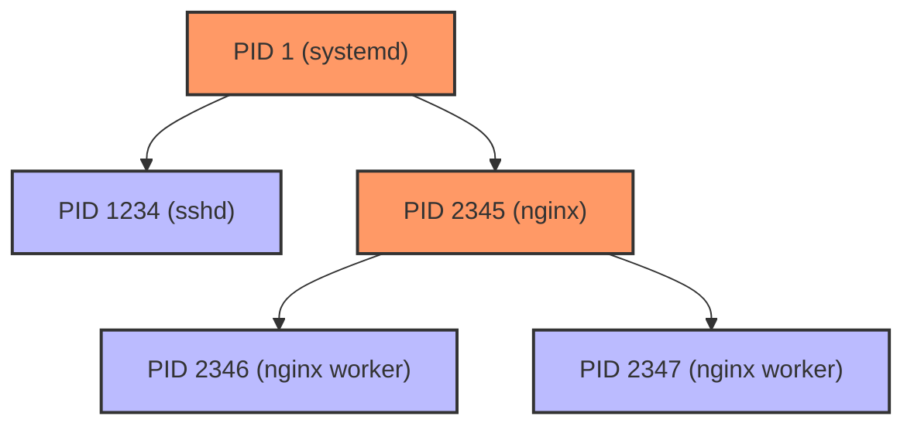
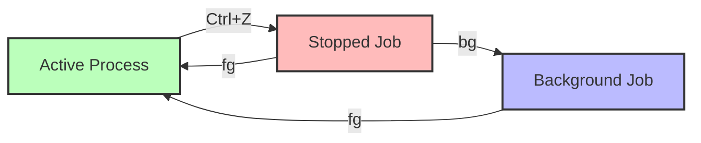
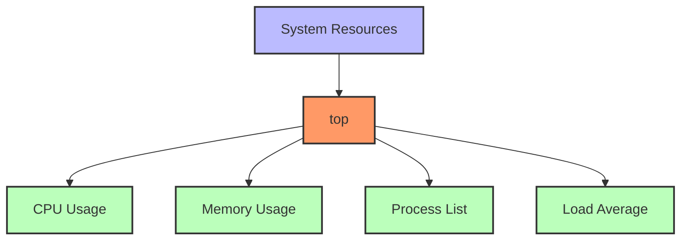

# Prompt for Transforming Day 6 Linux Training Material with Visual Elements

I'd like to transform the technical content in the attached linux_day06_v6.md file into a more engaging and inviting format, similar to the narrative style found in the corresponding day6_story.md. I want to enhance this material with visual elements like Mermaid diagrams to improve comprehension and engagement.

The current linux_day06_v6.md file covers process and system monitoring in Linux for SREs, including commands like `ps`, `top`, `htop`, `kill`, `jobs`, `bg`, `fg`, `uname`, `df`, `du`, and `free`. It uses a tiered approach for beginners through SRE-level professionals.

The corresponding day6_story.md follows Fatima in Dubai, UAE as she focuses on securing the system and implementing proper process monitoring to address the sudo issues that Luis discovered.

## Transformation Goals

Please convert the Linux Day 6 training material (focusing on process and system monitoring) into a more approachable learning experience while:

1. Maintaining all the technical accuracy and depth of the original material
2. Using a warmer, conversational tone that feels like a mentor guiding a new SRE
3. Incorporating realistic scenarios that show how process monitoring solves performance and security issues
4. Adding relatable analogies that help conceptualize complex process management concepts
5. Preserving the tiered approach (Beginner/Intermediate/SRE-Level) that allows learners to progress at their own pace
6. Keeping all command tables, code examples, and technical details intact

## Narrative Elements to Include

Consider incorporating elements from Fatima's story:
- The methodical approach to system monitoring and security
- The careful analysis of running processes and resource usage
- The importance of identifying and addressing security vulnerabilities
- How process monitoring helps maintain system stability
- The perspective of a security-focused SRE

Consider creating a semi-fictional "day in the life" scenario that:
- Follows Fatima as she implements process monitoring and security improvements
- Shows how she identifies and resolves resource issues and security vulnerabilities
- Builds throughout the material to create a cohesive narrative arc
- Includes dialogue between team members about system monitoring best practices
- Demonstrates how to properly document monitoring procedures for handoff

## Structure to Maintain

Please preserve these key structural elements:
- Command breakdowns with syntax tables
- Tiered examples (Beginner → Intermediate → SRE-Level)
- Hands-on exercises
- Troubleshooting scenarios
- FAQ sections
- Further Learning Resources

**Important:** Please remove the "Knowledge Check: Quiz" section entirely from the transformed material. Instead, focus on reinforcing learning through practical scenarios and hands-on exercises that naturally test understanding.

## Visual Elements to Add

Please incorporate Mermaid diagrams to enhance understanding:

1. **Process Relationships**: Visual representation of parent-child process hierarchies
2. **Resource Usage Flow**: Diagram showing how processes consume CPU, memory, and disk resources
3. **Job Control**: Visualizing how foreground and background jobs work
4. **System Monitoring Decision Tree**: Flow chart for diagnosing system performance issues
5. **Command Relationships**: Maps showing how process monitoring commands work together

For example, include a diagram showing process relationships:



Or a visualization of job control:



## Example Transformation

Please rewrite at least one section of the Day 6 material (such as the introduction or a command breakdown) to demonstrate the transformation approach. Show how the technical content can maintain its educational value while becoming more engaging through:

1. Narrative elements and character perspectives
2. Practical, relatable scenarios
3. Conversational tone that addresses the reader directly
4. Visual aids using Mermaid diagrams
5. Metaphors and analogies that explain technical concepts
6. "Pro tips" from experienced SREs

For example, transform this:
```
Command: top (Table of Processes)
`top` is an interactive tool showing a real-time view of processes. It updates by default every few seconds, allowing you to spot CPU spikes, memory hogs, and quickly gauge load averages.
```

Into something like:

### Command: top (Your System&apos;s Vital Signs Monitor)

Fatima frowned at the server&apos;s sluggish response. "Something&apos;s consuming resources, but what?" she muttered.

With a few keystrokes, she launched her go-to diagnostic tool: `top`.

Think of `top` as the equivalent of a hospital&apos;s vital signs monitor for your system. Just as a medical monitor shows heart rate, blood pressure, and oxygen levels in real-time, `top` displays your system&apos;s CPU usage, memory consumption, and process activity as it happens.



When Fatima needed to identify which process was causing high CPU usage, she didn&apos;t have to guess. The real-time sorting in `top` immediately showed her a rogue process using 90% CPU.

> **SRE INSIGHT:** "I always check the load average in the top right corner first. If it&apos;s higher than the number of CPU cores, something&apos;s wrong. A single-core system should ideally have a load average below 1.0." —Fatima
```