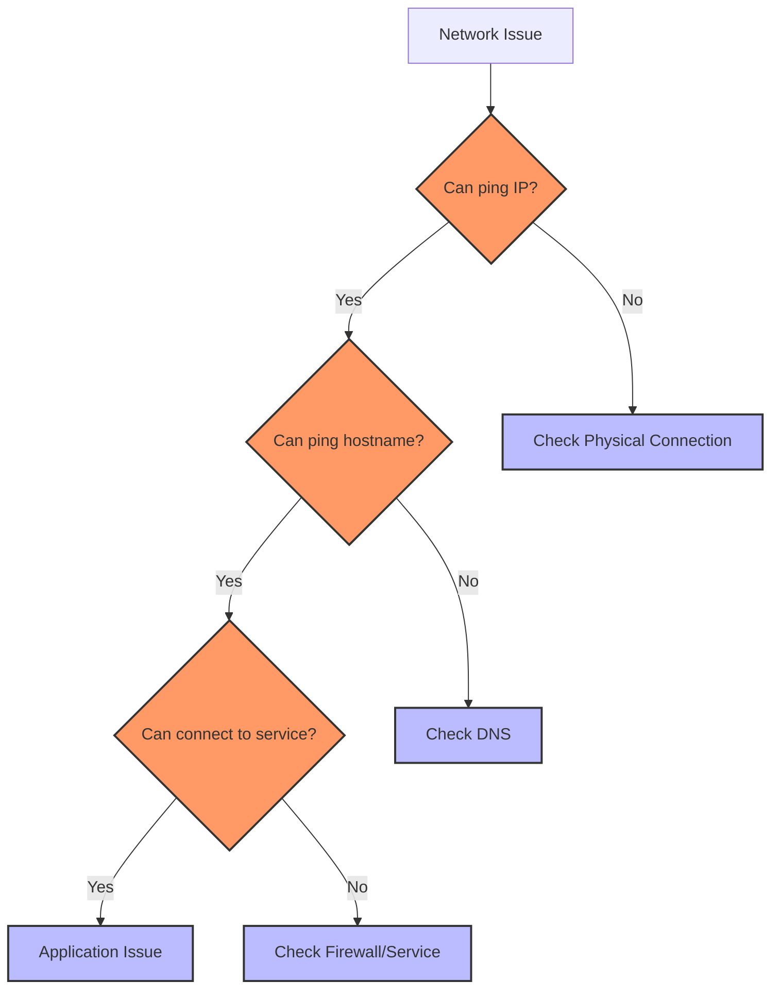
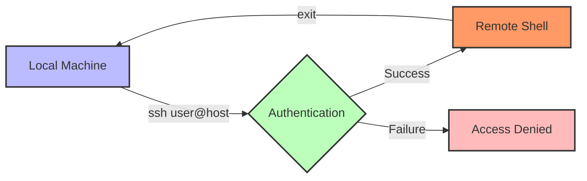

# Prompt for Transforming Day 7 Linux Training Material with Visual Elements

I'd like to transform the technical content in the attached linux_day07_v6.md file into a more engaging and inviting format, similar to the narrative style found in the corresponding day7_story.md. I want to enhance this material with visual elements like Mermaid diagrams to improve comprehension and engagement.

The current linux_day07_v6.md file covers networking basics in Linux for SREs, including commands like `ping`, `ifconfig`/`ip`, `netstat`/`ss`, `ssh`, and `scp`. It uses a tiered approach for beginners through SRE-level professionals.

The corresponding day7_story.md follows Mina in Lagos, Nigeria as she focuses on network integration and builds a comprehensive monitoring dashboard that ties together all the previous improvements made by the team.

## Transformation Goals

Please convert the Linux Day 7 training material (focusing on networking basics) into a more approachable learning experience while:

1. Maintaining all the technical accuracy and depth of the original material
2. Using a warmer, conversational tone that feels like a mentor guiding a new SRE
3. Incorporating realistic scenarios that show how networking commands solve connectivity and monitoring issues
4. Adding relatable analogies that help conceptualize complex networking concepts
5. Preserving the tiered approach (Beginner/Intermediate/SRE-Level) that allows learners to progress at their own pace
6. Keeping all command tables, code examples, and technical details intact

## Narrative Elements to Include

Consider incorporating elements from Mina's story:
- The methodical approach to verifying network connectivity
- The satisfaction of tying together all the team's previous work through network integration
- The process of creating a comprehensive monitoring dashboard
- How networking commands help diagnose system-wide issues
- The perspective of an integration-focused SRE with strong documentation skills

Consider creating a semi-fictional "day in the life" scenario that:
- Follows Mina as she verifies connectivity and builds the monitoring dashboard
- Shows how she uses networking tools to ensure system components can communicate
- Builds throughout the material to create a cohesive narrative arc
- Includes dialogue between team members about network security and monitoring
- Demonstrates how to properly document network architecture for handoff

## Structure to Maintain

Please preserve these key structural elements:
- Command breakdowns with syntax tables
- Tiered examples (Beginner → Intermediate → SRE-Level)
- Hands-on exercises
- Troubleshooting scenarios
- FAQ sections
- Further Learning Resources

**Important:** Please remove the "Knowledge Check: Quiz" section entirely from the transformed material. Instead, focus on reinforcing learning through practical scenarios and hands-on exercises that naturally test understanding.

## Visual Elements to Add

Please incorporate Mermaid diagrams to enhance understanding:

1. **Network Command Relationships**: Visual representation of how different networking tools work together
2. **Connection Types**: Diagram showing different types of network connections (TCP vs UDP)
3. **SSH Connection Flow**: Visualizing how secure connections are established
4. **Network Troubleshooting Flow**: Decision tree for diagnosing network issues
5. **Monitoring Architecture**: How network monitoring integrates with system monitoring

For example, include a diagram showing network diagnostic tools:



Or a visualization of SSH connections:

```mermaid
sequenceDiagram
    participant Client
    participant Server
    
    Client->>Server: Connection Request
    Server->>Client: Server Identity (Public Key)
    Client->>Server: Authentication (Password/Key)
    Server->>Client: Authentication Result
    Note over Client,Server: Encrypted Session Established
    Client->>Server: Commands/Data
    Server->>Client: Results/Data
    
    style Client fill:#bbf,stroke:#333,stroke-width:2px
    style Server fill:#f96,stroke:#333,stroke-width:2px
```

## Example Transformation

Please rewrite at least one section of the Day 7 material (such as the introduction or a command breakdown) to demonstrate the transformation approach. Show how the technical content can maintain its educational value while becoming more engaging through:

1. Narrative elements and character perspectives
2. Practical, relatable scenarios
3. Conversational tone that addresses the reader directly
4. Visual aids using Mermaid diagrams
5. Metaphors and analogies that explain technical concepts
6. "Pro tips" from experienced SREs

For example, transform this:
```
Command: ssh (Secure Shell)
`ssh` securely logs into remote servers, forward ports. SREs leverage it for remote ops and can be automated.
```

Into something like:
```
### Command: ssh (Your Secure Passport to Remote Systems)

Mina settled in at her desk, ready to connect to the analytics server. "Before we can fix anything, we need secure access," she explained to a junior team member watching over her shoulder.

Think of `ssh` as your secure passport to remote systems. Just as a passport verifies your identity at international borders, SSH authenticates you to remote servers—but with encryption that keeps all your communications private.



When Mina needed to connect to multiple servers to verify network connectivity, she used SSH key-based authentication for seamless access:

```bash
ssh -i ~/.ssh/analytics_key mina@analytics-prod-03
```

> **SRE INSIGHT:** "I organize my SSH configs in ~/.ssh/config with host aliases. Instead of typing `ssh -i ~/.ssh/key -p 2222 user@long-hostname.example.com`, I just type `ssh prod-app1`. This saves time and reduces errors during incidents." —Mina
```