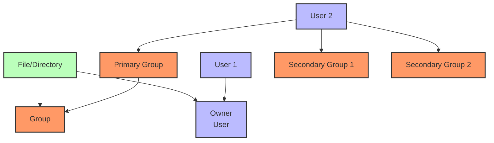
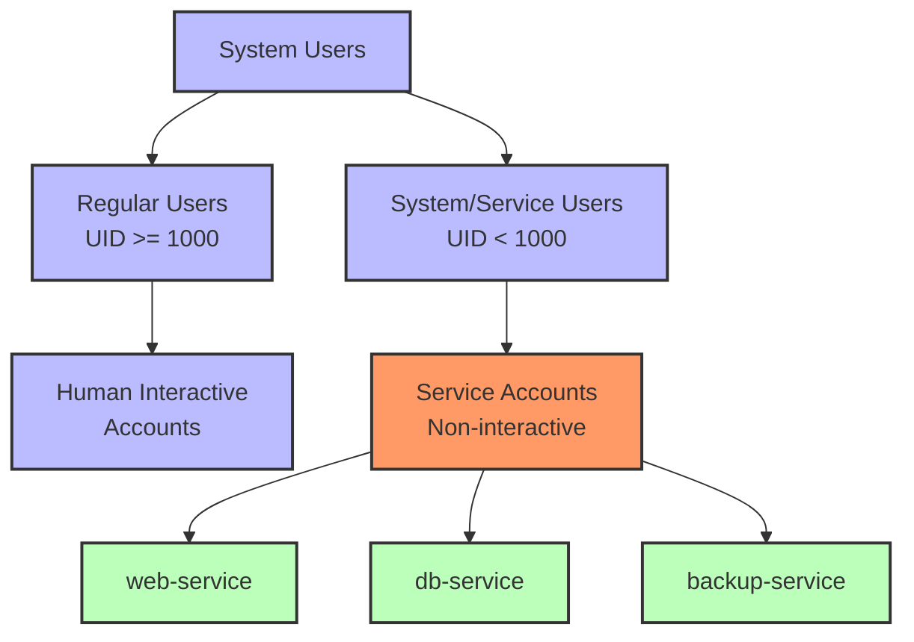
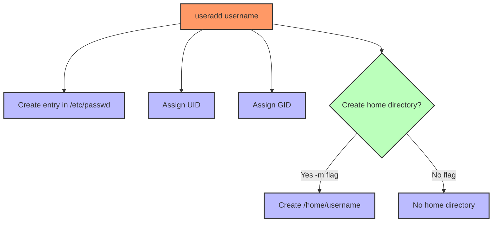

# Prompt for Transforming Day 8 Linux Training Material with Visual Elements

I'd like to transform the technical content in the attached linux_day08_v6.md file into a more engaging and inviting format, similar to the narrative style found in the corresponding day8_story.md. I want to enhance this material with visual elements like Mermaid diagrams to improve comprehension and engagement.

The current linux_day08_v6.md file covers user and group management in Linux for SREs, including commands like `useradd`, `userdel`, `usermod`, `groupadd`, `groupdel`, `passwd`, and working with `/etc/passwd` and `getent`. It uses a tiered approach for beginners through SRE-level professionals.

The corresponding day8_story.md follows Taylor back in San Francisco, USA as she returns to work with newfound confidence and implements proper user and group management for the analytics platform, creating service accounts with appropriate permissions.

## Transformation Goals

Please convert the Linux Day 8 training material (focusing on user and group management) into a more approachable learning experience while:

1. Maintaining all the technical accuracy and depth of the original material
2. Using a warmer, conversational tone that feels like a mentor guiding a new SRE
3. Incorporating realistic scenarios that show how proper user and group management improves security and functionality
4. Adding relatable analogies that help conceptualize user/group relationships and permissions
5. Preserving the tiered approach (Beginner/Intermediate/SRE-Level) that allows learners to progress at their own pace
6. Keeping all command tables, code examples, and technical details intact

## Narrative Elements to Include

Consider incorporating elements from Taylor's story:
- The transformation from nervous newcomer to confident contributor
- The satisfaction of implementing a proper user/group structure
- The methodical approach to creating service accounts with least privilege
- How user management ties together previous security improvements
- The perspective of an SRE who has grown in confidence and skill

Consider creating a semi-fictional "day in the life" scenario that:
- Follows Taylor as she implements the user and group structure
- Shows how she applies principles of least privilege and separation of duties
- Builds throughout the material to create a cohesive narrative arc
- Includes dialogue between Taylor and her mentor about security best practices
- Demonstrates how to properly document user/group changes for auditing purposes

## Structure to Maintain

Please preserve these key structural elements:
- Command breakdowns with syntax tables
- Tiered examples (Beginner → Intermediate → SRE-Level)
- Hands-on exercises
- Troubleshooting scenarios
- FAQ sections
- Further Learning Resources

**Important:** Please remove the "Knowledge Check: Quiz" section entirely from the transformed material. Instead, focus on reinforcing learning through practical scenarios and hands-on exercises that naturally test understanding.

## Visual Elements to Add

Please incorporate Mermaid diagrams to enhance understanding:

1. **User and Group Relationships**: Visual representation of how users, groups, and permissions interact
2. **Service Account Hierarchy**: Diagram showing the separation of service accounts and their functions
3. **User Management Workflow**: Steps in creating, modifying, and removing users
4. **Password Policies**: Visualization of password aging and security settings
5. **User Authentication Flow**: How user credentials are verified in Linux

For example, include a diagram showing user and group relationships:



Or a visualization of service account structure:



## Example Transformation

Please rewrite at least one section of the Day 8 material (such as the introduction or a command breakdown) to demonstrate the transformation approach. Show how the technical content can maintain its educational value while becoming more engaging through:

1. Narrative elements and character perspectives
2. Practical, relatable scenarios
3. Conversational tone that addresses the reader directly
4. Visual aids using Mermaid diagrams
5. Metaphors and analogies that explain technical concepts
6. "Pro tips" from experienced SREs

For example, transform this:
```
Command: useradd (User Add)
Creates new user accounts. This is critical for adding both standard users (humans) and specialized service users (daemons, system services). In SRE contexts, we often script `useradd` to automate user onboarding across fleets.
```

Into something like:

### Command: useradd (Creating Digital Identities)

Taylor reviewed the system requirements again. "We need distinct identities for each service, not just one general 'analytics' user," she explained to Sophia.

Think of `useradd` as the digital equivalent of creating new citizens for your Linux ecosystem. Just like in the physical world, each digital identity (user) needs specific documentation (UID/GID), a place to live (home directory), and defined rights (permissions).



When Taylor needed to create a service account that wouldn't interact with the system through a shell (like the analytics processor), she used:

```bash
sudo useradd -r -s /sbin/nologin analytics-process
```

The `-r` flag creates a system account with a UID below 1000, while `/sbin/nologin` ensures the account can't log in interactively—perfect for an automated service that should run with minimal privileges.

> **SRE INSIGHT:** "For service accounts, always use `-r` and a non-interactive shell like `/sbin/nologin`. This enforces the principle of least privilege—services get only what they need to function, nothing more." —Taylor
```