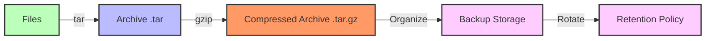
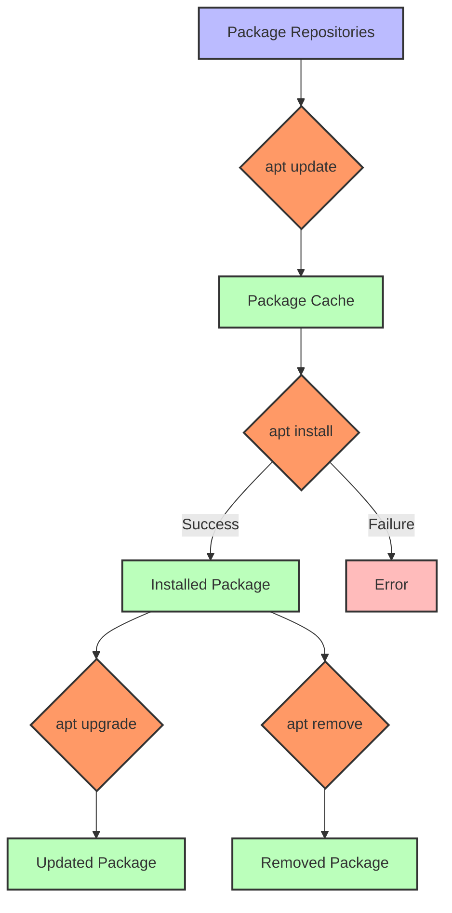
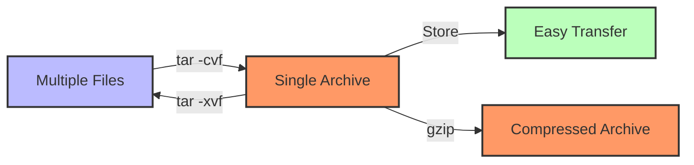

# Prompt for Transforming Day 9 Linux Training Material with Visual Elements

I'd like to transform the technical content in the attached linux_day09_v6.md file into a more engaging and inviting format, similar to the narrative style found in the corresponding day9_story.md. I want to enhance this material with visual elements like Mermaid diagrams to improve comprehension and engagement.

The current linux_day09_v6.md file covers archiving, compression, and package management in Linux for SREs, including commands like `tar`, `gzip`/`gunzip`, `zip`/`unzip`, `apt`, and `yum`/`dnf`. It uses a tiered approach for beginners through SRE-level professionals.

The corresponding day9_story.md follows Aanya back in Bengaluru, India as she implements comprehensive archiving, compression, and package management for the analytics platform, creating custom scripts for backup, rotation, and deployment.

## Transformation Goals

Please convert the Linux Day 9 training material (focusing on archiving, compression, and package management) into a more approachable learning experience while:

1. Maintaining all the technical accuracy and depth of the original material
2. Using a warmer, conversational tone that feels like a mentor guiding a new SRE
3. Incorporating realistic scenarios that show how proper archiving and package management improves system reliability and deployment consistency
4. Adding relatable analogies that help conceptualize complex concepts around archiving, compression, and package management
5. Preserving the tiered approach (Beginner/Intermediate/SRE-Level) that allows learners to progress at their own pace
6. Keeping all command tables, code examples, and technical details intact

## Narrative Elements to Include

Consider incorporating elements from Aanya's story:
- The methodical approach to creating proper archiving systems
- The satisfaction of implementing reliable, automated backup solutions
- Building Debian packages with maintainable, versioned structure
- The creation of deployment scripts with automatic rollback capabilities
- The perspective of an SRE who values both structure and proper contingency planning

Consider creating a semi-fictional "day in the life" scenario that:
- Follows Aanya as she addresses the need for proper archiving and deployment systems
- Shows how she applies structured thinking to create robust, automated solutions
- Builds throughout the material to create a cohesive narrative arc
- Includes dialogue between Aanya and team members about backup strategies and failsafe deployment
- Demonstrates how to properly document archiving and package management processes

## Structure to Maintain

Please preserve these key structural elements:
- Command breakdowns with syntax tables
- Tiered examples (Beginner → Intermediate → SRE-Level)
- Hands-on exercises
- Troubleshooting scenarios
- FAQ sections
- Further Learning Resources

**Important:** Please remove the "Knowledge Check: Quiz" section entirely from the transformed material. Instead, focus on reinforcing learning through practical scenarios and hands-on exercises that naturally test understanding.

## Visual Elements to Add

Please incorporate Mermaid diagrams to enhance understanding:

1. **Archiving Workflow**: Visual representation of how files are archived, compressed, and stored
2. **Compression Types**: Comparison of different compression methods and their uses
3. **Package Management Flow**: Diagram showing the lifecycle of package installation and management
4. **Backup Strategy**: Visualization of a tiered backup approach (daily, weekly, monthly)
5. **Deployment Pipeline**: How packages move from development to production with rollback capability

For example, include a diagram showing the archiving workflow:



Or a visualization of a package management system:



## Example Transformation

Please rewrite at least one section of the Day 9 material (such as the introduction or a command breakdown) to demonstrate the transformation approach. Show how the technical content can maintain its educational value while becoming more engaging through:

1. Narrative elements and character perspectives
2. Practical, relatable scenarios
3. Conversational tone that addresses the reader directly
4. Visual aids using Mermaid diagrams
5. Metaphors and analogies that explain technical concepts
6. "Pro tips" from experienced SREs

For example, transform this:
```
Command: tar (Tape Archive)
`tar` combines multiple files or directories into a single archive file. Usually used with compression tools (like `gzip`) to reduce size.
```

Into something like:

### Command: tar (The Digital Librarian)

Aanya surveyed the chaotic file structure on the server. "We need organization before we can implement proper backups," she explained to her teammate over a video call.

Think of `tar` as your digital librarian that gathers loose pages (files) into complete, organized books (archives). Just as a librarian preserves the original order and structure of documents, `tar` maintains file hierarchies, permissions, and metadata when bundling files together.



When Aanya needed to back up the entire configuration directory before implementing changes, she reached for `tar`:

```bash
# Create an archive with timestamp in the filename
$ tar -cvf config_backup_$(date +%Y%m%d).tar /etc/analytics/
```

> **SRE INSIGHT:** "I always include timestamps in backup filenames and verify my archives with `tar -tvf filename.tar` before deleting any originals. In production, assume that anything that can go wrong, will go wrong—especially during backups." —Aanya