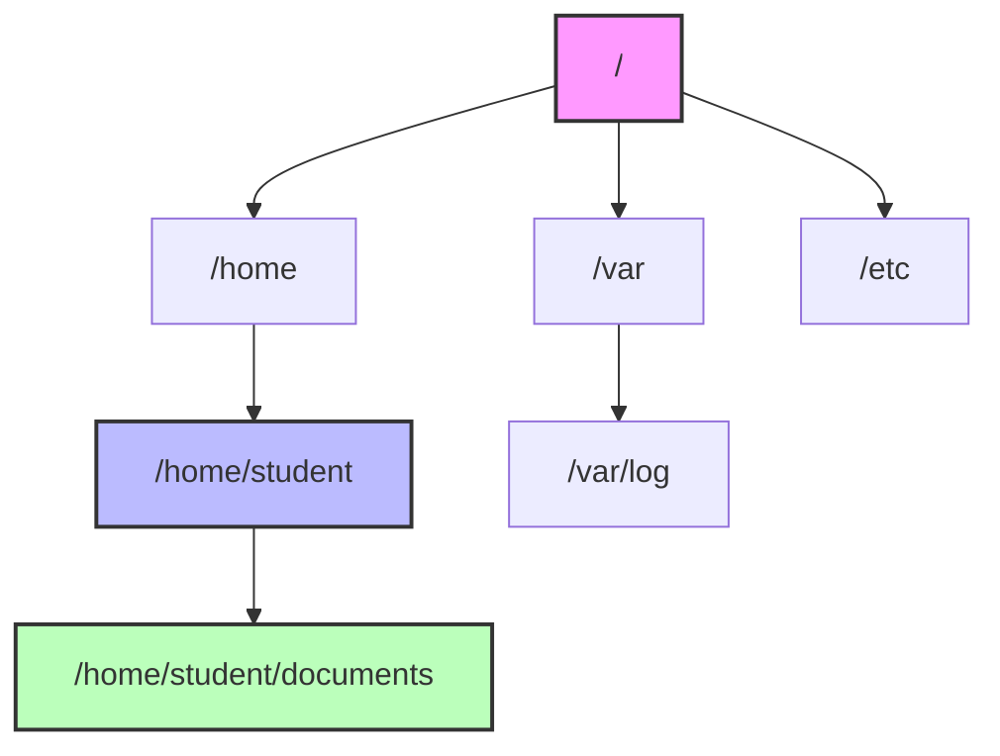
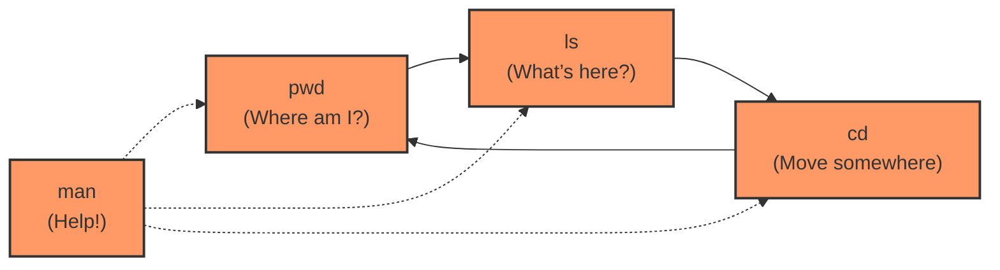

# **Day 1 : Navigating Linux Like an SRE**

Taylor took a nervous breath, stepping into their first on-call shift as a junior Site Reliability Engineer. The terminal prompt blinked ominously:

```
[taylor@linux-server ~]$
```

They’d read about `pwd`, `ls`, `cd`, and `man` commands, but never had to lean on them under real pressure—until now.

> **Sophia (Senior SRE):**  
> “Relax. These basic commands might look trivial, but in a pinch, they can save an entire production environment. Let’s walk through them step-by-step!”

---

## **Objectives by Skill Tier**

### **Beginner (Tier 1)**  
1. **Identify** what Linux is and why it’s so essential in production.  
2. **Recognize** the purpose of a shell and key commands (`pwd`, `ls`, `cd`, `man`).  
3. **Demonstrate** basic navigation in the filesystem.

### **Intermediate (Tier 2)**  
1. **Apply** extended command options (flags) for deeper insights.  
2. **Locate** and **utilize** help resources (`man`, `--help`, `info`).  
3. **Relate** the core filesystem structure to operational tasks.

### **SRE-Level (Tier 3)**  
1. **Diagnose** issues swiftly using command-line mastery.  
2. **Automate** environment checks for incident response.  
3. **Analyze** filesystem impacts on performance, security, and reliability.

**Why It Matters**: Every advanced SRE skill—from performance tuning to container orchestration—traces back to these fundamentals. You’ll build on this strong foundation in future days, tackling file manipulation, permissions, system monitoring, and more.

---

## **1. Introducing Linux**

- **Analogy**: Picture an engine room powering a gigantic ship—under the deck, invisible to most passengers, yet crucial to keep everything afloat. That’s Linux.  
- **Technical Note**: Linux is an **open-source operating system kernel**. Different distributions (Ubuntu, CentOS, Debian, etc.) add their own layers of software around the kernel.  
- **SRE Relevance**: Most large-scale infrastructure, cloud providers, and high-availability systems run on Linux for its stability, performance, and massive community support.

> **Sophia’s Take**: “When you’re investigating a production incident at 3 AM, you want the reliability and predictability Linux gives you.”

---

## **2. The Shell: Your Command-Line Companion**

- **Analogy**: The shell is like a translator. You speak commands in human syntax, and the shell interprets them for the operating system.  
- **Technical Note**: Shells like `bash` or `zsh` provide features such as command history, aliasing, and scripting.  
- **SRE Angle**: When you SSH into servers, you live in the shell to gather logs, run health checks, or deploy new code.

> **Taylor**: “It’s basically how I talk to the computer?”  
> **Sophia**: “Exactly. And once you know how to ‘talk’ properly, the system listens.”

---

## **3. Basic Filesystem Navigation**

Think of the filesystem like a **map of hallways and rooms**:

- `pwd` (Where am I?)  
- `ls` (What’s in this room?)  
- `cd` (Which room should I move to next?)

### **3.1 Simple Directory Layout**



**Why This Diagram?**: Visually showing the top-level directories (`/home`, `/var`, `/etc`) helps you see how navigation commands let you jump from place to place.

---

## **4. Command Relationship Flow**



---

## **5. In-Depth Command Breakdowns**

The following sections combine **Beginner, Intermediate, and SRE-level** use cases. Each command includes syntax tables, usage contexts, and cautionary insights so you can avoid pitfalls on production systems.

### **5.1 `pwd` (Print Working Directory)**  
> **“It’s my compass for checking my location!”**

| Flag/Option | Syntax Example | Description                               | SRE Usage Context                                 |
|-------------|----------------|-------------------------------------------|---------------------------------------------------|
| *(none)*    | `pwd`          | Prints your current (logical) directory   | Basic check (avoid guessing your location)        |
| `-L`        | `pwd -L`       | Shows the *logical* path (symlinks intact)| Useful if you rely on symbolic links              |
| `-P`        | `pwd -P`       | Prints the *physical* path (no symlinks)  | Essential in scripts to avoid location confusion  |

- **Beginner**:  
  ```bash
  $ pwd
  /home/student
  ```
  *Context*: You confirm you’re in `/home/student` instead of `/home/testuser`.

- **Intermediate**:  
  ```bash
  $ pwd -P
  /var/log/real_location
  ```
  *Context*: If `/var/log/latest` was a symlink, now you see the real path.

- **SRE-Level**:  
  ```bash
  if [[ "$(pwd -P)" != "/var/www/prod" ]]; then
    echo "Not in prod directory! Abort deploy."
    exit 1
  fi
  ```
  *Context*: Prevent accidental deployments to the wrong environment.

> **SRE Tip**: “I always run `pwd` in multiple SSH sessions to ensure I’m not about to run `rm -rf` in the wrong place.”

---

### **5.2 `ls` (List Directory Contents)**  
> **“A quick glance at what’s around.”**

| Flag/Option | Example     | Description                                              | SRE Usage Context                                     |
|-------------|------------|----------------------------------------------------------|-------------------------------------------------------|
| `-l`        | `ls -l`    | Long listing (shows permissions, size, ownership)        | Check file ownership, last modified dates             |
| `-a`        | `ls -a`    | Include hidden files (dotfiles)                          | Discover config files or environment variables        |
| `-h`        | `ls -lh`   | Human-readable file sizes                                | Immediately identify large files/logs                 |
| `-t`        | `ls -lt`   | Sort by modification time (newest first)                 | Track down recently updated logs during incident      |
| `-r`        | `ls -lr`   | Reverse listing order                                    | Handy for flipping sort output                        |

- **Beginner**:  
  ```bash
  $ ls
  documents  downloads  readme.txt
  ```
  *Context*: Quickly see what’s here.

- **Intermediate**:  
  ```bash
  $ ls -lt
  -rw-r--r-- 1 user user 10240 Jun  1 09:30 error.log
  -rw-r--r-- 1 user user  8192 Jun  1 09:10 app.log
  ```
  *Context*: Spot time-sensitive files—like the latest log updates.

- **SRE-Level**:  
  ```bash
  cd /var/log
  ls -lha
  ```
  *Context*: Large logs can hint at disk space issues or spammy error messages.

> **SRE Tip**: “Combine flags: `ls -lha | grep something` to quickly locate a suspicious file. Time is everything during an outage.”

---

### **5.3 `cd` (Change Directory)**  
> **“Move to the room where the action is.”**

| Flag/Option | Example       | Description                         | SRE Usage Context                         |
|-------------|--------------|-------------------------------------|-------------------------------------------|
| *(none)*    | `cd /var/log` | Moves into `/var/log`               | Checking logs, the first step in triaging |
| `-`         | `cd -`       | Switches back to your previous dir   | Bounce quickly between two directories    |
| `~`         | `cd ~`       | Jumps to your home directory         | Head back to your personal workspace      |

- **Beginner**:  
  ```bash
  $ cd Documents
  $ pwd
  /home/student/Documents
  ```
  *Context*: Simple navigation, but essential to get comfortable.

- **Intermediate**:  
  ```bash
  cd /var/log
  cd -
  ```
  *Context*: Toggle between logs and your home folder for quick checks.

- **SRE-Level**:  
  ```bash
  cd /var/www/production || { 
      echo "Cannot enter prod!"; exit 1; 
  }
  ```
  *Context*: In scripts, handle failures gracefully instead of pressing on in the wrong directory.

> **SRE Tip**: “`cd -` is a time-saver when you keep switching between `/etc` and `/var/log` in a frantic debug session.”

---

### **5.4 `man` (Manual Pages)**  
> **“A built-in library of command reference.”**

| Flag/Option | Example           | Description                                                | SRE Usage Context                           |
|-------------|-------------------|------------------------------------------------------------|---------------------------------------------|
| *(none)*    | `man ls`          | Shows the manual page for `ls`                            | Full reference for all flags and usage      |
| `-k`        | `man -k "disk"` | Search man pages for a keyword                             | Discover lesser-known tools (e.g., `fdisk`) |
| `-f`        | `man -f ls`       | Find which man-section a command belongs to (e.g. 1, 2, 5) | Differentiate system calls vs. user commands |

- **Beginner**:  
  ```bash
  $ man pwd
  ```
  *Context*: Explore official usage details for `pwd`.

- **Intermediate**:  
  ```bash
  $ man -k disk
  ```
  *Context*: Searching for commands that handle disk tasks.

- **SRE-Level**:  
  ```bash
  $ man systemd.unit
  ```
  *Context*: Advanced usage often found in deeper sections, crucial for service management.

> **SRE Tip**: “If in doubt, `man` it out. Relying on memory alone at 4 AM is risky!”

---

### **5.5 Filesystem Structure**

**Instead of a single command, understanding the layout is crucial.** Linux is systematically organized, with each directory serving a particular function.

| Location   | Example Path          | Description                                     | SRE Usage Context                          |
|------------|-----------------------|-------------------------------------------------|--------------------------------------------|
| `/`        | *(root directory)*    | The top-level of the filesystem tree           | All absolute paths begin here             |
| `/etc`     | `/etc/ssh/sshd_config`| Config files for services and daemons          | You’ll tweak server settings and configs   |
| `/var/log` | `/var/log/syslog`     | System & service logs                          | Key location for incident investigations   |
| `/home`    | `/home/taylor`        | User home directories                          | Each user’s personal files + dev scripts   |
| `/usr/bin` | `/usr/bin/bash`       | Common executables                             | Where standard commands typically reside   |

- **Beginner**:  
  ```bash
  cd /
  ls
  ```
  *Context*: See top-level directories like `bin`, `etc`, `home`, `var`, etc.

- **Intermediate**:  
  ```bash
  ls -l /etc
  ```
  *Context*: Configuration storehouse—where you might fix issues or update settings.

- **SRE-Level**:  
  ```bash
  grep -Ri "ERROR" /var/log/
  ```
  *Context*: Recursively search for errors across multiple log files.

> **SRE Tip**: “Knowing where to look is half the battle. Quick moves to `/etc`, `/var/log`, or `/home` can save hours.”

---

## **6. Real-World System Effects**

1. **Filesystem & Metadata**  
   - These navigation commands query metadata (file listings, current directory), generally causing minimal system changes.

2. **Resource Use**  
   - Typically low overhead—unless you list very large directories or grep large log files.

3. **Security Implications**  
   - Accessing protected directories or hidden files might expose sensitive data if permissions aren’t handled carefully.

4. **Auditing & Visibility**  
   - Basic user commands aren’t always logged by default, but any changes you make to config files (in `/etc`, for example) will be traceable.

> **Sophia**: “Never assume ‘ls’ or ‘pwd’ are always harmless. They might reveal directory structures or show private data if the system is configured for advanced auditing.”

---

## **7. Reinforcement Through Hands-On Exercises**

*(No multiple-choice quiz here—just practical tasks to **test your skills in real time**.)*

### **7.1 Beginner (Tier 1)**  
1. **Find Your Bearings**  
   - **Task**: Type `pwd`, then `ls`. What’s in your current directory?  
   - **Goal**: Get comfortable with the two most common commands.

2. **Move Around**  
   - **Task**: Make a folder (`mkdir practice`) in your home directory, then `cd practice`.  
   - **Goal**: See how directory creation and navigation flow together.

3. **Check Documentation**  
   - **Task**: Run `man ls`. Skim the flags, then press `q` to exit.  
   - **Goal**: Understand basic usage of `ls` from official sources.

### **7.2 Intermediate (Tier 2)**  
1. **Detailed Listing in `/var/log`**  
   - **Task**: Run `ls -lt` inside `/var/log` and note the top 2–3 recently updated files.  
   - **Goal**: Identify how the modification times can point to active logs.

2. **Hidden Files**  
   - **Task**: Run `ls -a` in your home directory. Look for `.bashrc` or `.env`.  
   - **Goal**: Recognize the importance of dotfiles (hidden config) for user sessions.

3. **Filesystem Exploration**  
   - **Task**: `ls -l /etc` and observe ownership/permissions on config files.  
   - **Goal**: Tie file permissions to security and reliability.

### **7.3 SRE-Level (Tier 3)**  
1. **Pre-Deployment Safety**  
   - **Task**: Write a script that checks `(pwd -P)` for `/var/www/prod` before pulling code. Abort if it’s not matched.  
   - **Goal**: Prevent accidental staging → production or vice-versa mistakes.

2. **Log Triage**  
   - **Task**: In `/var/log`, find the largest files via `ls -lh | sort -hk5` and then grep for “ERROR.”  
   - **Goal**: Simulate how you’d respond to an outage or disk usage alert.

3. **Multi-Directory Audit**  
   - **Task**: Create a script to check `/etc` for recently changed config files, then hop to `/var/log` to summarize suspicious lines in `syslog`.  
   - **Goal**: Practice a micro-incident response flow.

> **Taylor**: “After these exercises, I feel more confident already!”

---

## **8. Troubleshooting Scenarios**

Even small commands can have big consequences. Here’s how these basics play into real incident triage:

1. **Permission Denied**  
   - **Symptom**: `cd /var/log/app` → “Permission denied.”  
   - **Diagnostics**: `ls -ld /var/log/app` to see ownership and permission bits.  
   - **Fix**: If appropriate, `sudo chown` or `chmod` to adjust.  
   - **Advice**: Follow standard permission frameworks so you don’t break security.

2. **Symlink Confusion**  
   - **Symptom**: A deploy script references `/var/www/live`, but the real path is `/var/www/production`.  
   - **Diagnostics**: `pwd -P` after `cd /var/www/live` to reveal the real location.  
   - **Fix**: Correct or recreate the symlink (`ln -s /var/www/production /var/www/live`).  
   - **Advice**: Keep documented references for each symlink to avoid confusion.

3. **Logs Not Updating**  
   - **Symptom**: `ls -lt /var/log` shows no recent changes, yet the app is presumably running.  
   - **Diagnostics**: Check config in `/etc` (e.g. `/etc/app.conf`) for logging directives.  
   - **Fix**: Re-enable logging or point logs to the expected path.  
   - **Advice**: For new or custom apps, always verify logging is set up as expected.

---

## **9. FAQs**

### **9.1 Beginner FAQs (Tier 1)**
1. **How do I go up one directory?**  
   - **Answer**: `cd ..`  
   - **Why It Matters**: Commonly used to move from a subfolder back to a more general location.

2. **Why is Linux the go-to OS for servers?**  
   - **Answer**: It’s stable, resource-light, and secure, with no unnecessary GUI overhead.  
   - **Context**: Amazon, Google, Microsoft—most run Linux on their servers behind the scenes.

3. **Is Linux case-sensitive?**  
   - **Answer**: **Yes**. `File.txt` ≠ `file.txt`.  
   - **Caution**: Typos in filename case lead to “command not found” or “No such file” errors.

### **9.2 Intermediate FAQs (Tier 2)**
1. **How can I show hidden files by default?**  
   - **Answer**: In your `~/.bashrc` or `~/.zshrc`, add `alias ls='ls -a --color=auto'`.  
   - **Why**: Speed and convenience if you’re frequently managing dotfiles.

2. **What does `man -k "keyword"` do?**  
   - **Answer**: Searches all man pages for that keyword.  
   - **Use**: Great when you suspect “disk management” tools exist but can’t recall the name.

3. **Why do some commands lack a man page?**  
   - **Answer**: Not all tools (especially smaller or custom ones) ship with man pages.  
   - **Alternative**: Try `<command> --help` or read internal docs.

### **9.3 SRE-Level FAQs (Tier 3)**
1. **How do I toggle between two directories quickly?**  
   - **Answer**: `cd -`.  
   - **Why**: Perfect for flipping between `/etc` and `/var/log` during a crisis.

2. **How do I handle multiple shells open?**  
   - **Answer**: Customize your shell prompt or label terminal tabs.  
   - **Result**: Less confusion; fewer “Oops, that was the production server!” errors.

3. **How do SREs handle huge logs filling the disk?**  
   - **Answer**: Rotate them (`logrotate`), compress old data, or ship logs externally (e.g., ELK stack).  
   - **Reason**: Avoid unexpected downtime due to full partitions.

---

## **10. A Day-in-the-Life SRE Scenario**

**Incident**: The production web server slows to a crawl at midnight. Taylor gets paged.

1. **SSH & Check Directory**  
   ```bash
   ssh taylor@prod-webserver
   pwd
   ```
   *Rationale*: Ensure it’s the correct server (never assume!).  

2. **Navigate to Logs**  
   ```bash
   cd /var/log
   ls -lh
   ```
   *Rationale*: Identify large logs quickly.  

3. **Recent Updates**  
   ```bash
   ls -lt
   ```
   *Rationale*: See which files spiked or changed right before the slowdown.

4. **Grep for Errors**  
   ```bash
   grep -Ri "CRITICAL" .
   ```
   *Rationale*: Focus on severe messages that might reveal the root cause.

5. **Rotate or Clear Logs**  
   ```bash
   mv big_app.log big_app.log.backup
   echo "" > big_app.log
   ```
   *Rationale*: Free disk space instantly.  

6. **Double Check**  
   ```bash
   df -h
   systemctl status web-app
   ```
   *Rationale*: Confirm disk usage is stable and service recovers.  

> **Sophia**: “And that’s how a simple combination of `pwd`, `cd`, `ls`, and `grep` can solve a midnight crisis!”

---

## **11. Core Takeaways**

1. **Essential Commands**  
   - `pwd`, `ls`, `cd`, `man`, and filesystem knowledge form your SRE foundation.  
2. **Operational Insights**  
   - Always confirm your directory with `pwd -P` when it matters (like in a deploy script).  
   - Searching logs by time with `ls -lt` can lead you to the culprit in an outage.  
3. **Best Practices**  
   - Keep logs under control (rotate, compress).  
   - Use `man -k` to discover new or forgotten commands.  
   - Master the filesystem layout—knowing where configs and logs live is half the battle.

> **Taylor**: “I get it now. These ‘simple’ commands are my best friends when everything hits the fan.”

---

## **12. What’s Next?**

Next session, focuses on:
- **File Manipulation**: `touch`, `mv`, `rm`, `cat`, `tail`  
- **Permissions**: `chmod`, `chown`  
- **Advanced Troubleshooting**: Dig deeper into logs, config changes, and system resource usage

You’ll build on your new navigation skills to **manipulate** files safely, manage **permissions** for better security, and bolster your SRE capabilities for real-world incidents.

---

## **Further Resources**

### **12.1 Beginner (Tier 1)**  
1. **Linux Journey (Shell Basics)**  
   [https://linuxjourney.com/lesson/the-shell](https://linuxjourney.com/lesson/the-shell)  

2. **The Linux Command Line (William Shotts)**  
   [http://linuxcommand.org/tlcl.php](http://linuxcommand.org/tlcl.php)  

### **12.2 Intermediate (Tier 2)**  
1. **Filesystem Hierarchy Standard**  
   [https://refspecs.linuxfoundation.org/FHS_3.0/fhs-3.0.html](https://refspecs.linuxfoundation.org/FHS_3.0/fhs-3.0.html)  

2. **ExplainShell**  
   [https://explainshell.com/](https://explainshell.com/)  

### **12.3 SRE-Level (Tier 3)**  
1. **Google SRE Book (Emergency Handling Chapter)**  
   [https://sre.google/sre-book/](https://sre.google/sre-book/)  

2. **Advanced Bash-Scripting Guide**  
   [http://tldp.org/LDP/abs/html/](http://tldp.org/LDP/abs/html/)  

3. **Linux Performance Optimization**  
   [https://www.brendangregg.com/linuxperf.html](https://www.brendangregg.com/linuxperf.html)  

---

# **Congratulations!**
You’ve completed the training material with a deeper understanding of **Linux navigation**. By mastering `pwd`, `ls`, `cd`, `man`, and the filesystem layout, you’re prepared to tackle real-world incident response and routine SRE tasks with confidence. The next steps—file manipulation and permissions—will build on this solid bedrock.
