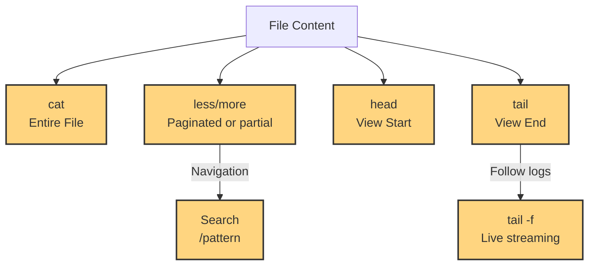
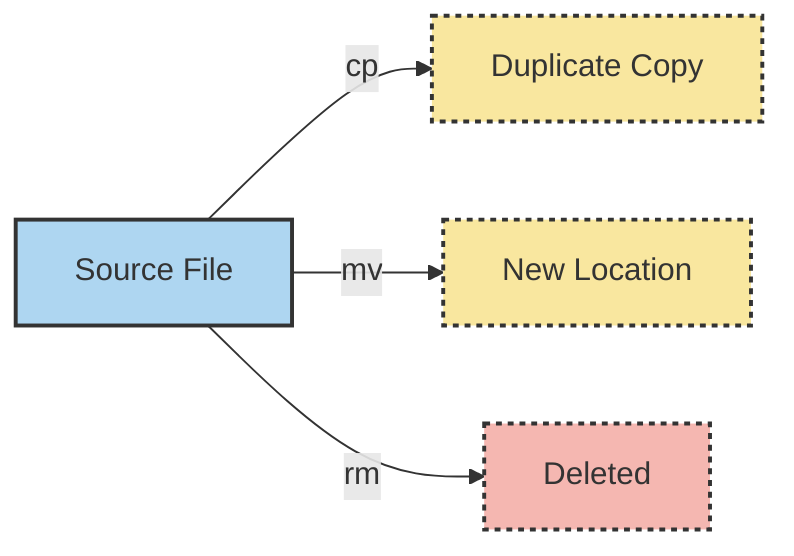

# **Day 2 and 3: File Manipulation for SREs**

Noah paced around his desk, sipping a flat white as early-morning light spilled into the Sydney office. Late last night, Taylor had left a note about some tricky log issues. Today, Noah would dive in, using the foundational **file manipulation** skills every Site Reliability Engineer (SRE) needs to keep production systems stable.

> “Log backups, housekeeping, and quick file reads can make or break your incident response,” Noah thought.  
> “Better brush up on these commands before the real firefights begin.”

## **1. Introduction: Why File Manipulation Matters**

In Linux, files are everywhere—logs, configurations, backups, and more. As an SRE, Noah often faces tasks like:

- **Cloning** and **archiving** production configs (so they can be restored if an update fails)  
- **Inspecting** giant logs to debug issues in real time  
- **Organizing** data into directories that reflect deployments, versions, or user-generated content

Below is a structured approach to mastering these tasks:

- **Beginner**: Safely create and remove files/folders, read file contents  
- **Intermediate**: Copy or move large directories, manage partial log viewing, automate routine housekeeping  
- **SRE-Level**: Script-based operations, advanced timestamp manipulation, log rotations, and security audits

> **Pro Tip**: “Sometimes the simplest commands—like `ls`, `cat`, or `rm`—are all you need under pressure,” Noah says, “but you have to use them surgically!”

---

## **2. Core Concepts**

Before diving into individual commands, let’s anchor these file manipulations in real SRE work:

1. **File Creation**: Stashing placeholders or generating new config files  
2. **Viewing Files**: Checking logs or scanning config lines under time pressure  
3. **Copying & Moving**: Duplicating data for backups or relocating logs  
4. **Deleting Files**: Freeing up space, clearing out old data  
5. **Reliability Engineering Considerations**: Balancing performance, security, backups, and automation

Noah’s day typically starts with a quick check of logs:

```bash
ls -lh /var/log
tail -n 20 /var/log/nginx/error.log
```

A small, routine action like this can reveal big issues—like an application spamming error logs or running out of disk space.

---

## **3. Command Breakdown (Tiered Approach)**

Below are 11 essential commands for Day 2. Each command has **syntax tables**, **tiered examples**, and **notes** to guide you from basic usage to SRE-level mastery. Throughout, we’ll drop in short scenarios from Noah’s daily life.

---

### **Command: touch (create/update file timestamps)**

> Think of `touch` as a way to place an empty piece of paper on your desk—unless the paper (file) already exists. In that case, you just straighten it up and note a new time.

Noah often uses `touch` to create placeholder files for logs or to adjust timestamps to simulate older or newer data.

**Syntax & Flags**:

| Flag/Option | Syntax Example               | Description                                             | SRE Usage Context                               |
|-------------|------------------------------|---------------------------------------------------------|-------------------------------------------------|
| *(none)*    | `touch myfile.txt`          | Creates a file if not present, else updates timestamps. | Quick creation of placeholder or test files.    |
| `-a`        | `touch -a myfile.txt`       | Updates only the file’s access time.                    | Testing read-based triggers/behaviors.          |
| `-m`        | `touch -m myfile.txt`       | Updates only the file’s modification time.              | Script-based checks that rely on modify times.  |
| `-t`        | `touch -t 202503251200 file`| Sets a custom timestamp (YYYYMMDDhhmm).                 | Simulate old/new files for log rotation tests.  |

**Tiered Examples**:

- **Beginner**:  
  ```bash
  touch demo.log
  ls -l demo.log
  ```
  *Creates an empty `demo.log` if it doesn’t exist.*

- **Intermediate**:  
  ```bash
  touch -a report.txt
  stat report.txt  # Notice the Access timestamp updated
  ```

- **SRE-Level**:  
  ```bash
  touch -t 202303010700 service.log
  # Force a script to treat 'service.log' as older
  ```

**SRE Insight**: Noah says, “When your log rotation script only archives files older than 7 days, `touch -t` can help you verify that logic without waiting a week.”

---

### **Command: mkdir (make directory)**

> “If `touch` is placing a piece of paper down, then `mkdir` is building the entire file cabinet,” jokes Noah.

**Syntax & Flags**:

| Flag/Option | Syntax Example                | Description                                               | SRE Usage Context                            |
|-------------|-------------------------------|-----------------------------------------------------------|----------------------------------------------|
| *(none)*    | `mkdir logs`                 | Create a single directory named `logs`.                   | Basic directory setup.                       |
| `-p`        | `mkdir -p /path/sub1/sub2`   | Create parent directories as needed.                      | Nested paths in automation scripts.          |
| `-m`        | `mkdir -m 700 secure_folder` | Create directory with specified permissions immediately.  | Protect directories containing secrets.      |

**Tiered Examples**:

- **Beginner**:
  ```bash
  mkdir projects
  ls -l
  ```
- **Intermediate**:
  ```bash
  mkdir -p /var/www/myapp/releases/v1.2.3
  ```
- **SRE-Level**:
  ```bash
  mkdir -m 700 /etc/secure_configs
  ```

**SRE Insight**: For versioned deployments, Noah might do `mkdir -p /var/deploys/myapp/$(date +%Y%m%d)`. This ensures a neat timestamped structure for easy rollbacks.

---

### **Command: cat (concatenate)**

> “Reading the entire file in one swoop—like flipping through an entire notebook page by page,” says Noah.

**Syntax & Flags**:

| Flag/Option | Syntax Example   | Description                                                 | SRE Usage Context                          |
|-------------|------------------|-------------------------------------------------------------|--------------------------------------------|
| *(none)*    | `cat file.txt`   | Display the entire file.                                    | Quick checks of small files.               |
| `-n`        | `cat -n file.txt`| Number each line in output.                                 | Referencing line numbers in logs/configs.  |
| `-A`        | `cat -A file.txt`| Show non-printing characters (like whitespace, line ends).  | Debug hidden formatting issues.            |

**Tiered Examples**:

- **Beginner**:
  ```bash
  cat config.ini
  ```
- **Intermediate**:
  ```bash
  cat -n error.log
  ```
- **SRE-Level**:
  ```bash
  cat /var/log/app1.log /var/log/app2.log | grep CRITICAL > combined.log
  ```

---

### **Command: less (file pager)**

> “Think of `less` as flipping through a thick book at your own speed, with the option to jump around or search for specific words.”

**Syntax & Flags**:

| Flag/Option | Syntax Example             | Description                                       | SRE Usage Context                        |
|-------------|----------------------------|---------------------------------------------------|------------------------------------------|
| *(none)*    | `less largefile.log`      | Opens file in a pager for navigation.             | Day-to-day log analysis in production.   |
| `-N`        | `less -N config.yml`      | Display line numbers.                             | Quickly reference lines in config files. |
| `-S`        | `less -S wide.log`        | Disable line wrapping (chop lines).               | Handling very wide JSON or log lines.    |
| `+F`        | `less +F /var/log/syslog` | Follow mode, akin to `tail -f`, but scrollable.    | Real-time log watching with scrollback.  |

**Tiered Examples**:

- **Beginner**:
  ```bash
  less /var/log/syslog
  ```
- **Intermediate**:
  ```bash
  less -N -S /var/log/nginx/error.log
  ```
- **SRE-Level**:
  ```bash
  cat /var/log/app/*.log | less
  ```

> “When you’re scanning huge logs, `less` is your friend—especially if you need to jump backward,” Noah says.

---

### **Command: more (basic pager)**

> A simpler pager: you can only move forward. It’s like reading a stapled report without the ability to flip back.

**Syntax & Flags**:

| Flag/Option | Syntax Example  | Description                                  | SRE Usage Context                   |
|-------------|-----------------|----------------------------------------------|-------------------------------------|
| *(none)*    | `more file.log` | Display file in pages; press space to scroll | Minimal environments or rescue mode |
| `-d`        | `more -d file`  | Show navigation prompts.                     | Guides new users on how to proceed  |

**Tiered Examples**:

- **Beginner**:
  ```bash
  more /etc/passwd
  ```
- **Intermediate**:
  ```bash
  more -d /var/log/messages
  ```
- **SRE-Level**:
  ```bash
  # Minimal shell environment, no `less` available
  more /mnt/chroot/var/log/boot.log
  ```

---

### **Mermaid Diagram: File Viewing Hierarchy**



> This diagram shows how each tool (cat, less, more, head, tail) can help you target **specific parts** of a file.

---

### **Command: head (view file start)**

> “If you only want to read the ‘title page’ of a book—like the first 10 lines—`head` is your speed-read buddy.”

**Syntax & Flags**:

| Flag/Option | Syntax Example          | Description                                      | SRE Usage Context                    |
|-------------|-------------------------|--------------------------------------------------|--------------------------------------|
| *(none)*    | `head file.txt`        | Show first 10 lines by default.                  | Quick peek at top of logs/configs.   |
| `-n`        | `head -n 20 file.txt`  | Specify the number of lines.                     | Custom portion of the beginning.     |
| `-c`        | `head -c 100 file.txt` | Show the first 100 bytes.                        | Partial binary data or encoding test.|

**Tiered Examples**:

- **Beginner**:
  ```bash
  head /var/log/syslog
  ```
- **Intermediate**:
  ```bash
  head -n 20 app.log
  ```
- **SRE-Level**:
  ```bash
  zcat /var/log/app-archive.gz | head -n 15
  ```

---

### **Command: tail (view file end)**

> “Imagine you only care about the last page—`tail` gives you that final chapter. `tail -f` means reading newly arriving lines live, great for diagnosing active incidents.”

**Syntax & Flags**:

| Flag/Option | Syntax Example         | Description                                   | SRE Usage Context                      |
|-------------|------------------------|-----------------------------------------------|----------------------------------------|
| *(none)*    | `tail file.log`       | Show last 10 lines by default.                | Quick peek at recent entries.          |
| `-n`        | `tail -n 20 file.log` | Show the last 20 lines.                       | Slightly deeper look at the log tail.  |
| `-f`        | `tail -f file.log`    | Follow mode: see new lines as they’re added.  | Live monitoring (incident debugging).  |
| `-F`        | `tail -F file.log`    | Follow mode, handling log rotation.           | Production logs that rotate often.     |

**Tiered Examples**:

- **Beginner**:
  ```bash
  tail /var/log/messages
  ```
- **Intermediate**:
  ```bash
  tail -n 50 /var/log/app/debug.log
  ```
- **SRE-Level**:
  ```bash
  tail -F /var/log/myapp/current.log
  ```

---

### **Command: cp (copy)**

> “A direct photocopy machine for your files. On the same disk or across different paths, `cp` helps you back up or duplicate important data.”

**Syntax & Flags**:

| Flag/Option | Syntax Example                    | Description                                                                  | SRE Usage Context                                       |
|-------------|-----------------------------------|------------------------------------------------------------------------------|---------------------------------------------------------|
| *(none)*    | `cp source.txt dest.txt`          | Copy `source.txt` → `dest.txt`.                                              | Basic file duplication.                                 |
| `-r`        | `cp -r /src/dir /dest/dir`        | Recursively copy directories.                                                | Copy entire folder structures (logs, config sets).      |
| `-p`        | `cp -p file1 file2`              | Preserve permissions, ownership, timestamps.                                 | Maintain metadata for audits/backups.                   |
| `-a`        | `cp -a /etc/nginx /backup/nginx`  | Archive mode: preserve links, perms, etc.                                    | Full backups, identical metadata.                       |
| `-i`        | `cp -i source.txt dest.txt`       | Interactive prompt before overwrite.                                         | Avoid overwriting critical data in production.          |

**Tiered Examples**:

- **Beginner**:
  ```bash
  cp file1.txt file2.txt
  ls
  ```
- **Intermediate**:
  ```bash
  cp -rp /var/www/ /home/user/www_backup/
  ```
- **SRE-Level**:
  ```bash
  cp -a /etc/nginx/ /backup/nginx_$(date +%Y%m%d)
  ```

---

### **Command: mv (move/rename)**

> “Think of `mv` like physically picking up a folder and placing it elsewhere—or simply renaming it.”

**Syntax & Flags**:

| Flag/Option | Syntax Example              | Description                                    | SRE Usage Context                  |
|-------------|-----------------------------|------------------------------------------------|------------------------------------|
| *(none)*    | `mv old.txt new.txt`       | Renames or moves `old.txt` to `new.txt`.       | Simple rename or relocate.         |
| `-i`        | `mv -i source target`      | Prompt before overwrite if target exists.      | Safe approach for critical data.   |
| `-v`        | `mv -v file1 file2`        | Verbose output, shows rename steps.            | Logging rename operations.         |
| `-b`        | `mv -b config config.bak`  | Backup the destination file if it exists.      | Minimizing risk of overwriting.    |

**Tiered Examples**:

- **Beginner**:
  ```bash
  mv test.txt report.txt
  ```
- **Intermediate**:
  ```bash
  mv -v /var/log/app/*.log /var/log/app/archive/
  ```
- **SRE-Level**:
  ```bash
  mv -b /etc/myapp/config.yml /etc/myapp/config.yml.old
  ```

---

### **Command: rm (remove)**

> “When you’re sure you don’t need those old logs or temp files anymore, `rm` is how you toss them in the bin. But be careful—there’s no built-in undo!”

**Syntax & Flags**:

| Flag/Option | Syntax Example       | Description                                                  | SRE Usage Context                         |
|-------------|----------------------|--------------------------------------------------------------|-------------------------------------------|
| *(none)*    | `rm file.txt`        | Removes specified file.                                      | Routine cleanup of single files.          |
| `-r`        | `rm -r folder`       | Recursively remove a folder and its contents.                | Deleting directory trees (logs, backups). |
| `-i`        | `rm -i file.txt`     | Interactive mode; prompts before removing each file.         | Safer for critical data.                  |
| `-f`        | `rm -f file.txt`     | Force removal, no prompts.                                   | Automated scripts that must ignore errors.|
| `-v`        | `rm -v file.txt`     | Verbose output, printing each removed file.                  | Logging deletions in housekeeping scripts.|

**Tiered Examples**:

- **Beginner**:
  ```bash
  rm old_file.txt
  ```
- **Intermediate**:
  ```bash
  rm -ri archive/
  ```
- **SRE-Level**:
  ```bash
  rm -rfv /var/log/app/old_logs/
  ```

> **Pro Tip**: Noah sometimes **moves** files into a “trash” directory first, verifying them before final removal. This mimics an “undo” at scale.

---

### **Command: rmdir (remove directory)**

> “`rmdir` is only for empty directories. If there’s any leftover file, you need `rm -r` or a thorough clean first.”

**Syntax & Flags**:

| Flag/Option | Syntax Example                      | Description                                     | SRE Usage Context              |
|-------------|-------------------------------------|-------------------------------------------------|--------------------------------|
| *(none)*    | `rmdir empty_dir`                   | Removes an empty directory.                     | Safe removal of placeholders.  |
| `-p`        | `rmdir -p parent/child/grandchild`  | Removes nested dirs if each is empty.           | Cleaning up nested empty dirs. |

**Tiered Examples**:

- **Beginner**:
  ```bash
  rmdir temp
  ```
- **Intermediate**:
  ```bash
  rmdir -p logs/archive/2025
  ```
- **SRE-Level**:
  ```bash
  find /tmp -type d -empty -exec rmdir {} \;
  ```

---

### **Mermaid Diagram: File Operation Flows**



> Visualizing how files move or vanish helps solidify these mental models.

---

## **4. System Effects of File Commands**

- **Filesystem & Metadata Updates**: Each time you create, move, or remove files, the system updates timestamps, inodes, and directory structures.  
- **Resource Consumption**: Copying large files is disk-I/O heavy. Repetitive real-time logs can spike CPU usage.  
- **Security Implications**: Accidentally copying sensitive files to a public path or forcibly removing logs needed for an audit can be disastrous.  
- **Monitoring & Auditing**: SRE teams often track file operations via tools like `auditd`. “You can’t hide an `rm -rf /` from the logs,” Noah jokes.

---

## **5. Hands-On Exercises**

> Instead of a quiz, let’s test your understanding with practical tasks. Put on your detective hat—like Noah investigating a mysterious error at 3 AM.

### **Beginner Tier**

1. **Simple File/Directory Practice**  
   - Create a directory named `day2_practice`.  
   - Inside it, run `touch file1.txt file2.txt`.  
   - Verify their existence with `ls`; remove `file2.txt` using `rm` and confirm it’s gone.

2. **View Contents**  
   - In `file1.txt`, add text: `echo "Hello, SRE!" > file1.txt`.  
   - Use `cat`, then `head` and `tail` to view the file.  
   - Try `less file1.txt` to scroll smoothly.

3. **Build and Remove Nested Directories**  
   - Create nested directories with `mkdir -p nested/dir/structure`.  
   - Observe what happens if you try `rmdir structure`.  
   - Finally, remove it with `rm -r nested/dir/structure`.

### **Intermediate Tier**

1. **Copying and Moving**  
   - Make a `logs` folder: `mkdir logs`.  
   - Generate a log file:
     ```bash
     for i in {1..50}; do echo "Log line $i" >> logs/app.log; done
     ```
   - Copy `logs/app.log` to `logs/app_backup.log` using `-p` to preserve timestamps.  
   - Move `logs/app_backup.log` to an `archive/` folder (create if needed), renaming it `old_app.log`.

2. **Partial Viewing and Large File**  
   - Append 50 more lines to `logs/app.log`.  
   - Use `head -n 10 logs/app.log` and `tail -n 10 logs/app.log` to see the new lines.  
   - Open it with `less -N` to show line numbers.  
   - Filter for a specific line using:
     ```bash
     cat logs/app.log | grep "Log line 75"
     ```

3. **Automated Cleanup**  
   - Create multiple empty files: `touch cleanup{1..5}.tmp`.  
   - Write a small script or command sequence that moves all `.tmp` files to a `trash` folder.  
   - If `trash` doesn’t exist, `mkdir -p trash` first.

### **SRE-Level Tier**

1. **Timestamp Rotation Simulation**  
   - `touch -t 202303010800 old.log` to make a “week-old” file.  
   - Write a script that checks for `.log` files older than 5 days, then moves them to `archive/`.  
   - Confirm the move worked with `ls archive/`.

2. **Live Log Analysis**  
   - In one terminal, run `tail -F /var/log/syslog`.  
   - Trigger events (e.g., `sudo systemctl restart cron`).  
   - Observe real-time logs.  
   - Copy lines with errors to `incident.log`:
     ```bash
     tail -F /var/log/syslog | grep -i error >> incident.log
     ```

3. **Recursive Backup and Cleanup**  
   - `cp -a /etc/nginx/ /backup/nginx_YYYYMMDD` for a complete backup.  
   - Remove leftover `.bak` files older than 7 days in `/backup/nginx_*`.  
   - Use verbose removal (`rm -v`) or log these deletions.

---

## **6. Troubleshooting Scenarios**

**Scenario 1: Log Flooding**  
- **Symptoms**: Noah sees `tail -f /var/log/app.log` produce thousands of lines/minute; CPU spikes.  
- **Cause**: Possibly a bug or misconfigured log level spamming errors.  
- **Fix**: Filter logs with `grep "CRITICAL"` to focus, then correct the logging level.  
- **Prevention**: Log rotation, minimal debug logs in production.

**Scenario 2: Disk Full When Copying**  
- **Symptoms**: `cp` fails with “No space left on device.”  
- **Cause**: Destination partition out of space or inodes.  
- **Fix**: `df -h`, `df -i` to check usage. Remove old data or expand partition.  
- **Prevention**: Disk usage alerts and routine housekeeping.

**Scenario 3: Directory Not Empty**  
- **Symptoms**: `rmdir myfolder` fails.  
- **Cause**: Hidden files or subdirectories remain.  
- **Fix**: `ls -la myfolder`, then `rm -r myfolder`.  
- **Prevention**: Thorough cleanup scripts.

---

## **7. FAQ**

> Here are the most common queries we see from new SREs. If you still have questions, consider it another puzzle piece in your detective work!

### **Beginner FAQs**

1. **Can I undo an `rm` command?**  
   No. Linux doesn’t have a built-in recycle bin. Always confirm before deleting.

2. **Why does `cat` sometimes show garbage characters?**  
   The file may be binary or compressed. For compressed logs, use `zcat` or tools like `less` with `zless`.

3. **What if I get “Permission denied” when creating or removing files?**  
   You may need `sudo` privileges or may be in the wrong directory. Use `ls -l` and `whoami` to diagnose.

### **Intermediate FAQs**

1. **How can I safely remove many files without risking a wildcard mishap?**  
   Use interactive mode (`rm -i`) or echo the command first (`echo rm file*`). Some SREs also move them to a “trash” dir.

2. **Should I use `cp` or `rsync` for backups?**  
   `cp` works for local quick copies. `rsync` is better for incremental or remote backups, offering checksums and partial transfers.

3. **What’s the difference between `tail -f` and `tail -F`?**  
   `-F` handles log rotation gracefully, continuing to follow the new file if the original log is renamed or replaced.

### **SRE-Level FAQs**

1. **How can I manage extremely large logs in production?**  
   Use `logrotate`, centralize logs (ELK/Splunk), or reduce verbosity. Tailing multi-GB logs can be unscalable.

2. **When moving large directories across disks, is `mv` enough?**  
   Moving across different disks = copy + delete. Consider `rsync` with checksums for data integrity, then remove the original.

3. **How do I audit who deleted critical files?**  
   Enable frameworks like `auditd`. You can log create/unlink events. Essential for forensic analysis.

---

## **8. SRE Scenario: Quick Incident Log Analysis**

Noah once found the production web service returning **502 errors**. He had **15 minutes** to figure out why. He:

1. **SSH’d into the server** to access logs quickly:
   ```bash
   ssh noah@prod-web01
   ```
2. **Checked Nginx error logs** in real time:
   ```bash
   tail -F /var/log/nginx/error.log
   ```
3. **Looked at application logs**:
   ```bash
   less +F /var/log/myapp/app.log
   ```
   “I found the 502’s root cause was a dying upstream service,” he noted.
4. **Searched for CRITICAL** errors quickly:
   ```bash
   grep "CRITICAL" /var/log/myapp/app.log | tail -n 20
   ```
5. **Backed up and edited config**:
   ```bash
   cp -a /etc/nginx/nginx.conf /etc/nginx/nginx.conf.bak.$(date +%Y%m%d-%H%M%S)
   vi /etc/nginx/nginx.conf
   ```
6. **Reloaded Nginx**:
   ```bash
   sudo systemctl reload nginx
   ```
7. **Verified** the fix with:
   ```bash
   tail -n 20 /var/log/nginx/access.log
   ```
> “In minutes, everything was stable again,” Noah recalled.

---

## **9. Key Takeaways**

1. **Command Summary**  
   - `touch/mkdir`: Creating placeholders and directories.  
   - `cat/less/more/head/tail`: Inspecting file contents in different ways.  
   - `cp`: Duplication and backups.  
   - `mv`: Renames/moves, crucial for atomic updates.  
   - `rm/rmdir`: Removing files or empty directories—proceed with caution.

2. **Operational Insights**  
   - **Backups** are crucial before changes.  
   - **Disk I/O** spikes on big copies.  
   - **Log rotation** and housekeeping keep systems stable.

3. **Best Practices**  
   - **Check** disk space (`df -h`) before large operations.  
   - **Automate** housekeeping with safe defaults.  
   - **Secure** sensitive data—don’t accidentally copy to an open directory.

4. **Looking Ahead**  
   - Next up, **Day 3**: File Permissions & Ownership. Learn how to lock down your system properly and share access with the right people.

---

## **10. Further Learning Resources**

> As Noah says, “Mastering these basics is just the beginning. Keep exploring!”

### **🔍 Beginner**

1. **The Linux Command Line (William Shotts)**  
   [https://linuxcommand.org/tlcl.php](https://linuxcommand.org/tlcl.php)  
   A comprehensive, beginner-friendly ebook.

2. **Ubuntu Tutorial: Command Line for Beginners**  
   [https://ubuntu.com/tutorials/command-line-for-beginners](https://ubuntu.com/tutorials/command-line-for-beginners)  
   Step-by-step CLI usage with file manipulation.

### **🧩 Intermediate**

1. **Pluralsight: Linux Fundamentals**  
   [https://www.pluralsight.com/courses/linux-fundamentals](https://www.pluralsight.com/courses/linux-fundamentals)  
   Broad CLI operations, including advanced file handling.

2. **ArchWiki: Core Utilities**  
   [https://wiki.archlinux.org/title/Core_utilities](https://wiki.archlinux.org/title/Core_utilities)  
   Deeper insights into commands like `cp`, `mv`, `rm`.

### **💡 SRE-Level**

1. **Google SRE Workbook: Practical Alerting & Monitoring**  
   [https://sre.google/workbook/chapters/alerting/](https://sre.google/workbook/chapters/alerting/)  
   Ties file-based logs to broader alerting and incident response.

2. **Advanced Bash-Scripting Guide**  
   [https://www.tldp.org/LDP/abs/html/](https://www.tldp.org/LDP/abs/html/)  
   Complex scripting for automation and file ops.

3. **Logrotate Man Page**  
   [https://linux.die.net/man/8/logrotate](https://linux.die.net/man/8/logrotate)  
   Manage rotating logs to prevent disk exhaustion.

---

**Congratulations!** You’ve completed this section of the Linux SRE Training in a more narrative format. Like Noah, you’re now better equipped to create, view, back up, and remove files—ensuring stable, well-organized systems. Next stop: **Permissions & Ownership** for secure, reliable collaboration.
