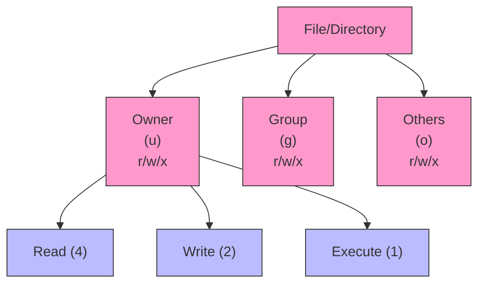

# **Day 3: Linux Permissions & Ownership for SREs**

Aanya sat at her workstation in Bengaluru, scanning through system alerts about repeated “Permission Denied” errors. Noah’s findings from Sydney had hinted at a deeper permissions misconfiguration lurking in their environment. Determined to secure the system, she opened a terminal and prepared to tackle the intricacies of **Linux permissions and ownership**.

> **Aanya’s Thought**: “These errors remind me how crucial it is to get file permissions right. A single misconfiguration can open the door to security breaches or break a production service entirely.”

---

## **1. Introduction**

### **Why Permissions & Ownership Matter**

- **Reliability**: Permissions define which processes can read, write, or execute files, directly affecting uptime and stability.  
- **Security**: Overly permissive settings can expose critical data, while tight restrictions can break apps if incorrectly applied.  
- **Collaboration**: Groups and ownership let multiple users or services share data safely.

### **Tiered Objectives**

- **Beginner (Tier 1)**: Understand the basic Linux permissions model, use `chmod` in simple numeric or symbolic form, and see how `sudo` is used for elevated tasks.  
- **Intermediate (Tier 2)**: Dive deeper into symbolic vs numeric modes, adjust file/directory ownership with `chown` and `chgrp`, and handle shared directory scenarios.  
- **SRE-Level (Tier 3)**: Explore advanced features like `setuid`, `setgid`, the sticky bit, and best practices for automation and auditing.

**Aanya’s Perspective**: “Even small changes—like restricting write access—can prevent huge disruptions. I’ll take a tiered approach, ensuring our entire environment aligns with these principles.”

---

## **2. Core Concepts**

### **Linux Permissions Model**

Files and directories in Linux maintain three permissions—**Read (r)**, **Write (w)**, **Execute (x)**—for each of three categories:

1. **User (Owner)**  
2. **Group**  
3. **Others (Everyone else)**

Example permission string:
```
-rwxr-xr--
| |  |  └─ Others: read-only
| |  └─ Group: read, execute
| └─ Owner: read, write, execute
└─ File type (- for file, d for directory)
```

**Aanya’s Note**: “I once saw a config file set to `777`. That’s basically letting the entire world read, write, and execute it—huge risk!”

### **Ownership**

- **Owner**: Typically the user who created the file (or a designated system account).  
- **Group**: A set of users who share certain privileges.  
- **Others**: Everyone else on the system.

This matters because processes often run under specific user or group IDs. For instance, the NGINX web server often runs as `nginx:nginx`; the MySQL database might run as `mysql:mysql`.

### **Special Permissions (Advanced)**

- **Setuid (s)**: On an executable, it runs with the **file owner’s** privileges.  
- **Setgid (s)**: Like setuid but for group privileges. Often used on directories so newly created files inherit the directory’s group.  
- **Sticky bit (t)**: Commonly on `/tmp`, ensuring only the file’s owner (or root) can delete or rename it even if it’s world-writable.

> **Aanya’s Thought**: “We have a shared directory for application uploads. Enabling the sticky bit ensures that each user only manages their own files. No accidental overwrites.”

---

## **3. Command Breakdown**

Here are five key commands Aanya uses to solidify her permissions strategy:

1. `ls -l` – Inspect existing permissions/ownership  
2. `chmod` – Modify permission bits  
3. `chown` – Change ownership  
4. `chgrp` – Change group  
5. `sudo` – Temporarily run commands with superuser privileges

We’ll keep the tiered examples to demonstrate usage at different skill levels.

---

### **Command: ls -l (List with Details)**

When diagnosing an issue, Aanya starts by running `ls -l` to see the current perms and ownership.

| Flag/Option | Example            | Description                                     | SRE Context                                  |
|-------------|--------------------|-------------------------------------------------|----------------------------------------------|
| `-l`        | `ls -l /var/log`  | Long listing format, including permissions      | Verify perms/ownership of log directories    |
| `-a`        | `ls -la`          | Include hidden files                            | Check for hidden `.env` or `.secret` files   |
| `-h`        | `ls -lh`          | Human-readable file sizes                       | Quickly see large files (e.g., logs)         |

**Scenario**: “We discovered an unauthorized file with `777` perms in `/var/uploads`. `ls -lR /var/uploads` helped me find it quickly.”

---

### **Command: chmod (Change File Mode Bits)**

> “Think of `chmod` as deciding who gets which keys to each room in the house,” Aanya tells her new teammate.

| Flag/Option | Example                   | Description                             | SRE Context                                     |
|-------------|---------------------------|-----------------------------------------|-------------------------------------------------|
| `-R`        | `chmod -R 755 /var/www`  | Recursive permission changes            | Web deployments often need uniform perms        |
| *(none)*    | `chmod 644 file.conf`    | Numeric or symbolic changes             | Set typical config file perms (rw-r--r--)       |
| *(none)*    | `chmod u+x script.sh`    | Symbolic mode for specific changes      | Make a script executable by the owner           |

**Tiered Examples**:

- **Beginner**: `chmod 644 notes.txt`  
- **Intermediate**: `chmod -R 750 /home/shared`  
- **SRE-Level**: `chmod +t /srv/shared` to enable sticky bit  

---

### **Mermaid Diagram: Permission Bits**



This diagram helps visualize that each entity (owner, group, others) has up to three permission bits (r, w, x).

---

### **Command: chown (Change Ownership)**

Aanya uses `chown` to ensure the correct user account owns a directory—like the `nginx` user for `/var/www/html`.

| Flag/Option | Example                            | Description                                           | SRE Context                              |
|-------------|------------------------------------|-------------------------------------------------------|------------------------------------------|
| `-R`        | `chown -R appuser /opt/app`        | Recursively change owner of a directory tree         | Setting consistent ownership post-deploy |
| *(none)*    | `chown alice file.txt`             | Assign file ownership to `alice`                     | Quick fix for a single file             |
| `:<group>`  | `chown alice:devteam project/`     | Change both owner and group at once                  | Collaborative dev environment            |

**Tiered Examples**:

- **Beginner**: `sudo chown student assignment.txt`  
- **Intermediate**: `sudo chown -R webuser:webgroup /var/www/myapp`  
- **SRE-Level**: `sudo chown root:logadmins /var/log/myapp/*.log`  

---

### **Command: chgrp (Change Group Ownership)**

> “Sometimes we only need to adjust which group can access a file,” Aanya explains.

| Flag/Option | Example                   | Description                               | SRE Context                                   |
|-------------|---------------------------|-------------------------------------------|-----------------------------------------------|
| `-R`        | `chgrp -R devteam /code` | Recursively change group of a directory   | Multi-user dev environment                    |
| *(none)*    | `chgrp audit file.log`   | Change just the group                     | Granting read/write to the auditing team      |

**Tiered Examples**:

- **Beginner**: `sudo chgrp students group_project/`  
- **Intermediate**: `sudo chgrp -R devops /var/log/myapp`  
- **SRE-Level**: `sudo chgrp -R maintainers /usr/local/maintenance_scripts`  

---

### **Command: sudo (Superuser Do)**

When Aanya needs administrative privileges—e.g., to fix system-wide permissions—she relies on `sudo`.

| Flag/Option | Example                    | Description                                    | SRE Context                                     |
|-------------|---------------------------|------------------------------------------------|-------------------------------------------------|
| `-i`        | `sudo -i`                | Interactive root shell                         | Handling multiple privileged tasks in one go    |
| `-l`        | `sudo -l`                | List the commands allowed for the current user | Auditing or verifying user privileges           |
| *(none)*    | `sudo systemctl restart` | Execute command as root                        | Restarting services, applying system changes    |

> **Caution**: “I always double-check commands before pressing Enter under sudo,” Aanya says.

---

## **4. System Effects**

1. **Filesystem**: Permission bits and ownership changes are stored in each file or directory’s inode.  
2. **Security**: A mismatch in ownership can break services or expose data. Overly permissive settings (e.g., `777`) can cause major security holes.  
3. **Resource Impact**: Changing permissions/ownership is light on CPU or disk usage, but misconfiguration can cause heavy operational headaches.  
4. **SRE Implementation**: Regular audits of setuid binaries, sticky bits, and group ownership are vital to ensure a stable and secure environment.

---

## **5. Hands-On Exercises**

Aanya always recommends practicing these concepts on a test server first—just like she does with her “staging” environment.

### **Beginner Tier**

1. **Simple Permission Adjustments**  
   - Create `myfile.txt`. Set it so only you (owner) have read/write. Confirm with `ls -l`.
2. **Symbolic vs Numeric**  
   - Copy `myfile.txt` to `myfile_copy.txt`.  
   - `chmod u+x myfile_copy.txt`, then revert to numeric mode: `chmod 644 myfile_copy.txt`.
3. **Basic Ownership Change**  
   - Create a directory `beginner_test`.  
   - `sudo chown otheruser beginner_test` (assuming `otheruser` is valid on your system) to see how ownership changes.

### **Intermediate Tier**

1. **Recursive Permissions**  
   - Make a directory structure `project/{scripts,configs,data}` with sample files.  
   - Recursively set all to `750`.  
   - Verify each subdirectory matches the intended perms.
2. **Group Collaboration**  
   - Create a group `devteam`.  
   - `mkdir shared_docs` and `sudo chown :devteam shared_docs`.  
   - `chmod 770 shared_docs` so the devteam can fully collaborate, but others are excluded.
3. **Checking Sudo**  
   - Run `sudo -l` to see allowed commands.  
   - Compare editing `/etc/hosts` with or without sudo to understand privileged editing.

### **SRE-Level Tier**

1. **Sticky Bit for Shared Folder**  
   - Create `/srv/public_drop` for user uploads, group-owned by `uploaders`.  
   - Set the sticky bit: `chmod +t /srv/public_drop`.  
   - Test as different users to confirm each can only delete their own files.
2. **Hunting setuid Binaries**  
   - `sudo find / -perm -4000 -type f 2>/dev/null` to list all setuid files.  
   - Evaluate if each is necessary or a security risk.
3. **Automating Permissions Enforcement**  
   - Script a check: If `/var/log/myapp` isn’t `myappuser:logs` with `750` perms, fix it automatically.  
   - Schedule in cron or a systemd timer to ensure continuous compliance.

---

## **6. Troubleshooting Scenarios**

### **Scenario 1**: Service Fails to Start (Permission Denied)

- **Symptom**: “Cannot open config file: Permission denied” in the logs.  
- **Diagnostic**: Possibly root-owned config while the service runs under a different user.  
- **Solution**: `sudo chown serviceuser /etc/myservice/config && chmod 640 /etc/myservice/config`.  
- **Prevention**: Automate ownership checks in deployment scripts.

### **Scenario 2**: Shared Directory Chaos

- **Symptom**: Teammates can’t edit each other’s files in `/shared/projects`.  
- **Diagnostic**: Permissions or group misconfiguration.  
- **Solution**: `sudo chown -R user:devteam /shared/projects && chmod -R 770 /shared/projects`. Possibly add a sticky bit or setgid.  
- **Prevention**: Good group structures, consistent `chgrp` usage, and possibly `chmod g+s` for setgid on the directory.

### **Scenario 3**: Web Server 503 Errors

- **Symptom**: After a config update, the web server fails to load due to missing read perms.  
- **Diagnostic**: `ls -l /etc/nginx/nginx.conf` might show `-rw------- root root`.  
- **Solution**: `sudo chmod 644 /etc/nginx/nginx.conf` so `nginx` can read it.  
- **Prevention**: Pipeline or config management checking production permission baselines.

---

## **7. FAQ**

### **Beginner FAQs**

1. **Do I always need sudo to change permissions?**  
   Not if you own the file. But if you’re not the owner, you need elevated privileges.  
2. **What’s the difference between symbolic (`u+r`) and numeric (`644`) mode in chmod?**  
   Symbolic describes the exact operation (add, remove, set), numeric is concise for specifying entire sets at once.  
3. **How do I see if a file is executable?**  
   Check for the `x` bit in `ls -l`. Also, the file type or shebang might hint if it’s a script/binary.

### **Intermediate FAQs**

1. **How do I change both the owner and group at once?**  
   Use `chown alice:devteam file.txt`.  
2. **What’s the sticky bit?**  
   It’s used mostly on directories like `/tmp`; only the file’s owner or root can remove or rename that file.  
3. **Can I revoke execute permission from just the group?**  
   Yes: `chmod g-x file.sh`.

### **SRE-Level FAQs**

1. **Does SELinux override file permissions?**  
   Yes. SELinux or AppArmor can further restrict (or allow) access beyond `rwx` bits.  
2. **Are setuid executables risky?**  
   Potentially. They run with the file owner’s privileges, so any vulnerability can lead to privilege escalation.  
3. **Where do we log permission changes?**  
   `sudo` actions generally log to `/var/log/auth.log` or `/var/log/secure`; deeper audits require enabling `auditd` or similar frameworks.

---

## **8. SRE Scenario**

**Situation**: A background service can’t write logs due to `Permission Denied`. Aanya’s steps:

1. **Identify the Process User**:  
   ```bash
   ps aux | grep myservice
   ```  
   Suppose it’s running as `svcuser`.
2. **Check the Log Directory**:  
   ```bash
   ls -ld /var/log/myservice
   ```  
   If it’s owned by `root:root` with `r-x` for others, no write perms for `svcuser`.
3. **Fix Ownership & Permissions**:  
   ```bash
   sudo chown -R svcuser:svcuser /var/log/myservice
   sudo chmod 750 /var/log/myservice
   ```
4. **Validate**:  
   ```bash
   sudo -u svcuser touch /var/log/myservice/test.log
   ```
5. **Restart** the service.  
6. **Document** the final perms in your deployment notes.

> **Aanya’s Reflection**: “It’s a quick fix, but crucial for stable logging. Now we can properly track system health.”

---

## **9. Key Takeaways**

1. **Command Summary**  
   - `ls -l`: Inspect permissions/ownership  
   - `chmod`: Adjust permission bits  
   - `chown` / `chgrp`: Manage ownership and groups  
   - `sudo`: Elevate privileges for secure system administration

2. **Operational Insights**  
   - Use **least privilege**: only what each user or service needs  
   - Keep permissions consistent across dev/staging/prod  
   - Regularly **audit** setuid binaries, sticky bits, group membership

3. **Best Practices**  
   - **Separate system vs. app accounts**: Let NGINX run as `nginx:nginx`, etc.  
   - **Use scripts** to enforce consistent permissions.  
   - **Setgid directories** for shared collaboration, sticky bit for safer multi-user writes.

4. **Looking Ahead**  
   - Next, we’ll explore advanced CLI text processing (like `grep`, `sed`, `awk`). Combining those with your robust permissions knowledge helps you maintain, audit, and troubleshoot like a pro.

---

## **10. Further Learning Resources**

### **Beginner**

1. **Ubuntu Docs: FilePermissions**  
   [https://help.ubuntu.com/community/FilePermissions](https://help.ubuntu.com/community/FilePermissions)  
   A straightforward guide to read, write, and execute bits.
2. **Linuxize: chmod**  
   [https://linuxize.com/post/how-to-use-chmod-command/](https://linuxize.com/post/how-to-use-chmod-command/)  
   Covers symbolic and numeric modes thoroughly.

### **Intermediate**

1. **DigitalOcean: Linux Permissions**  
   [https://www.digitalocean.com/community/tutorials/linux-permissions](https://www.digitalocean.com/community/tutorials/linux-permissions)  
   Explores special permissions in detail.
2. **Red Hat: Group Management**  
   [https://www.redhat.com/sysadmin/linux-manage-groups](https://www.redhat.com/sysadmin/linux-manage-groups)  
   Practical tips for user group structures.

### **SRE-Level**

1. **SELinux Project Docs**  
   [https://selinuxproject.org/page/Main_Page](https://selinuxproject.org/page/Main_Page)  
   Deeper mandatory access controls beyond basic `rwx`.
2. **Open Security Training: Linux Audit**  
   [https://opensecuritytraining.info/IntroToLinuxAudit.html](https://opensecuritytraining.info/IntroToLinuxAudit.html)  
   Detailed look at auditing frameworks for advanced investigations.
3. **Kernel.org on setuid Security**  
   [https://www.kernel.org/doc/html/latest/admin-guide/security.html](https://www.kernel.org/doc/html/latest/admin-guide/security.html)  
   Learn about setuid implications and best practices.

---

## **End of Day 3 Module**

Aanya successfully aligned their system’s permissions and ownership with SRE best practices, mitigating both security and reliability risks. From ensuring the correct users and groups own the right files to applying advanced bits (setuid, sticky) in the right places, you now have the tools to keep your environment both secure and robust.

> **Aanya’s Final Thought**: “Permissions might seem simple at first, but they’re a powerful, foundational layer for system security and reliability. Master them now, and you’ll prevent countless headaches in the future.”

---

*(Adapted from the original technical content in linux_day03_v6.md , following the transformation guidelines in day3-transformation-prompt.md .)*