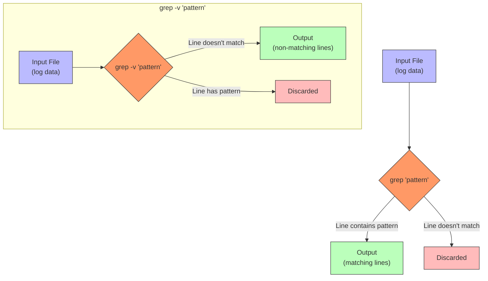
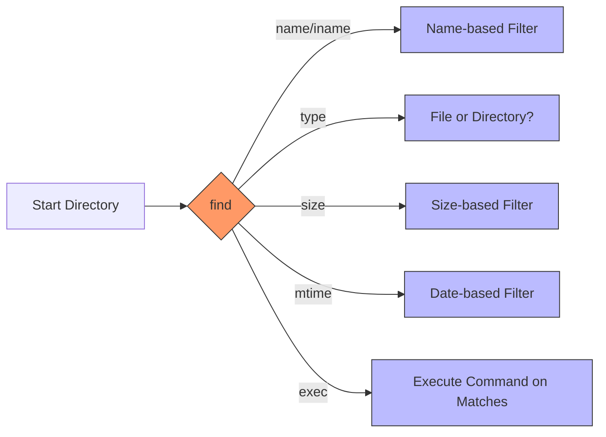
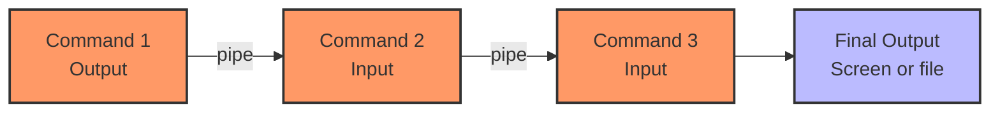

# **Day 4: Text Processing & Searching for SREs**

Luis glanced at his watch. It was nearly midnight in Madrid, but the logs were still rolling in, full of cryptic messages about process ownership changes and permission errors. Building on **Aanya’s** previous day’s work, **Luis** needed to harness powerful **text processing** and **searching** tools to trace suspicious patterns and maintain a reliable system.

> **Luis’s Thought**: “Logs can be a labyrinth. But with the right commands, we can unlock their secrets quickly.”

---

## **1. Introduction**

### **Why Text Processing & Searching Matter**

In large-scale systems, logs and config files explode in size—and the time window to fix issues is short. Commands like **`grep`**, **`find`**, pipes (`|`), and redirection (`>`, `>>`, `<`) are the Swiss Army knives for SREs. They cut through noise, filter out anomalies, and let you quickly zero in on what’s relevant.

- **Data-Driven Diagnosis**: Searching for keywords, error codes, or even suspicious IP addresses in real time.  
- **Efficient Housekeeping**: Locating old files to free disk space or archiving stale logs.  
- **Security & Audits**: Spotting unauthorized sudo usage or scanning directories for suspicious files.

### **Tiered Objectives**

- **Beginner (🔍)**: Master basic searches with `grep` and `find`, plus simple use of pipes and redirection.  
- **Intermediate (🧩)**: Apply advanced flags, chain multiple commands, handle bigger directories, and manage I/O carefully.  
- **SRE-Level (💡)**: Automate large-scale searches, correlate logs from multiple sources, and optimize performance under pressure.

### **Connection to Previous & Future Lessons**

- **Previously**: Aanya tackled permission and ownership issues, setting the stage for deeper troubleshooting.  
- **Today**: Luis wields **text-processing** tools to unearth critical insights.  
- **Next**: We’ll expand further into advanced text manipulation with `sed` and `awk`.

> **Luis’s Perspective**: “We can’t babysit logs by hand. With the right command combos, we’ll find the needle in that haystack—and keep the system stable.”

---

## **2. Core Concepts**

### **Text Processing & Searching: The Big Picture**

- **Beginner Analogy**: Imagine your system is a vast library. **`grep`** is like a specialized librarian who instantly finds pages containing certain words, while **`find`** locates the exact books on the shelves.  
- **Technical Explanation**: Most Linux resources—logs, configs, status outputs—are text-based. `grep` filters lines based on patterns, and `find` locates files by different attributes.  
- **SRE Application**: Quick searching of logs during incidents, identifying massive or outdated files to free space, or chaining commands to produce immediate insights.  
- **System Impact**: Large searches can be CPU- or I/O-intensive. Thoughtful usage avoids overloading the server.

### **Command Chaining & Redirection**

- **Beginner Analogy**: A pipeline in a brewery: the liquid (data) flows from one tank (command) to the next. Redirection decides if the final product goes into a bottle, a barrel, or gets discarded.  
- **Technical Explanation**: The pipe symbol (`|`) routes stdout of one command into the stdin of another. Redirection (`>`, `>>`, `<`) manipulates files as sources or destinations for input/output.  
- **SRE Application**: Linking commands saves time, turning multi-step tasks into single-line pipelines. Redirection helps store logs, separate errors from standard output, and more.  
- **System Impact**: Each pipe spawns a subshell, but typically remains lightweight. Large-scale writing or reading can spike disk or CPU usage.

---

## **3. Command Breakdown**

Below are the fundamental text-processing and searching commands, woven into Luis’s day-to-day tasks.

---

### **Command: grep (The Pattern Detective)**

Luis stared at a mountain of logs, searching for suspicious references to processes run under unexpected users. **`grep`** quickly became his best friend—**a detective scanning thousands of lines for specified clues**.

**Syntax & Flags**:

| Flag/Option | Example                       | Description                                            | SRE Usage Context                                         |
|-------------|-------------------------------|--------------------------------------------------------|-----------------------------------------------------------|
| `-i`        | `grep -i "error" file.log`   | Case-insensitive search                                | Catch variations like `Error`, `ERROR`, `error`           |
| `-r`        | `grep -r "pattern" /var/log` | Recursive search within directories                    | Scanning entire logs folder for a term                    |
| `-n`        | `grep -n "fail" auth.log`    | Show line numbers                                      | Pinpoint exact references in logs                         |
| `-v`        | `grep -v "INFO" sys.log`     | Invert match (exclude lines)                           | Filter out noise, focusing on real issues                 |
| `-E`        | `grep -E "(WARN|ERROR)" file`| Use extended regex to match multiple patterns          | Combine multiple patterns at once                         |
| `-C 2`      | `grep -C 2 "CRITICAL" app.log`| Show lines before/after a match for context            | Provide immediate context around important log entries    |

**Tiered Examples**:

- **🔍 Beginner**:  
  ```bash
  # Basic search for 'error' in app.log
  grep "error" app.log
  ```
- **🧩 Intermediate**:  
  ```bash
  # Recursive, case-insensitive
  grep -ir "login failed" /var/log
  ```
- **💡 SRE-Level**:  
  ```bash
  # Extended regex, plus context lines
  grep -E -C 2 "(ERROR|WARN)" /var/log/custom_*.log
  ```

---

#### **Mermaid Diagram: Grep Pattern Matching**



> **Pro Tip**: Luis keeps a “grep cookbook” of frequent patterns (e.g., authentication failures, permission errors). During an incident, having these regexes handy saves crucial time.

---

### **Command: find (The Library Navigator)**

Luis discovered some processes were spawning from unknown directories. He turned to **`find`**—like a librarian who knows every shelf and can locate any “book” (file) by name, size, or modification date.

**Syntax & Flags**:

| Flag/Option | Example                                 | Description                                         | SRE Usage Context                               |
|-------------|-----------------------------------------|-----------------------------------------------------|-------------------------------------------------|
| `-name`     | `find /etc -name "*.conf"`             | Match files by name (case-sensitive)                | Searching for config files                      |
| `-iname`    | `find /opt -iname "release*"`           | Case-insensitive name match                         | Handling inconsistent naming conventions        |
| `-type`     | `find /data -type d`                    | Search only directories (d) or files (f)            | Locating specific subdirectories                |
| `-size`     | `find /var/log -size +100M`             | Find files larger than 100MB                        | Identifying disk-hogging logs                  |
| `-mtime`    | `find /tmp -mtime +7`                   | Older than 7 days by modification time              | Housekeeping old temps                          |
| `-exec`     | `find . -name "*.log" -exec rm {} \;` | Execute a command on each match                     | Automating deletion or compression             |

**Tiered Examples**:

- **🔍 Beginner**:
  ```bash
  # Locate .txt files in current directory
  find . -name "*.txt"
  ```
- **🧩 Intermediate**:
  ```bash
  # Search directories named "archive" ignoring case
  find /var -type d -iname "archive"
  ```
- **💡 SRE-Level**:
  ```bash
  # Compress logs larger than 200MB
  find /var/log -type f -size +200M -exec gzip {} \;
  ```

---

#### **Mermaid Diagram: Find Command Structure**



> **Caution**: “I do a dry run with `-exec echo` first to ensure I’m not about to mass-delete essential files,” Luis explains.

---

### **Command: pipes (`|`)**

As logs ballooned, Luis realized single commands wouldn’t suffice. **Pipes** (`|`) let him chain multiple utilities into a seamless, powerful workflow—like passing water through a series of filters.

| Symbol | Example                | Description                                            | SRE Usage Context                          |
|--------|------------------------|--------------------------------------------------------|--------------------------------------------|
| `|`    | `cmd1 | cmd2`         | Send `cmd1` output into `cmd2` as input               | Linking commands for incremental filtering |
| `|`    | `cmd1 | cmd2 | cmd3`  | Multiple chaining                                      | Complex data analysis or sorting tasks     |

**Tiered Examples**:

- **🔍 Beginner**:
  ```bash
  # Filter ls output for "report"
  ls | grep "report"
  ```
- **🧩 Intermediate**:
  ```bash
  # Sort processes by CPU usage, then view the top 5
  ps aux | sort -rnk 3 | head -5
  ```
- **💡 SRE-Level**:
  ```bash
  # Extract IPs, find unique ones, count occurrences
  grep -oE "[0-9]+\.[0-9]+\.[0-9]+\.[0-9]+" /var/log/auth.log \
    | sort | uniq -c | sort -rn | head -10
  ```

---

#### **Mermaid Diagram: Pipeline Flow**



> **Luis’s Tip**: “Pipelines are fundamental. I keep them short and meaningful—too many in a row get unwieldy.”

---

### **Command: redirection (`>`, `>>`, `<`)**

Finally, Luis needed to gather outputs for a quick report. **Redirection** decides where the output goes (overwriting or appending a file, or reading from a file).

| Operator | Example                   | Description                                     | SRE Usage Context                                |
|----------|---------------------------|-------------------------------------------------|--------------------------------------------------|
| `>`      | `echo "test" > out.txt`  | Overwrite file with command output              | Generating fresh reports or logs                 |
| `>>`     | `echo "extra" >> out.txt`| Append command output to existing file          | Aggregating data or logs over time               |
| `<`      | `grep "pattern" < file`  | Take file as input instead of stdin             | Feeding prepared data into a command             |
| `2>`     | `command 2> errors.log`  | Redirect stderr to file                         | Separating error messages from normal output     |
| `&>`     | `command &> all.log`     | Redirect both stdout and stderr to one file     | Full capture of logs for debugging               |

**Tiered Examples**:

- **🔍 Beginner**:
  ```bash
  # Overwrite etc_list.txt
  ls /etc > etc_list.txt
  ```
- **🧩 Intermediate**:
  ```bash
  # Append free -h output to system_report.txt
  free -h >> system_report.txt
  ```
- **💡 SRE-Level**:
  ```bash
  # Separate stdout/stderr from a script
  /usr/local/bin/cleanup.sh > cleanup_out.log 2> cleanup_err.log
  ```

---

## **4. System Effects**

1. **Filesystem Changes**: Redirection can overwrite or append files. `find -exec` can create, delete, or compress logs.  
2. **Resource Usage**: Large `grep` or `find` searches might hog CPU/I/O.  
3. **Security**: Searching logs can uncover secrets. Be mindful about who sees your output.  
4. **Monitoring**: Many SRE scripts revolve around piping logs into analytics or storing them for later correlation.  
5. **Performance**: Overly broad commands degrade performance. Scope your searches carefully.

---

## **5. Hands-On Exercises**

### **🔍 Beginner Exercises**

1. **Basic Grep**  
   - Create `sample.txt` with some random lines. `grep` for a keyword.  
2. **Find by Name**  
   - `find ~ -name "*.sh"` to locate shell scripts in your home directory.  
3. **Redirect Output**  
   - `ls -l /etc` into `etc_list.txt`, then check file contents.

### **🧩 Intermediate Exercises**

1. **Recursive Grep**  
   - Search `/var/log` for `error`, ignoring case, line-numbered.  
2. **File Size Hunt**  
   - `find /var/log -size +50M` and redirect results to `large_logs.txt`.  
3. **Pipeline Sorting**  
   - `ps aux | grep root | sort -rnk 3` to see root processes by CPU usage.

### **💡 SRE-Level Exercises**

1. **Multi-Service Log Analysis**  
   - Combine `grep` and pipes to extract error lines across multiple logs. Save to `all_errors.log`.  
2. **Disk Cleanup Script**  
   - Use `find` with `-exec` or `xargs` to compress or remove logs older than 7 days.  
3. **Redirect for Debugging**  
   - Run a custom script, sending stdout and stderr to separate files. Compare them to see errors vs normal logs.

---

## **Troubleshooting Scenarios**

1. **High CPU Usage with grep**  
   - **Symptom**: `grep -r /var/log` spins CPU.  
   - **Cause**: Searching massive logs or entire subdirectories.  
   - **Solution**: Narrow the path, filter by file size or specific patterns.  
   - **Prevention**: Log rotation, better scoping.

2. **Overwriting Critical File**  
   - **Symptom**: Using `>` destroyed previous file content.  
   - **Cause**: Confused `>` with `>>`.  
   - **Solution**: Restore from backups, be sure of your operator.  
   - **Prevention**: Always confirm if you need append vs overwrite.

3. **Command Not Found in `-exec`**  
   - **Symptom**: `-exec rm {} ; not found` or “Missing argument”.  
   - **Cause**: Forgot the backslash before `;` or typed syntax incorrectly.  
   - **Solution**: Double-check syntax: `-exec command {} \;`.  
   - **Prevention**: Use `-exec echo` for safer pre-check.

---

## **7. FAQ**

### **🔍 Beginner FAQs**

1. **Can I use grep on multiple files at once?**  
   Yes: `grep "pattern" file1.txt file2.txt`.
2. **How do I stop a long-running grep or find command?**  
   Press `Ctrl + C`.
3. **Is `>` the same as copy-pasting text into a file?**  
   It overwrites the file immediately, so yes—though it’s automated, not interactive.

### **🧩 Intermediate FAQs**

1. **Can grep read patterns from a file?**  
   Yes, with `grep -f patternfile.txt`. Each line in the pattern file is matched.  
2. **Does find search file contents?**  
   By default, find examines filenames and metadata, not contents. Pair with `-exec grep` if you need inside-file searching.  
3. **What if I combine `>` and `>>` in the same command?**  
   Typically, the last operator in sequence is used. Combining them is confusing—avoid it.

### **💡 SRE-Level FAQs**

1. **How do I skip special or remote filesystems with find?**  
   Use `-xdev` to skip other filesystems, or `-prune` to exclude dirs.  
2. **Is set -o pipefail helpful in pipelines?**  
   Yes, it ensures the pipeline returns an error if any command fails. Great for robust scripting.  
3. **Safe way to mass-delete with find?**  
   Use `-exec echo rm {} \;` first to verify. Then remove `echo` once correct.

---

## **8. SRE Scenario: Investigating Hidden Process Issues**

**Situation**: Luis sees a surge of processes running under an unexpected system account. Disk usage is climbing, logs are filling.

1. **Locate Large Logs**  
   ```bash
   find /var/log -type f -size +100M -exec ls -lh {} \;
   ```
   *Reasoning*: Big logs might be generating fast, indicating a run-away process.

2. **Scan for Pattern**  
   ```bash
   grep -i "fork" /var/log/daemon.log | tail -n 20
   ```
   *Reasoning*: Searching for “fork” references to see if processes replicate unexpectedly.

3. **Correlate with CPU**  
   ```bash
   ps aux | sort -rnk 3 | head -5
   ```
   *Reasoning*: Identifying the top CPU hogs, focusing on suspicious users.

4. **Redirect Key Findings**  
   ```bash
   df -h > /tmp/disk_snapshot.txt
   ```
   *Reasoning*: Document disk usage for post-incident analysis.

5. **Narrow Suspicious Patterns**  
   ```bash
   grep -oE "invalid user [a-zA-Z0-9]+" /var/log/auth.log \
     | sort | uniq -c | sort -rn | head
   ```
   *Reasoning*: Counting repeated invalid logins or user attempts.

6. **Mitigate**  
   - Compress older logs.  
   - Possibly kill the rogue processes, after verifying business impact.  

7. **Document**  
   - Provide logs, disk usage snapshots, and final outcomes to the next shift.

---

## **9. Key Takeaways**

1. **Command Summary**  
   - **`grep`**: Pinpoint patterns in text.  
   - **`find`**: Discover files by name, size, date, and more.  
   - **Pipes**: Chain multiple commands for quick, flexible workflows.  
   - **Redirection**: Overwrite/append outputs and manage input sources.

2. **Operational Insights**  
   - **Scoping** is vital—avoid scanning the entire filesystem.  
   - **Regex knowledge** speeds up advanced logs searches.  
   - **Combining** these tools forms the backbone of daily SRE tasks.

3. **Best Practices**  
   - **Test** risky commands first with safe flags (like `-exec echo`).  
   - **Log rotation** prevents unwieldy file sizes.  
   - **Security**: Keep outputs containing credentials or tokens private.

4. **Preview**  
   - Tomorrow, we dive deeper into **`sed`** and **`awk`**, enabling dynamic on-the-fly text transformations.

---

## **10. Further Learning Resources**

### **🔍 Beginner**

1. **Grep Tutorial (Linuxize)**  
   [https://linuxize.com/post/grep-command/](https://linuxize.com/post/grep-command/)  
   Straightforward coverage of grep basics.
2. **Find Command Basics (GeeksforGeeks)**  
   [https://www.geeksforgeeks.org/find-command-in-linux-with-examples/](https://www.geeksforgeeks.org/find-command-in-linux-with-examples/)  
   Simple examples to practice.

### **🧩 Intermediate**

1. **GNU grep Manual**  
   [https://www.gnu.org/software/grep/manual/grep.html](https://www.gnu.org/software/grep/manual/grep.html)  
   Comprehensive coverage of regex features.
2. **Advanced Find Tricks (Linode Docs)**  
   [https://www.linode.com/docs/guides/find-command/](https://www.linode.com/docs/guides/find-command/)  
   Detailed usage with real-world scenarios.

### **💡 SRE-Level**

1. **Google SRE Workbook: Alerting & Monitoring**  
   [https://sre.google/workbook/alerting-on-sli/](https://sre.google/workbook/alerting-on-sli/)  
   Integrates log analysis with alerting strategies.
2. **Log Searching Strategies (Datadog)**  
   [https://www.datadoghq.com/blog/log-analysis-monitoring/](https://www.datadoghq.com/blog/log-analysis-monitoring/)  
   Approaches for large-scale distributed logs.
3. **Brendan Gregg’s Blog**  
   [http://www.brendangregg.com/](http://www.brendangregg.com/)  
   Performance tuning and pipeline optimization at scale.

---

**That’s it for Day 4!** You’ve learned how to process text logs like a detective—just like **Luis** in Madrid, connecting the dots to keep the system safe and stable. Up next is advanced text manipulation with `sed` and `awk`—the next step in your SRE journey.

