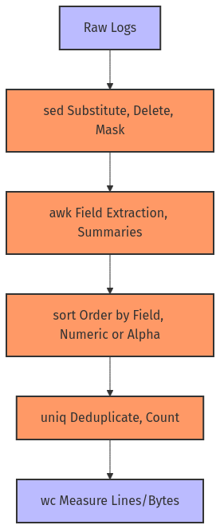

# **Day 8 - 9: Advanced Text Processing for SREs**

## **Introduction**

Jin stared at a sea of logs flooding in from microservices scattered across multiple regions. Each service used a different log format, making data correlations messy. He needed to standardize and sanitize these logs efficiently. 

> **Jin’s Thought**: “These logs look like they’re written in different dialects. I’ll rely on `sed`, `awk`, and other text processing heroes to unify them before we pass them to our SIEM tool.”

In this module, we’ll explore how SREs can tackle **advanced text processing** tasks using **`sed`**, **`awk`**, **`sort`**, **`uniq`**, and **`wc`**—powers that let you turn chaotic log data into gold.

### **Recap & Future Connection**

- **Previously**: You learned `grep` and `find` to search and filter text, plus piping and redirection basics.
- **Today**: We dive deeper into **transforming** text with `sed` and `awk`, **organizing** data with `sort` and `uniq`, and **measuring** data with `wc`.
- **Next**: We’ll see how these transformations feed into deeper process management and reliability strategies.

---

## **Tiered Objectives**

### **Beginner (🔍)**
1. Recognize the purposes of `sed`, `awk`, `sort`, `uniq`, and `wc`.
2. Perform simple substitutions, field extractions, sorting, and counting.
3. Understand how to chain these tools in pipelines.

### **Intermediate (🧩)**
1. Use `sed` and `awk` for more robust data transformations and selective extractions.
2. Employ `sort` and `uniq` for deduplication and frequency analysis in larger data sets.
3. Combine multiple commands seamlessly to create multi-step text processing pipelines.

### **SRE-Level (💡)**
1. Automate large-scale log transformations and config edits using advanced `sed`/`awk`.
2. Apply `sort`, `uniq`, and `wc` to handle performance or reliability analytics in real time.
3. Integrate security (masking sensitive data) and operational best practices into text processing flows.

---

## **Core Concepts**

### **1. Turning Chaos into Uniform Data**

> **Analogy**: Think of your text data—logs, configs, metrics—as raw ingredients scattered around the kitchen. Tools like `sed` and `awk` let you slice, dice, and season them into a uniform dish. Then `sort`, `uniq`, and `wc` help with plating and portion control.

**SRE Perspective**: For Jin, these commands are essential. They help unify multi-format logs into a standardized schema for deeper analytics, either locally or in a log aggregator.

### **2. Stream Processing Magic**

- **Why Streams**: Because text data can be huge, streaming one line at a time is more efficient than loading entire files into memory.
- **Chain Reaction**: Combining `sed | awk | sort | uniq | wc` in a single pipeline can drastically reduce manual overhead.

> **Jin’s Note**: “With these commands, I can cleanse personally identifiable info, reformat logs, and output aggregated metrics in one pass—huge time-saver.”

---

## **Command Breakdown**

Below, we detail how each tool works, with usage examples in beginner, intermediate, and SRE-level contexts.

### **Command: sed (Stream Editor)**

**Overview**:  
`sed` reads text lines and applies editing operations like substitution, deletion, insertion—on the fly.

**Typical Syntax**:
```bash
sed [options] 'command' file
```

**Common Options**:

| Flag/Option | Example                           | Description                                     | SRE Context                                        |
|-------------|-----------------------------------|-------------------------------------------------|----------------------------------------------------|
| `-i`        | `sed -i 's/foo/bar/g' file.txt`   | In-place edit; modifies the file directly       | Quick config changes (backup recommended)          |
| `-n`        | `sed -n '/error/p' file.log`      | Print only matching lines (no auto print)       | Extract specific lines from logs                   |
| `-e`        | `sed -e 's/foo/bar/' -e 's/cat/dog/' file.txt`| Multiple commands in one pass          | Batch transformations                              |
| `-E` or `-r`| `sed -E 's/(user[0-9]+)/[REDACTED]/g' logs.txt`| Extended regex for complex patterns  | Mask sensitive user IDs                            |

#### **Examples**

- **🔍 Beginner**:
  ```bash
  # Replace "test" with "exam" globally in notes.txt, printing to screen
  sed 's/test/exam/g' notes.txt
  ```
- **🧩 Intermediate**:
  ```bash
  # Remove lines beginning with '#'
  sed '/^#/d' config.ini
  ```
- **💡 SRE-Level**:
  ```bash
  # Mask sensitive tokens (like API keys) in logs
  sed -E 's/(token=)[A-Za-z0-9]+/\1****/g' api.log
  ```

---

### **Command: awk (Field Surgeon)**

> Jin calls `awk` “the field surgeon,” slicing each line by a chosen delimiter, then operating on specific fields.

**Typical Syntax**:
```bash
awk [options] 'pattern { action }' file
```

**Common Options**:

| Flag/Option | Example                                            | Description                                          | SRE Context                                 |
|-------------|----------------------------------------------------|------------------------------------------------------|---------------------------------------------|
| `-F`        | `awk -F, '{print $1, $3}' file.csv`                | Sets a custom field separator                        | Parsing CSV logs or multi-column data       |
| `-v`        | `awk -v limit=100 '{ if ($2 > limit) ... }' file`  | Pass shell variable into awk                         | Flexible thresholds for data analysis       |
| `BEGIN/END` | `awk 'BEGIN{...} {main code} END{...}' file`       | Blocks that run before/after processing lines        | Summaries or final logs reporting           |

#### **Examples**

- **🔍 Beginner**:
  ```bash
  # Print just the first column of a space-separated file
  awk '{print $1}' items.txt
  ```
- **🧩 Intermediate**:
  ```bash
  # Show CPU usage over 20% (fields vary by system)
  ps aux | awk '$3 > 20 {print $2, $3, $11}'
  ```
- **💡 SRE-Level**:
  ```bash
  # Summarize average response time ignoring lines with N/A
  awk '$5 != "N/A" {sum+=$5; count++} END {print "Avg RT:", sum/count, "ms"}' merged.log
  ```

---

### **Command: sort (Ordering Data)**

**Overview**:  
`sort` rearranges lines in ascending/descending order, either numerically or lexicographically. Essential for organizing data prior to deduplication or frequency analysis.

**Common Flags**:

| Flag/Option | Example                    | Description                             | SRE Context                                 |
|-------------|----------------------------|-----------------------------------------|---------------------------------------------|
| `-n`        | `sort -n sizes.txt`       | Numeric sort instead of ASCII            | Sorting memory usage or numeric IDs         |
| `-r`        | `sort -r file.txt`        | Reverse order                            | Getting top usage stats                     |
| `-k`        | `sort -k2 -n file.txt`    | Sort by second field (numerically)       | Sorting logs by response time, for instance |
| `-t`        | `sort -t',' -k3 file.csv` | Use custom delimiter (comma in CSV)       | Sorting columns in a CSV log                |

#### **Examples**

- **🔍 Beginner**:
  ```bash
  # Alphabetical sort of hosts
  sort hosts.txt
  ```
- **🧩 Intermediate**:
  ```bash
  # Sort processes by memory usage descending
  ps aux | sort -k4 -nr | head -5
  ```
- **💡 SRE-Level**:
  ```bash
  # Sort web logs first by status code, then by response time
  sort -k9,9n -k10,10n access.log
  ```

---

### **Command: uniq (Removing Duplicate Lines)**

**Overview**:  
`uniq` collapses consecutive duplicate lines, typically used **after** sorting. Good for deduplicating or counting repeated patterns.

**Common Flags**:

| Flag/Option | Example                     | Description                                          | SRE Context                              |
|-------------|-----------------------------|------------------------------------------------------|------------------------------------------|
| `-c`        | `sort file.txt | uniq -c`   | Prefix lines with the number of occurrences          | Frequency analysis of repeated log lines |
| `-d`        | `sort file.txt | uniq -d`   | Print only duplicated lines                          | Identify repeated patterns               |
| `-u`        | `sort file.txt | uniq -u`   | Print only unique lines (those without duplicates)   | Extract purely unique entries            |

#### **Examples**

- **🔍 Beginner**:
  ```bash
  # Deduplicate sorted lines
  sort items.txt | uniq
  ```
- **🧩 Intermediate**:
  ```bash
  # Count repeated severities in logs
  grep "ERROR\|WARN\|INFO" app.log | sort | uniq -c
  ```
- **💡 SRE-Level**:
  ```bash
  # Identify repeated IP addresses in two merged logs
  cat log1 log2 | awk '{print $1}' | sort | uniq -d
  ```

---

### **Command: wc (Word/Line/Byte Count)**

**Overview**:  
`wc` (word count) reports line, word, and byte counts—useful for quick file size stats or verifying the number of processed lines.

**Common Flags**:

| Flag/Option | Example           | Description                 | SRE Context                     |
|-------------|-------------------|-----------------------------|---------------------------------|
| `-l`        | `wc -l file.txt`  | Count lines                 | Checking log or config length   |
| `-w`        | `wc -w file.txt`  | Count words                 | Counting tokens in text data    |
| `-c`        | `wc -c file.txt`  | Count bytes                 | Checking raw size in bytes      |

#### **Examples**

- **🔍 Beginner**:
  ```bash
  # Lines in system.log
  wc -l system.log
  ```
- **🧩 Intermediate**:
  ```bash
  # Compare two files by character size
  echo "File1:" $(wc -c < file1) ", File2:" $(wc -c < file2)
  ```
- **💡 SRE-Level**:
  ```bash
  # Monitor log growth
  watch "wc -l /var/log/critical.log"
  ```

---

## **Visualizing the Text Processing Flow**





> This diagram shows how data might flow from raw logs, through transformations, to final stats—**exactly** how Jin standardizes logs from multiple microservices.

---

## **System Effects**

1. **IO & CPU**: Heavy sorting or complex regex in `sed` can spike usage on large data sets.
2. **Security**: Tools like `sed` help mask or redact sensitive data.  
3. **Reliability**: Proper text transformations can unify logs for downstream systems, improving overall observability.
4. **Automation**: In SRE scripts, these commands handle repetitive tasks—like daily log merges and analytics.

---

## **Hands-On Exercises**

### **🔍 Beginner Tier**

1. **Substitute Words**  
   - Create `mylog.txt` with lines mentioning `DEV` environment.  
   - Use `sed 's/DEV/PROD/g' mylog.txt` to see how it changes the lines.  
2. **Print Columns**  
   - Use `echo "alpha beta gamma" | awk '{print $2}'` to get “beta.”  
3. **Count Lines**  
   - In any text file, run `wc -l file.txt` to see how many lines exist.

### **🧩 Intermediate Tier**

1. **Remove Comments & Sort**  
   - Create a config with commented lines. Use `sed '/^#/d' config.ini | sort` to see a cleaned, sorted list.  
2. **Aggregate by Field**  
   - Log lines with: `INFO`, `WARN`, `ERROR`. Extract that column with `awk` or cut, then sort and pipe to `uniq -c`.  
3. **File Size Automation**  
   - Use `if [ $(wc -c < biglog.log) -gt 2000000 ]; then gzip biglog.log; fi` to auto-compress logs over 2MB.

### **💡 SRE-Level Tier**

1. **End-to-End Pipeline**  
   - In a large production log, chain together `sed` (mask tokens), `awk` (extract relevant fields), `sort` (by user or timestamp), and `uniq -c` (frequency). Save the result to `report.txt`.  
2. **Sanitizing Sensitive Data**  
   - Suppose logs contain `secret_key=abcdef123`. Use `sed -E 's/(secret_key=)[A-Za-z0-9]+/\1****/g'` across all `.log` files.  
3. **Real-Time Summaries**  
   - `tail -F /var/log/auth.log | awk '/failed/ {fail++} END {print "Fails:", fail}'` (requires some trickiness with indefinite streams, but can be adapted).

---

## **Troubleshooting Scenarios**

1. **Conflicting Field Delimiters**  
   - **Symptom**: `awk -F','` returns unexpected results because lines have spaces or tabs instead.  
   - **Cause**: Mixed delimiters or inconsistent file formatting.  
   - **Solution**: Identify correct delimiter (maybe `-F '[ ,]+'` or something more robust).  
   - **Prevention**: Standardize log output or parse carefully with regex-based splits.

2. **Massive CPU Usage**  
   - **Symptom**: Sorting a 5GB log saturates CPU.  
   - **Cause**: Large dataset. Sort is computationally heavy.  
   - **Solution**: Use partial splits, external merges, or hardware-friendly buffer options.  
   - **Prevention**: Log rotation, indexing, or smaller data chunks.

3. **Broken sed In-Place Edit**  
   - **Symptom**: `sed -i` corrupts config or loses extended attributes.  
   - **Cause**: In-place rewrite replaced or truncated the file.  
   - **Solution**: Keep backups, test the command carefully.  
   - **Prevention**: Use version control or a copy-based approach (`sed '...') > newfile`) then rename.

---

## **FAQ**

### **🔍 Beginner FAQs**

1. **Is `sed` only for substitution?**  
   It can also delete lines, insert, or do more advanced manipulations (`y`, `a`, `i` commands, etc.).
2. **Does `awk` handle CSV?**  
   Absolutely. `awk -F','` is common for CSV logs.
3. **Why does `uniq` miss duplicates?**  
   It only removes **adjacent** duplicates. Always `sort` first.

### **🧩 Intermediate FAQs**

1. **How to do multiline operations in sed?**  
   Use the hold space or `N` commands, or consider using `awk` or a dedicated script if multiline logic is complex.
2. **Can awk do math?**  
   Yes. E.g., `awk '{ sum+=$2 } END { print sum }'`.
3. **Sort vs. sort -n**  
   `sort -n` handles numeric sorting; plain `sort` uses lexicographic order—where “10” might come before “2”.

### **💡 SRE-Level FAQs**

1. **How do I handle partial data from real-time logs with awk?**  
   Tools like `awk` can continuously read from a stream, but you may need to flush output or script it carefully.  
2. **When do I pick Python over sed/awk?**  
   For extremely complex transformations or multi-file logic. But for single-pass transformations, `sed`/`awk` can be simpler and faster to implement.  
3. **Masking multiple patterns in one pass**  
   `sed -E 's/(password=)[^ ]+/\1****/g; s/(apikey=)[^ ]+/\1****/g;'` can handle multiple replacements in a single command.

---

## **Detailed SRE Scenario**

**Situation**: Jin sees logs from 10 different microservices in various formats. Some mention user tokens, others have inconsistent date/time fields. He must unify them for a standard SIEM ingestion.

1. **Gather & Merge**  
   ```bash
   cat /var/log/service*.log > combined.log
   ```
2. **Mask Tokens**  
   ```bash
   sed -E 's/(token=)[A-Za-z0-9]+/\1****/g' combined.log > sanitized.log
   ```
3. **Extract Key Fields**  
   ```bash
   awk '{print $1, $3, $NF}' sanitized.log > minimal.log
   # e.g., date, status, last field
   ```
4. **Sort & Uniq**  
   ```bash
   sort minimal.log | uniq -c | sort -nr > freq.log
   ```
5. **Analyze**  
   ```bash
   head -15 freq.log
   ```
   *Focus on top repeated lines—possible repeated errors or suspicious activity.*

6. **Automate**  
   - Put it all in a script, run nightly.  
   - If top repeated line is more than X, alert the on-call.  

> **Connection to SRE**: Efficient data pipeline that merges multi-format logs, sanitizes sensitive data, extracts critical fields, and produces concise aggregated results.

---

## **Key Takeaways**

1. **Command Summary**  
   - **sed**: On-the-fly text transformations—substitute, delete, mask.  
   - **awk**: Field-based scanning—extract columns, do simple math, generate reports.  
   - **sort/uniq**: Order data, remove duplicates.  
   - **wc**: Basic measurement (lines, words, bytes).  

2. **Operational Insights**  
   - Great for standardizing logs from multiple sources.  
   - Saves time vs. manual parsing or large-scale programming.  
   - Integrates well with `grep`, `tail -f`, or watchers.

3. **Best Practices**  
   - Test transformations on sample data before running them on critical files.  
   - Use scripts or version control for consistent transformations.  
   - Monitor resource usage, especially with `sort` on large files.

4. **Looking Ahead**  
   - Next, we’ll dive into **process management** and **system monitoring**, learning to control how services run and how to keep them reliable once the logs are sorted out.

---

## **Further Learning Resources**

### **🔍 Beginner**

1. **GNU sed Manual**  
   [https://www.gnu.org/software/sed/manual/](https://www.gnu.org/software/sed/manual/)  
   Covers basics to advanced stream editing.
2. **Awk Introduction (Linuxize)**  
   [https://linuxize.com/post/awk-command/](https://linuxize.com/post/awk-command/)  
   Easy read for field processing.

### **🧩 Intermediate**

1. **The Linux Command Line**  
   [http://linuxcommand.org/tlcl.php](http://linuxcommand.org/tlcl.php)  
   Practical how-to with sed/awk examples.
2. **Mastering Awk (DigitalOcean)**  
   [https://www.digitalocean.com/community/tutorials/how-to-use-the-awk-language-to-manipulate-text-in-linux](https://www.digitalocean.com/community/tutorials/how-to-use-the-awk-language-to-manipulate-text-in-linux)  

### **💡 SRE-Level**

1. **Google SRE Workbook**  
   [https://sre.google/workbook/](https://sre.google/workbook/)  
   Ties monitoring & logging with advanced text manipulation.
2. **Advanced Sed & Awk (IBM Developer)**  
   [https://developer.ibm.com/tutorials/l-sed1/](https://developer.ibm.com/tutorials/l-sed1/)  
   Deeper coverage, including multiline techniques and advanced scripting.

---

You’ve seen how **Jin** in Seoul harnesses `sed`, `awk`, `sort`, `uniq`, and `wc` to impose order on chaotic logs, unify different data formats, and protect sensitive info. Master these tools, and you’ll be well-equipped to handle large-scale log transformations and dynamic text-based tasks in your SRE arsenal.

