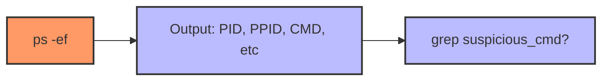
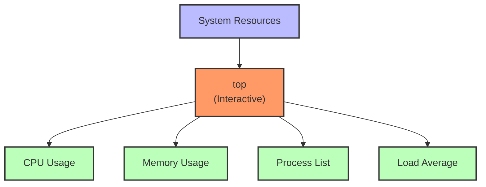
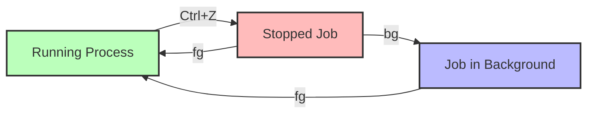

# **Day 10 - 11: Process Management & System Monitoring for SREs**

Fatima walked into the data center in Dubai, scanning a console output that displayed suspicious new processes. After hearing about Luis’s recent findings, she knew it was time to address potential **sudo** misconfigurations and ensure the system was locked down. But first, she had to identify any suspicious or resource-intensive processes and secure them.

> **Fatima’s Thought**: “I see unusual processes hogging memory. Are they legit, or is there a breach? Let’s systematically track them using Linux’s built-in monitoring tools.”

## **Why Process Management & System Monitoring Matter**

- **Reliability & Performance**: Understanding CPU, memory, disk usage, and active processes is critical to keeping systems stable under load.  
- **Security**: Some processes might run with elevated privileges or suspicious arguments. Monitoring them helps detect malicious activity.  
- **Incident Response**: Quick identification of resource bottlenecks or runaway processes can limit downtime and user impact.  

Fatima’s goal: **Establish a robust monitoring plan** that ensures no process slips through the cracks, while also promptly detecting any anomalies that might threaten system security.

---

## **Learning Objectives**

### **Beginner (🟢)**

1. Identify and list running processes.  
2. Start, stop, suspend, and resume processes.  
3. Gather CPU, memory, and disk usage info quickly.

### **Intermediate (🟡)**

1. Use interactive tools (e.g., `top`, `htop`) with advanced options.  
2. Relate CPU, memory, and disk usage to potential resource constraints.  
3. Employ job control commands (`jobs`, `bg`, `fg`) in real-world scenarios.

### **SRE-Level (🔴)**

1. Automate real-time process and resource monitoring for critical services.  
2. Investigate incidents by combining logs, resource metrics, and process trees.  
3. Integrate process and resource data into an observability framework to preempt major failures.

---

## **Core Concepts**

1. **Processes & PIDs**: Each running program (process) has a unique PID. Some spawn child processes, forming a hierarchy.  
2. **Foreground vs. Background**: You can run tasks in the background to free your terminal, or in the foreground for interactive control.  
3. **Process Hierarchy**: Understand parent-child relationships. If you kill a parent, children might become orphans or get killed themselves.  
4. **System Resource Monitoring**: Tools like `ps`, `top`, `df`, `du`, and `free` let you see how CPU, memory, and disk usage trends shape system performance.

---

## **Command Breakdown**

Fatima uses these commands daily to track system health and keep an eye on potential security issues.

### **Command: ps (Process Snapshot)**

`ps` takes a picture of processes at a moment in time, great for quick checks or piping to `grep`. 

- **Beginner**: `ps aux`  
- **Intermediate**: `ps -ef | grep nginx`  
- **SRE-Level**: `ps --forest -o pid,user,%cpu,%mem,cmd`

**Tip**: Check each process’s owner and CPU usage to detect anomalies.

---

### **Command: top (Real-Time Process Table)**

`top` is like a live “vitals” monitor, showing CPU usage, memory usage, load average, and active processes in real time.

- **Beginner**: `top`  
- **Intermediate**: `top -u webuser`  
- **SRE-Level**: `top -b -n 5 -d 2 > top_log.txt`

**Tip**: Press `c` to reveal full command lines.

---

### **Command: htop (Enhanced Interactive Viewer)**

`htop` is a friendlier version of `top`, with color-coded bars, easy filtering, and scrolling.

- **Beginner**: Just run `htop` if installed.  
- **Intermediate**: `htop -u deploy` to isolate a user’s processes.  
- **SRE-Level**: Use F3 to search and F4 to filter in real time, perfect for large process lists.

**Tip**: Press F9 to send signals (e.g., kill) to a highlighted process.

---

### **Command: kill (Send Signals to Processes)**

`kill` can gracefully stop a process (SIGTERM) or forcibly end it (SIGKILL).

- **Beginner**: `kill 1234` (SIGTERM by default)  
- **Intermediate**: `kill -9 <PID>` for a stubborn process  
- **SRE-Level**: `kill -HUP $(pgrep nginx)` to reload configs

**Tip**: Always attempt a graceful kill before using `-9`.

---

### **Command: jobs (Shell Job Listing)**

`jobs` lists processes or tasks started in this shell that are in the background or suspended.

- **Beginner**: `jobs`  
- **Intermediate**: `jobs -l` to see PIDs  
- **SRE-Level**: Manage multiple background tasks during on-call, ensuring none are forgotten.

---

### **Command: bg / fg (Background/Foreground)**

When a job is suspended with `Ctrl+Z`, `bg` resumes it in the background, and `fg` brings it back.

**Tip**: `fg %1` to bring job #1 to the foreground.

---

### **Command: uname (Kernel & System Info)**

`uname` provides basic system info. 

- **Beginner**: `uname -a` to see kernel details.  
- **Intermediate**: `uname -r` for kernel version or `uname -m` for architecture.  
- **SRE-Level**: In scripts, check architecture or kernel version to ensure correct package deployment.

---

### **Command: df (Disk Filesystem Usage)**

`df -h` shows which partitions are nearing capacity. 

- **Beginner**: `df -h` (human-readable).  
- **Intermediate**: `df -i` for inode usage.  
- **SRE-Level**: `watch -n 5 df -h` to catch sudden expansions or logs.

---

### **Command: du (Disk Usage per Directory/File)**

`du` indicates which dirs/files hog disk space. 

- **Beginner**: `du -sh /var/log` for a summary.  
- **Intermediate**: `du -h --max-depth=1 /data | sort -h` to identify largest subdirectories.  
- **SRE-Level**: Exclude certain patterns or do multi-level analysis to pinpoint top space usage quickly.

---

### **Command: free (Memory Usage)**

`free` clarifies how much memory is used vs. available. 

- **Beginner**: `free -h`  
- **Intermediate**: `free -h -s 5` for repeated snapshots  
- **SRE-Level**: Pair with logging or a watch loop to detect memory leaks over time.

---

## **System Effects**

1. **Resource Impact**: Tools like `top`, `htop`, or repeated `ps` can consume CPU on large systems.  
2. **Security**: Process listings may expose secrets or private arguments. Monitor for suspicious processes.  
3. **Monitoring Gaps**: Snapshot tools (`ps`, `df`) might miss ephemeral processes. Real-time or repeated logging can catch short-lived issues.  
4. **Orphaned/Runaway Processes**: Failing to manage child processes or background tasks can degrade system performance over time.

---

## **Hands-On Exercises**

### **Beginner Tier (3)**

1. **Basic Process & Termination**  
   - Start a dummy process: `sleep 300 &`. Use `ps aux` to find its PID.  
   - Kill it gracefully with `kill <PID>`. Verify it’s gone with `ps` again.

2. **Foreground vs. Background**  
   - Run `top` in one terminal, press `Ctrl+Z` to suspend.  
   - `jobs` to see it’s stopped. `bg %1` to resume in background.  
   - `fg %1` to bring it forward, then `Ctrl+C` to end.

3. **Disk & Memory Overview**  
   - `df -h` to see which partition has highest usage.  
   - `free -h` to note memory usage.  
   - Consider: If your main partition is 80% full, how might you address that (clean logs, expand disk, etc.)?

### **Intermediate Tier (3)**

1. **Identifying a Resource Hog**  
   - In one terminal, do `sha256sum /dev/zero` to spike CPU.  
   - In another, run `top` or `htop`; confirm high CPU usage.  
   - Terminate with `kill`. Confirm it’s gone with `ps aux`.

2. **Investigating Large Logs**  
   - `cd /var/log` (or a log directory).  
   - `du -h --max-depth=1 | sort -h` to find which subdirectory is largest.  
   - Check if it’s rotating properly or if old logs are piling up.

3. **Managing Multiple Jobs**  
   - Start `sleep 600` in the foreground. Press `Ctrl+Z` to suspend.  
   - `bg %1` to resume in background. Then run another command in the same shell.  
   - Use `jobs` to see both tasks. `fg %1` on the sleep, then `Ctrl+C` to cancel.

### **SRE-Level Tier (3)**

1. **Automated Disk Monitoring**  
   - Write a script that logs `df -h` and `du -sh /var/log` every minute for 5 times.  
   - Simulate creating large files. Check your logs for the changes.  
   - Reflect on thresholds or alerts you’d implement for production.

2. **Memory Stress & Observation**  
   - Use a memory stress tool (e.g., `stress --vm 1 --vm-bytes 512M --timeout 60s`).  
   - In another window, watch `free -h -s 5` or `top` to see real-time memory usage.  
   - Note if the system dips into swap or triggers OOM killer messages (`dmesg | grep -i oom`).

3. **Process Tree Debugging**  
   - Use an app like `nginx` that spawns multiple worker processes.  
   - `ps --forest -o pid,user,%cpu,%mem,cmd | grep nginx` to see hierarchy.  
   - Evaluate if you have too many worker threads, consider performance or security ramifications.

---

## **Troubleshooting Scenarios**

**1. Zombie Processes**  
- **Symptoms**: `ps aux` reveals many `Z` processes.  
- **Cause**: Parents not reaping children.  
- **Fix**: Check parent’s state, possibly kill or restart it. Or let `systemd` handle orphaned children.  
- **Prevention**: Make sure daemons handle SIGCHLD properly.

**2. High Load, Low CPU**  
- **Symptoms**: Load average is high, but CPU usage is low, many tasks in `D` state.  
- **Cause**: I/O wait bottleneck. Possibly slow disk or NFS issue.  
- **Fix**: Investigate storage or network latency with `iostat`, `dmesg`.  
- **Prevention**: Monitor `%wa` in `top`, tune storage.

**3. Disk Full Despite Deletion**  
- **Symptoms**: `df -h` remains high after removing large files.  
- **Cause**: Process still holds file descriptors open.  
- **Fix**: Identify process with `lsof | grep deleted`. Kill or restart it.  
- **Prevention**: Proper log rotation, confirm processes close old files.

---

## **FAQ**

### **Beginner (3)**

1. **Q**: How do I terminate a running process in my shell right now?  
   **A**: Press `Ctrl+C` to send SIGINT, or note its PID and run `kill <PID>`.

2. **Q**: Why does `jobs` show no background tasks in a new terminal?  
   **A**: Each shell tracks its own background/suspended tasks. A fresh shell starts with none.

3. **Q**: Does `top` always show everything?  
   **A**: It shows processes at refresh intervals. Quickly starting/stopping processes might be missed in between refreshes.

### **Intermediate (3)**

1. **Q**: Can I run `top` in a script?  
   **A**: Yes, using `top -b -n <iterations>` for batch mode.

2. **Q**: Why is my disk full even after deleting big files?  
   **A**: A process might still be using them. Use `lsof | grep deleted` to check.

3. **Q**: How do I see each CPU core usage in `top`?  
   **A**: Press `1` in interactive `top`.

### **SRE-Level (3)**

1. **Q**: How do I prevent essential processes from being killed by OOM killer?  
   **A**: Adjust their OOM score, e.g., `echo -1000 > /proc/<PID>/oom_score_adj`.

2. **Q**: Why might I use `pgrep` instead of `ps | grep`?  
   **A**: `pgrep` avoids listing the `grep` command itself, returning only PIDs.

3. **Q**: High load but low CPU usage—what next?  
   **A**: Check disk I/O with `iostat` or look for processes stuck in `D` state, indicating I/O wait.

---

## **Key Takeaways**

1. **Command Summary**  
   - `ps`, `top`, `htop`: Snapshots & live process monitoring.  
   - `kill`: Manage process lifecycle via signals.  
   - `jobs`, `bg`, `fg`: Job control for multi-tasking in one shell.  
   - `uname`, `df`, `du`, `free`: System identity, disk usage, memory usage.

2. **Operational Insights**  
   - Quick identification of CPU, memory, or disk hogs preserves reliability.  
   - Minimizing forced kills (SIGKILL) fosters graceful shutdowns.  
   - Continuous or automated checks (via cron or watchers) maintain proactive visibility.

3. **Best Practices**  
   - Maintain frequent logs or snapshots to trace ephemeral performance issues.  
   - Use `bg`/`fg` carefully—some processes aren’t well-suited for background runs.  
   - Pair disk usage checks with log rotation or archival to prevent unexpected saturation.

4. **Preview**  
   - Next up is **networking** (Day 7). We’ll explore commands like `ping`, `netstat`, and `ss` for diagnosing connectivity and security across distributed systems.

---

## **Further Learning Resources**

### **🟢 Beginner**

1. **Linux Journey - Process Utilization**  
   [https://linuxjourney.com/lesson/process-utilization](https://linuxjourney.com/lesson/process-utilization)  
   Interactive lessons covering `ps`, `top`, and job control.

2. **Ubuntu Official Docs - Basic Commands**  
   [https://help.ubuntu.com/community/UsingTheTerminal](https://help.ubuntu.com/community/UsingTheTerminal)  
   Introduces terminal usage plus job management.

3. **The Linux Command Line** (William Shotts, free PDF)  
   [http://linuxcommand.org/tlcl.php](http://linuxcommand.org/tlcl.php)  
   Comprehensive introduction to the CLI.

### **🟡 Intermediate**

1. **DigitalOcean Tutorials: Process Management**  
   [https://www.digitalocean.com/community/tutorials/tag/linux-process](https://www.digitalocean.com/community/tutorials/tag/linux-process)  
   Step-by-step guides for advanced usage of `top`, `htop`, and more.

2. **Linux Performance Tools (Brendan Gregg)**  
   [http://www.brendangregg.com/linuxperf.html](http://www.brendangregg.com/linuxperf.html)  
   In-depth coverage of performance troubleshooting.

3. **Red Hat SysAdmin Skills**  
   [https://www.redhat.com/sysadmin](https://www.redhat.com/sysadmin)  
   Real-world case studies on process and resource monitoring.

### **🔴 SRE-Level**

1. **Google SRE Book - Handling Overload**  
   [https://sre.google/sre-book/handling-overload/](https://sre.google/sre-book/handling-overload/)  
   Strategies for scaling and load shedding under resource pressure.

2. **Netflix TechBlog: Linux Performance Tools**  
   [https://netflixtechblog.com/](https://netflixtechblog.com/)  
   Search for in-depth articles on at-scale performance debugging.

3. **System Performance: Enterprise and the Cloud** (Brendan Gregg)  
   [http://www.brendangregg.com/](http://www.brendangregg.com/)  
   Advanced text on analyzing CPU, memory, file system, and network interactions at scale.

---

**Congratulations!** You’ve completed today's training material on your Linux SRE path. Like Fatima in Dubai, you now have the knowledge to confidently monitor system resources, manage processes, and guard against potential security lapses. Next, we’ll focus on **networking fundamentals**—a must-have skill set for diagnosing distributed system issues. 

*(Adapted from linux_day06_file0. This transformation follows the guidelines in day6-transformation-promfile1.)*