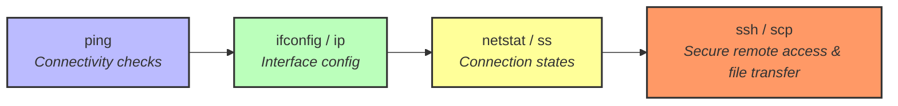
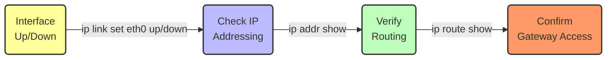
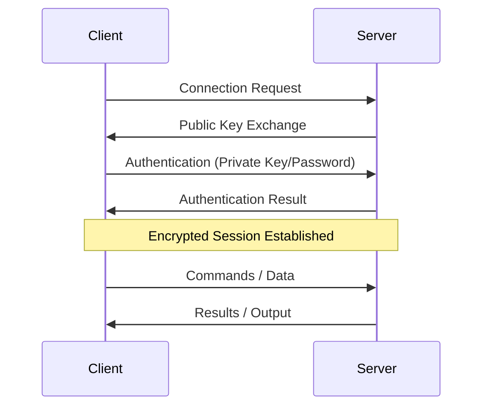
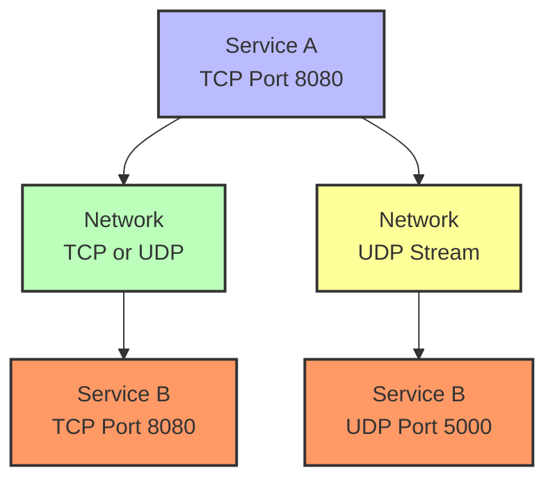
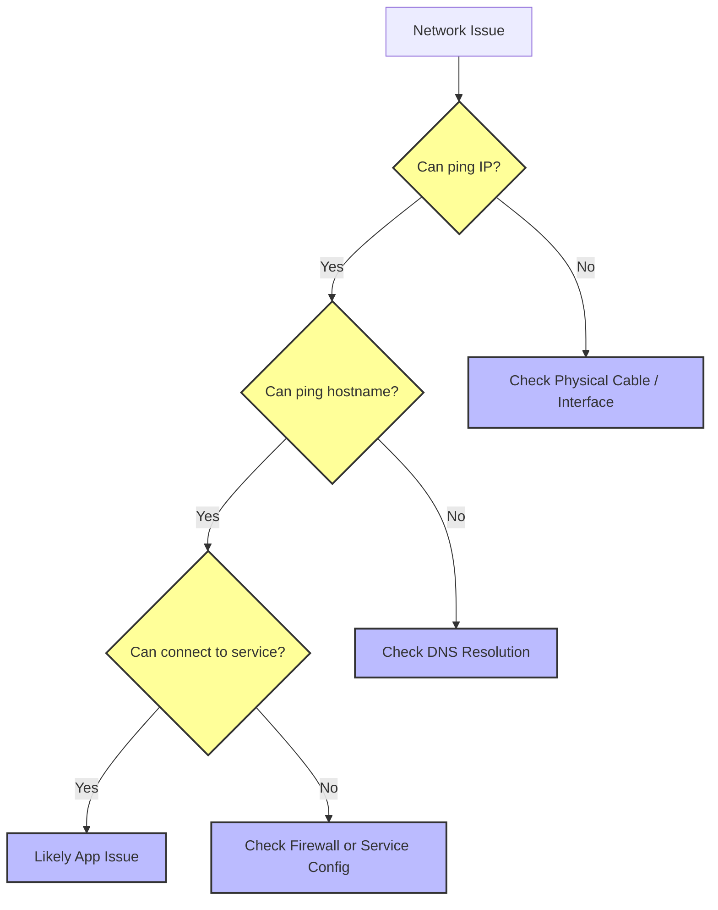
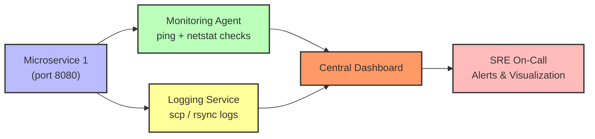

# **Linux SRE Training – Day 12 - 13: Networking Basics**  
*Transformed with a Mentor-Style Narrative and Mermaid Diagrams*

> “Networking is about bridging distances,” Mina said, gazing at the blinking lights on her switch. “No matter how powerful your server, it can’t do much alone. Today, we’ll make sure everything stays seamlessly connected.”  

Welcome to your next day of your Linux SRE training! Today, we’ll follow Mina’s journey as she verifies connectivity, documents a multi-tier monitoring setup, and shares tips on how to integrate essential Linux networking tools into an SRE workflow. Whether you’re brand-new to networking or aiming for SRE-level mastery, you’ll find practical steps, real-life scenarios, and advanced troubleshooting tactics here.

---

## **Objectives by Tier**  
Mina organizes the team’s learning in three progressive layers:

**Beginner**  
1. Test network connectivity with `ping`  
2. View and configure network interfaces (`ifconfig` / `ip`)  
3. Identify open connections and listening services using `netstat` / `ss`  

**Intermediate**  
1. Use `ssh` for secure remote access  
2. Transfer files securely with `scp` (and learn about `rsync` later)  
3. Diagnose and monitor connections for troubleshooting  

**SRE-Level**  
1. Integrate these tools into automated workflows  
2. Interpret outputs in large-scale or complex networks  
3. Apply advanced troubleshooting (e.g., multi-service connectivity issues)  

---

## **Why Networking Matters**

### **Linking Past and Future**  
- **Previously**: You sharpened your skills in process management and resource usage.  
- **Today**: It’s all about establishing and troubleshooting network connectivity.  
- **Next**: You’ll delve into user and group management, covering permissions and security to protect these networked systems.

### **Mina’s Story So Far**  
Mina is finalizing a new monitoring dashboard that ties together CPU usage (from Day 5), process states (from Day 6), and now network health checks. If any microservice goes offline or a connection stalls, her dashboard alerts the team immediately. Let’s see how she uses the fundamentals of Linux networking to make this happen.

---

## **Core Concepts**  
Think of these like the building blocks of your network knowledge:

1. **IP Address**: Like a home address for data.  
2. **Network Interface**: The “mailbox” where data arrives.  
3. **Ports**: Apartment numbers for specific applications.  
4. **Connectivity Testing**: `ping` to verify a host is reachable and measure latency.  

**At an intermediate level**, you add OSI layers, routing, firewalls, and stronger security contexts. **At SRE scale**, you’ll juggle multi-host troubleshooting, performance analysis, and automated scripts that keep entire fleets monitored.

---

## **Network Command Relationships**

Mina maintains a mental map of how each Linux network tool fits together. Here’s a quick diagram to show how these commands interlink in a typical SRE toolkit:



**Legend**  
- **ping**: Basic connectivity tests  
- **ifconfig/ip**: Manage local interface addresses, routes  
- **netstat/ss**: Monitor open ports and active connections  
- **ssh/scp**: Remote operations and secure file transfers  

---

## **Command Breakdown**

### **1. `ping` (Packet INternet Groper)**

**Think** of `ping` as a quick “knock on the door.” If someone answers, you know they’re “home.”  

> **Mina’s Tip:** “When a service goes down, first check if you can `ping` the host. If yes, the network path works—but that doesn’t guarantee the service itself is up.”

**Syntax & Flags**  

| Flag/Option | Syntax Example        | Description                        | SRE Usage Context                  |
|-------------|-----------------------|------------------------------------|------------------------------------|
| `-c`        | `ping -c 3 host`     | Send only 3 packets                | Bounded tests for scripts          |
| `-w`        | `ping -w 5 host`     | Deadline in seconds                | Avoid indefinite pings             |
| `-i`        | `ping -i 0.2 host`   | Interval between packets           | Faster probing in short intervals  |

**Tiered Examples**  

- **Beginner**  
  ```bash
  # Basic reachability
  ping -c 2 google.com
  ```  

- **Intermediate**  
  ```bash
  # Testing local network device, limiting total time
  ping -c 4 -w 3 192.168.1.10
  ```  

- **SRE-Level**  
  ```bash
  # Checking latency across multiple hosts
  for host in web1 db1 proxy1; do
    ping -c 2 -w 2 "$host" | grep 'packets transmitted' >> /tmp/netcheck.log
  done
  ```  

---

### **2. `ifconfig` / `ip` (Interface Configuration)**

When Mina set up a new web server, she used `ip` commands to confirm that her machine was assigned the correct IP address. Without a valid interface configuration, everything else falls apart.



**Syntax & Flags**  

| Flag/Option  | Syntax Example            | Description                              | SRE Usage Context                        |
|--------------|---------------------------|------------------------------------------|------------------------------------------|
| `ifconfig`   | `ifconfig eth0`          | Legacy command to view interface info    | Quick checks on older systems            |
| `ip addr`    | `ip addr show eth0`      | Show details for a specific interface    | Modern approach with more functionality  |
| `ip route`   | `ip route show`          | Display routing table                    | Validate default gateways                |
| `ip link`    | `ip link set eth0 up`    | Bring interface up or down              | Scripted reconfig/troubleshooting        |

---

### **3. `netstat` / `ss` (Network Statistics / Socket Statistics)**

> **Analogy:** If `ping` is a knock on the door, `netstat`/`ss` tells you which doors and windows are open, plus who’s currently coming or going.

**Syntax & Flags**  

| Flag/Option | Syntax Example            | Description                                    | SRE Usage Context                         |
|-------------|---------------------------|------------------------------------------------|-------------------------------------------|
| `-t`        | `ss -t`                  | Show TCP connections only                     | Focus on key protocols (HTTP, SSH, etc.)  |
| `-l`        | `ss -l`                  | List only listening sockets                   | Identify services open on the network     |
| `-n`        | `ss -n`                  | Don’t resolve host names (faster)            | High traffic or performance constraints   |
| `-p`        | `ss -p` (requires sudo)  | Show owning processes (name/PID)              | Diagnose unknown or conflicting ports     |

---

### **4. `ssh` (Secure Shell)**

> **“Think of `ssh` as your secure passport to remote systems,”** Mina says. “Just as a passport verifies your identity at a border, SSH encrypts and verifies you on remote servers.”  



**Syntax & Flags**  

| Flag/Option | Syntax Example                      | Description                                  | SRE Usage Context                            |
|-------------|-------------------------------------|----------------------------------------------|----------------------------------------------|
| `-p`        | `ssh -p 2222 user@host`            | Connect on non-default port                  | Bypass or custom firewall ports              |
| `-i`        | `ssh -i ~/.ssh/key.pem user@host`   | Use specified key file                       | Different keys for dev/staging/prod          |
| `-L`        | `ssh -L 8080:localhost:80 user@host`| Local port forwarding                        | Access internal web or DB securely           |
| `-N -f`     | `ssh -N -f user@host`               | No shell, run in background                  | Keep tunnels open without interactive shell  |

---

### **5. `scp` (Secure Copy)**

> **Mina’s Reminder:** “Transferring a config file or pulling logs from multiple servers? `scp` is your friend. For incremental backups, check `rsync`.”  

**Syntax & Flags**  

| Flag/Option | Syntax Example                                       | Description                               | SRE Usage Context                             |
|-------------|------------------------------------------------------|-------------------------------------------|------------------------------------------------|
| `-r`        | `scp -r local_dir user@host:/remote/dir`            | Recursive copy of directories             | Deploy entire directories or back them up      |
| `-P`        | `scp -P 2222 file user@host:/path`                   | Connect via non-standard SSH port         | Servers behind custom firewall ports           |
| `-i`        | `scp -i ~/.ssh/key file user@host:/path`            | Use specific SSH key                      | Multiple key pairs for different environments  |
| `-p`        | `scp -p file user@host:/path`                        | Preserve file timestamps                  | Maintain file attributes for auditing          |

---

## **Connection Types Overview**

Mina frequently checks whether services use TCP, UDP, or both. Below is a simplified diagram to illustrate how two services might communicate using TCP or UDP sockets:



---

## **System Effects**  
1. **Filesystem**: `scp` writes or retrieves files, requiring sufficient disk space.  
2. **System Resources**: `ping`, `netstat`, and `ip` have low overhead. High-volume `scp` can spike CPU usage due to encryption.  
3. **Security**: Don’t inadvertently expose ports. Use SSH keys instead of passwords for better safety.  
4. **Monitoring**: Tools like `netstat/ss` confirm normal or suspicious connections.

---

## **Hands-On Exercises**

> “Nothing beats hands-on practice,” Mina says, “and these will help you build muscle memory.”

### **Beginner Level**  
1. **Ping a Remote Host**  
   - `ping -c 3 google.com`  
   - Observe latency and packet loss.  
2. **Check Interfaces**  
   - `ip addr show`  
   - Identify your IP address or DNS name.  
3. **List Listening Ports**  
   - `ss -tln`  
   - Note which services are up and running.  

### **Intermediate Level**  
1. **Key-Based SSH**  
   - Generate a key (`ssh-keygen -t ed25519`)  
   - Copy key to a remote server (`ssh-copy-id user@host`)  
   - Connect with `ssh -i ~/.ssh/mykey user@host`  
2. **Add/Remove a Route**  
   - `ip route add 10.0.2.0/24 dev eth0`  
   - `ip route del 10.0.2.0/24 dev eth0`  
3. **Secure Copy a Directory**  
   - `scp -r /path/to/mydir user@server:/remote/dir`  
   - Confirm successful transfer with `ls /remote/dir`.

### **SRE-Level**  
1. **Automated Ping Script**  
   - Write a shell script to ping a list of servers.  
   - Log success/failure to a file for daily review.  
2. **SSH Tunneling**  
   - `ssh -L 3306:db-internal:3306 user@bastion -N -f`  
   - Test local MySQL connection via `localhost:3306`.  
3. **Parallel Log Retrieval**  
   - Use a loop to `scp` logs from multiple servers in the background.  
   - Observe performance gains and how quickly you gather data.

---

## **Network Troubleshooting Flow**

When something breaks at 2 AM, Mina runs through a structured approach:



---

## **Troubleshooting Scenarios**

### **Scenario 1: Can’t Ping or SSH a New Server**  
- **Symptoms**: `ping` times out, `ssh: no route to host`.  
- **Causes**: Misconfigured firewall, missing IP address, or no default route.  
- **Diagnosis**: `ip addr show` and `ip route show` to see if interfaces/routes are configured.  
- **Resolution**: Assign correct IP/gateway, update firewall rules.  
- **Prevention**: Standardize server spin-up scripts.

### **Scenario 2: Service Stopped Listening on Port 80**  
- **Symptoms**: Web requests fail, leading to 503 errors.  
- **Causes**: The service crashed or the port was changed.  
- **Diagnosis**: `sudo ss -tlnp | grep :80` to confirm if anything is actually listening.  
- **Resolution**: Restart the service or revert port change.  
- **Prevention**: Monitoring alerts if a port stops listening unexpectedly.

### **Scenario 3: Slow `scp` Over VPN**  
- **Symptoms**: Transfers are painfully slow.  
- **Causes**: High latency, packet loss, or CPU overhead from encryption.  
- **Diagnosis**: Compare local vs. remote speed. Tools like `mtr` or `iperf` help narrow down where latency occurs.  
- **Resolution**: Use `rsync` with compression or ensure you have enough bandwidth allocated.  
- **Prevention**: Plan capacity and watch out for high-latency links.

---

## **FAQ**  

### **Beginner**  
1. **Q**: Why does ping fail on some hosts?  
   **A**: They may block ICMP or have strict firewall rules.  
2. **Q**: How do I stop a running ping?  
   **A**: Press `Ctrl+C`.  
3. **Q**: Why is `ifconfig` not found on my system?  
   **A**: Some distros don’t include net-tools by default; use `ip` instead.

### **Intermediate**  
1. **Q**: How can I keep an SSH session alive?  
   **A**: Configure `ServerAliveInterval` in `~/.ssh/config` or adjust keep-alive settings.  
2. **Q**: Why won’t my new route persist after reboot?  
   **A**: You must add it to a distro-specific config (e.g., `/etc/network/interfaces` or netplan).  
3. **Q**: Which is more efficient: `scp` or `rsync`?  
   **A**: `rsync` is better for incremental transfers; `scp` is simpler for small, one-off copies.

### **SRE-Level**  
1. **Q**: How do I push SSH key updates to 100+ servers?  
   **A**: Use a config management tool like Ansible, Chef, or Puppet.  
2. **Q**: Why do I see many TIME_WAIT connections?  
   **A**: Normal behavior in high-traffic systems—closed connections remain in TIME_WAIT briefly.  
3. **Q**: How do I handle ephemeral container networking?  
   **A**: Automate with container orchestration to manage dynamic IPs and update DNS/routes on the fly.

---

## **Monitoring Architecture**

Finally, here’s a high-level diagram of how Mina ties networking checks into her new monitoring dashboard. Each microservice is regularly pinged, probed by port checks, and has log files shipped to a central aggregator.



---

## **Further Learning Resources**

### **Beginner**  
1. [Linux Journey - Networking Nomad](https://linuxjourney.com/lesson/network-basics)  
2. [Ubuntu Network Configuration Basics](https://ubuntu.com/server/docs/network-configuration)  
3. [SSH.com - Beginners SSH Guide](https://www.ssh.com/academy/ssh)  

### **Intermediate**  
1. [Red Hat’s Networking with Linux Commands](https://www.redhat.com/sysadmin/networking-linux-commands)  
2. [The Art of Command Line - Networking Section](https://github.com/jlevy/the-art-of-command-line)  
3. [SSH Mastery by Michael W. Lucas](https://mwl.io/nonfiction/tools#ssh)  

### **SRE-Level**  
1. [Google SRE Book - Chapter 8: Release Engineering](https://sre.google/sre-book/release-engineering/)  
2. [TCP/IP Illustrated by Richard Stevens](https://www.amazon.com/TCP-Illustrated-Protocols-Addison-Wesley-Professional/dp/0321336313)  
3. [High Performance Browser Networking](https://hpbn.co/)  

---

## **Conclusion**  
By exploring essential Linux networking commands—from `ping` to `ssh`—you’ve seen how a well-structured approach can keep systems talking and services healthy. Whether you’re building a personal project or running a major microservices infrastructure, these fundamentals are your first line of defense against outages.

> “Remember,” Mina says, “reliability starts with visibility. If you know how to probe, measure, and document your network paths, you’ll catch problems before they catch you.”

Stay tuned for tomorrow, where you’ll dive into **User & Group Management** and layer on security and permissions to protect your now well-connected systems!

