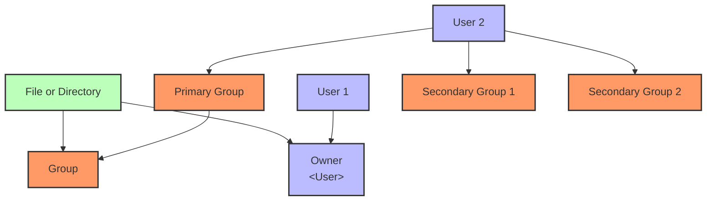
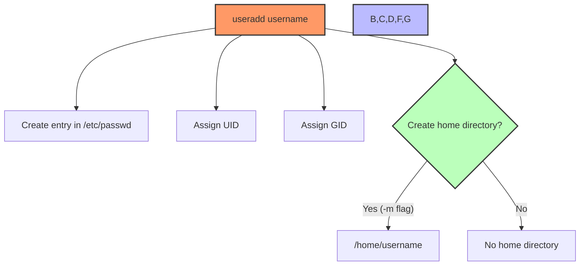
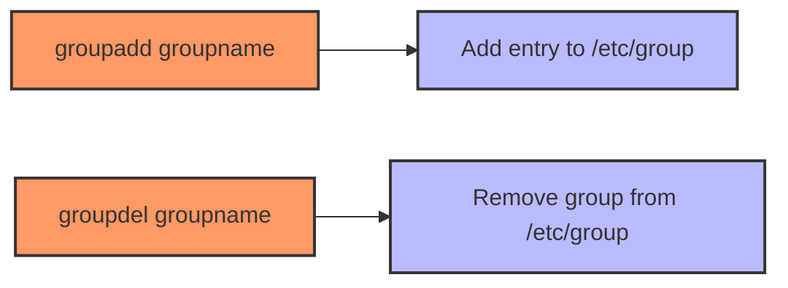
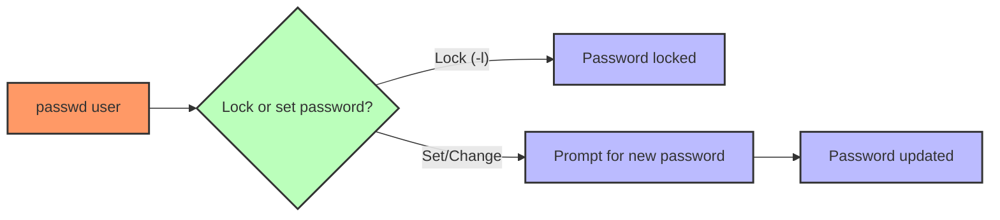
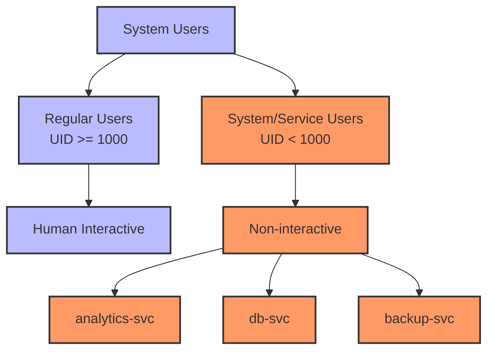

# **Linux SRE Training – Day 14 - 15: User & Group Management**  

*Transformed with a Mentor-Style Narrative and Mermaid Diagrams*

> “Permissions are about trust and boundaries,” Taylor explained, looking out at the Bay Bridge. “To keep our systems safe, we need to carefully manage who can do what, and where.”

Welcome to continuation of your Linux SRE journey. Today, you’ll see how Taylor, fresh from her inspiring trip, confidently implements a proper user and group management strategy to tighten security and maintain smooth operations on her analytics platform. 

---

## **Why User and Group Management Matters**

- **Security & Reliability**: Proper permissions reduce unauthorized access or accidental system outages.  
- **Scalability**: Automated account creation helps large-scale teams.  
- **Compliance**: Meeting security standards often requires well-documented user policies.

Taylor’s new knowledge merges with your existing foundation from previous days. On Day 7, you sharpened your networking skills; now you’ll ensure only authorized individuals can connect and perform tasks that match their roles.

---

## **Objectives by Tier**

**Beginner**  
1. Grasp the purpose of Linux users and groups  
2. Create, remove, and manage user accounts  
3. Use simple password management commands  

**Intermediate**  
1. Configure custom home directories, shells, and group memberships  
2. Automate onboarding and offboarding  
3. Implement group-based permissions for collaboration  

**SRE-Level**  
1. Enforce least privilege with specialized service accounts  
2. Integrate advanced security policies (password aging, account locking)  
3. Troubleshoot complex permission conflicts and design user management workflows  

Taylor has set these goals to match her own progression—from once being a hesitant newcomer to now a confident contributor.

---

## **Narrative Preview: Taylor’s Day in San Francisco**

Taylor returns to her office, greeted by her mentor, Rosa. Together, they map out a new user/group architecture for the analytics platform. They ensure that each team member has the right level of access and that service accounts have no more privileges than they need. You’ll see how they do this step by step, leveraging the commands and best practices described in this module.

---

## **Core Concepts**

### **Basic Analogy**

Think of users as individual “tenants” of a building, each with a unique key (UID). Groups are like floors or departments, allowing people on the same floor to share resources easily.

### **Technical Points**

- **Users**: Each has a UID, home directory, and default shell.  
- **Groups**: Logical collections of users who share certain permissions.  
- **Root (UID 0)**: Has unlimited control (the building “superintendent”).  
- **System vs. Regular Users**: System users often have no interactive shell—perfect for daemons and automated tasks.  
- **Security Model**: File and directory access depends on user and group ownership plus permission bits.

### **Mermaid Diagram: User & Group Relationships**



> “See how a single user can belong to multiple groups?” Taylor notes. “This is key for flexible permissions.”

---

## **Command Breakdown**

Below are the major commands for user and group management, each with a narrative example from Taylor’s workday:

### **1. `useradd` (Create User Accounts)**

> **Taylor’s Moment**: “We need a service account for our new data processor,” she explains to Rosa. “It shouldn’t have a home directory or shell access, just enough to run the service.”



**Syntax & Flags**   
| Flag/Option | Syntax Example                     | Description                                     | SRE Usage Context                          |
|-------------|------------------------------------|-------------------------------------------------|--------------------------------------------|
| `-m`        | `useradd -m bob`                   | Create a home directory                         | Ensures standard user environment          |
| `-d`        | `useradd -d /srv/home alice`       | Specify custom home directory                   | Useful for storing app data on another path|
| `-s`        | `useradd -s /bin/zsh alice`        | Set default shell                               | Standardize shells for dev teams           |
| `-G`        | `useradd -G wheel,audit bob`       | Add user to supplementary groups                | Grants multiple group privileges           |
| `-r`        | `useradd -r datasvc`               | Create a system account (no interactive login)  | Perfect for daemons or background services |

**Tiered Examples**  
- **Beginner**:  
  ```bash
  sudo useradd alice
  sudo passwd alice
  ```  
- **Intermediate**:  
  ```bash
  sudo useradd -m -d /projects/eng -s /bin/zsh enguser
  ```  
- **SRE-Level**:  
  ```bash
  sudo useradd -r -s /usr/sbin/nologin datapipe
  sudo chown -R datapipe:datapipe /opt/datapipe
  ```

---

### **2. `userdel` (Remove User Accounts)**

Taylor carefully removes outdated test accounts. “It’s better to lock them first if we’re unsure,” Rosa advises.

**Syntax & Flags**  
| Flag/Option | Syntax Example        | Description                                      | SRE Usage Context              |
|-------------|-----------------------|--------------------------------------------------|--------------------------------|
| `-r`        | `userdel -r testuser`| Remove user and their home directory             | Full cleanup of old accounts   |
| `-f`        | `userdel -f user123` | Force removal even if user is logged in          | Urgent or forced scenarios     |

**Tiered Examples**  
- **Beginner**:  
  ```bash
  # Remove user but keep home
  sudo userdel testuser
  ```
- **Intermediate**:  
  ```bash
  # Remove user and home directory
  sudo userdel -r stageuser
  ```
- **SRE-Level**:  
  ```bash
  # Force removal, then verify no leftover processes
  sudo userdel -f suspiciousacct
  ps aux | grep suspiciousacct
  ```

---

### **3. `usermod` (Modify User Accounts)**

> “One of the security engineers is now the DevOps lead,” Taylor explains. “We need to update her groups and shell.”

**Syntax & Flags**  
| Flag/Option | Syntax Example               | Description                                                   | SRE Usage Context                  |
|-------------|------------------------------|---------------------------------------------------------------|------------------------------------|
| `-aG`       | `usermod -aG docker alice`   | Append user to new supplementary group (don’t overwrite)      | Safely add user to a new group     |
| `-g`        | `usermod -g devteam bob`     | Change primary group                                          | Realign user role/team membership  |
| `-L`        | `usermod -L bob`            | Lock account (disables password)                              | Temporary security measure         |
| `-U`        | `usermod -U bob`            | Unlock account                                                | Restore user access                |
| `-l`        | `usermod -l newname oldname` | Rename user account                                           | Reflect legal or role-based changes|
| `-d`        | `usermod -d /new/home user`  | Change home directory                                         | Restructure directories            |

---

### **4. `groupadd` / `groupdel` (Manage Groups)**



Taylor organizes teams by function: dev, ops, analytics. Groups unify them behind consistent permissions.

**Syntax & Flags**  
| Command        | Example                  | Description                                     | SRE Usage Context                  |
|----------------|--------------------------|-------------------------------------------------|------------------------------------|
| `groupadd`     | `groupadd analytics`    | Create a new group                              | Team-based permissions             |
| `-g <gid>`     | `groupadd -g 1050 dev`  | Specify custom GID                              | Align across multiple servers       |
| `-r`           | `groupadd -r backups`   | System group (reserved range)                   | For service or system tasks         |
| `groupdel`     | `groupdel dev`          | Remove a group                                  | Cleanup after decommissioning       |

---

### **5. `passwd` (Password Management)**

Taylor ensures all user passwords adhere to a company policy. “Here’s where we can lock, expire, or force changes,” she notes.



**Syntax & Flags**  
| Flag/Option | Example                    | Description                                   | SRE Usage Context                   |
|-------------|----------------------------|-----------------------------------------------|-------------------------------------|
| `-l`        | `passwd -l user`          | Lock account (cannot log in with password)    | Security measure for compromised acct|
| `-u`        | `passwd -u user`          | Unlock account                                | Re-enable user logins               |
| `-e`        | `passwd -e user`          | Force password change on next login           | Mandate password rotation           |
| `-x <days>` | `passwd -x 90 user`       | Set maximum password age to 90 days           | Enforce password policy             |

---

### **6. `/etc/passwd`, `/etc/shadow`, and `getent`**

- **`/etc/passwd`**: Stores essential user details (UID, shell). Actual passwords are in `/etc/shadow`.  
- **`/etc/shadow`**: Privileged file containing encrypted passwords and aging info.  
- **`getent`**: Retrieves entries from system databases (files, LDAP, NIS) for accounts or groups.

> **Taylor’s Tip**: “When we integrate LDAP, `getent passwd taylor` shows if I exist locally or in the directory service.”

---

## **Password Policies & Service Accounts**

Taylor’s next step: create a microservice account with strict password rules—none! The account is locked to interactive logins. This enforces the principle of least privilege.



---

## **Hands-On Exercises**

These exercises provide practice at three levels:

### **Beginner**  
1. **Create a Basic User**  
   - `sudo useradd -m newuser && sudo passwd newuser`  
   - Verify with `id newuser`  
2. **Check `/etc/passwd`**  
   - Locate the new user line and identify each field.  
3. **Remove the User**  
   - `sudo userdel -r newuser`  

### **Intermediate**  
1. **Group Assignment**  
   - `sudo groupadd projectteam`  
   - `sudo useradd -m -G projectteam projuser`  
   - Confirm with `groups projuser`  
2. **Account Lock/Unlock**  
   - Lock: `sudo usermod -L projuser`  
   - Unlock: `sudo usermod -U projuser`  
3. **Rename & Move**  
   - `sudo usermod -l newproj projuser`  
   - `sudo usermod -d /home/newproj newproj`  
   - `sudo chown -R newproj:newproj /home/newproj`

### **SRE-Level**  
1. **Service Account**  
   - `sudo useradd -r -s /usr/sbin/nologin -d /opt/appsvc appsvc`  
   - `sudo chown -R appsvc:appsvc /opt/appsvc`  
2. **Password Policy**  
   - `sudo passwd -x 30 -n 1 -w 7 -i 5 appsvc`  
   - Check with `chage -l appsvc`  
3. **Automated Onboarding Script**  
   - Create a script that:  
     1. Takes a username as input  
     2. Creates the user, sets a default password, and locks it  
     3. Logs creation to `/var/log/user_mgmt.log`

---

## **Troubleshooting Scenarios**

1. **Locked-Out Admin**  
   - **Symptoms**: Admin enters the correct password but can’t log in.  
   - **Possible Cause**: Account locked or shell is `/usr/sbin/nologin`.  
   - **Diagnosis/Resolution**: Check with `passwd -S adminuser` and `chage -l adminuser`; use `usermod -U adminuser` or correct shell if needed.  

2. **Group Ownership Confusion**  
   - **Symptoms**: Files appear owned by numeric GID instead of a name.  
   - **Possible Cause**: The group was deleted or not recognized on this server.  
   - **Resolution**: Recreate the group with the same GID or adjust file ownership.  

3. **Service Outage After User Removal**  
   - **Symptoms**: A critical daemon stops unexpectedly.  
   - **Possible Cause**: The service account used by that daemon was deleted.  
   - **Resolution**: Restore or recreate the user. Double-check user ownership of config/data directories.  

---

## **FAQ**

### **Beginner FAQ**  
1. **How do I see which groups I belong to?**  
   - Run `groups` or `id`.  
2. **Do I need a home directory for every user?**  
   - Regular users generally do, but system/service users can omit it.  
3. **Why is there an ‘x’ in `/etc/passwd`?**  
   - It means the real password is stored in `/etc/shadow` for security.

### **Intermediate FAQ**  
1. **How can I automate user creation across 50 servers?**  
   - Use Ansible or another configuration management tool.  
2. **Can I rename a user’s home directory without losing data?**  
   - Yes, but remember to move files and adjust ownership.  
3. **What if I need multiple shells for the same user?**  
   - Typically you define one default shell. Users can run other shells manually, or you can override in scripts.

### **SRE-Level FAQ**  
1. **Why use `/usr/sbin/nologin` for service accounts?**  
   - It prevents interactive logins while allowing the process to run.  
2. **How do I enforce password rotation for all users?**  
   - Use `chage` or set policies in `/etc/login.defs` or your LDAP system.  
3. **How can I unify user management across hybrid on-prem/cloud environments?**  
   - Implement a central directory (LDAP, FreeIPA) or cloud-based identity service, then standardize NSS and PAM config.

---

## **Practical “Day in the Life”: Taylor’s Implementation**

Taylor’s final task is implementing a new analytics agent:

1. **Create the Service Account**  
   ```bash
   sudo useradd -r -s /usr/sbin/nologin -d /opt/analytics-agent analytics_svc
   ```
   *Rosa reminds her to keep privileges tight.*  

2. **Set Up Directories**  
   ```bash
   sudo mkdir /opt/analytics-agent/logs
   sudo chown analytics_svc:analytics_svc /opt/analytics-agent/logs
   sudo chmod 700 /opt/analytics-agent/logs
   ```
   *“No one else should peek at these logs,” Taylor says.*  

3. **Systemd Integration**  
   ```bash
   sudo nano /etc/systemd/system/analytics-agent.service
   # [Unit], [Service], [Install] blocks
   # Make sure User=analytics_svc, Group=analytics_svc
   sudo systemctl daemon-reload
   sudo systemctl enable analytics-agent
   ```
   *Automating startup is crucial for reliability.*  

4. **Logrotate**  
   ```bash
   sudo nano /etc/logrotate.d/analytics-agent
   # /opt/analytics-agent/logs/*.log {
   #   daily
   #   rotate 7
   #   compress
   #   missingok
   #   create 0600 analytics_svc analytics_svc
   # }
   ```
   *Prevents disk overflow and ensures minimal read/write privileges.*  

5. **Validation**  
   - `sudo systemctl start analytics-agent`  
   - Check logs in `/opt/analytics-agent/logs`  

> “We built this with security in mind from the start,” Taylor reflects. “No more one-size-fits-all user accounts.”

---

## **Further Learning Resources** 

### **Beginner**  
1. **Linux.com – Basic User Administration**  
   - Helps you understand simple user-related commands.  
2. **Ubuntu Official Docs: Add Users**  
   - Great for step-by-step instructions in an Ubuntu environment.  
3. **Raspberry Pi Docs**  
   - Beginner-friendly approach in a smaller environment.

### **Intermediate**  
1. **DigitalOcean Tutorials**  
   - Focus on real-world tasks for dev/prod servers.  
2. **Red Hat Enterprise Linux Docs**  
   - Explore advanced user/group management, SELinux, and enterprise concerns.  
3. **CentOS Project Documentation**  
   - Learn distribution-specific nuances.

### **SRE-Level**  
1. **Google SRE Book**  
   - Large-scale account and access management from the reliability perspective.  
2. **Advanced PAM Config**  
   - Fine-tune authentication with modules like MFA.  
3. **OpenLDAP Administration**  
   - Centralize ID management for big teams.

---

## **Conclusion**

Today, you learned how Taylor moved from a cautious approach to a confident method of creating and managing user accounts, focusing on minimal privileges and thorough documentation. From standard user creation to advanced service accounts, you’ve seen how each command works—and how they fit into a modern SRE’s toolkit.

> “We protect our production systems by giving each account just the right amount of power,” Taylor says. “That’s real SRE thinking.”

With today wrapped up, you’re ready to tackle **archiving, compression, and package management** on next round of topics for smooth deployments and data backups. Keep up the momentum!

