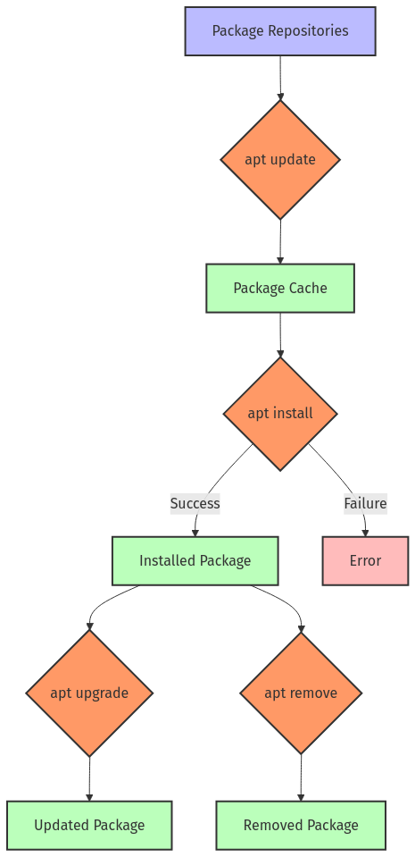

## Day 16 - 17: The Strategic Art of Archiving, Compression, and Package Management

### Aanya’s Morning in Bengaluru

Aanya arrived at CloudCrest's Bengaluru office juggling a thermos of spiced chai, a stack of sticky notes, and the lingering exhilaration of a weekend trek in the Western Ghats. Her desk—always organized with color-coded folders and a small Zen garden—contrasted with the mud-stained hiking bag propped against the wall.

Fresh from implementing user-group permissions on the analytics platform, she now faced the next challenge: **Designing robust archiving, compression, and package management systems**. In her typical methodical style, Aanya planned to streamline the analytics environment, protect crucial data, and pave the way for seamless deployments—no matter the scale or complexity.

---

## 1. Introduction & Objectives

**Objectives by Skill Level**

- **Beginner**  
  1. Understand archiving vs. compression.  
  2. Learn basic `tar`, `gzip/gunzip`, and `zip/unzip` commands.  
  3. Use package managers (`apt` or `yum/dnf`) to install and remove software.

- **Intermediate**  
  1. Apply advanced archiving with `tar`, `gzip`, `zip`, and exclude options.  
  2. Investigate dependencies, updates, and conflicts in package managers.  
  3. Troubleshoot common packaging or archiving problems.

- **SRE-Level**  
  1. Integrate archiving/compression in automated backup and deployment pipelines.  
  2. Create reproducible, secure package environments.  
  3. Handle complex scenarios (file corruption, package version conflicts) in production.

> **Narrative Bridge**  
> In a chat with her colleague over video call, Aanya explained:  
> “We’re on track with permissions and daily operations, but archiving is next. Stale data piles up, and so does disk usage. We need a structured approach that automatically rotates backups, compresses old files, and ensures our package installations stay consistent.”

---

## 2. Aanya’s Adventures with Archiving & Compression

### 2.1 What’s the Difference?

- **Beginner Analogy**  
  Archiving is grouping several books into one box; compression is squeezing all the air out of that box to save space.  
- **Technical Explanation**  
  - **Archiving** (commonly done by `tar`) bundles multiple files or directories into a single file.  
  - **Compression** (e.g., `gzip`, `bzip2`, or `zip`) then reduces that archive’s size.  
- **SRE Relevance**  
  Bundled and compressed logs, configurations, or application data enable faster backups and smaller storage footprints.

### 2.2 Basic Archiving Workflow

Aanya mapped out how she would approach daily log archiving. Here’s a simplified visual:


> **SRE Insight**  
> “Disk usage can skyrocket in dynamic environments. Automating backups and systematically compressing older files ensures that we always have enough space while maintaining full historical data.”

---

## 3. Commands You’ll Need

Below are key archiving and compression commands, plus their essential flags. Each command includes Beginner, Intermediate, and SRE-Level examples, mirroring Aanya’s day-to-day progression.

---

### 3.1 The `tar` Command (Tape Archive)

**Character Reference**  
> Think of `tar` as your **digital librarian**—gathering scattered documents (files) into neatly cataloged collections (archives).  

| Flag/Option  | Example                          | Description                                             |
|--------------|-----------------------------------|---------------------------------------------------------|
| `-c`         | `tar -cvf archive.tar /my/dir`    | Create a new archive                                   |
| `-x`         | `tar -xvf archive.tar`            | Extract from an archive                                |
| `-v`         | `tar -cvf archive.tar /my/dir`    | Verbose output (shows processed files)                 |
| `-f`         | `tar -cf archive.tar file1`       | Specify the archive filename                           |
| `-z`         | `tar -czvf archive.tar.gz dir`    | Use gzip compression (`.tar.gz`)                       |
| `-j`         | `tar -cjvf archive.tar.bz2 dir`   | Use bzip2 compression (`.tar.bz2`)                     |
| `-t`         | `tar -tvf archive.tar`            | List contents of an archive without extracting         |
| `--exclude`  | `tar -czvf backup.tar.gz dir/ --exclude="*.tmp"` | Exclude certain files or dirs              |

**Tiered Examples**

- **Beginner**  

  ```bash
  # Archive a 'docs' folder:
  tar -cvf docs.tar docs/
  # docs/
  # docs/report1.txt
  # docs/report2.txt
  ...
  ```

- **Intermediate**  

  ```bash
  # One-step creation + compression + verification:
  tar -czvf project_backup.tar.gz /home/user/project
  tar -tvf project_backup.tar.gz | grep config.yaml
  ```

- **SRE-Level**  

  ```bash
  # Partial restore of only a specific file from a large archive:
  tar -xzvf full_backup.tar.gz etc/myapp/config.yaml -C /tmp/restore --strip-components=2
  ```

> **Pro Tips**  
> - Always put the archive filename immediately after `-f`.  
> - Use timestamps in file names (e.g., `backup_$(date +%Y%m%d).tar.gz`) to keep backups organized.  
> - To avoid production impact, schedule large archiving tasks during low-usage windows.

---

### 3.2 `gzip` and `gunzip`

Aanya often teams `tar` with `gzip` for a convenient `.tar.gz` combo. However, `gzip/gunzip` can also compress or decompress single files independently.

| Flag/Option | Example                 | Description                                  |
|-------------|-------------------------|----------------------------------------------|
| `-d`        | `gzip -d file.gz`      | Decompress (equivalent to `gunzip`)          |
| `-r`        | `gzip -r /my/logs`     | Recursively compress all files in a directory|
| `-9`        | `gzip -9 largefile`    | Use maximum compression (slower)             |
| `-k`        | `gzip -k bigfile.log`  | Keep original file after compression         |

**Tiered Examples**

- **Beginner**  

  ```bash
  # Simple compression:
  gzip testfile.txt
  # Produces 'testfile.txt.gz', removing the original file
  ```

- **Intermediate**  

  ```bash
  # Recursively compress an entire directory of logs:
  gzip -r /var/log/myapp
  ```

- **SRE-Level**  

  ```bash
  # Automate log rotation:
  # Script snippet: finds logs older than 7 days, then compresses them
  find /var/log/myapp -type f -name "*.log" -mtime +7 -exec gzip {} \;
  ```

> **Pro Tips**  
> - `gzip -d file.gz` or `gunzip file.gz` both decompress.  
> - Over-compressing frequently used data can hurt performance. Always balance CPU cost vs. space savings.  

---

### 3.3 `zip` and `unzip`

While `tar`+`gzip` is standard on Linux, **zip** is more universal for cross-platform sharing (Windows, Mac, etc.).

| Flag/Option    | Example                      | Description                                        |
|----------------|------------------------------|----------------------------------------------------|
| `-r`           | `zip -r myarchive.zip /my/dir` | Recursively compress a directory                  |
| `-e`           | `zip -e secrets.zip file1`   | Password-encrypt the ZIP                          |
| `unzip -d`     | `unzip archive.zip -d /dest`  | Extract zip contents to a chosen directory        |
| `-l`           | `unzip -l archive.zip`        | List archive contents without extracting          |

**Tiered Examples**

- **Beginner**  

  ```bash
  zip texts.zip file1.txt file2.txt
  ```

- **Intermediate**  

  ```bash
  # Zip an entire website directory, then check its contents
  zip -r website.zip /var/www/html
  unzip -l website.zip
  ```

- **SRE-Level**  

  ```bash
  # Encrypt a zip file for secure distribution
  zip -e -r secure_logs.zip /var/log/myapp
  ```

> **Pro Tips**  
> - Zip archives can drop Linux-specific file permissions. Use `.tar.gz` if preserving metadata is essential.  
> - Built-in zip encryption is limited; consider stronger alternatives if your data is highly confidential.  

---

## 4. Package Management Flow

Next, Aanya shifted from archiving to ensuring consistent software installs. She often used a **Package Management Flow** like this:





---

### 4.1 `apt` (Debian/Ubuntu)

| Command      | Example                      | Description                             |
|--------------|------------------------------|-----------------------------------------|
| `update`     | `sudo apt update`           | Refresh local package index             |
| `install`    | `sudo apt install nginx`     | Install a new package                   |
| `remove`     | `sudo apt remove nginx`      | Uninstall a package                     |
| `upgrade`    | `sudo apt upgrade`           | Upgrade all installed packages          |
| `autoremove` | `sudo apt autoremove`        | Remove unneeded dependencies            |
| `search`     | `apt search package_name`    | Search for a package by keyword         |

**Tiered Examples**

- **Beginner**  

  ```bash
  sudo apt update
  sudo apt install tree
  sudo apt remove tree
  ```

- **Intermediate**  

  ```bash
  # Full system upgrade:
  sudo apt update && sudo apt upgrade -y
  ```

- **SRE-Level**  

  ```bash
  # Replicate one server's installed packages to another
  dpkg --get-selections > /tmp/packages.txt
  # On the new server:
  sudo apt update
  sudo dpkg --set-selections < /tmp/packages.txt
  sudo apt-get dselect-upgrade -y
  ```

> **Pro Tips**  
> - Use local mirrors or caching proxies for faster installs in large environments.  
> - Always run `sudo apt update` before installing or searching for a new package.  

---

### 4.2 `yum` / `dnf` (Red Hat/CentOS/Fedora)

| Command        | Example                           | Description                                 |
|----------------|-----------------------------------|---------------------------------------------|
| `check-update` | `sudo yum check-update`           | Check for available updates                 |
| `install`      | `sudo yum install httpd`          | Install a package                           |
| `remove`       | `sudo yum remove httpd`           | Remove a package                            |
| `update`       | `sudo yum update`                 | Update the entire system                    |
| `search`       | `yum search database`             | Search for packages by keyword             |
| `clean all`    | `sudo yum clean all`              | Clear cached metadata and packages          |

**Tiered Examples**

- **Beginner**  

  ```bash
  sudo yum check-update
  ```

- **Intermediate**  

  ```bash
  # Installing multiple packages
  sudo yum install -y httpd mariadb-server php
  ```

- **SRE-Level**  

  ```bash
  # Creating a local repo in an air-gapped environment
  sudo mkdir -p /repo/rpms
  sudo cp custom-software.rpm /repo/rpms
  sudo createrepo /repo
  # Add the repo to /etc/yum.repos.d/local.repo
  sudo yum install custom-software
  ```

> **Pro Tips**  
> - `dnf` is the modern variant of `yum` on newer systems, but usage is similar.  
> - Clean your yum cache occasionally (`yum clean all`) to avoid stale metadata.  

---

## 5. Hands-On Scenarios

Below are practical exercises that illustrate how Aanya might test or troubleshoot her environment at each skill level.

### 5.1 Beginner Exercises

1. **Tar/Gzip**  
   - Create a `practice` directory with three text files.  
   - Archive them with `tar -cvf practice.tar practice/`.  
   - Compress the `.tar` file with `gzip`, creating `practice.tar.gz`.  
   - Extract it into `extracted_practice`.  

2. **Package Installation**  
   - On Debian/Ubuntu: `sudo apt update && sudo apt install nano`  
   - Verify `nano --version`. Remove it (`sudo apt remove nano`) and confirm it’s gone.

3. **Zip & Unzip**  
   - `zip files.zip file1.txt file2.txt`  
   - `unzip files.zip -d unzipped_files`  

---

### 5.2 Intermediate Exercises

1. **Var Log Backup**  
   - `tar -czvf /tmp/log_backup.tar.gz /var/log`  
   - Restore to `/tmp/log_restore` and verify permissions.

2. **System Upgrade**  
   - On Ubuntu/Debian: `sudo apt update && sudo apt upgrade -y`  
   - Check `/var/log/apt/history.log` to see upgraded packages.

3. **Cross-Platform Zip**  
   - `zip -r etc_backup.zip /etc` (or a smaller subfolder).  
   - Transfer the ZIP to a Windows machine and confirm it extracts as expected.

---

### 5.3 SRE-Level Exercises

1. **Automated Log Rotation**  
   - Write a script that finds and compresses logs older than 7 days.  
   - Schedule it in cron for daily execution.  

2. **Offline Package Installation**  
   - On a system with internet access:  
     ```bash
     yum install yum-utils
     yumdownloader --resolve vim
     ```  
   - Copy the `.rpm` files to an offline system, install them with `sudo yum localinstall vim*.rpm`.

3. **Replicate Package Selections**  
   - `dpkg --get-selections > packages.txt` on one Ubuntu server.  
   - Transfer to another server, `dpkg --set-selections < packages.txt; apt-get dselect-upgrade -y` to match installations.

---

## 6. Putting It All Together: Aanya’s Full Workflow

By mid-day, Aanya consolidated everything into a **backup and deployment pipeline**:

1. **Archiving & Compression**  
   - Automated script to compress older logs with `gzip`, scheduled via cron.  
   - Large monthly backups with `tar` + `gzip` stored off-site.  

2. **Package Creation & Deployment**  
   - A custom Debian package (`.deb`) for the analytics platform—complete with pre-/post-install scripts.  
   - Deployment script that performs backups, installs the new package, verifies services, and rolls back if anything fails.

3. **Monitoring & Notification**  
   - A disk space monitor script that compresses large files at high usage thresholds.  
   - System logs for each script to audit and troubleshoot quickly.

### Backup Strategy Visual


> **SRE Insight**  
> “Even the best archiving scripts can fail if hardware is compromised or if we lose off-site backups. Always verify your backup integrity by occasionally restoring files or full directories in a safe test environment.”

---

## 7. Troubleshooting Common Issues

1. **Corrupted Archives**  
   - **Symptoms**: `tar: Error is not recoverable` or `gzip: unexpected end of file`.  
   - **Solutions**: Verify with `file` or `tar -tzf`. If corrupted, re-download or re-create the archive.

2. **Package Not Found**  
   - **Symptoms**: `E: Unable to locate package...`  
   - **Solutions**: Always run `sudo apt update`. Check if the package is in your repositories.

3. **Dependency Conflicts**  
   - **Symptoms**: “Requires version X of library Y” or “Conflicts with existing package.”  
   - **Solutions**: Try `sudo apt -f install` or `yum --skip-broken install`. If unresolved, pin or adjust versions carefully.

4. **High CPU/IO Usage**  
   - **Symptoms**: Nightly backups saturate CPU or disk.  
   - **Solutions**: Use tools like `ionice`, `nice`, or schedule backups when load is minimal.

---

## 8. Further Learning & Next Steps

- **Beginner**  
  - *Linux Journey – Package Management*  
  - *Debian Administrator’s Handbook*  
- **Intermediate**  
  - *Linux System Administrator’s Guide (TLDP)*  
  - *Advanced Package Management with APT*  
- **SRE-Level**  
  - *Google SRE Book – Release Engineering*  
  - *BorgBackup (Deduplicating Backups)*  
  - *Chef vs. Puppet vs. Ansible vs. Salt*

> **Preview**: Up next is **Day 10**, where we’ll explore **Shell Scripting**—tying these tasks together into powerful, automated routines that streamline deployments, backups, and beyond.

---

## 9. Aanya’s Wrap-Up

As the sun dipped over Bengaluru’s skyline, Aanya documented her day’s accomplishments:

1. **Created an automated archive rotation system** that compresses and moves older analytics data.  
2. **Set up disk space monitoring** scripts to take proactive action at critical thresholds.  
3. **Packaged the analytics platform** into a Debian `.deb` with maintainable pre/post-install scripts and a rollback mechanism.  
4. **Established a rigorous backup strategy** (daily incremental, weekly full, monthly off-site) with verifiable restores.

She left a note for Luis in Madrid, detailing each step and referencing logs, packages, and scripts. The analytics platform had come a long way: from haphazard log piles to a well-structured, easily restorable system. True to her SRE mindset, Aanya always designed with the next failure in mind—ensuring that any slip or misconfiguration could be quickly detected, contained, and reversed.

With that final personal touch of documentation, Aanya packed her things and headed home, confident in the knowledge that the analytics environment was secured for the next adventure.

---

**End of Day 9**: **Archiving, Compression, and Package Management**

- By blending a systematic approach with thorough backups and efficient compression, you now have the foundation to maintain reliable Linux systems at scale.  
- With advanced package management strategies, you can ensure consistency across environments and roll back gracefully if needed.

Stay tuned for **Shell Scripting Basics**, where you’ll learn to automate everything you did today into a single cohesive pipeline.

