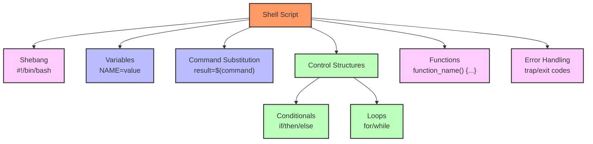
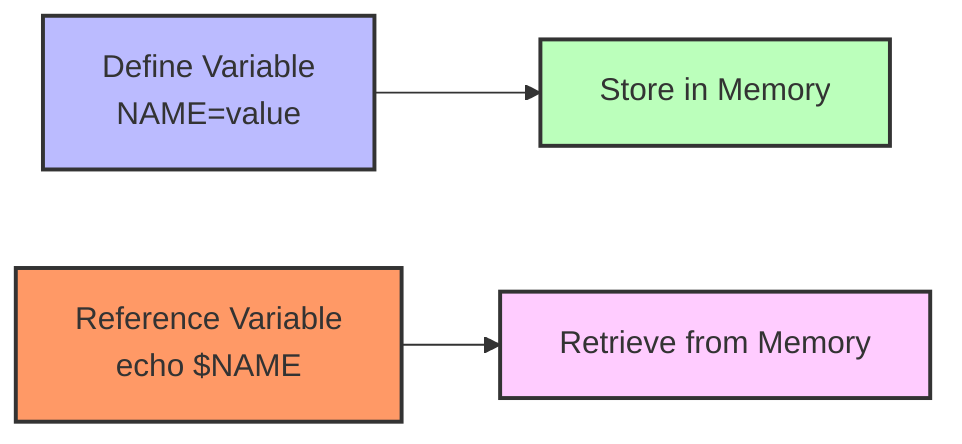
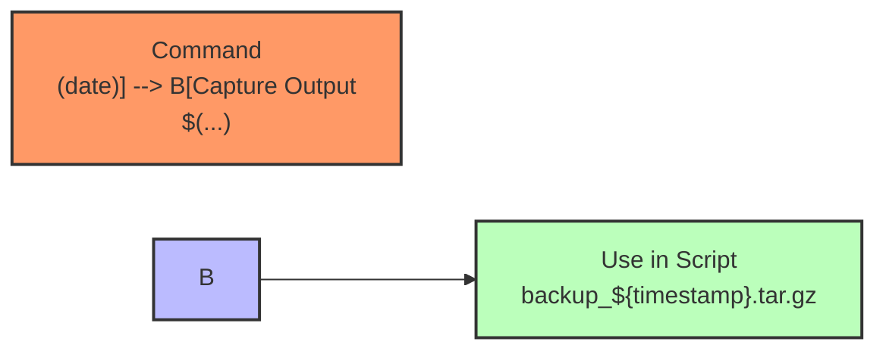
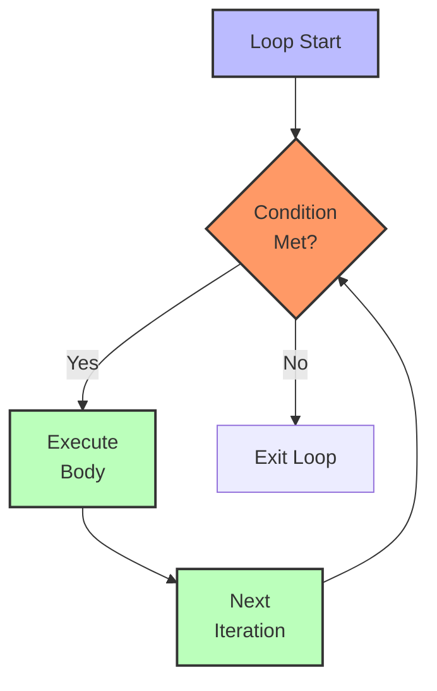
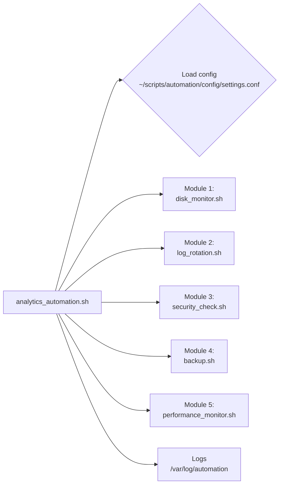

## Day 18 - 20: Crafting Automation Through Shell Scripting

### Jin’s Journey in Seoul

**09:00 KST – Seoul, South Korea.**  
Jin arrived at CloudCrest’s Seoul office for the second time this rotation, sipping the last of his morning green tea. After a whirlwind of improvements by colleagues across the globe—Taylor’s user management, Noah’s log monitoring, Aanya’s archiving system, and so on—Jin’s mission was clear: **unify** everything into a single, elegant automation framework that would streamline their analytics platform’s day-to-day operations.

His workspace, reflecting his minimalist style, sat near a tranquil bonsai tree he’d nurtured for years. But the day’s goal was anything but minimal: build an integrated script system that felt as cohesive as a well-composed piece of music. This synergy of artistry and engineering perfectly captured Jin’s approach, shaped by his background in algorithmic music composition.

---

## 1. Introduction & Why Shell Scripting Matters

**Shell scripting** is the glue that holds your Linux commands and processes together. Instead of typing commands one by one, SREs rely on scripts to automate tasks, reduce human error, and ensure consistent environments.  

Jin often says: “A good shell script is like a mini symphony—each function, variable, and loop plays a part in perfect harmony, delivering a reliable user experience.”

### Objectives by Skill Level

- **Beginner**
  1. Understand basic shell script structure (shebang, `chmod +x`, etc.).  
  2. Use variables effectively.  
  3. Write simple loops (`for`, `while`) and conditionals (`if`, `case`).

- **Intermediate**
  1. Incorporate command substitution and environment variables.  
  2. Implement debugging (`set -x`, logs) and handle errors gracefully.  
  3. Use advanced loops and branching for real-world tasks.

- **SRE-Level**
  1. Build production-ready scripts with logging, error handling, and security considerations.  
  2. Automate complex tasks (monitoring, backups, deployments).  
  3. Integrate shell scripting into broader SRE workflows (CI/CD, scaling, incident response).

> **From Taylor’s disk space crisis to a fully automated environment:** Shell scripting is the final binding element. Without it, each improvement is just a standalone puzzle piece.

---

## 2. Core Concepts of Shell Scripting

Below are some **fundamentals** that Jin frequently uses when orchestrating large-scale automation:

1. **Script Structure**  
   - Shebang (`#!/bin/bash`)  
   - Execution permissions (`chmod +x my_script.sh`)  
2. **Variables**  
   - Storing data for reusability: e.g., `LOG_DIR="/var/logs"`  
3. **Command Substitution**  
   - Dynamically capturing command output (`timestamp=$(date)`)  
4. **Loops**  
   - Automating repetitive actions across multiple files or servers  
5. **Conditionals**  
   - Adapting behavior based on system state  
6. **Environment Variables**  
   - Providing contextual info across scripts and sessions  
7. **Error Handling & Debugging**  
   - `set -e`, `set -x`, traps, and logging for robust automation  
8. **Security & Performance**  
   - Minimizing privileged operations, validating input, and optimizing loops  

### Shell Script Structure Diagram

Below is a visual overview of how a typical shell script fits together. Think of each block as an instrument in an orchestra, coming together to form a cohesive piece of automation:



---

## 3. Command Breakdown

Below are **five scripting topics** that Jin weaves into his automation. Each section has a tiered approach (Beginner → Intermediate → SRE-Level) and uses a friendly narrative to illustrate real SRE use cases.

---

### 3.1 Variables (Storing and Referencing Data)

**Narrative:**  
Jin paused his central “framework.sh” coding. He realized each script from Aanya, Noah, and Luis used different naming patterns. **“Let’s unify them with consistent variable usage,”** he said. “Variables are the script’s memory bank.”

Think of variables like placeholders for dynamic details. In an SRE scenario, these might store environment names (`staging`, `prod`), paths to critical files, or thresholds for CPU usage.



| Flag/Option | Syntax Example           | Description                                       | SRE Usage Context                              |
|-------------|--------------------------|---------------------------------------------------|------------------------------------------------|
| `=`         | `name="Alice"`          | Assign a value (no spaces around `=`)            | Setting environment defaults                   |
| `$variable` | `echo "$variable"`       | Expands the variable’s value                     | Output dynamic data                            |
| `export`    | `export MYVAR="prod"`    | Makes a variable available to child processes    | Setting environment contexts for sub-scripts   |

**Tiered Examples**:

- **Beginner**  
  ```bash
  #!/bin/bash
  name="Alice"
  echo "Hello, $name!"
  ```
  
- **Intermediate**  
  ```bash
  #!/bin/bash
  servername="web-prod"
  backup_dir="/var/backups"

  tar -czf "${backup_dir}/${servername}_logs.tar.gz" /var/log/$servername
  echo "Backup completed for $servername!"
  ```

- **SRE-Level**  
  ```bash
  #!/bin/bash
  : "${APP_ENV:?Error: APP_ENV not set}"  # Fails if APP_ENV is missing

  log_file="/var/log/${APP_ENV}_app.log"
  if [ -f "$log_file" ]; then
    echo "Processing $log_file"
  else
    echo "No log file found for environment $APP_ENV"
  fi
  ```

> **SRE Insight (from Jin):**  
> “I like to keep production-critical variables uppercase (`DB_HOST`, `APP_ENV`) for quick scanning. Local or function-specific variables stay lowercase. This neat separation avoids collisions in large scripts.”

---

### 3.2 Command Substitution (Dynamic Scripting)

**Narrative:**  
While finalizing the disk monitor module, Jin needed the current date to name each archive. Instead of manually typing it each time, he used **command substitution** to grab real-time data.



| Flag/Option  | Syntax Example         | Description                                      | SRE Usage Context                  |
|--------------|------------------------|--------------------------------------------------|------------------------------------|
| `$(command)` | `timestamp=$(date)`   | Captures stdout of `command` in a variable       | Filenames with timestamps          |
| Backticks    | `` `command` ``       | Legacy syntax for command substitution           | Older scripts or quick usage       |

**Tiered Examples**:

- **Beginner**  
  ```bash
  #!/bin/bash
  today=$(date)
  echo "The date is $today"
  ```
  
- **Intermediate**  
  ```bash
  #!/bin/bash
  file_count=$(ls -1 /var/log/*.log | wc -l)
  echo "There are $file_count log files in /var/log."
  ```

- **SRE-Level**  
  ```bash
  #!/bin/bash
  cpu_idle=$(top -bn1 | grep "Cpu(s)" | awk '{print $8}' | cut -d'.' -f1)
  cpu_usage=$((100 - cpu_idle))

  if [ $cpu_usage -gt 80 ]; then
    echo "HIGH CPU Alert! Current Usage: ${cpu_usage}%"
  else
    echo "CPU Usage: ${cpu_usage}%"
  fi
  ```

> **SRE Insight:**  
> “Be mindful that each command substitution spawns a subshell. For big data or frequent loops, consider efficiency. Sometimes, piping data directly is more performant.”

---

### 3.3 Loops (for, while)

**Narrative:**  
To check a half-dozen servers, Jin wrote a loop that pings each host. “Without loops,” he explained, “I’d be stuck retyping commands. That’s the antithesis of automation.”



| Flag/Option | Syntax Example                 | Description                              | SRE Usage Context                        |
|-------------|--------------------------------|------------------------------------------|------------------------------------------|
| `for`       | `for i in {1..5}; do ... done` | Iterates over a range or list            | Checking multiple servers                |
| `while`     | `while [ condition ]; do ... done` | Repeats until condition fails       | Monitoring processes until stable        |
| `break`     | `break`                        | Exits current loop immediately           | Early termination on error               |
| `continue`  | `continue`                     | Skips current iteration                  | Skips invalid items in a batch process   |

**Tiered Examples**:

- **Beginner**  
  ```bash
  #!/bin/bash
  for i in {1..3}; do
    echo "Count: $i"
  done
  ```
  
- **Intermediate**  
  ```bash
  #!/bin/bash
  servers=("web-01" "web-02" "db-01")

  for s in "${servers[@]}"; do
    echo "Pinging $s..."
    ping -c 1 "$s" &> /dev/null
    if [ $? -eq 0 ]; then
      echo "$s is reachable"
    else
      echo "$s is offline"
    fi
    echo "---"
  done
  ```

- **SRE-Level**  
  ```bash
  #!/bin/bash
  while true; do
    active_sessions=$(ss -t | grep ESTAB | wc -l)
    echo "Active TCP sessions: $active_sessions"

    if [ "$active_sessions" -gt 100 ]; then
      echo "High load: $active_sessions sessions"
      # Potential alert logic here
    fi

    sleep 30
  done
  ```

> **SRE Insight:**  
> “Combine loops with concurrency carefully—like `xargs -P`—to speed up checks on large server fleets. Just watch out for network or CPU saturation.”

---

### 3.4 Conditionals (if, case)

**Narrative:**  
When finalizing his automation framework, Jin set up conditionals to handle staging vs. production differently. **“If we’re in staging, skip the Slack alert. If we’re in production, call Slack,”** he said, demonstrating how conditionals adapt to environment variables.

| Flag/Option | Syntax Example                         | Description                                     | SRE Usage Context                             |
|-------------|----------------------------------------|-------------------------------------------------|-----------------------------------------------|
| `if`        | `if [ "$var" = "something" ]; then...` | Basic branching                                 | Checking environment or thresholds            |
| `elif`      | `elif [ condition ]; then... fi`       | Another condition if first fails               | Multi-level checks (warn/critical)            |
| `else`      | `else ... fi`                          | Fallback condition                             | Default or error-handling path                |
| `case`      | `case $var in pattern) ... ;; esac`     | Pattern matching for multiple discrete values  | Handling environment names or error codes     |

**Tiered Examples**:

- **Beginner**  
  ```bash
  #!/bin/bash
  read -p "Enter a number: " number

  if [ $number -gt 10 ]; then
    echo "$number is greater than 10!"
  else
    echo "$number is 10 or less."
  fi
  ```
  
- **Intermediate**  
  ```bash
  #!/bin/bash
  status_code=404

  case $status_code in
    200)
      echo "OK: Everything is good"
      ;;
    404)
      echo "Not Found: Resource missing"
      ;;
    500)
      echo "Internal Server Error: Check logs"
      ;;
    *)
      echo "Unhandled status code: $status_code"
      ;;
  esac
  ```

- **SRE-Level**  
  ```bash
  #!/bin/bash
  mem_free=$(free -m | awk 'NR==2{print $4}')

  if [ "$mem_free" -lt 512 ]; then
    echo "CRITICAL: Memory below 512 MB!"
    # Trigger alert or scale up
  elif [ "$mem_free" -lt 1024 ]; then
    echo "WARNING: Memory below 1 GB"
  else
    echo "Memory levels OK."
  fi
  ```

> **SRE Insight:**  
> “Guard your production environment with clear conditionals. For example, an `if [ "$APP_ENV" = "prod" ]` block might ensure you never accidentally wipe live data.”

---

### 3.5 Environment Variables (Global Configuration)

**Narrative:**  
All of Jin’s modules—disk monitor, log rotation, backup—drew on environment variables to know what environment they were in (`prod`, `dev`, `staging`). “They’re like signposts telling your scripts where they’re running and how they should behave,” Jin explained.

| Flag/Option       | Syntax Example               | Description                                           | SRE Usage Context                |
|-------------------|------------------------------|-------------------------------------------------------|----------------------------------|
| `export`          | `export MYVAR="some_value"`  | Makes a variable available to child processes         | Setting environment across scripts|
| `env`             | `env`                        | Lists all current environment variables               | Debugging environment issues     |
| `printenv`        | `printenv PATH`              | Prints a specific environment variable                | Checking values in scripts       |
| `.bashrc`         | `vi ~/.bashrc`               | Shell startup file for persistent variables           | Configuring user-level settings  |

**Tiered Examples**:

- **Beginner**  
  ```bash
  #!/bin/bash
  export MYAPP_PORT=8080
  echo "MYAPP_PORT is set to $MYAPP_PORT"
  ```
  
- **Intermediate**  
  ```bash
  #!/bin/bash
  if [ -z "$DB_HOST" ]; then
    echo "Please set DB_HOST before running this script."
    exit 1
  fi

  echo "Connecting to database at $DB_HOST..."
  ```
  
- **SRE-Level**  
  ```bash
  #!/bin/bash
  source /etc/myapp/env.production

  if [ "$APP_ENV" = "production" ]; then
    echo "Production environment loaded. PATH=$PATH"
  else
    echo "Environment mismatch: APP_ENV=$APP_ENV"
  fi
  ```

> **SRE Insight:**  
> “Use version-controlled environment files that you source at runtime. Keep secrets secure—never commit passwords to public repos or world-readable scripts.”

---

## 4. System Effects

When writing or running scripts in production, watch for:

1. **Filesystem & Metadata**  
   - Setting permissions, changing file ownership, or archiving logs can impact overall disk usage.  
2. **System Resources**  
   - Complex loops or repeated tasks can spike CPU, memory, or I/O usage if left unchecked.  
3. **Security Implications**  
   - Running as `root` or ignoring user input validation can open vulnerabilities.  
4. **Monitoring & Visibility**  
   - Scripts that rotate or compress logs might inadvertently remove or hide critical troubleshooting data if configured incorrectly.

---

## 5. Hands-On Exercises

Below are practical exercises reinforcing each concept. Jin often assigns these to new SRE hires to help them gain comfort with shell scripting.

### 5.1 Beginner Exercises

1. **Hello Script**  
   - Create `hello.sh`.  
   - Prompt the user’s name with `read name`, then print a welcome message.  
   - Make it executable with `chmod +x hello.sh`, then run it.

2. **Simple Math**  
   - Write `math.sh`.  
   - Prompt the user for two numbers, add them with `$((num1 + num2))`, and print the result.

3. **File Checker**  
   - Build `file_check.sh`.  
   - Check if `data.txt` exists. If yes, print “File found!”; otherwise, “No file.”

### 5.2 Intermediate Exercises

1. **Server Status Loop**  
   - `check_servers.sh`: define an array of server names.  
   - Ping each server, log results to `server_status.log`.  
2. **Backup Automation**  
   - `auto_backup.sh`: use `timestamp=$(date +%Y%m%d-%H%M%S)` to name an archive, e.g. `backup-$timestamp.tar.gz`.  
   - Experiment with different directories.  
3. **Conditional Cleanup**  
   - `cleanup_logs.sh`: if a `.log` file in `/var/log` is >10 MB, compress it with `gzip`. Otherwise, leave it uncompressed.

### 5.3 SRE-Level Exercises

1. **Resource Threshold Monitor**  
   - `monitor_resources.sh`: check CPU, memory, and disk usage every 60 seconds.  
   - If usage crosses thresholds (e.g., CPU >80%), log an alert or send an email.  
2. **Environment-Based Deploy**  
   - `deploy_app.sh`: read `APP_ENV`. If `APP_ENV=prod`, run production config. If staging, skip certain steps.  
   - Include error handling if `APP_ENV` is missing.  
3. **Multi-Server Loop**  
   - `distributed_cmd.sh`: read a list of remote servers from `servers.txt`.  
   - SSH into each and run a command, storing the result locally.  
   - Handle SSH failures gracefully.

---

## 6. Troubleshooting Scenarios

Even the most elegant scripts encounter pitfalls. Here are three examples:

1. **Unexpected Script Termination**  
   - **Symptom**: The script halts when a command fails.  
   - **Cause**: `set -e` or a pipeline error.  
   - **Resolution**: Check exit codes with `$?`; handle known failures or wrap in `|| true` if non-critical.

2. **Variables Not Recognized in Child Script**  
   - **Symptom**: A sub-script doesn’t see the parent’s variables.  
   - **Cause**: Variables not exported or run in a different shell environment.  
   - **Resolution**: Use `export VAR` or pass them as arguments (e.g. `./child.sh "$VAR"`).

3. **Infinite Loop Overwhelming CPU**  
   - **Symptom**: 100% CPU usage, script never exits.  
   - **Cause**: A `while true` loop with no exit condition.  
   - **Resolution**: Add a break, a sleep, or a condition to terminate.

---

## 7. FAQ

### 7.1 Beginner FAQ

1. **Why is my script showing “Permission denied”?**  
   - You likely need `chmod +x script.sh`. Also ensure the shebang (`#!/bin/bash`) is correct.

2. **How do I do arithmetic in a script?**  
   - Use `$((expression))`, e.g. `sum=$((num1 + num2))`.

3. **Can I prompt the user for input?**  
   - Yes. Use `read variable`. For silent input (e.g. passwords), do `read -s variable`.

### 7.2 Intermediate FAQ

1. **How do I pass command-line arguments to my script?**  
   - They appear as `$1`, `$2`, etc. For instance, `./script.sh arg1`, then inside the script: `echo $1`.

2. **Why do filenames with spaces break my loops?**  
   - You must quote variables, e.g. `for file in *.log; do echo "$file"; done`.

3. **How do I debug my script?**  
   - Use `set -x` to trace commands, or run `bash -x script.sh`. Insert `echo` statements for clarity.

### 7.3 SRE-Level FAQ

1. **How do I handle large scripts for maintainability?**  
   - Break them into functions or separate modules. Keep a shared “library” file with common functions.

2. **How do I protect secrets in shell scripts?**  
   - Use dedicated secret managers (Vault, AWS Secrets Manager). If local files are needed, restrict permissions (`chmod 600`) and never commit to public repositories.

3. **How can I add logging and monitoring to my scripts?**  
   - Write logs to a file or use `logger` for syslog. Integrate with your monitoring platform (Prometheus, ELK) for long-term analysis.

---

## 8. Jin’s Capstone Example: The Automation Framework

After walking through each concept, Jin set up a modular “analytics_automation.sh” that tied everything together. Below is a **simplified architecture** diagram of how modules, configs, and logs interact under one script framework:



**Key Scripts**:  
- **Core Framework** (`framework.sh`) with shared functions (logging, error handling).  
- **Modules** (`disk_monitor.sh`, `log_rotation.sh`, etc.) each focusing on one task.  
- **Master Script** (`analytics_automation.sh`) orchestrating modules in the correct order, referencing environment variables.  

This approach helps each domain remain separate yet consistently integrated. If one piece fails, Jin’s error handling and alerts quickly pinpoint the problem.

> **Final Note from Jin**:  
> “Think of these modules like instruments. Each is carefully tuned, playing its own part in the system’s overall reliability. If one goes out of tune, the automation symphony alerts me, and I can fix it without disrupting the rest.”

---

## 9. Further Learning Resources

### 9.1 Beginner Level

1. **Learn Shell Scripting Step by Step**  
   [https://www.howtoforge.com/tutorial/bash-scripting-tutorial/](https://www.howtoforge.com/tutorial/bash-scripting-tutorial/)  
   *Great for reinforcing fundamentals of variables, loops, and conditionals.*

2. **The Linux Command Line**  
   [https://linuxcommand.org/tlcl.php](https://linuxcommand.org/tlcl.php)  
   *Transitions from basic commands to more advanced scripting topics.*

3. **ShellCheck Online**  
   [https://www.shellcheck.net/](https://www.shellcheck.net/)  
   *A handy tool that catches common shell scripting mistakes.*

### 9.2 Intermediate Level

1. **Advanced Bash-Scripting Guide**  
   [https://tldp.org/LDP/abs/html/](https://tldp.org/LDP/abs/html/)  
   *Explores arrays, traps, and more complex features.*

2. **Google Shell Style Guide**  
   [https://google.github.io/styleguide/shellguide.html](https://google.github.io/styleguide/shellguide.html)  
   *Outlines best practices for maintainable, consistent scripts.*

### 9.3 SRE-Level

1. **Google SRE Book – Automation Chapter**  
   [https://sre.google/sre-book/](https://sre.google/sre-book/)  
   *Real-world guidance on large-scale automation strategies.*

2. **Linux System Administrator’s Guide**  
   [https://www.kernel.org/doc/Documentation/admin-guide/](https://www.kernel.org/doc/Documentation/admin-guide/)  
   *Advanced topics that affect how scripts and the OS interact.*

3. **Effective DevOps**  
   [https://www.oreilly.com/library/view/effective-devops/9781491926291/](https://www.oreilly.com/library/view/effective-devops/9781491926291/)  
   *Discusses collaboration, automation, and CI/CD best practices at scale.*

---

## 10. Conclusion: Shell Scripting as a Unifying Force

As the day wound down in Seoul, Jin reviewed his newly minted automation framework. Each module was now a carefully composed piece of his operational orchestra, and the entire system finally played together in perfect sync. By adopting **shell scripting fundamentals**—variables, loops, conditionals, environment variables, and robust error handling—he’d turned scattered scripts into a graceful whole.

**Key Takeaways**:

1. **Command Summary**  
   - Variables, Command Substitution, Loops, Conditionals, Environment Variables.  
2. **Operational Insights**  
   - Fail Fast (with `set -e`) or handle known errors gracefully.  
   - Log everything for audits and post-incident reviews.  
   - Keep security top-of-mind (permissions, secrets).  
3. **Best Practices**  
   - Keep scripts modular and well-documented.  
   - Validate environment and inputs.  
   - Maintain them in version control for easy updates and rollbacks.

You’re now equipped to script your way to greater reliability, unifying all you’ve learned thus far into a polished, automated environment—just as Jin did for CloudCrest Analytics.  

**Final Encouragement**: Keep experimenting, refining, and orchestrating. The next time you see a repetitive command or a messy post-release routine, remember: a simple shell script can transform it into a streamlined, well-tuned process.

