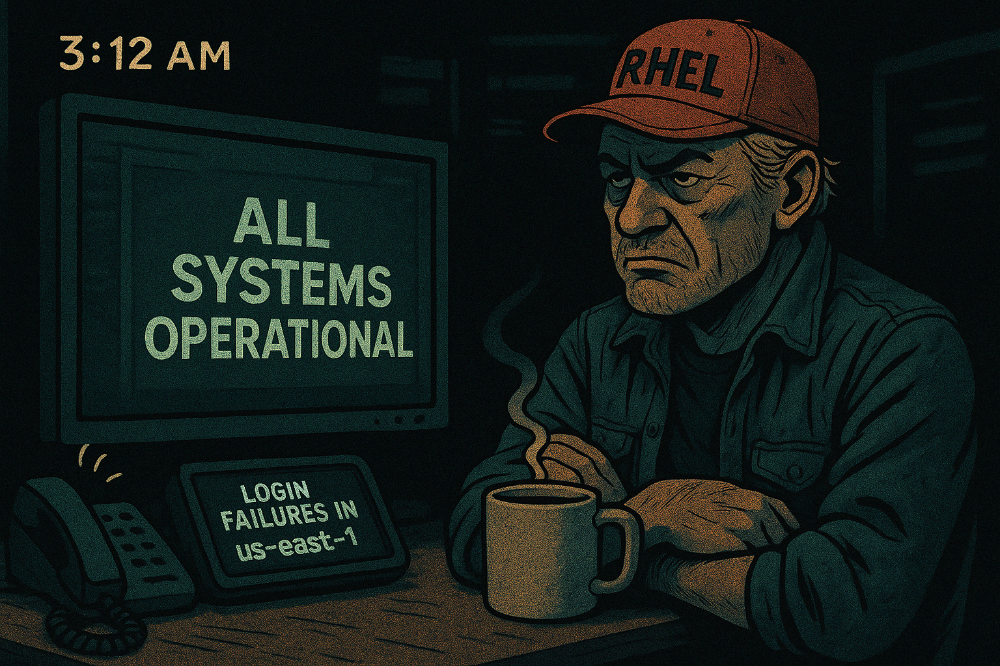
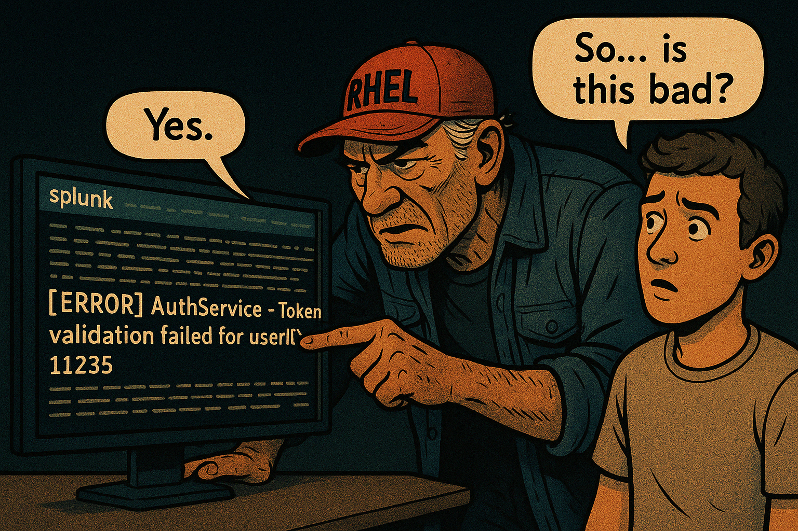
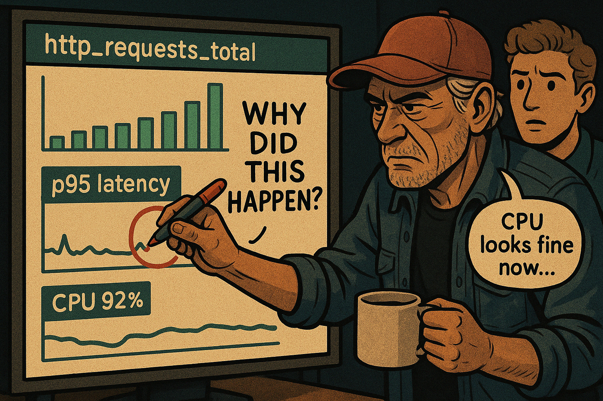
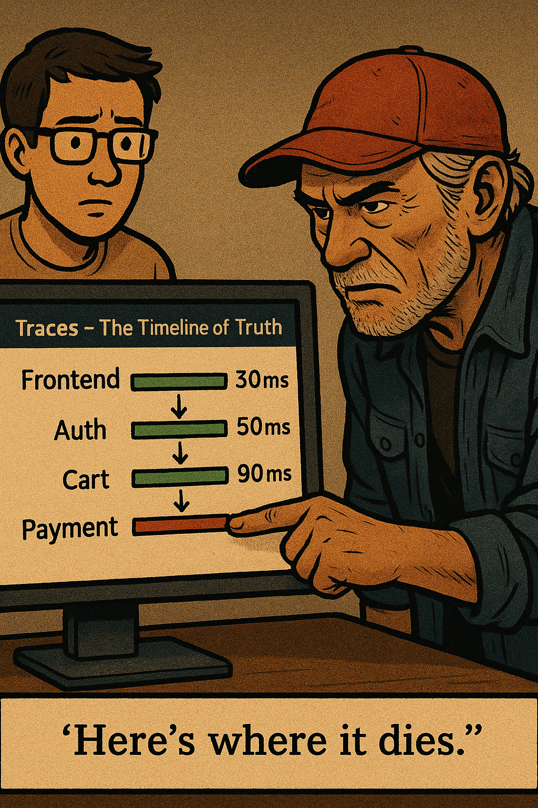
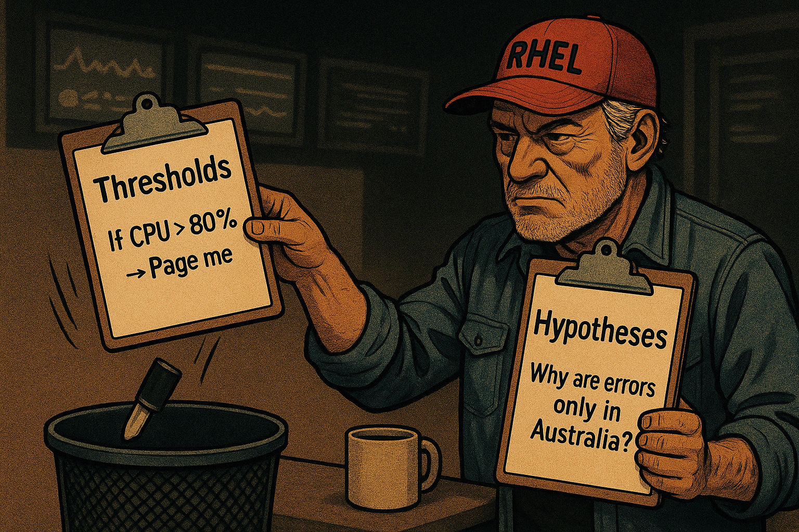
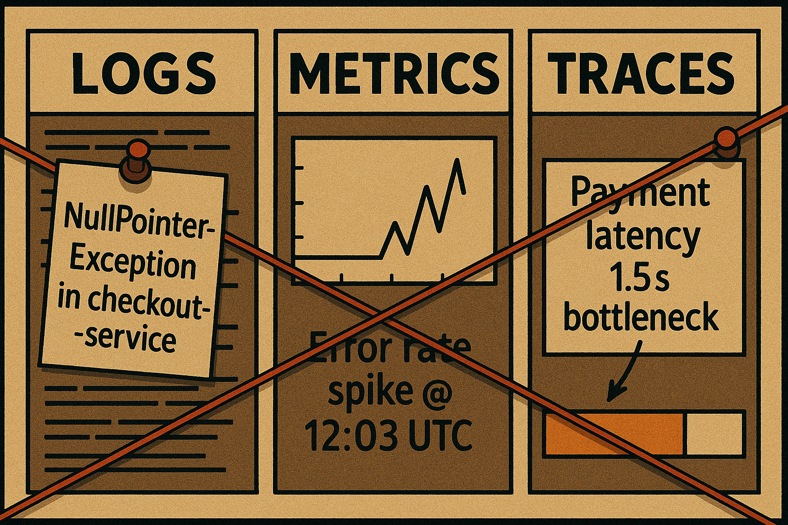
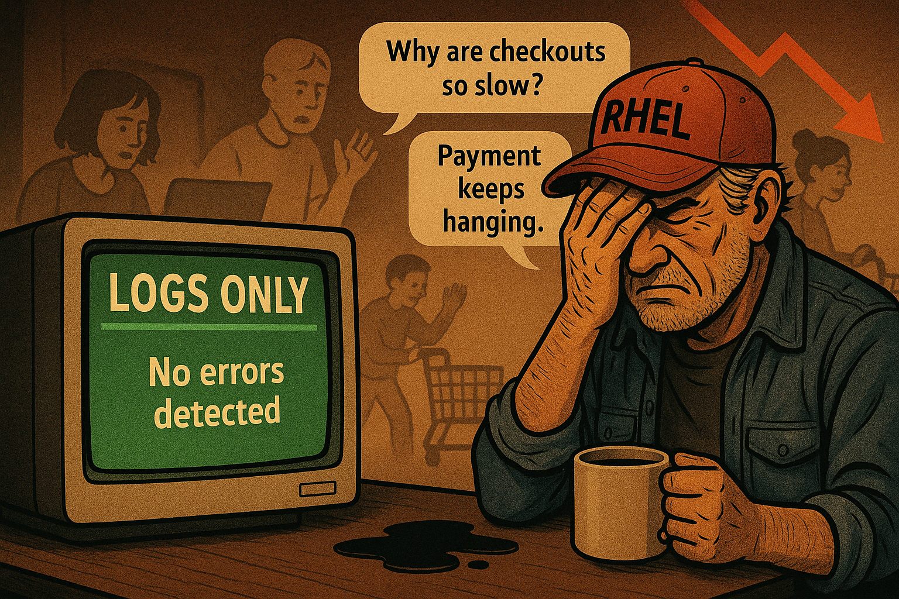
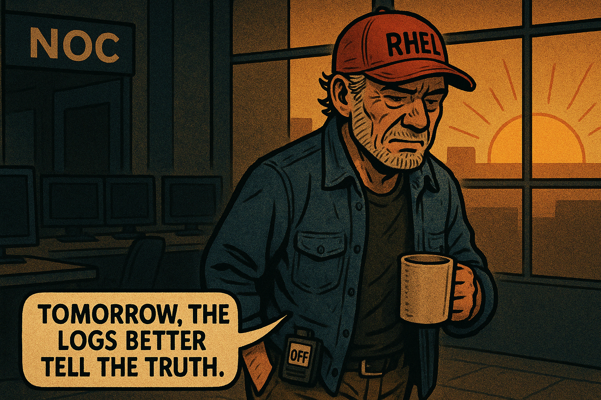

# 🎙️ Observability 101: Comic Book Overview – Day 1 

## **Title:** *“You Can’t Fix What You Can’t See”*  
**Narrator:** Hector Alvarez – Veteran SRE, Chaos Interpreter, Pager Survivor  
**Style:** Scene-by-scene comic layout with monologue, setting, and prompt guidance  

---

## 🎨 Scene 1: “The Green Dashboard Lie”

**💬 Monologue:**  
> “Dashboard’s green. Pager’s screaming. Someone’s lying—and it’s not the pager.  
> Monitoring says ‘CPU’s fine’. Observability says ‘users can’t log in’. Guess which one I trust.”

---

## 🎨 Scene 2: “Logs – The System’s Receipts”

**💬 Monologue:**  
> “Logs are receipts. Problem is, some of them are in ancient languages—or worse, JSON from three deploys ago.  
> Want to debug something? Pray whoever wrote this log entry wasn’t in a hurry.”

---

## 🎨 Scene 3: “Metrics – The System’s Mood Swings”

**💬 Monologue:**  
> “Metrics are weather reports. Great until the storm hits.  
> You see a dip in CPU and think it’s calm? That’s not peace. That’s the app crashing.”

---

## 🎨 Scene 4: “Traces – The Timeline of Truth”

**💬 Monologue:**  
> “Traces don’t care about your dashboards. They care about reality.  
> One slow service. One retry loop. That’s your bottleneck—and it’s always the one nobody suspects.”

---

## 🎨 Scene 5: “Monitoring vs Observability”

**💬 Monologue:**  
> “Monitoring is about what you expect. Observability is for when everything’s on fire and nothing makes sense.  
> You don’t need more thresholds. You need better questions.”

---

## 🎨 Scene 6: “The Pillars Stand Together”

**💬 Monologue:**  
> “You don’t find truth in just one tool. You find it in the overlap.  
> Logs show the error. Metrics show the impact. Traces show the suspect.  
> Use them all—or you’ll always be guessing.”

---

## 🎨 Scene 7: “What You Don’t See Can Hurt You”

**💬 Monologue:**  
> “Logs tell you what happened. Not *how often*, not *how slow*.  
> If you’re relying only on logs, you’re debugging in the dark—without a flashlight.”

---

## 🎨 Scene 8: “The Final Panel – Clarity Under Fire”

**💬 Monologue:**  
> “You don’t need 40 graphs. You need the right three.  
> One to show you it’s broken. One to show you when. One to help you fix it.  
> Everything else? Background noise.”

---

## 🔚 Epilogue – Hector’s Final Words (for Today)

**💬 Final Monologue:**  
> “Observability isn’t a tool. It’s a mindset.  
> You stop guessing. You start seeing.  
> And once you see clearly, you fix fast—or at least, you stop the bleeding.”

---
