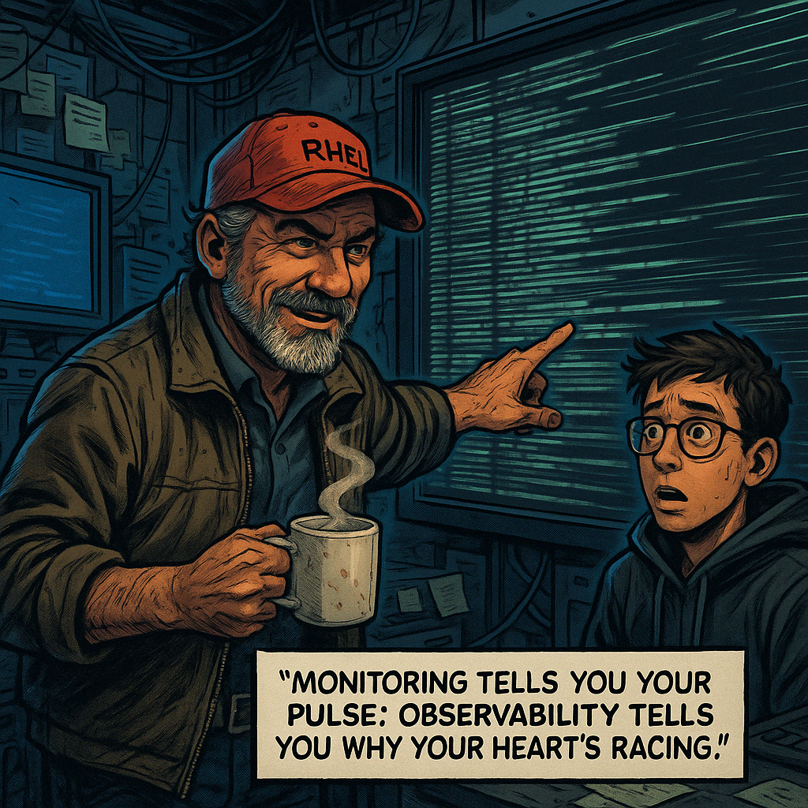
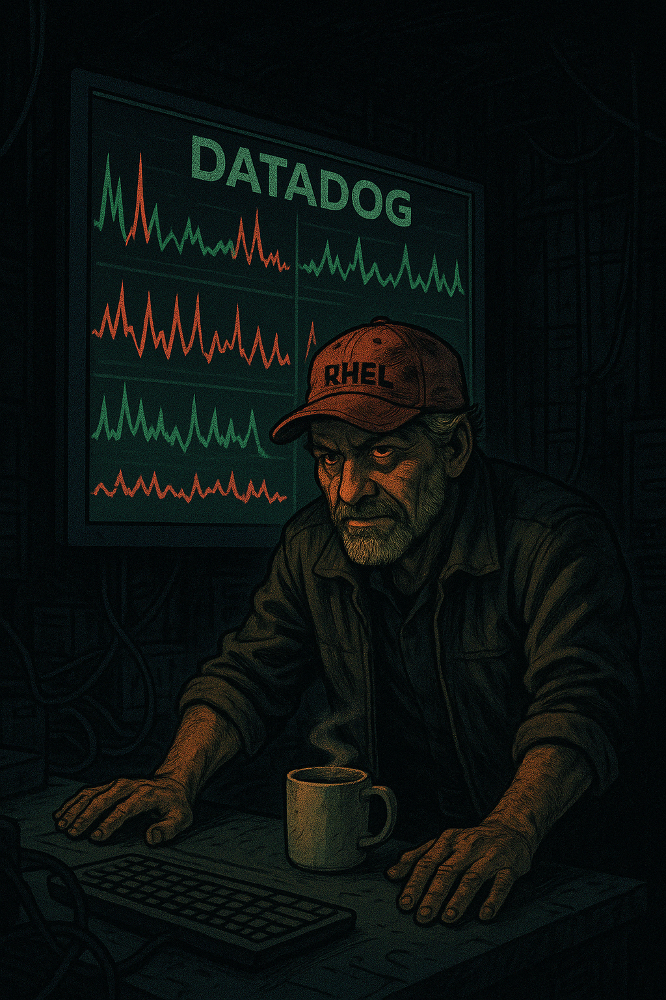
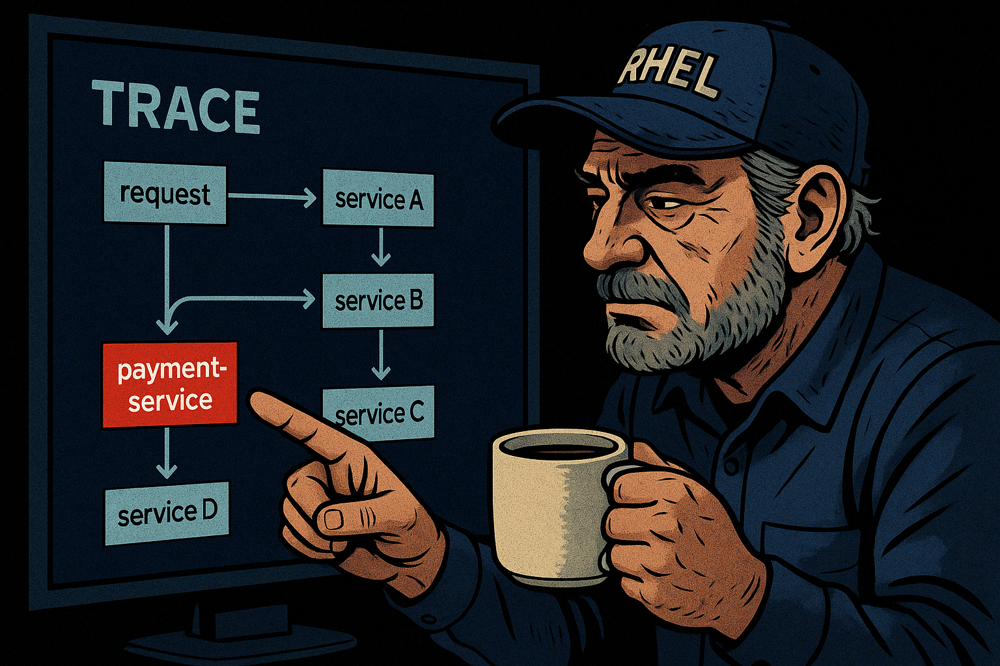
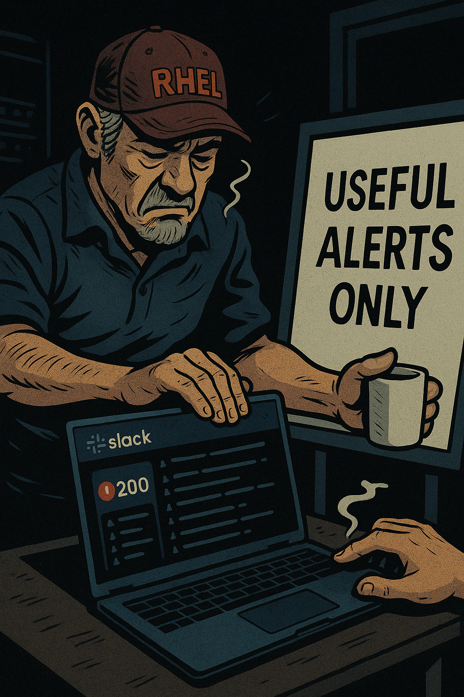

# 🎙️ Narrative Training Introduction 
 
Hector Alvarez Presents: Observability 101 “This isn’t a fairytale. This is production.”
---
## 🎨 SCENE 1: **Logs – The Drunken Diary of a System**

---

**💬 Hector’s Monologue:**

> “You want to know what happened? Check the logs. You want to know why it happened? That’s harder.  
>  
> Logs are the diary your systems keep. Some write too much. Some forget to write at all. And most of them are written like someone’s trying to win a Bad API Poetry Contest.  
>  
> Structured logs are nice—if your developers were feeling generous. Otherwise, you’re reading stack traces, timestamps from the wrong timezone, and some unhelpful message like ‘process failed.’ Fantastic. Which one? Why? During what request?  
>  
> Here’s the trick: logs tell the *truth*, but only the parts someone decided to write down. Missing context? That’s your enemy.  
>  
> I once debugged a cart failure because someone logged ‘checkout error’ with no user ID, no order ID, and no timestamp. That wasn’t a log. That was a *trap*.  
>  
> Don’t rely on logs alone. They are the first place to look, not the last place to trust.”

---

**🗯️ Hectorism:**  
> “A log without context is like a scream in the dark. Loud, useless, and makes you feel weird afterward.”

---

## 🎨 SCENE 2: **Metrics – The System’s Mood Swings**

---

**💬 Hector’s Monologue:**

> “Metrics are your early warning system. They’re how your systems tell you, *‘I don’t feel so good.’*  
>  
> You’ve got system metrics—CPU, memory, disk. Application metrics—request rates, latencies. And business metrics—conversion rates, payment volumes. You need all three, or you’re flying blind.  
>  
> But here’s the dirty truth: metrics lie, too. Averages? Garbage. A p95 latency of 300ms sounds great… unless p99 is 4 seconds and your VIPs are getting hosed.  
>  
> And cardinality? That’s a polite way of saying ‘you tried to track every user ID and now your monitoring bill looks like national debt.’  
>  
> Don’t just look at graphs. *Read them.* Compare them. See where the heartbeat skips. When payment latency goes up—what happened to database load? When CPU drops—did the app crash?  
>  
> I’ve seen folks celebrate a drop in error rate, only to realize the logs stopped shipping. Metrics tell you what’s changing. It’s up to you to figure out if that change is good, or just quiet failure.”

---

**🗯️ Hectorism:**  
> “Metrics don’t lie, but they definitely omit the part where your app’s on fire.”

---

## 🎨 SCENE 3: **Traces – The Crime Scene Tape of Microservices**

---

**💬 Hector’s Monologue:**

> “Traces. Now we’re talking. This is the stuff that tells you *where the body is buried*.  
>  
> A log says something failed. A metric says failure rate went up. But only a trace will show you that the `payment-service` took 1.4 seconds while everyone else was snappy.  
>  
> In the land of microservices, you need traces like you need oxygen. They’re not optional. A single user request might bounce through frontend, auth, cart, payment, shipping, email. Which one was slow? Which one crashed? Without tracing, you're just finger-pointing with prettier graphs.  
>  
> You trace spans. You trace latency. You trace every hop like a detective at a crime scene.  
>  
> Want to see what happens without it? Let me tell you about a week where we blamed three different teams—only to find a rogue retry loop in the checkout service burning 90% of the total latency. Took us four days. A trace would’ve shown it in 10 seconds.  
>  
> Get OpenTelemetry in early. Tag your spans. Log the trace ID. Give yourself a fighting chance.”

---

**🗯️ Hectorism:**  
> “Traces don’t point fingers. They *draw the chalk outline.*”

---

## 🎨 SCENE 4: **Alerts – When the System Screams (and Won’t Shut Up)**

---
**💬 Hector’s Monologue:**

> “Alerts should be your guardian angels. Not the voices in your walls.  
>  
> If you’ve ever seen an alert for ‘disk at 85%’… and then again at 86%… and then again every minute until your soul left your body, congrats—you’ve met bad alerting.  
>  
> Good alerts are **impactful** and **actionable**. If an alert fires, you should know *what broke*, *who it impacts*, and *what to do about it.*  
>  
> Most teams alert on thresholds, not impact. CPU > 90%? Who cares—unless it’s affecting a customer.  
>  
> Build alerts off **SLOs**, not random guesses. Tie alerts to user-facing symptoms. Use logs and metrics *together* to suppress noise.  
>  
> And for the love of uptime, if you page someone, give them *links*. Logs. Graphs. Context. Not just a screaming subject line.  
>  
> I once saw a page that just said ‘Something went wrong.’ What am I, a psychic? Don’t make me guess. I’m not young anymore.”

---

**🗯️ Hectorism:**  
> “An alert without context is just a passive-aggressive scream from the void.”

---

## 🎨 SCENE 5: **Triage Like a Street Medic**  
> *"You’re not fixing the system. You’re stopping it from bleeding out in the hallway.” – Hector Alvarez*

---

### 🎨 VISUAL SETUP (Comic Book Panel Suggestions):

1. **Panel 1:** A red-blinking alert appears on Hector’s dusty laptop in a dim-lit server room. Slack notifications scream.
   - Caption: *"Critical alert: API error rate > 5% in us-west-2..."*
   - Hector: Slouched in a chair, still chewing half a granola bar. “Mmh. Here we go again.”

2. **Panel 2:** Hector rolls out a whiteboard titled “The Damage Report.” Five buckets: Alert, Users Affected, Metrics, Logs, Traces.
   - He mutters: “No one gets to panic until we know what broke.”

3. **Panel 3:** Side-by-side of a newbie flailing across three dashboards vs. Hector calmly cross-referencing them like Sherlock with caffeine withdrawal.

---

### 💬 Hector’s Monologue:

> “Triage isn't about solving the whole problem. It’s about not making things worse while you figure it out.  
>  
> You treat production like a crash site. First question isn’t *what broke*—it’s *who’s bleeding?*  
>  
> Start with the alert. **What’s it really saying?** Not the raw metric—what’s the impact? 500 errors on the checkout API? That’s *lost money*, not just red graphs.  
>  
> Next: **Is it user-facing?** Look for a spike in latency, drop in successful requests, an error flood. Use dashboards to spot *anomalies*, not pretty charts.  
>  
> **Logs** tell you *what went wrong*. **Metrics** tell you *when and how often*. **Traces** tell you *where*. Put them together like a crime board in a detective show.  
>  
> You don’t click around hoping something jumps out. You build a timeline. A story. And if your story ends with ‘we don’t know,’ you escalate—*but you escalate with context.*  
>  
> You’re not the hero. You’re the medic. Stop the bleeding, stabilize the patient, tell the surgeons what you saw. That’s how you save a system—and a shift.”

---

### 🗯️ Hectorism:

> “You’re not in ops. You’re in ER. And every alert is someone shouting *‘code blue in us-east-1’*.”

---

## 🎨 SCENE 6: **Dashboard Design That Doesn’t Lie to You**

> “A dashboard isn’t art. It’s a life support monitor. If it’s pretty but useless, you’ve already lost.” – Hector Alvarez

---

### 🎨 VISUAL SETUP (Comic Book Panel Suggestions):

1. **Panel 1:** A new hire enthusiastically presenting a gorgeous, rainbow-colored dashboard to a conference room.
   - Caption: "Total alignment across 12 KPIs!"
   - Hector in the back corner, unimpressed, arms crossed. “Neat colors. Can it tell me why the site’s down?”

2. **Panel 2:** Close-up of the dashboard. So many graphs. So little meaning. No timeframes. No context.
   - Hector’s thought bubble: “I call this one ‘Graph Confusion in D major.’”

3. **Panel 3:** Hector draws a crude but effective dashboard on a whiteboard: a handful of well-labeled graphs, a timeline, and annotations.
   - “This is what helped me fix a payment outage in 8 minutes. The other thing just gave me a seizure.”

---

### 💬 Hector’s Monologue:

> “Everyone wants to build dashboards. Few know how to build useful ones.  
>  
> Dashboards aren’t for showing off. They’re for getting answers when production’s on fire. When someone’s screaming ‘why are checkouts failing in Brazil?!’—you don’t want twelve donut charts. You want signal.  
>  
> A good dashboard tells a story. It should show you:  
>  
> - What’s broken?  
> - Since when?  
> - How bad is it?  
> - Who or what is affected?  
>  
> That means timelines. Annotations. KPIs that matter. You don’t need graphs for every metric under the sun. You need three to five that keep your pulse steady.  
>  
> Business metrics up top. System health below. Request latency and error rates center stage. You should be able to walk into a war room, glance at the screen, and know what’s going wrong in 10 seconds.  
>  
> And please, label things. You think that graph means ‘cart latency’? Turns out it’s pulling from the legacy staging service. Nice one.  
>  
> I once saw a dashboard with 24 widgets and zero context. We spent more time deciphering that than fixing the issue. I started calling it ‘The Louvre.’ Pretty. Useless.”

---

### 🗯️ Hectorism:

> “If your dashboard needs a legend and a translator, it’s a painting, not a tool.”