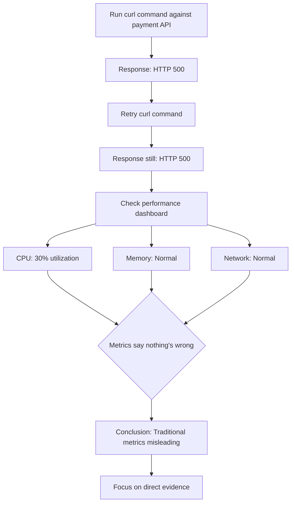
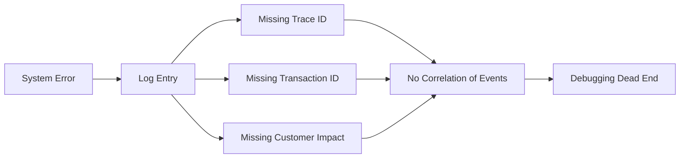
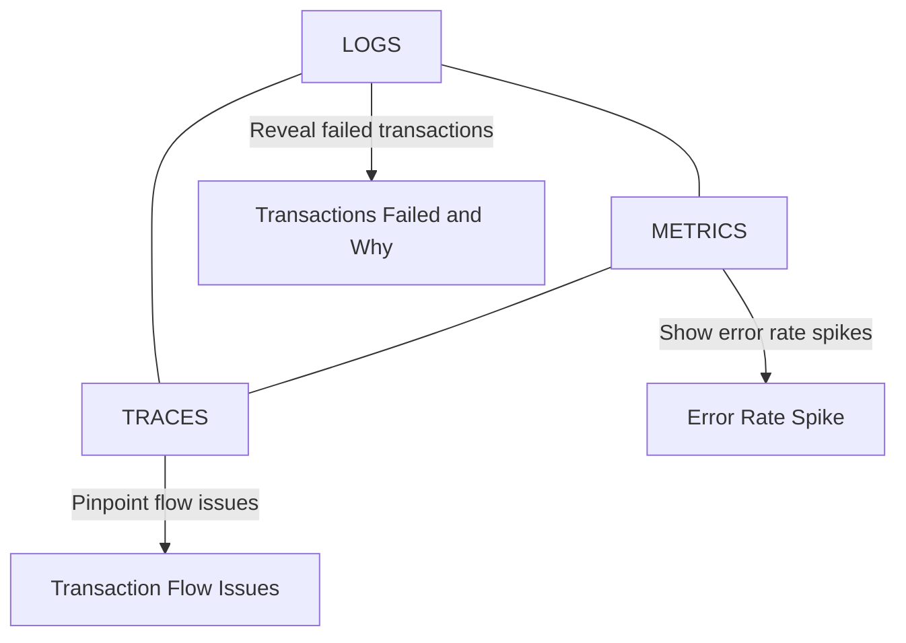

# Chapter 1: Green Wall Fallacy - The Horror of Banking System Monitoring

## Chapter Overview

Welcome to the horror show of banking system monitoring, where “all green” dashboards lull you into a false sense of security right up until the pager starts screaming at 2:17 AM. This chapter dissects the Green Wall Fallacy—the deadly belief that if your dashboards look fine, your customers must be happy. Spoiler: they aren’t. You’ll watch a parade of SREs and IT ops folks stumble through incidents while their tools lie, metrics mislead, and logs hide the truth like a mobster’s accountant. By the end, you’ll be equipped to turn your telemetry from a gaslighting accomplice into a brutally honest confessional. Forget vanity dashboards—learn how to force your systems to cough up the ugly truth, before your customers, your regulators, or your boss do it for you.

## Learning Objectives

- **Identify** the Green Wall Fallacy and recognize when dashboards are gaslighting you.
- **Differentiate** between resource metrics and meaningful customer-impact signals.
- **Develop** metric literacy to cut through dashboard noise in high-stress incidents.
- **Apply** evidence-based debugging: trust curl, not colors.
- **Implement** the Three Pillars of Observability (logs, metrics, traces) in concert, not isolation.
- **Design** structured telemetry that actually answers “who did we break and how?”
- **Integrate** observability data to move from clueless firefighting to precise root cause detection.
- **Build** system transparency so your stack stops lying and starts confessing.

## Key Takeaways

- The only thing worse than a red dashboard is a green one that’s lying to your face.
- CPU at 30% means nothing if your payment API is throwing 500s—dead bodies look healthy on resource graphs, too.
- Metric literacy isn’t optional; if you can’t tell which number matters, you’re just admiring a screensaver.
- Resource metrics are comfort food for ops dinosaurs. SREs eat customer-impact metrics for breakfast.
- If your logs say “ERROR: Something broke” and nothing else, congratulations: you’ve created Schrödinger’s outage.
- The Three Pillars are not a philosophy class—if your logs, metrics, and traces don’t agree, you don’t know what’s happening.
- Dashboards are for diagnosis, not decoration. If you want pretty colors, buy a lava lamp.
- System transparency isn’t a nice-to-have. In banking, regulatory fines don’t care how confident you look in front of a wall of green.
- “Green doesn’t mean good”—it means you’re not monitoring what actually matters. Make your system confess or get ready for public embarrassment.
- If user complaints are the only real signal you have, your monitoring is already obsolete. Fix it before the next 2AM wake-up.

## Panel 1: The Pager Screams
### Scene Description - Understanding the Green Wall Fallacy
**The Pager Screams** – Hector Alavaz gets paged in the middle of the night while the rainbow dashboard shows all green. Visual: chaos behind him, dashboard glowing like a rave.

*Expanded narrative: It's 2:17 AM. Hector Alavaz's phone vibrates violently on his nightstand. He's awake instantly—the practiced reflex of a veteran SRE. The screen shows a critical alert: "PAYMENT-PROCESSOR-PROD: Multiple customer impacts detected." He grabs his laptop, opens the monitoring dashboard. Everything is green. Every. Single. Indicator. Green.*
### Teaching Narrative - Understanding the Green Wall Fallacy
When critical alerts wake you during off-hours, your instinct might be to trust your monitoring dashboards. This common reaction exposes a fundamental gap between traditional monitoring and modern observability practices.
#### The Green Wall Fallacy Explained
The Green Wall Fallacy occurs when monitoring systems display a "wall of green" indicators suggesting normal operations while critical services are actually failing. This dangerous anti-pattern happens because:

1. **Misaligned Measurement Focus**: Dashboards often monitor system resources (CPU, memory) rather than user outcomes (successful transactions, completed operations).

2. **Secondary Signal Reliance**: The monitoring focuses on replica systems, read-only paths, or non-critical components that remain functional while primary systems fail.

3. **Delayed Indicator Updates**: Dashboards may display cached or aggregated data that hasn't updated to reflect current failures.

In the banking context, this fallacy creates particularly severe consequences. A payment processor might be rejecting transactions while monitoring dashboards remain stubbornly green, leading to:

- Financial impact: Failed transfers, missed settlements, incorrect balances
- Regulatory exposure: Delayed reporting of service disruptions
- Reputational damage: Customers experiencing failures before the bank acknowledges issues
### SRE Best Practice: Evidence-Based Investigation
When faced with conflicting signals (alerts vs. dashboards), the SRE approach prioritizes direct evidence gathering:

- Test critical endpoints directly (e.g., using curl commands)
- Check error rates and customer-facing metrics
- Verify primary system health, not just replicas
- Treat user reports as legitimate evidence, not "false positives"
### Implementation Guidance
To prevent Green Wall Fallacy in your financial systems:

1. **Outcome-Centric Metrics**: Monitor success rates of key operations (payments, transfers, account lookups)
2. **Primary Service Telemetry**: Ensure dashboards report on primary/write path health
3. **Real-User Monitoring**: Incorporate synthetic transactions that validate true customer experience
4. **Error Rate Prominence**: Make error metrics as visible as performance metrics

Remember: Green dashboards combined with user complaints represent a contradiction that must be resolved - and the users are usually right.

______________________________________________________________________
## Panel 2: Wanjiru Panics - Understanding Metric Literacy
### Scene Description

**Wanjiru Panics** – Wanjiru stares at metrics she doesn't understand while a VP yells about failing transactions. Visual: Slack alerts, Geneos blinking, her mouse hovering uncertainly.

*Expanded narrative: In the operations center, Wanjiru—a recent transfer from traditional IT operations—frantically clicks through Geneos dashboards. Nothing makes sense. All systems show nominal. Yet Slack channels are exploding with executive messages: "40% of international wire transfers failing! What's happening?" Wanjiru's mouse hovers uncertainly between screens. Which metric matters? What should she be looking for?*

#### Visual Representation of the Scene:
```mermaid
graph TD
    VP[VP yelling: "What's happening?"] -->|Pressure| Wanjiru[Wanjiru at desk]
    Wanjiru -->|Clicks| Dashboards[Geneos Dashboards]
    Wanjiru -->|Reads| Slack[Slack Alerts]
    Dashboards -->|Metrics look nominal| Confusion[Wanjiru confused]
    Slack -->|"40% of transactions failing"| Confusion
    Confusion -->|Uncertainty| Hover[Mouse hovering between screens]
```

*Key Elements:*
- **VP Yelling**: A senior executive demanding answers, increasing the pressure.
- **Dashboards**: Technical monitoring tools showing nominal metrics but no clear signals of the issue.
- **Slack Alerts**: Explosive executive messages about failing transactions.
- **Wanjiru's Confusion**: The gap between technical metrics and customer-impacting issues.
- **Mouse Hovering**: Symbolizing her indecision on what to focus on amidst the chaos.
### Teaching Narrative
When alerts are firing and executives are demanding answers, the pressure to find meaningful signals in your dashboards becomes intense. This scenario highlights a critical skill gap in many production support transitions to SRE: metric literacy.
#### Metric Literacy Explained
Metric Literacy is the ability to quickly interpret which metrics matter in a crisis and which are merely noise. This requires:

1. **Contextual Understanding**: Recognizing the relationship between technical metrics and business outcomes
2. **Signal Prioritization**: Identifying which metrics correlate with actual customer impact
3. **Cross-System Awareness**: Understanding how metrics from different systems relate to each other in a complex banking environment

In financial services, the metric literacy gap is particularly dangerous. While support teams scan performance dashboards showing stable CPU, memory, and throughput metrics, customers may be experiencing failed transfers, blocked account access, or incomplete settlements.
#### The Transition Challenge
Production support professionals moving to SRE roles often face this specific challenge:

- **Traditional monitoring mindset**: Looking at infrastructure health indicators (CPU, memory, disk)
- **Modern observability mindset**: Looking at customer experience indicators (success rates, error counts, latency outliers)

This paradigm shift is difficult precisely because the old indicators often look completely normal during real outages.
### Banking Implementation Guidance
To develop metric literacy in financial services:

1. **Create Business-Technical Metric Maps**: Document how each technical metric connects to business operations (e.g., how API latency impacts trade settlement times)

2. **Define Critical User Journeys**: Identify key customer transactions and the metrics that validate their successful completion

3. **Establish Cross-System Thresholds**: Determine when combinations of metrics across different systems indicate emerging problems

4. **Practice Crisis Correlation**: Run regular exercises where teams must quickly identify which metrics matter during simulated incidents

Remember Hector Alavaz's wisdom: dashboards aren't just for admiring - they're diagnostic tools that require active interpretation. Don't get hypnotized by the colors; focus on what the numbers mean for customer experience.
## Panel 3: What's Actually Broken? - Evidence-Based Debugging
### Scene Description

**What's Actually Broken?** – A terminal screenshot reveals `payment-service` 500s. Katherine says "CPU looks fine though."

*Expanded narrative: Katherine, the night shift engineer, opens a terminal window and runs a quick curl command against the payment API. The response: HTTP 500. He tries again. Same result. "Found it—payment-service is throwing 500s," he calls out. He switches to the performance dashboard. "But CPU is only at 30% utilization, memory looks fine, network traffic normal. The traditional metrics say nothing's wrong."*

#### Debugging Flow Summary:

### Teaching Narrative
When monitoring systems provide contradictory signals, SREs must rely on direct evidence gathering rather than dashboard interpretations. This panel illustrates the critical shift from assumption to verification.
#### Evidence-Based Debugging Explained
Evidence-Based Debugging is a systematic approach that prioritizes direct system interrogation over dashboard interpretation:

1. **Direct System Testing**: Probing endpoints and services directly with tools like curl, bypassing monitoring abstractions
2. **Response Verification**: Analyzing raw response codes and payloads rather than aggregated metrics
3. **Contradiction Resolution**: Addressing conflicts between what systems report (metrics) and what they actually do (responses)

In financial services, the gap between reported health and actual functionality often represents millions in transaction value. When a payment service returns HTTP 500 errors while dashboards show healthy CPU usage, the direct evidence takes precedence.
#### The Resource Monitoring Fallacy
A dangerous pattern in production support is overreliance on resource metrics:

- **Traditional approach**: "CPU and memory look normal, so the service must be fine"
- **SRE approach**: "The service is returning errors, so it's broken regardless of resource metrics"

This shift from inferring health to verifying functionality is foundational to effective incident response in modern banking systems.
### Banking Implementation Guidance
To implement evidence-based debugging in financial environments:

1. **Direct Health Checks**: Implement synthetic transactions that validate critical paths (transfers, payments, account inquiries)

2. **Response Code Monitoring**: Create dedicated dashboards that prominently display HTTP error counts by service

3. **Contradiction Alerting**: Generate alerts when direct health checks fail but resource metrics appear normal

4. **Runbook Verification**: Include direct system testing commands in all incident runbooks

Hector Alavaz's key insight - "CPU looks fine on a corpse, too" - reminds us that resource availability means nothing if the service isn't fulfilling its purpose. In banking systems, what matters is completed transactions, not utilized capacity.
## Panel 4: The Dashboard Is Lying - The Three Pillars Framework
### Scene Description
**The Dashboard Is Lying** – Hector Alavaz walks in holding coffee, asks: "Did you check logs, or are we just admiring the colors?"

*Expanded narrative: Hector Alavaz strides in, somehow looking perfectly composed despite the hour. He sips from a steaming coffee mug while surveying the chaos. His eyes move methodically between the frantic team and the cheerfully misleading green dashboard. "Did you check the actual logs," he asks dryly, "or are we just admiring the pretty colors?" The room falls silent.*
### Teaching Narrative
The most dangerous monitoring failure isn't when dashboards show red - it's when they falsely show green. Understanding the Three Pillars of Observability provides the framework to overcome dashboard deception.
### The Three Pillars Framework Explained
Modern observability relies on three interconnected pillars that together provide a complete system understanding:

1. **Logs**: Detailed records of discrete events and transactions

   - What happened at specific points in time
   - Includes context, errors, transaction details
   - Provides investigative depth

2. **Metrics**: Numerical measurements of system behavior

   - Aggregated data points over time
   - Shows patterns, trends, and anomalies
   - Provides operational overview

3. **Traces**: End-to-end visibility of transactions across services

   - Connects related events across distributed systems
   - Shows timing, dependencies, and bottlenecks
   - Provides causal understanding

The power comes when these pillars intersect: logs provide context for metric spikes, traces connect related logs, and metrics show when traces are abnormal.
### Financial Services Implementation
In banking systems, the Three Pillars form a critical regulatory and operational framework:

- **Logs**: Document regulatory compliance, security events, and transaction completeness
- **Metrics**: Demonstrate system performance, capacity management, and trend analysis
- **Traces**: Prove transaction integrity, timing compliance, and cross-border fund flows

Without all three working together, banks face both operational blindness and regulatory exposure. A security event might be logged, but without associated metrics and traces, its impact remains unknown.
### Implementation Guidance
To implement the Three Pillars effectively:

1. **Correlation IDs**: Ensure every transaction has a unique identifier that flows through all three pillars
2. **Consistency Checks**: Verify that logs, metrics, and traces tell the same story
3. **Gap Analysis**: Regularly assess which pillars are weak or disconnected
4. **Visualization Integration**: Design dashboards that show all three pillars in context

The Three Pillars aren't just technical tools - they're the foundation of a banking system that can defend its actions to regulators, explain failures to customers, and guide engineers during incidents.
## Panel 5: Context is Missing - Structured Telemetry Design
### Scene Description

**Context is Missing** – Juana shows the logs: missing trace IDs, vague errors. "Nice. It broke, and it didn't even tell us who it killed."

*Expanded narrative: Juana, the senior engineer, pulls up the log viewer. "Here's our problem," she points. The logs show errors, but they're generic—no transaction IDs, no trace context, no correlation identifiers. Just: 'ERROR: Transaction failed.' Hector Alavaz looks over her shoulder. 'Nice,' he deadpans. 'It broke, and it didn't even tell us who it killed. How are we supposed to find which transactions failed with this?'*

*Imagine trying to solve a puzzle with half the pieces missing and no picture on the box to guide you. That's exactly what debugging without proper telemetry feels like—frustrating, time-consuming, and often fruitless. Each missing piece of context—whether it’s a trace ID, a transaction ID, or the affected customer—turns a straightforward problem into a guessing game. What should be a clear chain of events is now a broken link, leaving engineers stranded without a way forward.*



*When logs are missing critical fields, it’s like looking at a broken chain—each missing link makes it impossible to trace the full story. This scene highlights just how much is lost when telemetry fails to provide the necessary context.*
### Teaching Narrative
Generic error logs without context are worse than useless - they create the illusion of visibility while providing no actionable information. This panel demonstrates how proper telemetry design transforms unintelligible noise into diagnostic clarity.
#### Structured Telemetry Design Explained
Structured Telemetry Design is an intentional approach to instrumentation that ensures all system outputs contain the context needed for diagnosis and correlation:

1. **Context Enrichment**: Adding relevant business and technical context to every log line
2. **Standard Formats**: Using consistent, parseable formats (typically JSON) for all telemetry
3. **Cross-System Correlation**: Including identifiers that link related events across services
4. **Impact Assessment**: Explicitly stating customer and business impact in the telemetry

In financial services, the difference between "ERROR: Transaction failed" and a properly structured log entry determines whether you can identify which customers are affected, what regulations might be violated, and where to begin remediation.
#### Critical Banking Context Fields
Financial systems require specific context in their telemetry:

- **Transaction IDs**: Unique identifiers for every financial transaction
- **Account Information**: Tokenized or masked account details
- **Regulatory Classification**: AML, KYC, or other compliance categories
- **Financial Impact**: Monetary value and settlement status
- **Customer Communication**: Notification status and timeline
- **Trace Context**: Distributed tracing correlation identifiers

Without these fields, telemetry creates dangerous blind spots - you know something is wrong but can't determine scope, impact, or recovery requirements.
### Implementation Guidance

To implement proper structured telemetry:

1. **Field Standards**: Define mandatory fields for all logs, metrics, and traces. For example, ensure every telemetry event includes fields like `transaction_id`, `trace_id`, `customer_id`, and `error_code`.

2. **Validation Checks**: Implement telemetry quality gates in CI/CD pipelines. These checks should validate that all logs follow the defined schema and include required fields. Below is a sample Python function for validating log entries against a predefined schema:

    ```python
    import jsonschema
    from jsonschema import validate

    # Define the schema for telemetry validation
    telemetry_schema = {
        "type": "object",
        "properties": {
            "transaction_id": {"type": "string"},
            "trace_id": {"type": "string"},
            "customer_id": {"type": "string"},
            "error_code": {"type": "string"},
            "timestamp": {"type": "string", "format": "date-time"}
        },
        "required": ["transaction_id", "trace_id", "customer_id", "error_code", "timestamp"]
    }

    # Function to validate a telemetry log entry
    def validate_telemetry(log_entry):
        try:
            validate(instance=log_entry, schema=telemetry_schema)
            print("Telemetry log is valid.")
        except jsonschema.exceptions.ValidationError as e:
            print(f"Telemetry validation error: {e.message}")

    # Example usage
    log_entry = {
        "transaction_id": "abc123",
        "trace_id": "def456",
        "customer_id": "cust789",
        "error_code": "ERR001",
        "timestamp": "2023-10-30T10:00:00Z"
    }
    validate_telemetry(log_entry)
    ```

3. **Enrichment Services**: Create centralized services that add context to raw telemetry. These services could automatically append trace identifiers, customer impact information, or regulatory classifications. Below is a simple workflow for a telemetry enrichment pipeline:

    ```mermaid
    graph TD
        A[Raw Telemetry Data] --> B{Enrichment Service}
        B --> C[Add Trace Context]
        B --> D[Add Business Impact Fields]
        B --> E[Append Compliance Metadata]
        E --> F[Structured and Enriched Telemetry]
    ```

4. **Schema Evolution**: Establish processes for extending telemetry as business needs change. Use versioned schemas and backward compatibility tests to ensure older log formats remain readable.

Juana's observation that "It broke, and it didn't even tell us who it killed" highlights the human cost of poor telemetry - without proper context, support teams can't provide answers to affected customers or executives, eroding trust and complicating recovery.
## Panel 6: Monologue from Hector Alavaz - Observability Integration
### Scene Description

**Monologue from Hector Alavaz** – He points to each pillar (Logs, Metrics, Traces) and explains what they could've revealed. Dramatic diagram in background.

*Expanded narrative: Hector Alavaz moves to the whiteboard and draws three overlapping circles labeled LOGS, METRICS, and TRACES. He gestures to the diagram as he speaks:*



*"This is what you're missing," he explains. "Proper logs would tell us exactly which transactions failed and why." He points to the connection between Logs and Transactions. "Relevant metrics would show us the error rate spike before customers complained." His finger moves to the link between Metrics and Errors. "And traces—" he taps the board emphatically, "—traces would show us exactly where in the transaction flow things went wrong." He highlights the path from Traces to Flow. "Without all three connected, you're just guessing. And banking systems don't tolerate guessing."*
### Teaching Narrative
The value of observability isn't in collecting data - it's in connecting it to form a complete diagnostic picture. This panel shows how integrating the three pillars creates a powerful system for understanding complex failures.
#### Observability Integration Explained
Observability Integration is the practice of connecting logs, metrics, and traces to create a unified view of system behavior:

1. **Cross-Pillar Navigation**: The ability to move seamlessly between related logs, metrics, and traces
2. **Consistent Identifiers**: Using the same correlation IDs across all telemetry types
3. **Unified Visualization**: Dashboards that show related data from all three pillars
4. **Root Cause Triangulation**: Using multiple data types to pinpoint failure origins

In banking systems, observability integration determines how quickly you can move from detecting a problem to understanding its cause, scope, and resolution path. Without integration, each team sees only a fragment of the whole picture.
### Financial Services Applications
Banking systems use integrated observability for critical functions:

- **Fraud Detection**: Correlating unusual transaction patterns (metrics) with specific events (logs) and transaction flows (traces)
- **Settlement Verification**: Confirming that funds moved correctly across multiple systems
- **Regulatory Compliance**: Demonstrating complete transparency for audit requirements
- **Customer Support**: Providing holistic transaction visibility to support personnel

When properly implemented, integrated observability transforms incident response from hours of fragmented investigation to minutes of focused diagnosis.
### Implementation Guidance
To achieve effective observability integration:

1. **Correlation Standards**: Define conventions for IDs that connect all telemetry
2. **Tool Integration**: Select observability platforms that provide cross-pillar navigation
3. **Workflow Design**: Create incident response processes that leverage all three pillars
4. **Visualization Strategy**: Build dashboards that show relationships between different telemetry types

Hector Alavaz's whiteboard diagram showing the three pillars with "Root Cause Detection" at their intersection represents the goal: a system where every component's behavior is connected and comprehensible, even during complex failures.
## Panel 7: Lesson Locked In - System Transparency
### Scene Description

**Lesson Locked In** – Wanjiru says, "So… green doesn't mean good." Hector Alavaz: "Green means the system's lying. Now let's teach it to confess."

*Expanded narrative: Understanding dawns on Wanjiru's face. "So... green doesn't mean good," she says slowly. "It just means we don't know what's bad." Hector Alavaz nods. "Green means the system's lying to you about its health," he confirms. "Now let's teach it to confess." He opens his laptop and begins typing rapidly, adding structured logging and trace context to the payment service while the team watches, learning.*

**Visual Representation (Text-Based)**:
```
[ System Health Indicator: Green ] ---> [ Assumed: All is well ]
                                          |
                                          v
                                [ Reality: Unknown issues ]

[ Enhanced Observability: Structured Logging + Traces ]
            ---> [ Indicator Updated: Reflects true system state ]
```

This diagram illustrates the false sense of security provided by the "green" status and how enhanced observability bridges the gap between perceived and actual system health.
### Teaching Narrative
The ultimate goal of observability is to make systems transparent - to eliminate the gap between what's happening and what we understand. This panel captures the transformative moment when a team realizes that dashboards don't define reality - they merely represent it.
### System Transparency Explained
System Transparency is the principle that systems should communicate their true state clearly and accurately:

1. **Truth Over Appearance**: Prioritizing accurate representation over reassuring visualizations
2. **Active Communication**: Systems that proactively report problems, not just respond to queries
3. **Contextual Honesty**: Providing full context around failures, not just symptoms
4. **User Impact Clarity**: Explicitly connecting technical failures to business outcomes

In banking environments, the gap between dashboard appearance and system reality represents significant risk. A "green" system that's actually failing creates false confidence, delayed response, and potential compliance violations.
#### The Confession Metaphor
Hector Alavaz's powerful statement that "Green means the system's lying. Now let's teach it to confess" captures a fundamental shift in thinking:

- **Traditional Monitoring**: Reading passive indicators about system status
- **Modern Observability**: Creating systems that actively communicate their true state

This active "confession" model transforms incident response from investigation to collaboration - the system itself becomes your most valuable incident responder by clearly articulating what's wrong.
### Implementation Guidance
To build transparent banking systems:

1. **Truth-First Design**: Design telemetry to prioritize accuracy over reassurance
2. **Active Notification**: Implement proactive alerting based on customer impact
3. **Context Prioritization**: Ensure all alerts include business context and impact assessment
4. **Impact Visualization**: Create dashboards that highlight customer experience, not just system resources

The transformation from "green doesn't mean good" to "teach it to confess" represents the core journey from traditional monitoring to modern observability - from systems we must interrogate to systems that actively communicate their true state.