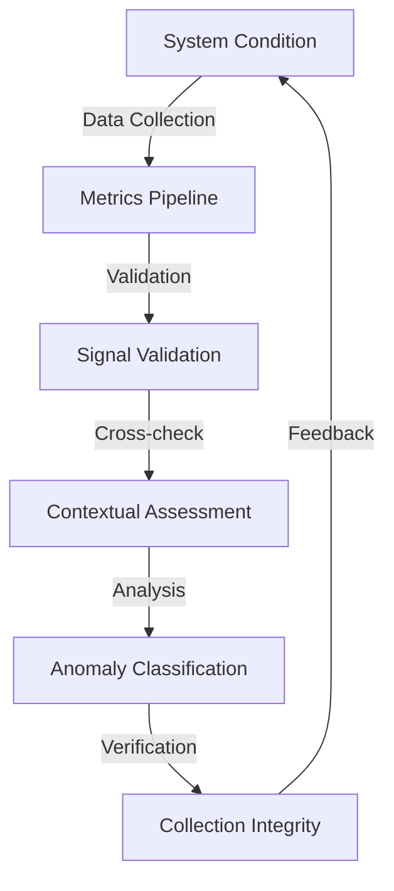
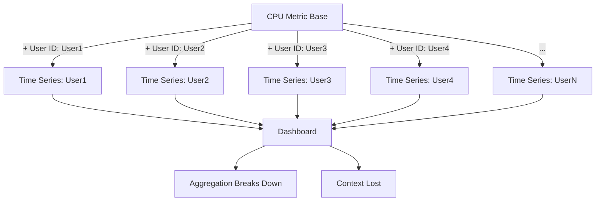
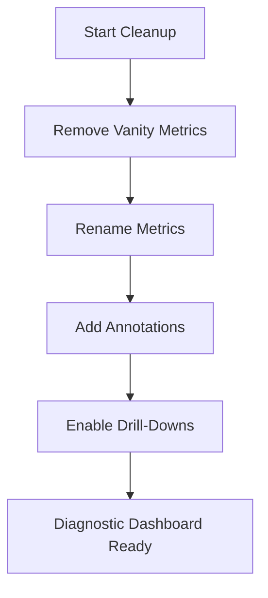

# Chapter 6: Metrics Aren't Just Numbers - They're Clues

## Chapter Overview

Welcome to the dark heart of metrics hell, where numbers lie, dashboards gaslight, and your “single pane of glass” is really just a kaleidoscope of confusion. This chapter is a forensic autopsy of why most metric systems are less Sherlock Holmes and more Inspector Clouseau—misleading, opaque, and likely to blow up in your face. We’ll dissect phantom spikes, cardinality explosions, naming abominations, and dashboards so noisy you’d get more clarity from a Magic 8 Ball. But there’s hope: we’ll show you how to turn your metrics from cryptic doodles into diagnostic scalpel—because in banking, the difference between “oops” and “audit committee” is knowing what your numbers actually mean.

## Learning Objectives

- **Diagnose** the reliability of metrics and identify when your telemetry is gaslighting you.
- **Design** measurement pipelines that avoid cardinality blowouts and keep dashboards readable.
- **Enforce** metric naming and taxonomy so nobody ever asks “what the hell is `agg_metric_report_perf_multi_v2`?”
- **Structure** observability data in hierarchies that map customer pain directly to underlying causes.
- **Distinguish** between noisy symptoms and actionable signals to shave hours off root cause analysis.
- **Refactor** dashboards into coherent, interactive narratives that surface what matters (and only what matters).
- **Recognize** causal patterns and correlate events across telemetry to avoid chasing random noise.
- **Treat** metrics as medical charts—interpreting, validating, and acting with surgical precision.
- **Communicate** system health in a way that even your least technical regulator can understand.

## Key Takeaways

- Not every CPU spike is real. If your dashboard says “panic” but nobody’s screaming, question your metrics—not your sanity.
- Tagging infrastructure metrics with user IDs? Congratulations, you’ve invented the DDoS attack on your own observability stack.
- If you can’t explain a metric’s name to a junior in under 10 seconds, it’s a liability, not an asset.
- Flat dashboards are for flat-earthers. Organize metrics by business impact or prepare for endless wild goose chases.
- Resource metrics are the weather report; functional metrics are the crime scene. Act accordingly.
- The only thing worse than a noisy dashboard is one that hides the real problem behind a wall of vanity metrics.
- “Change annotations” let you catch the moment when your system went from “fine” to “fire drill.” Use them, or keep playing whack-a-mole.
- Metrics should tell a story, not recite a random number generator. If they don’t, your incident reviews will read like Kafka novels.
- Clarity isn’t a luxury in banking observability—it’s the difference between catching a fraud spike and explaining it to the regulators after the fact.
- If your metrics aren’t understandable by every team that touches them, you’re one PTO day away from chaos.
- You don’t just want less noise—you want your system to *speak* to you. Otherwise, you’re just reading tea leaves before the next outage.

## Panel 1: The Phantom Spike - Metric Reliability
### Scene Description
**The Phantom Spike** – A metric chart shows high CPU, but the system feels fine. Sofia frowns: "Is that real?"

*Expanded narrative: Sofia stares at a monitoring dashboard showing an alarming CPU spike on the balance lookup service—utilization jumping from 30% to 85% in minutes. Yet customer complaints are nonexistent, and other performance indicators show normal operations. "Is that spike even real?" she wonders aloud. "The system seems fine, customers aren't complaining, but this graph looks like we're about to crash." The team gathers around, trying to reconcile the contradictory signals.*
### Teaching Narrative

This scene illustrates a fundamental challenge in metrics interpretation: distinguishing between significant signals and meaningless anomalies. Sofia's question—"Is that spike real?"—exemplifies the critical thinking needed when faced with contradictory indicators. Her instinct to question the metric rather than immediately react to it demonstrates the transition from monitoring to observability thinking.

#### Metric Reliability Explained
Metric Reliability is the degree to which a metric accurately represents the system condition it purports to measure. To ensure reliability, consider the following key aspects:

**Checklist for Metric Reliability:**
- **[ ] Signal Validation:** Verify that the metric accurately reflects actual system conditions.
- **[ ] Contextual Assessment:** Compare the metric's behavior against other indicators and real-world impacts.
- **[ ] Anomaly Classification:** Identify if the change is meaningful or caused by collection artifacts.
- **[ ] Collection Integrity:** Confirm the reliability of the metric collection and processing pipeline.

#### Text Diagram: Metric Reliability Flow


#### The Contradiction Problem
The contradiction Sofia observes—a dramatic CPU spike with no corresponding customer impact or other system symptoms—highlights a common scenario in observability: when metrics tell stories that don't align with reality. These contradictions often indicate issues with the metrics themselves rather than with the systems they monitor.

By following the checklist and the flow outlined above, teams can systematically evaluate metric reliability and avoid reactive decisions based on misleading signals.
### Banking Implementation Guidance
To improve metric reliability in financial systems:

1. **Cross-Validation Mechanisms**: Implement multiple, independent measurements of critical system conditions

2. **Reality Correlation**: Regularly verify metric behavior against known system states and customer experience

3. **Collection Monitoring**: Monitor the observability infrastructure itself for anomalies and failures

4. **Metric Confidence Scoring**: Develop frameworks for assessing and communicating the reliability of different metrics

Financial institutions should recognize that metric reliability isn't just a technical concern—it directly impacts operational decision-making and risk management. A false CPU spike might trigger unnecessary interventions that themselves create risk, while a false sense of normalcy might delay response to genuine issues affecting transactions, security, or compliance.
## Panel 2: Cardinality Explosion - Metric Design
### Scene Description

**Cardinality Explosion** – Clara pulls up metrics with thousands of user-tagged variations. Hector Alavaz mutters, "The dashboard's bleeding context."

*Expanded narrative: Clara investigates by examining the metric definition itself. Her eyes widen as she discovers the issue. "Look at this—we're tagging CPU metrics with user IDs." She displays the metadata showing thousands of unique time series being generated—one for each active user. Hector Alavaz looks over her shoulder and mutters, "The dashboard's bleeding context. You've got so many time series that the aggregation is meaningless. No wonder the graph looks unstable."*

#### Visualizing the Problem:


This flow illustrates how tagging CPU metrics with user IDs generates an explosion of unique time series (`Time Series: UserX`) for each user. The dashboard struggles to aggregate these, leading to instability and loss of interpretability (`Aggregation Breaks Down` and `Context Lost`).
### Teaching Narrative
This scene reveals a sophisticated observability problem: cardinality explosion. Clara's discovery that the team is tagging CPU metrics with user IDs exposes a fundamental metric design flaw—creating thousands of unique time series where a single aggregated measurement would be more appropriate. This pattern illustrates how well-intentioned instrumentation can create more confusion than clarity.
#### Metric Design Explained
Metric Design is the deliberate engineering of measurements to maximize diagnostic value while minimizing complexity:

1. **Cardinality Control**: Carefully selecting labels and dimensions to prevent explosion of unique time series

2. **Aggregation Strategy**: Determining the appropriate level of data consolidation for different use cases

3. **Label Selection**: Choosing dimension tags that provide meaningful segmentation without excessive granularity

4. **Storage Efficiency**: Designing metrics that balance detail with practical storage and query performance

In financial services, proper metric design addresses both technical and business needs. Banks must maintain detailed visibility into transaction processing while avoiding the performance issues, excessive costs, and analytical confusion that come with cardinality explosion.
#### The Context Bleeding Problem
Hector Alavaz's vivid description of the dashboard "bleeding context" captures a crucial insight: excessive cardinality doesn't just create technical problems—it fundamentally undermines the metrics' purpose by making them harder to interpret. When simple CPU measurements splinter into thousands of per-user variations, meaningful patterns become impossible to discern.
### Banking Implementation Guidance
To implement effective metric design in financial systems:

1. **Cardinality Budgeting**: Establish clear limits on the number of unique time series permitted for different metric types

2. **Label Hierarchy**: Create a structured approach to dimension tagging that prioritizes business-relevant segments

3. **Aggregation Planning**: Define explicit aggregation strategies for metrics at different observation levels

4. **Collection Impact Analysis**: Regularly assess the performance and cost implications of metric cardinality

The specific example of tagging CPU metrics with user IDs illustrates a common design mistake: applying high-cardinality dimensions to infrastructure metrics where they provide little diagnostic value. In financial systems, this practice not only creates technical problems but can obscure important patterns that affect transaction processing, security monitoring, and capacity planning.
## Panel 3: The Naming Nightmare - Metric Taxonomy
### Scene Description
**The Naming Nightmare** – Daniel shows a widget called `agg_metric_report_perf_multi_v2`. Nobody knows what it means.

*Expanded narrative: As the team continues investigating, Daniel points to another concerning indicator—a metric with the opaque name `agg_metric_report_perf_multi_v2`. "Anyone know what this actually measures?" he asks. Silence. He checks the documentation. Nothing. He asks each team. No one claims ownership. "So we've got a metric important enough to put on our main dashboard, but no one knows what it means or how to interpret changes?" The absurdity of the situation becomes clear.*
### Teaching Narrative

This scene illustrates another critical observability failure: incomprehensible metric naming. The metric Daniel highlights—with its vague, jargon-filled name and no supporting documentation—represents a complete breakdown in metric taxonomy. This pattern demonstrates how poor naming conventions can transform metrics from diagnostic tools into mysterious artifacts.

#### Metric Taxonomy Explained
Metric Taxonomy is the systematic organization and naming of measurements to ensure clarity and usability. The four key aspects of Metric Taxonomy are summarized below:

| **Aspect**                    | **Definition**                                                                          | **Why It Matters**                                                                        |
| ----------------------------- | --------------------------------------------------------------------------------------- | ----------------------------------------------------------------------------------------- |
| **Naming Conventions**        | Establishing clear, consistent patterns for metric names that communicate their meaning | Prevents confusion and ensures metrics can be easily interpreted across teams and systems |
| **Semantic Clarity**          | Ensuring that metric names clearly convey what is being measured and why it matters     | Helps users understand the purpose and context of metrics at a glance                     |
| **Classification Systems**    | Organizing metrics into logical categories based on their purpose and relationships     | Enables easier navigation, grouping, and analysis of related metrics                      |
| **Documentation Integration** | Connecting metrics to their definitions, ownership, and usage guidelines                | Provides transparency, accountability, and ensures metrics retain their meaning over time |

In financial services, effective metric taxonomy is essential for both operational and governance reasons. Banks need clear, unambiguous measurements of system performance, transaction processing, and compliance status—measurements that retain their meaning across team boundaries and over time.

#### The Interpretability Crisis
Daniel's question about a metric "important enough to put on our main dashboard" that no one understands highlights a common observability crisis: systems instrumented with metrics that have become uninterpretable. This crisis typically emerges gradually as metrics proliferate without governance, eventually reaching a point where the instrumentation itself becomes an obstacle to understanding.
### Banking Implementation Guidance
To implement effective metric taxonomy in financial systems:

1. **Naming Standard**: Create and enforce a consistent naming pattern for all metrics:

   ```
   [domain]_[entity]_[action]_[unit]
   payment_transaction_processing_duration_seconds
   ```

2. **Semantic Verification**: Review metric names to ensure they clearly communicate what is being measured

3. **Documentation Requirements**: Mandate that all metrics include definitions, ownership, and interpretation guidelines

4. **Legacy Cleanup**: Systematically identify and rename or retire metrics with unclear or inconsistent names

The specific example metric (`agg_metric_report_perf_multi_v2`) exhibits multiple taxonomy failures—it uses vague terms (`perf`, `multi`), includes implementation details (`agg`) rather than purpose, and indicates versioning (`v2`) without explaining what changed. In financial systems, this naming pattern creates significant operational risk by obscuring the meaning of potentially critical measurements.
## Panel 4: Metric Hygiene Time - Metric Hierarchy
### Scene Description

**Metric Hygiene Time** – Hector Alavaz redraws the metric stack on a whiteboard, replacing them with business KPIs and SLO-aligned graphs.

*Expanded narrative: Hector Alavaz moves to the whiteboard and sketches a new observability hierarchy. At the top: customer-facing metrics like "Balance Lookup Success Rate" and "Average Lookup Time." Below these: service-level indicators like API latency and error rates. At the foundation: resource metrics like CPU and memory. "Your dashboards should reflect this hierarchy," he explains. "Start with what customers experience, then drill down to explain why that experience is changing. Infrastructure metrics support diagnosis but shouldn't drive alerts."*

Here is the hierarchy Hector sketches on the whiteboard:

```
Customer Experience Layer
 └─ Metrics: Balance Lookup Success Rate, Average Lookup Time

    Service Performance Layer
    └─ Metrics: API Latency, Error Rates

        Resource Utilization Layer
        └─ Metrics: CPU Usage, Memory Usage
```

This layered representation reinforces the principle Hector emphasizes: begin with customer-facing metrics and drill down through service and resource layers to diagnose issues. Each layer builds on the one below, offering a clear path from business outcomes to technical root causes.
### Teaching Narrative
This scene demonstrates a transformative shift in metrics organization: moving from a flat collection of technical measurements to a structured hierarchy aligned with business outcomes. Hector Alavaz's whiteboard sketch represents a fundamental reframing—organizing metrics not by type (CPU, memory, network) but by relationship to customer experience. This hierarchical approach bridges the gap between technical indicators and business impact.
#### Metric Hierarchy Explained
Metric Hierarchy is the organization of measurements into layers of abstraction based on their relationship to business outcomes:

1. **Customer Experience Layer**: Metrics that directly reflect what users experience (success rates, response times)

2. **Service Performance Layer**: Indicators that measure how well services are performing their functions

3. **Resource Utilization Layer**: Measurements of the infrastructure resources supporting the services

4. **Causal Relationships**: Clear connections between metrics at different layers to support root cause analysis

In financial services, metric hierarchy provides both operational and business value. Operationally, it guides incident investigation from symptoms (transaction failures) to causes (service issues to resource constraints). Strategically, it connects technical operations to the business outcomes that actually matter to customers and stakeholders.
#### The Drilling Down Principle
Hector Alavaz's guidance to "start with what customers experience, then drill down" represents a crucial shift in observability thinking. Rather than starting with infrastructure metrics and trying to infer impact, this approach begins with customer outcomes and works backward to identify technical causes—a much more direct path to meaningful diagnosis.
### Banking Implementation Guidance
To implement metric hierarchy in financial systems:

1. **Outcome-Centric Organization**: Structure dashboards and metrics around customer journeys and financial transactions

2. **Causal Mapping**: Document how metrics at different layers relate to and influence each other

3. **Drilling Mechanisms**: Create navigation paths that allow moving from high-level outcomes to underlying causes

4. **Business Alignment**: Ensure that top-level metrics directly reflect the business services customers are trying to use

Financial institutions should recognize that metric hierarchy isn't just about organization—it's about connecting technical operations to business purpose. When metrics are structured to show how infrastructure supports services and services support customer transactions, both technical and business teams gain a shared understanding of how system behavior impacts organizational goals.
## Panel 5: Symptoms vs Signals - Metric Selection
### Scene Description

**Symptoms vs Signals** – Wanjiru points out a real issue: cache miss rate spiked. It correlates with latency, but isn't on the dashboard.

*Expanded narrative: Wanjiru, working quietly at her terminal, suddenly looks up. "I think I found something." She projects a graph not included on any dashboard: cache miss rate for the account data service. The line shows a dramatic increase beginning exactly when balance lookups started slowing down. "The cache is missing more often, forcing database reads. That explains the latency increase, but this metric isn't on any dashboard." Sofia nods slowly. "We're displaying symptoms like CPU, but not actual signals like cache effectiveness."*

#### Visual Timeline of Events

```mermaid
gantt
    title Cache Miss Spike and Latency Correlation
    dateFormat  HH:mm
    axisFormat  %H:%M
    section Event Timeline
    Cache Miss Rate Spike     :active, spike, 10:00, 30min
    Latency Increase Observed :active, latency, 10:05, 25min
    Database Reads Surge      :active, db_reads, 10:10, 20min
    Symptom Investigation     :crit, found_issue, 10:30, 15min
```


#### Cache Miss Rate vs Latency Graph Representation
```
Time  | Cache Miss Rate (%) | Latency (ms)
10:00 | 5                   | 200
10:05 | 25                  | 400
10:10 | 40                  | 700
10:15 | 35                  | 650
10:20 | 30                  | 600
```

The timeline and data above illustrate how the increase in cache miss rate directly correlates with the observed rise in latency. This highlights the importance of monitoring causal signals, such as cache effectiveness, alongside general resource metrics like CPU.
### Teaching Narrative
This scene reveals a critical insight in metric selection: the difference between symptoms and signals. Wanjiru's discovery of the cache miss metric demonstrates how focusing on the right measurements—those that directly indicate functional changes rather than resource effects—can dramatically accelerate diagnosis. This pattern highlights the importance of instrumenting causal factors, not just their downstream effects.
#### Metric Selection Explained
Metric Selection is the strategic choice of which system aspects to measure for maximum diagnostic value:

1. **Signal Prioritization**: Identifying and surfacing metrics that provide direct insight into system behavior

2. **Causal Visibility**: Instrumenting the mechanisms that drive system performance, not just their effects

3. **Leading Indicators**: Selecting metrics that predict problems before they fully manifest

4. **Functional Focus**: Measuring how well components perform their functions, not just their resource consumption

In financial services, effective metric selection is particularly important for complex transaction processing systems. Banks need visibility into the specific mechanisms that affect transaction success—cache hits, queue depths, connection pools—not just the general system resources that support them.
#### The Signal-Symptom Distinction
Sofia's observation about "displaying symptoms like CPU, but not actual signals like cache effectiveness" captures a fundamental observability principle: the most valuable metrics are those that directly indicate functional changes in the system. CPU utilization is a symptom that something is happening; cache miss rate is a signal of what's actually happening.
### Banking Implementation Guidance
To implement effective metric selection in financial systems:

1. **Functional Instrumentation**: Identify and measure the specific mechanisms that affect transaction processing

2. **Causal Analysis**: Map the relationship between functional metrics and customer experience

3. **Signal Inventory**: Create a catalog of high-value metrics that provide direct insight into system behavior

4. **Dashboard Prioritization**: Ensure that the most informative signals are prominently displayed and monitored

Wanjiru's discovery of the cache miss metric exemplifies the value of functional instrumentation. In financial systems, where complex transaction flows involve multiple caching layers, connection pools, and processing queues, instrumenting these functional components provides much more diagnostic value than simply measuring the CPU and memory they consume.
## Panel 6: Dashboard Cleanup Begins - Visualization Design
### Scene Description

**Dashboard Cleanup Begins** – Team removes unnecessary panels and renames core metrics. Clara adds a timeline overlay.

*Expanded narrative: The team launches an immediate dashboard renovation. They remove vanity metrics and redundant indicators. They rename obscure metrics with clear, purpose-driven titles. Clara implements a change annotation system showing deployments, configuration changes, and scaling events directly on the graphs. Daniel adds drill-down capabilities linking metrics to relevant logs and traces. The dashboard transforms from a confusing collection of numbers into a diagnostic narrative.*

#### Key Steps in Dashboard Cleanup
```text
1. **Remove Vanity Metrics**: Eliminate metrics that do not contribute to actionable insights.
2. **Rename Metrics**: Replace obscure or unclear metric names with clear, purpose-driven titles.
3. **Add Annotations**: Introduce a change annotation system to correlate events (e.g., deployments, scaling) with metric behavior.
4. **Enable Drill-Downs**: Link metrics to related logs and traces for deeper investigation.
```

#### Dashboard Cleanup Workflow (Text Diagram)

### Teaching Narrative
This scene demonstrates the practical application of visualization design principles to transform dashboards from data displays into diagnostic tools. The team's systematic approach—removing noise, clarifying labels, adding context, enabling navigation—represents a holistic redesign focused on usability and diagnostic value. This pattern illustrates how effective visualization transforms raw metrics into actionable insights.
#### Visualization Design Explained
Visualization Design is the deliberate crafting of data presentations to maximize understanding and utility:

1. **Signal Amplification**: Highlighting the most important information while reducing visual noise

2. **Contextual Integration**: Embedding relevant context directly into visualizations

3. **Narrative Structure**: Arranging metrics to tell a coherent story about system behavior

4. **Interactive Pathways**: Creating navigation paths that support investigation workflows

In financial services, visualization design serves both operational and governance needs. Operationally, well-designed dashboards accelerate incident response by making patterns and anomalies immediately apparent. From a governance perspective, they provide clear evidence of system health and risk status for both internal and regulatory oversight.
#### The Change Annotation Value
Clara's addition of "a change annotation system showing deployments, configuration changes, and scaling events" represents a particularly valuable visualization practice. By directly correlating metric behavior with system changes, this approach transforms dashboards from passive displays into active investigative tools that connect effects with potential causes.
### Banking Implementation Guidance
To implement effective visualization design in financial systems:

1. **Purpose-Driven Layouts**: Design dashboards around specific use cases and questions they need to answer

2. **Change Correlation**: Implement automatic annotation of system changes directly on metric visualizations

3. **Drill-Down Paths**: Create navigation links between related metrics, logs, and traces

4. **Signal-Noise Ratio**: Regularly audit dashboards to remove unnecessary metrics and visual elements

The team's dashboard renovation demonstrates how visualization design isn't just aesthetic—it's functional. In financial systems, where rapid diagnosis directly impacts transaction success and regulatory compliance, well-designed visualizations aren't a luxury—they're essential operational tools that determine how quickly teams can identify and resolve issues affecting customer money movement.
## Panel 7: Reality Revealed - Pattern Recognition
### Scene Description
**Reality Revealed** – The newly trimmed panel layout clearly shows that a cache drift caused the balance lookup issue.

*Expanded narrative: Within the simplified dashboard, the story becomes clear: A configuration change reduced cache TTL (time-to-live) values, causing excessive cache misses. This increased database load, which affected CPU utilization. The metrics now tell a coherent story—from root cause (configuration change) through mechanism (cache behavior) to symptoms (resource utilization). What was previously a confusing collection of unrelated numbers now reveals a clear narrative about system behavior.*
### Teaching Narrative
This scene illustrates the ultimate goal of observability: transforming data into understanding. The team's dashboard redesign doesn't just make metrics prettier—it makes the underlying system behavior comprehensible. Through the simplified visualization, a complex chain of causality becomes visible: configuration change → cache behavior → database load → CPU utilization. This pattern demonstrates how effective observability converts technical measurements into actionable narratives.
#### Pattern Recognition Explained
Pattern Recognition in observability is the identification of meaningful relationships in telemetry data:

1. **Causal Chains**: Identifying sequences of events that connect actions to outcomes

2. **Temporal Correlation**: Recognizing how different metrics change in relation to each other over time

3. **Behavior Signatures**: Learning to recognize characteristic patterns that indicate specific system conditions

4. **Anomaly Detection**: Distinguishing between normal variations and significant deviations

In financial services, pattern recognition is essential for both proactive and reactive observability. Proactively, it enables teams to identify potential issues before they affect customers. Reactively, it accelerates diagnosis by helping teams quickly recognize familiar patterns during incidents.
#### The Narrative Emergence
The description of metrics now telling "a coherent story—from root cause through mechanism to symptoms" highlights a fundamental characteristic of effective observability: narrative emergence. When properly designed and visualized, metrics don't just present numbers—they tell stories about system behavior that humans can understand and act upon.
### Banking Implementation Guidance
To enhance pattern recognition in financial observability:

1. **Causal Visualization**: Design dashboards that visually highlight cause-and-effect relationships

2. **Temporal Alignment**: Ensure that related metrics share consistent time scales and reference points

3. **Pattern Libraries**: Document common failure patterns and their characteristic metric signatures

4. **Training Exercises**: Conduct regular sessions to help teams recognize important patterns

The cache TTL issue revealed in this scene exemplifies a common class of problems in financial systems: seemingly minor configuration changes that cascade into customer-impacting performance issues. By designing observability systems that make these causal chains visible, banks can both resolve incidents more quickly and prevent similar issues in the future through more careful change management.
## Panel 8: Lesson Locked In - Metrics as Diagnosis
### Scene Description
**Lesson Locked In** – Hector Alavaz: "Metrics are medical charts. If you don't know how to read them, you're just looking at patient doodles."

*Expanded narrative: Hector Alavaz reviews the team's work with approval. "Metrics are like medical charts," he observes. "They need to tell a coherent story about the patient's condition. If you don't know how to read them—or worse, if they're recording the wrong things—you're just looking at patient doodles." He points to the new dashboard. "Now your metrics tell a story anyone can understand: what happened, when it happened, and why it matters to customers."*
### Teaching Narrative
Hector Alavaz's medical analogy captures a profound truth about metrics: they're diagnostic tools, not just status displays. His comparison of poorly designed metrics to "patient doodles" perfectly illustrates how metrics without proper design, organization, and interpretation provide the illusion of understanding without the substance. This framing shifts the concept of metrics from passive measurements to active diagnostic instruments.
#### Metrics as Diagnosis Explained
The diagnostic view of metrics focuses on their role in understanding system health and behavior:

1. **Symptom Identification**: Recognizing signs of system distress through metric patterns

2. **Differential Diagnosis**: Using multiple metrics to distinguish between different potential causes

3. **Treatment Validation**: Confirming the effectiveness of interventions through metric changes

4. **Health Monitoring**: Tracking system vitality through ongoing measurement of key indicators

In financial services, the diagnostic model of metrics aligns perfectly with operational needs. Banking systems, like patients, require continuous monitoring of vital signs, prompt identification of concerning symptoms, accurate diagnosis of underlying issues, and verification that treatments (fixes) have been effective.
#### The Readability Requirement
Hector Alavaz's emphasis on metrics that "tell a story anyone can understand" highlights a crucial but often overlooked requirement: metrics must be interpretable not just by their creators, but by anyone who might need to use them during an incident. This readability is especially important in financial systems, where issues may require collaboration across multiple technical and business teams.
### Banking Implementation Guidance
To implement the diagnostic view of metrics in financial systems:

1. **Health Indicators**: Define clear metrics that represent the overall health of key banking services

2. **Diagnostic Patterns**: Document the characteristic metric signatures of common issues

3. **Treatment Protocols**: Create standard responses to specific metric patterns, linking diagnosis to remediation

4. **Cross-Team Readability**: Design metrics and visualizations to be interpretable by both technical and business stakeholders

Hector Alavaz's conclusion that the new dashboard now tells "what happened, when it happened, and why it matters to customers" captures the essence of effective financial system observability: connecting technical telemetry to business impact. When metrics tell this complete story, they transform from abstract numbers into valuable tools for maintaining the reliability and performance of critical banking services.
## Panel 9: Epilogue Panel - Communication Design
### Scene Description
**Epilogue Panel** – Sofia: "We made it less noisy." Hector Alavaz: "No. You made it *speak.*"

*Expanded narrative: As the team implements the fix for the cache configuration issue, Sofia reflects on the transformation. "We made the dashboard less noisy," she observes. Hector Alavaz shakes his head slightly. "No," he corrects. "You made it *speak*. Before, it was shouting random numbers. Now it's telling you exactly what's happening in language anyone can understand." The final panel shows the dashboard with new, clearly labeled metrics showing healthy operations—and a minor anomaly immediately drawing attention to a potential emerging issue.*
### Teaching Narrative
This closing exchange captures the fundamental transformation in how the team views metrics: from passive data to active communication. Hector Alavaz's distinction between reducing noise and enabling speech represents a profound shift in perspective—from thinking about what metrics show to focusing on what they say. This framing completes the journey from seeing metrics as numbers to understanding them as a form of system communication.
#### Communication Design Explained
Communication Design in observability focuses on how systems express their state to humans:

1. **Clarity of Voice**: Designing metrics and visualizations that communicate clearly and unambiguously

2. **Intentional Vocabulary**: Creating a consistent, meaningful language of metrics across the system

3. **Narrative Structure**: Organizing telemetry to tell coherent stories about system behavior

4. **Attention Direction**: Guiding observers to what matters most in a given context

In financial services, effective communication design addresses a critical challenge: the complexity of modern banking systems exceeds what humans can directly comprehend. Well-designed metrics serve as translators, converting complex system behaviors into narratives that operators, engineers, and business stakeholders can understand and act upon.
#### The Speaking System
Hector Alavaz's characterization of the dashboard now "telling you exactly what's happening in language anyone can understand" represents the ultimate goal of observability: systems that effectively communicate their state to humans. This communication isn't just about data display—it's about creating a shared understanding between systems and the people responsible for them.
### Banking Implementation Guidance
To implement communication design in financial systems:

1. **Telemetry Language**: Create a consistent, meaningful vocabulary for how systems express their state

2. **Narrative Dashboards**: Design visualizations that tell coherent stories about system behavior

3. **Attention Engineering**: Implement techniques that direct focus to the most important information

4. **Cross-Audience Readability**: Ensure metrics communicate effectively to both technical and business stakeholders

The final visual of the dashboard showing "a minor anomaly immediately drawing attention" demonstrates how effective communication design doesn't just explain past events—it highlights emerging issues before they become serious problems. In financial systems, where early detection can prevent customer impact and regulatory issues, this proactive communication capability provides significant operational and business value.